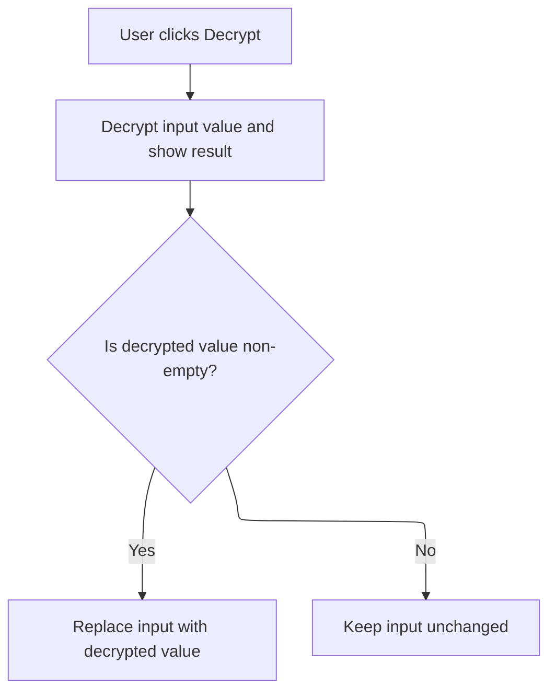

This document describes how the application form is prepared for user interaction. On launch, client settings are loaded, the server connection is established, user information is displayed, and the environment is secured. Password loading and decryption complete the setup.

# Form Initialization and Environment Setup

<SwmSnippet path="/warnet/Client/clnonline.frm" line="716">

---

In <SwmToken path="warnet/Client/clnonline.frm" pos="716:4:4" line-data="Private Sub Form_Load()">`Form_Load`</SwmToken>, we first make sure only one instance of the app runs by checking <SwmToken path="warnet/Client/clnonline.frm" pos="717:2:4" line-data="If App.PrevInstance Then Unload Me: End">`App.PrevInstance`</SwmToken> and exiting if needed. <SwmToken path="warnet/Client/clnonline.frm" pos="718:0:0" line-data="Picture2.Visible = False">`Picture2`</SwmToken> is hidden, and then we call LAYAR to handle the form's layout and positioning before anything else happens.

```visual basic
Private Sub Form_Load()
If App.PrevInstance Then Unload Me: End
Picture2.Visible = False
LAYAR
```

---

</SwmSnippet>

<SwmSnippet path="/warnet/Client/clnonline.frm" line="743">

---

LAYAR makes the form full screen, centers <SwmToken path="warnet/Client/clnonline.frm" pos="750:2:2" line-data="With Picture1">`Picture1`</SwmToken>, and docks <SwmToken path="warnet/Client/clnonline.frm" pos="753:2:2" line-data="With Picture3">`Picture3`</SwmToken> to the bottom left. This sets up the UI layout for the rest of the flow.

```visual basic
Private Sub LAYAR()
With Me
    .Width = Screen.Width
    .Height = Screen.Height
    .Top = 0
    .Left = 0
    End With
With Picture1
    .Move (Screen.Width - .Width) \ 2, (Screen.Height - .Height) \ 2
    End With
With Picture3
    .Move (0), (Screen.Height - .Height)
    End With
End Sub
```

---

</SwmSnippet>

<SwmSnippet path="/warnet/Client/clnonline.frm" line="720">

---

Back in <SwmToken path="warnet/Client/clnonline.frm" pos="716:4:4" line-data="Private Sub Form_Load()">`Form_Load`</SwmToken>, after setting up the layout, we call CLIENTDATA to load client-specific settings from file and push them into the UI and variables.

```visual basic
CLIENTDATA
```

---

</SwmSnippet>

<SwmSnippet path="/warnet/Client/clnonline.frm" line="835">

---

CLIENTDATA reads four lines from <SwmPath>[warnet/Client/clientsdata.txt](warnet/Client/clientsdata.txt)</SwmPath>, loads them into variables for IP, port, user, and picture path, and updates the UI fields to match.

```visual basic
Private Sub CLIENTDATA()
Dim intFileHandle As Integer
Dim strRETP As String
intFileHandle = FreeFile
Open App.Path + "\clientsdata.txt" For Input As #intFileHandle
Line Input #intFileHandle, strRETP: IPVALUE = strRETP: st1.Text = strRETP
Line Input #intFileHandle, strRETP: PORTVALUE = strRETP: st2.Text = strRETP
Line Input #intFileHandle, strRETP: USERVALUE = strRETP: st3.Text = strRETP
Line Input #intFileHandle, strRETP: Picpath = strRETP: st4.Text = strRETP
Close #intFileHandle
End Sub
```

---

</SwmSnippet>

<SwmSnippet path="/warnet/Client/clnonline.frm" line="721">

---

Back in <SwmToken path="warnet/Client/clnonline.frm" pos="716:4:4" line-data="Private Sub Form_Load()">`Form_Load`</SwmToken>, after loading client data, we call <SwmToken path="warnet/Client/clnonline.frm" pos="721:0:0" line-data="TranslucentForm Me, 240">`TranslucentForm`</SwmToken> to set the form's transparency, making the UI less intrusive or visually distinct.

```visual basic
TranslucentForm Me, 240
```

---

</SwmSnippet>

<SwmSnippet path="/warnet/Client/Module1.bas" line="27">

---

<SwmToken path="warnet/Client/Module1.bas" pos="27:4:4" line-data="Public Function TranslucentForm(Frm As Form, TranslucenceLevel As Byte) As Boolean">`TranslucentForm`</SwmToken> uses Windows API to enable layered window style and set the form's alpha transparency. It returns success/failure, but the caller doesn't check it.

```visual basic
Public Function TranslucentForm(Frm As Form, TranslucenceLevel As Byte) As Boolean
SetWindowLong Frm.hwnd, GWL_EXSTYLE, WS_EX_LAYERED
SetLayeredWindowAttributes Frm.hwnd, 0, TranslucenceLevel, LWA_ALPHA
TranslucentForm = Err.LastDllError = 0
End Function
```

---

</SwmSnippet>

<SwmSnippet path="/warnet/Client/clnonline.frm" line="722">

---

Back in <SwmToken path="warnet/Client/clnonline.frm" pos="716:4:4" line-data="Private Sub Form_Load()">`Form_Load`</SwmToken>, after setting transparency, we call <SwmToken path="warnet/Client/clnonline.frm" pos="722:0:0" line-data="SetWindowOnTop Me, True">`SetWindowOnTop`</SwmToken> to keep the form above all other windows, locking focus on the app.

```visual basic
SetWindowOnTop Me, True
```

---

</SwmSnippet>

<SwmSnippet path="/warnet/Client/Module1.bas" line="20">

---

<SwmToken path="warnet/Client/Module1.bas" pos="20:4:4" line-data="Public Function SetWindowOnTop(F As Form, bAlwaysOnTop As Boolean)">`SetWindowOnTop`</SwmToken> uses <SwmToken path="warnet/Client/Module1.bas" pos="23:0:0" line-data="SetWindowPos F.hwnd, iFlag, F.Left / Screen.TwipsPerPixelX, F.Top / Screen.TwipsPerPixelY, _">`SetWindowPos`</SwmToken> to set the form's Z order (topmost or not) and converts VB6 twip units to pixels for the API call.

```visual basic
Public Function SetWindowOnTop(F As Form, bAlwaysOnTop As Boolean)
Dim iFlag As Long
iFlag = IIf(bAlwaysOnTop, HWND_TOPMOST, HWND_NOTOPMOST)
SetWindowPos F.hwnd, iFlag, F.Left / Screen.TwipsPerPixelX, F.Top / Screen.TwipsPerPixelY, _
F.Width / Screen.TwipsPerPixelX, F.Height / Screen.TwipsPerPixelY, SWP_NOACTIVATE Or SWP_SHOWWINDOW
End Function
```

---

</SwmSnippet>

<SwmSnippet path="/warnet/Client/clnonline.frm" line="723">

---

Back in <SwmToken path="warnet/Client/clnonline.frm" pos="716:4:4" line-data="Private Sub Form_Load()">`Form_Load`</SwmToken>, after setting window properties, we update the UI label with user/port/IP info, then call <SwmToken path="warnet/Client/clnonline.frm" pos="724:0:0" line-data="CmConnect_Click">`CmConnect_Click`</SwmToken> to start the connection process.

```visual basic
TXsays.Caption = USERVALUE & ": " & PORTVALUE & " / " & IPVALUE
CmConnect_Click
```

---

</SwmSnippet>

<SwmSnippet path="/warnet/Client/clnonline.frm" line="650">

---

<SwmToken path="warnet/Client/clnonline.frm" pos="650:4:4" line-data="Private Sub CmConnect_Click()">`CmConnect_Click`</SwmToken> closes any existing socket connection, sets the remote host/port, and tries to connect to the server using those values.

```visual basic
Private Sub CmConnect_Click()
sock1.Close
sock1.RemoteHost = IPVALUE
sock1.RemotePort = PORTVALUE
sock1.Connect
End Sub
```

---

</SwmSnippet>

<SwmSnippet path="/warnet/Client/clnonline.frm" line="725">

---

Back in <SwmToken path="warnet/Client/clnonline.frm" pos="716:4:4" line-data="Private Sub Form_Load()">`Form_Load`</SwmToken>, after starting the connection, we call WINLOCKCLOSE to disable system shortcuts and prevent the user from leaving or disrupting the app.

```visual basic
WINLOCKCLOSE
```

---

</SwmSnippet>

<SwmSnippet path="/warnet/Client/clnonline.frm" line="859">

---

WINLOCKCLOSE disables Alt+Tab, task switching, Task Manager, and Ctrl+Alt+Del, locking the user into the app environment.

```visual basic
Private Sub WINLOCKCLOSE()
    AltTab2_Enable_Disable 0, False
    TaskSwitching_Enable_Disable (False)
    TaskManager_Enable_Disable (False)
    CtrlAltDel_Enable_Disable (False)
End Sub
```

---

</SwmSnippet>

<SwmSnippet path="/warnet/Client/clnonline.frm" line="726">

---

Back in <SwmToken path="warnet/Client/clnonline.frm" pos="716:4:4" line-data="Private Sub Form_Load()">`Form_Load`</SwmToken>, after locking down the system, we call PASSVALUES to load and process the password needed for the next steps.

```visual basic
PASSVALUES
```

---

</SwmSnippet>

## Password Loading and Processing

<SwmSnippet path="/warnet/Client/clnonline.frm" line="729">

---

In PASSVALUES, we read the password from <SwmPath>[warnet/Client/mwarnet.pwd](warnet/Client/mwarnet.pwd)</SwmPath>, put it in <SwmToken path="warnet/Client/clnonline.frm" pos="736:0:0" line-data="Text1.Text = pssd">`Text1`</SwmToken>, and immediately call <SwmToken path="warnet/Client/clnonline.frm" pos="737:0:0" line-data="cmDecrypt_Click">`cmDecrypt_Click`</SwmToken> to decrypt it for use.

```visual basic
Public Sub PASSVALUES()
On Error GoTo t
Dim intFileHandle As Integer
Dim pssd As String
intFileHandle = FreeFile
Open App.Path + "\mwarnet.pwd" For Input As #1
Input #intFileHandle, pssd
Text1.Text = pssd
cmDecrypt_Click
```

---

</SwmSnippet>

### Password Decryption



<SwmSnippet path="/warnet/Client/clnonline.frm" line="657">

---

In <SwmToken path="warnet/Client/clnonline.frm" pos="657:4:4" line-data="Private Sub cmDecrypt_Click()">`cmDecrypt_Click`</SwmToken>, we call decrypted(3, <SwmToken path="warnet/Client/clnonline.frm" pos="658:11:13" line-data="Text2.Text = decrypted(3, Text1.Text)">`Text1.Text`</SwmToken>) to decode the password and put the result in <SwmToken path="warnet/Client/clnonline.frm" pos="658:0:0" line-data="Text2.Text = decrypted(3, Text1.Text)">`Text2`</SwmToken>.

```visual basic
Private Sub cmDecrypt_Click()
Text2.Text = decrypted(3, Text1.Text)
```

---

</SwmSnippet>

<SwmSnippet path="/warnet/Client/Module3.bas" line="32">

---

Decrypted subtracts the key value from each character's ASCII code in the input string, building the decrypted result. Errors show a message and return the original string.

```visual basic
Public Function decrypted(key1 As String, DataSource As String) As String
Dim letter As String
Dim data As String
Dim x As Integer

For x = 1 To Len(DataSource)
letter = Asc(Mid(DataSource, x, 1))
On Error GoTo errval
data = data & Chr(Val(letter) - Val(key1))
Next x

If data = "" Then
MsgBox "Error: Val" & letter & " + " & key1, vbCritical, "Error Val" & letter & " + " & key1
decrypted = DataSource
ElseIf data <> "" Then
decrypted = data
End If
Exit Function
errval:
MsgBox "Error: Val" & letter & " - " & key1, vbCritical, "Error Val" & letter & " - " & key1
decrypted = DataSource
End Function
```

---

</SwmSnippet>

<SwmSnippet path="/warnet/Client/clnonline.frm" line="659">

---

Back in <SwmToken path="warnet/Client/clnonline.frm" pos="657:4:4" line-data="Private Sub cmDecrypt_Click()">`cmDecrypt_Click`</SwmToken>, if decryption worked (<SwmToken path="warnet/Client/clnonline.frm" pos="659:2:2" line-data="If Text2.Text &lt;&gt; &quot;&quot; Then">`Text2`</SwmToken> isn't empty), we update <SwmToken path="warnet/Client/clnonline.frm" pos="660:0:0" line-data="Text1.Text = Text2.Text">`Text1`</SwmToken> with the decrypted password.

```visual basic
If Text2.Text <> "" Then
Text1.Text = Text2.Text
End If
End Sub
```

---

</SwmSnippet>

### Password File Cleanup

<SwmSnippet path="/warnet/Client/clnonline.frm" line="738">

---

Back in PASSVALUES, we close the password file and exit, or handle errors if something went wrong.

```visual basic
Close #intFileHandle
Exit Sub
t:
End Sub
```

---

</SwmSnippet>

## Finalization of Form Load

<SwmSnippet path="/warnet/Client/clnonline.frm" line="727">

---

Back in <SwmToken path="warnet/Client/clnonline.frm" pos="716:4:4" line-data="Private Sub Form_Load()">`Form_Load`</SwmToken>, after PASSVALUES, the setup is done and the form is ready for whatever comes next.

```visual basic
End Sub
```

---

</SwmSnippet>

&nbsp;

*This is an auto-generated document by Swimm 🌊 and has not yet been verified by a human*

<SwmMeta version="3.0.0" repo-id="Z2l0aHViJTNBJTNBY3RzLVZCNi1Qcm9qZWN0cyUzQSUzQVN3aW1tLURlbW8=" repo-name="cts-VB6-Projects"><sup>Powered by [Swimm](https://app.swimm.io/)</sup></SwmMeta>
