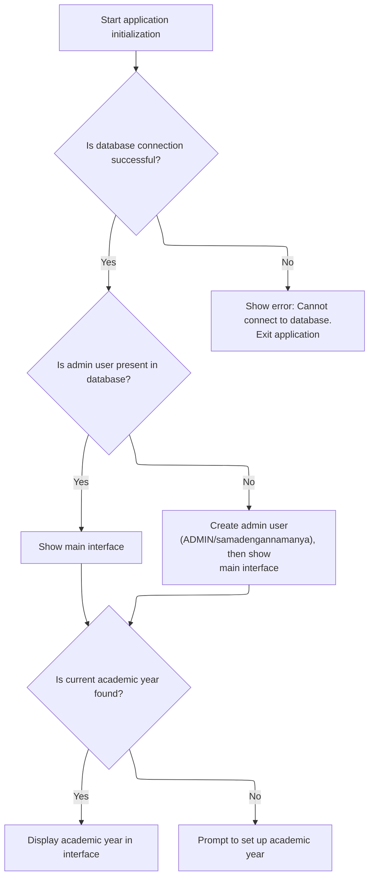

This document describes the startup flow that prepares the application for user interaction. On startup, the application connects to the database, ensures an admin user exists, displays the main interface, and sets up the active academic year, prompting the user if needed. The result is a ready-to-use interface with all necessary context.

# Startup: Database Connection, User Bootstrapping, and Active Year Selection



<SwmSnippet path="/BK App/Modul/Module1.bas" line="52">

---

In <SwmToken path="BK App/Modul/Module1.bas" pos="52:4:4" line-data="Public Sub Main()">`Main`</SwmToken>, we set up the database connection string and prepare an SQL statement to insert a default admin user. We open the connection and immediately call <SwmToken path="BK App/Modul/Module1.bas" pos="59:3:3" line-data="If (connectDB(STR_Conn) &gt; 0) Then">`connectDB`</SwmToken> to verify the database is accessible before doing anything else.

```visual basic
Public Sub Main()
On Error GoTo Hell
Dim STR_Conn, sql As String
STR_Conn = "Provider = Microsoft.Jet.OLEDB.4.0; Data Source = " & App.Path & "\db\dbbk.mdb" & ";Persist Security Info=False;Jet OLEDB:Database Password=" & "jendeladunia"
sql = "insert into tbuser (kodeuser,pwd,hakakses)values('ADMIN','samadengannamanya','Administrator')"
AppMain.OpenConnection (STR_Conn)

If (connectDB(STR_Conn) > 0) Then
```

---

</SwmSnippet>

<SwmSnippet path="/BK App/Modul/Module1.bas" line="13">

---

<SwmToken path="BK App/Modul/Module1.bas" pos="13:4:4" line-data="Private Function connectDB(ByVal pSTR_Conn As String) As Integer">`connectDB`</SwmToken> tries to open the database connection and returns 1 if successful, otherwise it pops up an error message and returns 0 so the caller can handle failure.

```visual basic
Private Function connectDB(ByVal pSTR_Conn As String) As Integer
On Error GoTo Hell
xCONN.CursorLocation = adUseClient
xCONN.Open pSTR_Conn
connectDB = 1

Exit Function
Hell:
    MsgBox "Koneksi ke database gagal karena:" & vbCrLf & Err.Description, vbCritical
    connectDB = 0
End Function
```

---

</SwmSnippet>

<SwmSnippet path="/BK App/Modul/Module1.bas" line="60">

---

Back in <SwmToken path="BK App/Modul/Module1.bas" pos="52:4:4" line-data="Public Sub Main()">`Main`</SwmToken>, after confirming the database connection, we immediately check if the user exists with <SwmToken path="BK App/Modul/Module1.bas" pos="60:4:4" line-data="    If (isUserExist(&quot;TBuser&quot;, sql) &gt; 0) Then">`isUserExist`</SwmToken>. This step ensures the admin user is present before proceeding.

```visual basic
    If (isUserExist("TBuser", sql) > 0) Then
```

---

</SwmSnippet>

<SwmSnippet path="/BK App/Modul/Module1.bas" line="24">

---

<SwmToken path="BK App/Modul/Module1.bas" pos="24:4:4" line-data="Private Function isUserExist(pTableName As String, pSQLInsert As String) As Integer">`isUserExist`</SwmToken> looks for any user in the table. If none are found, it runs the insert SQL to add the default admin and notifies the user. Otherwise, it just returns success.

```visual basic
Private Function isUserExist(pTableName As String, pSQLInsert As String) As Integer
On Error GoTo Hell
Dim tRS As New ADODB.Recordset
tRS.Open "select * from " & pTableName, xCONN, adOpenForwardOnly, adLockReadOnly
If tRS.RecordCount > 0 Then
    isUserExist = 1
Else
    xCONN.Execute pSQLInsert
    isUserExist = 1
    MsgBox "First user created", vbInformation
End If
Set tRS = Nothing
Exit Function
Hell:
    MsgBox Err.Description, vbCritical, "Internal"
End Function
```

---

</SwmSnippet>

<SwmSnippet path="/BK App/Modul/Module1.bas" line="61">

---

Back in <SwmToken path="BK App/Modul/Module1.bas" pos="52:4:4" line-data="Public Sub Main()">`Main`</SwmToken>, after making sure a user exists, we show the Index form and then call <SwmToken path="BK App/Modul/Module1.bas" pos="68:0:0" line-data="LihatTahunAktiv">`LihatTahunAktiv`</SwmToken> to set up the active academic year context for the session.

```visual basic
        Index.Show
    End If
Else
    MsgBox "Koneksi ke database GAGAL." & vbCrLf & "Periksa apakah database ada. " & vbCrLf & _
        "Atau sedang digunakan aplikasi lain", vbCritical
    End
End If
LihatTahunAktiv
```

---

</SwmSnippet>

<SwmSnippet path="/BK App/Modul/Module1.bas" line="74">

---

<SwmToken path="BK App/Modul/Module1.bas" pos="74:4:4" line-data="Public Sub LihatTahunAktiv()">`LihatTahunAktiv`</SwmToken> checks for an active academic year. If found, it updates the UI and global state; if not, it prompts the user to pick or create one.

```visual basic
Public Sub LihatTahunAktiv()
Dim rs As New ADODB.Recordset
Set rs = Nothing
rs.CursorLocation = adUseClient
sql = "Select * from TBTahunAjaran where aktif = -1 "
rs.Open sql, koneksi
If Not rs.EOF Then
    PidTahun = rs!IDTahunAjaran
    strTahun = rs!tahunajaran
    Index.Caption = Index.Caption & " Tahun Ajaran (" & strTahun & ")"
Else
    frmtahunajaran.Show
End If
End Sub
```

---

</SwmSnippet>

<SwmSnippet path="/BK App/Modul/Module1.bas" line="69">

---

Finally in <SwmToken path="BK App/Modul/Module1.bas" pos="52:4:4" line-data="Public Sub Main()">`Main`</SwmToken>, after setting up the active year, we exit cleanly unless an error occurs, in which case the user gets an error message.

```visual basic
Exit Sub
Hell:
    MsgBox Err.Description, vbCritical, "Internal Error"
End Sub
```

---

</SwmSnippet>

&nbsp;

*This is an auto-generated document by Swimm 🌊 and has not yet been verified by a human*

<SwmMeta version="3.0.0" repo-id="Z2l0aHViJTNBJTNBY3RzLVZCNi1Qcm9qZWN0cyUzQSUzQVN3aW1tLURlbW8=" repo-name="cts-VB6-Projects"><sup>Powered by [Swimm](https://app.swimm.io/)</sup></SwmMeta>
