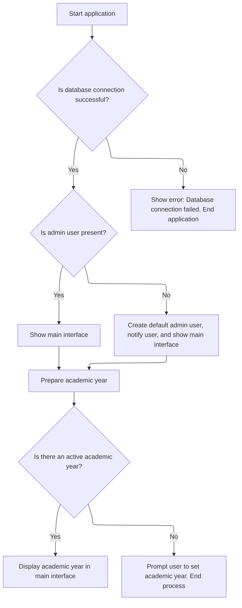

This document describes the startup flow that prepares the application for use. On startup, the system connects to the database, ensures an admin user exists, and sets up the academic year. If an academic year is active, it is shown in the main interface; otherwise, the user is prompted to set one. The flow starts with application launch and ends with the main interface ready for use.

# Startup, DB Connection, and Initial State Setup



<SwmSnippet path="/BK App/Modul/Module1.bas" line="52">

---

In <SwmToken path="BK App/Modul/Module1.bas" pos="52:4:4" line-data="Public Sub Main()">`Main`</SwmToken> we're kicking things off by building the DB connection string and prepping an SQL insert for a default admin user. We call <SwmToken path="BK App/Modul/Module1.bas" pos="59:3:3" line-data="If (connectDB(STR_Conn) &gt; 0) Then">`connectDB`</SwmToken> next to actually open the database and make sure we can talk to it before doing anything else.

```visual basic
Public Sub Main()
On Error GoTo Hell
Dim STR_Conn, sql As String
STR_Conn = "Provider = Microsoft.Jet.OLEDB.4.0; Data Source = " & App.Path & "\db\dbbk.mdb" & ";Persist Security Info=False;Jet OLEDB:Database Password=" & "jendeladunia"
sql = "insert into tbuser (kodeuser,pwd,hakakses)values('ADMIN','samadengannamanya','Administrator')"
AppMain.OpenConnection (STR_Conn)

If (connectDB(STR_Conn) > 0) Then
```

---

</SwmSnippet>

<SwmSnippet path="/BK App/Modul/Module1.bas" line="13">

---

<SwmToken path="BK App/Modul/Module1.bas" pos="13:4:4" line-data="Private Function connectDB(ByVal pSTR_Conn As String) As Integer">`connectDB`</SwmToken> tries to open the DB connection using the string we built. If it can't connect, it pops an error and signals failure so Main can bail out early.

```visual basic
Private Function connectDB(ByVal pSTR_Conn As String) As Integer
On Error GoTo Hell
xCONN.CursorLocation = adUseClient
xCONN.Open pSTR_Conn
connectDB = 1

Exit Function
Hell:
    MsgBox "Koneksi ke database gagal karena:" & vbCrLf & Err.Description, vbCritical
    connectDB = 0
End Function
```

---

</SwmSnippet>

<SwmSnippet path="/BK App/Modul/Module1.bas" line="60">

---

Back in Main, after connecting to the DB, we check if any users exist. If not, we create a default admin. This guarantees there's always a way to log in.

```visual basic
    If (isUserExist("TBuser", sql) > 0) Then
```

---

</SwmSnippet>

<SwmSnippet path="/BK App/Modul/Module1.bas" line="24">

---

<SwmToken path="BK App/Modul/Module1.bas" pos="24:4:4" line-data="Private Function isUserExist(pTableName As String, pSQLInsert As String) As Integer">`isUserExist`</SwmToken> checks if the user table has any records. If not, it inserts the default admin and tells the user. Either way, it makes sure there's at least one user before moving on.

```visual basic
Private Function isUserExist(pTableName As String, pSQLInsert As String) As Integer
On Error GoTo Hell
Dim tRS As New ADODB.Recordset
tRS.Open "select * from " & pTableName, xCONN, adOpenForwardOnly, adLockReadOnly
If tRS.RecordCount > 0 Then
    isUserExist = 1
Else
    xCONN.Execute pSQLInsert
    isUserExist = 1
    MsgBox "First user created", vbInformation
End If
Set tRS = Nothing
Exit Function
Hell:
    MsgBox Err.Description, vbCritical, "Internal"
End Function
```

---

</SwmSnippet>

<SwmSnippet path="/BK App/Modul/Module1.bas" line="61">

---

After making sure a user exists, Main shows the Index form and then calls <SwmToken path="BK App/Modul/Module1.bas" pos="68:0:0" line-data="LihatTahunAktiv">`LihatTahunAktiv`</SwmToken> to set up the active academic year. If anything fails before this, the app just exits with an error.

```visual basic
        Index.Show
    End If
Else
    MsgBox "Koneksi ke database GAGAL." & vbCrLf & "Periksa apakah database ada. " & vbCrLf & _
        "Atau sedang digunakan aplikasi lain", vbCritical
    End
End If
LihatTahunAktiv
```

---

</SwmSnippet>

<SwmSnippet path="/BK App/Modul/Module1.bas" line="74">

---

<SwmToken path="BK App/Modul/Module1.bas" pos="74:4:4" line-data="Public Sub LihatTahunAktiv()">`LihatTahunAktiv`</SwmToken> looks for the active academic year in the DB. If it finds one, it updates global state and the UI. If not, it forces the user to pick or set one before continuing.

```visual basic
Public Sub LihatTahunAktiv()
Dim rs As New ADODB.Recordset
Set rs = Nothing
rs.CursorLocation = adUseClient
sql = "Select * from TBTahunAjaran where aktif = -1 "
rs.Open sql, koneksi
If Not rs.EOF Then
    PidTahun = rs!IDTahunAjaran
    strTahun = rs!tahunajaran
    Index.Caption = Index.Caption & " Tahun Ajaran (" & strTahun & ")"
Else
    frmtahunajaran.Show
End If
End Sub
```

---

</SwmSnippet>

<SwmSnippet path="/BK App/Modul/Module1.bas" line="69">

---

After <SwmToken path="BK App/Modul/Module1.bas" pos="68:0:0" line-data="LihatTahunAktiv">`LihatTahunAktiv`</SwmToken>, Main just exits. If anything blows up along the way, the error handler pops up a message and stops execution.

```visual basic
Exit Sub
Hell:
    MsgBox Err.Description, vbCritical, "Internal Error"
End Sub
```

---

</SwmSnippet>

&nbsp;

*This is an auto-generated document by Swimm 🌊 and has not yet been verified by a human*

<SwmMeta version="3.0.0" repo-id="Z2l0aHViJTNBJTNBY3RzLVZCNi1Qcm9qZWN0cyUzQSUzQVN3aW1tLURlbW8=" repo-name="cts-VB6-Projects"><sup>Powered by [Swimm](https://app.swimm.io/)</sup></SwmMeta>
