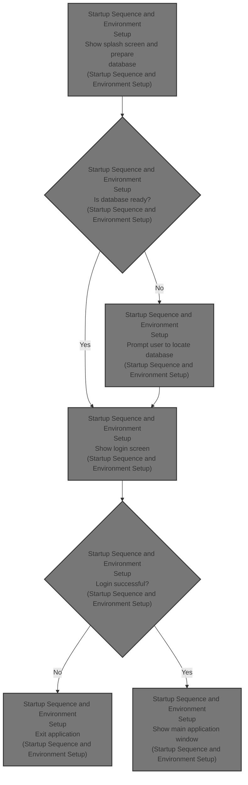

This document describes the startup sequence for the application, guiding the user from launch to the main window. The flow includes displaying a splash screen, checking and setting up the database connection, prompting the user if needed, and authenticating the user before presenting the main window.



# Startup Sequence and Environment Setup

```mermaid
%%{init: {"flowchart": {"defaultRenderer": "elk"}} }%%
flowchart TD
    node1["Start application"] --> node2["Show splash screen"]
    click node1 openCode "HotelManagementSystem/Modules/modMain.bas:12:14"
    click node2 openCode "HotelManagementSystem/Modules/modMain.bas:16:17"
    node2 --> node3["Retrieve database path from
configuration"]
    click node3 openCode "HotelManagementSystem/Modules/modMain.bas:19:19"
    node3 --> node4{"Is database path set?"}
    click node4 openCode "HotelManagementSystem/Modules/modMain.bas:20:23"
    node4 -->|"No"| node5["Prompt user to locate database"]
    click node5 openCode "HotelManagementSystem/Modules/modMain.bas:22:22"
    node4 -->|"Yes"| node6{"Is database accessible?"}
    click node6 openCode "HotelManagementSystem/Modules/modMain.bas:25:25"
    node5 --> node6
    node6 -->|"No"| node5
    node6 -->|"Yes"| node7["Set up data source for reports"]
    click node7 openCode "HotelManagementSystem/Modules/modMain.bas:28:28"
    node7 --> node8["Show login screen"]
    click node8 openCode "HotelManagementSystem/Modules/modMain.bas:34:34"
    node8 --> node9{"Should application close after login?"}
    click node9 openCode "HotelManagementSystem/Modules/modMain.bas:36:36"
    node9 -->|"Yes"| node10["Exit application"]
    click node10 openCode "HotelManagementSystem/Modules/modMain.bas:36:36"
    node9 -->|"No"| node11["Show main application window"]
    click node11 openCode "HotelManagementSystem/Modules/modMain.bas:38:38"
    node11 --> node12["Close splash screen"]
    click node12 openCode "HotelManagementSystem/Modules/modMain.bas:40:41"

classDef HeadingStyle fill:#777777,stroke:#333,stroke-width:2px;

%% Swimm:
%% %%{init: {"flowchart": {"defaultRenderer": "elk"}} }%%
%% flowchart TD
%%     node1["Start application"] --> node2["Show splash screen"]
%%     click node1 openCode "<SwmPath>[HotelManagementSystem/Modules/modMain.bas](HotelManagementSystem/Modules/modMain.bas)</SwmPath>:12:14"
%%     click node2 openCode "<SwmPath>[HotelManagementSystem/Modules/modMain.bas](HotelManagementSystem/Modules/modMain.bas)</SwmPath>:16:17"
%%     node2 --> node3["Retrieve database path from
%% configuration"]
%%     click node3 openCode "<SwmPath>[HotelManagementSystem/Modules/modMain.bas](HotelManagementSystem/Modules/modMain.bas)</SwmPath>:19:19"
%%     node3 --> node4{"Is database path set?"}
%%     click node4 openCode "<SwmPath>[HotelManagementSystem/Modules/modMain.bas](HotelManagementSystem/Modules/modMain.bas)</SwmPath>:20:23"
%%     node4 -->|"No"| node5["Prompt user to locate database"]
%%     click node5 openCode "<SwmPath>[HotelManagementSystem/Modules/modMain.bas](HotelManagementSystem/Modules/modMain.bas)</SwmPath>:22:22"
%%     node4 -->|"Yes"| node6{"Is database accessible?"}
%%     click node6 openCode "<SwmPath>[HotelManagementSystem/Modules/modMain.bas](HotelManagementSystem/Modules/modMain.bas)</SwmPath>:25:25"
%%     node5 --> node6
%%     node6 -->|"No"| node5
%%     node6 -->|"Yes"| node7["Set up data source for reports"]
%%     click node7 openCode "<SwmPath>[HotelManagementSystem/Modules/modMain.bas](HotelManagementSystem/Modules/modMain.bas)</SwmPath>:28:28"
%%     node7 --> node8["Show login screen"]
%%     click node8 openCode "<SwmPath>[HotelManagementSystem/Modules/modMain.bas](HotelManagementSystem/Modules/modMain.bas)</SwmPath>:34:34"
%%     node8 --> node9{"Should application close after login?"}
%%     click node9 openCode "<SwmPath>[HotelManagementSystem/Modules/modMain.bas](HotelManagementSystem/Modules/modMain.bas)</SwmPath>:36:36"
%%     node9 -->|"Yes"| node10["Exit application"]
%%     click node10 openCode "<SwmPath>[HotelManagementSystem/Modules/modMain.bas](HotelManagementSystem/Modules/modMain.bas)</SwmPath>:36:36"
%%     node9 -->|"No"| node11["Show main application window"]
%%     click node11 openCode "<SwmPath>[HotelManagementSystem/Modules/modMain.bas](HotelManagementSystem/Modules/modMain.bas)</SwmPath>:38:38"
%%     node11 --> node12["Close splash screen"]
%%     click node12 openCode "<SwmPath>[HotelManagementSystem/Modules/modMain.bas](HotelManagementSystem/Modules/modMain.bas)</SwmPath>:40:41"
%% 
%% classDef HeadingStyle fill:#777777,stroke:#333,stroke-width:2px;
```



<SwmSnippet path="/HotelManagementSystem/Modules/modMain.bas" line="12">

---

In <SwmToken path="HotelManagementSystem/Modules/modMain.bas" pos="12:4:4" line-data="Public Sub Main()">`Main`</SwmToken>, we kick off by making sure the UI uses system styles, then show and refresh the splash screen so the user knows something is happening. Right after, we grab the database path from the INI file. If it's missing, we jump to a spot where the user can browse for it. Next, we need to call <SwmToken path="HotelManagementSystem/Modules/modMain.bas" pos="19:5:5" line-data="    DBPath = GetINI(&quot;Configuration&quot;, &quot;Path&quot;)      &#39;get path from file">`GetINI`</SwmToken> from <SwmPath>[HotelManagementSystem/Modules/modFunction.bas](HotelManagementSystem/Modules/modFunction.bas)</SwmPath> to actually fetch the DB path from the config file.

```visual basic
Public Sub Main()
    'use system appearance style
    InitCommonControls
    
    frmSplash.Show
    frmSplash.Refresh

    DBPath = GetINI("Configuration", "Path")      'get path from file
```

---

</SwmSnippet>

<SwmSnippet path="/HotelManagementSystem/Modules/modFunction.bas" line="274">

---

<SwmToken path="HotelManagementSystem/Modules/modFunction.bas" pos="274:2:2" line-data="Function GetINI(strMain As String, strSub As String) As String">`GetINI`</SwmToken> handles reading a value from the INI config file using the Windows API, so we can pull out things like the database path without manual file parsing.

```visual basic
Function GetINI(strMain As String, strSub As String) As String
    Dim strBuffer As String
    Dim lngLen As Long
    Dim lngRet As Long
    
    strBuffer = Space(100)
    lngLen = Len(strBuffer)
    lngRet = GetPrivateProfileString(strMain, strSub, vbNullString, strBuffer, lngLen, App.Path & "\config.txt")
    GetINI = Left(strBuffer, lngRet)
End Function
```

---

</SwmSnippet>

<SwmSnippet path="/HotelManagementSystem/Modules/modMain.bas" line="20">

---

Back in <SwmToken path="HotelManagementSystem/Modules/modMain.bas" pos="12:4:4" line-data="Public Sub Main()">`Main`</SwmToken>, after getting the DB path from the INI, we check if it's valid. If not, we let the user pick it. If opening the DB fails, we send them back to pick again. Once that's sorted, we call <SwmToken path="HotelManagementSystem/Modules/modMain.bas" pos="28:1:1" line-data="    createDSN">`createDSN`</SwmToken> from <SwmPath>[HotelManagementSystem/Modules/modDSN.bas](HotelManagementSystem/Modules/modDSN.bas)</SwmPath> to set up the ODBC connection for reports.

```visual basic
    If Trim(DBPath) = "" Or IsNull(DBPath) Then
JumpHere:
      frmLocate.Show 1                            'browse database
    End If
    
    If OpenDB = vbRetry Then GoTo JumpHere
    
    'create DSN for reports
    createDSN
```

---

</SwmSnippet>

<SwmSnippet path="/HotelManagementSystem/Modules/modDSN.bas" line="14">

---

<SwmToken path="HotelManagementSystem/Modules/modDSN.bas" pos="14:4:4" line-data="Public Sub createDSN()">`createDSN`</SwmToken> sets up the ODBC DSN for the Access database by building the connection attributes and calling the Windows API to register it, so reports can connect without manual user setup.

```visual basic
Public Sub createDSN()
    'Creating the DSN

    #If Win32 Then
          Dim intRet As Long
    #Else
          Dim intRet As Integer
    #End If

    Dim strDriver As String
    Dim strAttributes As String

    strDriver = "Microsoft Access Driver (*.mdb)"

    strAttributes = strAttributes & "DESCRIPTION=" & "Hotel DSN " & Chr$(0)
    strAttributes = strAttributes & "DSN=" & "Hotel" & Chr$(0)
    strAttributes = strAttributes & "PWD=" & "jaypee" & Chr$(0)
    strAttributes = strAttributes & "UID=" & "admin" & Chr$(0)
    strAttributes = strAttributes & "DBQ=" & DBPath & Chr$(0)

    intRet = SQLConfigDataSource(vbAPINull, ODBC_ADD_SYS_DSN, _
    strDriver, strAttributes)

    ' DSN created
End Sub
```

---

</SwmSnippet>

<SwmSnippet path="/HotelManagementSystem/Modules/modMain.bas" line="29">

---

Back in <SwmToken path="HotelManagementSystem/Modules/modMain.bas" pos="12:4:4" line-data="Public Sub Main()">`Main`</SwmToken>, after setting up the DSN, we pause for 2 seconds to keep the splash screen up a bit longer before moving on.

```visual basic

'    Load mdiMain
    
    Delay 2
```

---

</SwmSnippet>

<SwmSnippet path="/HotelManagementSystem/Modules/modMain.bas" line="61">

---

<SwmToken path="HotelManagementSystem/Modules/modMain.bas" pos="61:4:4" line-data="Public Sub Delay(PauseTime)">`Delay`</SwmToken> just loops for the given number of seconds, calling <SwmToken path="HotelManagementSystem/Modules/modMain.bas" pos="66:1:1" line-data="        DoEvents    &#39; Yield to other processes.">`DoEvents`</SwmToken> so the UI doesn't freeze while we wait.

```visual basic
Public Sub Delay(PauseTime)
    Dim Start, Finish, TotalTime

    Start = Timer   ' Set start time.
    Do While Timer < Start + PauseTime
        DoEvents    ' Yield to other processes.
    Loop
End Sub
```

---

</SwmSnippet>

<SwmSnippet path="/HotelManagementSystem/Modules/modMain.bas" line="33">

---

Back in <SwmToken path="HotelManagementSystem/Modules/modMain.bas" pos="12:4:4" line-data="Public Sub Main()">`Main`</SwmToken>, after the delay, we show the login form modally. If the user cancels or fails login (<SwmToken path="HotelManagementSystem/Modules/modMain.bas" pos="36:3:3" line-data="    If CloseMe = True Then End">`CloseMe`</SwmToken> is True), we exit. Otherwise, we show the main window and clean up the splash screen.

```visual basic

    frmLogin.Show 1
    
    If CloseMe = True Then End

    mdiMain.Show
    
    Unload frmSplash
    Set frmSplash = Nothing
End Sub
```

---

</SwmSnippet>

&nbsp;

*This is an auto-generated document by Swimm 🌊 and has not yet been verified by a human*

<SwmMeta version="3.0.0" repo-id="Z2l0aHViJTNBJTNBY3RzLVZCNi1Qcm9qZWN0cyUzQSUzQVN3aW1tLURlbW8=" repo-name="cts-VB6-Projects"><sup>Powered by [Swimm](https://app.swimm.io/)</sup></SwmMeta>
