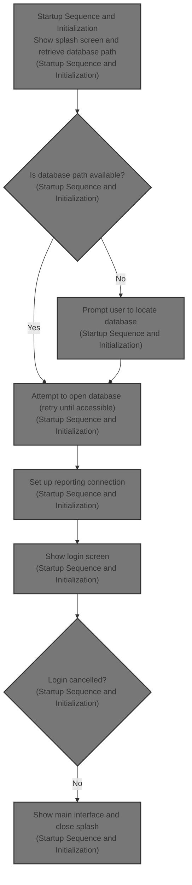

This document describes the startup sequence that prepares the application for user interaction. The process includes displaying a splash screen, retrieving and validating the database path, setting up reporting, and presenting the login and main interfaces based on user input.



# Startup Sequence and Initialization

```mermaid
%%{init: {"flowchart": {"defaultRenderer": "elk"}} }%%
flowchart TD
    node1["Start application"] --> node2["Show splash screen"]
    click node1 openCode "HotelManagementSystem/Modules/modMain.bas:12:14"
    click node2 openCode "HotelManagementSystem/Modules/modMain.bas:16:17"
    node2 --> node3["Get database path from config"]
    click node3 openCode "HotelManagementSystem/Modules/modMain.bas:19:19"
    node3 --> node4{"Is DBPath missing or null?"}
    click node4 openCode "HotelManagementSystem/Modules/modMain.bas:20:23"
    node4 -->|"DBPath missing"| node5["Prompt user to locate database"]
    click node5 openCode "HotelManagementSystem/Modules/modMain.bas:22:22"
    node4 -->|"DBPath set"| node6["Try to open database"]
    click node6 openCode "HotelManagementSystem/Modules/modMain.bas:25:25"
    node5 --> node6
    
    subgraph loop1["Retry until database is accessible"]
        node6 --> node7{"OpenDB returns vbRetry?"}
        click node7 openCode "HotelManagementSystem/Modules/modMain.bas:25:25"
        node7 -->|"OpenDB failed"| node5
        node7 -->|"OpenDB succeeded"| node8["Create DSN for reports"]
        click node8 openCode "HotelManagementSystem/Modules/modMain.bas:28:28"
    end
    node8 --> node9["Pause for splash effect"]
    click node9 openCode "HotelManagementSystem/Modules/modMain.bas:32:32"
    node9 --> node10["Show login screen"]
    click node10 openCode "HotelManagementSystem/Modules/modMain.bas:34:34"
    node10 --> node11{"CloseMe = True after login?"}
    click node11 openCode "HotelManagementSystem/Modules/modMain.bas:36:36"
    node11 -->|"Yes"| node12["Exit application"]
    click node12 openCode "HotelManagementSystem/Modules/modMain.bas:36:36"
    node11 -->|"No"| node13["Show main interface"]
    click node13 openCode "HotelManagementSystem/Modules/modMain.bas:38:38"
    node13 --> node14["Close splash screen"]
    click node14 openCode "HotelManagementSystem/Modules/modMain.bas:40:41"
classDef HeadingStyle fill:#777777,stroke:#333,stroke-width:2px;

%% Swimm:
%% %%{init: {"flowchart": {"defaultRenderer": "elk"}} }%%
%% flowchart TD
%%     node1["Start application"] --> node2["Show splash screen"]
%%     click node1 openCode "<SwmPath>[HotelManagementSystem/Modules/modMain.bas](HotelManagementSystem/Modules/modMain.bas)</SwmPath>:12:14"
%%     click node2 openCode "<SwmPath>[HotelManagementSystem/Modules/modMain.bas](HotelManagementSystem/Modules/modMain.bas)</SwmPath>:16:17"
%%     node2 --> node3["Get database path from config"]
%%     click node3 openCode "<SwmPath>[HotelManagementSystem/Modules/modMain.bas](HotelManagementSystem/Modules/modMain.bas)</SwmPath>:19:19"
%%     node3 --> node4{"Is <SwmToken path="HotelManagementSystem/Modules/modMain.bas" pos="19:1:1" line-data="    DBPath = GetINI(&quot;Configuration&quot;, &quot;Path&quot;)      &#39;get path from file">`DBPath`</SwmToken> missing or null?"}
%%     click node4 openCode "<SwmPath>[HotelManagementSystem/Modules/modMain.bas](HotelManagementSystem/Modules/modMain.bas)</SwmPath>:20:23"
%%     node4 -->|"<SwmToken path="HotelManagementSystem/Modules/modMain.bas" pos="19:1:1" line-data="    DBPath = GetINI(&quot;Configuration&quot;, &quot;Path&quot;)      &#39;get path from file">`DBPath`</SwmToken> missing"| node5["Prompt user to locate database"]
%%     click node5 openCode "<SwmPath>[HotelManagementSystem/Modules/modMain.bas](HotelManagementSystem/Modules/modMain.bas)</SwmPath>:22:22"
%%     node4 -->|"<SwmToken path="HotelManagementSystem/Modules/modMain.bas" pos="19:1:1" line-data="    DBPath = GetINI(&quot;Configuration&quot;, &quot;Path&quot;)      &#39;get path from file">`DBPath`</SwmToken> set"| node6["Try to open database"]
%%     click node6 openCode "<SwmPath>[HotelManagementSystem/Modules/modMain.bas](HotelManagementSystem/Modules/modMain.bas)</SwmPath>:25:25"
%%     node5 --> node6
%%     
%%     subgraph loop1["Retry until database is accessible"]
%%         node6 --> node7{"<SwmToken path="HotelManagementSystem/Modules/modMain.bas" pos="25:3:3" line-data="    If OpenDB = vbRetry Then GoTo JumpHere">`OpenDB`</SwmToken> returns <SwmToken path="HotelManagementSystem/Modules/modMain.bas" pos="25:7:7" line-data="    If OpenDB = vbRetry Then GoTo JumpHere">`vbRetry`</SwmToken>?"}
%%         click node7 openCode "<SwmPath>[HotelManagementSystem/Modules/modMain.bas](HotelManagementSystem/Modules/modMain.bas)</SwmPath>:25:25"
%%         node7 -->|"<SwmToken path="HotelManagementSystem/Modules/modMain.bas" pos="25:3:3" line-data="    If OpenDB = vbRetry Then GoTo JumpHere">`OpenDB`</SwmToken> failed"| node5
%%         node7 -->|"<SwmToken path="HotelManagementSystem/Modules/modMain.bas" pos="25:3:3" line-data="    If OpenDB = vbRetry Then GoTo JumpHere">`OpenDB`</SwmToken> succeeded"| node8["Create DSN for reports"]
%%         click node8 openCode "<SwmPath>[HotelManagementSystem/Modules/modMain.bas](HotelManagementSystem/Modules/modMain.bas)</SwmPath>:28:28"
%%     end
%%     node8 --> node9["Pause for splash effect"]
%%     click node9 openCode "<SwmPath>[HotelManagementSystem/Modules/modMain.bas](HotelManagementSystem/Modules/modMain.bas)</SwmPath>:32:32"
%%     node9 --> node10["Show login screen"]
%%     click node10 openCode "<SwmPath>[HotelManagementSystem/Modules/modMain.bas](HotelManagementSystem/Modules/modMain.bas)</SwmPath>:34:34"
%%     node10 --> node11{"<SwmToken path="HotelManagementSystem/Modules/modMain.bas" pos="36:3:3" line-data="    If CloseMe = True Then End">`CloseMe`</SwmToken> = True after login?"}
%%     click node11 openCode "<SwmPath>[HotelManagementSystem/Modules/modMain.bas](HotelManagementSystem/Modules/modMain.bas)</SwmPath>:36:36"
%%     node11 -->|"Yes"| node12["Exit application"]
%%     click node12 openCode "<SwmPath>[HotelManagementSystem/Modules/modMain.bas](HotelManagementSystem/Modules/modMain.bas)</SwmPath>:36:36"
%%     node11 -->|"No"| node13["Show main interface"]
%%     click node13 openCode "<SwmPath>[HotelManagementSystem/Modules/modMain.bas](HotelManagementSystem/Modules/modMain.bas)</SwmPath>:38:38"
%%     node13 --> node14["Close splash screen"]
%%     click node14 openCode "<SwmPath>[HotelManagementSystem/Modules/modMain.bas](HotelManagementSystem/Modules/modMain.bas)</SwmPath>:40:41"
%% classDef HeadingStyle fill:#777777,stroke:#333,stroke-width:2px;
```



<SwmSnippet path="/HotelManagementSystem/Modules/modMain.bas" line="12">

---

In <SwmToken path="HotelManagementSystem/Modules/modMain.bas" pos="12:4:4" line-data="Public Sub Main()">`Main`</SwmToken>, we kick things off by initializing Windows common controls for proper UI rendering, then show and refresh the splash screen so the user sees something right away. Right after, we grab the database path from the config file using <SwmToken path="HotelManagementSystem/Modules/modMain.bas" pos="19:5:5" line-data="    DBPath = GetINI(&quot;Configuration&quot;, &quot;Path&quot;)      &#39;get path from file">`GetINI`</SwmToken>. We need to call into <SwmPath>[HotelManagementSystem/Modules/modFunction.bas](HotelManagementSystem/Modules/modFunction.bas)</SwmPath> next because that's where <SwmToken path="HotelManagementSystem/Modules/modMain.bas" pos="19:5:5" line-data="    DBPath = GetINI(&quot;Configuration&quot;, &quot;Path&quot;)      &#39;get path from file">`GetINI`</SwmToken> actually reads the path from the INI file.

```visual basic
Public Sub Main()
    'use system appearance style
    InitCommonControls
    
    frmSplash.Show
    frmSplash.Refresh

    DBPath = GetINI("Configuration", "Path")      'get path from file
```

---

</SwmSnippet>

<SwmSnippet path="/HotelManagementSystem/Modules/modFunction.bas" line="274">

---

<SwmToken path="HotelManagementSystem/Modules/modFunction.bas" pos="274:2:2" line-data="Function GetINI(strMain As String, strSub As String) As String">`GetINI`</SwmToken> handles reading a value from the INI config file using the Windows API. It grabs the value for a given section and key, returning it as a string. This is how we get the database path for the rest of the startup logic.

```visual basic
Function GetINI(strMain As String, strSub As String) As String
    Dim strBuffer As String
    Dim lngLen As Long
    Dim lngRet As Long
    
    strBuffer = Space(100)
    lngLen = Len(strBuffer)
    lngRet = GetPrivateProfileString(strMain, strSub, vbNullString, strBuffer, lngLen, App.Path & "\config.txt")
    GetINI = Left(strBuffer, lngRet)
End Function
```

---

</SwmSnippet>

<SwmSnippet path="/HotelManagementSystem/Modules/modMain.bas" line="20">

---

Back in <SwmToken path="HotelManagementSystem/Modules/modMain.bas" pos="12:4:4" line-data="Public Sub Main()">`Main`</SwmToken>, after getting the DB path, if it's missing or invalid, we show a form to let the user pick the database. If opening the DB fails and returns <SwmToken path="HotelManagementSystem/Modules/modMain.bas" pos="25:7:7" line-data="    If OpenDB = vbRetry Then GoTo JumpHere">`vbRetry`</SwmToken>, we loop back and let the user try again. Once the DB is accessible, we call <SwmToken path="HotelManagementSystem/Modules/modMain.bas" pos="28:1:1" line-data="    createDSN">`createDSN`</SwmToken> from <SwmPath>[HotelManagementSystem/Modules/modDSN.bas](HotelManagementSystem/Modules/modDSN.bas)</SwmPath> to set up the ODBC connection for reporting.

```visual basic
    If Trim(DBPath) = "" Or IsNull(DBPath) Then
JumpHere:
      frmLocate.Show 1                            'browse database
    End If
    
    If OpenDB = vbRetry Then GoTo JumpHere
    
    'create DSN for reports
    createDSN
```

---

</SwmSnippet>

<SwmSnippet path="/HotelManagementSystem/Modules/modDSN.bas" line="14">

---

<SwmToken path="HotelManagementSystem/Modules/modDSN.bas" pos="14:4:4" line-data="Public Sub createDSN()">`createDSN`</SwmToken> sets up an ODBC DSN for the Access database using the current DB path and hardcoded credentials. It builds the DSN attributes string and calls the Windows API to register the DSN, so reporting tools can connect without manual setup.

```visual basic
Public Sub createDSN()
    'Creating the DSN

    #If Win32 Then
          Dim intRet As Long
    #Else
          Dim intRet As Integer
    #End If

    Dim strDriver As String
    Dim strAttributes As String

    strDriver = "Microsoft Access Driver (*.mdb)"

    strAttributes = strAttributes & "DESCRIPTION=" & "Hotel DSN " & Chr$(0)
    strAttributes = strAttributes & "DSN=" & "Hotel" & Chr$(0)
    strAttributes = strAttributes & "PWD=" & "jaypee" & Chr$(0)
    strAttributes = strAttributes & "UID=" & "admin" & Chr$(0)
    strAttributes = strAttributes & "DBQ=" & DBPath & Chr$(0)

    intRet = SQLConfigDataSource(vbAPINull, ODBC_ADD_SYS_DSN, _
    strDriver, strAttributes)

    ' DSN created
End Sub
```

---

</SwmSnippet>

<SwmSnippet path="/HotelManagementSystem/Modules/modMain.bas" line="29">

---

Back in <SwmToken path="HotelManagementSystem/Modules/modMain.bas" pos="12:4:4" line-data="Public Sub Main()">`Main`</SwmToken>, after setting up the DSN, we pause for 2 seconds with <SwmToken path="HotelManagementSystem/Modules/modMain.bas" pos="32:1:1" line-data="    Delay 2">`Delay`</SwmToken>. This gives the splash screen time to show and makes sure everything's ready before the login form pops up.

```visual basic

'    Load mdiMain
    
    Delay 2
```

---

</SwmSnippet>

<SwmSnippet path="/HotelManagementSystem/Modules/modMain.bas" line="61">

---

<SwmToken path="HotelManagementSystem/Modules/modMain.bas" pos="61:4:4" line-data="Public Sub Delay(PauseTime)">`Delay`</SwmToken> just loops until the specified time passes, but calls <SwmToken path="HotelManagementSystem/Modules/modMain.bas" pos="66:1:1" line-data="        DoEvents    &#39; Yield to other processes.">`DoEvents`</SwmToken> so the UI doesn't freeze. It's a simple way to pause without locking up the app.

```visual basic
Public Sub Delay(PauseTime)
    Dim Start, Finish, TotalTime

    Start = Timer   ' Set start time.
    Do While Timer < Start + PauseTime
        DoEvents    ' Yield to other processes.
    Loop
End Sub
```

---

</SwmSnippet>

<SwmSnippet path="/HotelManagementSystem/Modules/modMain.bas" line="33">

---

After the delay, <SwmToken path="HotelManagementSystem/Modules/modMain.bas" pos="12:4:4" line-data="Public Sub Main()">`Main`</SwmToken> shows the login form modally. If the login sets <SwmToken path="HotelManagementSystem/Modules/modMain.bas" pos="36:3:3" line-data="    If CloseMe = True Then End">`CloseMe`</SwmToken>, the app exits right away. Otherwise, we show the main window and clean up the splash screen to free memory.

```visual basic

    frmLogin.Show 1
    
    If CloseMe = True Then End

    mdiMain.Show
    
    Unload frmSplash
    Set frmSplash = Nothing
End Sub
```

---

</SwmSnippet>

&nbsp;

*This is an auto-generated document by Swimm 🌊 and has not yet been verified by a human*

<SwmMeta version="3.0.0" repo-id="Z2l0aHViJTNBJTNBY3RzLVZCNi1Qcm9qZWN0cyUzQSUzQVN3aW1tLURlbW8=" repo-name="cts-VB6-Projects"><sup>Powered by [Swimm](https://app.swimm.io/)</sup></SwmMeta>
