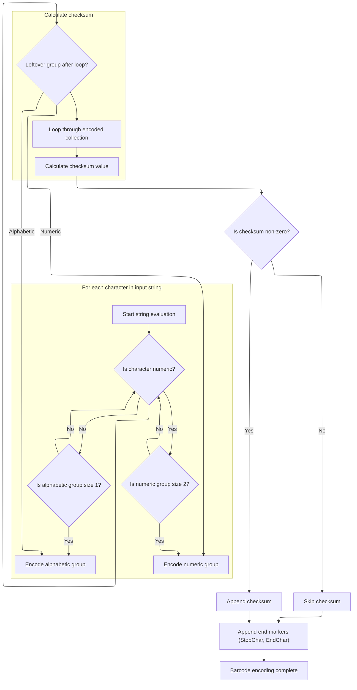
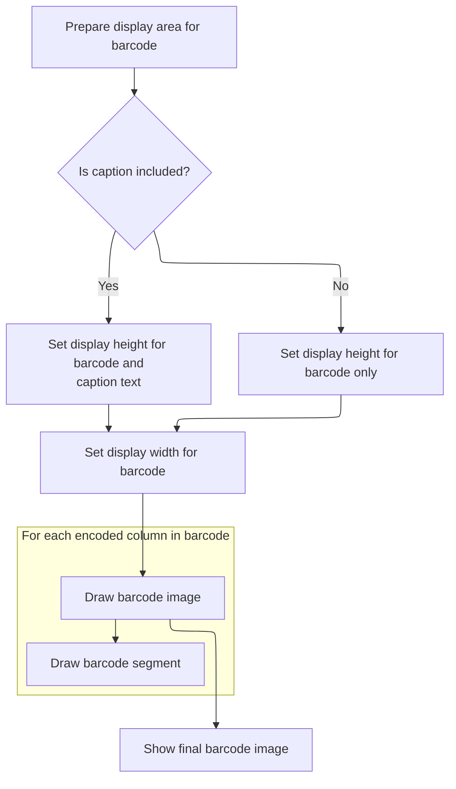

This document describes how text is converted into a <SwmToken path="BARCODE/arisBarcode.cls" pos="14:2:2" line-data="Function Code128(zObj As Object, zBarH As Double, BarText As String, Optional ByVal HasCaption As Boolean = False)">`Code128`</SwmToken> barcode and visually displayed. Users provide input text and display parameters, which are encoded and rendered as a barcode image, optionally with a caption.

# Delegating Barcode Generation

<SwmSnippet path="/BARCODE/arisBarcode.cls" line="14">

---

In <SwmToken path="BARCODE/arisBarcode.cls" pos="14:2:2" line-data="Function Code128(zObj As Object, zBarH As Double, BarText As String, Optional ByVal HasCaption As Boolean = False)">`Code128`</SwmToken>, the function just passes all parameters straight to <SwmToken path="BARCODE/arisBarcode.cls" pos="15:1:1" line-data="    Bar128 zObj, zBarH, BarText, HasCaption">`Bar128`</SwmToken>. No extra logic here—it's just a wrapper, so all the real work happens in <SwmToken path="BARCODE/arisBarcode.cls" pos="15:1:1" line-data="    Bar128 zObj, zBarH, BarText, HasCaption">`Bar128`</SwmToken> next.

```apex
Function Code128(zObj As Object, zBarH As Double, BarText As String, Optional ByVal HasCaption As Boolean = False)
    Bar128 zObj, zBarH, BarText, HasCaption
```

---

</SwmSnippet>

## Preparing Barcode Data Structures

<SwmSnippet path="/BARCODE/ModCode128.bas" line="22">

---

In <SwmToken path="BARCODE/ModCode128.bas" pos="22:2:2" line-data="Sub Bar128(zObj As Object, zBarH As Integer, BarText As String, Optional ByVal HasCaption As Boolean = False)">`Bar128`</SwmToken>, we set up the barcode's internal state and call <SwmToken path="BARCODE/ModCode128.bas" pos="28:1:1" line-data="   Init_Table &#39;Initialize Encoding">`Init_Table`</SwmToken> to load the encoding patterns. This is needed before we can process the input string for barcode rendering.

```visual basic
Sub Bar128(zObj As Object, zBarH As Integer, BarText As String, Optional ByVal HasCaption As Boolean = False)
   Set xObj = zObj
   
   zBarText = BarText
   zHasCaption = HasCaption
   
   Init_Table 'Initialize Encoding
```

---

</SwmSnippet>

<SwmSnippet path="/BARCODE/ModCode128.bas" line="59">

---

<SwmToken path="BARCODE/ModCode128.bas" pos="59:4:4" line-data="Private Sub Init_Table()">`Init_Table`</SwmToken> sets up <SwmToken path="BARCODE/ModCode128.bas" pos="60:1:1" line-data="    CharSet = &quot; !&quot;&quot;#$%&amp;&#39;()*+,-./0123456789:;&lt;=&gt;?@ABCDEFGHIJKLMNOPQRSTUVWXYZ[\]^_`abcdefghijklmnopqrstuvwxyz{|}~&quot;">`CharSet`</SwmToken> with all the encodable characters and <SwmToken path="BARCODE/ModCode128.bas" pos="61:1:1" line-data="    arrEncoding = Array( _">`arrEncoding`</SwmToken> with the barcode patterns for each one. This mapping is used throughout the encoding process.

```visual basic
Private Sub Init_Table()
    CharSet = " !""#$%&'()*+,-./0123456789:;<=>?@ABCDEFGHIJKLMNOPQRSTUVWXYZ[\]^_`abcdefghijklmnopqrstuvwxyz{|}~"
    arrEncoding = Array( _
             "11011001100", "11001101100", "11001100110", "10010011000", "10010001100", "10001001100", _
             "10011001000", "10011000100", "10001100100", "11001001000", "11001000100", "11000100100", _
             "10110011100", "10011011100", "10011001110", "10111001100", "10011101100", "10011100110", _
             "11001110010", "11001011100", "11001001110", "11011100100", "11001110100", "11101101110", _
             "11101001100", "11100101100", "11100100110", "11101100100", "11100110100", "11100110010", _
             "11011011000", "11011000110", "11000110110", "10100011000", "10001011000", "10001000110", _
             "10110001000", "10001101000", "10001100010", "11010001000", "11000101000", "11000100010", _
             "10110111000", "10110001110", "10001101110", "10111011000", "10111000110", "10001110110", _
             "11101110110", "11010001110", "11000101110", "11011101000", "11011100010", "11011101110", _
             "11101011000", "11101000110", "11100010110", "11101101000", "11101100010", "11100011010", _
             "11101111010", "11001000010", "11110001010", "10100110000", "10100001100", "10010110000", _
             "10010000110", "10000101100", "10000100110", "10110010000", "10110000100", "10011010000", _
             "10011000010", "10000110100", "10000110010", "11000010010", "11001010000", "11110111010", _
             "11000010100", "10001111010", "10100111100", "10010111100", "10010011110", "10111100100", _
             "10011110100", "10011110010", "11110100100", "11110010100", "11110010010", "11011011110", _
             "11011110110", "11110110110", "10101111000", "10100011110", "10001011110", "10111101000", _
             "10111100010", "11110101000", "11110100010", "10111011110", "10111101110", "11101011110", _
             "11110101110", "11010000100", "11010010000", "11010011100", "11000111010", "11" _
             )
End Sub
```

---

</SwmSnippet>

<SwmSnippet path="/BARCODE/ModCode128.bas" line="29">

---

Back in <SwmToken path="BARCODE/arisBarcode.cls" pos="15:1:1" line-data="    Bar128 zObj, zBarH, BarText, HasCaption">`Bar128`</SwmToken>, after setting up the encoding table, we call <SwmToken path="BARCODE/ModCode128.bas" pos="29:1:1" line-data="   Eval_String BarText">`Eval_String`</SwmToken> to parse and encode the input string into barcode values.

```visual basic
   Eval_String BarText
```

---

</SwmSnippet>

### Parsing and Encoding Input String



<SwmSnippet path="/BARCODE/ModCode128.bas" line="83">

---

In <SwmToken path="BARCODE/ModCode128.bas" pos="83:4:4" line-data="Private Sub Eval_String(xstr As String)">`Eval_String`</SwmToken>, the input string is parsed character by character. Numeric pairs are grouped and encoded with <SwmToken path="BARCODE/ModCode128.bas" pos="99:1:1" line-data="              Add_Num tmpbuffer">`Add_Num`</SwmToken>, while single digits or non-numeric characters are handled with <SwmToken path="BARCODE/ModCode128.bas" pos="104:1:1" line-data="               Add_Char tmpbuffer">`Add_Char`</SwmToken>. The function also sets up the collection for checksum and stop codes.

```visual basic
Private Sub Eval_String(xstr As String)
    'Check the string for alpha-numeric
    '
    Dim i As Integer, num As Integer
    Dim tmpbuffer As String, StartCode As Integer
    
    
    Set myCols = New Collection
    num = 0: StartCode = 0
    tmpbuffer = ""

    For i = 1 To Len(xstr)
        If InStr("0123456789", Mid(xstr, i, 1)) > 0 Then
           num = num + 1
           tmpbuffer = tmpbuffer & Mid(xstr, i, 1)
           If num = 2 Then
              Add_Num tmpbuffer
```

---

</SwmSnippet>

<SwmSnippet path="/BARCODE/ModCode128.bas" line="148">

---

<SwmToken path="BARCODE/ModCode128.bas" pos="148:4:4" line-data="Private Sub Add_Num(xstr As String)">`Add_Num`</SwmToken> checks and sets the correct start code for numeric encoding, adds the start code and numeric value to the collections, and maps them to their barcode patterns using <SwmToken path="BARCODE/ModCode128.bas" pos="157:5:5" line-data="            List2.AddItem arrEncoding(xStart)">`arrEncoding`</SwmToken>.

```visual basic
Private Sub Add_Num(xstr As String)
        If xStart <> StartC And xStart <> CodeC Then
           If xStart = 0 Then
              xStart = StartC
            Else
              xStart = CodeC
            End If
            myCols.Add xStart
            List1.AddItem xStart
            List2.AddItem arrEncoding(xStart)
        End If
        List1.AddItem xstr
        List2.AddItem arrEncoding(CInt(xstr))
        myCols.Add CInt(xstr)
End Sub
```

---

</SwmSnippet>

<SwmSnippet path="/BARCODE/ModCode128.bas" line="100">

---

Back in <SwmToken path="BARCODE/ModCode128.bas" pos="29:1:1" line-data="   Eval_String BarText">`Eval_String`</SwmToken>, after handling a numeric pair, the buffer is reset. If a non-digit is found, any leftover digit(s) are encoded before moving on.

```visual basic
              num = 0: tmpbuffer = ""
           End If
        Else
            If num = 1 Then
               Add_Char tmpbuffer
```

---

</SwmSnippet>

<SwmSnippet path="/BARCODE/ModCode128.bas" line="132">

---

<SwmToken path="BARCODE/ModCode128.bas" pos="132:4:4" line-data="Private Sub Add_Char(xstr As String)">`Add_Char`</SwmToken> ensures the correct start code for character data, adds the character's index from <SwmToken path="BARCODE/ModCode128.bas" pos="144:10:10" line-data="        &#39;List2.AddItem arrEncoding(InStr(CharSet, xstr) - 1)">`CharSet`</SwmToken> to <SwmToken path="BARCODE/ModCode128.bas" pos="139:1:1" line-data="            myCols.Add xStart">`myCols`</SwmToken>, and updates the display collections.

```visual basic
Private Sub Add_Char(xstr As String)
        If xStart <> StartB And xStart <> CodeB Then
           If xStart = 0 Then
              xStart = StartB
            Else
              xStart = CodeB
            End If
            myCols.Add xStart
            List1.AddItem xStart
            List2.AddItem arrEncoding(xStart)
        End If
        List1.AddItem xstr
        'List2.AddItem arrEncoding(InStr(CharSet, xstr) - 1)
        
        myCols.Add InStr(CharSet, xstr) - 1
End Sub
```

---

</SwmSnippet>

<SwmSnippet path="/BARCODE/ModCode128.bas" line="105">

---

Back in <SwmToken path="BARCODE/ModCode128.bas" pos="29:1:1" line-data="   Eval_String BarText">`Eval_String`</SwmToken>, if two digits are left in the buffer after a non-digit, <SwmToken path="BARCODE/ModCode128.bas" pos="106:1:1" line-data="               Add_Num tmpbuffer">`Add_Num`</SwmToken> is called to encode them before moving on.

```visual basic
            ElseIf num = 2 Then
               Add_Num tmpbuffer
```

---

</SwmSnippet>

<SwmSnippet path="/BARCODE/ModCode128.bas" line="107">

---

Back in <SwmToken path="BARCODE/ModCode128.bas" pos="29:1:1" line-data="   Eval_String BarText">`Eval_String`</SwmToken>, after handling digits and non-digits, <SwmToken path="BARCODE/ModCode128.bas" pos="109:1:1" line-data="            Add_Char Mid(xstr, i, 1)">`Add_Char`</SwmToken> is called for the current character, and the buffer is cleared. This ensures all input is processed.

```visual basic
            End If
            
            Add_Char Mid(xstr, i, 1)
            num = 0: tmpbuffer = ""
        End If
    Next
    If num = 1 Then
       Add_Char tmpbuffer
```

---

</SwmSnippet>

<SwmSnippet path="/BARCODE/ModCode128.bas" line="115">

---

Back in <SwmToken path="BARCODE/ModCode128.bas" pos="29:1:1" line-data="   Eval_String BarText">`Eval_String`</SwmToken>, any leftover digits are encoded, then the checksum is calculated and added, followed by stop and end characters to finalize the barcode data.

```visual basic
    ElseIf num = 2 Then
       Add_Num tmpbuffer
    End If
    ' Add the Checksum
    Dim Calc As Long, chkSum As Long
    For i = 0 To myCols.Count - 1
        If i = 0 Then
           Calc = myCols(i + 1)
        Else
           Calc = Calc + (myCols(i + 1) * i)
        End If
    Next
    chkSum = Calc Mod 103
    If chkSum <> 0 Then Add_Num chkSum
    Add_Num StopChar
    Add_Num EndChar
```

---

</SwmSnippet>

<SwmSnippet path="/BARCODE/ModCode128.bas" line="131">

---

Back in <SwmToken path="BARCODE/ModCode128.bas" pos="29:1:1" line-data="   Eval_String BarText">`Eval_String`</SwmToken>, the function ends after all input is encoded, checksum and stop codes are added, and the barcode data is ready for drawing.

```visual basic
End Sub
```

---

</SwmSnippet>

### Rendering and Outputting the Barcode



<SwmSnippet path="/BARCODE/ModCode128.bas" line="30">

---

Back in <SwmToken path="BARCODE/arisBarcode.cls" pos="15:1:1" line-data="    Bar128 zObj, zBarH, BarText, HasCaption">`Bar128`</SwmToken>, after encoding, the barcode height is converted to pixels, the image object is sized to fit the barcode and optional caption, and <SwmToken path="BARCODE/ModCode128.bas" pos="45:1:1" line-data="   Draw_Barcode">`Draw_Barcode`</SwmToken> is called to render the barcode.

```visual basic
   
   
   xObj.Picture = Nothing
   BarH = zBarH * 72 'Inches to Pixel of barcode
   xObj.BackColor = vbWhite
   xObj.AutoRedraw = True
   xObj.ScaleMode = 3 'Pixel
   
   If HasCaption Then
      '(Barcode height + Text height)
      xObj.Height = (xObj.TextHeight(zBarText) + BarH) * Screen.TwipsPerPixelY
   Else
      xObj.Height = BarH * Screen.TwipsPerPixelY
   End If
   xObj.Width = (myCols.Count * 11) * Screen.TwipsPerPixelX
   Draw_Barcode
```

---

</SwmSnippet>

<SwmSnippet path="/BARCODE/ModCode128.bas" line="48">

---

<SwmToken path="BARCODE/ModCode128.bas" pos="48:4:4" line-data="Private Sub Draw_Barcode()">`Draw_Barcode`</SwmToken> loops through the encoded barcode data, drawing black or white lines for each bit to visually render the barcode.

```visual basic
Private Sub Draw_Barcode()
    Dim encoding As String, i As Integer, j As Integer
    xObj.CurrentX = 0: xObj.CurrentY = 0
    For i = 1 To myCols.Count
        encoding = arrEncoding(myCols(i))
        For j = 1 To Len(encoding)
            xObj.Line (0, 0)-(xObj.CurrentX + 1, BarH), IIf(Mid(encoding, ii, 1), vbBlack, vbWhite)
        Next
    Next
End Sub
```

---

</SwmSnippet>

<SwmSnippet path="/BARCODE/ModCode128.bas" line="46">

---

Back in <SwmToken path="BARCODE/arisBarcode.cls" pos="15:1:1" line-data="    Bar128 zObj, zBarH, BarText, HasCaption">`Bar128`</SwmToken>, after drawing, the rendered image is assigned to <SwmToken path="BARCODE/ModCode128.bas" pos="46:1:3" line-data="   zObj.Picture = zObj.Image">`zObj.Picture`</SwmToken> so the barcode is visible to the user.

```visual basic
   zObj.Picture = zObj.Image
End Sub
```

---

</SwmSnippet>

## Finishing the Wrapper Call

<SwmSnippet path="/BARCODE/arisBarcode.cls" line="16">

---

Back in <SwmToken path="BARCODE/arisBarcode.cls" pos="14:2:2" line-data="Function Code128(zObj As Object, zBarH As Double, BarText As String, Optional ByVal HasCaption As Boolean = False)">`Code128`</SwmToken>, nothing else happens—control just returns after <SwmToken path="BARCODE/arisBarcode.cls" pos="15:1:1" line-data="    Bar128 zObj, zBarH, BarText, HasCaption">`Bar128`</SwmToken> finishes, since <SwmToken path="BARCODE/arisBarcode.cls" pos="14:2:2" line-data="Function Code128(zObj As Object, zBarH As Double, BarText As String, Optional ByVal HasCaption As Boolean = False)">`Code128`</SwmToken> is only a wrapper.

```apex
End Function
```

---

</SwmSnippet>

&nbsp;

*This is an auto-generated document by Swimm 🌊 and has not yet been verified by a human*

<SwmMeta version="3.0.0" repo-id="Z2l0aHViJTNBJTNBY3RzLVZCNi1Qcm9qZWN0cyUzQSUzQVN3aW1tLURlbW8=" repo-name="cts-VB6-Projects"><sup>Powered by [Swimm](https://app.swimm.io/)</sup></SwmMeta>
