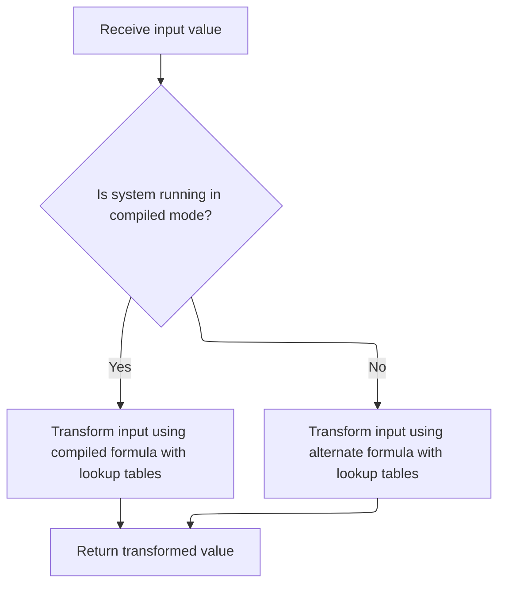

This document outlines how an encrypted data block is transformed back into its original form using the Blowfish decryption process. The flow prepares the block, applies cryptographic transformations, and completes decryption through a series of rounds, enabling secure access to protected information.

# Block Half Preparation and Feistel Loop Entry

<SwmSnippet path="/HotelManagementSystem/Modules/clsBlowfish.cls" line="320">

---

In `DecryptBlock`, we start by swapping and XORing the two halves of the block with the last two subkeys. This sets up the block for the Feistel decryption rounds. Next, we call `f` to apply the Blowfish round function, which is needed to start reversing the encryption process round by round.

```apex
Private Static Sub DecryptBlock(Xl As Long, Xr As Long)
    Dim I As Long, j As Long, K As Long
    K = Xr
    Xr = Xl Xor m_pBox(Rounds + 1)
    Xl = K Xor m_pBox(Rounds)
    j = Rounds - 2
    For I = 0 To (Rounds \ 2 - 1)
        Xl = Xl Xor f(Xr)
        Xr = Xr Xor m_pBox(j + 1)
        Xr = Xr Xor f(Xl)
```

---

</SwmSnippet>

## Round Function and Unsigned Arithmetic



<SwmSnippet path="/HotelManagementSystem/Modules/clsBlowfish.cls" line="423">

---

In `f`, we split the input into bytes and use them for S-box lookups and arithmetic. If we're not running compiled, we call `UnsignedAdd` to make sure the addition is unsigned, which is required for the algorithm to work correctly in VB6.

```apex
Private Static Function f(ByVal X As Long) As Long
    Dim xb(0 To 3) As Byte
    Call CopyMem(xb(0), X, 4)
    If (m_RunningCompiled) Then f = (((m_sBox(0, xb(3)) + m_sBox(1, xb(2))) Xor m_sBox(2, xb(1))) + m_sBox(3, xb(0))) Else f = UnsignedAdd((UnsignedAdd(m_sBox(0, xb(3)), m_sBox(1, xb(2))) Xor m_sBox(2, xb(1))), m_sBox(3, xb(0)))
```

---

</SwmSnippet>

<SwmSnippet path="/HotelManagementSystem/Modules/clsBlowfish.cls" line="444">

---

`UnsignedAdd` does manual byte-wise addition with carry to simulate unsigned 32-bit addition, since VB6 doesn't support unsigned longs natively. This keeps the arithmetic consistent with the Blowfish spec.

```apex
Private Static Function UnsignedAdd(ByVal Data1 As Long, Data2 As Long) As Long
    Dim x1(0 To 3) As Byte, x2(0 To 3) As Byte, xx(0 To 3) As Byte, Rest As Long, Value As Long, a As Long
    Call CopyMem(x1(0), Data1, 4)
    Call CopyMem(x2(0), Data2, 4)
    Rest = 0
    For a = 0 To 3
        Value = CLng(x1(a)) + CLng(x2(a)) + Rest
        xx(a) = Value And 255
        Rest = Value \ 256
    Next
    Call CopyMem(UnsignedAdd, xx(0), 4)
End Function
```

---

</SwmSnippet>

<SwmSnippet path="/HotelManagementSystem/Modules/clsBlowfish.cls" line="427">

---

After coming back from `UnsignedAdd`, `f` returns the computed value, making sure the output is correct for both compiled and interpreted VB6. This keeps the Blowfish round function consistent.

```apex
End Function
```

---

</SwmSnippet>

## Feistel Loop Completion and Block Finalization

<SwmSnippet path="/HotelManagementSystem/Modules/clsBlowfish.cls" line="330">

---

After each call to `f`, we update the block halves with XORs and subkey lookups. At the end of `DecryptBlock`, the block is fully processed and ready as decrypted output.

```apex
        Xl = Xl Xor m_pBox(j)
        j = j - 2
    Next
End Sub
```

---

</SwmSnippet>

&nbsp;

*This is an auto-generated document by Swimm 🌊 and has not yet been verified by a human*

<SwmMeta version="3.0.0" repo-id="Z2l0aHViJTNBJTNBY3RzLVZCNi1Qcm9qZWN0cyUzQSUzQVN3aW1tLURlbW8=" repo-name="cts-VB6-Projects"><sup>Powered by [Swimm](https://app.swimm.io/)</sup></SwmMeta>
