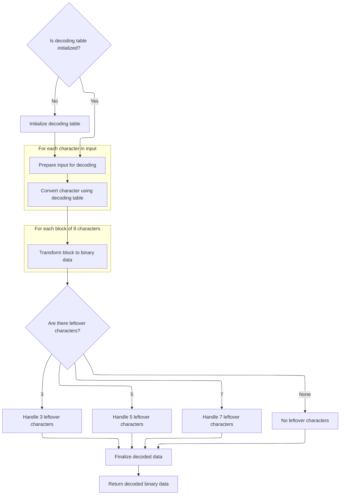
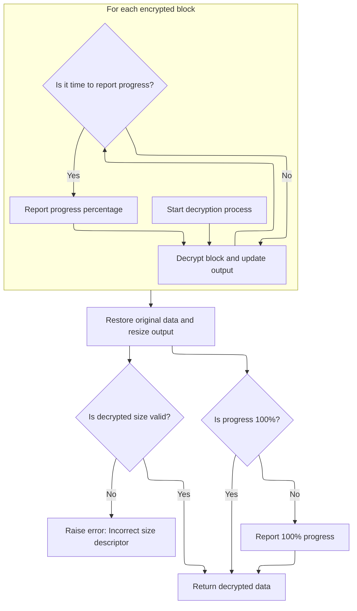
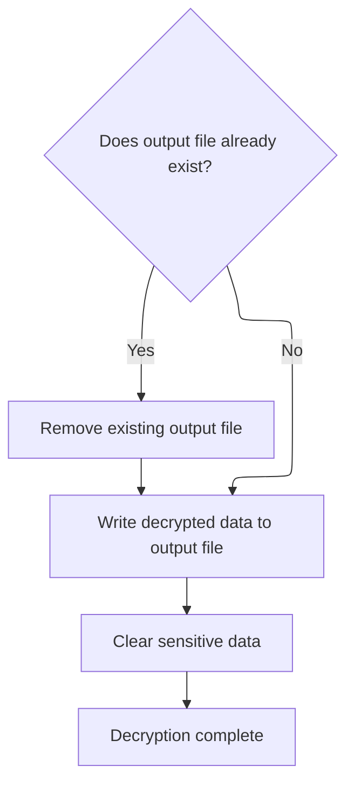

This document describes how encrypted files are decrypted and saved to a specified output location. The flow checks for the existence of the input file, manages overwriting of the output file, supports both raw and Base64-encoded files, and writes the decrypted result to the output file.

# Checking Input and Output File State

```mermaid
%%{init: {"flowchart": {"defaultRenderer": "elk"}} }%%
flowchart TD
    node1{"Does input file exist?"}
    click node1 openCode "HotelManagementSystem/Modules/clsBlowfish.cls:1591:1594"
    node1 -->|"No"| node5["Stop: Cannot decrypt"]
    click node5 openCode "HotelManagementSystem/Modules/clsBlowfish.cls:1592:1593"
    node1 -->|"Yes"| node2{"Does output file exist and overwrite is not allowed?"}
    click node2 openCode "HotelManagementSystem/Modules/clsBlowfish.cls:1595:1598"
    node2 -->|"Yes"| node5
    node2 -->|"No"| node3["Blockwise Decryption and Byte Manipulation"]
    
    node3 --> node4["Save decrypted content to output file"]
    click node4 openCode "HotelManagementSystem/Modules/clsBlowfish.cls:1607:1613"
    node4 --> node5
classDef HeadingStyle fill:#777777,stroke:#333,stroke-width:2px;
click node3 goToHeading "Preparing for Base64 Decoding"
node3:::HeadingStyle
click node3 goToHeading "Blockwise Decryption and Byte Manipulation"
node3:::HeadingStyle

%% Swimm:
%% %%{init: {"flowchart": {"defaultRenderer": "elk"}} }%%
%% flowchart TD
%%     node1{"Does input file exist?"}
%%     click node1 openCode "<SwmPath>[HotelManagementSystem/Modules/clsBlowfish.cls](HotelManagementSystem/Modules/clsBlowfish.cls)</SwmPath>:1591:1594"
%%     node1 -->|"No"| node5["Stop: Cannot decrypt"]
%%     click node5 openCode "<SwmPath>[HotelManagementSystem/Modules/clsBlowfish.cls](HotelManagementSystem/Modules/clsBlowfish.cls)</SwmPath>:1592:1593"
%%     node1 -->|"Yes"| node2{"Does output file exist and overwrite is not allowed?"}
%%     click node2 openCode "<SwmPath>[HotelManagementSystem/Modules/clsBlowfish.cls](HotelManagementSystem/Modules/clsBlowfish.cls)</SwmPath>:1595:1598"
%%     node2 -->|"Yes"| node5
%%     node2 -->|"No"| node3["Blockwise Decryption and Byte Manipulation"]
%%     
%%     node3 --> node4["Save decrypted content to output file"]
%%     click node4 openCode "<SwmPath>[HotelManagementSystem/Modules/clsBlowfish.cls](HotelManagementSystem/Modules/clsBlowfish.cls)</SwmPath>:1607:1613"
%%     node4 --> node5
%% classDef HeadingStyle fill:#777777,stroke:#333,stroke-width:2px;
%% click node3 goToHeading "Preparing for <SwmToken path="HotelManagementSystem/Modules/clsBlowfish.cls" pos="20:15:15" line-data="&#39; Standard Blowfish implementation with file support, Base64 conversion,">`Base64`</SwmToken> Decoding"
%% node3:::HeadingStyle
%% click node3 goToHeading "Blockwise Decryption and Byte Manipulation"
%% node3:::HeadingStyle
```



<SwmSnippet path="/HotelManagementSystem/Modules/clsBlowfish.cls" line="1589">

---

In <SwmToken path="HotelManagementSystem/Modules/clsBlowfish.cls" pos="1589:4:4" line-data="Public Function DecryptFile(InFile As String, OutFile As String, Overwrite As Boolean, Optional Key As String, Optional IsFileIn64 As Boolean) As Boolean">`DecryptFile`</SwmToken>, we start by making sure the input file is actually there—if not, we bail out. Then, before touching the output file, we check if it already exists and whether we're allowed to overwrite it. This prevents accidental data loss and pointless work.

```apex
Public Function DecryptFile(InFile As String, OutFile As String, Overwrite As Boolean, Optional Key As String, Optional IsFileIn64 As Boolean) As Boolean
    On Error GoTo ErrorHandler
    If FileExist(InFile) = False Then
        DecryptFile = False
        Exit Function
    End If
    If FileExist(OutFile) = True And Overwrite = False Then
```

---

</SwmSnippet>

<SwmSnippet path="/HotelManagementSystem/Modules/clsBlowfish.cls" line="1619">

---

<SwmToken path="HotelManagementSystem/Modules/clsBlowfish.cls" pos="1619:4:4" line-data="Private Function FileExist(FilePath As String) As Boolean">`FileExist`</SwmToken> just tries to get the file length—if it works, the file's there; if it errors out, it's not. Simple and fast.

```apex
Private Function FileExist(FilePath As String) As Boolean
    On Error GoTo ErrorHandler
    Call FileLen(FilePath)
    FileExist = True
    Exit Function

ErrorHandler:
    FileExist = False
End Function
```

---

</SwmSnippet>

<SwmSnippet path="/HotelManagementSystem/Modules/clsBlowfish.cls" line="1596">

---

Back in <SwmToken path="HotelManagementSystem/Modules/clsBlowfish.cls" pos="1596:1:1" line-data="        DecryptFile = False">`DecryptFile`</SwmToken>, after checking files, we load the input file into a byte array. If <SwmToken path="HotelManagementSystem/Modules/clsBlowfish.cls" pos="1605:3:3" line-data="    If IsFileIn64 = True Then Buffer() = DecodeArray64(StrConv(Buffer(), vbUnicode))">`IsFileIn64`</SwmToken> is set, we decode the buffer from <SwmToken path="HotelManagementSystem/Modules/clsBlowfish.cls" pos="20:15:15" line-data="&#39; Standard Blowfish implementation with file support, Base64 conversion,">`Base64`</SwmToken> using <SwmToken path="HotelManagementSystem/Modules/clsBlowfish.cls" pos="1605:17:17" line-data="    If IsFileIn64 = True Then Buffer() = DecodeArray64(StrConv(Buffer(), vbUnicode))">`DecodeArray64`</SwmToken>—otherwise, we just keep the raw bytes. This sets up the buffer for decryption.

```apex
        DecryptFile = False
        Exit Function
    End If
    Dim Buffer() As Byte, FileO As Integer
    FileO = FreeFile
    Open InFile For Binary As #FileO
        ReDim Buffer(0 To LOF(FileO) - 1)
        Get #FileO, , Buffer()
    Close #FileO
    If IsFileIn64 = True Then Buffer() = DecodeArray64(StrConv(Buffer(), vbUnicode))
```

---

</SwmSnippet>

## Preparing for <SwmToken path="HotelManagementSystem/Modules/clsBlowfish.cls" pos="20:15:15" line-data="&#39; Standard Blowfish implementation with file support, Base64 conversion,">`Base64`</SwmToken> Decoding



<SwmSnippet path="/HotelManagementSystem/Modules/clsBlowfish.cls" line="192">

---

In <SwmToken path="HotelManagementSystem/Modules/clsBlowfish.cls" pos="192:4:4" line-data="Public Function DecodeArray64(sInput As String) As Byte()">`DecodeArray64`</SwmToken>, we check if the reverse index mapping is set up. If not, we call <SwmToken path="HotelManagementSystem/Modules/clsBlowfish.cls" pos="193:14:14" line-data="    If m_bytReverseIndex(47) &lt;&gt; 63 Then Initialize64">`Initialize64`</SwmToken> to set up the lookup tables needed for decoding. No mapping, no decoding.

```apex
Public Function DecodeArray64(sInput As String) As Byte()
    If m_bytReverseIndex(47) <> 63 Then Initialize64
```

---

</SwmSnippet>

<SwmSnippet path="/HotelManagementSystem/Modules/clsBlowfish.cls" line="56">

---

<SwmToken path="HotelManagementSystem/Modules/clsBlowfish.cls" pos="56:4:4" line-data="Private Sub Initialize64()">`Initialize64`</SwmToken> fills two arrays: one maps indices to <SwmToken path="HotelManagementSystem/Modules/clsBlowfish.cls" pos="20:15:15" line-data="&#39; Standard Blowfish implementation with file support, Base64 conversion,">`Base64`</SwmToken> chars, the other does the reverse. This sets up fast lookups for encoding and decoding.

```apex
Private Sub Initialize64()
    m_bytIndex(0) = 65 'Asc("A")
    m_bytIndex(1) = 66 'Asc("B")
    m_bytIndex(2) = 67 'Asc("C")
    m_bytIndex(3) = 68 'Asc("D")
    m_bytIndex(4) = 69 'Asc("E")
    m_bytIndex(5) = 70 'Asc("F")
    m_bytIndex(6) = 71 'Asc("G")
    m_bytIndex(7) = 72 'Asc("H")
    m_bytIndex(8) = 73 'Asc("I")
    m_bytIndex(9) = 74 'Asc("J")
    m_bytIndex(10) = 75 'Asc("K")
    m_bytIndex(11) = 76 'Asc("L")
    m_bytIndex(12) = 77 'Asc("M")
    m_bytIndex(13) = 78 'Asc("N")
    m_bytIndex(14) = 79 'Asc("O")
    m_bytIndex(15) = 80 'Asc("P")
    m_bytIndex(16) = 81 'Asc("Q")
    m_bytIndex(17) = 82 'Asc("R")
    m_bytIndex(18) = 83 'Asc("S")
    m_bytIndex(19) = 84 'Asc("T")
    m_bytIndex(20) = 85 'Asc("U")
    m_bytIndex(21) = 86 'Asc("V")
    m_bytIndex(22) = 87 'Asc("W")
    m_bytIndex(23) = 88 'Asc("X")
    m_bytIndex(24) = 89 'Asc("Y")
    m_bytIndex(25) = 90 'Asc("Z")
    m_bytIndex(26) = 97 'Asc("a")
    m_bytIndex(27) = 98 'Asc("b")
    m_bytIndex(28) = 99 'Asc("c")
    m_bytIndex(29) = 100 'Asc("d")
    m_bytIndex(30) = 101 'Asc("e")
    m_bytIndex(31) = 102 'Asc("f")
    m_bytIndex(32) = 103 'Asc("g")
    m_bytIndex(33) = 104 'Asc("h")
    m_bytIndex(34) = 105 'Asc("i")
    m_bytIndex(35) = 106 'Asc("j")
    m_bytIndex(36) = 107 'Asc("k")
    m_bytIndex(37) = 108 'Asc("l")
    m_bytIndex(38) = 109 'Asc("m")
    m_bytIndex(39) = 110 'Asc("n")
    m_bytIndex(40) = 111 'Asc("o")
    m_bytIndex(41) = 112 'Asc("p")
    m_bytIndex(42) = 113 'Asc("q")
    m_bytIndex(43) = 114 'Asc("r")
    m_bytIndex(44) = 115 'Asc("s")
    m_bytIndex(45) = 116 'Asc("t")
    m_bytIndex(46) = 117 'Asc("u")
    m_bytIndex(47) = 118 'Asc("v")
    m_bytIndex(48) = 119 'Asc("w")
    m_bytIndex(49) = 120 'Asc("x")
    m_bytIndex(50) = 121 'Asc("y")
    m_bytIndex(51) = 122 'Asc("z")
    m_bytIndex(52) = 48 'Asc("0")
    m_bytIndex(53) = 49 'Asc("1")
    m_bytIndex(54) = 50 'Asc("2")
    m_bytIndex(55) = 51 'Asc("3")
    m_bytIndex(56) = 52 'Asc("4")
    m_bytIndex(57) = 53 'Asc("5")
    m_bytIndex(58) = 54 'Asc("6")
    m_bytIndex(59) = 55 'Asc("7")
    m_bytIndex(60) = 56 'Asc("8")
    m_bytIndex(61) = 57 'Asc("9")
    m_bytIndex(62) = 43 'Asc("+")
    m_bytIndex(63) = 47 'Asc("/")
    m_bytReverseIndex(65) = 0 'Asc("A")
    m_bytReverseIndex(66) = 1 'Asc("B")
    m_bytReverseIndex(67) = 2 'Asc("C")
    m_bytReverseIndex(68) = 3 'Asc("D")
    m_bytReverseIndex(69) = 4 'Asc("E")
    m_bytReverseIndex(70) = 5 'Asc("F")
    m_bytReverseIndex(71) = 6 'Asc("G")
    m_bytReverseIndex(72) = 7 'Asc("H")
    m_bytReverseIndex(73) = 8 'Asc("I")
    m_bytReverseIndex(74) = 9 'Asc("J")
    m_bytReverseIndex(75) = 10 'Asc("K")
    m_bytReverseIndex(76) = 11 'Asc("L")
    m_bytReverseIndex(77) = 12 'Asc("M")
    m_bytReverseIndex(78) = 13 'Asc("N")
    m_bytReverseIndex(79) = 14 'Asc("O")
    m_bytReverseIndex(80) = 15 'Asc("P")
    m_bytReverseIndex(81) = 16 'Asc("Q")
    m_bytReverseIndex(82) = 17 'Asc("R")
    m_bytReverseIndex(83) = 18 'Asc("S")
    m_bytReverseIndex(84) = 19 'Asc("T")
    m_bytReverseIndex(85) = 20 'Asc("U")
    m_bytReverseIndex(86) = 21 'Asc("V")
    m_bytReverseIndex(87) = 22 'Asc("W")
    m_bytReverseIndex(88) = 23 'Asc("X")
    m_bytReverseIndex(89) = 24 'Asc("Y")
    m_bytReverseIndex(90) = 25 'Asc("Z")
    m_bytReverseIndex(97) = 26 'Asc("a")
    m_bytReverseIndex(98) = 27 'Asc("b")
    m_bytReverseIndex(99) = 28 'Asc("c")
    m_bytReverseIndex(100) = 29 'Asc("d")
    m_bytReverseIndex(101) = 30 'Asc("e")
    m_bytReverseIndex(102) = 31 'Asc("f")
    m_bytReverseIndex(103) = 32 'Asc("g")
    m_bytReverseIndex(104) = 33 'Asc("h")
    m_bytReverseIndex(105) = 34 'Asc("i")
    m_bytReverseIndex(106) = 35 'Asc("j")
    m_bytReverseIndex(107) = 36 'Asc("k")
    m_bytReverseIndex(108) = 37 'Asc("l")
    m_bytReverseIndex(109) = 38 'Asc("m")
    m_bytReverseIndex(110) = 39 'Asc("n")
    m_bytReverseIndex(111) = 40 'Asc("o")
    m_bytReverseIndex(112) = 41 'Asc("p")
    m_bytReverseIndex(113) = 42 'Asc("q")
    m_bytReverseIndex(114) = 43 'Asc("r")
    m_bytReverseIndex(115) = 44 'Asc("s")
    m_bytReverseIndex(116) = 45 'Asc("t")
    m_bytReverseIndex(117) = 46 'Asc("u")
    m_bytReverseIndex(118) = 47 'Asc("v")
    m_bytReverseIndex(119) = 48 'Asc("w")
    m_bytReverseIndex(120) = 49 'Asc("x")
    m_bytReverseIndex(121) = 50 'Asc("y")
    m_bytReverseIndex(122) = 51 'Asc("z")
    m_bytReverseIndex(48) = 52 'Asc("0")
    m_bytReverseIndex(49) = 53 'Asc("1")
    m_bytReverseIndex(50) = 54 'Asc("2")
    m_bytReverseIndex(51) = 55 'Asc("3")
    m_bytReverseIndex(52) = 56 'Asc("4")
    m_bytReverseIndex(53) = 57 'Asc("5")
    m_bytReverseIndex(54) = 58 'Asc("6")
    m_bytReverseIndex(55) = 59 'Asc("7")
    m_bytReverseIndex(56) = 60 'Asc("8")
    m_bytReverseIndex(57) = 61 'Asc("9")
    m_bytReverseIndex(43) = 62 'Asc("+")
    m_bytReverseIndex(47) = 63 'Asc("/")
End Sub
```

---

</SwmSnippet>

<SwmSnippet path="/HotelManagementSystem/Modules/clsBlowfish.cls" line="194">

---

Back in <SwmToken path="HotelManagementSystem/Modules/clsBlowfish.cls" pos="231:1:1" line-data="    DecodeArray64 = bytResult">`DecodeArray64`</SwmToken>, with the lookup tables ready, we strip out newlines and '=' padding, map each byte through the reverse index, and decode the data in chunks. Leftovers are handled based on the remaining bytes, and the result is copied out as the decoded byte array.

```apex
    Dim bytInput() As Byte
    Dim bytWorkspace() As Byte
    Dim bytResult() As Byte
    Dim lInputCounter As Long
    Dim lWorkspaceCounter As Long
    
    bytInput = Replace(Replace(sInput, vbCrLf, ""), "=", "")
    ReDim bytWorkspace(LBound(bytInput) To (UBound(bytInput) * 2)) As Byte
    lWorkspaceCounter = LBound(bytWorkspace)
    For lInputCounter = LBound(bytInput) To UBound(bytInput)
        bytInput(lInputCounter) = m_bytReverseIndex(bytInput(lInputCounter))
    Next lInputCounter
    
    For lInputCounter = LBound(bytInput) To (UBound(bytInput) - ((UBound(bytInput) Mod 8) + 8)) Step 8
        bytWorkspace(lWorkspaceCounter) = (bytInput(lInputCounter) * k_bytShift2) + (bytInput(lInputCounter + 2) \ k_bytShift4)
        bytWorkspace(lWorkspaceCounter + 1) = ((bytInput(lInputCounter + 2) And k_bytMask2) * k_bytShift4) + (bytInput(lInputCounter + 4) \ k_bytShift2)
        bytWorkspace(lWorkspaceCounter + 2) = ((bytInput(lInputCounter + 4) And k_bytMask1) * k_bytShift6) + bytInput(lInputCounter + 6)
        lWorkspaceCounter = lWorkspaceCounter + 3
    Next lInputCounter
    
    Select Case (UBound(bytInput) Mod 8):
        Case 3:
            bytWorkspace(lWorkspaceCounter) = (bytInput(lInputCounter) * k_bytShift2) + (bytInput(lInputCounter + 2) \ k_bytShift4)
        Case 5:
            bytWorkspace(lWorkspaceCounter) = (bytInput(lInputCounter) * k_bytShift2) + (bytInput(lInputCounter + 2) \ k_bytShift4)
            bytWorkspace(lWorkspaceCounter + 1) = ((bytInput(lInputCounter + 2) And k_bytMask2) * k_bytShift4) + (bytInput(lInputCounter + 4) \ k_bytShift2)
            lWorkspaceCounter = lWorkspaceCounter + 1
        Case 7:
            bytWorkspace(lWorkspaceCounter) = (bytInput(lInputCounter) * k_bytShift2) + (bytInput(lInputCounter + 2) \ k_bytShift4)
            bytWorkspace(lWorkspaceCounter + 1) = ((bytInput(lInputCounter + 2) And k_bytMask2) * k_bytShift4) + (bytInput(lInputCounter + 4) \ k_bytShift2)
            bytWorkspace(lWorkspaceCounter + 2) = ((bytInput(lInputCounter + 4) And k_bytMask1) * k_bytShift6) + bytInput(lInputCounter + 6)
            lWorkspaceCounter = lWorkspaceCounter + 2
    End Select
    
    ReDim bytResult(LBound(bytWorkspace) To lWorkspaceCounter) As Byte
    If LBound(bytWorkspace) = 0 Then lWorkspaceCounter = lWorkspaceCounter + 1
    CopyMemory VarPtr(bytResult(LBound(bytResult))), VarPtr(bytWorkspace(LBound(bytWorkspace))), lWorkspaceCounter
    DecodeArray64 = bytResult
End Function
```

---

</SwmSnippet>

## Decrypting the Byte Buffer

<SwmSnippet path="/HotelManagementSystem/Modules/clsBlowfish.cls" line="1606">

---

Back in <SwmToken path="HotelManagementSystem/Modules/clsBlowfish.cls" pos="1589:4:4" line-data="Public Function DecryptFile(InFile As String, OutFile As String, Overwrite As Boolean, Optional Key As String, Optional IsFileIn64 As Boolean) As Boolean">`DecryptFile`</SwmToken>, after decoding (if needed), we call <SwmToken path="HotelManagementSystem/Modules/clsBlowfish.cls" pos="1606:3:3" line-data="    Call DecryptByte(Buffer(), Key)">`DecryptByte`</SwmToken> to actually decrypt the buffer using the provided Key. The buffer is updated in place.

```apex
    Call DecryptByte(Buffer(), Key)
```

---

</SwmSnippet>

## Blockwise Decryption and Byte Manipulation

<SwmSnippet path="/HotelManagementSystem/Modules/clsBlowfish.cls" line="394">

---

In <SwmToken path="HotelManagementSystem/Modules/clsBlowfish.cls" pos="394:4:4" line-data="Public Sub DecryptByte(byteArray() As Byte, Optional Key As String)">`DecryptByte`</SwmToken>, we loop through the buffer in 8-byte blocks. For each block, we use <SwmToken path="HotelManagementSystem/Modules/clsBlowfish.cls" pos="400:3:3" line-data="        Call GetWord(LeftWord, byteArray(), Offset)">`GetWord`</SwmToken> to extract two 4-byte words (left and right) from the buffer, which are needed for the Blowfish decryption.

```apex
Public Sub DecryptByte(byteArray() As Byte, Optional Key As String)
    On Error GoTo ErrorHandler
    Dim Offset As Long, OrigLen As Long, LeftWord As Long, RightWord As Long, CipherLen As Long, CipherLeft As Long, CipherRight As Long, CurrPercent As Long, NextPercent As Long
    If (Len(Key) > 0) Then Me.Key = Key
    CipherLen = UBound(byteArray) + 1
    For Offset = 0 To (CipherLen - 1) Step 8
        Call GetWord(LeftWord, byteArray(), Offset)
        Call GetWord(RightWord, byteArray(), Offset + 4)
```

---

</SwmSnippet>

<SwmSnippet path="/HotelManagementSystem/Modules/clsBlowfish.cls" line="428">

---

<SwmToken path="HotelManagementSystem/Modules/clsBlowfish.cls" pos="428:6:6" line-data="Private Static Sub GetWord(LongValue As Long, CryptBuffer() As Byte, Offset As Long)">`GetWord`</SwmToken> grabs 4 bytes from the buffer at the given offset, reverses their order, and packs them into a Long. This handles the endianness needed for the algorithm.

```apex
Private Static Sub GetWord(LongValue As Long, CryptBuffer() As Byte, Offset As Long)
    Dim bb(0 To 3) As Byte
    bb(3) = CryptBuffer(Offset)
    bb(2) = CryptBuffer(Offset + 1)
    bb(1) = CryptBuffer(Offset + 2)
    bb(0) = CryptBuffer(Offset + 3)
    Call CopyMem(LongValue, bb(0), 4)
End Sub
```

---

</SwmSnippet>

<SwmSnippet path="/HotelManagementSystem/Modules/clsBlowfish.cls" line="402">

---

Back in <SwmToken path="HotelManagementSystem/Modules/clsBlowfish.cls" pos="394:4:4" line-data="Public Sub DecryptByte(byteArray() As Byte, Optional Key As String)">`DecryptByte`</SwmToken>, after splitting the block into left and right words, we call <SwmToken path="HotelManagementSystem/Modules/clsBlowfish.cls" pos="402:3:3" line-data="        Call DecryptBlock(LeftWord, RightWord)">`DecryptBlock`</SwmToken> to actually decrypt those words using Blowfish.

```apex
        Call DecryptBlock(LeftWord, RightWord)
```

---

</SwmSnippet>

### Decrypting a Block with Blowfish

See <SwmLink doc-title="Decrypting a data block">[Decrypting a data block](/.swm/decrypting-a-data-block.koo255i5.sw.md)</SwmLink>

### Chaining and Writing Decrypted Data



<SwmSnippet path="/HotelManagementSystem/Modules/clsBlowfish.cls" line="403">

---

Back in <SwmToken path="HotelManagementSystem/Modules/clsBlowfish.cls" pos="394:4:4" line-data="Public Sub DecryptByte(byteArray() As Byte, Optional Key As String)">`DecryptByte`</SwmToken>, after decrypting the block, we XOR the results with the previous ciphertext words for CBC mode. Then we use <SwmToken path="HotelManagementSystem/Modules/clsBlowfish.cls" pos="405:3:3" line-data="        Call GetWord(CipherLeft, byteArray(), Offset)">`GetWord`</SwmToken> again to update <SwmToken path="HotelManagementSystem/Modules/clsBlowfish.cls" pos="403:9:9" line-data="        LeftWord = LeftWord Xor CipherLeft">`CipherLeft`</SwmToken> and <SwmToken path="HotelManagementSystem/Modules/clsBlowfish.cls" pos="404:9:9" line-data="        RightWord = RightWord Xor CipherRight">`CipherRight`</SwmToken> for the next block.

```apex
        LeftWord = LeftWord Xor CipherLeft
        RightWord = RightWord Xor CipherRight
        Call GetWord(CipherLeft, byteArray(), Offset)
        Call GetWord(CipherRight, byteArray(), Offset + 4)
```

---

</SwmSnippet>

<SwmSnippet path="/HotelManagementSystem/Modules/clsBlowfish.cls" line="407">

---

Back in <SwmToken path="HotelManagementSystem/Modules/clsBlowfish.cls" pos="394:4:4" line-data="Public Sub DecryptByte(byteArray() As Byte, Optional Key As String)">`DecryptByte`</SwmToken>, after updating the words, we use <SwmToken path="HotelManagementSystem/Modules/clsBlowfish.cls" pos="407:3:3" line-data="        Call PutWord(LeftWord, byteArray(), Offset)">`PutWord`</SwmToken> to write them back into the buffer in the right byte order.

```apex
        Call PutWord(LeftWord, byteArray(), Offset)
        Call PutWord(RightWord, byteArray(), Offset + 4)
```

---

</SwmSnippet>

<SwmSnippet path="/HotelManagementSystem/Modules/clsBlowfish.cls" line="436">

---

<SwmToken path="HotelManagementSystem/Modules/clsBlowfish.cls" pos="436:6:6" line-data="Private Static Sub PutWord(LongValue As Long, CryptBuffer() As Byte, Offset As Long)">`PutWord`</SwmToken> takes a Long, splits it into 4 bytes, reverses them, and writes them back to the buffer at the given offset. Keeps the byte order consistent for decryption.

```apex
Private Static Sub PutWord(LongValue As Long, CryptBuffer() As Byte, Offset As Long)
    Dim bb(0 To 3) As Byte
    Call CopyMem(bb(0), LongValue, 4)
    CryptBuffer(Offset) = bb(3)
    CryptBuffer(Offset + 1) = bb(2)
    CryptBuffer(Offset + 2) = bb(1)
    CryptBuffer(Offset + 3) = bb(0)
End Sub
```

---

</SwmSnippet>

<SwmSnippet path="/HotelManagementSystem/Modules/clsBlowfish.cls" line="409">

---

Back in <SwmToken path="HotelManagementSystem/Modules/clsBlowfish.cls" pos="394:4:4" line-data="Public Sub DecryptByte(byteArray() As Byte, Optional Key As String)">`DecryptByte`</SwmToken>, after writing the decrypted words, we update progress, check the size descriptor for sanity, shift the decrypted data to the start, resize the buffer, and fire a final progress event if needed.

```apex
        If Offset >= NextPercent Then
            CurrPercent = Int((Offset / CipherLen) * 100)
            NextPercent = (CipherLen * ((CurrPercent + 1) / 100)) + 1
            RaiseEvent Progress(CurrPercent)
        End If
    Next
    Call CopyMem(OrigLen, byteArray(8), 4)
    If (CipherLen - OrigLen > 19) Or (CipherLen - OrigLen < 12) Then Call err.Raise(vbObjectError, , "Incorrect size descriptor in Blowfish decryption")
    Call CopyMem(byteArray(0), byteArray(12), OrigLen)
    ReDim Preserve byteArray(OrigLen - 1)
    If CurrPercent <> 100 Then RaiseEvent Progress(100)

ErrorHandler:
End Sub
```

---

</SwmSnippet>

## Writing Output and Cleanup



<SwmSnippet path="/HotelManagementSystem/Modules/clsBlowfish.cls" line="1607">

---

Back in <SwmToken path="HotelManagementSystem/Modules/clsBlowfish.cls" pos="1589:4:4" line-data="Public Function DecryptFile(InFile As String, OutFile As String, Overwrite As Boolean, Optional Key As String, Optional IsFileIn64 As Boolean) As Boolean">`DecryptFile`</SwmToken>, before writing the decrypted data, we check if the output file exists and delete it if it does. This avoids issues with overwriting and ensures we're writing to a clean file.

```apex
    If FileExist(OutFile) = True Then Kill OutFile
```

---

</SwmSnippet>

<SwmSnippet path="/HotelManagementSystem/Modules/clsBlowfish.cls" line="1608">

---

Back in <SwmToken path="HotelManagementSystem/Modules/clsBlowfish.cls" pos="1611:1:1" line-data="    DecryptFile = True">`DecryptFile`</SwmToken>, after deleting the old output file (if needed), we write the decrypted buffer to the output file, clean up all variables, set the return value to True, and exit. If anything fails, we handle it in the error handler.

```apex
    Open OutFile For Binary As #FileO
        Put #FileO, , Buffer()
    Close #FileO
    DecryptFile = True
    Erase Buffer(): Key = "": InFile = "": OutFile = ""
    Exit Function

ErrorHandler:
    Erase Buffer(): Key = "": InFile = "": OutFile = ""
    DecryptFile = False
End Function
```

---

</SwmSnippet>

&nbsp;

*This is an auto-generated document by Swimm 🌊 and has not yet been verified by a human*

<SwmMeta version="3.0.0" repo-id="Z2l0aHViJTNBJTNBY3RzLVZCNi1Qcm9qZWN0cyUzQSUzQVN3aW1tLURlbW8=" repo-name="cts-VB6-Projects"><sup>Powered by [Swimm](https://app.swimm.io/)</sup></SwmMeta>
