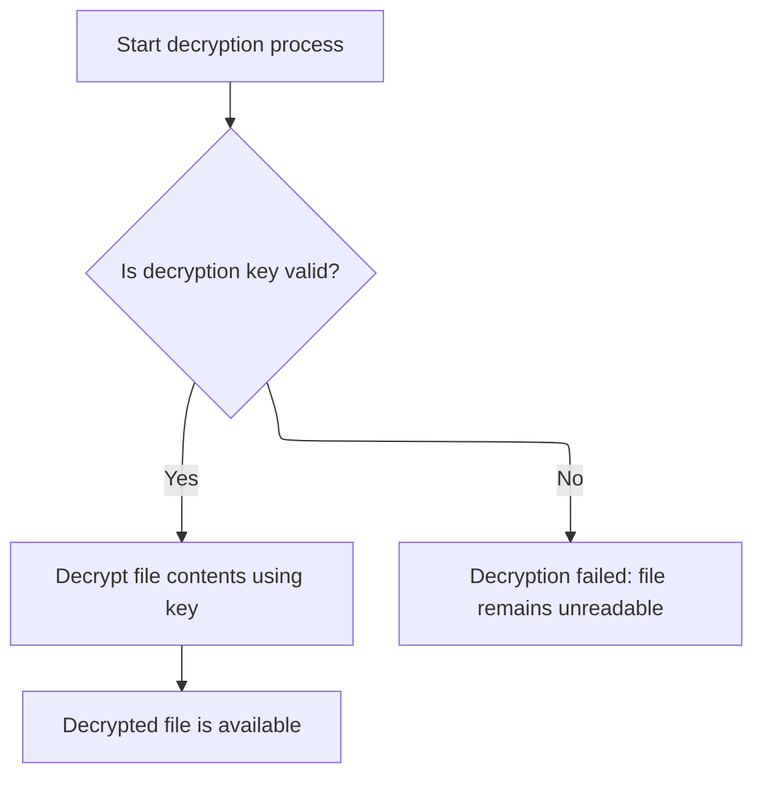
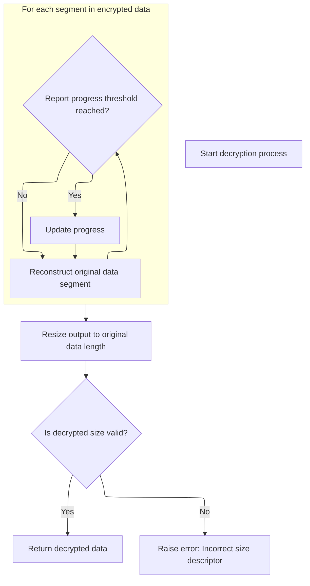

```mermaid
%%{init: {"flowchart": {"defaultRenderer": "elk"}} }%%
flowchart TD
    node1{"Is decoding table initialized?"}
    click node1 openCode "HotelManagementSystem/Modules/clsBlowfish.cls:193:193"
    node1 -->|"No"| node2["Initialize decoding table"]
    click node2 openCode "HotelManagementSystem/Modules/clsBlowfish.cls:56:185"
    node1 -->|"Yes"| node3["Prepare input string for decoding"]
    click node3 openCode "HotelManagementSystem/Modules/clsBlowfish.cls:200:200"
    node2 --> node3
    
    subgraph loop1["For each character in input"]
        node3 --> node4["Convert character to value using decoding table"]
        click node4 openCode "HotelManagementSystem/Modules/clsBlowfish.cls:204:205"
    end
    
    subgraph loop2["For each block of 8 characters"]
        node4 --> node5["Decode block to bytes"]
        click node5 openCode "HotelManagementSystem/Modules/clsBlowfish.cls:207:212"
    end
    node5 --> node6{"Characters left after blocks?"}
    click node6 openCode "HotelManagementSystem/Modules/clsBlowfish.cls:214:226"
    node6 -->|"Yes"| node7{"How many left?"}
    node6 -->|"No"| node10["Produce output bytes"]
    node7 -->|"3"| node8["Decode 3 characters"]
    click node8 openCode "HotelManagementSystem/Modules/clsBlowfish.cls:216:216"
    node7 -->|"5"| node9["Decode 5 characters"]
    click node9 openCode "HotelManagementSystem/Modules/clsBlowfish.cls:218:220"
    node7 -->|"7"| node11["Decode 7 characters"]
    click node11 openCode "HotelManagementSystem/Modules/clsBlowfish.cls:222:225"
    node8 --> node10
    node9 --> node10
    node11 --> node10
    node10["Return decoded bytes"]
    click node10 openCode "HotelManagementSystem/Modules/clsBlowfish.cls:228:231"

classDef HeadingStyle fill:#777777,stroke:#333,stroke-width:2px;

%% Swimm:
%% %%{init: {"flowchart": {"defaultRenderer": "elk"}} }%%
%% flowchart TD
%%     node1{"Is decoding table initialized?"}
%%     click node1 openCode "<SwmPath>[HotelManagementSystem/Modules/clsBlowfish.cls](HotelManagementSystem/Modules/clsBlowfish.cls)</SwmPath>:193:193"
%%     node1 -->|"No"| node2["Initialize decoding table"]
%%     click node2 openCode "<SwmPath>[HotelManagementSystem/Modules/clsBlowfish.cls](HotelManagementSystem/Modules/clsBlowfish.cls)</SwmPath>:56:185"
%%     node1 -->|"Yes"| node3["Prepare input string for decoding"]
%%     click node3 openCode "<SwmPath>[HotelManagementSystem/Modules/clsBlowfish.cls](HotelManagementSystem/Modules/clsBlowfish.cls)</SwmPath>:200:200"
%%     node2 --> node3
%%     
%%     subgraph loop1["For each character in input"]
%%         node3 --> node4["Convert character to value using decoding table"]
%%         click node4 openCode "<SwmPath>[HotelManagementSystem/Modules/clsBlowfish.cls](HotelManagementSystem/Modules/clsBlowfish.cls)</SwmPath>:204:205"
%%     end
%%     
%%     subgraph loop2["For each block of 8 characters"]
%%         node4 --> node5["Decode block to bytes"]
%%         click node5 openCode "<SwmPath>[HotelManagementSystem/Modules/clsBlowfish.cls](HotelManagementSystem/Modules/clsBlowfish.cls)</SwmPath>:207:212"
%%     end
%%     node5 --> node6{"Characters left after blocks?"}
%%     click node6 openCode "<SwmPath>[HotelManagementSystem/Modules/clsBlowfish.cls](HotelManagementSystem/Modules/clsBlowfish.cls)</SwmPath>:214:226"
%%     node6 -->|"Yes"| node7{"How many left?"}
%%     node6 -->|"No"| node10["Produce output bytes"]
%%     node7 -->|"3"| node8["Decode 3 characters"]
%%     click node8 openCode "<SwmPath>[HotelManagementSystem/Modules/clsBlowfish.cls](HotelManagementSystem/Modules/clsBlowfish.cls)</SwmPath>:216:216"
%%     node7 -->|"5"| node9["Decode 5 characters"]
%%     click node9 openCode "<SwmPath>[HotelManagementSystem/Modules/clsBlowfish.cls](HotelManagementSystem/Modules/clsBlowfish.cls)</SwmPath>:218:220"
%%     node7 -->|"7"| node11["Decode 7 characters"]
%%     click node11 openCode "<SwmPath>[HotelManagementSystem/Modules/clsBlowfish.cls](HotelManagementSystem/Modules/clsBlowfish.cls)</SwmPath>:222:225"
%%     node8 --> node10
%%     node9 --> node10
%%     node11 --> node10
%%     node10["Return decoded bytes"]
%%     click node10 openCode "<SwmPath>[HotelManagementSystem/Modules/clsBlowfish.cls](HotelManagementSystem/Modules/clsBlowfish.cls)</SwmPath>:228:231"
%% 
%% classDef HeadingStyle fill:#777777,stroke:#333,stroke-width:2px;
```

This document describes how encrypted files are restored to their original, readable state and saved to a specified location. The flow supports secure file management by verifying file conditions, optionally decoding <SwmToken path="HotelManagementSystem/Modules/clsBlowfish.cls" pos="20:15:15" line-data="&#39; Standard Blowfish implementation with file support, Base64 conversion,">`Base64`</SwmToken> data, and applying Blowfish decryption. The process receives an encrypted file and outputs a decrypted file.

# File Checks and Buffer Preparation

```mermaid
%%{init: {"flowchart": {"defaultRenderer": "elk"}} }%%
flowchart TD
    node1["Start decryption process"]
    click node1 openCode "HotelManagementSystem/Modules/clsBlowfish.cls:1589:1591"
    node1 --> node2{"Are input and output file conditions met? (input exists, output can be overwritten)"}
    click node2 openCode "HotelManagementSystem/Modules/clsBlowfish.cls:1591:1598"
    node2 -->|"No"| node5["Fail and exit"]
    click node5 openCode "HotelManagementSystem/Modules/clsBlowfish.cls:1592:1598"
    node2 -->|"Yes"| node3{"Is file Base64 encoded? (IsFileIn64 = True)"}
    click node3 openCode "HotelManagementSystem/Modules/clsBlowfish.cls:1605:1605"
    node3 -->|"Yes"| node4["Base64 Decoding and Lookup Table Setup"]
    
    node3 -->|"No"| node6["Block Decryption and Word Extraction"]
    
    node4 --> node6

classDef HeadingStyle fill:#777777,stroke:#333,stroke-width:2px;
click node4 goToHeading "HotelManagementSystem/Modules/clsBlowfish.cls:20 Decoding and Lookup Table Setup"
node4:::HeadingStyle
click node6 goToHeading "Block Decryption and Word Extraction"
node6:::HeadingStyle

%% Swimm:
%% %%{init: {"flowchart": {"defaultRenderer": "elk"}} }%%
%% flowchart TD
%%     node1["Start decryption process"]
%%     click node1 openCode "<SwmPath>[HotelManagementSystem/Modules/clsBlowfish.cls](HotelManagementSystem/Modules/clsBlowfish.cls)</SwmPath>:1589:1591"
%%     node1 --> node2{"Are input and output file conditions met? (input exists, output can be overwritten)"}
%%     click node2 openCode "<SwmPath>[HotelManagementSystem/Modules/clsBlowfish.cls](HotelManagementSystem/Modules/clsBlowfish.cls)</SwmPath>:1591:1598"
%%     node2 -->|"No"| node5["Fail and exit"]
%%     click node5 openCode "<SwmPath>[HotelManagementSystem/Modules/clsBlowfish.cls](HotelManagementSystem/Modules/clsBlowfish.cls)</SwmPath>:1592:1598"
%%     node2 -->|"Yes"| node3{"Is file <SwmToken path="HotelManagementSystem/Modules/clsBlowfish.cls" pos="20:15:15" line-data="&#39; Standard Blowfish implementation with file support, Base64 conversion,">`Base64`</SwmToken> encoded? (<SwmToken path="HotelManagementSystem/Modules/clsBlowfish.cls" pos="1589:38:38" line-data="Public Function DecryptFile(InFile As String, OutFile As String, Overwrite As Boolean, Optional Key As String, Optional IsFileIn64 As Boolean) As Boolean">`IsFileIn64`</SwmToken> = True)"}
%%     click node3 openCode "<SwmPath>[HotelManagementSystem/Modules/clsBlowfish.cls](HotelManagementSystem/Modules/clsBlowfish.cls)</SwmPath>:1605:1605"
%%     node3 -->|"Yes"| node4["<SwmToken path="HotelManagementSystem/Modules/clsBlowfish.cls" pos="20:15:15" line-data="&#39; Standard Blowfish implementation with file support, Base64 conversion,">`Base64`</SwmToken> Decoding and Lookup Table Setup"]
%%     
%%     node3 -->|"No"| node6["Block Decryption and Word Extraction"]
%%     
%%     node4 --> node6
%% 
%% classDef HeadingStyle fill:#777777,stroke:#333,stroke-width:2px;
%% click node4 goToHeading "<SwmToken path="HotelManagementSystem/Modules/clsBlowfish.cls" pos="20:15:15" line-data="&#39; Standard Blowfish implementation with file support, Base64 conversion,">`Base64`</SwmToken> Decoding and Lookup Table Setup"
%% node4:::HeadingStyle
%% click node6 goToHeading "Block Decryption and Word Extraction"
%% node6:::HeadingStyle
```



<SwmSnippet path="/HotelManagementSystem/Modules/clsBlowfish.cls" line="1589">

---

In <SwmToken path="HotelManagementSystem/Modules/clsBlowfish.cls" pos="1589:4:4" line-data="Public Function DecryptFile(InFile As String, OutFile As String, Overwrite As Boolean, Optional Key As String, Optional IsFileIn64 As Boolean) As Boolean">`DecryptFile`</SwmToken>, we check if the input file exists and bail if not, then make sure we don't overwrite the output file unless allowed. After that, we load the input file into a buffer for decryption.

```apex
Public Function DecryptFile(InFile As String, OutFile As String, Overwrite As Boolean, Optional Key As String, Optional IsFileIn64 As Boolean) As Boolean
    On Error GoTo ErrorHandler
    If FileExist(InFile) = False Then
        DecryptFile = False
        Exit Function
    End If
    If FileExist(OutFile) = True And Overwrite = False Then
        DecryptFile = False
        Exit Function
    End If
    Dim Buffer() As Byte, FileO As Integer
    FileO = FreeFile
    Open InFile For Binary As #FileO
        ReDim Buffer(0 To LOF(FileO) - 1)
        Get #FileO, , Buffer()
    Close #FileO
```

---

</SwmSnippet>

<SwmSnippet path="/HotelManagementSystem/Modules/clsBlowfish.cls" line="1619">

---

<SwmToken path="HotelManagementSystem/Modules/clsBlowfish.cls" pos="1619:4:4" line-data="Private Function FileExist(FilePath As String) As Boolean">`FileExist`</SwmToken> checks if a file is there by trying to get its length with <SwmToken path="HotelManagementSystem/Modules/clsBlowfish.cls" pos="1621:3:3" line-data="    Call FileLen(FilePath)">`FileLen`</SwmToken>. If that works, the file exists. If it errors out, we catch it and return False, so it's a quick existence check based on whether <SwmToken path="HotelManagementSystem/Modules/clsBlowfish.cls" pos="1621:3:3" line-data="    Call FileLen(FilePath)">`FileLen`</SwmToken> succeeds.

```apex
Private Function FileExist(FilePath As String) As Boolean
    On Error GoTo ErrorHandler
    Call FileLen(FilePath)
    FileExist = True
    Exit Function

ErrorHandler:
    FileExist = False
End Function
```

---

</SwmSnippet>

<SwmSnippet path="/HotelManagementSystem/Modules/clsBlowfish.cls" line="1605">

---

Back in <SwmToken path="HotelManagementSystem/Modules/clsBlowfish.cls" pos="1589:4:4" line-data="Public Function DecryptFile(InFile As String, OutFile As String, Overwrite As Boolean, Optional Key As String, Optional IsFileIn64 As Boolean) As Boolean">`DecryptFile`</SwmToken>, after checking file existence, if <SwmToken path="HotelManagementSystem/Modules/clsBlowfish.cls" pos="1605:3:3" line-data="    If IsFileIn64 = True Then Buffer() = DecodeArray64(StrConv(Buffer(), vbUnicode))">`IsFileIn64`</SwmToken> is True, we decode the buffer from base64 using <SwmToken path="HotelManagementSystem/Modules/clsBlowfish.cls" pos="1605:17:17" line-data="    If IsFileIn64 = True Then Buffer() = DecodeArray64(StrConv(Buffer(), vbUnicode))">`DecodeArray64`</SwmToken>. This step is only needed if the input file was encoded as base64, so we get the actual bytes to work with for decryption.

```apex
    If IsFileIn64 = True Then Buffer() = DecodeArray64(StrConv(Buffer(), vbUnicode))
```

---

</SwmSnippet>

## <SwmToken path="HotelManagementSystem/Modules/clsBlowfish.cls" pos="20:15:15" line-data="&#39; Standard Blowfish implementation with file support, Base64 conversion,">`Base64`</SwmToken> Decoding and Lookup Table Setup



<SwmSnippet path="/HotelManagementSystem/Modules/clsBlowfish.cls" line="192">

---

<SwmToken path="HotelManagementSystem/Modules/clsBlowfish.cls" pos="192:4:4" line-data="Public Function DecodeArray64(sInput As String) As Byte()">`DecodeArray64`</SwmToken> sets up the lookup table if needed, strips out junk, decodes the input in blocks, and handles leftovers to get the final byte array.

```apex
Public Function DecodeArray64(sInput As String) As Byte()
    If m_bytReverseIndex(47) <> 63 Then Initialize64
    Dim bytInput() As Byte
    Dim bytWorkspace() As Byte
    Dim bytResult() As Byte
    Dim lInputCounter As Long
    Dim lWorkspaceCounter As Long
    
    bytInput = Replace(Replace(sInput, vbCrLf, ""), "=", "")
    ReDim bytWorkspace(LBound(bytInput) To (UBound(bytInput) * 2)) As Byte
    lWorkspaceCounter = LBound(bytWorkspace)
    For lInputCounter = LBound(bytInput) To UBound(bytInput)
        bytInput(lInputCounter) = m_bytReverseIndex(bytInput(lInputCounter))
    Next lInputCounter
    
    For lInputCounter = LBound(bytInput) To (UBound(bytInput) - ((UBound(bytInput) Mod 8) + 8)) Step 8
        bytWorkspace(lWorkspaceCounter) = (bytInput(lInputCounter) * k_bytShift2) + (bytInput(lInputCounter + 2) \ k_bytShift4)
        bytWorkspace(lWorkspaceCounter + 1) = ((bytInput(lInputCounter + 2) And k_bytMask2) * k_bytShift4) + (bytInput(lInputCounter + 4) \ k_bytShift2)
        bytWorkspace(lWorkspaceCounter + 2) = ((bytInput(lInputCounter + 4) And k_bytMask1) * k_bytShift6) + bytInput(lInputCounter + 6)
        lWorkspaceCounter = lWorkspaceCounter + 3
    Next lInputCounter
    
    Select Case (UBound(bytInput) Mod 8):
        Case 3:
            bytWorkspace(lWorkspaceCounter) = (bytInput(lInputCounter) * k_bytShift2) + (bytInput(lInputCounter + 2) \ k_bytShift4)
        Case 5:
            bytWorkspace(lWorkspaceCounter) = (bytInput(lInputCounter) * k_bytShift2) + (bytInput(lInputCounter + 2) \ k_bytShift4)
            bytWorkspace(lWorkspaceCounter + 1) = ((bytInput(lInputCounter + 2) And k_bytMask2) * k_bytShift4) + (bytInput(lInputCounter + 4) \ k_bytShift2)
            lWorkspaceCounter = lWorkspaceCounter + 1
        Case 7:
            bytWorkspace(lWorkspaceCounter) = (bytInput(lInputCounter) * k_bytShift2) + (bytInput(lInputCounter + 2) \ k_bytShift4)
            bytWorkspace(lWorkspaceCounter + 1) = ((bytInput(lInputCounter + 2) And k_bytMask2) * k_bytShift4) + (bytInput(lInputCounter + 4) \ k_bytShift2)
            bytWorkspace(lWorkspaceCounter + 2) = ((bytInput(lInputCounter + 4) And k_bytMask1) * k_bytShift6) + bytInput(lInputCounter + 6)
            lWorkspaceCounter = lWorkspaceCounter + 2
    End Select
    
    ReDim bytResult(LBound(bytWorkspace) To lWorkspaceCounter) As Byte
    If LBound(bytWorkspace) = 0 Then lWorkspaceCounter = lWorkspaceCounter + 1
    CopyMemory VarPtr(bytResult(LBound(bytResult))), VarPtr(bytWorkspace(LBound(bytWorkspace))), lWorkspaceCounter
    DecodeArray64 = bytResult
End Function
```

---

</SwmSnippet>

<SwmSnippet path="/HotelManagementSystem/Modules/clsBlowfish.cls" line="56">

---

<SwmToken path="HotelManagementSystem/Modules/clsBlowfish.cls" pos="56:4:4" line-data="Private Sub Initialize64()">`Initialize64`</SwmToken> fills out two arrays: one maps indices to base64 chars, the other maps chars back to indices. This sets up fast lookups for both encoding and decoding, so we don't have to search or compute these every time.

```apex
Private Sub Initialize64()
    m_bytIndex(0) = 65 'Asc("A")
    m_bytIndex(1) = 66 'Asc("B")
    m_bytIndex(2) = 67 'Asc("C")
    m_bytIndex(3) = 68 'Asc("D")
    m_bytIndex(4) = 69 'Asc("E")
    m_bytIndex(5) = 70 'Asc("F")
    m_bytIndex(6) = 71 'Asc("G")
    m_bytIndex(7) = 72 'Asc("H")
    m_bytIndex(8) = 73 'Asc("I")
    m_bytIndex(9) = 74 'Asc("J")
    m_bytIndex(10) = 75 'Asc("K")
    m_bytIndex(11) = 76 'Asc("L")
    m_bytIndex(12) = 77 'Asc("M")
    m_bytIndex(13) = 78 'Asc("N")
    m_bytIndex(14) = 79 'Asc("O")
    m_bytIndex(15) = 80 'Asc("P")
    m_bytIndex(16) = 81 'Asc("Q")
    m_bytIndex(17) = 82 'Asc("R")
    m_bytIndex(18) = 83 'Asc("S")
    m_bytIndex(19) = 84 'Asc("T")
    m_bytIndex(20) = 85 'Asc("U")
    m_bytIndex(21) = 86 'Asc("V")
    m_bytIndex(22) = 87 'Asc("W")
    m_bytIndex(23) = 88 'Asc("X")
    m_bytIndex(24) = 89 'Asc("Y")
    m_bytIndex(25) = 90 'Asc("Z")
    m_bytIndex(26) = 97 'Asc("a")
    m_bytIndex(27) = 98 'Asc("b")
    m_bytIndex(28) = 99 'Asc("c")
    m_bytIndex(29) = 100 'Asc("d")
    m_bytIndex(30) = 101 'Asc("e")
    m_bytIndex(31) = 102 'Asc("f")
    m_bytIndex(32) = 103 'Asc("g")
    m_bytIndex(33) = 104 'Asc("h")
    m_bytIndex(34) = 105 'Asc("i")
    m_bytIndex(35) = 106 'Asc("j")
    m_bytIndex(36) = 107 'Asc("k")
    m_bytIndex(37) = 108 'Asc("l")
    m_bytIndex(38) = 109 'Asc("m")
    m_bytIndex(39) = 110 'Asc("n")
    m_bytIndex(40) = 111 'Asc("o")
    m_bytIndex(41) = 112 'Asc("p")
    m_bytIndex(42) = 113 'Asc("q")
    m_bytIndex(43) = 114 'Asc("r")
    m_bytIndex(44) = 115 'Asc("s")
    m_bytIndex(45) = 116 'Asc("t")
    m_bytIndex(46) = 117 'Asc("u")
    m_bytIndex(47) = 118 'Asc("v")
    m_bytIndex(48) = 119 'Asc("w")
    m_bytIndex(49) = 120 'Asc("x")
    m_bytIndex(50) = 121 'Asc("y")
    m_bytIndex(51) = 122 'Asc("z")
    m_bytIndex(52) = 48 'Asc("0")
    m_bytIndex(53) = 49 'Asc("1")
    m_bytIndex(54) = 50 'Asc("2")
    m_bytIndex(55) = 51 'Asc("3")
    m_bytIndex(56) = 52 'Asc("4")
    m_bytIndex(57) = 53 'Asc("5")
    m_bytIndex(58) = 54 'Asc("6")
    m_bytIndex(59) = 55 'Asc("7")
    m_bytIndex(60) = 56 'Asc("8")
    m_bytIndex(61) = 57 'Asc("9")
    m_bytIndex(62) = 43 'Asc("+")
    m_bytIndex(63) = 47 'Asc("/")
    m_bytReverseIndex(65) = 0 'Asc("A")
    m_bytReverseIndex(66) = 1 'Asc("B")
    m_bytReverseIndex(67) = 2 'Asc("C")
    m_bytReverseIndex(68) = 3 'Asc("D")
    m_bytReverseIndex(69) = 4 'Asc("E")
    m_bytReverseIndex(70) = 5 'Asc("F")
    m_bytReverseIndex(71) = 6 'Asc("G")
    m_bytReverseIndex(72) = 7 'Asc("H")
    m_bytReverseIndex(73) = 8 'Asc("I")
    m_bytReverseIndex(74) = 9 'Asc("J")
    m_bytReverseIndex(75) = 10 'Asc("K")
    m_bytReverseIndex(76) = 11 'Asc("L")
    m_bytReverseIndex(77) = 12 'Asc("M")
    m_bytReverseIndex(78) = 13 'Asc("N")
    m_bytReverseIndex(79) = 14 'Asc("O")
    m_bytReverseIndex(80) = 15 'Asc("P")
    m_bytReverseIndex(81) = 16 'Asc("Q")
    m_bytReverseIndex(82) = 17 'Asc("R")
    m_bytReverseIndex(83) = 18 'Asc("S")
    m_bytReverseIndex(84) = 19 'Asc("T")
    m_bytReverseIndex(85) = 20 'Asc("U")
    m_bytReverseIndex(86) = 21 'Asc("V")
    m_bytReverseIndex(87) = 22 'Asc("W")
    m_bytReverseIndex(88) = 23 'Asc("X")
    m_bytReverseIndex(89) = 24 'Asc("Y")
    m_bytReverseIndex(90) = 25 'Asc("Z")
    m_bytReverseIndex(97) = 26 'Asc("a")
    m_bytReverseIndex(98) = 27 'Asc("b")
    m_bytReverseIndex(99) = 28 'Asc("c")
    m_bytReverseIndex(100) = 29 'Asc("d")
    m_bytReverseIndex(101) = 30 'Asc("e")
    m_bytReverseIndex(102) = 31 'Asc("f")
    m_bytReverseIndex(103) = 32 'Asc("g")
    m_bytReverseIndex(104) = 33 'Asc("h")
    m_bytReverseIndex(105) = 34 'Asc("i")
    m_bytReverseIndex(106) = 35 'Asc("j")
    m_bytReverseIndex(107) = 36 'Asc("k")
    m_bytReverseIndex(108) = 37 'Asc("l")
    m_bytReverseIndex(109) = 38 'Asc("m")
    m_bytReverseIndex(110) = 39 'Asc("n")
    m_bytReverseIndex(111) = 40 'Asc("o")
    m_bytReverseIndex(112) = 41 'Asc("p")
    m_bytReverseIndex(113) = 42 'Asc("q")
    m_bytReverseIndex(114) = 43 'Asc("r")
    m_bytReverseIndex(115) = 44 'Asc("s")
    m_bytReverseIndex(116) = 45 'Asc("t")
    m_bytReverseIndex(117) = 46 'Asc("u")
    m_bytReverseIndex(118) = 47 'Asc("v")
    m_bytReverseIndex(119) = 48 'Asc("w")
    m_bytReverseIndex(120) = 49 'Asc("x")
    m_bytReverseIndex(121) = 50 'Asc("y")
    m_bytReverseIndex(122) = 51 'Asc("z")
    m_bytReverseIndex(48) = 52 'Asc("0")
    m_bytReverseIndex(49) = 53 'Asc("1")
    m_bytReverseIndex(50) = 54 'Asc("2")
    m_bytReverseIndex(51) = 55 'Asc("3")
    m_bytReverseIndex(52) = 56 'Asc("4")
    m_bytReverseIndex(53) = 57 'Asc("5")
    m_bytReverseIndex(54) = 58 'Asc("6")
    m_bytReverseIndex(55) = 59 'Asc("7")
    m_bytReverseIndex(56) = 60 'Asc("8")
    m_bytReverseIndex(57) = 61 'Asc("9")
    m_bytReverseIndex(43) = 62 'Asc("+")
    m_bytReverseIndex(47) = 63 'Asc("/")
End Sub
```

---

</SwmSnippet>

## Decrypting the Byte Buffer



<SwmSnippet path="/HotelManagementSystem/Modules/clsBlowfish.cls" line="1606">

---

After <SwmToken path="HotelManagementSystem/Modules/clsBlowfish.cls" pos="192:4:4" line-data="Public Function DecodeArray64(sInput As String) As Byte()">`DecodeArray64`</SwmToken> in <SwmToken path="HotelManagementSystem/Modules/clsBlowfish.cls" pos="1589:4:4" line-data="Public Function DecryptFile(InFile As String, OutFile As String, Overwrite As Boolean, Optional Key As String, Optional IsFileIn64 As Boolean) As Boolean">`DecryptFile`</SwmToken>, we call <SwmToken path="HotelManagementSystem/Modules/clsBlowfish.cls" pos="1606:3:3" line-data="    Call DecryptByte(Buffer(), Key)">`DecryptByte`</SwmToken> to actually decrypt the byte buffer using the key. This is where the encrypted data gets turned back into something usable.

```apex
    Call DecryptByte(Buffer(), Key)
```

---

</SwmSnippet>

## Block Decryption and Word Extraction

<SwmSnippet path="/HotelManagementSystem/Modules/clsBlowfish.cls" line="394">

---

In <SwmToken path="HotelManagementSystem/Modules/clsBlowfish.cls" pos="394:4:4" line-data="Public Sub DecryptByte(byteArray() As Byte, Optional Key As String)">`DecryptByte`</SwmToken>, we loop through the buffer in 8-byte chunks. For each chunk, we use <SwmToken path="HotelManagementSystem/Modules/clsBlowfish.cls" pos="400:3:3" line-data="        Call GetWord(LeftWord, byteArray(), Offset)">`GetWord`</SwmToken> to pull out two 4-byte words (left and right) for decryption. This matches Blowfish's block size and is needed for the next decryption step.

```apex
Public Sub DecryptByte(byteArray() As Byte, Optional Key As String)
    On Error GoTo ErrorHandler
    Dim Offset As Long, OrigLen As Long, LeftWord As Long, RightWord As Long, CipherLen As Long, CipherLeft As Long, CipherRight As Long, CurrPercent As Long, NextPercent As Long
    If (Len(Key) > 0) Then Me.Key = Key
    CipherLen = UBound(byteArray) + 1
    For Offset = 0 To (CipherLen - 1) Step 8
        Call GetWord(LeftWord, byteArray(), Offset)
        Call GetWord(RightWord, byteArray(), Offset + 4)
```

---

</SwmSnippet>

<SwmSnippet path="/HotelManagementSystem/Modules/clsBlowfish.cls" line="428">

---

<SwmToken path="HotelManagementSystem/Modules/clsBlowfish.cls" pos="428:6:6" line-data="Private Static Sub GetWord(LongValue As Long, CryptBuffer() As Byte, Offset As Long)">`GetWord`</SwmToken> pulls out 4 bytes from the buffer at the given offset, but flips the order before copying them into a Long. This handles endianness so the decryption logic gets the words in the right format.

```apex
Private Static Sub GetWord(LongValue As Long, CryptBuffer() As Byte, Offset As Long)
    Dim bb(0 To 3) As Byte
    bb(3) = CryptBuffer(Offset)
    bb(2) = CryptBuffer(Offset + 1)
    bb(1) = CryptBuffer(Offset + 2)
    bb(0) = CryptBuffer(Offset + 3)
    Call CopyMem(LongValue, bb(0), 4)
End Sub
```

---

</SwmSnippet>

<SwmSnippet path="/HotelManagementSystem/Modules/clsBlowfish.cls" line="402">

---

After pulling out the words with <SwmToken path="HotelManagementSystem/Modules/clsBlowfish.cls" pos="405:3:3" line-data="        Call GetWord(CipherLeft, byteArray(), Offset)">`GetWord`</SwmToken> in <SwmToken path="HotelManagementSystem/Modules/clsBlowfish.cls" pos="394:4:4" line-data="Public Sub DecryptByte(byteArray() As Byte, Optional Key As String)">`DecryptByte`</SwmToken>, we call <SwmToken path="HotelManagementSystem/Modules/clsBlowfish.cls" pos="402:3:3" line-data="        Call DecryptBlock(LeftWord, RightWord)">`DecryptBlock`</SwmToken> to run the Blowfish decryption on them. This is the core decryption step for each block.

```apex
        Call DecryptBlock(LeftWord, RightWord)
        LeftWord = LeftWord Xor CipherLeft
        RightWord = RightWord Xor CipherRight
        Call GetWord(CipherLeft, byteArray(), Offset)
```

---

</SwmSnippet>

### Blowfish Block Decryption Core

<SwmSnippet path="/HotelManagementSystem/Modules/clsBlowfish.cls" line="320">

---

<SwmToken path="HotelManagementSystem/Modules/clsBlowfish.cls" pos="320:6:6" line-data="Private Static Sub DecryptBlock(Xl As Long, Xr As Long)">`DecryptBlock`</SwmToken> runs the Blowfish decryption steps on the two words. It swaps and XORs with subkeys, then loops, calling f and mixing with more subkeys. f is where the S-box magic happens, so we call it each round to mix things up.

```apex
Private Static Sub DecryptBlock(Xl As Long, Xr As Long)
    Dim I As Long, j As Long, K As Long
    K = Xr
    Xr = Xl Xor m_pBox(Rounds + 1)
    Xl = K Xor m_pBox(Rounds)
    j = Rounds - 2
    For I = 0 To (Rounds \ 2 - 1)
        Xl = Xl Xor f(Xr)
        Xr = Xr Xor m_pBox(j + 1)
        Xr = Xr Xor f(Xl)
        Xl = Xl Xor m_pBox(j)
        j = j - 2
    Next
End Sub
```

---

</SwmSnippet>

### S-Box Mixing and Unsigned Addition

<SwmSnippet path="/HotelManagementSystem/Modules/clsBlowfish.cls" line="423">

---

<SwmToken path="HotelManagementSystem/Modules/clsBlowfish.cls" pos="423:6:6" line-data="Private Static Function f(ByVal X As Long) As Long">`f`</SwmToken> splits X into four bytes, looks up values in the S-boxes, and combines them with addition and XOR. If we're not compiled, it uses <SwmToken path="HotelManagementSystem/Modules/clsBlowfish.cls" pos="426:75:75" line-data="    If (m_RunningCompiled) Then f = (((m_sBox(0, xb(3)) + m_sBox(1, xb(2))) Xor m_sBox(2, xb(1))) + m_sBox(3, xb(0))) Else f = UnsignedAdd((UnsignedAdd(m_sBox(0, xb(3)), m_sBox(1, xb(2))) Xor m_sBox(2, xb(1))), m_sBox(3, xb(0)))">`UnsignedAdd`</SwmToken> to make sure the math matches unsigned 32-bit addition, since VB6 doesn't do that natively.

```apex
Private Static Function f(ByVal X As Long) As Long
    Dim xb(0 To 3) As Byte
    Call CopyMem(xb(0), X, 4)
    If (m_RunningCompiled) Then f = (((m_sBox(0, xb(3)) + m_sBox(1, xb(2))) Xor m_sBox(2, xb(1))) + m_sBox(3, xb(0))) Else f = UnsignedAdd((UnsignedAdd(m_sBox(0, xb(3)), m_sBox(1, xb(2))) Xor m_sBox(2, xb(1))), m_sBox(3, xb(0)))
End Function
```

---

</SwmSnippet>

<SwmSnippet path="/HotelManagementSystem/Modules/clsBlowfish.cls" line="444">

---

<SwmToken path="HotelManagementSystem/Modules/clsBlowfish.cls" pos="444:6:6" line-data="Private Static Function UnsignedAdd(ByVal Data1 As Long, Data2 As Long) As Long">`UnsignedAdd`</SwmToken> adds two 32-bit values byte by byte, carrying overflow as needed. This sidesteps VB6's lack of unsigned math and makes sure the result matches what Blowfish expects.

```apex
Private Static Function UnsignedAdd(ByVal Data1 As Long, Data2 As Long) As Long
    Dim x1(0 To 3) As Byte, x2(0 To 3) As Byte, xx(0 To 3) As Byte, Rest As Long, Value As Long, a As Long
    Call CopyMem(x1(0), Data1, 4)
    Call CopyMem(x2(0), Data2, 4)
    Rest = 0
    For a = 0 To 3
        Value = CLng(x1(a)) + CLng(x2(a)) + Rest
        xx(a) = Value And 255
        Rest = Value \ 256
    Next
    Call CopyMem(UnsignedAdd, xx(0), 4)
End Function
```

---

</SwmSnippet>

### CBC Chaining and Buffer Update



<SwmSnippet path="/HotelManagementSystem/Modules/clsBlowfish.cls" line="406">

---

After <SwmToken path="HotelManagementSystem/Modules/clsBlowfish.cls" pos="320:6:6" line-data="Private Static Sub DecryptBlock(Xl As Long, Xr As Long)">`DecryptBlock`</SwmToken> in <SwmToken path="HotelManagementSystem/Modules/clsBlowfish.cls" pos="394:4:4" line-data="Public Sub DecryptByte(byteArray() As Byte, Optional Key As String)">`DecryptByte`</SwmToken>, we call <SwmToken path="HotelManagementSystem/Modules/clsBlowfish.cls" pos="406:3:3" line-data="        Call GetWord(CipherRight, byteArray(), Offset + 4)">`GetWord`</SwmToken> again to grab the next ciphertext words from the buffer. These are used for CBC chaining in the next block.

```apex
        Call GetWord(CipherRight, byteArray(), Offset + 4)
        Call PutWord(LeftWord, byteArray(), Offset)
```

---

</SwmSnippet>

<SwmSnippet path="/HotelManagementSystem/Modules/clsBlowfish.cls" line="408">

---

After updating the chaining values in <SwmToken path="HotelManagementSystem/Modules/clsBlowfish.cls" pos="394:4:4" line-data="Public Sub DecryptByte(byteArray() As Byte, Optional Key As String)">`DecryptByte`</SwmToken>, we use <SwmToken path="HotelManagementSystem/Modules/clsBlowfish.cls" pos="408:3:3" line-data="        Call PutWord(RightWord, byteArray(), Offset + 4)">`PutWord`</SwmToken> to write the decrypted words back into the buffer. Then we handle progress reporting, check the original length, and resize the buffer to match the actual data.

```apex
        Call PutWord(RightWord, byteArray(), Offset + 4)
        If Offset >= NextPercent Then
            CurrPercent = Int((Offset / CipherLen) * 100)
            NextPercent = (CipherLen * ((CurrPercent + 1) / 100)) + 1
            RaiseEvent Progress(CurrPercent)
        End If
    Next
    Call CopyMem(OrigLen, byteArray(8), 4)
    If (CipherLen - OrigLen > 19) Or (CipherLen - OrigLen < 12) Then Call err.Raise(vbObjectError, , "Incorrect size descriptor in Blowfish decryption")
    Call CopyMem(byteArray(0), byteArray(12), OrigLen)
    ReDim Preserve byteArray(OrigLen - 1)
    If CurrPercent <> 100 Then RaiseEvent Progress(100)

ErrorHandler:
End Sub
```

---

</SwmSnippet>

<SwmSnippet path="/HotelManagementSystem/Modules/clsBlowfish.cls" line="436">

---

<SwmToken path="HotelManagementSystem/Modules/clsBlowfish.cls" pos="436:6:6" line-data="Private Static Sub PutWord(LongValue As Long, CryptBuffer() As Byte, Offset As Long)">`PutWord`</SwmToken> takes a Long and writes its bytes into the buffer in reverse order, so the buffer ends up in big-endian format. This keeps things compatible with how the rest of the code expects the data.

```apex
Private Static Sub PutWord(LongValue As Long, CryptBuffer() As Byte, Offset As Long)
    Dim bb(0 To 3) As Byte
    Call CopyMem(bb(0), LongValue, 4)
    CryptBuffer(Offset) = bb(3)
    CryptBuffer(Offset + 1) = bb(2)
    CryptBuffer(Offset + 2) = bb(1)
    CryptBuffer(Offset + 3) = bb(0)
End Sub
```

---

</SwmSnippet>

## Output File Write and Cleanup

<SwmSnippet path="/HotelManagementSystem/Modules/clsBlowfish.cls" line="1607">

---

After decryption, <SwmToken path="HotelManagementSystem/Modules/clsBlowfish.cls" pos="1611:1:1" line-data="    DecryptFile = True">`DecryptFile`</SwmToken> deletes any old output file, writes the new data, and cleans up.

```apex
    If FileExist(OutFile) = True Then Kill OutFile
    Open OutFile For Binary As #FileO
        Put #FileO, , Buffer()
    Close #FileO
    DecryptFile = True
    Erase Buffer(): Key = "": InFile = "": OutFile = ""
    Exit Function

ErrorHandler:
    Erase Buffer(): Key = "": InFile = "": OutFile = ""
    DecryptFile = False
End Function
```

---

</SwmSnippet>

&nbsp;

*This is an auto-generated document by Swimm 🌊 and has not yet been verified by a human*

<SwmMeta version="3.0.0" repo-id="Z2l0aHViJTNBJTNBY3RzLVZCNi1Qcm9qZWN0cyUzQSUzQVN3aW1tLURlbW8=" repo-name="cts-VB6-Projects"><sup>Powered by [Swimm](https://app.swimm.io/)</sup></SwmMeta>
