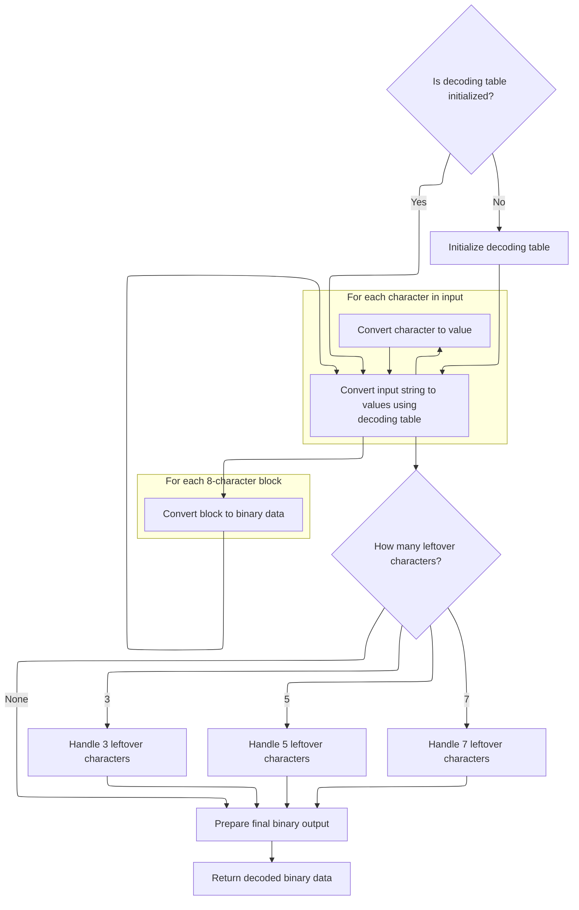
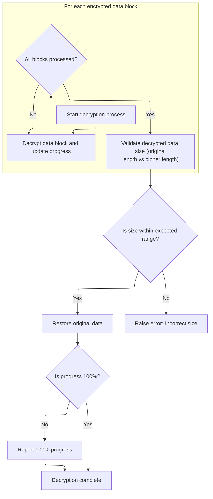
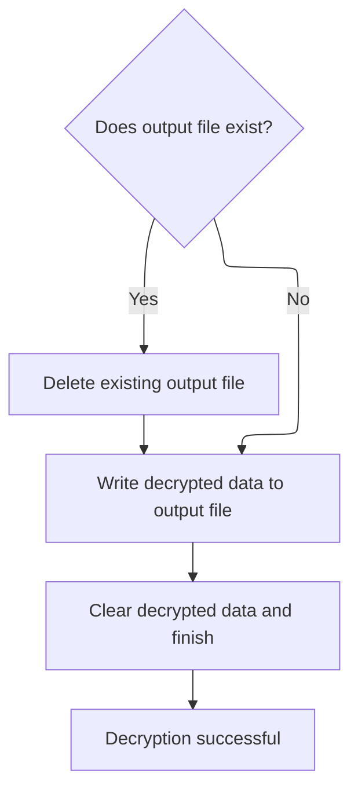

This document describes the process of decrypting an encrypted file and saving the decrypted content to a specified output location. The flow checks file existence and overwrite permissions, prepares the file for decryption, performs decryption, and writes the result to the output file. This enables secure access to decrypted data.

```mermaid
flowchart TD
  node1["Input/Output File Checks and Preparation"]:::HeadingStyle
  click node1 goToHeading "Input/Output File Checks and Preparation"
  node1 -->|"Input file exists and overwrite
allowed"| node2["Base64 Decoding Setup and Execution"]:::HeadingStyle
  click node2 goToHeading "HotelManagementSystem/Modules/clsBlowfish.cls:20 Decoding Setup and Execution"
  node2 --> node3["Decrypting the Decoded Data"]:::HeadingStyle
  click node3 goToHeading "Decrypting the Decoded Data"
  node3 --> node4["Block Decryption and Buffer Manipulation"]:::HeadingStyle
  click node4 goToHeading "Block Decryption and Buffer Manipulation"
  node4 --> node5["CBC XOR and Buffer Updates"]:::HeadingStyle
  click node5 goToHeading "CBC XOR and Buffer Updates"
  node5 --> node6["Output File Write and Cleanup"]:::HeadingStyle
  click node6 goToHeading "Output File Write and Cleanup"
  node1 -->|"Input file missing or overwrite not
allowed"| node7["Exit: Decryption not performed"]
classDef HeadingStyle fill:#777777,stroke:#333,stroke-width:2px;

%% Swimm:
%% flowchart TD
%%   node1["Input/Output File Checks and Preparation"]:::HeadingStyle
%%   click node1 goToHeading "Input/Output File Checks and Preparation"
%%   node1 -->|"Input file exists and overwrite
%% allowed"| node2["<SwmToken path="HotelManagementSystem/Modules/clsBlowfish.cls" pos="20:15:15" line-data="&#39; Standard Blowfish implementation with file support, Base64 conversion,">`Base64`</SwmToken> Decoding Setup and Execution"]:::HeadingStyle
%%   click node2 goToHeading "<SwmToken path="HotelManagementSystem/Modules/clsBlowfish.cls" pos="20:15:15" line-data="&#39; Standard Blowfish implementation with file support, Base64 conversion,">`Base64`</SwmToken> Decoding Setup and Execution"
%%   node2 --> node3["Decrypting the Decoded Data"]:::HeadingStyle
%%   click node3 goToHeading "Decrypting the Decoded Data"
%%   node3 --> node4["Block Decryption and Buffer Manipulation"]:::HeadingStyle
%%   click node4 goToHeading "Block Decryption and Buffer Manipulation"
%%   node4 --> node5["CBC XOR and Buffer Updates"]:::HeadingStyle
%%   click node5 goToHeading "CBC XOR and Buffer Updates"
%%   node5 --> node6["Output File Write and Cleanup"]:::HeadingStyle
%%   click node6 goToHeading "Output File Write and Cleanup"
%%   node1 -->|"Input file missing or overwrite not
%% allowed"| node7["Exit: Decryption not performed"]
%% classDef HeadingStyle fill:#777777,stroke:#333,stroke-width:2px;
```



# Input/Output File Checks and Preparation

```mermaid
%%{init: {"flowchart": {"defaultRenderer": "elk"}} }%%
flowchart TD
    node1{"Does the input file exist?"}
    click node1 openCode "HotelManagementSystem/Modules/clsBlowfish.cls:1591:1594"
    node1 -->|"No"| node5["Decryption failed"]
    click node5 openCode "HotelManagementSystem/Modules/clsBlowfish.cls:1592:1593"
    node1 -->|"Yes"| node2{"Is output file present and overwriting
not allowed?"}
    click node2 openCode "HotelManagementSystem/Modules/clsBlowfish.cls:1595:1598"
    node2 -->|"Yes"| node5
    node2 -->|"No"| node3["Prepare file content for decryption
(decode if Base64)"]
    click node3 openCode "HotelManagementSystem/Modules/clsBlowfish.cls:1601:1605"
    node3 --> node4["Block Decryption and Buffer Manipulation"]
    
    node4 --> node5a["Write decrypted content to output file"]
    click node5a openCode "HotelManagementSystem/Modules/clsBlowfish.cls:1607:1613"

classDef HeadingStyle fill:#777777,stroke:#333,stroke-width:2px;
click node4 goToHeading "Block Decryption and Buffer Manipulation"
node4:::HeadingStyle

%% Swimm:
%% %%{init: {"flowchart": {"defaultRenderer": "elk"}} }%%
%% flowchart TD
%%     node1{"Does the input file exist?"}
%%     click node1 openCode "<SwmPath>[HotelManagementSystem/Modules/clsBlowfish.cls](HotelManagementSystem/Modules/clsBlowfish.cls)</SwmPath>:1591:1594"
%%     node1 -->|"No"| node5["Decryption failed"]
%%     click node5 openCode "<SwmPath>[HotelManagementSystem/Modules/clsBlowfish.cls](HotelManagementSystem/Modules/clsBlowfish.cls)</SwmPath>:1592:1593"
%%     node1 -->|"Yes"| node2{"Is output file present and overwriting
%% not allowed?"}
%%     click node2 openCode "<SwmPath>[HotelManagementSystem/Modules/clsBlowfish.cls](HotelManagementSystem/Modules/clsBlowfish.cls)</SwmPath>:1595:1598"
%%     node2 -->|"Yes"| node5
%%     node2 -->|"No"| node3["Prepare file content for decryption
%% (decode if <SwmToken path="HotelManagementSystem/Modules/clsBlowfish.cls" pos="20:15:15" line-data="&#39; Standard Blowfish implementation with file support, Base64 conversion,">`Base64`</SwmToken>)"]
%%     click node3 openCode "<SwmPath>[HotelManagementSystem/Modules/clsBlowfish.cls](HotelManagementSystem/Modules/clsBlowfish.cls)</SwmPath>:1601:1605"
%%     node3 --> node4["Block Decryption and Buffer Manipulation"]
%%     
%%     node4 --> node5a["Write decrypted content to output file"]
%%     click node5a openCode "<SwmPath>[HotelManagementSystem/Modules/clsBlowfish.cls](HotelManagementSystem/Modules/clsBlowfish.cls)</SwmPath>:1607:1613"
%% 
%% classDef HeadingStyle fill:#777777,stroke:#333,stroke-width:2px;
%% click node4 goToHeading "Block Decryption and Buffer Manipulation"
%% node4:::HeadingStyle
```



<SwmSnippet path="/HotelManagementSystem/Modules/clsBlowfish.cls" line="1589">

---

In <SwmToken path="HotelManagementSystem/Modules/clsBlowfish.cls" pos="1589:4:4" line-data="Public Function DecryptFile(InFile As String, OutFile As String, Overwrite As Boolean, Optional Key As String, Optional IsFileIn64 As Boolean) As Boolean">`DecryptFile`</SwmToken>, we first check if the input file exists using <SwmToken path="HotelManagementSystem/Modules/clsBlowfish.cls" pos="1591:3:3" line-data="    If FileExist(InFile) = False Then">`FileExist`</SwmToken>. If it doesn't, we bail out early. Then, before touching the output file, we check if it already exists and if overwriting is allowed. If not, we exit. This avoids clobbering files and only proceeds if it's safe to read and write.

```apex
Public Function DecryptFile(InFile As String, OutFile As String, Overwrite As Boolean, Optional Key As String, Optional IsFileIn64 As Boolean) As Boolean
    On Error GoTo ErrorHandler
    If FileExist(InFile) = False Then
        DecryptFile = False
        Exit Function
    End If
    If FileExist(OutFile) = True And Overwrite = False Then
```

---

</SwmSnippet>

<SwmSnippet path="/HotelManagementSystem/Modules/clsBlowfish.cls" line="1619">

---

<SwmToken path="HotelManagementSystem/Modules/clsBlowfish.cls" pos="1619:4:4" line-data="Private Function FileExist(FilePath As String) As Boolean">`FileExist`</SwmToken> just tries to get the file length with <SwmToken path="HotelManagementSystem/Modules/clsBlowfish.cls" pos="1621:3:3" line-data="    Call FileLen(FilePath)">`FileLen`</SwmToken>. If that fails (file doesn't exist or can't be accessed), it returns False. Otherwise, it returns True. No file reading, just a quick existence check.

```apex
Private Function FileExist(FilePath As String) As Boolean
    On Error GoTo ErrorHandler
    Call FileLen(FilePath)
    FileExist = True
    Exit Function

ErrorHandler:
    FileExist = False
End Function
```

---

</SwmSnippet>

<SwmSnippet path="/HotelManagementSystem/Modules/clsBlowfish.cls" line="1596">

---

Back in <SwmToken path="HotelManagementSystem/Modules/clsBlowfish.cls" pos="1596:1:1" line-data="        DecryptFile = False">`DecryptFile`</SwmToken>, after checking file existence, we load the input file into a byte buffer. If <SwmToken path="HotelManagementSystem/Modules/clsBlowfish.cls" pos="1605:3:3" line-data="    If IsFileIn64 = True Then Buffer() = DecodeArray64(StrConv(Buffer(), vbUnicode))">`IsFileIn64`</SwmToken> is set, we decode the buffer from <SwmToken path="HotelManagementSystem/Modules/clsBlowfish.cls" pos="20:15:15" line-data="&#39; Standard Blowfish implementation with file support, Base64 conversion,">`Base64`</SwmToken> using <SwmToken path="HotelManagementSystem/Modules/clsBlowfish.cls" pos="1605:17:17" line-data="    If IsFileIn64 = True Then Buffer() = DecodeArray64(StrConv(Buffer(), vbUnicode))">`DecodeArray64`</SwmToken>, since some files might be encoded before encryption.

```apex
        DecryptFile = False
        Exit Function
    End If
    Dim Buffer() As Byte, FileO As Integer
    FileO = FreeFile
    Open InFile For Binary As #FileO
        ReDim Buffer(0 To LOF(FileO) - 1)
        Get #FileO, , Buffer()
    Close #FileO
    If IsFileIn64 = True Then Buffer() = DecodeArray64(StrConv(Buffer(), vbUnicode))
```

---

</SwmSnippet>

## <SwmToken path="HotelManagementSystem/Modules/clsBlowfish.cls" pos="20:15:15" line-data="&#39; Standard Blowfish implementation with file support, Base64 conversion,">`Base64`</SwmToken> Decoding Setup and Execution



<SwmSnippet path="/HotelManagementSystem/Modules/clsBlowfish.cls" line="192">

---

In <SwmToken path="HotelManagementSystem/Modules/clsBlowfish.cls" pos="192:4:4" line-data="Public Function DecodeArray64(sInput As String) As Byte()">`DecodeArray64`</SwmToken>, we check if the <SwmToken path="HotelManagementSystem/Modules/clsBlowfish.cls" pos="20:15:15" line-data="&#39; Standard Blowfish implementation with file support, Base64 conversion,">`Base64`</SwmToken> reverse index array is set up. If not, we call <SwmToken path="HotelManagementSystem/Modules/clsBlowfish.cls" pos="193:14:14" line-data="    If m_bytReverseIndex(47) &lt;&gt; 63 Then Initialize64">`Initialize64`</SwmToken> to fill in the mapping so we can decode <SwmToken path="HotelManagementSystem/Modules/clsBlowfish.cls" pos="20:15:15" line-data="&#39; Standard Blowfish implementation with file support, Base64 conversion,">`Base64`</SwmToken> characters to bytes.

```apex
Public Function DecodeArray64(sInput As String) As Byte()
    If m_bytReverseIndex(47) <> 63 Then Initialize64
```

---

</SwmSnippet>

<SwmSnippet path="/HotelManagementSystem/Modules/clsBlowfish.cls" line="56">

---

<SwmToken path="HotelManagementSystem/Modules/clsBlowfish.cls" pos="56:4:4" line-data="Private Sub Initialize64()">`Initialize64`</SwmToken> fills two arrays: one maps 0-63 to <SwmToken path="HotelManagementSystem/Modules/clsBlowfish.cls" pos="20:15:15" line-data="&#39; Standard Blowfish implementation with file support, Base64 conversion,">`Base64`</SwmToken> chars, the other maps chars back to 0-63. This is needed for the custom <SwmToken path="HotelManagementSystem/Modules/clsBlowfish.cls" pos="20:15:15" line-data="&#39; Standard Blowfish implementation with file support, Base64 conversion,">`Base64`</SwmToken> encode/decode logic.

```apex
Private Sub Initialize64()
    m_bytIndex(0) = 65 'Asc("A")
    m_bytIndex(1) = 66 'Asc("B")
    m_bytIndex(2) = 67 'Asc("C")
    m_bytIndex(3) = 68 'Asc("D")
    m_bytIndex(4) = 69 'Asc("E")
    m_bytIndex(5) = 70 'Asc("F")
    m_bytIndex(6) = 71 'Asc("G")
    m_bytIndex(7) = 72 'Asc("H")
    m_bytIndex(8) = 73 'Asc("I")
    m_bytIndex(9) = 74 'Asc("J")
    m_bytIndex(10) = 75 'Asc("K")
    m_bytIndex(11) = 76 'Asc("L")
    m_bytIndex(12) = 77 'Asc("M")
    m_bytIndex(13) = 78 'Asc("N")
    m_bytIndex(14) = 79 'Asc("O")
    m_bytIndex(15) = 80 'Asc("P")
    m_bytIndex(16) = 81 'Asc("Q")
    m_bytIndex(17) = 82 'Asc("R")
    m_bytIndex(18) = 83 'Asc("S")
    m_bytIndex(19) = 84 'Asc("T")
    m_bytIndex(20) = 85 'Asc("U")
    m_bytIndex(21) = 86 'Asc("V")
    m_bytIndex(22) = 87 'Asc("W")
    m_bytIndex(23) = 88 'Asc("X")
    m_bytIndex(24) = 89 'Asc("Y")
    m_bytIndex(25) = 90 'Asc("Z")
    m_bytIndex(26) = 97 'Asc("a")
    m_bytIndex(27) = 98 'Asc("b")
    m_bytIndex(28) = 99 'Asc("c")
    m_bytIndex(29) = 100 'Asc("d")
    m_bytIndex(30) = 101 'Asc("e")
    m_bytIndex(31) = 102 'Asc("f")
    m_bytIndex(32) = 103 'Asc("g")
    m_bytIndex(33) = 104 'Asc("h")
    m_bytIndex(34) = 105 'Asc("i")
    m_bytIndex(35) = 106 'Asc("j")
    m_bytIndex(36) = 107 'Asc("k")
    m_bytIndex(37) = 108 'Asc("l")
    m_bytIndex(38) = 109 'Asc("m")
    m_bytIndex(39) = 110 'Asc("n")
    m_bytIndex(40) = 111 'Asc("o")
    m_bytIndex(41) = 112 'Asc("p")
    m_bytIndex(42) = 113 'Asc("q")
    m_bytIndex(43) = 114 'Asc("r")
    m_bytIndex(44) = 115 'Asc("s")
    m_bytIndex(45) = 116 'Asc("t")
    m_bytIndex(46) = 117 'Asc("u")
    m_bytIndex(47) = 118 'Asc("v")
    m_bytIndex(48) = 119 'Asc("w")
    m_bytIndex(49) = 120 'Asc("x")
    m_bytIndex(50) = 121 'Asc("y")
    m_bytIndex(51) = 122 'Asc("z")
    m_bytIndex(52) = 48 'Asc("0")
    m_bytIndex(53) = 49 'Asc("1")
    m_bytIndex(54) = 50 'Asc("2")
    m_bytIndex(55) = 51 'Asc("3")
    m_bytIndex(56) = 52 'Asc("4")
    m_bytIndex(57) = 53 'Asc("5")
    m_bytIndex(58) = 54 'Asc("6")
    m_bytIndex(59) = 55 'Asc("7")
    m_bytIndex(60) = 56 'Asc("8")
    m_bytIndex(61) = 57 'Asc("9")
    m_bytIndex(62) = 43 'Asc("+")
    m_bytIndex(63) = 47 'Asc("/")
    m_bytReverseIndex(65) = 0 'Asc("A")
    m_bytReverseIndex(66) = 1 'Asc("B")
    m_bytReverseIndex(67) = 2 'Asc("C")
    m_bytReverseIndex(68) = 3 'Asc("D")
    m_bytReverseIndex(69) = 4 'Asc("E")
    m_bytReverseIndex(70) = 5 'Asc("F")
    m_bytReverseIndex(71) = 6 'Asc("G")
    m_bytReverseIndex(72) = 7 'Asc("H")
    m_bytReverseIndex(73) = 8 'Asc("I")
    m_bytReverseIndex(74) = 9 'Asc("J")
    m_bytReverseIndex(75) = 10 'Asc("K")
    m_bytReverseIndex(76) = 11 'Asc("L")
    m_bytReverseIndex(77) = 12 'Asc("M")
    m_bytReverseIndex(78) = 13 'Asc("N")
    m_bytReverseIndex(79) = 14 'Asc("O")
    m_bytReverseIndex(80) = 15 'Asc("P")
    m_bytReverseIndex(81) = 16 'Asc("Q")
    m_bytReverseIndex(82) = 17 'Asc("R")
    m_bytReverseIndex(83) = 18 'Asc("S")
    m_bytReverseIndex(84) = 19 'Asc("T")
    m_bytReverseIndex(85) = 20 'Asc("U")
    m_bytReverseIndex(86) = 21 'Asc("V")
    m_bytReverseIndex(87) = 22 'Asc("W")
    m_bytReverseIndex(88) = 23 'Asc("X")
    m_bytReverseIndex(89) = 24 'Asc("Y")
    m_bytReverseIndex(90) = 25 'Asc("Z")
    m_bytReverseIndex(97) = 26 'Asc("a")
    m_bytReverseIndex(98) = 27 'Asc("b")
    m_bytReverseIndex(99) = 28 'Asc("c")
    m_bytReverseIndex(100) = 29 'Asc("d")
    m_bytReverseIndex(101) = 30 'Asc("e")
    m_bytReverseIndex(102) = 31 'Asc("f")
    m_bytReverseIndex(103) = 32 'Asc("g")
    m_bytReverseIndex(104) = 33 'Asc("h")
    m_bytReverseIndex(105) = 34 'Asc("i")
    m_bytReverseIndex(106) = 35 'Asc("j")
    m_bytReverseIndex(107) = 36 'Asc("k")
    m_bytReverseIndex(108) = 37 'Asc("l")
    m_bytReverseIndex(109) = 38 'Asc("m")
    m_bytReverseIndex(110) = 39 'Asc("n")
    m_bytReverseIndex(111) = 40 'Asc("o")
    m_bytReverseIndex(112) = 41 'Asc("p")
    m_bytReverseIndex(113) = 42 'Asc("q")
    m_bytReverseIndex(114) = 43 'Asc("r")
    m_bytReverseIndex(115) = 44 'Asc("s")
    m_bytReverseIndex(116) = 45 'Asc("t")
    m_bytReverseIndex(117) = 46 'Asc("u")
    m_bytReverseIndex(118) = 47 'Asc("v")
    m_bytReverseIndex(119) = 48 'Asc("w")
    m_bytReverseIndex(120) = 49 'Asc("x")
    m_bytReverseIndex(121) = 50 'Asc("y")
    m_bytReverseIndex(122) = 51 'Asc("z")
    m_bytReverseIndex(48) = 52 'Asc("0")
    m_bytReverseIndex(49) = 53 'Asc("1")
    m_bytReverseIndex(50) = 54 'Asc("2")
    m_bytReverseIndex(51) = 55 'Asc("3")
    m_bytReverseIndex(52) = 56 'Asc("4")
    m_bytReverseIndex(53) = 57 'Asc("5")
    m_bytReverseIndex(54) = 58 'Asc("6")
    m_bytReverseIndex(55) = 59 'Asc("7")
    m_bytReverseIndex(56) = 60 'Asc("8")
    m_bytReverseIndex(57) = 61 'Asc("9")
    m_bytReverseIndex(43) = 62 'Asc("+")
    m_bytReverseIndex(47) = 63 'Asc("/")
End Sub
```

---

</SwmSnippet>

<SwmSnippet path="/HotelManagementSystem/Modules/clsBlowfish.cls" line="194">

---

After setting up the reverse index in <SwmToken path="HotelManagementSystem/Modules/clsBlowfish.cls" pos="231:1:1" line-data="    DecodeArray64 = bytResult">`DecodeArray64`</SwmToken>, we strip out line breaks and padding, map each character to its <SwmToken path="HotelManagementSystem/Modules/clsBlowfish.cls" pos="20:15:15" line-data="&#39; Standard Blowfish implementation with file support, Base64 conversion,">`Base64`</SwmToken> value, and decode the data in 8-byte blocks using bit shifts and masks. The result is copied to a new byte array and returned.

```apex
    Dim bytInput() As Byte
    Dim bytWorkspace() As Byte
    Dim bytResult() As Byte
    Dim lInputCounter As Long
    Dim lWorkspaceCounter As Long
    
    bytInput = Replace(Replace(sInput, vbCrLf, ""), "=", "")
    ReDim bytWorkspace(LBound(bytInput) To (UBound(bytInput) * 2)) As Byte
    lWorkspaceCounter = LBound(bytWorkspace)
    For lInputCounter = LBound(bytInput) To UBound(bytInput)
        bytInput(lInputCounter) = m_bytReverseIndex(bytInput(lInputCounter))
    Next lInputCounter
    
    For lInputCounter = LBound(bytInput) To (UBound(bytInput) - ((UBound(bytInput) Mod 8) + 8)) Step 8
        bytWorkspace(lWorkspaceCounter) = (bytInput(lInputCounter) * k_bytShift2) + (bytInput(lInputCounter + 2) \ k_bytShift4)
        bytWorkspace(lWorkspaceCounter + 1) = ((bytInput(lInputCounter + 2) And k_bytMask2) * k_bytShift4) + (bytInput(lInputCounter + 4) \ k_bytShift2)
        bytWorkspace(lWorkspaceCounter + 2) = ((bytInput(lInputCounter + 4) And k_bytMask1) * k_bytShift6) + bytInput(lInputCounter + 6)
        lWorkspaceCounter = lWorkspaceCounter + 3
    Next lInputCounter
    
    Select Case (UBound(bytInput) Mod 8):
        Case 3:
            bytWorkspace(lWorkspaceCounter) = (bytInput(lInputCounter) * k_bytShift2) + (bytInput(lInputCounter + 2) \ k_bytShift4)
        Case 5:
            bytWorkspace(lWorkspaceCounter) = (bytInput(lInputCounter) * k_bytShift2) + (bytInput(lInputCounter + 2) \ k_bytShift4)
            bytWorkspace(lWorkspaceCounter + 1) = ((bytInput(lInputCounter + 2) And k_bytMask2) * k_bytShift4) + (bytInput(lInputCounter + 4) \ k_bytShift2)
            lWorkspaceCounter = lWorkspaceCounter + 1
        Case 7:
            bytWorkspace(lWorkspaceCounter) = (bytInput(lInputCounter) * k_bytShift2) + (bytInput(lInputCounter + 2) \ k_bytShift4)
            bytWorkspace(lWorkspaceCounter + 1) = ((bytInput(lInputCounter + 2) And k_bytMask2) * k_bytShift4) + (bytInput(lInputCounter + 4) \ k_bytShift2)
            bytWorkspace(lWorkspaceCounter + 2) = ((bytInput(lInputCounter + 4) And k_bytMask1) * k_bytShift6) + bytInput(lInputCounter + 6)
            lWorkspaceCounter = lWorkspaceCounter + 2
    End Select
    
    ReDim bytResult(LBound(bytWorkspace) To lWorkspaceCounter) As Byte
    If LBound(bytWorkspace) = 0 Then lWorkspaceCounter = lWorkspaceCounter + 1
    CopyMemory VarPtr(bytResult(LBound(bytResult))), VarPtr(bytWorkspace(LBound(bytWorkspace))), lWorkspaceCounter
    DecodeArray64 = bytResult
End Function
```

---

</SwmSnippet>

## Decrypting the Decoded Data

<SwmSnippet path="/HotelManagementSystem/Modules/clsBlowfish.cls" line="1606">

---

After <SwmToken path="HotelManagementSystem/Modules/clsBlowfish.cls" pos="192:4:4" line-data="Public Function DecodeArray64(sInput As String) As Byte()">`DecodeArray64`</SwmToken>, we call <SwmToken path="HotelManagementSystem/Modules/clsBlowfish.cls" pos="1606:3:3" line-data="    Call DecryptByte(Buffer(), Key)">`DecryptByte`</SwmToken> with the buffer and key. This runs the actual decryption on the byte array, updating it in-place.

```apex
    Call DecryptByte(Buffer(), Key)
```

---

</SwmSnippet>

## Block Decryption and Buffer Manipulation

<SwmSnippet path="/HotelManagementSystem/Modules/clsBlowfish.cls" line="394">

---

In <SwmToken path="HotelManagementSystem/Modules/clsBlowfish.cls" pos="394:4:4" line-data="Public Sub DecryptByte(byteArray() As Byte, Optional Key As String)">`DecryptByte`</SwmToken>, we loop through the buffer in 8-byte blocks. For each block, we use <SwmToken path="HotelManagementSystem/Modules/clsBlowfish.cls" pos="400:3:3" line-data="        Call GetWord(LeftWord, byteArray(), Offset)">`GetWord`</SwmToken> to pull out two 4-byte words, which are needed for the decryption and CBC XOR steps.

```apex
Public Sub DecryptByte(byteArray() As Byte, Optional Key As String)
    On Error GoTo ErrorHandler
    Dim Offset As Long, OrigLen As Long, LeftWord As Long, RightWord As Long, CipherLen As Long, CipherLeft As Long, CipherRight As Long, CurrPercent As Long, NextPercent As Long
    If (Len(Key) > 0) Then Me.Key = Key
    CipherLen = UBound(byteArray) + 1
    For Offset = 0 To (CipherLen - 1) Step 8
        Call GetWord(LeftWord, byteArray(), Offset)
        Call GetWord(RightWord, byteArray(), Offset + 4)
```

---

</SwmSnippet>

<SwmSnippet path="/HotelManagementSystem/Modules/clsBlowfish.cls" line="428">

---

<SwmToken path="HotelManagementSystem/Modules/clsBlowfish.cls" pos="428:6:6" line-data="Private Static Sub GetWord(LongValue As Long, CryptBuffer() As Byte, Offset As Long)">`GetWord`</SwmToken> grabs 4 bytes from the buffer at the given offset, reverses their order, and copies them into a long. This handles the endianness needed for the decryption logic.

```apex
Private Static Sub GetWord(LongValue As Long, CryptBuffer() As Byte, Offset As Long)
    Dim bb(0 To 3) As Byte
    bb(3) = CryptBuffer(Offset)
    bb(2) = CryptBuffer(Offset + 1)
    bb(1) = CryptBuffer(Offset + 2)
    bb(0) = CryptBuffer(Offset + 3)
    Call CopyMem(LongValue, bb(0), 4)
End Sub
```

---

</SwmSnippet>

<SwmSnippet path="/HotelManagementSystem/Modules/clsBlowfish.cls" line="402">

---

Back in <SwmToken path="HotelManagementSystem/Modules/clsBlowfish.cls" pos="394:4:4" line-data="Public Sub DecryptByte(byteArray() As Byte, Optional Key As String)">`DecryptByte`</SwmToken>, after pulling out the two words with <SwmToken path="HotelManagementSystem/Modules/clsBlowfish.cls" pos="400:3:3" line-data="        Call GetWord(LeftWord, byteArray(), Offset)">`GetWord`</SwmToken>, we call <SwmToken path="HotelManagementSystem/Modules/clsBlowfish.cls" pos="402:3:3" line-data="        Call DecryptBlock(LeftWord, RightWord)">`DecryptBlock`</SwmToken> to run the Blowfish decryption on them.

```apex
        Call DecryptBlock(LeftWord, RightWord)
```

---

</SwmSnippet>

### Blowfish Block Decryption

See <SwmLink doc-title="Restoring original data from an encrypted block">[Restoring original data from an encrypted block](/.swm/restoring-original-data-from-an-encrypted-block.8pp0tlqc.sw.md)</SwmLink>

### CBC XOR and Buffer Updates



<SwmSnippet path="/HotelManagementSystem/Modules/clsBlowfish.cls" line="403">

---

After <SwmToken path="HotelManagementSystem/Modules/clsBlowfish.cls" pos="402:3:3" line-data="        Call DecryptBlock(LeftWord, RightWord)">`DecryptBlock`</SwmToken> in <SwmToken path="HotelManagementSystem/Modules/clsBlowfish.cls" pos="394:4:4" line-data="Public Sub DecryptByte(byteArray() As Byte, Optional Key As String)">`DecryptByte`</SwmToken>, we XOR the decrypted words with the previous cipher block values, then update <SwmToken path="HotelManagementSystem/Modules/clsBlowfish.cls" pos="403:9:9" line-data="        LeftWord = LeftWord Xor CipherLeft">`CipherLeft`</SwmToken> and <SwmToken path="HotelManagementSystem/Modules/clsBlowfish.cls" pos="404:9:9" line-data="        RightWord = RightWord Xor CipherRight">`CipherRight`</SwmToken> by extracting the current block's values with <SwmToken path="HotelManagementSystem/Modules/clsBlowfish.cls" pos="405:3:3" line-data="        Call GetWord(CipherLeft, byteArray(), Offset)">`GetWord`</SwmToken>. This keeps the CBC chain going.

```apex
        LeftWord = LeftWord Xor CipherLeft
        RightWord = RightWord Xor CipherRight
        Call GetWord(CipherLeft, byteArray(), Offset)
        Call GetWord(CipherRight, byteArray(), Offset + 4)
```

---

</SwmSnippet>

<SwmSnippet path="/HotelManagementSystem/Modules/clsBlowfish.cls" line="407">

---

After updating <SwmToken path="HotelManagementSystem/Modules/clsBlowfish.cls" pos="396:38:38" line-data="    Dim Offset As Long, OrigLen As Long, LeftWord As Long, RightWord As Long, CipherLen As Long, CipherLeft As Long, CipherRight As Long, CurrPercent As Long, NextPercent As Long">`CipherLeft`</SwmToken> and <SwmToken path="HotelManagementSystem/Modules/clsBlowfish.cls" pos="396:45:45" line-data="    Dim Offset As Long, OrigLen As Long, LeftWord As Long, RightWord As Long, CipherLen As Long, CipherLeft As Long, CipherRight As Long, CurrPercent As Long, NextPercent As Long">`CipherRight`</SwmToken> in <SwmToken path="HotelManagementSystem/Modules/clsBlowfish.cls" pos="394:4:4" line-data="Public Sub DecryptByte(byteArray() As Byte, Optional Key As String)">`DecryptByte`</SwmToken>, we use <SwmToken path="HotelManagementSystem/Modules/clsBlowfish.cls" pos="407:3:3" line-data="        Call PutWord(LeftWord, byteArray(), Offset)">`PutWord`</SwmToken> to write the decrypted words back into the buffer at the right positions, keeping everything in-place.

```apex
        Call PutWord(LeftWord, byteArray(), Offset)
        Call PutWord(RightWord, byteArray(), Offset + 4)
```

---

</SwmSnippet>

<SwmSnippet path="/HotelManagementSystem/Modules/clsBlowfish.cls" line="436">

---

<SwmToken path="HotelManagementSystem/Modules/clsBlowfish.cls" pos="436:6:6" line-data="Private Static Sub PutWord(LongValue As Long, CryptBuffer() As Byte, Offset As Long)">`PutWord`</SwmToken> takes a 4-byte integer, splits it into bytes, reverses their order, and writes them into the buffer at the given offset. This keeps the byte order consistent for the rest of the flow.

```apex
Private Static Sub PutWord(LongValue As Long, CryptBuffer() As Byte, Offset As Long)
    Dim bb(0 To 3) As Byte
    Call CopyMem(bb(0), LongValue, 4)
    CryptBuffer(Offset) = bb(3)
    CryptBuffer(Offset + 1) = bb(2)
    CryptBuffer(Offset + 2) = bb(1)
    CryptBuffer(Offset + 3) = bb(0)
End Sub
```

---

</SwmSnippet>

<SwmSnippet path="/HotelManagementSystem/Modules/clsBlowfish.cls" line="409">

---

After all blocks are processed in <SwmToken path="HotelManagementSystem/Modules/clsBlowfish.cls" pos="394:4:4" line-data="Public Sub DecryptByte(byteArray() As Byte, Optional Key As String)">`DecryptByte`</SwmToken>, we handle progress events, extract the original plaintext length, validate it, copy the decrypted data to the start of the buffer, and resize the array to remove padding and metadata.

```apex
        If Offset >= NextPercent Then
            CurrPercent = Int((Offset / CipherLen) * 100)
            NextPercent = (CipherLen * ((CurrPercent + 1) / 100)) + 1
            RaiseEvent Progress(CurrPercent)
        End If
    Next
    Call CopyMem(OrigLen, byteArray(8), 4)
    If (CipherLen - OrigLen > 19) Or (CipherLen - OrigLen < 12) Then Call err.Raise(vbObjectError, , "Incorrect size descriptor in Blowfish decryption")
    Call CopyMem(byteArray(0), byteArray(12), OrigLen)
    ReDim Preserve byteArray(OrigLen - 1)
    If CurrPercent <> 100 Then RaiseEvent Progress(100)

ErrorHandler:
End Sub
```

---

</SwmSnippet>

## Output File Write and Cleanup



<SwmSnippet path="/HotelManagementSystem/Modules/clsBlowfish.cls" line="1607">

---

After <SwmToken path="HotelManagementSystem/Modules/clsBlowfish.cls" pos="394:4:4" line-data="Public Sub DecryptByte(byteArray() As Byte, Optional Key As String)">`DecryptByte`</SwmToken> in <SwmToken path="HotelManagementSystem/Modules/clsBlowfish.cls" pos="1589:4:4" line-data="Public Function DecryptFile(InFile As String, OutFile As String, Overwrite As Boolean, Optional Key As String, Optional IsFileIn64 As Boolean) As Boolean">`DecryptFile`</SwmToken>, we check if the output file exists and delete it if it does. This avoids appending and makes sure the write is clean.

```apex
    If FileExist(OutFile) = True Then Kill OutFile
```

---

</SwmSnippet>

<SwmSnippet path="/HotelManagementSystem/Modules/clsBlowfish.cls" line="1608">

---

After deleting the output file (if needed), we write the decrypted buffer to disk, clean up all sensitive variables, and return True to signal success in <SwmToken path="HotelManagementSystem/Modules/clsBlowfish.cls" pos="1611:1:1" line-data="    DecryptFile = True">`DecryptFile`</SwmToken>.

```apex
    Open OutFile For Binary As #FileO
        Put #FileO, , Buffer()
    Close #FileO
    DecryptFile = True
    Erase Buffer(): Key = "": InFile = "": OutFile = ""
    Exit Function

ErrorHandler:
    Erase Buffer(): Key = "": InFile = "": OutFile = ""
    DecryptFile = False
End Function
```

---

</SwmSnippet>

&nbsp;

*This is an auto-generated document by Swimm 🌊 and has not yet been verified by a human*

<SwmMeta version="3.0.0" repo-id="Z2l0aHViJTNBJTNBY3RzLVZCNi1Qcm9qZWN0cyUzQSUzQVN3aW1tLURlbW8=" repo-name="cts-VB6-Projects"><sup>Powered by [Swimm](https://app.swimm.io/)</sup></SwmMeta>
