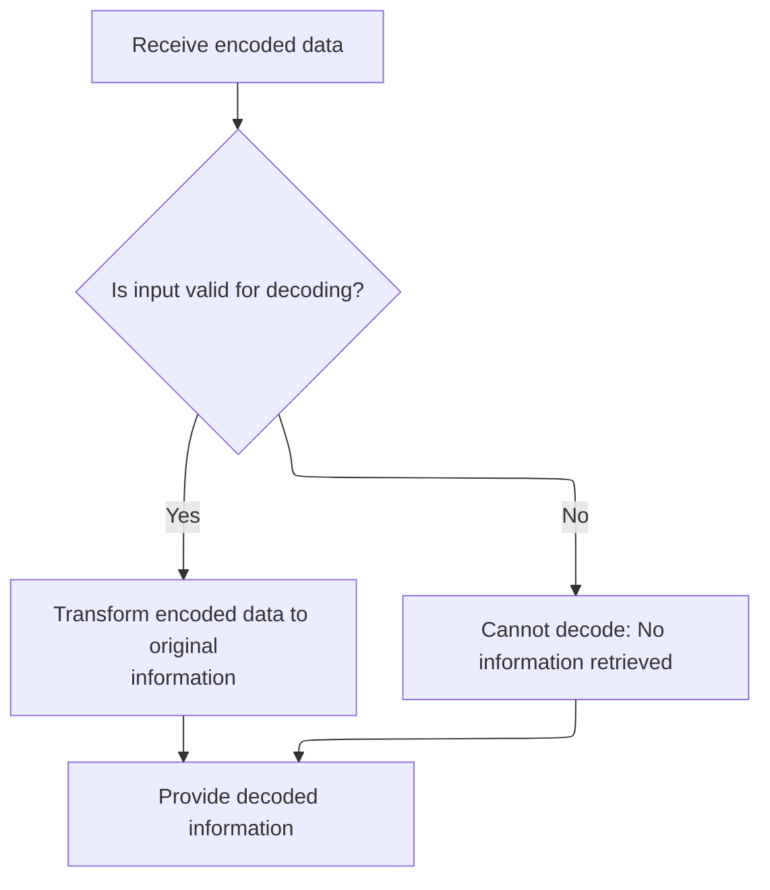

```mermaid
%%{init: {"flowchart": {"defaultRenderer": "elk"}} }%%
flowchart TD
    node1{"Is decoding table initialized?"}
    click node1 openCode "HotelManagementSystem/Modules/clsBlowfish.cls:193:193"
    node1 -->|"No"| node2["Initialize decoding table for Base64
decoding"]
    click node2 openCode "HotelManagementSystem/Modules/clsBlowfish.cls:56:185"
    node1 -->|"Yes"| node3["Clean encoded input string"]
    click node3 openCode "HotelManagementSystem/Modules/clsBlowfish.cls:200:200"
    node2 --> node3
    node3 --> node4["Prepare for decoding"]
    click node4 openCode "HotelManagementSystem/Modules/clsBlowfish.cls:201:202"
    
    subgraph loop1["For each group of encoded characters"]
        node4 --> node5["Convert group to binary data"]
        click node5 openCode "HotelManagementSystem/Modules/clsBlowfish.cls:203:212"
        node5 --> node4
    end
    node4 --> node6{"Are there leftover characters after
groups?"}
    click node6 openCode "HotelManagementSystem/Modules/clsBlowfish.cls:214:226"
    node6 -->|"Yes"| node7["Process leftover characters"]
    click node7 openCode "HotelManagementSystem/Modules/clsBlowfish.cls:216:225"
    node6 -->|"No"| node8["Finalize decoded binary data"]
    click node8 openCode "HotelManagementSystem/Modules/clsBlowfish.cls:228:231"
    node7 --> node8
    node8 --> node9["Return decoded binary result"]
    click node9 openCode "HotelManagementSystem/Modules/clsBlowfish.cls:231:232"

classDef HeadingStyle fill:#777777,stroke:#333,stroke-width:2px;

%% Swimm:
%% %%{init: {"flowchart": {"defaultRenderer": "elk"}} }%%
%% flowchart TD
%%     node1{"Is decoding table initialized?"}
%%     click node1 openCode "<SwmPath>[HotelManagementSystem/Modules/clsBlowfish.cls](HotelManagementSystem/Modules/clsBlowfish.cls)</SwmPath>:193:193"
%%     node1 -->|"No"| node2["Initialize decoding table for <SwmToken path="HotelManagementSystem/Modules/clsBlowfish.cls" pos="20:15:15" line-data="&#39; Standard Blowfish implementation with file support, Base64 conversion,">`Base64`</SwmToken>
%% decoding"]
%%     click node2 openCode "<SwmPath>[HotelManagementSystem/Modules/clsBlowfish.cls](HotelManagementSystem/Modules/clsBlowfish.cls)</SwmPath>:56:185"
%%     node1 -->|"Yes"| node3["Clean encoded input string"]
%%     click node3 openCode "<SwmPath>[HotelManagementSystem/Modules/clsBlowfish.cls](HotelManagementSystem/Modules/clsBlowfish.cls)</SwmPath>:200:200"
%%     node2 --> node3
%%     node3 --> node4["Prepare for decoding"]
%%     click node4 openCode "<SwmPath>[HotelManagementSystem/Modules/clsBlowfish.cls](HotelManagementSystem/Modules/clsBlowfish.cls)</SwmPath>:201:202"
%%     
%%     subgraph loop1["For each group of encoded characters"]
%%         node4 --> node5["Convert group to binary data"]
%%         click node5 openCode "<SwmPath>[HotelManagementSystem/Modules/clsBlowfish.cls](HotelManagementSystem/Modules/clsBlowfish.cls)</SwmPath>:203:212"
%%         node5 --> node4
%%     end
%%     node4 --> node6{"Are there leftover characters after
%% groups?"}
%%     click node6 openCode "<SwmPath>[HotelManagementSystem/Modules/clsBlowfish.cls](HotelManagementSystem/Modules/clsBlowfish.cls)</SwmPath>:214:226"
%%     node6 -->|"Yes"| node7["Process leftover characters"]
%%     click node7 openCode "<SwmPath>[HotelManagementSystem/Modules/clsBlowfish.cls](HotelManagementSystem/Modules/clsBlowfish.cls)</SwmPath>:216:225"
%%     node6 -->|"No"| node8["Finalize decoded binary data"]
%%     click node8 openCode "<SwmPath>[HotelManagementSystem/Modules/clsBlowfish.cls](HotelManagementSystem/Modules/clsBlowfish.cls)</SwmPath>:228:231"
%%     node7 --> node8
%%     node8 --> node9["Return decoded binary result"]
%%     click node9 openCode "<SwmPath>[HotelManagementSystem/Modules/clsBlowfish.cls](HotelManagementSystem/Modules/clsBlowfish.cls)</SwmPath>:231:232"
%% 
%% classDef HeadingStyle fill:#777777,stroke:#333,stroke-width:2px;
```

This document describes how encrypted string data is processed and decrypted for use in the system. The flow ensures that encrypted input, which may be Base64-encoded, is properly decoded and decrypted, allowing the system to access the original information.

The main steps are:

- Receive encrypted string input
- Decode if Base64-encoded
- Prepare data for decryption
- Decrypt the data
- Return the decrypted string

```mermaid
flowchart TD
  node1["Handling Encrypted String Input"]:::HeadingStyle
  click node1 goToHeading "Handling Encrypted String Input"
  node1 --> node2{"Is input Base64-encoded?"}
  node2 -->|"Yes"| node3["Decoding Base64 Encoded Data"]:::HeadingStyle
  click node3 goToHeading "Decoding Base64 Encoded Data"
  node3 --> node4["Returning the Final Decrypted String"]:::HeadingStyle
  click node4 goToHeading "Returning the Final Decrypted String"
  node2 -->|"No"| node4

classDef HeadingStyle fill:#777777,stroke:#333,stroke-width:2px;

%% Swimm:
%% flowchart TD
%%   node1["Handling Encrypted String Input"]:::HeadingStyle
%%   click node1 goToHeading "Handling Encrypted String Input"
%%   node1 --> node2{"Is input Base64-encoded?"}
%%   node2 -->|"Yes"| node3["Decoding <SwmToken path="HotelManagementSystem/Modules/clsBlowfish.cls" pos="20:15:15" line-data="&#39; Standard Blowfish implementation with file support, Base64 conversion,">`Base64`</SwmToken> Encoded Data"]:::HeadingStyle
%%   click node3 goToHeading "Decoding <SwmToken path="HotelManagementSystem/Modules/clsBlowfish.cls" pos="20:15:15" line-data="&#39; Standard Blowfish implementation with file support, Base64 conversion,">`Base64`</SwmToken> Encoded Data"
%%   node3 --> node4["Returning the Final Decrypted String"]:::HeadingStyle
%%   click node4 goToHeading "Returning the Final Decrypted String"
%%   node2 -->|"No"| node4
%% 
%% classDef HeadingStyle fill:#777777,stroke:#333,stroke-width:2px;
```



# Handling Encrypted String Input

```mermaid
%%{init: {"flowchart": {"defaultRenderer": "elk"}} }%%
flowchart TD
    node1["Receive encrypted text"] --> node2{"Is input Base64-encoded?"}
    click node1 openCode "HotelManagementSystem/Modules/clsBlowfish.cls:386:388"
    node2 -->|"Yes"| node3["Decoding Base64 Encoded Data"]
    click node2 openCode "HotelManagementSystem/Modules/clsBlowfish.cls:388:388"
    node2 -->|"No"| node4["Preparing Data for Decryption"]
    
    node3 --> node4
    
    node4 --> node5["Returning the Final Decrypted String"]
    
classDef HeadingStyle fill:#777777,stroke:#333,stroke-width:2px;
click node3 goToHeading "Decoding Base64 Encoded Data"
node3:::HeadingStyle
click node4 goToHeading "Preparing Data for Decryption"
node4:::HeadingStyle
click node5 goToHeading "Returning the Final Decrypted String"
node5:::HeadingStyle

%% Swimm:
%% %%{init: {"flowchart": {"defaultRenderer": "elk"}} }%%
%% flowchart TD
%%     node1["Receive encrypted text"] --> node2{"Is input Base64-encoded?"}
%%     click node1 openCode "<SwmPath>[HotelManagementSystem/Modules/clsBlowfish.cls](HotelManagementSystem/Modules/clsBlowfish.cls)</SwmPath>:386:388"
%%     node2 -->|"Yes"| node3["Decoding <SwmToken path="HotelManagementSystem/Modules/clsBlowfish.cls" pos="20:15:15" line-data="&#39; Standard Blowfish implementation with file support, Base64 conversion,">`Base64`</SwmToken> Encoded Data"]
%%     click node2 openCode "<SwmPath>[HotelManagementSystem/Modules/clsBlowfish.cls](HotelManagementSystem/Modules/clsBlowfish.cls)</SwmPath>:388:388"
%%     node2 -->|"No"| node4["Preparing Data for Decryption"]
%%     
%%     node3 --> node4
%%     
%%     node4 --> node5["Returning the Final Decrypted String"]
%%     
%% classDef HeadingStyle fill:#777777,stroke:#333,stroke-width:2px;
%% click node3 goToHeading "Decoding <SwmToken path="HotelManagementSystem/Modules/clsBlowfish.cls" pos="20:15:15" line-data="&#39; Standard Blowfish implementation with file support, Base64 conversion,">`Base64`</SwmToken> Encoded Data"
%% node3:::HeadingStyle
%% click node4 goToHeading "Preparing Data for Decryption"
%% node4:::HeadingStyle
%% click node5 goToHeading "Returning the Final Decrypted String"
%% node5:::HeadingStyle
```



<SwmSnippet path="/HotelManagementSystem/Modules/clsBlowfish.cls" line="386">

---

In <SwmToken path="HotelManagementSystem/Modules/clsBlowfish.cls" pos="386:4:4" line-data="Public Function DecryptString(Text As String, Optional Key As String, Optional IsTextIn64 As Boolean) As String">`DecryptString`</SwmToken>, we check if the input is base64 encoded and, if so, decode it using <SwmToken path="HotelManagementSystem/Modules/clsBlowfish.cls" pos="388:15:15" line-data="    If IsTextIn64 = True Then Text = Decode64(Text)">`Decode64`</SwmToken>. This ensures we're working with the actual encrypted bytes, not the encoded string, before moving on to byte conversion and decryption.

```apex
Public Function DecryptString(Text As String, Optional Key As String, Optional IsTextIn64 As Boolean) As String
    Dim byteArray() As Byte
    If IsTextIn64 = True Then Text = Decode64(Text)
```

---

</SwmSnippet>

## Decoding <SwmToken path="HotelManagementSystem/Modules/clsBlowfish.cls" pos="20:15:15" line-data="&#39; Standard Blowfish implementation with file support, Base64 conversion,">`Base64`</SwmToken> Encoded Data

<SwmSnippet path="/HotelManagementSystem/Modules/clsBlowfish.cls" line="187">

---

In <SwmToken path="HotelManagementSystem/Modules/clsBlowfish.cls" pos="187:4:4" line-data="Public Function Decode64(sInput As String) As String">`Decode64`</SwmToken>, we bail out if the input is empty. Otherwise, we call <SwmToken path="HotelManagementSystem/Modules/clsBlowfish.cls" pos="189:7:7" line-data="    Decode64 = StrConv(DecodeArray64(sInput), vbUnicode)">`DecodeArray64`</SwmToken> to get the decoded bytes, which we then convert to a Unicode string for further use.

```apex
Public Function Decode64(sInput As String) As String
    If sInput = "" Then Exit Function
    Decode64 = StrConv(DecodeArray64(sInput), vbUnicode)
```

---

</SwmSnippet>

### Preparing <SwmToken path="HotelManagementSystem/Modules/clsBlowfish.cls" pos="20:15:15" line-data="&#39; Standard Blowfish implementation with file support, Base64 conversion,">`Base64`</SwmToken> Character Mappings



<SwmSnippet path="/HotelManagementSystem/Modules/clsBlowfish.cls" line="192">

---

In <SwmToken path="HotelManagementSystem/Modules/clsBlowfish.cls" pos="192:4:4" line-data="Public Function DecodeArray64(sInput As String) As Byte()">`DecodeArray64`</SwmToken>, we make sure the <SwmToken path="HotelManagementSystem/Modules/clsBlowfish.cls" pos="20:15:15" line-data="&#39; Standard Blowfish implementation with file support, Base64 conversion,">`Base64`</SwmToken> reverse mapping array is initialized by calling <SwmToken path="HotelManagementSystem/Modules/clsBlowfish.cls" pos="193:14:14" line-data="    If m_bytReverseIndex(47) &lt;&gt; 63 Then Initialize64">`Initialize64`</SwmToken> if needed. Without this, we can't reliably map encoded characters to their 6-bit values for decoding.

```apex
Public Function DecodeArray64(sInput As String) As Byte()
    If m_bytReverseIndex(47) <> 63 Then Initialize64
```

---

</SwmSnippet>

<SwmSnippet path="/HotelManagementSystem/Modules/clsBlowfish.cls" line="56">

---

<SwmToken path="HotelManagementSystem/Modules/clsBlowfish.cls" pos="56:4:4" line-data="Private Sub Initialize64()">`Initialize64`</SwmToken> sets up both the forward and reverse <SwmToken path="HotelManagementSystem/Modules/clsBlowfish.cls" pos="20:15:15" line-data="&#39; Standard Blowfish implementation with file support, Base64 conversion,">`Base64`</SwmToken> character mappings. The reverse mapping is what <SwmToken path="HotelManagementSystem/Modules/clsBlowfish.cls" pos="189:7:7" line-data="    Decode64 = StrConv(DecodeArray64(sInput), vbUnicode)">`DecodeArray64`</SwmToken> actually uses to turn encoded characters into their numeric values.

```apex
Private Sub Initialize64()
    m_bytIndex(0) = 65 'Asc("A")
    m_bytIndex(1) = 66 'Asc("B")
    m_bytIndex(2) = 67 'Asc("C")
    m_bytIndex(3) = 68 'Asc("D")
    m_bytIndex(4) = 69 'Asc("E")
    m_bytIndex(5) = 70 'Asc("F")
    m_bytIndex(6) = 71 'Asc("G")
    m_bytIndex(7) = 72 'Asc("H")
    m_bytIndex(8) = 73 'Asc("I")
    m_bytIndex(9) = 74 'Asc("J")
    m_bytIndex(10) = 75 'Asc("K")
    m_bytIndex(11) = 76 'Asc("L")
    m_bytIndex(12) = 77 'Asc("M")
    m_bytIndex(13) = 78 'Asc("N")
    m_bytIndex(14) = 79 'Asc("O")
    m_bytIndex(15) = 80 'Asc("P")
    m_bytIndex(16) = 81 'Asc("Q")
    m_bytIndex(17) = 82 'Asc("R")
    m_bytIndex(18) = 83 'Asc("S")
    m_bytIndex(19) = 84 'Asc("T")
    m_bytIndex(20) = 85 'Asc("U")
    m_bytIndex(21) = 86 'Asc("V")
    m_bytIndex(22) = 87 'Asc("W")
    m_bytIndex(23) = 88 'Asc("X")
    m_bytIndex(24) = 89 'Asc("Y")
    m_bytIndex(25) = 90 'Asc("Z")
    m_bytIndex(26) = 97 'Asc("a")
    m_bytIndex(27) = 98 'Asc("b")
    m_bytIndex(28) = 99 'Asc("c")
    m_bytIndex(29) = 100 'Asc("d")
    m_bytIndex(30) = 101 'Asc("e")
    m_bytIndex(31) = 102 'Asc("f")
    m_bytIndex(32) = 103 'Asc("g")
    m_bytIndex(33) = 104 'Asc("h")
    m_bytIndex(34) = 105 'Asc("i")
    m_bytIndex(35) = 106 'Asc("j")
    m_bytIndex(36) = 107 'Asc("k")
    m_bytIndex(37) = 108 'Asc("l")
    m_bytIndex(38) = 109 'Asc("m")
    m_bytIndex(39) = 110 'Asc("n")
    m_bytIndex(40) = 111 'Asc("o")
    m_bytIndex(41) = 112 'Asc("p")
    m_bytIndex(42) = 113 'Asc("q")
    m_bytIndex(43) = 114 'Asc("r")
    m_bytIndex(44) = 115 'Asc("s")
    m_bytIndex(45) = 116 'Asc("t")
    m_bytIndex(46) = 117 'Asc("u")
    m_bytIndex(47) = 118 'Asc("v")
    m_bytIndex(48) = 119 'Asc("w")
    m_bytIndex(49) = 120 'Asc("x")
    m_bytIndex(50) = 121 'Asc("y")
    m_bytIndex(51) = 122 'Asc("z")
    m_bytIndex(52) = 48 'Asc("0")
    m_bytIndex(53) = 49 'Asc("1")
    m_bytIndex(54) = 50 'Asc("2")
    m_bytIndex(55) = 51 'Asc("3")
    m_bytIndex(56) = 52 'Asc("4")
    m_bytIndex(57) = 53 'Asc("5")
    m_bytIndex(58) = 54 'Asc("6")
    m_bytIndex(59) = 55 'Asc("7")
    m_bytIndex(60) = 56 'Asc("8")
    m_bytIndex(61) = 57 'Asc("9")
    m_bytIndex(62) = 43 'Asc("+")
    m_bytIndex(63) = 47 'Asc("/")
    m_bytReverseIndex(65) = 0 'Asc("A")
    m_bytReverseIndex(66) = 1 'Asc("B")
    m_bytReverseIndex(67) = 2 'Asc("C")
    m_bytReverseIndex(68) = 3 'Asc("D")
    m_bytReverseIndex(69) = 4 'Asc("E")
    m_bytReverseIndex(70) = 5 'Asc("F")
    m_bytReverseIndex(71) = 6 'Asc("G")
    m_bytReverseIndex(72) = 7 'Asc("H")
    m_bytReverseIndex(73) = 8 'Asc("I")
    m_bytReverseIndex(74) = 9 'Asc("J")
    m_bytReverseIndex(75) = 10 'Asc("K")
    m_bytReverseIndex(76) = 11 'Asc("L")
    m_bytReverseIndex(77) = 12 'Asc("M")
    m_bytReverseIndex(78) = 13 'Asc("N")
    m_bytReverseIndex(79) = 14 'Asc("O")
    m_bytReverseIndex(80) = 15 'Asc("P")
    m_bytReverseIndex(81) = 16 'Asc("Q")
    m_bytReverseIndex(82) = 17 'Asc("R")
    m_bytReverseIndex(83) = 18 'Asc("S")
    m_bytReverseIndex(84) = 19 'Asc("T")
    m_bytReverseIndex(85) = 20 'Asc("U")
    m_bytReverseIndex(86) = 21 'Asc("V")
    m_bytReverseIndex(87) = 22 'Asc("W")
    m_bytReverseIndex(88) = 23 'Asc("X")
    m_bytReverseIndex(89) = 24 'Asc("Y")
    m_bytReverseIndex(90) = 25 'Asc("Z")
    m_bytReverseIndex(97) = 26 'Asc("a")
    m_bytReverseIndex(98) = 27 'Asc("b")
    m_bytReverseIndex(99) = 28 'Asc("c")
    m_bytReverseIndex(100) = 29 'Asc("d")
    m_bytReverseIndex(101) = 30 'Asc("e")
    m_bytReverseIndex(102) = 31 'Asc("f")
    m_bytReverseIndex(103) = 32 'Asc("g")
    m_bytReverseIndex(104) = 33 'Asc("h")
    m_bytReverseIndex(105) = 34 'Asc("i")
    m_bytReverseIndex(106) = 35 'Asc("j")
    m_bytReverseIndex(107) = 36 'Asc("k")
    m_bytReverseIndex(108) = 37 'Asc("l")
    m_bytReverseIndex(109) = 38 'Asc("m")
    m_bytReverseIndex(110) = 39 'Asc("n")
    m_bytReverseIndex(111) = 40 'Asc("o")
    m_bytReverseIndex(112) = 41 'Asc("p")
    m_bytReverseIndex(113) = 42 'Asc("q")
    m_bytReverseIndex(114) = 43 'Asc("r")
    m_bytReverseIndex(115) = 44 'Asc("s")
    m_bytReverseIndex(116) = 45 'Asc("t")
    m_bytReverseIndex(117) = 46 'Asc("u")
    m_bytReverseIndex(118) = 47 'Asc("v")
    m_bytReverseIndex(119) = 48 'Asc("w")
    m_bytReverseIndex(120) = 49 'Asc("x")
    m_bytReverseIndex(121) = 50 'Asc("y")
    m_bytReverseIndex(122) = 51 'Asc("z")
    m_bytReverseIndex(48) = 52 'Asc("0")
    m_bytReverseIndex(49) = 53 'Asc("1")
    m_bytReverseIndex(50) = 54 'Asc("2")
    m_bytReverseIndex(51) = 55 'Asc("3")
    m_bytReverseIndex(52) = 56 'Asc("4")
    m_bytReverseIndex(53) = 57 'Asc("5")
    m_bytReverseIndex(54) = 58 'Asc("6")
    m_bytReverseIndex(55) = 59 'Asc("7")
    m_bytReverseIndex(56) = 60 'Asc("8")
    m_bytReverseIndex(57) = 61 'Asc("9")
    m_bytReverseIndex(43) = 62 'Asc("+")
    m_bytReverseIndex(47) = 63 'Asc("/")
End Sub
```

---

</SwmSnippet>

<SwmSnippet path="/HotelManagementSystem/Modules/clsBlowfish.cls" line="194">

---

Back in <SwmToken path="HotelManagementSystem/Modules/clsBlowfish.cls" pos="231:1:1" line-data="    DecodeArray64 = bytResult">`DecodeArray64`</SwmToken>, after making sure the mappings are set, we strip out line breaks and padding, map each character to its 6-bit value, and decode the data in blocks. Any leftover characters are handled with a switch, and finally, we copy the decoded bytes to the result array.

```apex
    Dim bytInput() As Byte
    Dim bytWorkspace() As Byte
    Dim bytResult() As Byte
    Dim lInputCounter As Long
    Dim lWorkspaceCounter As Long
    
    bytInput = Replace(Replace(sInput, vbCrLf, ""), "=", "")
    ReDim bytWorkspace(LBound(bytInput) To (UBound(bytInput) * 2)) As Byte
    lWorkspaceCounter = LBound(bytWorkspace)
    For lInputCounter = LBound(bytInput) To UBound(bytInput)
        bytInput(lInputCounter) = m_bytReverseIndex(bytInput(lInputCounter))
    Next lInputCounter
    
    For lInputCounter = LBound(bytInput) To (UBound(bytInput) - ((UBound(bytInput) Mod 8) + 8)) Step 8
        bytWorkspace(lWorkspaceCounter) = (bytInput(lInputCounter) * k_bytShift2) + (bytInput(lInputCounter + 2) \ k_bytShift4)
        bytWorkspace(lWorkspaceCounter + 1) = ((bytInput(lInputCounter + 2) And k_bytMask2) * k_bytShift4) + (bytInput(lInputCounter + 4) \ k_bytShift2)
        bytWorkspace(lWorkspaceCounter + 2) = ((bytInput(lInputCounter + 4) And k_bytMask1) * k_bytShift6) + bytInput(lInputCounter + 6)
        lWorkspaceCounter = lWorkspaceCounter + 3
    Next lInputCounter
    
    Select Case (UBound(bytInput) Mod 8):
        Case 3:
            bytWorkspace(lWorkspaceCounter) = (bytInput(lInputCounter) * k_bytShift2) + (bytInput(lInputCounter + 2) \ k_bytShift4)
        Case 5:
            bytWorkspace(lWorkspaceCounter) = (bytInput(lInputCounter) * k_bytShift2) + (bytInput(lInputCounter + 2) \ k_bytShift4)
            bytWorkspace(lWorkspaceCounter + 1) = ((bytInput(lInputCounter + 2) And k_bytMask2) * k_bytShift4) + (bytInput(lInputCounter + 4) \ k_bytShift2)
            lWorkspaceCounter = lWorkspaceCounter + 1
        Case 7:
            bytWorkspace(lWorkspaceCounter) = (bytInput(lInputCounter) * k_bytShift2) + (bytInput(lInputCounter + 2) \ k_bytShift4)
            bytWorkspace(lWorkspaceCounter + 1) = ((bytInput(lInputCounter + 2) And k_bytMask2) * k_bytShift4) + (bytInput(lInputCounter + 4) \ k_bytShift2)
            bytWorkspace(lWorkspaceCounter + 2) = ((bytInput(lInputCounter + 4) And k_bytMask1) * k_bytShift6) + bytInput(lInputCounter + 6)
            lWorkspaceCounter = lWorkspaceCounter + 2
    End Select
    
    ReDim bytResult(LBound(bytWorkspace) To lWorkspaceCounter) As Byte
    If LBound(bytWorkspace) = 0 Then lWorkspaceCounter = lWorkspaceCounter + 1
    CopyMemory VarPtr(bytResult(LBound(bytResult))), VarPtr(bytWorkspace(LBound(bytWorkspace))), lWorkspaceCounter
    DecodeArray64 = bytResult
End Function
```

---

</SwmSnippet>

### Returning Decoded Unicode String



<SwmSnippet path="/HotelManagementSystem/Modules/clsBlowfish.cls" line="190">

---

Back in <SwmToken path="HotelManagementSystem/Modules/clsBlowfish.cls" pos="187:4:4" line-data="Public Function Decode64(sInput As String) As String">`Decode64`</SwmToken>, we just got the decoded byte array from <SwmToken path="HotelManagementSystem/Modules/clsBlowfish.cls" pos="189:7:7" line-data="    Decode64 = StrConv(DecodeArray64(sInput), vbUnicode)">`DecodeArray64`</SwmToken> and convert it to a Unicode string before returning. This makes it usable for the next steps.

```apex
End Function
```

---

</SwmSnippet>

## Preparing Data for Decryption

<SwmSnippet path="/HotelManagementSystem/Modules/clsBlowfish.cls" line="389">

---

Back in <SwmToken path="HotelManagementSystem/Modules/clsBlowfish.cls" pos="386:4:4" line-data="Public Function DecryptString(Text As String, Optional Key As String, Optional IsTextIn64 As Boolean) As String">`DecryptString`</SwmToken>, after decoding, we convert the string to a byte array and pass it to <SwmToken path="HotelManagementSystem/Modules/clsBlowfish.cls" pos="390:3:3" line-data="    Call DecryptByte(byteArray(), Key)">`DecryptByte`</SwmToken>. The decryption logic expects bytes, not a string.

```apex
    byteArray() = StrConv(Text, vbFromUnicode)
    Call DecryptByte(byteArray(), Key)
```

---

</SwmSnippet>

## Block Decryption and Byte Manipulation

<SwmSnippet path="/HotelManagementSystem/Modules/clsBlowfish.cls" line="394">

---

In <SwmToken path="HotelManagementSystem/Modules/clsBlowfish.cls" pos="394:4:4" line-data="Public Sub DecryptByte(byteArray() As Byte, Optional Key As String)">`DecryptByte`</SwmToken>, we loop through the byte array in 8-byte chunks, extracting two 4-byte words with <SwmToken path="HotelManagementSystem/Modules/clsBlowfish.cls" pos="400:3:3" line-data="        Call GetWord(LeftWord, byteArray(), Offset)">`GetWord`</SwmToken>. This sets up the data for block decryption.

```apex
Public Sub DecryptByte(byteArray() As Byte, Optional Key As String)
    On Error GoTo ErrorHandler
    Dim Offset As Long, OrigLen As Long, LeftWord As Long, RightWord As Long, CipherLen As Long, CipherLeft As Long, CipherRight As Long, CurrPercent As Long, NextPercent As Long
    If (Len(Key) > 0) Then Me.Key = Key
    CipherLen = UBound(byteArray) + 1
    For Offset = 0 To (CipherLen - 1) Step 8
        Call GetWord(LeftWord, byteArray(), Offset)
        Call GetWord(RightWord, byteArray(), Offset + 4)
```

---

</SwmSnippet>

<SwmSnippet path="/HotelManagementSystem/Modules/clsBlowfish.cls" line="428">

---

<SwmToken path="HotelManagementSystem/Modules/clsBlowfish.cls" pos="428:6:6" line-data="Private Static Sub GetWord(LongValue As Long, CryptBuffer() As Byte, Offset As Long)">`GetWord`</SwmToken> pulls out 4 bytes from the buffer at the given offset, reverses their order, and packs them into a long. This handles endianness for the decryption routine.

```apex
Private Static Sub GetWord(LongValue As Long, CryptBuffer() As Byte, Offset As Long)
    Dim bb(0 To 3) As Byte
    bb(3) = CryptBuffer(Offset)
    bb(2) = CryptBuffer(Offset + 1)
    bb(1) = CryptBuffer(Offset + 2)
    bb(0) = CryptBuffer(Offset + 3)
    Call CopyMem(LongValue, bb(0), 4)
End Sub
```

---

</SwmSnippet>

<SwmSnippet path="/HotelManagementSystem/Modules/clsBlowfish.cls" line="402">

---

Back in <SwmToken path="HotelManagementSystem/Modules/clsBlowfish.cls" pos="390:3:3" line-data="    Call DecryptByte(byteArray(), Key)">`DecryptByte`</SwmToken>, after extracting the words, we call <SwmToken path="HotelManagementSystem/Modules/clsBlowfish.cls" pos="402:3:3" line-data="        Call DecryptBlock(LeftWord, RightWord)">`DecryptBlock`</SwmToken> to actually run the Blowfish decryption on them.

```apex
        Call DecryptBlock(LeftWord, RightWord)
```

---

</SwmSnippet>

### Running the Blowfish Core Decryption

See <SwmLink doc-title="Decrypting an encrypted block">[Decrypting an encrypted block](/.swm/decrypting-an-encrypted-block.02p57sna.sw.md)</SwmLink>

### Post-Decryption Block Handling

```mermaid
%%{init: {"flowchart": {"defaultRenderer": "elk"}} }%%
flowchart TD
    node1["Start decryption process"]
    click node1 openCode "HotelManagementSystem/Modules/clsBlowfish.cls:403:404"
    subgraph loop1["For each block of encrypted data"]
        node1 --> node2["Decrypt and reconstruct block"]
        click node2 openCode "HotelManagementSystem/Modules/clsBlowfish.cls:403:408"
        node2 --> node3{"Offset >= NextPercent?"}
        click node3 openCode "HotelManagementSystem/Modules/clsBlowfish.cls:409:413"
        node3 -->|"Yes"| node4["Report progress to user (CurrPercent)"]
        click node4 openCode "HotelManagementSystem/Modules/clsBlowfish.cls:412:412"
        node3 -->|"No"| node5["Continue to next block"]
        click node5 openCode "HotelManagementSystem/Modules/clsBlowfish.cls:414:414"
        node4 --> node5
    end
    loop1 --> node6["Validate decrypted data size (CipherLen,
OrigLen)"]
    click node6 openCode "HotelManagementSystem/Modules/clsBlowfish.cls:415:416"
    node6 --> node7{"Is data size valid?"}
    click node7 openCode "HotelManagementSystem/Modules/clsBlowfish.cls:416:416"
    node7 -->|"Yes"| node8["Output original data"]
    click node8 openCode "HotelManagementSystem/Modules/clsBlowfish.cls:417:418"
    node7 -->|"No"| node9["Raise error: Incorrect size descriptor"]
    click node9 openCode "HotelManagementSystem/Modules/clsBlowfish.cls:416:416"
    node8 --> node10{"Is progress 100%?"}
    click node10 openCode "HotelManagementSystem/Modules/clsBlowfish.cls:419:419"
    node10 -->|"No"| node11["Report 100% progress"]
    click node11 openCode "HotelManagementSystem/Modules/clsBlowfish.cls:419:419"
    node10 -->|"Yes"| node12["Decryption complete"]
    click node12 openCode "HotelManagementSystem/Modules/clsBlowfish.cls:420:422"
classDef HeadingStyle fill:#777777,stroke:#333,stroke-width:2px;

%% Swimm:
%% %%{init: {"flowchart": {"defaultRenderer": "elk"}} }%%
%% flowchart TD
%%     node1["Start decryption process"]
%%     click node1 openCode "<SwmPath>[HotelManagementSystem/Modules/clsBlowfish.cls](HotelManagementSystem/Modules/clsBlowfish.cls)</SwmPath>:403:404"
%%     subgraph loop1["For each block of encrypted data"]
%%         node1 --> node2["Decrypt and reconstruct block"]
%%         click node2 openCode "<SwmPath>[HotelManagementSystem/Modules/clsBlowfish.cls](HotelManagementSystem/Modules/clsBlowfish.cls)</SwmPath>:403:408"
%%         node2 --> node3{"Offset >= <SwmToken path="HotelManagementSystem/Modules/clsBlowfish.cls" pos="396:59:59" line-data="    Dim Offset As Long, OrigLen As Long, LeftWord As Long, RightWord As Long, CipherLen As Long, CipherLeft As Long, CipherRight As Long, CurrPercent As Long, NextPercent As Long">`NextPercent`</SwmToken>?"}
%%         click node3 openCode "<SwmPath>[HotelManagementSystem/Modules/clsBlowfish.cls](HotelManagementSystem/Modules/clsBlowfish.cls)</SwmPath>:409:413"
%%         node3 -->|"Yes"| node4["Report progress to user (<SwmToken path="HotelManagementSystem/Modules/clsBlowfish.cls" pos="396:52:52" line-data="    Dim Offset As Long, OrigLen As Long, LeftWord As Long, RightWord As Long, CipherLen As Long, CipherLeft As Long, CipherRight As Long, CurrPercent As Long, NextPercent As Long">`CurrPercent`</SwmToken>)"]
%%         click node4 openCode "<SwmPath>[HotelManagementSystem/Modules/clsBlowfish.cls](HotelManagementSystem/Modules/clsBlowfish.cls)</SwmPath>:412:412"
%%         node3 -->|"No"| node5["Continue to next block"]
%%         click node5 openCode "<SwmPath>[HotelManagementSystem/Modules/clsBlowfish.cls](HotelManagementSystem/Modules/clsBlowfish.cls)</SwmPath>:414:414"
%%         node4 --> node5
%%     end
%%     loop1 --> node6["Validate decrypted data size (<SwmToken path="HotelManagementSystem/Modules/clsBlowfish.cls" pos="396:31:31" line-data="    Dim Offset As Long, OrigLen As Long, LeftWord As Long, RightWord As Long, CipherLen As Long, CipherLeft As Long, CipherRight As Long, CurrPercent As Long, NextPercent As Long">`CipherLen`</SwmToken>,
%% <SwmToken path="HotelManagementSystem/Modules/clsBlowfish.cls" pos="396:10:10" line-data="    Dim Offset As Long, OrigLen As Long, LeftWord As Long, RightWord As Long, CipherLen As Long, CipherLeft As Long, CipherRight As Long, CurrPercent As Long, NextPercent As Long">`OrigLen`</SwmToken>)"]
%%     click node6 openCode "<SwmPath>[HotelManagementSystem/Modules/clsBlowfish.cls](HotelManagementSystem/Modules/clsBlowfish.cls)</SwmPath>:415:416"
%%     node6 --> node7{"Is data size valid?"}
%%     click node7 openCode "<SwmPath>[HotelManagementSystem/Modules/clsBlowfish.cls](HotelManagementSystem/Modules/clsBlowfish.cls)</SwmPath>:416:416"
%%     node7 -->|"Yes"| node8["Output original data"]
%%     click node8 openCode "<SwmPath>[HotelManagementSystem/Modules/clsBlowfish.cls](HotelManagementSystem/Modules/clsBlowfish.cls)</SwmPath>:417:418"
%%     node7 -->|"No"| node9["Raise error: Incorrect size descriptor"]
%%     click node9 openCode "<SwmPath>[HotelManagementSystem/Modules/clsBlowfish.cls](HotelManagementSystem/Modules/clsBlowfish.cls)</SwmPath>:416:416"
%%     node8 --> node10{"Is progress 100%?"}
%%     click node10 openCode "<SwmPath>[HotelManagementSystem/Modules/clsBlowfish.cls](HotelManagementSystem/Modules/clsBlowfish.cls)</SwmPath>:419:419"
%%     node10 -->|"No"| node11["Report 100% progress"]
%%     click node11 openCode "<SwmPath>[HotelManagementSystem/Modules/clsBlowfish.cls](HotelManagementSystem/Modules/clsBlowfish.cls)</SwmPath>:419:419"
%%     node10 -->|"Yes"| node12["Decryption complete"]
%%     click node12 openCode "<SwmPath>[HotelManagementSystem/Modules/clsBlowfish.cls](HotelManagementSystem/Modules/clsBlowfish.cls)</SwmPath>:420:422"
%% classDef HeadingStyle fill:#777777,stroke:#333,stroke-width:2px;
```



<SwmSnippet path="/HotelManagementSystem/Modules/clsBlowfish.cls" line="403">

---

Back in <SwmToken path="HotelManagementSystem/Modules/clsBlowfish.cls" pos="390:3:3" line-data="    Call DecryptByte(byteArray(), Key)">`DecryptByte`</SwmToken>, after decryption, we XOR the results with the previous cipher words for CBC mode, then update <SwmToken path="HotelManagementSystem/Modules/clsBlowfish.cls" pos="403:9:9" line-data="        LeftWord = LeftWord Xor CipherLeft">`CipherLeft`</SwmToken> and <SwmToken path="HotelManagementSystem/Modules/clsBlowfish.cls" pos="404:9:9" line-data="        RightWord = RightWord Xor CipherRight">`CipherRight`</SwmToken> from the current block for the next round.

```apex
        LeftWord = LeftWord Xor CipherLeft
        RightWord = RightWord Xor CipherRight
        Call GetWord(CipherLeft, byteArray(), Offset)
        Call GetWord(CipherRight, byteArray(), Offset + 4)
```

---

</SwmSnippet>

<SwmSnippet path="/HotelManagementSystem/Modules/clsBlowfish.cls" line="407">

---

Back in <SwmToken path="HotelManagementSystem/Modules/clsBlowfish.cls" pos="390:3:3" line-data="    Call DecryptByte(byteArray(), Key)">`DecryptByte`</SwmToken>, we write the decrypted words back into the byte array using <SwmToken path="HotelManagementSystem/Modules/clsBlowfish.cls" pos="407:3:3" line-data="        Call PutWord(LeftWord, byteArray(), Offset)">`PutWord`</SwmToken>, so the array holds the updated data for further processing.

```apex
        Call PutWord(LeftWord, byteArray(), Offset)
        Call PutWord(RightWord, byteArray(), Offset + 4)
```

---

</SwmSnippet>

<SwmSnippet path="/HotelManagementSystem/Modules/clsBlowfish.cls" line="436">

---

<SwmToken path="HotelManagementSystem/Modules/clsBlowfish.cls" pos="436:6:6" line-data="Private Static Sub PutWord(LongValue As Long, CryptBuffer() As Byte, Offset As Long)">`PutWord`</SwmToken> takes a long integer, splits it into bytes, reverses their order, and writes them back into the buffer at the specified offset. This keeps the byte order consistent for decryption.

```apex
Private Static Sub PutWord(LongValue As Long, CryptBuffer() As Byte, Offset As Long)
    Dim bb(0 To 3) As Byte
    Call CopyMem(bb(0), LongValue, 4)
    CryptBuffer(Offset) = bb(3)
    CryptBuffer(Offset + 1) = bb(2)
    CryptBuffer(Offset + 2) = bb(1)
    CryptBuffer(Offset + 3) = bb(0)
End Sub
```

---

</SwmSnippet>

<SwmSnippet path="/HotelManagementSystem/Modules/clsBlowfish.cls" line="409">

---

Back in <SwmToken path="HotelManagementSystem/Modules/clsBlowfish.cls" pos="390:3:3" line-data="    Call DecryptByte(byteArray(), Key)">`DecryptByte`</SwmToken>, after writing the decrypted words, we handle progress reporting, extract the original data length, check for size mismatches, copy the decrypted data to the start, and resize the array to match the original length.

```apex
        If Offset >= NextPercent Then
            CurrPercent = Int((Offset / CipherLen) * 100)
            NextPercent = (CipherLen * ((CurrPercent + 1) / 100)) + 1
            RaiseEvent Progress(CurrPercent)
        End If
    Next
    Call CopyMem(OrigLen, byteArray(8), 4)
    If (CipherLen - OrigLen > 19) Or (CipherLen - OrigLen < 12) Then Call err.Raise(vbObjectError, , "Incorrect size descriptor in Blowfish decryption")
    Call CopyMem(byteArray(0), byteArray(12), OrigLen)
    ReDim Preserve byteArray(OrigLen - 1)
    If CurrPercent <> 100 Then RaiseEvent Progress(100)

ErrorHandler:
End Sub
```

---

</SwmSnippet>

## Returning the Final Decrypted String

<SwmSnippet path="/HotelManagementSystem/Modules/clsBlowfish.cls" line="391">

---

Back in <SwmToken path="HotelManagementSystem/Modules/clsBlowfish.cls" pos="391:1:1" line-data="    DecryptString = StrConv(byteArray(), vbUnicode)">`DecryptString`</SwmToken>, after decryption, we convert the byte array back to a Unicode string and return it. We also clear out sensitive data from memory for safety.

```apex
    DecryptString = StrConv(byteArray(), vbUnicode)
    Erase byteArray(): Key = "": Text = ""
End Function
```

---

</SwmSnippet>

&nbsp;

*This is an auto-generated document by Swimm 🌊 and has not yet been verified by a human*

<SwmMeta version="3.0.0" repo-id="Z2l0aHViJTNBJTNBY3RzLVZCNi1Qcm9qZWN0cyUzQSUzQVN3aW1tLURlbW8=" repo-name="cts-VB6-Projects"><sup>Powered by [Swimm](https://app.swimm.io/)</sup></SwmMeta>
