```mermaid
%%{init: {"flowchart": {"defaultRenderer": "elk"}} }%%
flowchart TD
    node0["Start decoding encoded data"]
    click node0 openCode "HotelManagementSystem/Modules/clsBlowfish.cls:192:193"
    node0 --> node1["Is decoding table ready?"]
    click node1 openCode "HotelManagementSystem/Modules/clsBlowfish.cls:193:193"
    node1 -->|"No"| node2["Initialize decoding table"]
    click node2 openCode "HotelManagementSystem/Modules/clsBlowfish.cls:56:185"
    node1 -->|"Yes"| node3["Convert input to values"]
    node2 --> node3
    subgraph loop1["For each character in input"]
      node4["Convert character to value"]
      click node4 openCode "HotelManagementSystem/Modules/clsBlowfish.cls:203:205"
    end
    node3 --> loop1
    subgraph loop2["For each 8-character block"]
      node5["Decode block into bytes"]
      click node5 openCode "HotelManagementSystem/Modules/clsBlowfish.cls:207:212"
    end
    loop1 --> loop2
    node6{"Are there leftover characters?"}
    click node6 openCode "HotelManagementSystem/Modules/clsBlowfish.cls:214:226"
    loop2 --> node6
    node6 -->|"Yes"| node7["Decode remaining characters"]
    click node7 openCode "HotelManagementSystem/Modules/clsBlowfish.cls:216:225"
    node6 -->|"No"| node8["Return original binary data"]
    node7 --> node8
    click node8 openCode "HotelManagementSystem/Modules/clsBlowfish.cls:231:232"
classDef HeadingStyle fill:#777777,stroke:#333,stroke-width:2px;

%% Swimm:
%% %%{init: {"flowchart": {"defaultRenderer": "elk"}} }%%
%% flowchart TD
%%     node0["Start decoding encoded data"]
%%     click node0 openCode "<SwmPath>[HotelManagementSystem/Modules/clsBlowfish.cls](HotelManagementSystem/Modules/clsBlowfish.cls)</SwmPath>:192:193"
%%     node0 --> node1["Is decoding table ready?"]
%%     click node1 openCode "<SwmPath>[HotelManagementSystem/Modules/clsBlowfish.cls](HotelManagementSystem/Modules/clsBlowfish.cls)</SwmPath>:193:193"
%%     node1 -->|"No"| node2["Initialize decoding table"]
%%     click node2 openCode "<SwmPath>[HotelManagementSystem/Modules/clsBlowfish.cls](HotelManagementSystem/Modules/clsBlowfish.cls)</SwmPath>:56:185"
%%     node1 -->|"Yes"| node3["Convert input to values"]
%%     node2 --> node3
%%     subgraph loop1["For each character in input"]
%%       node4["Convert character to value"]
%%       click node4 openCode "<SwmPath>[HotelManagementSystem/Modules/clsBlowfish.cls](HotelManagementSystem/Modules/clsBlowfish.cls)</SwmPath>:203:205"
%%     end
%%     node3 --> loop1
%%     subgraph loop2["For each 8-character block"]
%%       node5["Decode block into bytes"]
%%       click node5 openCode "<SwmPath>[HotelManagementSystem/Modules/clsBlowfish.cls](HotelManagementSystem/Modules/clsBlowfish.cls)</SwmPath>:207:212"
%%     end
%%     loop1 --> loop2
%%     node6{"Are there leftover characters?"}
%%     click node6 openCode "<SwmPath>[HotelManagementSystem/Modules/clsBlowfish.cls](HotelManagementSystem/Modules/clsBlowfish.cls)</SwmPath>:214:226"
%%     loop2 --> node6
%%     node6 -->|"Yes"| node7["Decode remaining characters"]
%%     click node7 openCode "<SwmPath>[HotelManagementSystem/Modules/clsBlowfish.cls](HotelManagementSystem/Modules/clsBlowfish.cls)</SwmPath>:216:225"
%%     node6 -->|"No"| node8["Return original binary data"]
%%     node7 --> node8
%%     click node8 openCode "<SwmPath>[HotelManagementSystem/Modules/clsBlowfish.cls](HotelManagementSystem/Modules/clsBlowfish.cls)</SwmPath>:231:232"
%% classDef HeadingStyle fill:#777777,stroke:#333,stroke-width:2px;
```

This document describes how encrypted strings are converted back to their original readable form. The flow checks if the input is <SwmToken path="HotelManagementSystem/Modules/clsBlowfish.cls" pos="20:15:15" line-data="&#39; Standard Blowfish implementation with file support, Base64 conversion,">`Base64`</SwmToken> encoded, decodes it if necessary, and then decrypts the data. This enables secure storage and retrieval of sensitive information.

The main steps are:

- Determine if the input is <SwmToken path="HotelManagementSystem/Modules/clsBlowfish.cls" pos="20:15:15" line-data="&#39; Standard Blowfish implementation with file support, Base64 conversion,">`Base64`</SwmToken> encoded
- Decode <SwmToken path="HotelManagementSystem/Modules/clsBlowfish.cls" pos="20:15:15" line-data="&#39; Standard Blowfish implementation with file support, Base64 conversion,">`Base64`</SwmToken> if needed
- Decrypt the data
- Convert decrypted bytes back to a readable string

```mermaid
flowchart TD
  node1["Starting the Decryption Process"]:::HeadingStyle
  click node1 goToHeading "Starting the Decryption Process"
  node1 -->|"Input is Base64 encoded"| node2["Handling Encoded Input"]:::HeadingStyle
  click node2 goToHeading "Handling Encoded Input"
  node2 --> node3["Converting to Bytes for Decryption"]:::HeadingStyle
  click node3 goToHeading "Converting to Bytes for Decryption"
  node1 -->|"Input is not Base64 encoded"| node3
  node3 --> node4["Block Decryption and Word Extraction"]:::HeadingStyle
  click node4 goToHeading "Block Decryption and Word Extraction"
  node4 --> node5["Returning the Final Decrypted String"]:::HeadingStyle
  click node5 goToHeading "Returning the Final Decrypted String"
classDef HeadingStyle fill:#777777,stroke:#333,stroke-width:2px;

%% Swimm:
%% flowchart TD
%%   node1["Starting the Decryption Process"]:::HeadingStyle
%%   click node1 goToHeading "Starting the Decryption Process"
%%   node1 -->|"Input is <SwmToken path="HotelManagementSystem/Modules/clsBlowfish.cls" pos="20:15:15" line-data="&#39; Standard Blowfish implementation with file support, Base64 conversion,">`Base64`</SwmToken> encoded"| node2["Handling Encoded Input"]:::HeadingStyle
%%   click node2 goToHeading "Handling Encoded Input"
%%   node2 --> node3["Converting to Bytes for Decryption"]:::HeadingStyle
%%   click node3 goToHeading "Converting to Bytes for Decryption"
%%   node1 -->|"Input is not <SwmToken path="HotelManagementSystem/Modules/clsBlowfish.cls" pos="20:15:15" line-data="&#39; Standard Blowfish implementation with file support, Base64 conversion,">`Base64`</SwmToken> encoded"| node3
%%   node3 --> node4["Block Decryption and Word Extraction"]:::HeadingStyle
%%   click node4 goToHeading "Block Decryption and Word Extraction"
%%   node4 --> node5["Returning the Final Decrypted String"]:::HeadingStyle
%%   click node5 goToHeading "Returning the Final Decrypted String"
%% classDef HeadingStyle fill:#777777,stroke:#333,stroke-width:2px;
```



# Starting the Decryption Process

```mermaid
%%{init: {"flowchart": {"defaultRenderer": "elk"}} }%%
flowchart TD
    node1["Start decryption process"] --> node2{"Is text Base64 encoded?"}
    click node1 openCode "HotelManagementSystem/Modules/clsBlowfish.cls:386:388"
    node2 -->|"Yes"| node3["Handling Encoded Input"]
    click node2 openCode "HotelManagementSystem/Modules/clsBlowfish.cls:388:388"
    node2 -->|"No"| node4["Block Decryption and Word Extraction"]
    
    node3 --> node4
    node4 --> node5["Return original readable text"]
    
    click node5 openCode "HotelManagementSystem/Modules/clsBlowfish.cls:391:393"
classDef HeadingStyle fill:#777777,stroke:#333,stroke-width:2px;
click node3 goToHeading "Handling Encoded Input"
node3:::HeadingStyle
click node4 goToHeading "Block Decryption and Word Extraction"
node4:::HeadingStyle

%% Swimm:
%% %%{init: {"flowchart": {"defaultRenderer": "elk"}} }%%
%% flowchart TD
%%     node1["Start decryption process"] --> node2{"Is text <SwmToken path="HotelManagementSystem/Modules/clsBlowfish.cls" pos="20:15:15" line-data="&#39; Standard Blowfish implementation with file support, Base64 conversion,">`Base64`</SwmToken> encoded?"}
%%     click node1 openCode "<SwmPath>[HotelManagementSystem/Modules/clsBlowfish.cls](HotelManagementSystem/Modules/clsBlowfish.cls)</SwmPath>:386:388"
%%     node2 -->|"Yes"| node3["Handling Encoded Input"]
%%     click node2 openCode "<SwmPath>[HotelManagementSystem/Modules/clsBlowfish.cls](HotelManagementSystem/Modules/clsBlowfish.cls)</SwmPath>:388:388"
%%     node2 -->|"No"| node4["Block Decryption and Word Extraction"]
%%     
%%     node3 --> node4
%%     node4 --> node5["Return original readable text"]
%%     
%%     click node5 openCode "<SwmPath>[HotelManagementSystem/Modules/clsBlowfish.cls](HotelManagementSystem/Modules/clsBlowfish.cls)</SwmPath>:391:393"
%% classDef HeadingStyle fill:#777777,stroke:#333,stroke-width:2px;
%% click node3 goToHeading "Handling Encoded Input"
%% node3:::HeadingStyle
%% click node4 goToHeading "Block Decryption and Word Extraction"
%% node4:::HeadingStyle
```



<SwmSnippet path="/HotelManagementSystem/Modules/clsBlowfish.cls" line="386">

---

In <SwmToken path="HotelManagementSystem/Modules/clsBlowfish.cls" pos="386:4:4" line-data="Public Function DecryptString(Text As String, Optional Key As String, Optional IsTextIn64 As Boolean) As String">`DecryptString`</SwmToken> we're checking if the input is base64 encoded, and if so, we decode it with <SwmToken path="HotelManagementSystem/Modules/clsBlowfish.cls" pos="388:15:15" line-data="    If IsTextIn64 = True Then Text = Decode64(Text)">`Decode64`</SwmToken> so we can work with the actual encrypted bytes instead of the encoded string. This sets up the input for the rest of the decryption steps.

```apex
Public Function DecryptString(Text As String, Optional Key As String, Optional IsTextIn64 As Boolean) As String
    Dim byteArray() As Byte
    If IsTextIn64 = True Then Text = Decode64(Text)
```

---

</SwmSnippet>

## Handling Encoded Input

<SwmSnippet path="/HotelManagementSystem/Modules/clsBlowfish.cls" line="187">

---

In <SwmToken path="HotelManagementSystem/Modules/clsBlowfish.cls" pos="187:4:4" line-data="Public Function Decode64(sInput As String) As String">`Decode64`</SwmToken> we bail out early if the input is empty, otherwise we decode the base64 string to a byte array using <SwmToken path="HotelManagementSystem/Modules/clsBlowfish.cls" pos="189:7:7" line-data="    Decode64 = StrConv(DecodeArray64(sInput), vbUnicode)">`DecodeArray64`</SwmToken>, which we then convert back to a Unicode string for further processing.

```apex
Public Function Decode64(sInput As String) As String
    If sInput = "" Then Exit Function
    Decode64 = StrConv(DecodeArray64(sInput), vbUnicode)
```

---

</SwmSnippet>

### Preparing the <SwmToken path="HotelManagementSystem/Modules/clsBlowfish.cls" pos="20:15:15" line-data="&#39; Standard Blowfish implementation with file support, Base64 conversion,">`Base64`</SwmToken> Lookup Tables



<SwmSnippet path="/HotelManagementSystem/Modules/clsBlowfish.cls" line="192">

---

In <SwmToken path="HotelManagementSystem/Modules/clsBlowfish.cls" pos="192:4:4" line-data="Public Function DecodeArray64(sInput As String) As Byte()">`DecodeArray64`</SwmToken> we check if the reverse lookup table for base64 decoding is set up, and if not, we call <SwmToken path="HotelManagementSystem/Modules/clsBlowfish.cls" pos="193:14:14" line-data="    If m_bytReverseIndex(47) &lt;&gt; 63 Then Initialize64">`Initialize64`</SwmToken> to set up the mapping from characters to their 6-bit values. This is needed before we can decode anything.

```apex
Public Function DecodeArray64(sInput As String) As Byte()
    If m_bytReverseIndex(47) <> 63 Then Initialize64
```

---

</SwmSnippet>

<SwmSnippet path="/HotelManagementSystem/Modules/clsBlowfish.cls" line="56">

---

<SwmToken path="HotelManagementSystem/Modules/clsBlowfish.cls" pos="56:4:4" line-data="Private Sub Initialize64()">`Initialize64`</SwmToken> sets up two arrays: one for mapping indices to base64 characters and one for mapping base64 characters back to indices. The reverse mapping is what we need for decoding.

```apex
Private Sub Initialize64()
    m_bytIndex(0) = 65 'Asc("A")
    m_bytIndex(1) = 66 'Asc("B")
    m_bytIndex(2) = 67 'Asc("C")
    m_bytIndex(3) = 68 'Asc("D")
    m_bytIndex(4) = 69 'Asc("E")
    m_bytIndex(5) = 70 'Asc("F")
    m_bytIndex(6) = 71 'Asc("G")
    m_bytIndex(7) = 72 'Asc("H")
    m_bytIndex(8) = 73 'Asc("I")
    m_bytIndex(9) = 74 'Asc("J")
    m_bytIndex(10) = 75 'Asc("K")
    m_bytIndex(11) = 76 'Asc("L")
    m_bytIndex(12) = 77 'Asc("M")
    m_bytIndex(13) = 78 'Asc("N")
    m_bytIndex(14) = 79 'Asc("O")
    m_bytIndex(15) = 80 'Asc("P")
    m_bytIndex(16) = 81 'Asc("Q")
    m_bytIndex(17) = 82 'Asc("R")
    m_bytIndex(18) = 83 'Asc("S")
    m_bytIndex(19) = 84 'Asc("T")
    m_bytIndex(20) = 85 'Asc("U")
    m_bytIndex(21) = 86 'Asc("V")
    m_bytIndex(22) = 87 'Asc("W")
    m_bytIndex(23) = 88 'Asc("X")
    m_bytIndex(24) = 89 'Asc("Y")
    m_bytIndex(25) = 90 'Asc("Z")
    m_bytIndex(26) = 97 'Asc("a")
    m_bytIndex(27) = 98 'Asc("b")
    m_bytIndex(28) = 99 'Asc("c")
    m_bytIndex(29) = 100 'Asc("d")
    m_bytIndex(30) = 101 'Asc("e")
    m_bytIndex(31) = 102 'Asc("f")
    m_bytIndex(32) = 103 'Asc("g")
    m_bytIndex(33) = 104 'Asc("h")
    m_bytIndex(34) = 105 'Asc("i")
    m_bytIndex(35) = 106 'Asc("j")
    m_bytIndex(36) = 107 'Asc("k")
    m_bytIndex(37) = 108 'Asc("l")
    m_bytIndex(38) = 109 'Asc("m")
    m_bytIndex(39) = 110 'Asc("n")
    m_bytIndex(40) = 111 'Asc("o")
    m_bytIndex(41) = 112 'Asc("p")
    m_bytIndex(42) = 113 'Asc("q")
    m_bytIndex(43) = 114 'Asc("r")
    m_bytIndex(44) = 115 'Asc("s")
    m_bytIndex(45) = 116 'Asc("t")
    m_bytIndex(46) = 117 'Asc("u")
    m_bytIndex(47) = 118 'Asc("v")
    m_bytIndex(48) = 119 'Asc("w")
    m_bytIndex(49) = 120 'Asc("x")
    m_bytIndex(50) = 121 'Asc("y")
    m_bytIndex(51) = 122 'Asc("z")
    m_bytIndex(52) = 48 'Asc("0")
    m_bytIndex(53) = 49 'Asc("1")
    m_bytIndex(54) = 50 'Asc("2")
    m_bytIndex(55) = 51 'Asc("3")
    m_bytIndex(56) = 52 'Asc("4")
    m_bytIndex(57) = 53 'Asc("5")
    m_bytIndex(58) = 54 'Asc("6")
    m_bytIndex(59) = 55 'Asc("7")
    m_bytIndex(60) = 56 'Asc("8")
    m_bytIndex(61) = 57 'Asc("9")
    m_bytIndex(62) = 43 'Asc("+")
    m_bytIndex(63) = 47 'Asc("/")
    m_bytReverseIndex(65) = 0 'Asc("A")
    m_bytReverseIndex(66) = 1 'Asc("B")
    m_bytReverseIndex(67) = 2 'Asc("C")
    m_bytReverseIndex(68) = 3 'Asc("D")
    m_bytReverseIndex(69) = 4 'Asc("E")
    m_bytReverseIndex(70) = 5 'Asc("F")
    m_bytReverseIndex(71) = 6 'Asc("G")
    m_bytReverseIndex(72) = 7 'Asc("H")
    m_bytReverseIndex(73) = 8 'Asc("I")
    m_bytReverseIndex(74) = 9 'Asc("J")
    m_bytReverseIndex(75) = 10 'Asc("K")
    m_bytReverseIndex(76) = 11 'Asc("L")
    m_bytReverseIndex(77) = 12 'Asc("M")
    m_bytReverseIndex(78) = 13 'Asc("N")
    m_bytReverseIndex(79) = 14 'Asc("O")
    m_bytReverseIndex(80) = 15 'Asc("P")
    m_bytReverseIndex(81) = 16 'Asc("Q")
    m_bytReverseIndex(82) = 17 'Asc("R")
    m_bytReverseIndex(83) = 18 'Asc("S")
    m_bytReverseIndex(84) = 19 'Asc("T")
    m_bytReverseIndex(85) = 20 'Asc("U")
    m_bytReverseIndex(86) = 21 'Asc("V")
    m_bytReverseIndex(87) = 22 'Asc("W")
    m_bytReverseIndex(88) = 23 'Asc("X")
    m_bytReverseIndex(89) = 24 'Asc("Y")
    m_bytReverseIndex(90) = 25 'Asc("Z")
    m_bytReverseIndex(97) = 26 'Asc("a")
    m_bytReverseIndex(98) = 27 'Asc("b")
    m_bytReverseIndex(99) = 28 'Asc("c")
    m_bytReverseIndex(100) = 29 'Asc("d")
    m_bytReverseIndex(101) = 30 'Asc("e")
    m_bytReverseIndex(102) = 31 'Asc("f")
    m_bytReverseIndex(103) = 32 'Asc("g")
    m_bytReverseIndex(104) = 33 'Asc("h")
    m_bytReverseIndex(105) = 34 'Asc("i")
    m_bytReverseIndex(106) = 35 'Asc("j")
    m_bytReverseIndex(107) = 36 'Asc("k")
    m_bytReverseIndex(108) = 37 'Asc("l")
    m_bytReverseIndex(109) = 38 'Asc("m")
    m_bytReverseIndex(110) = 39 'Asc("n")
    m_bytReverseIndex(111) = 40 'Asc("o")
    m_bytReverseIndex(112) = 41 'Asc("p")
    m_bytReverseIndex(113) = 42 'Asc("q")
    m_bytReverseIndex(114) = 43 'Asc("r")
    m_bytReverseIndex(115) = 44 'Asc("s")
    m_bytReverseIndex(116) = 45 'Asc("t")
    m_bytReverseIndex(117) = 46 'Asc("u")
    m_bytReverseIndex(118) = 47 'Asc("v")
    m_bytReverseIndex(119) = 48 'Asc("w")
    m_bytReverseIndex(120) = 49 'Asc("x")
    m_bytReverseIndex(121) = 50 'Asc("y")
    m_bytReverseIndex(122) = 51 'Asc("z")
    m_bytReverseIndex(48) = 52 'Asc("0")
    m_bytReverseIndex(49) = 53 'Asc("1")
    m_bytReverseIndex(50) = 54 'Asc("2")
    m_bytReverseIndex(51) = 55 'Asc("3")
    m_bytReverseIndex(52) = 56 'Asc("4")
    m_bytReverseIndex(53) = 57 'Asc("5")
    m_bytReverseIndex(54) = 58 'Asc("6")
    m_bytReverseIndex(55) = 59 'Asc("7")
    m_bytReverseIndex(56) = 60 'Asc("8")
    m_bytReverseIndex(57) = 61 'Asc("9")
    m_bytReverseIndex(43) = 62 'Asc("+")
    m_bytReverseIndex(47) = 63 'Asc("/")
End Sub
```

---

</SwmSnippet>

<SwmSnippet path="/HotelManagementSystem/Modules/clsBlowfish.cls" line="194">

---

Back in <SwmToken path="HotelManagementSystem/Modules/clsBlowfish.cls" pos="231:1:1" line-data="    DecodeArray64 = bytResult">`DecodeArray64`</SwmToken>, after setting up the lookup tables, we strip out line breaks and padding, map each character to its 6-bit value, and then use bit shifts and masks to reconstruct the original bytes. The result is a decoded byte array ready for further processing.

```apex
    Dim bytInput() As Byte
    Dim bytWorkspace() As Byte
    Dim bytResult() As Byte
    Dim lInputCounter As Long
    Dim lWorkspaceCounter As Long
    
    bytInput = Replace(Replace(sInput, vbCrLf, ""), "=", "")
    ReDim bytWorkspace(LBound(bytInput) To (UBound(bytInput) * 2)) As Byte
    lWorkspaceCounter = LBound(bytWorkspace)
    For lInputCounter = LBound(bytInput) To UBound(bytInput)
        bytInput(lInputCounter) = m_bytReverseIndex(bytInput(lInputCounter))
    Next lInputCounter
    
    For lInputCounter = LBound(bytInput) To (UBound(bytInput) - ((UBound(bytInput) Mod 8) + 8)) Step 8
        bytWorkspace(lWorkspaceCounter) = (bytInput(lInputCounter) * k_bytShift2) + (bytInput(lInputCounter + 2) \ k_bytShift4)
        bytWorkspace(lWorkspaceCounter + 1) = ((bytInput(lInputCounter + 2) And k_bytMask2) * k_bytShift4) + (bytInput(lInputCounter + 4) \ k_bytShift2)
        bytWorkspace(lWorkspaceCounter + 2) = ((bytInput(lInputCounter + 4) And k_bytMask1) * k_bytShift6) + bytInput(lInputCounter + 6)
        lWorkspaceCounter = lWorkspaceCounter + 3
    Next lInputCounter
    
    Select Case (UBound(bytInput) Mod 8):
        Case 3:
            bytWorkspace(lWorkspaceCounter) = (bytInput(lInputCounter) * k_bytShift2) + (bytInput(lInputCounter + 2) \ k_bytShift4)
        Case 5:
            bytWorkspace(lWorkspaceCounter) = (bytInput(lInputCounter) * k_bytShift2) + (bytInput(lInputCounter + 2) \ k_bytShift4)
            bytWorkspace(lWorkspaceCounter + 1) = ((bytInput(lInputCounter + 2) And k_bytMask2) * k_bytShift4) + (bytInput(lInputCounter + 4) \ k_bytShift2)
            lWorkspaceCounter = lWorkspaceCounter + 1
        Case 7:
            bytWorkspace(lWorkspaceCounter) = (bytInput(lInputCounter) * k_bytShift2) + (bytInput(lInputCounter + 2) \ k_bytShift4)
            bytWorkspace(lWorkspaceCounter + 1) = ((bytInput(lInputCounter + 2) And k_bytMask2) * k_bytShift4) + (bytInput(lInputCounter + 4) \ k_bytShift2)
            bytWorkspace(lWorkspaceCounter + 2) = ((bytInput(lInputCounter + 4) And k_bytMask1) * k_bytShift6) + bytInput(lInputCounter + 6)
            lWorkspaceCounter = lWorkspaceCounter + 2
    End Select
    
    ReDim bytResult(LBound(bytWorkspace) To lWorkspaceCounter) As Byte
    If LBound(bytWorkspace) = 0 Then lWorkspaceCounter = lWorkspaceCounter + 1
    CopyMemory VarPtr(bytResult(LBound(bytResult))), VarPtr(bytWorkspace(LBound(bytWorkspace))), lWorkspaceCounter
    DecodeArray64 = bytResult
End Function
```

---

</SwmSnippet>

### Returning the Decoded String

```mermaid
%%{init: {"flowchart": {"defaultRenderer": "elk"}} }%%
flowchart TD
    node1["Receive Base64-encoded input"] --> node2{"Is input valid Base64?"}
    click node1 openCode "HotelManagementSystem/Modules/clsBlowfish.cls:190:190"
    node2 -->|"Yes"| node3["Decode to original business value"]
    click node2 openCode "HotelManagementSystem/Modules/clsBlowfish.cls:190:190"
    node2 -->|"No"| node4["Return empty result"]
    click node4 openCode "HotelManagementSystem/Modules/clsBlowfish.cls:190:190"
    node3 --> node5["Return decoded output"]
    click node3 openCode "HotelManagementSystem/Modules/clsBlowfish.cls:190:190"
    node4 --> node5
    click node5 openCode "HotelManagementSystem/Modules/clsBlowfish.cls:190:190"

classDef HeadingStyle fill:#777777,stroke:#333,stroke-width:2px;

%% Swimm:
%% %%{init: {"flowchart": {"defaultRenderer": "elk"}} }%%
%% flowchart TD
%%     node1["Receive Base64-encoded input"] --> node2{"Is input valid <SwmToken path="HotelManagementSystem/Modules/clsBlowfish.cls" pos="20:15:15" line-data="&#39; Standard Blowfish implementation with file support, Base64 conversion,">`Base64`</SwmToken>?"}
%%     click node1 openCode "<SwmPath>[HotelManagementSystem/Modules/clsBlowfish.cls](HotelManagementSystem/Modules/clsBlowfish.cls)</SwmPath>:190:190"
%%     node2 -->|"Yes"| node3["Decode to original business value"]
%%     click node2 openCode "<SwmPath>[HotelManagementSystem/Modules/clsBlowfish.cls](HotelManagementSystem/Modules/clsBlowfish.cls)</SwmPath>:190:190"
%%     node2 -->|"No"| node4["Return empty result"]
%%     click node4 openCode "<SwmPath>[HotelManagementSystem/Modules/clsBlowfish.cls](HotelManagementSystem/Modules/clsBlowfish.cls)</SwmPath>:190:190"
%%     node3 --> node5["Return decoded output"]
%%     click node3 openCode "<SwmPath>[HotelManagementSystem/Modules/clsBlowfish.cls](HotelManagementSystem/Modules/clsBlowfish.cls)</SwmPath>:190:190"
%%     node4 --> node5
%%     click node5 openCode "<SwmPath>[HotelManagementSystem/Modules/clsBlowfish.cls](HotelManagementSystem/Modules/clsBlowfish.cls)</SwmPath>:190:190"
%% 
%% classDef HeadingStyle fill:#777777,stroke:#333,stroke-width:2px;
```



<SwmSnippet path="/HotelManagementSystem/Modules/clsBlowfish.cls" line="190">

---

Back in <SwmToken path="HotelManagementSystem/Modules/clsBlowfish.cls" pos="187:4:4" line-data="Public Function Decode64(sInput As String) As String">`Decode64`</SwmToken>, after getting the decoded byte array from <SwmToken path="HotelManagementSystem/Modules/clsBlowfish.cls" pos="189:7:7" line-data="    Decode64 = StrConv(DecodeArray64(sInput), vbUnicode)">`DecodeArray64`</SwmToken>, we convert it to a Unicode string and return it for use in the decryption flow.

```apex
End Function
```

---

</SwmSnippet>

## Converting to Bytes for Decryption

<SwmSnippet path="/HotelManagementSystem/Modules/clsBlowfish.cls" line="389">

---

Back in <SwmToken path="HotelManagementSystem/Modules/clsBlowfish.cls" pos="386:4:4" line-data="Public Function DecryptString(Text As String, Optional Key As String, Optional IsTextIn64 As Boolean) As String">`DecryptString`</SwmToken>, after decoding, we convert the string to a byte array and pass it to <SwmToken path="HotelManagementSystem/Modules/clsBlowfish.cls" pos="390:3:3" line-data="    Call DecryptByte(byteArray(), Key)">`DecryptByte`</SwmToken> since the decryption logic operates on raw bytes.

```apex
    byteArray() = StrConv(Text, vbFromUnicode)
    Call DecryptByte(byteArray(), Key)
```

---

</SwmSnippet>

## Block Decryption and Word Extraction

<SwmSnippet path="/HotelManagementSystem/Modules/clsBlowfish.cls" line="394">

---

In <SwmToken path="HotelManagementSystem/Modules/clsBlowfish.cls" pos="394:4:4" line-data="Public Sub DecryptByte(byteArray() As Byte, Optional Key As String)">`DecryptByte`</SwmToken>, we loop through the byte array in 8-byte blocks, extracting two 32-bit words with <SwmToken path="HotelManagementSystem/Modules/clsBlowfish.cls" pos="400:3:3" line-data="        Call GetWord(LeftWord, byteArray(), Offset)">`GetWord`</SwmToken> so we can decrypt each block as required by the Blowfish algorithm.

```apex
Public Sub DecryptByte(byteArray() As Byte, Optional Key As String)
    On Error GoTo ErrorHandler
    Dim Offset As Long, OrigLen As Long, LeftWord As Long, RightWord As Long, CipherLen As Long, CipherLeft As Long, CipherRight As Long, CurrPercent As Long, NextPercent As Long
    If (Len(Key) > 0) Then Me.Key = Key
    CipherLen = UBound(byteArray) + 1
    For Offset = 0 To (CipherLen - 1) Step 8
        Call GetWord(LeftWord, byteArray(), Offset)
        Call GetWord(RightWord, byteArray(), Offset + 4)
```

---

</SwmSnippet>

<SwmSnippet path="/HotelManagementSystem/Modules/clsBlowfish.cls" line="428">

---

<SwmToken path="HotelManagementSystem/Modules/clsBlowfish.cls" pos="428:6:6" line-data="Private Static Sub GetWord(LongValue As Long, CryptBuffer() As Byte, Offset As Long)">`GetWord`</SwmToken> grabs 4 bytes from the buffer at the given offset, reverses their order, and packs them into a long integer. This handles the endianness difference for the decryption logic.

```apex
Private Static Sub GetWord(LongValue As Long, CryptBuffer() As Byte, Offset As Long)
    Dim bb(0 To 3) As Byte
    bb(3) = CryptBuffer(Offset)
    bb(2) = CryptBuffer(Offset + 1)
    bb(1) = CryptBuffer(Offset + 2)
    bb(0) = CryptBuffer(Offset + 3)
    Call CopyMem(LongValue, bb(0), 4)
End Sub
```

---

</SwmSnippet>

<SwmSnippet path="/HotelManagementSystem/Modules/clsBlowfish.cls" line="402">

---

Back in <SwmToken path="HotelManagementSystem/Modules/clsBlowfish.cls" pos="390:3:3" line-data="    Call DecryptByte(byteArray(), Key)">`DecryptByte`</SwmToken>, after extracting the two words, we call <SwmToken path="HotelManagementSystem/Modules/clsBlowfish.cls" pos="402:3:3" line-data="        Call DecryptBlock(LeftWord, RightWord)">`DecryptBlock`</SwmToken> to actually decrypt the block using Blowfish.

```apex
        Call DecryptBlock(LeftWord, RightWord)
```

---

</SwmSnippet>

### Running the Blowfish Core Decryption

See <SwmLink doc-title="Decrypting data blocks">[Decrypting data blocks](/.swm/decrypting-data-blocks.9d6wjxty.sw.md)</SwmLink>

### Chaining and Outputting Decrypted Data

```mermaid
%%{init: {"flowchart": {"defaultRenderer": "elk"}} }%%
flowchart TD
    node1["Start decryption"] --> node2["Begin block processing"]
    click node1 openCode "HotelManagementSystem/Modules/clsBlowfish.cls:403:403"
    click node2 openCode "HotelManagementSystem/Modules/clsBlowfish.cls:403:404"
    subgraph loop1["For each block in encrypted data"]
        node2 --> node3["Decrypt block"]
        click node3 openCode "HotelManagementSystem/Modules/clsBlowfish.cls:405:408"
        node3 --> node4{"Progress threshold reached?"}
        click node4 openCode "HotelManagementSystem/Modules/clsBlowfish.cls:409:413"
        node4 -->|"Yes"| node5["Update progress"]
        click node5 openCode "HotelManagementSystem/Modules/clsBlowfish.cls:412:412"
        node4 -->|"No"| node3
    end
    node3 --> node6["Check data integrity"]
    click node6 openCode "HotelManagementSystem/Modules/clsBlowfish.cls:415:418"
    node6 --> node7{"Is size valid?"}
    click node7 openCode "HotelManagementSystem/Modules/clsBlowfish.cls:416:416"
    node7 -->|"Yes"| node8["Return decrypted data"]
    click node8 openCode "HotelManagementSystem/Modules/clsBlowfish.cls:417:418"
    node7 -->|"No"| node9["Raise error"]
    click node9 openCode "HotelManagementSystem/Modules/clsBlowfish.cls:416:416"
    node8 --> node10{"Final progress update needed?"}
    click node10 openCode "HotelManagementSystem/Modules/clsBlowfish.cls:419:419"
    node10 -->|"Yes"| node11["Update progress to 100%"]
    click node11 openCode "HotelManagementSystem/Modules/clsBlowfish.cls:419:419"
    node10 -->|"No"| node12["Finish"]
    click node12 openCode "HotelManagementSystem/Modules/clsBlowfish.cls:420:422"
classDef HeadingStyle fill:#777777,stroke:#333,stroke-width:2px;

%% Swimm:
%% %%{init: {"flowchart": {"defaultRenderer": "elk"}} }%%
%% flowchart TD
%%     node1["Start decryption"] --> node2["Begin block processing"]
%%     click node1 openCode "<SwmPath>[HotelManagementSystem/Modules/clsBlowfish.cls](HotelManagementSystem/Modules/clsBlowfish.cls)</SwmPath>:403:403"
%%     click node2 openCode "<SwmPath>[HotelManagementSystem/Modules/clsBlowfish.cls](HotelManagementSystem/Modules/clsBlowfish.cls)</SwmPath>:403:404"
%%     subgraph loop1["For each block in encrypted data"]
%%         node2 --> node3["Decrypt block"]
%%         click node3 openCode "<SwmPath>[HotelManagementSystem/Modules/clsBlowfish.cls](HotelManagementSystem/Modules/clsBlowfish.cls)</SwmPath>:405:408"
%%         node3 --> node4{"Progress threshold reached?"}
%%         click node4 openCode "<SwmPath>[HotelManagementSystem/Modules/clsBlowfish.cls](HotelManagementSystem/Modules/clsBlowfish.cls)</SwmPath>:409:413"
%%         node4 -->|"Yes"| node5["Update progress"]
%%         click node5 openCode "<SwmPath>[HotelManagementSystem/Modules/clsBlowfish.cls](HotelManagementSystem/Modules/clsBlowfish.cls)</SwmPath>:412:412"
%%         node4 -->|"No"| node3
%%     end
%%     node3 --> node6["Check data integrity"]
%%     click node6 openCode "<SwmPath>[HotelManagementSystem/Modules/clsBlowfish.cls](HotelManagementSystem/Modules/clsBlowfish.cls)</SwmPath>:415:418"
%%     node6 --> node7{"Is size valid?"}
%%     click node7 openCode "<SwmPath>[HotelManagementSystem/Modules/clsBlowfish.cls](HotelManagementSystem/Modules/clsBlowfish.cls)</SwmPath>:416:416"
%%     node7 -->|"Yes"| node8["Return decrypted data"]
%%     click node8 openCode "<SwmPath>[HotelManagementSystem/Modules/clsBlowfish.cls](HotelManagementSystem/Modules/clsBlowfish.cls)</SwmPath>:417:418"
%%     node7 -->|"No"| node9["Raise error"]
%%     click node9 openCode "<SwmPath>[HotelManagementSystem/Modules/clsBlowfish.cls](HotelManagementSystem/Modules/clsBlowfish.cls)</SwmPath>:416:416"
%%     node8 --> node10{"Final progress update needed?"}
%%     click node10 openCode "<SwmPath>[HotelManagementSystem/Modules/clsBlowfish.cls](HotelManagementSystem/Modules/clsBlowfish.cls)</SwmPath>:419:419"
%%     node10 -->|"Yes"| node11["Update progress to 100%"]
%%     click node11 openCode "<SwmPath>[HotelManagementSystem/Modules/clsBlowfish.cls](HotelManagementSystem/Modules/clsBlowfish.cls)</SwmPath>:419:419"
%%     node10 -->|"No"| node12["Finish"]
%%     click node12 openCode "<SwmPath>[HotelManagementSystem/Modules/clsBlowfish.cls](HotelManagementSystem/Modules/clsBlowfish.cls)</SwmPath>:420:422"
%% classDef HeadingStyle fill:#777777,stroke:#333,stroke-width:2px;
```



<SwmSnippet path="/HotelManagementSystem/Modules/clsBlowfish.cls" line="403">

---

Back in <SwmToken path="HotelManagementSystem/Modules/clsBlowfish.cls" pos="390:3:3" line-data="    Call DecryptByte(byteArray(), Key)">`DecryptByte`</SwmToken>, after decrypting the block, we XOR the results with the previous ciphertext values for CBC mode, then update <SwmToken path="HotelManagementSystem/Modules/clsBlowfish.cls" pos="403:9:9" line-data="        LeftWord = LeftWord Xor CipherLeft">`CipherLeft`</SwmToken> and <SwmToken path="HotelManagementSystem/Modules/clsBlowfish.cls" pos="404:9:9" line-data="        RightWord = RightWord Xor CipherRight">`CipherRight`</SwmToken> for the next block using <SwmToken path="HotelManagementSystem/Modules/clsBlowfish.cls" pos="405:3:3" line-data="        Call GetWord(CipherLeft, byteArray(), Offset)">`GetWord`</SwmToken>.

```apex
        LeftWord = LeftWord Xor CipherLeft
        RightWord = RightWord Xor CipherRight
        Call GetWord(CipherLeft, byteArray(), Offset)
        Call GetWord(CipherRight, byteArray(), Offset + 4)
```

---

</SwmSnippet>

<SwmSnippet path="/HotelManagementSystem/Modules/clsBlowfish.cls" line="407">

---

Back in <SwmToken path="HotelManagementSystem/Modules/clsBlowfish.cls" pos="390:3:3" line-data="    Call DecryptByte(byteArray(), Key)">`DecryptByte`</SwmToken>, after updating the decrypted words, we use <SwmToken path="HotelManagementSystem/Modules/clsBlowfish.cls" pos="407:3:3" line-data="        Call PutWord(LeftWord, byteArray(), Offset)">`PutWord`</SwmToken> to write them back into the byte array in big-endian order.

```apex
        Call PutWord(LeftWord, byteArray(), Offset)
        Call PutWord(RightWord, byteArray(), Offset + 4)
```

---

</SwmSnippet>

<SwmSnippet path="/HotelManagementSystem/Modules/clsBlowfish.cls" line="436">

---

<SwmToken path="HotelManagementSystem/Modules/clsBlowfish.cls" pos="436:6:6" line-data="Private Static Sub PutWord(LongValue As Long, CryptBuffer() As Byte, Offset As Long)">`PutWord`</SwmToken> takes a 4-byte integer and writes it into the byte array at the given offset, reversing the byte order so it's stored as big-endian.

```apex
Private Static Sub PutWord(LongValue As Long, CryptBuffer() As Byte, Offset As Long)
    Dim bb(0 To 3) As Byte
    Call CopyMem(bb(0), LongValue, 4)
    CryptBuffer(Offset) = bb(3)
    CryptBuffer(Offset + 1) = bb(2)
    CryptBuffer(Offset + 2) = bb(1)
    CryptBuffer(Offset + 3) = bb(0)
End Sub
```

---

</SwmSnippet>

<SwmSnippet path="/HotelManagementSystem/Modules/clsBlowfish.cls" line="409">

---

Back in <SwmToken path="HotelManagementSystem/Modules/clsBlowfish.cls" pos="390:3:3" line-data="    Call DecryptByte(byteArray(), Key)">`DecryptByte`</SwmToken>, after writing the decrypted data, we handle progress reporting, extract the original plaintext length, and resize the byte array to remove any padding, so only the actual decrypted data remains.

```apex
        If Offset >= NextPercent Then
            CurrPercent = Int((Offset / CipherLen) * 100)
            NextPercent = (CipherLen * ((CurrPercent + 1) / 100)) + 1
            RaiseEvent Progress(CurrPercent)
        End If
    Next
    Call CopyMem(OrigLen, byteArray(8), 4)
    If (CipherLen - OrigLen > 19) Or (CipherLen - OrigLen < 12) Then Call err.Raise(vbObjectError, , "Incorrect size descriptor in Blowfish decryption")
    Call CopyMem(byteArray(0), byteArray(12), OrigLen)
    ReDim Preserve byteArray(OrigLen - 1)
    If CurrPercent <> 100 Then RaiseEvent Progress(100)

ErrorHandler:
End Sub
```

---

</SwmSnippet>

## Returning the Final Decrypted String

<SwmSnippet path="/HotelManagementSystem/Modules/clsBlowfish.cls" line="391">

---

Back in <SwmToken path="HotelManagementSystem/Modules/clsBlowfish.cls" pos="391:1:1" line-data="    DecryptString = StrConv(byteArray(), vbUnicode)">`DecryptString`</SwmToken>, after decryption, we convert the byte array back to a Unicode string for the caller, and clean up any sensitive data from memory.

```apex
    DecryptString = StrConv(byteArray(), vbUnicode)
    Erase byteArray(): Key = "": Text = ""
End Function
```

---

</SwmSnippet>

&nbsp;

*This is an auto-generated document by Swimm 🌊 and has not yet been verified by a human*

<SwmMeta version="3.0.0" repo-id="Z2l0aHViJTNBJTNBY3RzLVZCNi1Qcm9qZWN0cyUzQSUzQVN3aW1tLURlbW8=" repo-name="cts-VB6-Projects"><sup>Powered by [Swimm](https://app.swimm.io/)</sup></SwmMeta>
