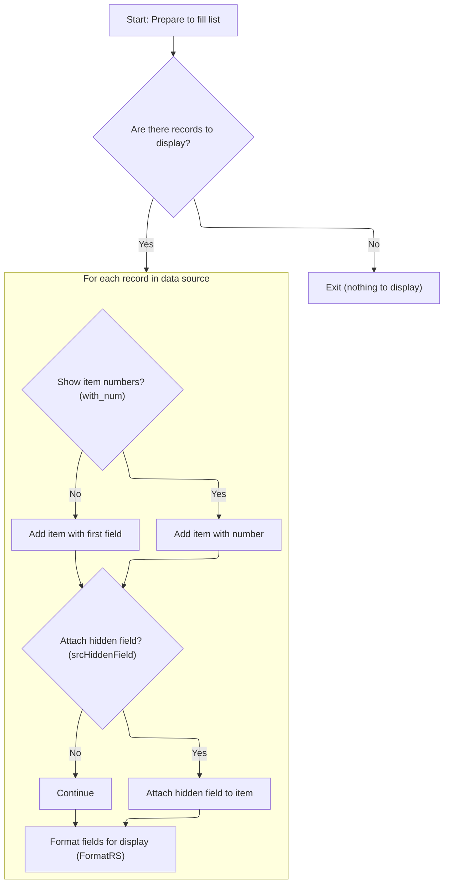

This document describes how records are displayed in a <SwmToken path="HotelManagementSystem/Modules/modProcedure.bas" pos="47:12:12" line-data="Public Sub FillListView(ByRef sListView As ListView, ByRef sRecordSource As Recordset, ByVal sNumOfFields As Byte, ByVal sNumIco As Byte, ByVal with_num As Boolean, ByVal show_first_rec As Boolean, Optional srcHiddenField As String)">`ListView`</SwmToken> for users, with each item formatted for clarity and usability. The flow receives data records and formatting options, prepares the <SwmToken path="HotelManagementSystem/Modules/modProcedure.bas" pos="47:12:12" line-data="Public Sub FillListView(ByRef sListView As ListView, ByRef sRecordSource As Recordset, ByVal sNumOfFields As Byte, ByVal sNumIco As Byte, ByVal with_num As Boolean, ByVal show_first_rec As Boolean, Optional srcHiddenField As String)">`ListView`</SwmToken>, checks for available data, and adds each record as a formatted item. Formatting ensures that dates, currency, and other fields are presented in a consistent, user-friendly way.

# Populating and Formatting <SwmToken path="HotelManagementSystem/Modules/modProcedure.bas" pos="47:12:12" line-data="Public Sub FillListView(ByRef sListView As ListView, ByRef sRecordSource As Recordset, ByVal sNumOfFields As Byte, ByVal sNumIco As Byte, ByVal with_num As Boolean, ByVal show_first_rec As Boolean, Optional srcHiddenField As String)">`ListView`</SwmToken> Data



<SwmSnippet path="/HotelManagementSystem/Modules/modProcedure.bas" line="47">

---

<SwmToken path="HotelManagementSystem/Modules/modProcedure.bas" pos="47:4:4" line-data="Public Sub FillListView(ByRef sListView As ListView, ByRef sRecordSource As Recordset, ByVal sNumOfFields As Byte, ByVal sNumIco As Byte, ByVal with_num As Boolean, ByVal show_first_rec As Boolean, Optional srcHiddenField As String)">`FillListView`</SwmToken> kicks off the process by clearing the <SwmToken path="HotelManagementSystem/Modules/modProcedure.bas" pos="47:12:12" line-data="Public Sub FillListView(ByRef sListView As ListView, ByRef sRecordSource As Recordset, ByVal sNumOfFields As Byte, ByVal sNumIco As Byte, ByVal with_num As Boolean, ByVal show_first_rec As Boolean, Optional srcHiddenField As String)">`ListView`</SwmToken> and checking if there's any data to show. It loops through the Recordset, adding each record as a <SwmToken path="HotelManagementSystem/Modules/modProcedure.bas" pos="47:12:12" line-data="Public Sub FillListView(ByRef sListView As ListView, ByRef sRecordSource As Recordset, ByVal sNumOfFields As Byte, ByVal sNumIco As Byte, ByVal with_num As Boolean, ByVal show_first_rec As Boolean, Optional srcHiddenField As String)">`ListView`</SwmToken> item, optionally using a numeric index or the first field as the key, and can attach a hidden field as metadata. For each field, it decides which value to display based on the flags, then calls <SwmToken path="HotelManagementSystem/Modules/modProcedure.bas" pos="65:10:10" line-data="                            X.SubItems(i) = FormatRS(sRecordSource.Fields(CInt(i) - 1))">`FormatRS`</SwmToken> to handle display formatting before assigning the value to the <SwmToken path="HotelManagementSystem/Modules/modProcedure.bas" pos="47:12:12" line-data="Public Sub FillListView(ByRef sListView As ListView, ByRef sRecordSource As Recordset, ByVal sNumOfFields As Byte, ByVal sNumIco As Byte, ByVal with_num As Boolean, ByVal show_first_rec As Boolean, Optional srcHiddenField As String)">`ListView`</SwmToken> subitems. We need to call <SwmToken path="HotelManagementSystem/Modules/modProcedure.bas" pos="65:10:10" line-data="                            X.SubItems(i) = FormatRS(sRecordSource.Fields(CInt(i) - 1))">`FormatRS`</SwmToken> next to make sure things like dates and currency look right in the UI.

```visual basic
Public Sub FillListView(ByRef sListView As ListView, ByRef sRecordSource As Recordset, ByVal sNumOfFields As Byte, ByVal sNumIco As Byte, ByVal with_num As Boolean, ByVal show_first_rec As Boolean, Optional srcHiddenField As String)
    Dim X As Variant
    Dim i As Byte
    On Error Resume Next
    sListView.ListItems.Clear
    If sRecordSource.RecordCount < 1 Then Exit Sub
    sRecordSource.MoveFirst
    Do While Not sRecordSource.EOF
        If with_num = True Then
            Set X = sListView.ListItems.Add(, , sRecordSource.AbsolutePosition, sNumIco, sNumIco)
        Else
            Set X = sListView.ListItems.Add(, , "" & sRecordSource.Fields(0), sNumIco, sNumIco)
        End If
            If srcHiddenField <> "" Then X.Tag = sRecordSource.Fields(srcHiddenField)
            For i = 1 To sNumOfFields - 1
                If show_first_rec = True Then
                    If with_num = True Then
                        If sRecordSource.Fields(CInt(i) - 1).Type = adDouble Then
                            X.SubItems(i) = FormatRS(sRecordSource.Fields(CInt(i) - 1))
                        Else
                            X.SubItems(i) = "" & FormatRS(sRecordSource.Fields(CInt(i) - 1))
                        End If
                    Else
                        If sRecordSource.Fields(CInt(i)).Type = adDouble Then
                            X.SubItems(i) = FormatRS(sRecordSource.Fields(CInt(i)))
                        Else
                            X.SubItems(i) = "" & FormatRS(sRecordSource.Fields(CInt(i)))
                        End If
                    End If
                Else
                    X.SubItems(i) = "" & FormatRS(sRecordSource.Fields(CInt(i) + 1))
                End If
            Next i
        sRecordSource.MoveNext
    Loop
    i = 0
    Set X = Nothing
End Sub
```

---

</SwmSnippet>

<SwmSnippet path="/HotelManagementSystem/Modules/modFunction.bas" line="7">

---

<SwmToken path="HotelManagementSystem/Modules/modFunction.bas" pos="7:4:4" line-data="Public Function FormatRS(ByVal srcField As Field, Optional AllowNewLine As Boolean) As String">`FormatRS`</SwmToken> handles the display formatting for each field. If <SwmToken path="HotelManagementSystem/Modules/modFunction.bas" pos="7:17:17" line-data="Public Function FormatRS(ByVal srcField As Field, Optional AllowNewLine As Boolean) As String">`AllowNewLine`</SwmToken> is False, it strips out newlines to keep the <SwmToken path="HotelManagementSystem/Modules/modProcedure.bas" pos="47:12:12" line-data="Public Sub FillListView(ByRef sListView As ListView, ByRef sRecordSource As Recordset, ByVal sNumOfFields As Byte, ByVal sNumIco As Byte, ByVal with_num As Boolean, ByVal show_first_rec As Boolean, Optional srcHiddenField As String)">`ListView`</SwmToken> clean. It checks the field type: currency values get formatted with two decimals, dates get a readable string, and everything else is just shown as-is. This keeps the <SwmToken path="HotelManagementSystem/Modules/modProcedure.bas" pos="47:12:12" line-data="Public Sub FillListView(ByRef sListView As ListView, ByRef sRecordSource As Recordset, ByVal sNumOfFields As Byte, ByVal sNumIco As Byte, ByVal with_num As Boolean, ByVal show_first_rec As Boolean, Optional srcHiddenField As String)">`ListView`</SwmToken> output consistent and user-friendly.

```visual basic
Public Function FormatRS(ByVal srcField As Field, Optional AllowNewLine As Boolean) As String
    Dim strRet As String
    
    With srcField
        If AllowNewLine = True Then
            strRet = srcField
        Else
            strRet = Replace(srcField, vbCrLf, " ", , , vbTextCompare)
        End If
        
        'If srcField.Type = adCurrency Or srcField.Type = adDouble Then
        If srcField.Type = adCurrency Then
            strRet = Format$(srcField, "#,##0.00")
        ElseIf srcField.Type = adDate Then
            strRet = Format$(srcField, "MMM-dd-yyyy")
        Else
            strRet = srcField
        End If
    End With
    
    FormatRS = strRet
    
    strRet = vbNullString
End Function
```

---

</SwmSnippet>

&nbsp;

*This is an auto-generated document by Swimm 🌊 and has not yet been verified by a human*

<SwmMeta version="3.0.0" repo-id="Z2l0aHViJTNBJTNBY3RzLVZCNi1Qcm9qZWN0cyUzQSUzQVN3aW1tLURlbW8=" repo-name="cts-VB6-Projects"><sup>Powered by [Swimm](https://app.swimm.io/)</sup></SwmMeta>
