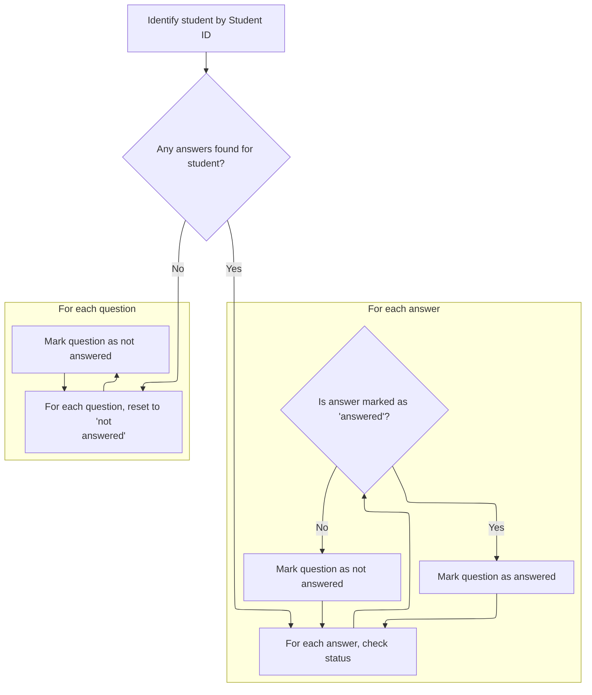
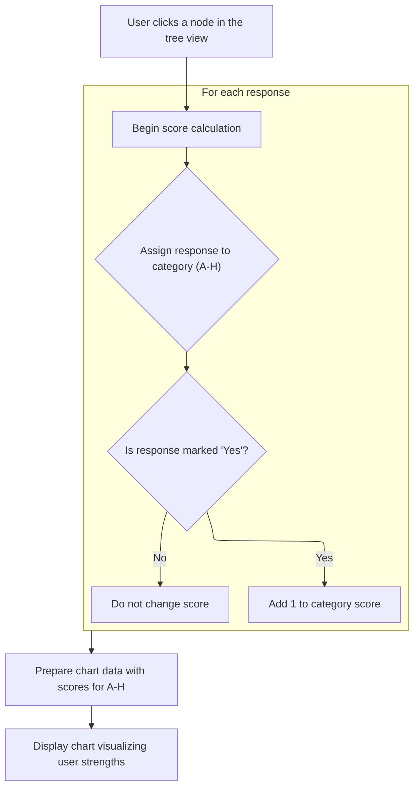

This document describes how the system responds to user interactions with the tree view. When a node is clicked, the system either displays counseling problem details or loads answer data, calculates group scores, and updates a chart to visualize strengths. This enables users to access information or visual feedback based on their selection.

# Handling Node Clicks and Displaying Problem Details

<SwmSnippet path="/BK App/Form/frmtree.frm" line="1650">

---

In <SwmToken path="BK App/Form/frmtree.frm" pos="1650:4:4" line-data="Private Sub TreeView1_NodeClick(ByVal Node As MSComctlLib.Node)">`TreeView1_NodeClick`</SwmToken>, when a node with a key starting with 'd' is clicked, we extract the ID from the key and call <SwmToken path="BK App/Form/frmtree.frm" pos="1653:1:1" line-data="        cari_masalah (Mid(Node.key, 2, 100))">`cari_masalah`</SwmToken> to fetch and show the related problem details. This is followed by switching to the first tab to make sure the user sees the problem info.

```visual basic
Private Sub TreeView1_NodeClick(ByVal Node As MSComctlLib.Node)
'On Error GoTo Hell
    If Left(Node.key, 1) = "d" Then
        cari_masalah (Mid(Node.key, 2, 100))
```

---

</SwmSnippet>

<SwmSnippet path="/BK App/Form/frmtree.frm" line="1669">

---

Cari_masalah grabs the counseling problem and handling details for the given ID from the database and puts them into <SwmToken path="BK App/Form/frmtree.frm" pos="1677:1:1" line-data="        Text1.text = Masalah!Permasalahan">`Text1`</SwmToken> and <SwmToken path="BK App/Form/frmtree.frm" pos="1678:1:1" line-data="        Text2.text = Masalah!Penanganan">`Text2`</SwmToken>. If nothing is found, it leaves the fields as they are.

```visual basic
Private Function cari_masalah(pID As Long)
Dim Masalah As New ADODB.Recordset
    sql = "SELECT IDKonseling,tgl,NIS,NIP,Permasalahan,Penanganan,Keterangan FROM TBKonseling where IDKonseling = " & pID & ""
    Set Masalah = Nothing
    Masalah.CursorLocation = adUseClient
    Masalah.Open sql, koneksi
    
    If Not Masalah.EOF Then
        Text1.text = Masalah!Permasalahan
        Text2.text = Masalah!Penanganan
    End If

End Function
```

---

</SwmSnippet>

<SwmSnippet path="/BK App/Form/frmtree.frm" line="1654">

---

Back in <SwmToken path="BK App/Form/frmtree.frm" pos="1650:4:4" line-data="Private Sub TreeView1_NodeClick(ByVal Node As MSComctlLib.Node)">`TreeView1_NodeClick`</SwmToken>, after returning from <SwmToken path="BK App/Form/frmtree.frm" pos="1653:1:1" line-data="        cari_masalah (Mid(Node.key, 2, 100))">`cari_masalah`</SwmToken> for 'd' nodes, we just switch tabs. For 'c' nodes, we set up the chart subtitle, switch to the chart tab, and call isicap to load answer data for the selected student or category.

```visual basic
        SSTab1.Tab = 0
    ElseIf Left(Node.key, 1) = "c" Then
        XChart1.ChartSubTitle = Node.Parent.text
        SSTab1.Tab = 1
        Call isicap(Mid(Node.key, 2, 100))
```

---

</SwmSnippet>

## Loading and Resetting Answer Data



<SwmSnippet path="/BK App/Form/frmtree.frm" line="1692">

---

In isicap, we query the answers for the given student. If we find any, we call captioncek to reset and disable all yesno controls before updating them with the new answer values.

```visual basic
Private Sub isicap(pnis As Long)
    sql = "select * from Tbjawaban where NIS = " & pnis & " order by Nosoal"
    Set rsbim = Nothing
    rsbim.CursorLocation = adUseClient
    rsbim.Open sql, koneksi
    If Not rsbim.EOF Then
        Call captioncek
```

---

</SwmSnippet>

<SwmSnippet path="/BK App/Form/frmtree.frm" line="1683">

---

Captioncek loops through all 120 yesno controls, resets their captions, disables them, and clears their values to make sure everything starts clean before updating.

```visual basic
Private Sub captioncek()
    For i = 0 To 119
        yesno(i).Caption = i + 1
        yesno(i).Enabled = False
        yesno(i).Value = 0
    Next
    
End Sub
```

---

</SwmSnippet>

<SwmSnippet path="/BK App/Form/frmtree.frm" line="1699">

---

After captioncek resets everything, isicap updates each yesno control to reflect the answer data: sets to 1 if jawaban is -1, otherwise 0. If there are no answers, all controls stay at 0.

```visual basic
        For i = 0 To rsbim.RecordCount - 1
            If rsbim!jawaban = -1 Then
                yesno(i).Value = 1
                rsbim.MoveNext
            Else
                yesno(i).Value = 0
                rsbim.MoveNext
            End If
        Next
    Else
        For i = 0 To 119
            yesno(i).Value = 0
            
        Next
    End If
End Sub
```

---

</SwmSnippet>

## Calculating and Displaying Group Scores



<SwmSnippet path="/BK App/Form/frmtree.frm" line="1659">

---

Back in <SwmToken path="BK App/Form/frmtree.frm" pos="1650:4:4" line-data="Private Sub TreeView1_NodeClick(ByVal Node As MSComctlLib.Node)">`TreeView1_NodeClick`</SwmToken>, after isicap loads the answers, we call <SwmToken path="BK App/Form/frmtree.frm" pos="1659:3:3" line-data="        Call Cari_Nilai">`Cari_Nilai`</SwmToken> to count how many 'yes' answers there are in each group (A-H). This prepares the data for display and charting.

```visual basic
        Call Cari_Nilai
```

---

</SwmSnippet>

<SwmSnippet path="/BK App/Form/frmtree.frm" line="1716">

---

<SwmToken path="BK App/Form/frmtree.frm" pos="1716:4:4" line-data="Private Sub Cari_Nilai()">`Cari_Nilai`</SwmToken> loops through all yesno controls, counts the 'yes' answers for each group (A-H), and updates the UI with these counts. The groups are based on index patterns and map to different categories.

```visual basic
Private Sub Cari_Nilai()
Dim AA As Integer
a = 0
b = 0
c = 0
d = 0
e = 0
f = 0
g = 0
h = 0
For i = 0 To 119
    'A
    If i = 0 Or i = 8 Or i = 16 Or i = 24 Or i = 32 Or _
        i = 40 Or i = 48 Or i = 56 Or i = 64 Or i = 72 Or i = 80 Or _
        i = 88 Or i = 96 Or i = 104 Or i = 112 Then
        If yesno(i).Value = 1 Then
            a = a + 1
        Else
            a = a
        End If
    'B
    ElseIf i = 1 Or i = 9 Or i = 17 Or i = 25 Or i = 33 Or _
        i = 41 Or i = 49 Or i = 57 Or i = 65 Or i = 73 Or i = 81 Or _
        i = 89 Or i = 97 Or i = 105 Or i = 113 Then
        If yesno(i).Value = 1 Then
            b = b + 1
        Else
            b = b
        End If
    'C
    ElseIf i = 2 Or i = 10 Or i = 18 Or i = 26 Or i = 34 Or _
        i = 42 Or i = 50 Or i = 58 Or i = 66 Or i = 74 Or i = 82 Or _
        i = 90 Or i = 98 Or i = 106 Or i = 114 Then
        If yesno(i).Value = 1 Then
            c = c + 1
        Else
            c = c
        End If
    'D
    ElseIf i = 3 Or i = 11 Or i = 19 Or i = 27 Or i = 35 Or _
        i = 43 Or i = 51 Or i = 59 Or i = 67 Or i = 75 Or i = 83 Or _
        i = 91 Or i = 99 Or i = 107 Or i = 115 Then
        If yesno(i).Value = 1 Then
            d = d + 1
        Else
            d = d
        End If
    'E
    ElseIf i = 4 Or i = 12 Or i = 20 Or i = 28 Or i = 36 Or _
        i = 44 Or i = 52 Or i = 60 Or i = 68 Or i = 76 Or i = 84 Or _
        i = 92 Or i = 100 Or i = 108 Or i = 116 Then
        If yesno(i).Value = 1 Then
            e = e + 1
        Else
            e = e
        End If
    'F
    ElseIf i = 5 Or i = 13 Or i = 21 Or i = 29 Or i = 37 Or _
        i = 45 Or i = 53 Or i = 61 Or i = 69 Or i = 77 Or i = 85 Or _
        i = 93 Or i = 101 Or i = 109 Or i = 117 Then
        If yesno(i).Value = 1 Then
            f = f + 1
        Else
            f = f
        End If
    'G
    ElseIf i = 6 Or i = 14 Or i = 22 Or i = 30 Or i = 38 Or _
        i = 46 Or i = 54 Or i = 62 Or i = 70 Or i = 78 Or i = 86 Or _
        i = 94 Or i = 102 Or i = 110 Or i = 118 Then
        If yesno(i).Value = 1 Then
            g = g + 1
        Else
            g = g
        End If
    'H
    ElseIf i = 7 Or i = 15 Or i = 23 Or i = 31 Or i = 39 Or _
        i = 47 Or i = 55 Or i = 63 Or i = 71 Or i = 79 Or i = 87 Or _
        i = 95 Or i = 103 Or i = 111 Or i = 119 Then
        If yesno(i).Value = 1 Then
            h = h + 1
        Else
            h = h
        End If
    End If
Next
    ta.text = a
    tb.text = b
    tc.text = c
    td.text = d
    te.text = e
    tf.text = f
    tg.text = g
    th.text = h
End Sub
```

---

</SwmSnippet>

<SwmSnippet path="/BK App/Form/frmtree.frm" line="1660">

---

Back in <SwmToken path="BK App/Form/frmtree.frm" pos="1650:4:4" line-data="Private Sub TreeView1_NodeClick(ByVal Node As MSComctlLib.Node)">`TreeView1_NodeClick`</SwmToken>, after <SwmToken path="BK App/Form/frmtree.frm" pos="1659:3:3" line-data="        Call Cari_Nilai">`Cari_Nilai`</SwmToken> updates the group scores, we call <SwmToken path="BK App/Form/frmtree.frm" pos="1660:1:1" line-data="        PrepareData">`PrepareData`</SwmToken> to push these counts into the chart so the visual matches the data.

```visual basic
        PrepareData
```

---

</SwmSnippet>

<SwmSnippet path="/BK App/Form/frmtree.frm" line="1810">

---

<SwmToken path="BK App/Form/frmtree.frm" pos="1810:4:4" line-data="Private Sub PrepareData()">`PrepareData`</SwmToken> sets up the chart: clears it, loops through the 8 groups, and adds a chart item for each with the right value and labels. This makes the chart reflect the latest group scores.

```visual basic
Private Sub PrepareData()
    Dim X As Integer
    Dim intSign As Integer
    Dim oChartItem As ChartItem
    Dim varMonths As Variant
    Dim varMonthsExt As Variant
    varMonths = Array("A", "B", "C", "D", "E", "F", "G", "H")
    varMonthsExt = Array("Verbal-Linguistik", "Logis-Matematis", "Spasial", "Kinestetik", "Musikal", "Interpersonal", "Intrapersonal", "Natural")
    XChart1.AutoRedraw = True
    XChart1.chartType = xcBarLine
    XChart1.Clear
    For X = 1 To 8
        If X = 1 Then
            oChartItem.Value = a
        ElseIf X = 2 Then
            oChartItem.Value = b
        ElseIf X = 3 Then
            oChartItem.Value = c
        ElseIf X = 4 Then
            oChartItem.Value = d
        ElseIf X = 5 Then
            oChartItem.Value = e
        ElseIf X = 6 Then
            oChartItem.Value = f
        ElseIf X = 7 Then
            oChartItem.Value = g
        ElseIf X = 8 Then
            oChartItem.Value = h
        End If
        oChartItem.ItemID = X
        oChartItem.XAxisDescription = varMonths(X - 1)
        oChartItem.SelectedDescription = varMonthsExt(X - 1)
        XChart1.AddItem oChartItem
    Next X
End Sub
```

---

</SwmSnippet>

<SwmSnippet path="/BK App/Form/frmtree.frm" line="1661">

---

After <SwmToken path="BK App/Form/frmtree.frm" pos="1660:1:1" line-data="        PrepareData">`PrepareData`</SwmToken>, <SwmToken path="BK App/Form/frmtree.frm" pos="1650:4:4" line-data="Private Sub TreeView1_NodeClick(ByVal Node As MSComctlLib.Node)">`TreeView1_NodeClick`</SwmToken> turns on <SwmToken path="BK App/Form/frmtree.frm" pos="1661:3:3" line-data="        XChart1.AutoRedraw = True">`AutoRedraw`</SwmToken> and refreshes the chart so the UI instantly shows the new data. The user gets immediate feedback when clicking a 'c' node.

```visual basic
        XChart1.AutoRedraw = True
'        XChart1.ShowLegend (True)
        XChart1.Refresh
'        XChart1.ShowLegend (True)
    End If
'Hell:

End Sub
```

---

</SwmSnippet>

&nbsp;

*This is an auto-generated document by Swimm 🌊 and has not yet been verified by a human*

<SwmMeta version="3.0.0" repo-id="Z2l0aHViJTNBJTNBY3RzLVZCNi1Qcm9qZWN0cyUzQSUzQVN3aW1tLURlbW8=" repo-name="cts-VB6-Projects"><sup>Powered by [Swimm](https://app.swimm.io/)</sup></SwmMeta>
