```mermaid
%%{init: {"flowchart": {"defaultRenderer": "elk"}} }%%
flowchart TD
    node1["Clear ListView"] --> node2{"Any records to display?"}
    click node1 openCode "HotelManagementSystem/Modules/modProcedure.bas:112:112"
    click node2 openCode "HotelManagementSystem/Modules/modProcedure.bas:113:113"
    node2 -->|"No"| node9["End"]
    click node9 openCode "HotelManagementSystem/Modules/modProcedure.bas:113:113"
    node2 -->|"Yes"| node3["For each record in range"]
    click node3 openCode "HotelManagementSystem/Modules/modProcedure.bas:119:164"
    subgraph loop1["For each record in the specified range"]
      node3 --> node4{"Apply filter? (match_field set)"}
      click node4 openCode "HotelManagementSystem/Modules/modProcedure.bas:120:140"
      node4 -->|"No"| node5{"Show record number? (with_num)"}
      node4 -->|"Yes"| node6{"Record matches filter? (field = match_str)"}
      node6 -->|"Yes"| node7{"Show record number? (with_num)"}
      node6 -->|"No"| node5
      node5 --> node8["Add record to ListView (default icon)"]
      click node8 openCode "HotelManagementSystem/Modules/modProcedure.bas:122:137"
      node7 --> node10["Add record to ListView (match icon)"]
      click node10 openCode "HotelManagementSystem/Modules/modProcedure.bas:129:132"
      node8 --> node11["Tag and format subitems (FormatRS, show_first_rec, srcHiddenField)"]
      click node11 openCode "HotelManagementSystem/Modules/modProcedure.bas:141:155"
      node10 --> node11
      node11 --> node12{"Reached end position?"}
      click node12 openCode "HotelManagementSystem/Modules/modProcedure.bas:158:163"
      node12 -->|"No"| node3
      node12 -->|"Yes"| node13["Restore pointer and finish"]
      click node13 openCode "HotelManagementSystem/Modules/modProcedure.bas:165:168"
    end
    node13 --> node9
classDef HeadingStyle fill:#777777,stroke:#333,stroke-width:2px;

%% Swimm:
%% %%{init: {"flowchart": {"defaultRenderer": "elk"}} }%%
%% flowchart TD
%%     node1["Clear <SwmToken path="HotelManagementSystem/Modules/modProcedure.bas" pos="108:12:12" line-data="Public Sub pageFillListView(ByRef sListView As ListView, ByRef sRecordSource As Recordset, ByVal pos_start As Long, ByVal pos_end As Long, ByVal sNumOfFields As Byte, ByVal sNumIco As Byte, ByVal with_num As Boolean, ByVal show_first_rec As Boolean, Optional match_field As String, Optional match_str As String, Optional match_ico As Byte, Optional srcHiddenField As String)">`ListView`</SwmToken>"] --> node2{"Any records to display?"}
%%     click node1 openCode "<SwmPath>[HotelManagementSystem/Modules/modProcedure.bas](HotelManagementSystem/Modules/modProcedure.bas)</SwmPath>:112:112"
%%     click node2 openCode "<SwmPath>[HotelManagementSystem/Modules/modProcedure.bas](HotelManagementSystem/Modules/modProcedure.bas)</SwmPath>:113:113"
%%     node2 -->|"No"| node9["End"]
%%     click node9 openCode "<SwmPath>[HotelManagementSystem/Modules/modProcedure.bas](HotelManagementSystem/Modules/modProcedure.bas)</SwmPath>:113:113"
%%     node2 -->|"Yes"| node3["For each record in range"]
%%     click node3 openCode "<SwmPath>[HotelManagementSystem/Modules/modProcedure.bas](HotelManagementSystem/Modules/modProcedure.bas)</SwmPath>:119:164"
%%     subgraph loop1["For each record in the specified range"]
%%       node3 --> node4{"Apply filter? (<SwmToken path="HotelManagementSystem/Modules/modProcedure.bas" pos="108:80:80" line-data="Public Sub pageFillListView(ByRef sListView As ListView, ByRef sRecordSource As Recordset, ByVal pos_start As Long, ByVal pos_end As Long, ByVal sNumOfFields As Byte, ByVal sNumIco As Byte, ByVal with_num As Boolean, ByVal show_first_rec As Boolean, Optional match_field As String, Optional match_str As String, Optional match_ico As Byte, Optional srcHiddenField As String)">`match_field`</SwmToken> set)"}
%%       click node4 openCode "<SwmPath>[HotelManagementSystem/Modules/modProcedure.bas](HotelManagementSystem/Modules/modProcedure.bas)</SwmPath>:120:140"
%%       node4 -->|"No"| node5{"Show record number? (<SwmToken path="HotelManagementSystem/Modules/modProcedure.bas" pos="108:62:62" line-data="Public Sub pageFillListView(ByRef sListView As ListView, ByRef sRecordSource As Recordset, ByVal pos_start As Long, ByVal pos_end As Long, ByVal sNumOfFields As Byte, ByVal sNumIco As Byte, ByVal with_num As Boolean, ByVal show_first_rec As Boolean, Optional match_field As String, Optional match_str As String, Optional match_ico As Byte, Optional srcHiddenField As String)">`with_num`</SwmToken>)"}
%%       node4 -->|"Yes"| node6{"Record matches filter? (field = <SwmToken path="HotelManagementSystem/Modules/modProcedure.bas" pos="108:89:89" line-data="Public Sub pageFillListView(ByRef sListView As ListView, ByRef sRecordSource As Recordset, ByVal pos_start As Long, ByVal pos_end As Long, ByVal sNumOfFields As Byte, ByVal sNumIco As Byte, ByVal with_num As Boolean, ByVal show_first_rec As Boolean, Optional match_field As String, Optional match_str As String, Optional match_ico As Byte, Optional srcHiddenField As String)">`match_str`</SwmToken>)"}
%%       node6 -->|"Yes"| node7{"Show record number? (<SwmToken path="HotelManagementSystem/Modules/modProcedure.bas" pos="108:62:62" line-data="Public Sub pageFillListView(ByRef sListView As ListView, ByRef sRecordSource As Recordset, ByVal pos_start As Long, ByVal pos_end As Long, ByVal sNumOfFields As Byte, ByVal sNumIco As Byte, ByVal with_num As Boolean, ByVal show_first_rec As Boolean, Optional match_field As String, Optional match_str As String, Optional match_ico As Byte, Optional srcHiddenField As String)">`with_num`</SwmToken>)"}
%%       node6 -->|"No"| node5
%%       node5 --> node8["Add record to <SwmToken path="HotelManagementSystem/Modules/modProcedure.bas" pos="108:12:12" line-data="Public Sub pageFillListView(ByRef sListView As ListView, ByRef sRecordSource As Recordset, ByVal pos_start As Long, ByVal pos_end As Long, ByVal sNumOfFields As Byte, ByVal sNumIco As Byte, ByVal with_num As Boolean, ByVal show_first_rec As Boolean, Optional match_field As String, Optional match_str As String, Optional match_ico As Byte, Optional srcHiddenField As String)">`ListView`</SwmToken> (default icon)"]
%%       click node8 openCode "<SwmPath>[HotelManagementSystem/Modules/modProcedure.bas](HotelManagementSystem/Modules/modProcedure.bas)</SwmPath>:122:137"
%%       node7 --> node10["Add record to <SwmToken path="HotelManagementSystem/Modules/modProcedure.bas" pos="108:12:12" line-data="Public Sub pageFillListView(ByRef sListView As ListView, ByRef sRecordSource As Recordset, ByVal pos_start As Long, ByVal pos_end As Long, ByVal sNumOfFields As Byte, ByVal sNumIco As Byte, ByVal with_num As Boolean, ByVal show_first_rec As Boolean, Optional match_field As String, Optional match_str As String, Optional match_ico As Byte, Optional srcHiddenField As String)">`ListView`</SwmToken> (match icon)"]
%%       click node10 openCode "<SwmPath>[HotelManagementSystem/Modules/modProcedure.bas](HotelManagementSystem/Modules/modProcedure.bas)</SwmPath>:129:132"
%%       node8 --> node11["Tag and format subitems (<SwmToken path="HotelManagementSystem/Modules/modProcedure.bas" pos="124:22:22" line-data="                Set X = sListView.ListItems.Add(, , &quot;&quot; &amp; FormatRS(sRecordSource.Fields(0)), sNumIco, sNumIco)">`FormatRS`</SwmToken>, <SwmToken path="HotelManagementSystem/Modules/modProcedure.bas" pos="108:71:71" line-data="Public Sub pageFillListView(ByRef sListView As ListView, ByRef sRecordSource As Recordset, ByVal pos_start As Long, ByVal pos_end As Long, ByVal sNumOfFields As Byte, ByVal sNumIco As Byte, ByVal with_num As Boolean, ByVal show_first_rec As Boolean, Optional match_field As String, Optional match_str As String, Optional match_ico As Byte, Optional srcHiddenField As String)">`show_first_rec`</SwmToken>, <SwmToken path="HotelManagementSystem/Modules/modProcedure.bas" pos="108:107:107" line-data="Public Sub pageFillListView(ByRef sListView As ListView, ByRef sRecordSource As Recordset, ByVal pos_start As Long, ByVal pos_end As Long, ByVal sNumOfFields As Byte, ByVal sNumIco As Byte, ByVal with_num As Boolean, ByVal show_first_rec As Boolean, Optional match_field As String, Optional match_str As String, Optional match_ico As Byte, Optional srcHiddenField As String)">`srcHiddenField`</SwmToken>)"]
%%       click node11 openCode "<SwmPath>[HotelManagementSystem/Modules/modProcedure.bas](HotelManagementSystem/Modules/modProcedure.bas)</SwmPath>:141:155"
%%       node10 --> node11
%%       node11 --> node12{"Reached end position?"}
%%       click node12 openCode "<SwmPath>[HotelManagementSystem/Modules/modProcedure.bas](HotelManagementSystem/Modules/modProcedure.bas)</SwmPath>:158:163"
%%       node12 -->|"No"| node3
%%       node12 -->|"Yes"| node13["Restore pointer and finish"]
%%       click node13 openCode "<SwmPath>[HotelManagementSystem/Modules/modProcedure.bas](HotelManagementSystem/Modules/modProcedure.bas)</SwmPath>:165:168"
%%     end
%%     node13 --> node9
%% classDef HeadingStyle fill:#777777,stroke:#333,stroke-width:2px;
```

This document describes how records from a database are presented to users in a <SwmToken path="HotelManagementSystem/Modules/modProcedure.bas" pos="108:12:12" line-data="Public Sub pageFillListView(ByRef sListView As ListView, ByRef sRecordSource As Recordset, ByVal pos_start As Long, ByVal pos_end As Long, ByVal sNumOfFields As Byte, ByVal sNumIco As Byte, ByVal with_num As Boolean, ByVal show_first_rec As Boolean, Optional match_field As String, Optional match_str As String, Optional match_ico As Byte, Optional srcHiddenField As String)">`ListView`</SwmToken>. The flow ensures that only relevant records are shown, highlights matches when needed, and formats each field for clarity.

# Populating and Formatting <SwmToken path="HotelManagementSystem/Modules/modProcedure.bas" pos="108:12:12" line-data="Public Sub pageFillListView(ByRef sListView As ListView, ByRef sRecordSource As Recordset, ByVal pos_start As Long, ByVal pos_end As Long, ByVal sNumOfFields As Byte, ByVal sNumIco As Byte, ByVal with_num As Boolean, ByVal show_first_rec As Boolean, Optional match_field As String, Optional match_str As String, Optional match_ico As Byte, Optional srcHiddenField As String)">`ListView`</SwmToken> Data



<SwmSnippet path="/HotelManagementSystem/Modules/modProcedure.bas" line="108">

---

<SwmToken path="HotelManagementSystem/Modules/modProcedure.bas" pos="108:4:4" line-data="Public Sub pageFillListView(ByRef sListView As ListView, ByRef sRecordSource As Recordset, ByVal pos_start As Long, ByVal pos_end As Long, ByVal sNumOfFields As Byte, ByVal sNumIco As Byte, ByVal with_num As Boolean, ByVal show_first_rec As Boolean, Optional match_field As String, Optional match_str As String, Optional match_ico As Byte, Optional srcHiddenField As String)">`pageFillListView`</SwmToken> kicks off the process by clearing the <SwmToken path="HotelManagementSystem/Modules/modProcedure.bas" pos="108:12:12" line-data="Public Sub pageFillListView(ByRef sListView As ListView, ByRef sRecordSource As Recordset, ByVal pos_start As Long, ByVal pos_end As Long, ByVal sNumOfFields As Byte, ByVal sNumIco As Byte, ByVal with_num As Boolean, ByVal show_first_rec As Boolean, Optional match_field As String, Optional match_str As String, Optional match_ico As Byte, Optional srcHiddenField As String)">`ListView`</SwmToken> and checking if there are any records to show. It then loops through the specified range in the Recordset, adding each record as a <SwmToken path="HotelManagementSystem/Modules/modProcedure.bas" pos="110:7:7" line-data="    Dim X As ListItem">`ListItem`</SwmToken>. Depending on the parameters, it can show record numbers, highlight matches with a different icon, and stash hidden data in the Tag. For each field, it calls <SwmToken path="HotelManagementSystem/Modules/modProcedure.bas" pos="124:22:22" line-data="                Set X = sListView.ListItems.Add(, , &quot;&quot; &amp; FormatRS(sRecordSource.Fields(0)), sNumIco, sNumIco)">`FormatRS`</SwmToken> to make sure values (like currency and dates) look right in the UI. We need to call <SwmToken path="HotelManagementSystem/Modules/modProcedure.bas" pos="124:22:22" line-data="                Set X = sListView.ListItems.Add(, , &quot;&quot; &amp; FormatRS(sRecordSource.Fields(0)), sNumIco, sNumIco)">`FormatRS`</SwmToken> next because raw database values aren't user-friendly—<SwmToken path="HotelManagementSystem/Modules/modProcedure.bas" pos="124:22:22" line-data="                Set X = sListView.ListItems.Add(, , &quot;&quot; &amp; FormatRS(sRecordSource.Fields(0)), sNumIco, sNumIco)">`FormatRS`</SwmToken> handles the display formatting before anything hits the <SwmToken path="HotelManagementSystem/Modules/modProcedure.bas" pos="108:12:12" line-data="Public Sub pageFillListView(ByRef sListView As ListView, ByRef sRecordSource As Recordset, ByVal pos_start As Long, ByVal pos_end As Long, ByVal sNumOfFields As Byte, ByVal sNumIco As Byte, ByVal with_num As Boolean, ByVal show_first_rec As Boolean, Optional match_field As String, Optional match_str As String, Optional match_ico As Byte, Optional srcHiddenField As String)">`ListView`</SwmToken>.

```visual basic
Public Sub pageFillListView(ByRef sListView As ListView, ByRef sRecordSource As Recordset, ByVal pos_start As Long, ByVal pos_end As Long, ByVal sNumOfFields As Byte, ByVal sNumIco As Byte, ByVal with_num As Boolean, ByVal show_first_rec As Boolean, Optional match_field As String, Optional match_str As String, Optional match_ico As Byte, Optional srcHiddenField As String)

    Dim X As ListItem
    Dim i As Byte, c As Long, old_pt As Long
    sListView.ListItems.Clear
    If sRecordSource.RecordCount < 1 Then Exit Sub
    sRecordSource.AbsolutePosition = pos_start
    On Error Resume Next
    old_pt = Screen.MousePointer
    Screen.MousePointer = vbHourglass
    DoEvents
    Do
        If match_field = "" Then
            If with_num = True Then
                Set X = sListView.ListItems.Add(, , "" & sRecordSource.AbsolutePosition, sNumIco, sNumIco)
            Else
                Set X = sListView.ListItems.Add(, , "" & FormatRS(sRecordSource.Fields(0)), sNumIco, sNumIco)
            End If
        Else
            If sRecordSource.Fields(match_field) = match_str Then
                If with_num = True Then
                    Set X = sListView.ListItems.Add(, , "" & sRecordSource.AbsolutePosition, match_ico, match_ico)
                Else
                    Set X = sListView.ListItems.Add(, , "" & FormatRS(sRecordSource.Fields(0)), match_ico, match_ico)
                End If
            Else
                If with_num = True Then
                    Set X = sListView.ListItems.Add(, , "" & sRecordSource.AbsolutePosition, sNumIco, sNumIco)
                Else
                    Set X = sListView.ListItems.Add(, , "" & FormatRS(sRecordSource.Fields(0)), sNumIco, sNumIco)
                End If
            End If
        End If
            If srcHiddenField <> "" Then
                X.Tag = sRecordSource.Fields(srcHiddenField) & "*~~~~~*" & c + pos_start
              Else
                X.Tag = c + pos_start
            End If
            For i = 1 To sNumOfFields - 1
                If show_first_rec = True Then
                    If with_num = True Then
                             X.SubItems(i) = "" & FormatRS(sRecordSource.Fields(CInt(i) - 1))
                    Else
                            X.SubItems(i) = "" & FormatRS(sRecordSource.Fields(CInt(i)))
                    End If
                Else
                        X.SubItems(i) = "" & FormatRS(sRecordSource.Fields(CInt(i) + 1))
                End If
            Next i
            
        If sRecordSource.AbsolutePosition >= pos_end Then
            Exit Do
        Else
            sRecordSource.MoveNext
            c = c + 1
        End If
    Loop
    Screen.MousePointer = old_pt
    i = 0: c = 0: old_pt = 0
    Set X = Nothing
End Sub
```

---

</SwmSnippet>

<SwmSnippet path="/HotelManagementSystem/Modules/modFunction.bas" line="7">

---

<SwmToken path="HotelManagementSystem/Modules/modFunction.bas" pos="7:4:4" line-data="Public Function FormatRS(ByVal srcField As Field, Optional AllowNewLine As Boolean) As String">`FormatRS`</SwmToken> formats field values for display: it cleans up new lines, formats currency and dates, and leaves other types as-is.

```visual basic
Public Function FormatRS(ByVal srcField As Field, Optional AllowNewLine As Boolean) As String
    Dim strRet As String
    
    With srcField
        If AllowNewLine = True Then
            strRet = srcField
        Else
            strRet = Replace(srcField, vbCrLf, " ", , , vbTextCompare)
        End If
        
        'If srcField.Type = adCurrency Or srcField.Type = adDouble Then
        If srcField.Type = adCurrency Then
            strRet = Format$(srcField, "#,##0.00")
        ElseIf srcField.Type = adDate Then
            strRet = Format$(srcField, "MMM-dd-yyyy")
        Else
            strRet = srcField
        End If
    End With
    
    FormatRS = strRet
    
    strRet = vbNullString
End Function
```

---

</SwmSnippet>

&nbsp;

*This is an auto-generated document by Swimm 🌊 and has not yet been verified by a human*

<SwmMeta version="3.0.0" repo-id="Z2l0aHViJTNBJTNBY3RzLVZCNi1Qcm9qZWN0cyUzQSUzQVN3aW1tLURlbW8=" repo-name="cts-VB6-Projects"><sup>Powered by [Swimm](https://app.swimm.io/)</sup></SwmMeta>
