This document describes the flow for generating an <SwmToken path="BARCODE/arisBarcode.cls" pos="25:2:2" line-data="Function EAN8(zObj As Object, zBarH As Integer, BarText As String, Optional ByVal HasCaption As Boolean = False)">`EAN8`</SwmToken> barcode image. The process starts by forwarding the barcode rendering request with the <SwmToken path="BARCODE/arisBarcode.cls" pos="25:2:2" line-data="Function EAN8(zObj As Object, zBarH As Integer, BarText As String, Optional ByVal HasCaption As Boolean = False)">`EAN8`</SwmToken> type, initializing encoding data, and preparing the drawing surface. The barcode bars are rendered according to the <SwmToken path="BARCODE/arisBarcode.cls" pos="25:2:2" line-data="Function EAN8(zObj As Object, zBarH As Integer, BarText As String, Optional ByVal HasCaption As Boolean = False)">`EAN8`</SwmToken> specification, and an optional caption can be included. The output is a barcode image ready for display or export.

# Delegating to Barcode Rendering Logic

<SwmSnippet path="/BARCODE/arisBarcode.cls" line="25">

---

In <SwmToken path="BARCODE/arisBarcode.cls" pos="25:2:2" line-data="Function EAN8(zObj As Object, zBarH As Integer, BarText As String, Optional ByVal HasCaption As Boolean = False)">`EAN8`</SwmToken>, we just forward the parameters to <SwmToken path="BARCODE/arisBarcode.cls" pos="26:1:1" line-data="    BarEAN &quot;EAN8&quot;, zObj, zBarH, BarText, HasCaption">`BarEAN`</SwmToken> with the barcode type set to <SwmToken path="BARCODE/arisBarcode.cls" pos="25:2:2" line-data="Function EAN8(zObj As Object, zBarH As Integer, BarText As String, Optional ByVal HasCaption As Boolean = False)">`EAN8`</SwmToken>. There's no extra logic here—this keeps things simple and ensures all barcode rendering is handled in one place. We call <SwmPath>[BARCODE/EAN13.bas](BARCODE/EAN13.bas)</SwmPath> next because that's where <SwmToken path="BARCODE/arisBarcode.cls" pos="26:1:1" line-data="    BarEAN &quot;EAN8&quot;, zObj, zBarH, BarText, HasCaption">`BarEAN`</SwmToken> is implemented, and that's where the actual barcode drawing happens.

```apex
Function EAN8(zObj As Object, zBarH As Integer, BarText As String, Optional ByVal HasCaption As Boolean = False)
    BarEAN "EAN8", zObj, zBarH, BarText, HasCaption
```

---

</SwmSnippet>

## Barcode Rendering Setup and Table Initialization

<SwmSnippet path="/BARCODE/EAN13.bas" line="16">

---

In <SwmToken path="BARCODE/EAN13.bas" pos="16:2:2" line-data="Sub BarEAN(BarType As String, Obj As Object, BarH As Integer, BarText As String, Optional ByVal HasCaption As Boolean = False)">`BarEAN`</SwmToken>, we set up the drawing context and immediately call <SwmToken path="BARCODE/EAN13.bas" pos="18:1:1" line-data="   Init_Table">`Init_Table`</SwmToken> to load the encoding data needed for barcode rendering. We need <SwmPath>[BARCODE/ModCode128.bas](BARCODE/ModCode128.bas)</SwmPath> next because that's where <SwmToken path="BARCODE/EAN13.bas" pos="18:1:1" line-data="   Init_Table">`Init_Table`</SwmToken> is defined, and it sets up the encoding arrays used throughout the barcode drawing process.

```visual basic
Sub BarEAN(BarType As String, Obj As Object, BarH As Integer, BarText As String, Optional ByVal HasCaption As Boolean = False)
   Set zObj = Obj
   Init_Table
```

---

</SwmSnippet>

<SwmSnippet path="/BARCODE/ModCode128.bas" line="59">

---

<SwmToken path="BARCODE/ModCode128.bas" pos="59:4:4" line-data="Private Sub Init_Table()">`Init_Table`</SwmToken> sets up the character set and encoding patterns for barcode rendering. Even though it's named for Code 128, these arrays are used as a shared resource for encoding digits and characters in various barcode formats.

```visual basic
Private Sub Init_Table()
    CharSet = " !""#$%&'()*+,-./0123456789:;<=>?@ABCDEFGHIJKLMNOPQRSTUVWXYZ[\]^_`abcdefghijklmnopqrstuvwxyz{|}~"
    arrEncoding = Array( _
             "11011001100", "11001101100", "11001100110", "10010011000", "10010001100", "10001001100", _
             "10011001000", "10011000100", "10001100100", "11001001000", "11001000100", "11000100100", _
             "10110011100", "10011011100", "10011001110", "10111001100", "10011101100", "10011100110", _
             "11001110010", "11001011100", "11001001110", "11011100100", "11001110100", "11101101110", _
             "11101001100", "11100101100", "11100100110", "11101100100", "11100110100", "11100110010", _
             "11011011000", "11011000110", "11000110110", "10100011000", "10001011000", "10001000110", _
             "10110001000", "10001101000", "10001100010", "11010001000", "11000101000", "11000100010", _
             "10110111000", "10110001110", "10001101110", "10111011000", "10111000110", "10001110110", _
             "11101110110", "11010001110", "11000101110", "11011101000", "11011100010", "11011101110", _
             "11101011000", "11101000110", "11100010110", "11101101000", "11101100010", "11100011010", _
             "11101111010", "11001000010", "11110001010", "10100110000", "10100001100", "10010110000", _
             "10010000110", "10000101100", "10000100110", "10110010000", "10110000100", "10011010000", _
             "10011000010", "10000110100", "10000110010", "11000010010", "11001010000", "11110111010", _
             "11000010100", "10001111010", "10100111100", "10010111100", "10010011110", "10111100100", _
             "10011110100", "10011110010", "11110100100", "11110010100", "11110010010", "11011011110", _
             "11011110110", "11110110110", "10101111000", "10100011110", "10001011110", "10111101000", _
             "10111100010", "11110101000", "11110100010", "10111011110", "10111101110", "11101011110", _
             "11110101110", "11010000100", "11010010000", "11010011100", "11000111010", "11" _
             )
End Sub
```

---

</SwmSnippet>

<SwmSnippet path="/BARCODE/EAN13.bas" line="19">

---

Back in <SwmPath>[BARCODE/EAN13.bas](BARCODE/EAN13.bas)</SwmPath>, after initializing the encoding tables, we set up the drawing surface, calculate the barcode's size, and decide which paint routine to call based on the barcode type. We call <SwmToken path="BARCODE/EAN13.bas" pos="43:1:1" line-data="      Paint_Bar13 zBarText">`Paint_Bar13`</SwmToken> if the type is <SwmToken path="BARCODE/EAN13.bas" pos="42:8:8" line-data="   If zBarType = &quot;EAN13&quot; Then">`EAN13`</SwmToken>, otherwise <SwmToken path="BARCODE/EAN13.bas" pos="45:1:1" line-data="      Paint_Bar8 zBarText">`Paint_Bar8`</SwmToken>. This ensures the correct barcode format is rendered.

```visual basic
   
   zBarText = BarText
   zHasCaption = HasCaption
   zBarType = BarType
   zBarH = BarH * 72
   
   If Not CheckCode Then Exit Sub
   
   zObj.Picture = Nothing
   zObj.BackColor = vbWhite
   zObj.AutoRedraw = True
   zObj.ScaleMode = 3
   
   If zHasCaption Then
      zObj.Height = (zObj.TextHeight(zBarText) + zBarH + 5) * Screen.TwipsPerPixelY
   Else
      zObj.Height = zBarH * Screen.TwipsPerPixelY
   End If
   
   zObj.Height = zObj.Height + 10 ' Border
   zObj.Width = (Len(zBarText) * 7) + (zObj.TextWidth(Mid(zBarText, 1, 1)) * 2) + 30
   zObj.Width = zObj.Width * Screen.TwipsPerPixelX
   
   If zBarType = "EAN13" Then
      Paint_Bar13 zBarText
```

---

</SwmSnippet>

### EAN-13 Barcode Drawing and Bar Rendering

```mermaid
%%{init: {"flowchart": {"defaultRenderer": "elk"}} }%%
flowchart TD
    node1["Start barcode rendering"] --> node2{"Should display caption?"}
    click node1 openCode "BARCODE/EAN13.bas:70:127"
    node2 -->|"Yes"| node3["Print first digit below barcode"]
    click node2 openCode "BARCODE/EAN13.bas:76:81"
    node2 -->|"No"| node4["Draw start guard bar"]
    click node3 openCode "BARCODE/EAN13.bas:79:80"
    node3 --> node4
    node4 --> node5["Determine parity pattern for digits 2-7"]
    click node4 openCode "BARCODE/EAN13.bas:82:83"
    click node5 openCode "BARCODE/EAN13.bas:86:86"
    
    subgraph loop1["For each digit in barcode string"]
        node5 --> node6{"Is digit at position 8?"}
        click node6 openCode "BARCODE/EAN13.bas:95:97"
        node6 -->|"Yes"| node7["Draw middle guard bar"]
        click node7 openCode "BARCODE/EAN13.bas:96:97"
        node7 --> node8
        node6 -->|"No"| node8{"Is digit in positions 2-7?"}
        click node8 openCode "BARCODE/EAN13.bas:99:101"
        node8 -->|"Yes"| node9["Draw left-hand bar (even/odd parity)"]
        click node9 openCode "BARCODE/EAN13.bas:100:100"
        node8 -->|"No"| node10["Draw right-hand bar"]
        click node10 openCode "BARCODE/EAN13.bas:102:102"
        node9 --> node11["Next digit"]
        node10 --> node11
        node11 --> node6
    end
    node5 --> node12["Calculate checksum digit"]
    click node12 openCode "BARCODE/EAN13.bas:105:109"
    node12 --> node13["Draw checksum bar"]
    click node13 openCode "BARCODE/EAN13.bas:110:110"
    node13 --> node14["Draw end guard bar"]
    click node14 openCode "BARCODE/EAN13.bas:113:113"
    node14 --> node15{"Should display caption?"}
    click node15 openCode "BARCODE/EAN13.bas:116:126"
    node15 -->|"Yes"| node16["Print remaining digits and checksum
below barcode"]
    click node16 openCode "BARCODE/EAN13.bas:119:125"
    node15 -->|"No"| node17["Barcode rendering complete"]
    click node17 openCode "BARCODE/EAN13.bas:127:127"
classDef HeadingStyle fill:#777777,stroke:#333,stroke-width:2px;

%% Swimm:
%% %%{init: {"flowchart": {"defaultRenderer": "elk"}} }%%
%% flowchart TD
%%     node1["Start barcode rendering"] --> node2{"Should display caption?"}
%%     click node1 openCode "<SwmPath>[BARCODE/EAN13.bas](BARCODE/EAN13.bas)</SwmPath>:70:127"
%%     node2 -->|"Yes"| node3["Print first digit below barcode"]
%%     click node2 openCode "<SwmPath>[BARCODE/EAN13.bas](BARCODE/EAN13.bas)</SwmPath>:76:81"
%%     node2 -->|"No"| node4["Draw start guard bar"]
%%     click node3 openCode "<SwmPath>[BARCODE/EAN13.bas](BARCODE/EAN13.bas)</SwmPath>:79:80"
%%     node3 --> node4
%%     node4 --> node5["Determine parity pattern for digits 2-7"]
%%     click node4 openCode "<SwmPath>[BARCODE/EAN13.bas](BARCODE/EAN13.bas)</SwmPath>:82:83"
%%     click node5 openCode "<SwmPath>[BARCODE/EAN13.bas](BARCODE/EAN13.bas)</SwmPath>:86:86"
%%     
%%     subgraph loop1["For each digit in barcode string"]
%%         node5 --> node6{"Is digit at position 8?"}
%%         click node6 openCode "<SwmPath>[BARCODE/EAN13.bas](BARCODE/EAN13.bas)</SwmPath>:95:97"
%%         node6 -->|"Yes"| node7["Draw middle guard bar"]
%%         click node7 openCode "<SwmPath>[BARCODE/EAN13.bas](BARCODE/EAN13.bas)</SwmPath>:96:97"
%%         node7 --> node8
%%         node6 -->|"No"| node8{"Is digit in positions 2-7?"}
%%         click node8 openCode "<SwmPath>[BARCODE/EAN13.bas](BARCODE/EAN13.bas)</SwmPath>:99:101"
%%         node8 -->|"Yes"| node9["Draw left-hand bar (even/odd parity)"]
%%         click node9 openCode "<SwmPath>[BARCODE/EAN13.bas](BARCODE/EAN13.bas)</SwmPath>:100:100"
%%         node8 -->|"No"| node10["Draw right-hand bar"]
%%         click node10 openCode "<SwmPath>[BARCODE/EAN13.bas](BARCODE/EAN13.bas)</SwmPath>:102:102"
%%         node9 --> node11["Next digit"]
%%         node10 --> node11
%%         node11 --> node6
%%     end
%%     node5 --> node12["Calculate checksum digit"]
%%     click node12 openCode "<SwmPath>[BARCODE/EAN13.bas](BARCODE/EAN13.bas)</SwmPath>:105:109"
%%     node12 --> node13["Draw checksum bar"]
%%     click node13 openCode "<SwmPath>[BARCODE/EAN13.bas](BARCODE/EAN13.bas)</SwmPath>:110:110"
%%     node13 --> node14["Draw end guard bar"]
%%     click node14 openCode "<SwmPath>[BARCODE/EAN13.bas](BARCODE/EAN13.bas)</SwmPath>:113:113"
%%     node14 --> node15{"Should display caption?"}
%%     click node15 openCode "<SwmPath>[BARCODE/EAN13.bas](BARCODE/EAN13.bas)</SwmPath>:116:126"
%%     node15 -->|"Yes"| node16["Print remaining digits and checksum
%% below barcode"]
%%     click node16 openCode "<SwmPath>[BARCODE/EAN13.bas](BARCODE/EAN13.bas)</SwmPath>:119:125"
%%     node15 -->|"No"| node17["Barcode rendering complete"]
%%     click node17 openCode "<SwmPath>[BARCODE/EAN13.bas](BARCODE/EAN13.bas)</SwmPath>:127:127"
%% classDef HeadingStyle fill:#777777,stroke:#333,stroke-width:2px;
```



<SwmSnippet path="/BARCODE/EAN13.bas" line="70">

---

In <SwmToken path="BARCODE/EAN13.bas" pos="70:4:4" line-data="Private Sub Paint_Bar13(ByVal xstr As String)">`Paint_Bar13`</SwmToken>, we handle the EAN-13 encoding logic, calculate the checksum, and determine the correct encoding for each digit. We call <SwmToken path="BARCODE/EAN13.bas" pos="82:1:1" line-data="    Draw_Bar &quot;101&quot;, True">`Draw_Bar`</SwmToken> repeatedly to render the barcode visually. <SwmPath>[BARCODE/Bar39.cls](BARCODE/Bar39.cls)</SwmPath> is needed next because that's where the actual drawing logic for each bar is implemented.

```visual basic
Private Sub Paint_Bar13(ByVal xstr As String)
    Dim ii As Long, jj As Integer, ctr As Integer, xEven As Boolean, xParity As String
 
    xTotal = 0
    xPos = 11
    
    If zHasCaption Then
        zObj.CurrentX = xPos
        zObj.CurrentY = zBarH - zObj.TextHeight(zBarText)
        zObj.Print Mid(xstr, 1, 1)
        xPos = xPos + zObj.TextWidth(Mid(xstr, 1, 1)) + 1
    End If
    Draw_Bar "101", True
    StartX = zObj.CurrentX
    
    zObj.CurrentY = 15 + zBarH
    xParity = Parity(CInt(Mid(xstr, 1, 1)))
    
    
    For ii = 1 To Len(xstr)
        If ((Len(xstr) + 1) - ii) Mod 2 = 0 Then
           xTotal = xTotal + (CInt(Mid(xstr, ii, 1)))
        Else ' Odd
           xTotal = xTotal + CInt(Mid(xstr, ii, 1) * 3)
        End If
        If ii = 8 Then
           Draw_Bar "01010", True
        End If
        jj = CInt(Mid(xstr, ii, 1))
        If ii > 1 And ii < 8 Then
           Draw_Bar CStr(IIf(Mid(xParity, ii - 1, 1) = "E", LeftHand_Even(jj), LeftHand_Odd(jj))), False
        ElseIf ii > 1 And ii >= 8 Then
           Draw_Bar CStr(Right_Hand(jj)), False
        End If
    Next
    chkSum = 0
    jj = xTotal Mod 10
    If jj <> 0 Then
       chkSum = 10 - jj
    End If
    Draw_Bar CStr(Right_Hand(chkSum)), False
    
    EndX = zObj.CurrentX
    Draw_Bar "101", True
    
   
   If zHasCaption Then
        Dim centerX As Double
        centerX = ((EndX - StartX) / 2)
        zObj.CurrentX = ((centerX - zObj.TextWidth(Mid(xstr, 2, 6))) / 2) + StartX  '23
        zObj.CurrentY = 2 + zBarH
        zObj.Print Mid(xstr, 2, 6)
        
        zObj.CurrentX = ((centerX - zObj.TextWidth(Mid(xstr, 8, 6))) / 2) + StartX + centerX
        zObj.CurrentY = 2 + zBarH
        zObj.Print Mid(xstr, 8, 6) & chkSum
    End If
End Sub
Private Sub Paint_Bar8(ByVal xstr As String)
    Dim ii As Long, jj As Integer, ctr As Integer, xEven As Boolean, xParity As String
 
    xTotal = 0
    xPos = 11
    
    
    Draw_Bar "101", True ' Start
    StartX = zObj.CurrentX
    
    zObj.CurrentX = xPos
    zObj.CurrentY = zBarH + 15
    xParity = Parity(7) 'CInt(Mid(xstr, 1, 1)))
    
    
    For ii = 1 To Len(xstr)
        If ((Len(xstr) + 1) - ii) Mod 2 = 0 Then 'EVEN
           xTotal = xTotal + (CInt(Mid(xstr, ii, 1)))
        Else ' Odd
           xTotal = xTotal + CInt(Mid(xstr, ii, 1) * 3)
        End If
        If ii = 5 Then
           Draw_Bar "01010", True ' Middle
        End If
        jj = CInt(Mid(xstr, ii, 1))
        If ii < 5 Then
           Draw_Bar CStr(LeftHand_Odd(jj)), False
        ElseIf ii >= 5 Then
           Draw_Bar CStr(Right_Hand(jj)), False
        End If
    Next
    chkSum = 0
    jj = xTotal Mod 10
    If jj <> 0 Then
       chkSum = 10 - jj
    End If
    Draw_Bar CStr(Right_Hand(chkSum)), False
    
    EndX = zObj.CurrentX
    Draw_Bar "101", True
    
    If zHasCaption Then
        Dim centerX As Double
        centerX = ((EndX - StartX) / 2)
        zObj.CurrentX = ((centerX - zObj.TextWidth(Mid(xstr, 1, 4))) / 2) + StartX
        zObj.CurrentY = 2 + zBarH
        zObj.Print Mid(xstr, 1, 4)
        
        zObj.CurrentX = ((centerX - zObj.TextWidth(Mid(xstr, 4, 4))) / 2) + StartX + centerX
        zObj.CurrentY = 2 + zBarH
        zObj.Print Mid(xstr, 5, 3) & chkSum
    End If
End Sub

Private Sub Draw_Bar(encoding As String, Guard As Boolean)
```

---

</SwmSnippet>

<SwmSnippet path="/BARCODE/Bar39.cls" line="87">

---

<SwmToken path="BARCODE/Bar39.cls" pos="87:4:4" line-data="Private Sub Draw_Bar(Encoding As String)">`Draw_Bar`</SwmToken> loops through the encoding string, drawing a vertical line for each character. The position and color are determined by the encoding, so the barcode pattern matches the calculated encoding exactly.

```apex
Private Sub Draw_Bar(Encoding As String)
    Dim ii As Integer
    For ii = 1 To Len(Encoding)
        xPos = xPos + 1
        xObj.Line (xPos + 10, xtop)-(xPos + 10, xtop + BarH), IIf(Mid(Encoding, ii, 1), vbBlack, vbWhite)
    Next
End Sub
```

---

</SwmSnippet>

<SwmSnippet path="/BARCODE/EAN13.bas" line="183">

---

Back in <SwmPath>[BARCODE/EAN13.bas](BARCODE/EAN13.bas)</SwmPath>, after drawing the bars, the encoding arrays from <SwmToken path="BARCODE/ModCode128.bas" pos="1:7:7" line-data="Attribute VB_Name = &quot;ModCode128&quot;">`ModCode128`</SwmToken> are still in use for digit-to-pattern mapping. We return to <SwmToken path="BARCODE/ModCode128.bas" pos="1:7:7" line-data="Attribute VB_Name = &quot;ModCode128&quot;">`ModCode128`</SwmToken> for any further encoding needs or to reset the tables if needed.

```visual basic
    Dim ii As Integer
    For ii = 1 To Len(encoding)
        xPos = xPos + 1
        zObj.Line (xPos, 10)-(xPos, zBarH + IIf(Guard, 5, 0)), IIf(Mid(encoding, ii, 1), vbBlack, vbWhite)
    Next
End Sub
Private Sub Init_Table()
```

---

</SwmSnippet>

<SwmSnippet path="/BARCODE/EAN13.bas" line="190">

---

Finally, <SwmPath>[BARCODE/EAN13.bas](BARCODE/EAN13.bas)</SwmPath> defines the encoding arrays for left-hand, right-hand, and parity patterns. These are used during the barcode drawing process to map digits to their correct visual representation.

```visual basic
    LeftHand_Odd = Array("0001101", "0011001", "0010011", "0111101", "0100011", "0110001", "0101111", "0111011", "0110111", "0001011")
    LeftHand_Even = Array("0100111", "0110011", "0011011", "0100001", "0011101", "0111001", "0000101", "0010001", "0001001", "0010111")
    Right_Hand = Array("1110010", "1100110", "1101100", "1000010", "1011100", "1001110", "1010000", "1000100", "1001000", "1110100")
    Parity = Array("OOOOOO", "OOEOEE", "OOEEOE", "OOEEEO", "OEOOEE", "OEEOOE", "OEEEOO", "OEOEOE", "OEOEEO", "OEEOEO")
End Sub
```

---

</SwmSnippet>

### Finalizing the Barcode Image

<SwmSnippet path="/BARCODE/EAN13.bas" line="44">

---

Back in <SwmPath>[BARCODE/EAN13.bas](BARCODE/EAN13.bas)</SwmPath>, after drawing the barcode (either <SwmToken path="BARCODE/EAN13.bas" pos="42:8:8" line-data="   If zBarType = &quot;EAN13&quot; Then">`EAN13`</SwmToken> or <SwmToken path="BARCODE/arisBarcode.cls" pos="25:2:2" line-data="Function EAN8(zObj As Object, zBarH As Integer, BarText As String, Optional ByVal HasCaption As Boolean = False)">`EAN8`</SwmToken>), we assign the rendered image to the Picture property. This makes the barcode ready for use in the UI or for saving/exporting.

```visual basic
   Else
      Paint_Bar8 zBarText
   End If
   
   zObj.Picture = zObj.Image
End Sub
```

---

</SwmSnippet>

## Returning Control to the Caller

<SwmSnippet path="/BARCODE/arisBarcode.cls" line="27">

---

Finally, in <SwmToken path="BARCODE/arisBarcode.cls" pos="25:2:2" line-data="Function EAN8(zObj As Object, zBarH As Integer, BarText As String, Optional ByVal HasCaption As Boolean = False)">`EAN8`</SwmToken>, after <SwmToken path="BARCODE/arisBarcode.cls" pos="26:1:1" line-data="    BarEAN &quot;EAN8&quot;, zObj, zBarH, BarText, HasCaption">`BarEAN`</SwmToken> finishes, we just exit. There's no extra logic or return value—<SwmToken path="BARCODE/arisBarcode.cls" pos="25:2:2" line-data="Function EAN8(zObj As Object, zBarH As Integer, BarText As String, Optional ByVal HasCaption As Boolean = False)">`EAN8`</SwmToken>'s only job is to delegate to <SwmToken path="BARCODE/arisBarcode.cls" pos="26:1:1" line-data="    BarEAN &quot;EAN8&quot;, zObj, zBarH, BarText, HasCaption">`BarEAN`</SwmToken> and keep the interface clean.

```apex
End Function
```

---

</SwmSnippet>

&nbsp;

*This is an auto-generated document by Swimm 🌊 and has not yet been verified by a human*

<SwmMeta version="3.0.0" repo-id="Z2l0aHViJTNBJTNBY3RzLVZCNi1Qcm9qZWN0cyUzQSUzQVN3aW1tLURlbW8=" repo-name="cts-VB6-Projects"><sup>Powered by [Swimm](https://app.swimm.io/)</sup></SwmMeta>
