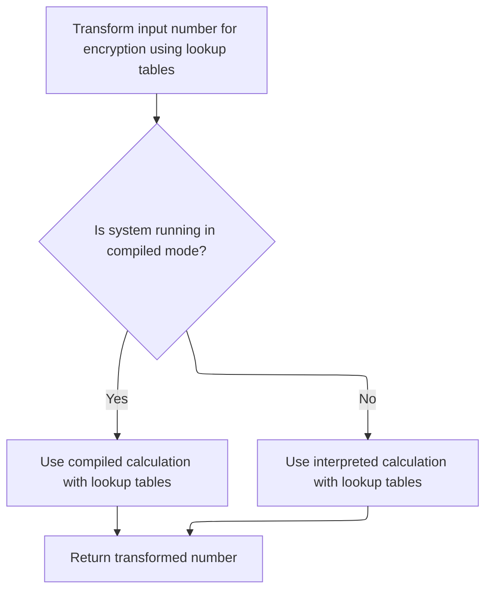

This document explains how a block of data is encrypted by mixing its halves with key material and applying nonlinear transformations using lookup tables. The process receives two halves of a data block as input and outputs the encrypted block.

# Mixing Data Halves with Key Material

<SwmSnippet path="/HotelManagementSystem/Modules/clsBlowfish.cls" line="334">

---

In `EncryptBlock`, we're starting the main encryption loop. Here, each round alternates mixing Xl and Xr with values from m_pBox and the result of f. We call f right after XORing Xl with m_pBox because f is what scrambles the data using the S-boxes, making the transformation non-linear and unpredictable. Without f, the process would just be a series of XORs with key material, which isn't secure.

```apex
Private Static Sub EncryptBlock(Xl As Long, Xr As Long)
    Dim I As Long, j As Long, Temp As Long
    j = 0
    For I = 0 To (Rounds \ 2 - 1)
        Xl = Xl Xor m_pBox(j)
        Xr = Xr Xor f(Xl)
        Xr = Xr Xor m_pBox(j + 1)
        Xl = Xl Xor f(Xr)
```

---

</SwmSnippet>

## Nonlinear Data Transformation with S-Boxes



<SwmSnippet path="/HotelManagementSystem/Modules/clsBlowfish.cls" line="423">

---

In `f`, we're splitting the input into bytes and using those as indices into the S-boxes. The next step is to combine these S-box values with addition and XOR. If we're not running compiled, we use UnsignedAdd to make sure the math matches unsigned 32-bit addition, which is what Blowfish expects. This keeps the output consistent regardless of how VB6 handles integer overflow.

```apex
Private Static Function f(ByVal X As Long) As Long
    Dim xb(0 To 3) As Byte
    Call CopyMem(xb(0), X, 4)
    If (m_RunningCompiled) Then f = (((m_sBox(0, xb(3)) + m_sBox(1, xb(2))) Xor m_sBox(2, xb(1))) + m_sBox(3, xb(0))) Else f = UnsignedAdd((UnsignedAdd(m_sBox(0, xb(3)), m_sBox(1, xb(2))) Xor m_sBox(2, xb(1))), m_sBox(3, xb(0)))
```

---

</SwmSnippet>

<SwmSnippet path="/HotelManagementSystem/Modules/clsBlowfish.cls" line="444">

---

`UnsignedAdd` does the addition one byte at a time with manual carry handling. This avoids VB6's signed integer overflow issues and makes sure the result matches what Blowfish expects for unsigned 32-bit addition.

```apex
Private Static Function UnsignedAdd(ByVal Data1 As Long, Data2 As Long) As Long
    Dim x1(0 To 3) As Byte, x2(0 To 3) As Byte, xx(0 To 3) As Byte, Rest As Long, Value As Long, a As Long
    Call CopyMem(x1(0), Data1, 4)
    Call CopyMem(x2(0), Data2, 4)
    Rest = 0
    For a = 0 To 3
        Value = CLng(x1(a)) + CLng(x2(a)) + Rest
        xx(a) = Value And 255
        Rest = Value \ 256
    Next
    Call CopyMem(UnsignedAdd, xx(0), 4)
End Function
```

---

</SwmSnippet>

<SwmSnippet path="/HotelManagementSystem/Modules/clsBlowfish.cls" line="427">

---

Back in `f`, after returning from UnsignedAdd, we finalize the output value. This guarantees that the function's result is always correct for unsigned 32-bit math, which is critical for Blowfish to work as intended.

```apex
End Function
```

---

</SwmSnippet>

## Finalizing the Encrypted Block

<SwmSnippet path="/HotelManagementSystem/Modules/clsBlowfish.cls" line="342">

---

Back in `EncryptBlock`, after the last call to f, we finish up by swapping the halves and applying the final XORs with m_pBox. This wraps up the block transformation, making sure both halves are fully processed and ready as encrypted output.

```apex
        j = j + 2
    Next
    Temp = Xr
    Xr = Xl Xor m_pBox(Rounds)
    Xl = Temp Xor m_pBox(Rounds + 1)
End Sub
```

---

</SwmSnippet>

&nbsp;

*This is an auto-generated document by Swimm 🌊 and has not yet been verified by a human*

<SwmMeta version="3.0.0" repo-id="Z2l0aHViJTNBJTNBY3RzLVZCNi1Qcm9qZWN0cyUzQSUzQVN3aW1tLURlbW8=" repo-name="cts-VB6-Projects"><sup>Powered by [Swimm](https://app.swimm.io/)</sup></SwmMeta>
