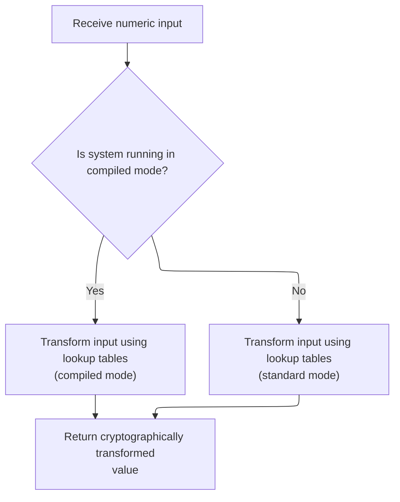

This document describes the process of encrypting a data block by mixing its halves with key material, applying non-linear substitution and addition logic, and finalizing the output with a swap. The flow ensures secure transformation of each block using key-dependent operations.

# Mixing Data Halves with Key Material

<SwmSnippet path="/HotelManagementSystem/Modules/clsBlowfish.cls" line="334">

---

In <SwmToken path="HotelManagementSystem/Modules/clsBlowfish.cls" pos="334:6:6" line-data="Private Static Sub EncryptBlock(Xl As Long, Xr As Long)">`EncryptBlock`</SwmToken>, we start the Feistel rounds by alternating XORs with the P-array and calls to f. Each call to f injects non-linearity and key-dependence into the process The loop structure ensures both halves are processed and mixed before the final swap.

```apex
Private Static Sub EncryptBlock(Xl As Long, Xr As Long)
    Dim I As Long, j As Long, Temp As Long
    j = 0
    For I = 0 To (Rounds \ 2 - 1)
        Xl = Xl Xor m_pBox(j)
        Xr = Xr Xor f(Xl)
        Xr = Xr Xor m_pBox(j + 1)
        Xl = Xl Xor f(Xr)
```

---

</SwmSnippet>

## Non-Linear Substitution and Addition Logic



<SwmSnippet path="/HotelManagementSystem/Modules/clsBlowfish.cls" line="423">

---

In <SwmToken path="HotelManagementSystem/Modules/clsBlowfish.cls" pos="423:6:6" line-data="Private Static Function f(ByVal X As Long) As Long">`f`</SwmToken>, we break the input into bytes and use them for S-box lookups and arithmetic. If we're not running compiled, we call <SwmToken path="HotelManagementSystem/Modules/clsBlowfish.cls" pos="426:75:75" line-data="    If (m_RunningCompiled) Then f = (((m_sBox(0, xb(3)) + m_sBox(1, xb(2))) Xor m_sBox(2, xb(1))) + m_sBox(3, xb(0))) Else f = UnsignedAdd((UnsignedAdd(m_sBox(0, xb(3)), m_sBox(1, xb(2))) Xor m_sBox(2, xb(1))), m_sBox(3, xb(0)))">`UnsignedAdd`</SwmToken> to make sure addition wraps around like unsigned math, so results are consistent no matter how VB6 handles overflows.

```apex
Private Static Function f(ByVal X As Long) As Long
    Dim xb(0 To 3) As Byte
    Call CopyMem(xb(0), X, 4)
    If (m_RunningCompiled) Then f = (((m_sBox(0, xb(3)) + m_sBox(1, xb(2))) Xor m_sBox(2, xb(1))) + m_sBox(3, xb(0))) Else f = UnsignedAdd((UnsignedAdd(m_sBox(0, xb(3)), m_sBox(1, xb(2))) Xor m_sBox(2, xb(1))), m_sBox(3, xb(0)))
```

---

</SwmSnippet>

<SwmSnippet path="/HotelManagementSystem/Modules/clsBlowfish.cls" line="444">

---

<SwmToken path="HotelManagementSystem/Modules/clsBlowfish.cls" pos="444:6:6" line-data="Private Static Function UnsignedAdd(ByVal Data1 As Long, Data2 As Long) As Long">`UnsignedAdd`</SwmToken> does byte-wise addition with manual carry to simulate 32-bit unsigned math, so we don't get weird results from VB6's signed arithmetic. This keeps the encryption logic correct for all possible values.

```apex
Private Static Function UnsignedAdd(ByVal Data1 As Long, Data2 As Long) As Long
    Dim x1(0 To 3) As Byte, x2(0 To 3) As Byte, xx(0 To 3) As Byte, Rest As Long, Value As Long, a As Long
    Call CopyMem(x1(0), Data1, 4)
    Call CopyMem(x2(0), Data2, 4)
    Rest = 0
    For a = 0 To 3
        Value = CLng(x1(a)) + CLng(x2(a)) + Rest
        xx(a) = Value And 255
        Rest = Value \ 256
    Next
    Call CopyMem(UnsignedAdd, xx(0), 4)
End Function
```

---

</SwmSnippet>

<SwmSnippet path="/HotelManagementSystem/Modules/clsBlowfish.cls" line="427">

---

Back in <SwmToken path="HotelManagementSystem/Modules/clsBlowfish.cls" pos="339:9:9" line-data="        Xr = Xr Xor f(Xl)">`f`</SwmToken>, after returning from <SwmToken path="HotelManagementSystem/Modules/clsBlowfish.cls" pos="426:75:75" line-data="    If (m_RunningCompiled) Then f = (((m_sBox(0, xb(3)) + m_sBox(1, xb(2))) Xor m_sBox(2, xb(1))) + m_sBox(3, xb(0))) Else f = UnsignedAdd((UnsignedAdd(m_sBox(0, xb(3)), m_sBox(1, xb(2))) Xor m_sBox(2, xb(1))), m_sBox(3, xb(0)))">`UnsignedAdd`</SwmToken>, we finalize the output value. This ensures the function always returns a 32-bit result with the right overflow behavior, matching Blowfish's requirements.

```apex
End Function
```

---

</SwmSnippet>

## Final Block Swap and Output

<SwmSnippet path="/HotelManagementSystem/Modules/clsBlowfish.cls" line="342">

---

Back in <SwmToken path="HotelManagementSystem/Modules/clsBlowfish.cls" pos="334:6:6" line-data="Private Static Sub EncryptBlock(Xl As Long, Xr As Long)">`EncryptBlock`</SwmToken>, after the last call to f, we do the final swap and XOR with the last P-array values. This step ensures both halves are fully processed and the block is ready as encrypted output.

```apex
        j = j + 2
    Next
    Temp = Xr
    Xr = Xl Xor m_pBox(Rounds)
    Xl = Temp Xor m_pBox(Rounds + 1)
End Sub
```

---

</SwmSnippet>

&nbsp;

*This is an auto-generated document by Swimm 🌊 and has not yet been verified by a human*

<SwmMeta version="3.0.0" repo-id="Z2l0aHViJTNBJTNBY3RzLVZCNi1Qcm9qZWN0cyUzQSUzQVN3aW1tLURlbW8=" repo-name="cts-VB6-Projects"><sup>Powered by [Swimm](https://app.swimm.io/)</sup></SwmMeta>
