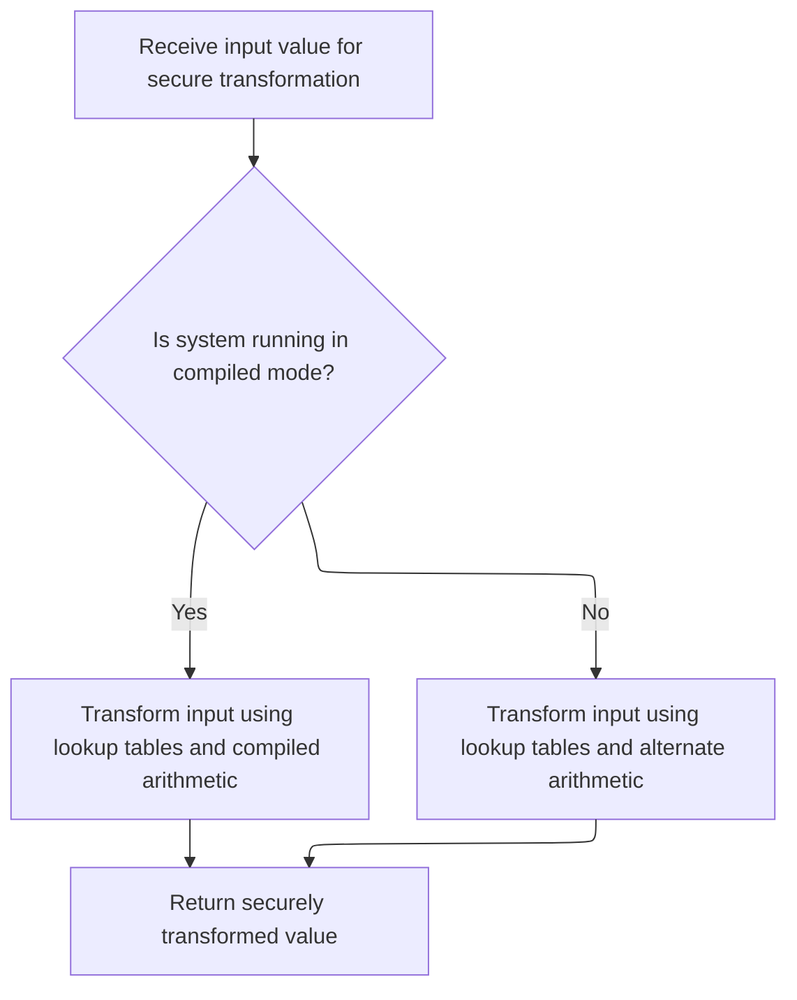

This document describes the flow for encrypting a data block using the Blowfish algorithm. The process ensures sensitive information is securely transformed before storage or transmission. The flow receives a data block as input and returns the encrypted block as output.

# Processing the Data Block with Blowfish Rounds

<SwmSnippet path="/HotelManagementSystem/Modules/clsBlowfish.cls" line="334">

---

In `EncryptBlock`, we're starting the Blowfish encryption rounds. Each iteration alternates XORing with the P-array (m_pBox) and applying the f function to mix the data. We call f right after XORing with m_pBox to introduce non-linearity and diffusion, which is what makes Blowfish secure. The loop structure ensures both halves of the block are processed and mixed before the final swap and whitening steps.

```apex
Private Static Sub EncryptBlock(Xl As Long, Xr As Long)
    Dim I As Long, j As Long, Temp As Long
    j = 0
    For I = 0 To (Rounds \ 2 - 1)
        Xl = Xl Xor m_pBox(j)
        Xr = Xr Xor f(Xl)
        Xr = Xr Xor m_pBox(j + 1)
        Xl = Xl Xor f(Xr)
```

---

</SwmSnippet>

## Mixing Data with S-Box Lookups and Arithmetic



<SwmSnippet path="/HotelManagementSystem/Modules/clsBlowfish.cls" line="423">

---

In `f`, we're splitting the input into bytes and using those to pull values from the S-boxes. The function then combines these values with addition and XOR to mix things up. We call UnsignedAdd to make sure the addition works like unsigned 32-bit math, which is needed for the algorithm to match the Blowfish spec.

```apex
Private Static Function f(ByVal X As Long) As Long
    Dim xb(0 To 3) As Byte
    Call CopyMem(xb(0), X, 4)
    If (m_RunningCompiled) Then f = (((m_sBox(0, xb(3)) + m_sBox(1, xb(2))) Xor m_sBox(2, xb(1))) + m_sBox(3, xb(0))) Else f = UnsignedAdd((UnsignedAdd(m_sBox(0, xb(3)), m_sBox(1, xb(2))) Xor m_sBox(2, xb(1))), m_sBox(3, xb(0)))
```

---

</SwmSnippet>

<SwmSnippet path="/HotelManagementSystem/Modules/clsBlowfish.cls" line="444">

---

`UnsignedAdd` does unsigned 32-bit addition by adding each byte separately and carrying overflows, since VB6 doesn't do unsigned math natively. This keeps the math consistent with how Blowfish expects it.

```apex
Private Static Function UnsignedAdd(ByVal Data1 As Long, Data2 As Long) As Long
    Dim x1(0 To 3) As Byte, x2(0 To 3) As Byte, xx(0 To 3) As Byte, Rest As Long, Value As Long, a As Long
    Call CopyMem(x1(0), Data1, 4)
    Call CopyMem(x2(0), Data2, 4)
    Rest = 0
    For a = 0 To 3
        Value = CLng(x1(a)) + CLng(x2(a)) + Rest
        xx(a) = Value And 255
        Rest = Value \ 256
    Next
    Call CopyMem(UnsignedAdd, xx(0), 4)
End Function
```

---

</SwmSnippet>

<SwmSnippet path="/HotelManagementSystem/Modules/clsBlowfish.cls" line="427">

---

We just got back from `UnsignedAdd`, so `f` now returns the final mixed value. This value is what gets used in the main encryption rounds to mix up the data block.

```apex
End Function
```

---

</SwmSnippet>

## Finalizing the Encrypted Block

<SwmSnippet path="/HotelManagementSystem/Modules/clsBlowfish.cls" line="342">

---

We just got back from `f` in the last round, so now `EncryptBlock` swaps the halves and applies the final whitening steps with the last P-array values. This wraps up the block encryption and gets it ready for output.

```apex
        j = j + 2
    Next
    Temp = Xr
    Xr = Xl Xor m_pBox(Rounds)
    Xl = Temp Xor m_pBox(Rounds + 1)
End Sub
```

---

</SwmSnippet>

&nbsp;

*This is an auto-generated document by Swimm 🌊 and has not yet been verified by a human*

<SwmMeta version="3.0.0" repo-id="Z2l0aHViJTNBJTNBY3RzLVZCNi1Qcm9qZWN0cyUzQSUzQVN3aW1tLURlbW8=" repo-name="cts-VB6-Projects"><sup>Powered by [Swimm](https://app.swimm.io/)</sup></SwmMeta>
