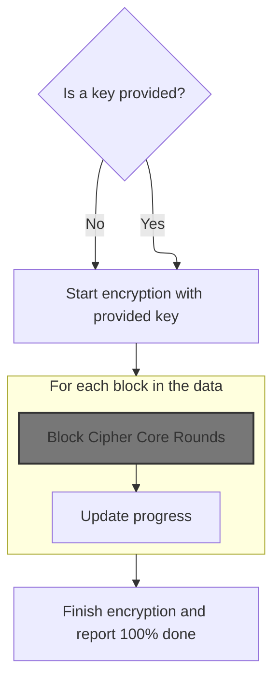
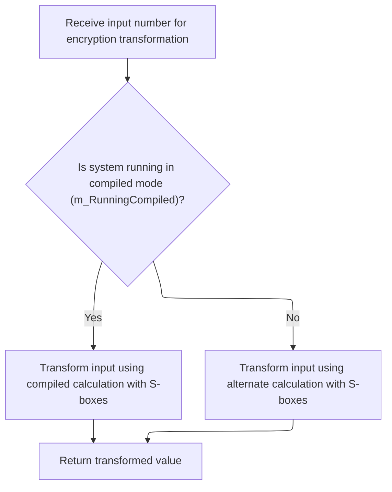

```mermaid
%%{init: {"flowchart": {"defaultRenderer": "elk"}} }%%
flowchart TD
    node1["Receive input string"]
    click node1 openCode "HotelManagementSystem/Modules/clsBlowfish.cls:234:234"
    node1 --> node2{"Is input string empty?"}
    click node2 openCode "HotelManagementSystem/Modules/clsBlowfish.cls:235:235"
    node2 -->|"Yes"| node3["Exit function"]
    click node3 openCode "HotelManagementSystem/Modules/clsBlowfish.cls:235:235"
    node2 -->|"No"| node4["Encode input as Base64 string"]
    click node4 openCode "HotelManagementSystem/Modules/clsBlowfish.cls:237:238"
    node4 --> node5["Return Base64-encoded string"]
    click node5 openCode "HotelManagementSystem/Modules/clsBlowfish.cls:238:239"

classDef HeadingStyle fill:#777777,stroke:#333,stroke-width:2px;

%% Swimm:
%% %%{init: {"flowchart": {"defaultRenderer": "elk"}} }%%
%% flowchart TD
%%     node1["Receive input string"]
%%     click node1 openCode "<SwmPath>[HotelManagementSystem/Modules/clsBlowfish.cls](HotelManagementSystem/Modules/clsBlowfish.cls)</SwmPath>:234:234"
%%     node1 --> node2{"Is input string empty?"}
%%     click node2 openCode "<SwmPath>[HotelManagementSystem/Modules/clsBlowfish.cls](HotelManagementSystem/Modules/clsBlowfish.cls)</SwmPath>:235:235"
%%     node2 -->|"Yes"| node3["Exit function"]
%%     click node3 openCode "<SwmPath>[HotelManagementSystem/Modules/clsBlowfish.cls](HotelManagementSystem/Modules/clsBlowfish.cls)</SwmPath>:235:235"
%%     node2 -->|"No"| node4["Encode input as <SwmToken path="HotelManagementSystem/Modules/clsBlowfish.cls" pos="20:15:15" line-data="&#39; Standard Blowfish implementation with file support, Base64 conversion,">`Base64`</SwmToken> string"]
%%     click node4 openCode "<SwmPath>[HotelManagementSystem/Modules/clsBlowfish.cls](HotelManagementSystem/Modules/clsBlowfish.cls)</SwmPath>:237:238"
%%     node4 --> node5["Return Base64-encoded string"]
%%     click node5 openCode "<SwmPath>[HotelManagementSystem/Modules/clsBlowfish.cls](HotelManagementSystem/Modules/clsBlowfish.cls)</SwmPath>:238:239"
%% 
%% classDef HeadingStyle fill:#777777,stroke:#333,stroke-width:2px;
```

```mermaid
%%{init: {"flowchart": {"defaultRenderer": "elk"}} }%%
flowchart TD
    node1{"Is Base64 table initialized?"}
    click node1 openCode "HotelManagementSystem/Modules/clsBlowfish.cls:244:244"
    node1 -->|"No"| node2["Initialize Base64 table"]
    click node2 openCode "HotelManagementSystem/Modules/clsBlowfish.cls:56:185"
    node1 -->|"Yes"| node3["Prepare output buffer based on input size"]
    click node3 openCode "HotelManagementSystem/Modules/clsBlowfish.cls:252:256"
    node2 --> node3
    
    subgraph loop1["For each group of 3 bytes in input"]
        node3 --> node4["Convert 3 bytes to 4 Base64 characters"]
        click node4 openCode "HotelManagementSystem/Modules/clsBlowfish.cls:260:266"
    end
    node4 --> node5["Handle remaining bytes and add padding"]
    click node5 openCode "HotelManagementSystem/Modules/clsBlowfish.cls:268:284"
    node5 --> node6{"Is encoded output within max line length (k_lMaxBytesPerLine)?"}
    click node6 openCode "HotelManagementSystem/Modules/clsBlowfish.cls:288:312"
    node6 -->|"Yes"| node7["Return encoded string"]
    click node7 openCode "HotelManagementSystem/Modules/clsBlowfish.cls:289:290"
    node6 -->|"No"| node8["Split output into lines with breaks"]
    click node8 openCode "HotelManagementSystem/Modules/clsBlowfish.cls:291:311"
    
    subgraph loop2["For each line-sized chunk"]
        node8 --> node9["Copy chunk and add line break"]
        click node9 openCode "HotelManagementSystem/Modules/clsBlowfish.cls:301:307"
    end
    node9 --> node10["Return encoded string"]
    click node10 openCode "HotelManagementSystem/Modules/clsBlowfish.cls:311:311"
classDef HeadingStyle fill:#777777,stroke:#333,stroke-width:2px;

%% Swimm:
%% %%{init: {"flowchart": {"defaultRenderer": "elk"}} }%%
%% flowchart TD
%%     node1{"Is <SwmToken path="HotelManagementSystem/Modules/clsBlowfish.cls" pos="20:15:15" line-data="&#39; Standard Blowfish implementation with file support, Base64 conversion,">`Base64`</SwmToken> table initialized?"}
%%     click node1 openCode "<SwmPath>[HotelManagementSystem/Modules/clsBlowfish.cls](HotelManagementSystem/Modules/clsBlowfish.cls)</SwmPath>:244:244"
%%     node1 -->|"No"| node2["Initialize <SwmToken path="HotelManagementSystem/Modules/clsBlowfish.cls" pos="20:15:15" line-data="&#39; Standard Blowfish implementation with file support, Base64 conversion,">`Base64`</SwmToken> table"]
%%     click node2 openCode "<SwmPath>[HotelManagementSystem/Modules/clsBlowfish.cls](HotelManagementSystem/Modules/clsBlowfish.cls)</SwmPath>:56:185"
%%     node1 -->|"Yes"| node3["Prepare output buffer based on input size"]
%%     click node3 openCode "<SwmPath>[HotelManagementSystem/Modules/clsBlowfish.cls](HotelManagementSystem/Modules/clsBlowfish.cls)</SwmPath>:252:256"
%%     node2 --> node3
%%     
%%     subgraph loop1["For each group of 3 bytes in input"]
%%         node3 --> node4["Convert 3 bytes to 4 <SwmToken path="HotelManagementSystem/Modules/clsBlowfish.cls" pos="20:15:15" line-data="&#39; Standard Blowfish implementation with file support, Base64 conversion,">`Base64`</SwmToken> characters"]
%%         click node4 openCode "<SwmPath>[HotelManagementSystem/Modules/clsBlowfish.cls](HotelManagementSystem/Modules/clsBlowfish.cls)</SwmPath>:260:266"
%%     end
%%     node4 --> node5["Handle remaining bytes and add padding"]
%%     click node5 openCode "<SwmPath>[HotelManagementSystem/Modules/clsBlowfish.cls](HotelManagementSystem/Modules/clsBlowfish.cls)</SwmPath>:268:284"
%%     node5 --> node6{"Is encoded output within max line length (<SwmToken path="HotelManagementSystem/Modules/clsBlowfish.cls" pos="288:7:7" line-data="    If lWorkspaceCounter &lt;= k_lMaxBytesPerLine Then">`k_lMaxBytesPerLine`</SwmToken>)?"}
%%     click node6 openCode "<SwmPath>[HotelManagementSystem/Modules/clsBlowfish.cls](HotelManagementSystem/Modules/clsBlowfish.cls)</SwmPath>:288:312"
%%     node6 -->|"Yes"| node7["Return encoded string"]
%%     click node7 openCode "<SwmPath>[HotelManagementSystem/Modules/clsBlowfish.cls](HotelManagementSystem/Modules/clsBlowfish.cls)</SwmPath>:289:290"
%%     node6 -->|"No"| node8["Split output into lines with breaks"]
%%     click node8 openCode "<SwmPath>[HotelManagementSystem/Modules/clsBlowfish.cls](HotelManagementSystem/Modules/clsBlowfish.cls)</SwmPath>:291:311"
%%     
%%     subgraph loop2["For each line-sized chunk"]
%%         node8 --> node9["Copy chunk and add line break"]
%%         click node9 openCode "<SwmPath>[HotelManagementSystem/Modules/clsBlowfish.cls](HotelManagementSystem/Modules/clsBlowfish.cls)</SwmPath>:301:307"
%%     end
%%     node9 --> node10["Return encoded string"]
%%     click node10 openCode "<SwmPath>[HotelManagementSystem/Modules/clsBlowfish.cls](HotelManagementSystem/Modules/clsBlowfish.cls)</SwmPath>:311:311"
%% classDef HeadingStyle fill:#777777,stroke:#333,stroke-width:2px;
```

This document outlines how a plain text string is securely encrypted and optionally encoded for safe storage or transmission. The process includes encryption, progress reporting, and optional <SwmToken path="HotelManagementSystem/Modules/clsBlowfish.cls" pos="20:15:15" line-data="&#39; Standard Blowfish implementation with file support, Base64 conversion,">`Base64`</SwmToken> encoding to ensure compatibility with text-based systems.



```mermaid
flowchart TD
  node1["String to Encrypted Bytes"]:::HeadingStyle
  click node1 goToHeading "String to Encrypted Bytes"
  node1 --> node2{"Is encryption key provided?
(Preparing and Encrypting Byte Blocks)"}:::HeadingStyle
  click node2 goToHeading "Preparing and Encrypting Byte Blocks"
  node2 -->|"Yes/No"| node3["Writing Encrypted Data and Progress"]:::HeadingStyle
  click node3 goToHeading "Writing Encrypted Data and Progress"
  node3 --> node4{"Should output be Base64 encoded?
(Encoding and Cleanup)"}:::HeadingStyle
  click node4 goToHeading "Encoding and Cleanup"
  node4 -->|"Yes"| node5["Encode in Base64 and return result
(Encoding and Cleanup)"]:::HeadingStyle
  click node5 goToHeading "Encoding and Cleanup"
  node4 -->|"No"| node6["Return encrypted string
(Encoding and Cleanup)"]:::HeadingStyle
  click node6 goToHeading "Encoding and Cleanup"
classDef HeadingStyle fill:#777777,stroke:#333,stroke-width:2px;

%% Swimm:
%% flowchart TD
%%   node1["String to Encrypted Bytes"]:::HeadingStyle
%%   click node1 goToHeading "String to Encrypted Bytes"
%%   node1 --> node2{"Is encryption key provided?
%% (Preparing and Encrypting Byte Blocks)"}:::HeadingStyle
%%   click node2 goToHeading "Preparing and Encrypting Byte Blocks"
%%   node2 -->|"Yes/No"| node3["Writing Encrypted Data and Progress"]:::HeadingStyle
%%   click node3 goToHeading "Writing Encrypted Data and Progress"
%%   node3 --> node4{"Should output be <SwmToken path="HotelManagementSystem/Modules/clsBlowfish.cls" pos="20:15:15" line-data="&#39; Standard Blowfish implementation with file support, Base64 conversion,">`Base64`</SwmToken> encoded?
%% (Encoding and Cleanup)"}:::HeadingStyle
%%   click node4 goToHeading "Encoding and Cleanup"
%%   node4 -->|"Yes"| node5["Encode in <SwmToken path="HotelManagementSystem/Modules/clsBlowfish.cls" pos="20:15:15" line-data="&#39; Standard Blowfish implementation with file support, Base64 conversion,">`Base64`</SwmToken> and return result
%% (Encoding and Cleanup)"]:::HeadingStyle
%%   click node5 goToHeading "Encoding and Cleanup"
%%   node4 -->|"No"| node6["Return encrypted string
%% (Encoding and Cleanup)"]:::HeadingStyle
%%   click node6 goToHeading "Encoding and Cleanup"
%% classDef HeadingStyle fill:#777777,stroke:#333,stroke-width:2px;
```

# String to Encrypted Bytes

<SwmSnippet path="/HotelManagementSystem/Modules/clsBlowfish.cls" line="378">

---

In <SwmToken path="HotelManagementSystem/Modules/clsBlowfish.cls" pos="378:4:4" line-data="Public Function EncryptString(Text As String, Optional Key As String, Optional OutputIn64 As Boolean) As String">`EncryptString`</SwmToken>, we start by converting the input string into a byte array so it can be processed by the encryption logic. Next, <SwmToken path="HotelManagementSystem/Modules/clsBlowfish.cls" pos="381:3:3" line-data="    Call EncryptByte(byteArray(), Key)">`EncryptByte`</SwmToken> is called to actually perform the encryption on this byte array, since the encryption algorithm works at the byte level, not directly on strings.

```apex
Public Function EncryptString(Text As String, Optional Key As String, Optional OutputIn64 As Boolean) As String
    Dim byteArray() As Byte
    byteArray() = StrConv(Text, vbFromUnicode)
    Call EncryptByte(byteArray(), Key)
    EncryptString = StrConv(byteArray(), vbUnicode)
```

---

</SwmSnippet>

## Preparing and Encrypting Byte Blocks



<SwmSnippet path="/HotelManagementSystem/Modules/clsBlowfish.cls" line="348">

---

In <SwmToken path="HotelManagementSystem/Modules/clsBlowfish.cls" pos="348:4:4" line-data="Public Sub EncryptByte(byteArray() As Byte, Optional Key As String)">`EncryptByte`</SwmToken>, we set up the byte array for encryption by padding it, storing the original length, and adding random values for initialization. We then process the array in 8-byte blocks. <SwmToken path="HotelManagementSystem/Modules/clsBlowfish.cls" pos="361:3:3" line-data="        Call GetWord(LeftWord, byteArray(), Offset)">`GetWord`</SwmToken> is called next to extract 4-byte words from the byte array, which are needed for the block cipher operations.

```apex
Public Sub EncryptByte(byteArray() As Byte, Optional Key As String)
    Dim Offset As Long, OrigLen As Long, LeftWord As Long, RightWord As Long, CipherLen As Long, CipherLeft As Long, CipherRight As Long, CurrPercent As Long, NextPercent As Long
    If (Len(Key) > 0) Then Me.Key = Key
    OrigLen = UBound(byteArray) + 1
    CipherLen = OrigLen + 12
    If (CipherLen Mod 8 <> 0) Then CipherLen = CipherLen + 8 - (CipherLen Mod 8)
    ReDim Preserve byteArray(CipherLen - 1)
    Call CopyMem(byteArray(12), byteArray(0), OrigLen)
    Call CopyMem(byteArray(8), OrigLen, 4)
    Call Randomize
    Call CopyMem(byteArray(0), CLng(2147483647 * Rnd), 4)
    Call CopyMem(byteArray(4), CLng(2147483647 * Rnd), 4)
    For Offset = 0 To (CipherLen - 1) Step 8
        Call GetWord(LeftWord, byteArray(), Offset)
        Call GetWord(RightWord, byteArray(), Offset + 4)
        LeftWord = LeftWord Xor CipherLeft
        RightWord = RightWord Xor CipherRight
```

---

</SwmSnippet>

<SwmSnippet path="/HotelManagementSystem/Modules/clsBlowfish.cls" line="428">

---

<SwmToken path="HotelManagementSystem/Modules/clsBlowfish.cls" pos="428:6:6" line-data="Private Static Sub GetWord(LongValue As Long, CryptBuffer() As Byte, Offset As Long)">`GetWord`</SwmToken> pulls out 4 bytes from the byte array at the given offset, reverses their order, and combines them into a Long. This handles the endianness needed for the encryption logic.

```apex
Private Static Sub GetWord(LongValue As Long, CryptBuffer() As Byte, Offset As Long)
    Dim bb(0 To 3) As Byte
    bb(3) = CryptBuffer(Offset)
    bb(2) = CryptBuffer(Offset + 1)
    bb(1) = CryptBuffer(Offset + 2)
    bb(0) = CryptBuffer(Offset + 3)
    Call CopyMem(LongValue, bb(0), 4)
End Sub
```

---

</SwmSnippet>

<SwmSnippet path="/HotelManagementSystem/Modules/clsBlowfish.cls" line="365">

---

Back in <SwmToken path="HotelManagementSystem/Modules/clsBlowfish.cls" pos="348:4:4" line-data="Public Sub EncryptByte(byteArray() As Byte, Optional Key As String)">`EncryptByte`</SwmToken>, after pulling out and XORing the block words, we call <SwmToken path="HotelManagementSystem/Modules/clsBlowfish.cls" pos="365:3:3" line-data="        Call EncryptBlock(LeftWord, RightWord)">`EncryptBlock`</SwmToken> to run the core Blowfish encryption on this 8-byte chunk.

```apex
        Call EncryptBlock(LeftWord, RightWord)
        Call PutWord(LeftWord, byteArray(), Offset)
```

---

</SwmSnippet>

### Block Cipher Core Rounds

<SwmSnippet path="/HotelManagementSystem/Modules/clsBlowfish.cls" line="334">

---

<SwmToken path="HotelManagementSystem/Modules/clsBlowfish.cls" pos="334:6:6" line-data="Private Static Sub EncryptBlock(Xl As Long, Xr As Long)">`EncryptBlock`</SwmToken> runs the Feistel rounds, alternating transformations on the two halves of the block. The f function is called to mix the data using the S-boxes, which is key for the block cipher's security.

```apex
Private Static Sub EncryptBlock(Xl As Long, Xr As Long)
    Dim I As Long, j As Long, Temp As Long
    j = 0
    For I = 0 To (Rounds \ 2 - 1)
        Xl = Xl Xor m_pBox(j)
        Xr = Xr Xor f(Xl)
        Xr = Xr Xor m_pBox(j + 1)
        Xl = Xl Xor f(Xr)
        j = j + 2
    Next
    Temp = Xr
    Xr = Xl Xor m_pBox(Rounds)
    Xl = Temp Xor m_pBox(Rounds + 1)
End Sub
```

---

</SwmSnippet>

### S-Box Mixing and Arithmetic



<SwmSnippet path="/HotelManagementSystem/Modules/clsBlowfish.cls" line="423">

---

<SwmToken path="HotelManagementSystem/Modules/clsBlowfish.cls" pos="423:6:6" line-data="Private Static Function f(ByVal X As Long) As Long">`f`</SwmToken> splits the input into 4 bytes, does S-box lookups and arithmetic, and uses <SwmToken path="HotelManagementSystem/Modules/clsBlowfish.cls" pos="426:75:75" line-data="    If (m_RunningCompiled) Then f = (((m_sBox(0, xb(3)) + m_sBox(1, xb(2))) Xor m_sBox(2, xb(1))) + m_sBox(3, xb(0))) Else f = UnsignedAdd((UnsignedAdd(m_sBox(0, xb(3)), m_sBox(1, xb(2))) Xor m_sBox(2, xb(1))), m_sBox(3, xb(0)))">`UnsignedAdd`</SwmToken> when not running compiled to avoid signed overflow issues. This is the core mixing step for each round.

```apex
Private Static Function f(ByVal X As Long) As Long
    Dim xb(0 To 3) As Byte
    Call CopyMem(xb(0), X, 4)
    If (m_RunningCompiled) Then f = (((m_sBox(0, xb(3)) + m_sBox(1, xb(2))) Xor m_sBox(2, xb(1))) + m_sBox(3, xb(0))) Else f = UnsignedAdd((UnsignedAdd(m_sBox(0, xb(3)), m_sBox(1, xb(2))) Xor m_sBox(2, xb(1))), m_sBox(3, xb(0)))
End Function
```

---

</SwmSnippet>

<SwmSnippet path="/HotelManagementSystem/Modules/clsBlowfish.cls" line="444">

---

<SwmToken path="HotelManagementSystem/Modules/clsBlowfish.cls" pos="444:6:6" line-data="Private Static Function UnsignedAdd(ByVal Data1 As Long, Data2 As Long) As Long">`UnsignedAdd`</SwmToken> adds two 32-bit values byte by byte, carrying overflow, to simulate unsigned addition since VB6 doesn't support it natively.

```apex
Private Static Function UnsignedAdd(ByVal Data1 As Long, Data2 As Long) As Long
    Dim x1(0 To 3) As Byte, x2(0 To 3) As Byte, xx(0 To 3) As Byte, Rest As Long, Value As Long, a As Long
    Call CopyMem(x1(0), Data1, 4)
    Call CopyMem(x2(0), Data2, 4)
    Rest = 0
    For a = 0 To 3
        Value = CLng(x1(a)) + CLng(x2(a)) + Rest
        xx(a) = Value And 255
        Rest = Value \ 256
    Next
    Call CopyMem(UnsignedAdd, xx(0), 4)
End Function
```

---

</SwmSnippet>

### Writing Encrypted Data and Progress

```mermaid
%%{init: {"flowchart": {"defaultRenderer": "elk"}} }%%
flowchart TD
    node1["Start encryption process"]
    click node1 openCode "HotelManagementSystem/Modules/clsBlowfish.cls:367:367"
    subgraph loop1["For each data segment"]
        node1 --> node2["Encrypt data segment"]
        click node2 openCode "HotelManagementSystem/Modules/clsBlowfish.cls:367:368"
        node2 --> node3{"At next progress threshold?"}
        click node3 openCode "HotelManagementSystem/Modules/clsBlowfish.cls:370:372"
        node3 -->|"Yes"| node4["Report progress to user"]
        click node4 openCode "HotelManagementSystem/Modules/clsBlowfish.cls:373:373"
        node4 --> node5["Next segment"]
        node3 -->|"No"| node5["Next segment"]
    end
    loop1 --> node6{"Is progress 100%?"}
    click node6 openCode "HotelManagementSystem/Modules/clsBlowfish.cls:376:376"
    node6 -->|"No"| node7["Finish"]
    node6 -->|"Yes"| node8["Report 100% completion"]
    click node8 openCode "HotelManagementSystem/Modules/clsBlowfish.cls:376:376"
    node8 --> node7["Finish"]
classDef HeadingStyle fill:#777777,stroke:#333,stroke-width:2px;

%% Swimm:
%% %%{init: {"flowchart": {"defaultRenderer": "elk"}} }%%
%% flowchart TD
%%     node1["Start encryption process"]
%%     click node1 openCode "<SwmPath>[HotelManagementSystem/Modules/clsBlowfish.cls](HotelManagementSystem/Modules/clsBlowfish.cls)</SwmPath>:367:367"
%%     subgraph loop1["For each data segment"]
%%         node1 --> node2["Encrypt data segment"]
%%         click node2 openCode "<SwmPath>[HotelManagementSystem/Modules/clsBlowfish.cls](HotelManagementSystem/Modules/clsBlowfish.cls)</SwmPath>:367:368"
%%         node2 --> node3{"At next progress threshold?"}
%%         click node3 openCode "<SwmPath>[HotelManagementSystem/Modules/clsBlowfish.cls](HotelManagementSystem/Modules/clsBlowfish.cls)</SwmPath>:370:372"
%%         node3 -->|"Yes"| node4["Report progress to user"]
%%         click node4 openCode "<SwmPath>[HotelManagementSystem/Modules/clsBlowfish.cls](HotelManagementSystem/Modules/clsBlowfish.cls)</SwmPath>:373:373"
%%         node4 --> node5["Next segment"]
%%         node3 -->|"No"| node5["Next segment"]
%%     end
%%     loop1 --> node6{"Is progress 100%?"}
%%     click node6 openCode "<SwmPath>[HotelManagementSystem/Modules/clsBlowfish.cls](HotelManagementSystem/Modules/clsBlowfish.cls)</SwmPath>:376:376"
%%     node6 -->|"No"| node7["Finish"]
%%     node6 -->|"Yes"| node8["Report 100% completion"]
%%     click node8 openCode "<SwmPath>[HotelManagementSystem/Modules/clsBlowfish.cls](HotelManagementSystem/Modules/clsBlowfish.cls)</SwmPath>:376:376"
%%     node8 --> node7["Finish"]
%% classDef HeadingStyle fill:#777777,stroke:#333,stroke-width:2px;
```



<SwmSnippet path="/HotelManagementSystem/Modules/clsBlowfish.cls" line="367">

---

Back in <SwmToken path="HotelManagementSystem/Modules/clsBlowfish.cls" pos="348:4:4" line-data="Public Sub EncryptByte(byteArray() As Byte, Optional Key As String)">`EncryptByte`</SwmToken>, after <SwmToken path="HotelManagementSystem/Modules/clsBlowfish.cls" pos="334:6:6" line-data="Private Static Sub EncryptBlock(Xl As Long, Xr As Long)">`EncryptBlock`</SwmToken>, we write the encrypted words back into the byte array with <SwmToken path="HotelManagementSystem/Modules/clsBlowfish.cls" pos="367:3:3" line-data="        Call PutWord(RightWord, byteArray(), Offset + 4)">`PutWord`</SwmToken>. This updates the array with the encrypted data. Progress events are raised to signal how far along the encryption is.

```apex
        Call PutWord(RightWord, byteArray(), Offset + 4)
        CipherLeft = LeftWord
        CipherRight = RightWord
        If (Offset >= NextPercent) Then
            CurrPercent = Int((Offset / CipherLen) * 100)
            NextPercent = (CipherLen * ((CurrPercent + 1) / 100)) + 1
            RaiseEvent Progress(CurrPercent)
        End If
    Next
    If (CurrPercent <> 100) Then RaiseEvent Progress(100)
End Sub
```

---

</SwmSnippet>

<SwmSnippet path="/HotelManagementSystem/Modules/clsBlowfish.cls" line="436">

---

<SwmToken path="HotelManagementSystem/Modules/clsBlowfish.cls" pos="436:6:6" line-data="Private Static Sub PutWord(LongValue As Long, CryptBuffer() As Byte, Offset As Long)">`PutWord`</SwmToken> takes the Long value, splits it into bytes, reverses the order, and writes them back to the byte array at the given offset. This keeps the byte order consistent for the encryption format.

```apex
Private Static Sub PutWord(LongValue As Long, CryptBuffer() As Byte, Offset As Long)
    Dim bb(0 To 3) As Byte
    Call CopyMem(bb(0), LongValue, 4)
    CryptBuffer(Offset) = bb(3)
    CryptBuffer(Offset + 1) = bb(2)
    CryptBuffer(Offset + 2) = bb(1)
    CryptBuffer(Offset + 3) = bb(0)
End Sub
```

---

</SwmSnippet>

## Encoding and Cleanup

```mermaid
%%{init: {"flowchart": {"defaultRenderer": "elk"}} }%%
flowchart TD
    node1["String is encrypted"] --> node2{"Should output be Base64 encoded? (OutputIn64)"}
    click node1 openCode "HotelManagementSystem/Modules/clsBlowfish.cls:383:383"
    node2 -->|"Yes"| node3["Encode encrypted string in Base64"]
    click node2 openCode "HotelManagementSystem/Modules/clsBlowfish.cls:383:383"
    node2 -->|"No"| node4["Return encrypted string as-is"]
    click node3 openCode "HotelManagementSystem/Modules/clsBlowfish.cls:383:383"
    click node4 openCode "HotelManagementSystem/Modules/clsBlowfish.cls:383:383"
    node3 --> node5["Return result"]
    node4 --> node5["Return result"]
    click node5 openCode "HotelManagementSystem/Modules/clsBlowfish.cls:383:385"
classDef HeadingStyle fill:#777777,stroke:#333,stroke-width:2px;

%% Swimm:
%% %%{init: {"flowchart": {"defaultRenderer": "elk"}} }%%
%% flowchart TD
%%     node1["String is encrypted"] --> node2{"Should output be <SwmToken path="HotelManagementSystem/Modules/clsBlowfish.cls" pos="20:15:15" line-data="&#39; Standard Blowfish implementation with file support, Base64 conversion,">`Base64`</SwmToken> encoded? (<SwmToken path="HotelManagementSystem/Modules/clsBlowfish.cls" pos="378:24:24" line-data="Public Function EncryptString(Text As String, Optional Key As String, Optional OutputIn64 As Boolean) As String">`OutputIn64`</SwmToken>)"}
%%     click node1 openCode "<SwmPath>[HotelManagementSystem/Modules/clsBlowfish.cls](HotelManagementSystem/Modules/clsBlowfish.cls)</SwmPath>:383:383"
%%     node2 -->|"Yes"| node3["Encode encrypted string in <SwmToken path="HotelManagementSystem/Modules/clsBlowfish.cls" pos="20:15:15" line-data="&#39; Standard Blowfish implementation with file support, Base64 conversion,">`Base64`</SwmToken>"]
%%     click node2 openCode "<SwmPath>[HotelManagementSystem/Modules/clsBlowfish.cls](HotelManagementSystem/Modules/clsBlowfish.cls)</SwmPath>:383:383"
%%     node2 -->|"No"| node4["Return encrypted string as-is"]
%%     click node3 openCode "<SwmPath>[HotelManagementSystem/Modules/clsBlowfish.cls](HotelManagementSystem/Modules/clsBlowfish.cls)</SwmPath>:383:383"
%%     click node4 openCode "<SwmPath>[HotelManagementSystem/Modules/clsBlowfish.cls](HotelManagementSystem/Modules/clsBlowfish.cls)</SwmPath>:383:383"
%%     node3 --> node5["Return result"]
%%     node4 --> node5["Return result"]
%%     click node5 openCode "<SwmPath>[HotelManagementSystem/Modules/clsBlowfish.cls](HotelManagementSystem/Modules/clsBlowfish.cls)</SwmPath>:383:385"
%% classDef HeadingStyle fill:#777777,stroke:#333,stroke-width:2px;
```



<SwmSnippet path="/HotelManagementSystem/Modules/clsBlowfish.cls" line="383">

---

Back in <SwmToken path="HotelManagementSystem/Modules/clsBlowfish.cls" pos="383:11:11" line-data="    If OutputIn64 = True Then EncryptString = Encode64(EncryptString)">`EncryptString`</SwmToken>, after <SwmToken path="HotelManagementSystem/Modules/clsBlowfish.cls" pos="348:4:4" line-data="Public Sub EncryptByte(byteArray() As Byte, Optional Key As String)">`EncryptByte`</SwmToken>, we optionally encode the result in <SwmToken path="HotelManagementSystem/Modules/clsBlowfish.cls" pos="20:15:15" line-data="&#39; Standard Blowfish implementation with file support, Base64 conversion,">`Base64`</SwmToken> if <SwmToken path="HotelManagementSystem/Modules/clsBlowfish.cls" pos="383:3:3" line-data="    If OutputIn64 = True Then EncryptString = Encode64(EncryptString)">`OutputIn64`</SwmToken> is set. This makes the encrypted output safe for text-based systems. Finally, we clear sensitive data from memory.

```apex
    If OutputIn64 = True Then EncryptString = Encode64(EncryptString)
    Erase byteArray(): Key = "": Text = ""
End Function
```

---

</SwmSnippet>

# String to <SwmToken path="HotelManagementSystem/Modules/clsBlowfish.cls" pos="20:15:15" line-data="&#39; Standard Blowfish implementation with file support, Base64 conversion,">`Base64`</SwmToken> Conversion



<SwmSnippet path="/HotelManagementSystem/Modules/clsBlowfish.cls" line="234">

---

<SwmToken path="HotelManagementSystem/Modules/clsBlowfish.cls" pos="234:4:4" line-data="Public Function Encode64(ByRef sInput As String) As String">`Encode64`</SwmToken> checks for empty input, converts the string to bytes, then calls <SwmToken path="HotelManagementSystem/Modules/clsBlowfish.cls" pos="238:5:5" line-data="    Encode64 = EncodeArray64(bytTemp)">`EncodeArray64`</SwmToken> to do the actual <SwmToken path="HotelManagementSystem/Modules/clsBlowfish.cls" pos="20:15:15" line-data="&#39; Standard Blowfish implementation with file support, Base64 conversion,">`Base64`</SwmToken> encoding.

```apex
Public Function Encode64(ByRef sInput As String) As String
    If sInput = "" Then Exit Function
    Dim bytTemp() As Byte
    bytTemp = StrConv(sInput, vbFromUnicode)
    Encode64 = EncodeArray64(bytTemp)
End Function
```

---

</SwmSnippet>

# Byte Array to <SwmToken path="HotelManagementSystem/Modules/clsBlowfish.cls" pos="20:15:15" line-data="&#39; Standard Blowfish implementation with file support, Base64 conversion,">`Base64`</SwmToken> and Table Setup



<SwmSnippet path="/HotelManagementSystem/Modules/clsBlowfish.cls" line="241">

---

<SwmToken path="HotelManagementSystem/Modules/clsBlowfish.cls" pos="241:4:4" line-data="Public Function EncodeArray64(ByRef bytInput() As Byte) As String">`EncodeArray64`</SwmToken> checks if the encoding tables are set up, and calls <SwmToken path="HotelManagementSystem/Modules/clsBlowfish.cls" pos="244:14:14" line-data="    If m_bytReverseIndex(47) &lt;&gt; 63 Then Initialize64">`Initialize64`</SwmToken> if not. Then it encodes the byte array to <SwmToken path="HotelManagementSystem/Modules/clsBlowfish.cls" pos="20:15:15" line-data="&#39; Standard Blowfish implementation with file support, Base64 conversion,">`Base64`</SwmToken>, handling padding and line breaks as needed.

```apex
Public Function EncodeArray64(ByRef bytInput() As Byte) As String
    On Error GoTo ErrorHandler
    
    If m_bytReverseIndex(47) <> 63 Then Initialize64
    Dim bytWorkspace() As Byte, bytResult() As Byte
    Dim bytCrLf(0 To 3) As Byte, lCounter As Long
    Dim lWorkspaceCounter As Long, lLineCounter As Long
    Dim lCompleteLines As Long, lBytesRemaining As Long
    Dim lpWorkSpace As Long, lpResult As Long
    Dim lpCrLf As Long

    If UBound(bytInput) < 1024 Then
        ReDim bytWorkspace(LBound(bytInput) To (LBound(bytInput) + 4096)) As Byte
    Else
        ReDim bytWorkspace(LBound(bytInput) To (UBound(bytInput) * 4)) As Byte
    End If

    lWorkspaceCounter = LBound(bytWorkspace)

    For lCounter = LBound(bytInput) To (UBound(bytInput) - ((UBound(bytInput) Mod 3) + 3)) Step 3
        bytWorkspace(lWorkspaceCounter) = m_bytIndex((bytInput(lCounter) \ k_bytShift2))
        bytWorkspace(lWorkspaceCounter + 2) = m_bytIndex(((bytInput(lCounter) And k_bytMask1) * k_bytShift4) + ((bytInput(lCounter + 1)) \ k_bytShift4))
        bytWorkspace(lWorkspaceCounter + 4) = m_bytIndex(((bytInput(lCounter + 1) And k_bytMask2) * k_bytShift2) + (bytInput(lCounter + 2) \ k_bytShift6))
        bytWorkspace(lWorkspaceCounter + 6) = m_bytIndex(bytInput(lCounter + 2) And k_bytMask3)
        lWorkspaceCounter = lWorkspaceCounter + 8
    Next lCounter

    Select Case (UBound(bytInput) Mod 3):
        Case 0:
            bytWorkspace(lWorkspaceCounter) = m_bytIndex((bytInput(lCounter) \ k_bytShift2))
            bytWorkspace(lWorkspaceCounter + 2) = m_bytIndex((bytInput(lCounter) And k_bytMask1) * k_bytShift4)
            bytWorkspace(lWorkspaceCounter + 4) = k_bytEqualSign
            bytWorkspace(lWorkspaceCounter + 6) = k_bytEqualSign
        Case 1:
            bytWorkspace(lWorkspaceCounter) = m_bytIndex((bytInput(lCounter) \ k_bytShift2))
            bytWorkspace(lWorkspaceCounter + 2) = m_bytIndex(((bytInput(lCounter) And k_bytMask1) * k_bytShift4) + ((bytInput(lCounter + 1)) \ k_bytShift4))
            bytWorkspace(lWorkspaceCounter + 4) = m_bytIndex((bytInput(lCounter + 1) And k_bytMask2) * k_bytShift2)
            bytWorkspace(lWorkspaceCounter + 6) = k_bytEqualSign
        Case 2:
            bytWorkspace(lWorkspaceCounter) = m_bytIndex((bytInput(lCounter) \ k_bytShift2))
            bytWorkspace(lWorkspaceCounter + 2) = m_bytIndex(((bytInput(lCounter) And k_bytMask1) * k_bytShift4) + ((bytInput(lCounter + 1)) \ k_bytShift4))
            bytWorkspace(lWorkspaceCounter + 4) = m_bytIndex(((bytInput(lCounter + 1) And k_bytMask2) * k_bytShift2) + ((bytInput(lCounter + 2)) \ k_bytShift6))
            bytWorkspace(lWorkspaceCounter + 6) = m_bytIndex(bytInput(lCounter + 2) And k_bytMask3)
    End Select

    lWorkspaceCounter = lWorkspaceCounter + 8

    If lWorkspaceCounter <= k_lMaxBytesPerLine Then
        EncodeArray64 = Left$(bytWorkspace, InStr(1, bytWorkspace, Chr$(0)) - 1)
    Else
        bytCrLf(0) = 13
        bytCrLf(1) = 0
        bytCrLf(2) = 10
        bytCrLf(3) = 0
        ReDim bytResult(LBound(bytWorkspace) To UBound(bytWorkspace))
        lpWorkSpace = VarPtr(bytWorkspace(LBound(bytWorkspace)))
        lpResult = VarPtr(bytResult(LBound(bytResult)))
        lpCrLf = VarPtr(bytCrLf(LBound(bytCrLf)))
        lCompleteLines = Fix(lWorkspaceCounter / k_lMaxBytesPerLine)
        
        For lLineCounter = 0 To lCompleteLines
            CopyMemory lpResult, lpWorkSpace, k_lMaxBytesPerLine
            lpWorkSpace = lpWorkSpace + k_lMaxBytesPerLine
            lpResult = lpResult + k_lMaxBytesPerLine
            CopyMemory lpResult, lpCrLf, 4&
            lpResult = lpResult + 4&
        Next lLineCounter
        
        lBytesRemaining = lWorkspaceCounter - (lCompleteLines * k_lMaxBytesPerLine)
        If lBytesRemaining > 0 Then CopyMemory lpResult, lpWorkSpace, lBytesRemaining
        EncodeArray64 = Left$(bytResult, InStr(1, bytResult, Chr$(0)) - 1)
    End If
    Exit Function

ErrorHandler:
    Erase bytResult
    EncodeArray64 = bytResult
End Function
```

---

</SwmSnippet>

<SwmSnippet path="/HotelManagementSystem/Modules/clsBlowfish.cls" line="56">

---

<SwmToken path="HotelManagementSystem/Modules/clsBlowfish.cls" pos="56:4:4" line-data="Private Sub Initialize64()">`Initialize64`</SwmToken> fills the <SwmToken path="HotelManagementSystem/Modules/clsBlowfish.cls" pos="57:1:1" line-data="    m_bytIndex(0) = 65 &#39;Asc(&quot;A&quot;)">`m_bytIndex`</SwmToken> and <SwmToken path="HotelManagementSystem/Modules/clsBlowfish.cls" pos="121:1:1" line-data="    m_bytReverseIndex(65) = 0 &#39;Asc(&quot;A&quot;)">`m_bytReverseIndex`</SwmToken> arrays with the <SwmToken path="HotelManagementSystem/Modules/clsBlowfish.cls" pos="20:15:15" line-data="&#39; Standard Blowfish implementation with file support, Base64 conversion,">`Base64`</SwmToken> character set and their positions. This lets us quickly map between bytes and <SwmToken path="HotelManagementSystem/Modules/clsBlowfish.cls" pos="20:15:15" line-data="&#39; Standard Blowfish implementation with file support, Base64 conversion,">`Base64`</SwmToken> characters for encoding and decoding.

```apex
Private Sub Initialize64()
    m_bytIndex(0) = 65 'Asc("A")
    m_bytIndex(1) = 66 'Asc("B")
    m_bytIndex(2) = 67 'Asc("C")
    m_bytIndex(3) = 68 'Asc("D")
    m_bytIndex(4) = 69 'Asc("E")
    m_bytIndex(5) = 70 'Asc("F")
    m_bytIndex(6) = 71 'Asc("G")
    m_bytIndex(7) = 72 'Asc("H")
    m_bytIndex(8) = 73 'Asc("I")
    m_bytIndex(9) = 74 'Asc("J")
    m_bytIndex(10) = 75 'Asc("K")
    m_bytIndex(11) = 76 'Asc("L")
    m_bytIndex(12) = 77 'Asc("M")
    m_bytIndex(13) = 78 'Asc("N")
    m_bytIndex(14) = 79 'Asc("O")
    m_bytIndex(15) = 80 'Asc("P")
    m_bytIndex(16) = 81 'Asc("Q")
    m_bytIndex(17) = 82 'Asc("R")
    m_bytIndex(18) = 83 'Asc("S")
    m_bytIndex(19) = 84 'Asc("T")
    m_bytIndex(20) = 85 'Asc("U")
    m_bytIndex(21) = 86 'Asc("V")
    m_bytIndex(22) = 87 'Asc("W")
    m_bytIndex(23) = 88 'Asc("X")
    m_bytIndex(24) = 89 'Asc("Y")
    m_bytIndex(25) = 90 'Asc("Z")
    m_bytIndex(26) = 97 'Asc("a")
    m_bytIndex(27) = 98 'Asc("b")
    m_bytIndex(28) = 99 'Asc("c")
    m_bytIndex(29) = 100 'Asc("d")
    m_bytIndex(30) = 101 'Asc("e")
    m_bytIndex(31) = 102 'Asc("f")
    m_bytIndex(32) = 103 'Asc("g")
    m_bytIndex(33) = 104 'Asc("h")
    m_bytIndex(34) = 105 'Asc("i")
    m_bytIndex(35) = 106 'Asc("j")
    m_bytIndex(36) = 107 'Asc("k")
    m_bytIndex(37) = 108 'Asc("l")
    m_bytIndex(38) = 109 'Asc("m")
    m_bytIndex(39) = 110 'Asc("n")
    m_bytIndex(40) = 111 'Asc("o")
    m_bytIndex(41) = 112 'Asc("p")
    m_bytIndex(42) = 113 'Asc("q")
    m_bytIndex(43) = 114 'Asc("r")
    m_bytIndex(44) = 115 'Asc("s")
    m_bytIndex(45) = 116 'Asc("t")
    m_bytIndex(46) = 117 'Asc("u")
    m_bytIndex(47) = 118 'Asc("v")
    m_bytIndex(48) = 119 'Asc("w")
    m_bytIndex(49) = 120 'Asc("x")
    m_bytIndex(50) = 121 'Asc("y")
    m_bytIndex(51) = 122 'Asc("z")
    m_bytIndex(52) = 48 'Asc("0")
    m_bytIndex(53) = 49 'Asc("1")
    m_bytIndex(54) = 50 'Asc("2")
    m_bytIndex(55) = 51 'Asc("3")
    m_bytIndex(56) = 52 'Asc("4")
    m_bytIndex(57) = 53 'Asc("5")
    m_bytIndex(58) = 54 'Asc("6")
    m_bytIndex(59) = 55 'Asc("7")
    m_bytIndex(60) = 56 'Asc("8")
    m_bytIndex(61) = 57 'Asc("9")
    m_bytIndex(62) = 43 'Asc("+")
    m_bytIndex(63) = 47 'Asc("/")
    m_bytReverseIndex(65) = 0 'Asc("A")
    m_bytReverseIndex(66) = 1 'Asc("B")
    m_bytReverseIndex(67) = 2 'Asc("C")
    m_bytReverseIndex(68) = 3 'Asc("D")
    m_bytReverseIndex(69) = 4 'Asc("E")
    m_bytReverseIndex(70) = 5 'Asc("F")
    m_bytReverseIndex(71) = 6 'Asc("G")
    m_bytReverseIndex(72) = 7 'Asc("H")
    m_bytReverseIndex(73) = 8 'Asc("I")
    m_bytReverseIndex(74) = 9 'Asc("J")
    m_bytReverseIndex(75) = 10 'Asc("K")
    m_bytReverseIndex(76) = 11 'Asc("L")
    m_bytReverseIndex(77) = 12 'Asc("M")
    m_bytReverseIndex(78) = 13 'Asc("N")
    m_bytReverseIndex(79) = 14 'Asc("O")
    m_bytReverseIndex(80) = 15 'Asc("P")
    m_bytReverseIndex(81) = 16 'Asc("Q")
    m_bytReverseIndex(82) = 17 'Asc("R")
    m_bytReverseIndex(83) = 18 'Asc("S")
    m_bytReverseIndex(84) = 19 'Asc("T")
    m_bytReverseIndex(85) = 20 'Asc("U")
    m_bytReverseIndex(86) = 21 'Asc("V")
    m_bytReverseIndex(87) = 22 'Asc("W")
    m_bytReverseIndex(88) = 23 'Asc("X")
    m_bytReverseIndex(89) = 24 'Asc("Y")
    m_bytReverseIndex(90) = 25 'Asc("Z")
    m_bytReverseIndex(97) = 26 'Asc("a")
    m_bytReverseIndex(98) = 27 'Asc("b")
    m_bytReverseIndex(99) = 28 'Asc("c")
    m_bytReverseIndex(100) = 29 'Asc("d")
    m_bytReverseIndex(101) = 30 'Asc("e")
    m_bytReverseIndex(102) = 31 'Asc("f")
    m_bytReverseIndex(103) = 32 'Asc("g")
    m_bytReverseIndex(104) = 33 'Asc("h")
    m_bytReverseIndex(105) = 34 'Asc("i")
    m_bytReverseIndex(106) = 35 'Asc("j")
    m_bytReverseIndex(107) = 36 'Asc("k")
    m_bytReverseIndex(108) = 37 'Asc("l")
    m_bytReverseIndex(109) = 38 'Asc("m")
    m_bytReverseIndex(110) = 39 'Asc("n")
    m_bytReverseIndex(111) = 40 'Asc("o")
    m_bytReverseIndex(112) = 41 'Asc("p")
    m_bytReverseIndex(113) = 42 'Asc("q")
    m_bytReverseIndex(114) = 43 'Asc("r")
    m_bytReverseIndex(115) = 44 'Asc("s")
    m_bytReverseIndex(116) = 45 'Asc("t")
    m_bytReverseIndex(117) = 46 'Asc("u")
    m_bytReverseIndex(118) = 47 'Asc("v")
    m_bytReverseIndex(119) = 48 'Asc("w")
    m_bytReverseIndex(120) = 49 'Asc("x")
    m_bytReverseIndex(121) = 50 'Asc("y")
    m_bytReverseIndex(122) = 51 'Asc("z")
    m_bytReverseIndex(48) = 52 'Asc("0")
    m_bytReverseIndex(49) = 53 'Asc("1")
    m_bytReverseIndex(50) = 54 'Asc("2")
    m_bytReverseIndex(51) = 55 'Asc("3")
    m_bytReverseIndex(52) = 56 'Asc("4")
    m_bytReverseIndex(53) = 57 'Asc("5")
    m_bytReverseIndex(54) = 58 'Asc("6")
    m_bytReverseIndex(55) = 59 'Asc("7")
    m_bytReverseIndex(56) = 60 'Asc("8")
    m_bytReverseIndex(57) = 61 'Asc("9")
    m_bytReverseIndex(43) = 62 'Asc("+")
    m_bytReverseIndex(47) = 63 'Asc("/")
End Sub
```

---

</SwmSnippet>

&nbsp;

*This is an auto-generated document by Swimm 🌊 and has not yet been verified by a human*

<SwmMeta version="3.0.0" repo-id="Z2l0aHViJTNBJTNBY3RzLVZCNi1Qcm9qZWN0cyUzQSUzQVN3aW1tLURlbW8=" repo-name="cts-VB6-Projects"><sup>Powered by [Swimm](https://app.swimm.io/)</sup></SwmMeta>
