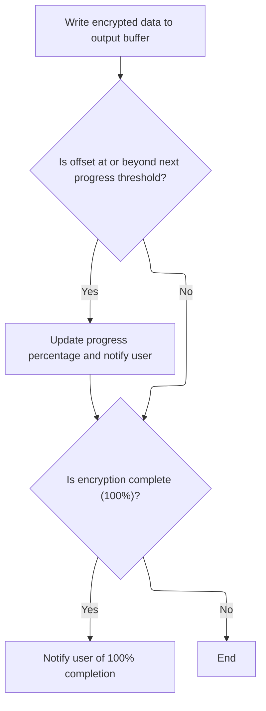

```mermaid
%%{init: {"flowchart": {"defaultRenderer": "elk"}} }%%
flowchart TD
    node1["Check if Base64 table is initialized"]
    click node1 openCode "HotelManagementSystem/Modules/clsBlowfish.cls:244:244"
    node1 --> node2{"Is table initialized?"}
    click node2 openCode "HotelManagementSystem/Modules/clsBlowfish.cls:244:244"
    node2 -->|"No"| node3["Initialize Base64 table"]
    click node3 openCode "HotelManagementSystem/Modules/clsBlowfish.cls:56:185"
    node2 -->|"Yes"| node4{"Is input small? (<1024 bytes)"}
    click node4 openCode "HotelManagementSystem/Modules/clsBlowfish.cls:252:255"
    node3 --> node4
    node4 -->|"Yes"| node5["Allocate small buffer"]
    click node5 openCode "HotelManagementSystem/Modules/clsBlowfish.cls:253:253"
    node4 -->|"No"| node6["Allocate large buffer"]
    click node6 openCode "HotelManagementSystem/Modules/clsBlowfish.cls:255:255"
    node5 --> node7
    node6 --> node7
    subgraph loop1["For each group of 3 bytes in input array"]
      node7["Convert 3 bytes to 4 Base64 characters"]
      click node7 openCode "HotelManagementSystem/Modules/clsBlowfish.cls:260:266"
    end
    node7 --> node8{"Leftover bytes?"}
    click node8 openCode "HotelManagementSystem/Modules/clsBlowfish.cls:268:284"
    node8 -->|"0"| node9["Pad with two '=' characters"]
    click node9 openCode "HotelManagementSystem/Modules/clsBlowfish.cls:270:273"
    node8 -->|"1"| node10["Pad with one '=' character"]
    click node10 openCode "HotelManagementSystem/Modules/clsBlowfish.cls:275:278"
    node8 -->|"2"| node11["No padding needed"]
    click node11 openCode "HotelManagementSystem/Modules/clsBlowfish.cls:280:283"
    node9 --> node12
    node10 --> node12
    node11 --> node12
    node12{"Does encoded output exceed max line length?"}
    click node12 openCode "HotelManagementSystem/Modules/clsBlowfish.cls:288:312"
    node12 -->|"No"| node13["Return encoded string"]
    click node13 openCode "HotelManagementSystem/Modules/clsBlowfish.cls:289:290"
    node12 -->|"Yes"| node14["Insert line breaks"]
    subgraph loop2["For each line in encoded output"]
      node14["Insert line break"]
      click node14 openCode "HotelManagementSystem/Modules/clsBlowfish.cls:301:307"
    end
    node14 --> node15["Return formatted encoded string"]
    click node15 openCode "HotelManagementSystem/Modules/clsBlowfish.cls:311:311"
classDef HeadingStyle fill:#777777,stroke:#333,stroke-width:2px;

%% Swimm:
%% %%{init: {"flowchart": {"defaultRenderer": "elk"}} }%%
%% flowchart TD
%%     node1["Check if <SwmToken path="HotelManagementSystem/Modules/clsBlowfish.cls" pos="20:15:15" line-data="&#39; Standard Blowfish implementation with file support, Base64 conversion,">`Base64`</SwmToken> table is initialized"]
%%     click node1 openCode "<SwmPath>[HotelManagementSystem/Modules/clsBlowfish.cls](HotelManagementSystem/Modules/clsBlowfish.cls)</SwmPath>:244:244"
%%     node1 --> node2{"Is table initialized?"}
%%     click node2 openCode "<SwmPath>[HotelManagementSystem/Modules/clsBlowfish.cls](HotelManagementSystem/Modules/clsBlowfish.cls)</SwmPath>:244:244"
%%     node2 -->|"No"| node3["Initialize <SwmToken path="HotelManagementSystem/Modules/clsBlowfish.cls" pos="20:15:15" line-data="&#39; Standard Blowfish implementation with file support, Base64 conversion,">`Base64`</SwmToken> table"]
%%     click node3 openCode "<SwmPath>[HotelManagementSystem/Modules/clsBlowfish.cls](HotelManagementSystem/Modules/clsBlowfish.cls)</SwmPath>:56:185"
%%     node2 -->|"Yes"| node4{"Is input small? (<1024 bytes)"}
%%     click node4 openCode "<SwmPath>[HotelManagementSystem/Modules/clsBlowfish.cls](HotelManagementSystem/Modules/clsBlowfish.cls)</SwmPath>:252:255"
%%     node3 --> node4
%%     node4 -->|"Yes"| node5["Allocate small buffer"]
%%     click node5 openCode "<SwmPath>[HotelManagementSystem/Modules/clsBlowfish.cls](HotelManagementSystem/Modules/clsBlowfish.cls)</SwmPath>:253:253"
%%     node4 -->|"No"| node6["Allocate large buffer"]
%%     click node6 openCode "<SwmPath>[HotelManagementSystem/Modules/clsBlowfish.cls](HotelManagementSystem/Modules/clsBlowfish.cls)</SwmPath>:255:255"
%%     node5 --> node7
%%     node6 --> node7
%%     subgraph loop1["For each group of 3 bytes in input array"]
%%       node7["Convert 3 bytes to 4 <SwmToken path="HotelManagementSystem/Modules/clsBlowfish.cls" pos="20:15:15" line-data="&#39; Standard Blowfish implementation with file support, Base64 conversion,">`Base64`</SwmToken> characters"]
%%       click node7 openCode "<SwmPath>[HotelManagementSystem/Modules/clsBlowfish.cls](HotelManagementSystem/Modules/clsBlowfish.cls)</SwmPath>:260:266"
%%     end
%%     node7 --> node8{"Leftover bytes?"}
%%     click node8 openCode "<SwmPath>[HotelManagementSystem/Modules/clsBlowfish.cls](HotelManagementSystem/Modules/clsBlowfish.cls)</SwmPath>:268:284"
%%     node8 -->|"0"| node9["Pad with two '=' characters"]
%%     click node9 openCode "<SwmPath>[HotelManagementSystem/Modules/clsBlowfish.cls](HotelManagementSystem/Modules/clsBlowfish.cls)</SwmPath>:270:273"
%%     node8 -->|"1"| node10["Pad with one '=' character"]
%%     click node10 openCode "<SwmPath>[HotelManagementSystem/Modules/clsBlowfish.cls](HotelManagementSystem/Modules/clsBlowfish.cls)</SwmPath>:275:278"
%%     node8 -->|"2"| node11["No padding needed"]
%%     click node11 openCode "<SwmPath>[HotelManagementSystem/Modules/clsBlowfish.cls](HotelManagementSystem/Modules/clsBlowfish.cls)</SwmPath>:280:283"
%%     node9 --> node12
%%     node10 --> node12
%%     node11 --> node12
%%     node12{"Does encoded output exceed max line length?"}
%%     click node12 openCode "<SwmPath>[HotelManagementSystem/Modules/clsBlowfish.cls](HotelManagementSystem/Modules/clsBlowfish.cls)</SwmPath>:288:312"
%%     node12 -->|"No"| node13["Return encoded string"]
%%     click node13 openCode "<SwmPath>[HotelManagementSystem/Modules/clsBlowfish.cls](HotelManagementSystem/Modules/clsBlowfish.cls)</SwmPath>:289:290"
%%     node12 -->|"Yes"| node14["Insert line breaks"]
%%     subgraph loop2["For each line in encoded output"]
%%       node14["Insert line break"]
%%       click node14 openCode "<SwmPath>[HotelManagementSystem/Modules/clsBlowfish.cls](HotelManagementSystem/Modules/clsBlowfish.cls)</SwmPath>:301:307"
%%     end
%%     node14 --> node15["Return formatted encoded string"]
%%     click node15 openCode "<SwmPath>[HotelManagementSystem/Modules/clsBlowfish.cls](HotelManagementSystem/Modules/clsBlowfish.cls)</SwmPath>:311:311"
%% classDef HeadingStyle fill:#777777,stroke:#333,stroke-width:2px;
```

This document describes the flow for encrypting a text string and preparing it for secure storage or transmission. The process converts the input text into bytes, applies block cipher encryption, and optionally encodes the result in <SwmToken path="HotelManagementSystem/Modules/clsBlowfish.cls" pos="20:15:15" line-data="&#39; Standard Blowfish implementation with file support, Base64 conversion,">`Base64`</SwmToken> for compatibility with text-based systems. Sensitive data is cleaned up at the end to ensure security.



```mermaid
flowchart TD
  node1["Preparing Data for Encryption"]:::HeadingStyle
  click node1 goToHeading "Preparing Data for Encryption"
  node1 --> node2["Block Preparation and Chaining Setup"]:::HeadingStyle
  click node2 goToHeading "Block Preparation and Chaining Setup"
  node2 --> node3["Running the Block Cipher"]:::HeadingStyle
  click node3 goToHeading "Running the Block Cipher"
  node3 --> node4["Writing Encrypted Data Back"]:::HeadingStyle
  click node4 goToHeading "Writing Encrypted Data Back"
  node4 --> node5["Encoding and Output Handling
(Encoding and Output Handling)"]:::HeadingStyle
  click node5 goToHeading "Encoding and Output Handling"
  node5 --> node6{"OutputIn64 = True?
(Encoding and Output Handling)"}:::HeadingStyle
  click node6 goToHeading "Encoding and Output Handling"
  node6 -->|"Yes"| node7["Base64 Encoding Entry Point"]:::HeadingStyle
  click node7 goToHeading "HotelManagementSystem/Modules/clsBlowfish.cls:20 Encoding Entry Point"
  node6 -->|"No"| node5
classDef HeadingStyle fill:#777777,stroke:#333,stroke-width:2px;

%% Swimm:
%% flowchart TD
%%   node1["Preparing Data for Encryption"]:::HeadingStyle
%%   click node1 goToHeading "Preparing Data for Encryption"
%%   node1 --> node2["Block Preparation and Chaining Setup"]:::HeadingStyle
%%   click node2 goToHeading "Block Preparation and Chaining Setup"
%%   node2 --> node3["Running the Block Cipher"]:::HeadingStyle
%%   click node3 goToHeading "Running the Block Cipher"
%%   node3 --> node4["Writing Encrypted Data Back"]:::HeadingStyle
%%   click node4 goToHeading "Writing Encrypted Data Back"
%%   node4 --> node5["Encoding and Output Handling
%% (Encoding and Output Handling)"]:::HeadingStyle
%%   click node5 goToHeading "Encoding and Output Handling"
%%   node5 --> node6{"<SwmToken path="HotelManagementSystem/Modules/clsBlowfish.cls" pos="378:24:24" line-data="Public Function EncryptString(Text As String, Optional Key As String, Optional OutputIn64 As Boolean) As String">`OutputIn64`</SwmToken> = True?
%% (Encoding and Output Handling)"}:::HeadingStyle
%%   click node6 goToHeading "Encoding and Output Handling"
%%   node6 -->|"Yes"| node7["<SwmToken path="HotelManagementSystem/Modules/clsBlowfish.cls" pos="20:15:15" line-data="&#39; Standard Blowfish implementation with file support, Base64 conversion,">`Base64`</SwmToken> Encoding Entry Point"]:::HeadingStyle
%%   click node7 goToHeading "<SwmToken path="HotelManagementSystem/Modules/clsBlowfish.cls" pos="20:15:15" line-data="&#39; Standard Blowfish implementation with file support, Base64 conversion,">`Base64`</SwmToken> Encoding Entry Point"
%%   node6 -->|"No"| node5
%% classDef HeadingStyle fill:#777777,stroke:#333,stroke-width:2px;
```

# Preparing Data for Encryption

```mermaid
%%{init: {"flowchart": {"defaultRenderer": "elk"}} }%%
flowchart TD
    node1["Convert input text to bytes"]
    click node1 openCode "HotelManagementSystem/Modules/clsBlowfish.cls:378:381"
    node1 --> node2["Block Preparation and Chaining Setup"]
    
    node2 --> node3["Convert encrypted bytes to text"]
    click node3 openCode "HotelManagementSystem/Modules/clsBlowfish.cls:382:383"
    node3 --> node4{"OutputIn64 = True?"}
    
    node4 -->|"Yes"| node5["Base64 Encoding Entry Point"]
    
    node4 -->|"No"| node5["Base64 Encoding Entry Point"]
    

classDef HeadingStyle fill:#777777,stroke:#333,stroke-width:2px;
click node2 goToHeading "Block Preparation and Chaining Setup"
node2:::HeadingStyle
click node4 goToHeading "Encoding and Output Handling"
node4:::HeadingStyle
click node5 goToHeading "HotelManagementSystem/Modules/clsBlowfish.cls:20 Encoding Entry Point"
node5:::HeadingStyle

%% Swimm:
%% %%{init: {"flowchart": {"defaultRenderer": "elk"}} }%%
%% flowchart TD
%%     node1["Convert input text to bytes"]
%%     click node1 openCode "<SwmPath>[HotelManagementSystem/Modules/clsBlowfish.cls](HotelManagementSystem/Modules/clsBlowfish.cls)</SwmPath>:378:381"
%%     node1 --> node2["Block Preparation and Chaining Setup"]
%%     
%%     node2 --> node3["Convert encrypted bytes to text"]
%%     click node3 openCode "<SwmPath>[HotelManagementSystem/Modules/clsBlowfish.cls](HotelManagementSystem/Modules/clsBlowfish.cls)</SwmPath>:382:383"
%%     node3 --> node4{"<SwmToken path="HotelManagementSystem/Modules/clsBlowfish.cls" pos="378:24:24" line-data="Public Function EncryptString(Text As String, Optional Key As String, Optional OutputIn64 As Boolean) As String">`OutputIn64`</SwmToken> = True?"}
%%     
%%     node4 -->|"Yes"| node5["<SwmToken path="HotelManagementSystem/Modules/clsBlowfish.cls" pos="20:15:15" line-data="&#39; Standard Blowfish implementation with file support, Base64 conversion,">`Base64`</SwmToken> Encoding Entry Point"]
%%     
%%     node4 -->|"No"| node5["<SwmToken path="HotelManagementSystem/Modules/clsBlowfish.cls" pos="20:15:15" line-data="&#39; Standard Blowfish implementation with file support, Base64 conversion,">`Base64`</SwmToken> Encoding Entry Point"]
%%     
%% 
%% classDef HeadingStyle fill:#777777,stroke:#333,stroke-width:2px;
%% click node2 goToHeading "Block Preparation and Chaining Setup"
%% node2:::HeadingStyle
%% click node4 goToHeading "Encoding and Output Handling"
%% node4:::HeadingStyle
%% click node5 goToHeading "<SwmToken path="HotelManagementSystem/Modules/clsBlowfish.cls" pos="20:15:15" line-data="&#39; Standard Blowfish implementation with file support, Base64 conversion,">`Base64`</SwmToken> Encoding Entry Point"
%% node5:::HeadingStyle
```



<SwmSnippet path="/HotelManagementSystem/Modules/clsBlowfish.cls" line="378">

---

In <SwmToken path="HotelManagementSystem/Modules/clsBlowfish.cls" pos="378:4:4" line-data="Public Function EncryptString(Text As String, Optional Key As String, Optional OutputIn64 As Boolean) As String">`EncryptString`</SwmToken>, we start by converting the input string into a byte array so the encryption logic can work on raw bytes. Right after, we call <SwmToken path="HotelManagementSystem/Modules/clsBlowfish.cls" pos="381:3:3" line-data="    Call EncryptByte(byteArray(), Key)">`EncryptByte`</SwmToken> to actually perform the encryption, since that's where the block cipher logic lives. This separation keeps the string/byte conversion and the encryption algorithm cleanly split.

```apex
Public Function EncryptString(Text As String, Optional Key As String, Optional OutputIn64 As Boolean) As String
    Dim byteArray() As Byte
    byteArray() = StrConv(Text, vbFromUnicode)
    Call EncryptByte(byteArray(), Key)
```

---

</SwmSnippet>

## Block Preparation and Chaining Setup

<SwmSnippet path="/HotelManagementSystem/Modules/clsBlowfish.cls" line="348">

---

In <SwmToken path="HotelManagementSystem/Modules/clsBlowfish.cls" pos="348:4:4" line-data="Public Sub EncryptByte(byteArray() As Byte, Optional Key As String)">`EncryptByte`</SwmToken>, we set up the byte array for block encryption: pad it to the right length, add some random bytes for CBC, and copy the original data. We then loop through the array in 8-byte chunks, and call <SwmToken path="HotelManagementSystem/Modules/clsBlowfish.cls" pos="361:3:3" line-data="        Call GetWord(LeftWord, byteArray(), Offset)">`GetWord`</SwmToken> to extract 4-byte words from the byte array, which is needed for the block cipher logic.

```apex
Public Sub EncryptByte(byteArray() As Byte, Optional Key As String)
    Dim Offset As Long, OrigLen As Long, LeftWord As Long, RightWord As Long, CipherLen As Long, CipherLeft As Long, CipherRight As Long, CurrPercent As Long, NextPercent As Long
    If (Len(Key) > 0) Then Me.Key = Key
    OrigLen = UBound(byteArray) + 1
    CipherLen = OrigLen + 12
    If (CipherLen Mod 8 <> 0) Then CipherLen = CipherLen + 8 - (CipherLen Mod 8)
    ReDim Preserve byteArray(CipherLen - 1)
    Call CopyMem(byteArray(12), byteArray(0), OrigLen)
    Call CopyMem(byteArray(8), OrigLen, 4)
    Call Randomize
    Call CopyMem(byteArray(0), CLng(2147483647 * Rnd), 4)
    Call CopyMem(byteArray(4), CLng(2147483647 * Rnd), 4)
    For Offset = 0 To (CipherLen - 1) Step 8
        Call GetWord(LeftWord, byteArray(), Offset)
        Call GetWord(RightWord, byteArray(), Offset + 4)
```

---

</SwmSnippet>

<SwmSnippet path="/HotelManagementSystem/Modules/clsBlowfish.cls" line="428">

---

<SwmToken path="HotelManagementSystem/Modules/clsBlowfish.cls" pos="428:6:6" line-data="Private Static Sub GetWord(LongValue As Long, CryptBuffer() As Byte, Offset As Long)">`GetWord`</SwmToken> grabs 4 bytes from the buffer at the given offset and reverses their order before copying them into a Long. This handles endianness so the block cipher logic works as expected.

```apex
Private Static Sub GetWord(LongValue As Long, CryptBuffer() As Byte, Offset As Long)
    Dim bb(0 To 3) As Byte
    bb(3) = CryptBuffer(Offset)
    bb(2) = CryptBuffer(Offset + 1)
    bb(1) = CryptBuffer(Offset + 2)
    bb(0) = CryptBuffer(Offset + 3)
    Call CopyMem(LongValue, bb(0), 4)
End Sub
```

---

</SwmSnippet>

<SwmSnippet path="/HotelManagementSystem/Modules/clsBlowfish.cls" line="363">

---

Back in <SwmToken path="HotelManagementSystem/Modules/clsBlowfish.cls" pos="348:4:4" line-data="Public Sub EncryptByte(byteArray() As Byte, Optional Key As String)">`EncryptByte`</SwmToken>, after extracting the words, we XOR them with the previous encrypted block's values for CBC mode. Then we call <SwmToken path="HotelManagementSystem/Modules/clsBlowfish.cls" pos="365:3:3" line-data="        Call EncryptBlock(LeftWord, RightWord)">`EncryptBlock`</SwmToken> to actually run the Blowfish algorithm on this block.

```apex
        LeftWord = LeftWord Xor CipherLeft
        RightWord = RightWord Xor CipherRight
        Call EncryptBlock(LeftWord, RightWord)
```

---

</SwmSnippet>

### Running the Block Cipher

See <SwmLink doc-title="Encrypting a data block">[Encrypting a data block](/.swm/encrypting-a-data-block.ni99vqse.sw.md)</SwmLink>

### Writing Encrypted Data Back



<SwmSnippet path="/HotelManagementSystem/Modules/clsBlowfish.cls" line="366">

---

Back in <SwmToken path="HotelManagementSystem/Modules/clsBlowfish.cls" pos="348:4:4" line-data="Public Sub EncryptByte(byteArray() As Byte, Optional Key As String)">`EncryptByte`</SwmToken>, after encrypting the block, we use <SwmToken path="HotelManagementSystem/Modules/clsBlowfish.cls" pos="366:3:3" line-data="        Call PutWord(LeftWord, byteArray(), Offset)">`PutWord`</SwmToken> to write the encrypted words back into the byte array at the correct positions, making sure the byte order is handled properly.

```apex
        Call PutWord(LeftWord, byteArray(), Offset)
        Call PutWord(RightWord, byteArray(), Offset + 4)
```

---

</SwmSnippet>

<SwmSnippet path="/HotelManagementSystem/Modules/clsBlowfish.cls" line="436">

---

<SwmToken path="HotelManagementSystem/Modules/clsBlowfish.cls" pos="436:6:6" line-data="Private Static Sub PutWord(LongValue As Long, CryptBuffer() As Byte, Offset As Long)">`PutWord`</SwmToken> takes a 4-byte integer, splits it into bytes, reverses their order, and writes them back to the buffer at the right offset. This keeps the byte order consistent for later decryption.

```apex
Private Static Sub PutWord(LongValue As Long, CryptBuffer() As Byte, Offset As Long)
    Dim bb(0 To 3) As Byte
    Call CopyMem(bb(0), LongValue, 4)
    CryptBuffer(Offset) = bb(3)
    CryptBuffer(Offset + 1) = bb(2)
    CryptBuffer(Offset + 2) = bb(1)
    CryptBuffer(Offset + 3) = bb(0)
End Sub
```

---

</SwmSnippet>

<SwmSnippet path="/HotelManagementSystem/Modules/clsBlowfish.cls" line="368">

---

After <SwmToken path="HotelManagementSystem/Modules/clsBlowfish.cls" pos="366:3:3" line-data="        Call PutWord(LeftWord, byteArray(), Offset)">`PutWord`</SwmToken> writes the encrypted data back, <SwmToken path="HotelManagementSystem/Modules/clsBlowfish.cls" pos="348:4:4" line-data="Public Sub EncryptByte(byteArray() As Byte, Optional Key As String)">`EncryptByte`</SwmToken> updates the chaining values for the next block and raises progress events if needed. This wraps up the block processing and signals completion if we're at the end.

```apex
        CipherLeft = LeftWord
        CipherRight = RightWord
        If (Offset >= NextPercent) Then
            CurrPercent = Int((Offset / CipherLen) * 100)
            NextPercent = (CipherLen * ((CurrPercent + 1) / 100)) + 1
            RaiseEvent Progress(CurrPercent)
        End If
    Next
    If (CurrPercent <> 100) Then RaiseEvent Progress(100)
End Sub
```

---

</SwmSnippet>

## Encoding and Output Handling

<SwmSnippet path="/HotelManagementSystem/Modules/clsBlowfish.cls" line="382">

---

Back in <SwmToken path="HotelManagementSystem/Modules/clsBlowfish.cls" pos="382:1:1" line-data="    EncryptString = StrConv(byteArray(), vbUnicode)">`EncryptString`</SwmToken>, after encryption, we convert the byte array back to a Unicode string. If <SwmToken path="HotelManagementSystem/Modules/clsBlowfish.cls" pos="383:3:3" line-data="    If OutputIn64 = True Then EncryptString = Encode64(EncryptString)">`OutputIn64`</SwmToken> is set, we call <SwmToken path="HotelManagementSystem/Modules/clsBlowfish.cls" pos="383:15:15" line-data="    If OutputIn64 = True Then EncryptString = Encode64(EncryptString)">`Encode64`</SwmToken> to Base64-encode the result for safe text output.

```apex
    EncryptString = StrConv(byteArray(), vbUnicode)
    If OutputIn64 = True Then EncryptString = Encode64(EncryptString)
```

---

</SwmSnippet>

## <SwmToken path="HotelManagementSystem/Modules/clsBlowfish.cls" pos="20:15:15" line-data="&#39; Standard Blowfish implementation with file support, Base64 conversion,">`Base64`</SwmToken> Encoding Entry Point

<SwmSnippet path="/HotelManagementSystem/Modules/clsBlowfish.cls" line="234">

---

In <SwmToken path="HotelManagementSystem/Modules/clsBlowfish.cls" pos="234:4:4" line-data="Public Function Encode64(ByRef sInput As String) As String">`Encode64`</SwmToken>, we check for empty input, convert the string to a byte array, and then call <SwmToken path="HotelManagementSystem/Modules/clsBlowfish.cls" pos="238:5:5" line-data="    Encode64 = EncodeArray64(bytTemp)">`EncodeArray64`</SwmToken> to handle the actual <SwmToken path="HotelManagementSystem/Modules/clsBlowfish.cls" pos="20:15:15" line-data="&#39; Standard Blowfish implementation with file support, Base64 conversion,">`Base64`</SwmToken> encoding.

```apex
Public Function Encode64(ByRef sInput As String) As String
    If sInput = "" Then Exit Function
    Dim bytTemp() As Byte
    bytTemp = StrConv(sInput, vbFromUnicode)
    Encode64 = EncodeArray64(bytTemp)
```

---

</SwmSnippet>

### <SwmToken path="HotelManagementSystem/Modules/clsBlowfish.cls" pos="20:15:15" line-data="&#39; Standard Blowfish implementation with file support, Base64 conversion,">`Base64`</SwmToken> Encoding Core Logic



<SwmSnippet path="/HotelManagementSystem/Modules/clsBlowfish.cls" line="241">

---

In <SwmToken path="HotelManagementSystem/Modules/clsBlowfish.cls" pos="241:4:4" line-data="Public Function EncodeArray64(ByRef bytInput() As Byte) As String">`EncodeArray64`</SwmToken>, we check if the encoding tables are set up and call <SwmToken path="HotelManagementSystem/Modules/clsBlowfish.cls" pos="244:14:14" line-data="    If m_bytReverseIndex(47) &lt;&gt; 63 Then Initialize64">`Initialize64`</SwmToken> if not. This ensures the <SwmToken path="HotelManagementSystem/Modules/clsBlowfish.cls" pos="20:15:15" line-data="&#39; Standard Blowfish implementation with file support, Base64 conversion,">`Base64`</SwmToken> character mapping is ready before we start encoding the byte array.

```apex
Public Function EncodeArray64(ByRef bytInput() As Byte) As String
    On Error GoTo ErrorHandler
    
    If m_bytReverseIndex(47) <> 63 Then Initialize64
```

---

</SwmSnippet>

<SwmSnippet path="/HotelManagementSystem/Modules/clsBlowfish.cls" line="56">

---

<SwmToken path="HotelManagementSystem/Modules/clsBlowfish.cls" pos="56:4:4" line-data="Private Sub Initialize64()">`Initialize64`</SwmToken> sets up the <SwmToken path="HotelManagementSystem/Modules/clsBlowfish.cls" pos="20:15:15" line-data="&#39; Standard Blowfish implementation with file support, Base64 conversion,">`Base64`</SwmToken> encoding and decoding tables using the standard character set (A-Z, a-z, 0-9, +, /). This lets us encode and decode data consistently.

```apex
Private Sub Initialize64()
    m_bytIndex(0) = 65 'Asc("A")
    m_bytIndex(1) = 66 'Asc("B")
    m_bytIndex(2) = 67 'Asc("C")
    m_bytIndex(3) = 68 'Asc("D")
    m_bytIndex(4) = 69 'Asc("E")
    m_bytIndex(5) = 70 'Asc("F")
    m_bytIndex(6) = 71 'Asc("G")
    m_bytIndex(7) = 72 'Asc("H")
    m_bytIndex(8) = 73 'Asc("I")
    m_bytIndex(9) = 74 'Asc("J")
    m_bytIndex(10) = 75 'Asc("K")
    m_bytIndex(11) = 76 'Asc("L")
    m_bytIndex(12) = 77 'Asc("M")
    m_bytIndex(13) = 78 'Asc("N")
    m_bytIndex(14) = 79 'Asc("O")
    m_bytIndex(15) = 80 'Asc("P")
    m_bytIndex(16) = 81 'Asc("Q")
    m_bytIndex(17) = 82 'Asc("R")
    m_bytIndex(18) = 83 'Asc("S")
    m_bytIndex(19) = 84 'Asc("T")
    m_bytIndex(20) = 85 'Asc("U")
    m_bytIndex(21) = 86 'Asc("V")
    m_bytIndex(22) = 87 'Asc("W")
    m_bytIndex(23) = 88 'Asc("X")
    m_bytIndex(24) = 89 'Asc("Y")
    m_bytIndex(25) = 90 'Asc("Z")
    m_bytIndex(26) = 97 'Asc("a")
    m_bytIndex(27) = 98 'Asc("b")
    m_bytIndex(28) = 99 'Asc("c")
    m_bytIndex(29) = 100 'Asc("d")
    m_bytIndex(30) = 101 'Asc("e")
    m_bytIndex(31) = 102 'Asc("f")
    m_bytIndex(32) = 103 'Asc("g")
    m_bytIndex(33) = 104 'Asc("h")
    m_bytIndex(34) = 105 'Asc("i")
    m_bytIndex(35) = 106 'Asc("j")
    m_bytIndex(36) = 107 'Asc("k")
    m_bytIndex(37) = 108 'Asc("l")
    m_bytIndex(38) = 109 'Asc("m")
    m_bytIndex(39) = 110 'Asc("n")
    m_bytIndex(40) = 111 'Asc("o")
    m_bytIndex(41) = 112 'Asc("p")
    m_bytIndex(42) = 113 'Asc("q")
    m_bytIndex(43) = 114 'Asc("r")
    m_bytIndex(44) = 115 'Asc("s")
    m_bytIndex(45) = 116 'Asc("t")
    m_bytIndex(46) = 117 'Asc("u")
    m_bytIndex(47) = 118 'Asc("v")
    m_bytIndex(48) = 119 'Asc("w")
    m_bytIndex(49) = 120 'Asc("x")
    m_bytIndex(50) = 121 'Asc("y")
    m_bytIndex(51) = 122 'Asc("z")
    m_bytIndex(52) = 48 'Asc("0")
    m_bytIndex(53) = 49 'Asc("1")
    m_bytIndex(54) = 50 'Asc("2")
    m_bytIndex(55) = 51 'Asc("3")
    m_bytIndex(56) = 52 'Asc("4")
    m_bytIndex(57) = 53 'Asc("5")
    m_bytIndex(58) = 54 'Asc("6")
    m_bytIndex(59) = 55 'Asc("7")
    m_bytIndex(60) = 56 'Asc("8")
    m_bytIndex(61) = 57 'Asc("9")
    m_bytIndex(62) = 43 'Asc("+")
    m_bytIndex(63) = 47 'Asc("/")
    m_bytReverseIndex(65) = 0 'Asc("A")
    m_bytReverseIndex(66) = 1 'Asc("B")
    m_bytReverseIndex(67) = 2 'Asc("C")
    m_bytReverseIndex(68) = 3 'Asc("D")
    m_bytReverseIndex(69) = 4 'Asc("E")
    m_bytReverseIndex(70) = 5 'Asc("F")
    m_bytReverseIndex(71) = 6 'Asc("G")
    m_bytReverseIndex(72) = 7 'Asc("H")
    m_bytReverseIndex(73) = 8 'Asc("I")
    m_bytReverseIndex(74) = 9 'Asc("J")
    m_bytReverseIndex(75) = 10 'Asc("K")
    m_bytReverseIndex(76) = 11 'Asc("L")
    m_bytReverseIndex(77) = 12 'Asc("M")
    m_bytReverseIndex(78) = 13 'Asc("N")
    m_bytReverseIndex(79) = 14 'Asc("O")
    m_bytReverseIndex(80) = 15 'Asc("P")
    m_bytReverseIndex(81) = 16 'Asc("Q")
    m_bytReverseIndex(82) = 17 'Asc("R")
    m_bytReverseIndex(83) = 18 'Asc("S")
    m_bytReverseIndex(84) = 19 'Asc("T")
    m_bytReverseIndex(85) = 20 'Asc("U")
    m_bytReverseIndex(86) = 21 'Asc("V")
    m_bytReverseIndex(87) = 22 'Asc("W")
    m_bytReverseIndex(88) = 23 'Asc("X")
    m_bytReverseIndex(89) = 24 'Asc("Y")
    m_bytReverseIndex(90) = 25 'Asc("Z")
    m_bytReverseIndex(97) = 26 'Asc("a")
    m_bytReverseIndex(98) = 27 'Asc("b")
    m_bytReverseIndex(99) = 28 'Asc("c")
    m_bytReverseIndex(100) = 29 'Asc("d")
    m_bytReverseIndex(101) = 30 'Asc("e")
    m_bytReverseIndex(102) = 31 'Asc("f")
    m_bytReverseIndex(103) = 32 'Asc("g")
    m_bytReverseIndex(104) = 33 'Asc("h")
    m_bytReverseIndex(105) = 34 'Asc("i")
    m_bytReverseIndex(106) = 35 'Asc("j")
    m_bytReverseIndex(107) = 36 'Asc("k")
    m_bytReverseIndex(108) = 37 'Asc("l")
    m_bytReverseIndex(109) = 38 'Asc("m")
    m_bytReverseIndex(110) = 39 'Asc("n")
    m_bytReverseIndex(111) = 40 'Asc("o")
    m_bytReverseIndex(112) = 41 'Asc("p")
    m_bytReverseIndex(113) = 42 'Asc("q")
    m_bytReverseIndex(114) = 43 'Asc("r")
    m_bytReverseIndex(115) = 44 'Asc("s")
    m_bytReverseIndex(116) = 45 'Asc("t")
    m_bytReverseIndex(117) = 46 'Asc("u")
    m_bytReverseIndex(118) = 47 'Asc("v")
    m_bytReverseIndex(119) = 48 'Asc("w")
    m_bytReverseIndex(120) = 49 'Asc("x")
    m_bytReverseIndex(121) = 50 'Asc("y")
    m_bytReverseIndex(122) = 51 'Asc("z")
    m_bytReverseIndex(48) = 52 'Asc("0")
    m_bytReverseIndex(49) = 53 'Asc("1")
    m_bytReverseIndex(50) = 54 'Asc("2")
    m_bytReverseIndex(51) = 55 'Asc("3")
    m_bytReverseIndex(52) = 56 'Asc("4")
    m_bytReverseIndex(53) = 57 'Asc("5")
    m_bytReverseIndex(54) = 58 'Asc("6")
    m_bytReverseIndex(55) = 59 'Asc("7")
    m_bytReverseIndex(56) = 60 'Asc("8")
    m_bytReverseIndex(57) = 61 'Asc("9")
    m_bytReverseIndex(43) = 62 'Asc("+")
    m_bytReverseIndex(47) = 63 'Asc("/")
End Sub
```

---

</SwmSnippet>

<SwmSnippet path="/HotelManagementSystem/Modules/clsBlowfish.cls" line="245">

---

After <SwmToken path="HotelManagementSystem/Modules/clsBlowfish.cls" pos="56:4:4" line-data="Private Sub Initialize64()">`Initialize64`</SwmToken>, <SwmToken path="HotelManagementSystem/Modules/clsBlowfish.cls" pos="289:1:1" line-data="        EncodeArray64 = Left$(bytWorkspace, InStr(1, bytWorkspace, Chr$(0)) - 1)">`EncodeArray64`</SwmToken> encodes the byte array in 3-byte chunks, adds padding if needed, and inserts line breaks if the output is long. The result is a <SwmToken path="HotelManagementSystem/Modules/clsBlowfish.cls" pos="20:15:15" line-data="&#39; Standard Blowfish implementation with file support, Base64 conversion,">`Base64`</SwmToken> string ready for use.

```apex
    Dim bytWorkspace() As Byte, bytResult() As Byte
    Dim bytCrLf(0 To 3) As Byte, lCounter As Long
    Dim lWorkspaceCounter As Long, lLineCounter As Long
    Dim lCompleteLines As Long, lBytesRemaining As Long
    Dim lpWorkSpace As Long, lpResult As Long
    Dim lpCrLf As Long

    If UBound(bytInput) < 1024 Then
        ReDim bytWorkspace(LBound(bytInput) To (LBound(bytInput) + 4096)) As Byte
    Else
        ReDim bytWorkspace(LBound(bytInput) To (UBound(bytInput) * 4)) As Byte
    End If

    lWorkspaceCounter = LBound(bytWorkspace)

    For lCounter = LBound(bytInput) To (UBound(bytInput) - ((UBound(bytInput) Mod 3) + 3)) Step 3
        bytWorkspace(lWorkspaceCounter) = m_bytIndex((bytInput(lCounter) \ k_bytShift2))
        bytWorkspace(lWorkspaceCounter + 2) = m_bytIndex(((bytInput(lCounter) And k_bytMask1) * k_bytShift4) + ((bytInput(lCounter + 1)) \ k_bytShift4))
        bytWorkspace(lWorkspaceCounter + 4) = m_bytIndex(((bytInput(lCounter + 1) And k_bytMask2) * k_bytShift2) + (bytInput(lCounter + 2) \ k_bytShift6))
        bytWorkspace(lWorkspaceCounter + 6) = m_bytIndex(bytInput(lCounter + 2) And k_bytMask3)
        lWorkspaceCounter = lWorkspaceCounter + 8
    Next lCounter

    Select Case (UBound(bytInput) Mod 3):
        Case 0:
            bytWorkspace(lWorkspaceCounter) = m_bytIndex((bytInput(lCounter) \ k_bytShift2))
            bytWorkspace(lWorkspaceCounter + 2) = m_bytIndex((bytInput(lCounter) And k_bytMask1) * k_bytShift4)
            bytWorkspace(lWorkspaceCounter + 4) = k_bytEqualSign
            bytWorkspace(lWorkspaceCounter + 6) = k_bytEqualSign
        Case 1:
            bytWorkspace(lWorkspaceCounter) = m_bytIndex((bytInput(lCounter) \ k_bytShift2))
            bytWorkspace(lWorkspaceCounter + 2) = m_bytIndex(((bytInput(lCounter) And k_bytMask1) * k_bytShift4) + ((bytInput(lCounter + 1)) \ k_bytShift4))
            bytWorkspace(lWorkspaceCounter + 4) = m_bytIndex((bytInput(lCounter + 1) And k_bytMask2) * k_bytShift2)
            bytWorkspace(lWorkspaceCounter + 6) = k_bytEqualSign
        Case 2:
            bytWorkspace(lWorkspaceCounter) = m_bytIndex((bytInput(lCounter) \ k_bytShift2))
            bytWorkspace(lWorkspaceCounter + 2) = m_bytIndex(((bytInput(lCounter) And k_bytMask1) * k_bytShift4) + ((bytInput(lCounter + 1)) \ k_bytShift4))
            bytWorkspace(lWorkspaceCounter + 4) = m_bytIndex(((bytInput(lCounter + 1) And k_bytMask2) * k_bytShift2) + ((bytInput(lCounter + 2)) \ k_bytShift6))
            bytWorkspace(lWorkspaceCounter + 6) = m_bytIndex(bytInput(lCounter + 2) And k_bytMask3)
    End Select

    lWorkspaceCounter = lWorkspaceCounter + 8

    If lWorkspaceCounter <= k_lMaxBytesPerLine Then
        EncodeArray64 = Left$(bytWorkspace, InStr(1, bytWorkspace, Chr$(0)) - 1)
    Else
        bytCrLf(0) = 13
        bytCrLf(1) = 0
        bytCrLf(2) = 10
        bytCrLf(3) = 0
        ReDim bytResult(LBound(bytWorkspace) To UBound(bytWorkspace))
        lpWorkSpace = VarPtr(bytWorkspace(LBound(bytWorkspace)))
        lpResult = VarPtr(bytResult(LBound(bytResult)))
        lpCrLf = VarPtr(bytCrLf(LBound(bytCrLf)))
        lCompleteLines = Fix(lWorkspaceCounter / k_lMaxBytesPerLine)
        
        For lLineCounter = 0 To lCompleteLines
            CopyMemory lpResult, lpWorkSpace, k_lMaxBytesPerLine
            lpWorkSpace = lpWorkSpace + k_lMaxBytesPerLine
            lpResult = lpResult + k_lMaxBytesPerLine
            CopyMemory lpResult, lpCrLf, 4&
            lpResult = lpResult + 4&
        Next lLineCounter
        
        lBytesRemaining = lWorkspaceCounter - (lCompleteLines * k_lMaxBytesPerLine)
        If lBytesRemaining > 0 Then CopyMemory lpResult, lpWorkSpace, lBytesRemaining
        EncodeArray64 = Left$(bytResult, InStr(1, bytResult, Chr$(0)) - 1)
    End If
    Exit Function

ErrorHandler:
    Erase bytResult
    EncodeArray64 = bytResult
End Function
```

---

</SwmSnippet>

### Returning the Encoded Result

<SwmSnippet path="/HotelManagementSystem/Modules/clsBlowfish.cls" line="239">

---

After <SwmToken path="HotelManagementSystem/Modules/clsBlowfish.cls" pos="238:5:5" line-data="    Encode64 = EncodeArray64(bytTemp)">`EncodeArray64`</SwmToken> finishes, <SwmToken path="HotelManagementSystem/Modules/clsBlowfish.cls" pos="234:4:4" line-data="Public Function Encode64(ByRef sInput As String) As String">`Encode64`</SwmToken> just returns the Base64-encoded string as the result.

```apex
End Function
```

---

</SwmSnippet>

## Cleanup and Finalization

<SwmSnippet path="/HotelManagementSystem/Modules/clsBlowfish.cls" line="384">

---

After <SwmToken path="HotelManagementSystem/Modules/clsBlowfish.cls" pos="234:4:4" line-data="Public Function Encode64(ByRef sInput As String) As String">`Encode64`</SwmToken> (if used), <SwmToken path="HotelManagementSystem/Modules/clsBlowfish.cls" pos="378:4:4" line-data="Public Function EncryptString(Text As String, Optional Key As String, Optional OutputIn64 As Boolean) As String">`EncryptString`</SwmToken> wipes the byte array and clears the input variables to make sure no sensitive data is left in memory.

```apex
    Erase byteArray(): Key = "": Text = ""
End Function
```

---

</SwmSnippet>

&nbsp;

*This is an auto-generated document by Swimm 🌊 and has not yet been verified by a human*

<SwmMeta version="3.0.0" repo-id="Z2l0aHViJTNBJTNBY3RzLVZCNi1Qcm9qZWN0cyUzQSUzQVN3aW1tLURlbW8=" repo-name="cts-VB6-Projects"><sup>Powered by [Swimm](https://app.swimm.io/)</sup></SwmMeta>
