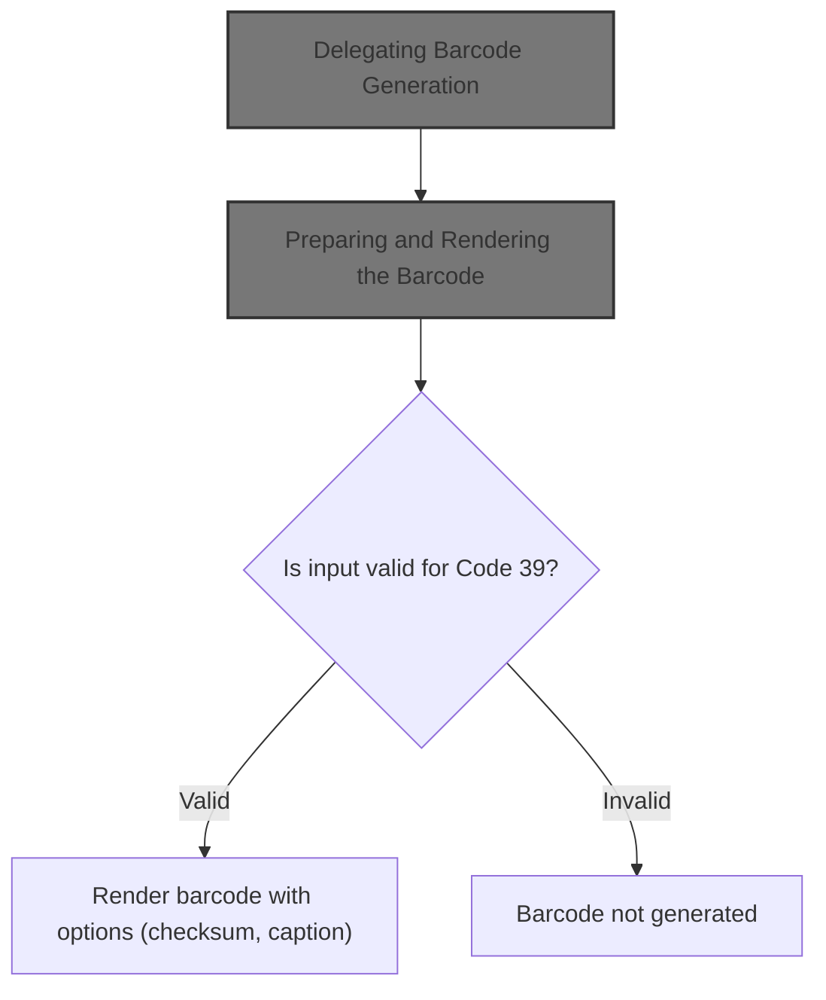

This document describes how a Code 39 barcode is generated from a user-provided string. The flow validates the input, encodes it into barcode patterns, and renders the barcode image. Users can choose to include a checksum and a caption. The result is a barcode image ready for use.



# Delegating Barcode Generation

<SwmSnippet path="/BARCODE/arisBarcode.cls" line="18">

---

<SwmToken path="BARCODE/arisBarcode.cls" pos="18:2:2" line-data="Function Code39(zObj As Object, zBarH As Double, BarText As String, Optional zWithCheckSum As Boolean = False, Optional ByVal HasCaption As Boolean = False)">`Code39`</SwmToken> just hands off all its parameters to <SwmToken path="BARCODE/arisBarcode.cls" pos="19:1:1" line-data="    Bar39 zObj, zBarH, BarText, zWithCheckSum, HasCaption">`Bar39`</SwmToken> and does nothing else. This is the entry point, and the actual barcode logic is in <SwmToken path="BARCODE/arisBarcode.cls" pos="19:1:1" line-data="    Bar39 zObj, zBarH, BarText, zWithCheckSum, HasCaption">`Bar39`</SwmToken>, so we need to call into <SwmPath>[BARCODE/Code39.bas](BARCODE/Code39.bas)</SwmPath> next to do any real work.

```apex
Function Code39(zObj As Object, zBarH As Double, BarText As String, Optional zWithCheckSum As Boolean = False, Optional ByVal HasCaption As Boolean = False)
    Bar39 zObj, zBarH, BarText, zWithCheckSum, HasCaption
End Function
```

---

</SwmSnippet>

# Preparing and Rendering the Barcode

```mermaid
%%{init: {"flowchart": {"defaultRenderer": "elk"}} }%%
flowchart TD
    node1["Start barcode generation for input string"] --> node2{"Is input string valid for Code 39?"}
    click node1 openCode "BARCODE/Code39.bas:15:22"
    node2 -->|"Valid"| node3["Initialize encoding table"]
    click node2 openCode "BARCODE/Code39.bas:24:24"
    node2 -->|"Invalid"| node8["Exit"]
    click node8 openCode "BARCODE/Code39.bas:24:24"
    node3 --> node4["Prepare barcode object and convert height to pixels"]
    click node3 openCode "BARCODE/Code39.bas:22:22"
    node4 --> node5["Encode input string"]
    click node4 openCode "BARCODE/Code39.bas:24:26"
    
    subgraph loop1["For each character in input string"]
        node5 --> node6["Encode character"]
        click node6 openCode "BARCODE/Code39.bas:70:74"
        node6 --> node7["Add to barcode sequence"]
        click node7 openCode "BARCODE/Code39.bas:73:73"
        node7 --> node5
    end
    node5 --> node9{"Include checksum?"}
    click node5 openCode "BARCODE/Code39.bas:76:77"
    node9 -->|"Yes"| node10["Add checksum to barcode sequence"]
    click node10 openCode "BARCODE/Code39.bas:77:77"
    node9 -->|"No"| node11["Proceed without checksum"]
    click node11 openCode "BARCODE/Code39.bas:78:78"
    node10 --> node12["Draw barcode"]
    node11 --> node12
    
    subgraph loop2["For each encoded character"]
        node12 --> node13["Draw bar for character"]
        click node13 openCode "BARCODE/Code39.bas:83:88"
        node13 --> node12
    end
    node12 --> node14{"Include caption?"}
    click node12 openCode "BARCODE/Code39.bas:91:95"
    node14 -->|"Yes"| node15["Draw caption below barcode"]
    click node15 openCode "BARCODE/Code39.bas:91:95"
    node14 -->|"No"| node16["Finish barcode generation"]
    click node16 openCode "BARCODE/Code39.bas:44:44"
    node15 --> node17["Finish barcode generation"]
    click node17 openCode "BARCODE/Code39.bas:44:44"
    node8 --> node17

classDef HeadingStyle fill:#777777,stroke:#333,stroke-width:2px;

%% Swimm:
%% %%{init: {"flowchart": {"defaultRenderer": "elk"}} }%%
%% flowchart TD
%%     node1["Start barcode generation for input string"] --> node2{"Is input string valid for Code 39?"}
%%     click node1 openCode "<SwmPath>[BARCODE/Code39.bas](BARCODE/Code39.bas)</SwmPath>:15:22"
%%     node2 -->|"Valid"| node3["Initialize encoding table"]
%%     click node2 openCode "<SwmPath>[BARCODE/Code39.bas](BARCODE/Code39.bas)</SwmPath>:24:24"
%%     node2 -->|"Invalid"| node8["Exit"]
%%     click node8 openCode "<SwmPath>[BARCODE/Code39.bas](BARCODE/Code39.bas)</SwmPath>:24:24"
%%     node3 --> node4["Prepare barcode object and convert height to pixels"]
%%     click node3 openCode "<SwmPath>[BARCODE/Code39.bas](BARCODE/Code39.bas)</SwmPath>:22:22"
%%     node4 --> node5["Encode input string"]
%%     click node4 openCode "<SwmPath>[BARCODE/Code39.bas](BARCODE/Code39.bas)</SwmPath>:24:26"
%%     
%%     subgraph loop1["For each character in input string"]
%%         node5 --> node6["Encode character"]
%%         click node6 openCode "<SwmPath>[BARCODE/Code39.bas](BARCODE/Code39.bas)</SwmPath>:70:74"
%%         node6 --> node7["Add to barcode sequence"]
%%         click node7 openCode "<SwmPath>[BARCODE/Code39.bas](BARCODE/Code39.bas)</SwmPath>:73:73"
%%         node7 --> node5
%%     end
%%     node5 --> node9{"Include checksum?"}
%%     click node5 openCode "<SwmPath>[BARCODE/Code39.bas](BARCODE/Code39.bas)</SwmPath>:76:77"
%%     node9 -->|"Yes"| node10["Add checksum to barcode sequence"]
%%     click node10 openCode "<SwmPath>[BARCODE/Code39.bas](BARCODE/Code39.bas)</SwmPath>:77:77"
%%     node9 -->|"No"| node11["Proceed without checksum"]
%%     click node11 openCode "<SwmPath>[BARCODE/Code39.bas](BARCODE/Code39.bas)</SwmPath>:78:78"
%%     node10 --> node12["Draw barcode"]
%%     node11 --> node12
%%     
%%     subgraph loop2["For each encoded character"]
%%         node12 --> node13["Draw bar for character"]
%%         click node13 openCode "<SwmPath>[BARCODE/Code39.bas](BARCODE/Code39.bas)</SwmPath>:83:88"
%%         node13 --> node12
%%     end
%%     node12 --> node14{"Include caption?"}
%%     click node12 openCode "<SwmPath>[BARCODE/Code39.bas](BARCODE/Code39.bas)</SwmPath>:91:95"
%%     node14 -->|"Yes"| node15["Draw caption below barcode"]
%%     click node15 openCode "<SwmPath>[BARCODE/Code39.bas](BARCODE/Code39.bas)</SwmPath>:91:95"
%%     node14 -->|"No"| node16["Finish barcode generation"]
%%     click node16 openCode "<SwmPath>[BARCODE/Code39.bas](BARCODE/Code39.bas)</SwmPath>:44:44"
%%     node15 --> node17["Finish barcode generation"]
%%     click node17 openCode "<SwmPath>[BARCODE/Code39.bas](BARCODE/Code39.bas)</SwmPath>:44:44"
%%     node8 --> node17
%% 
%% classDef HeadingStyle fill:#777777,stroke:#333,stroke-width:2px;
```



<SwmSnippet path="/BARCODE/Code39.bas" line="15">

---

In <SwmToken path="BARCODE/Code39.bas" pos="15:2:2" line-data="Sub Bar39(Obj As Object, BarH As Double, BarText As String, Optional WithCheckSum As Boolean = False, Optional ByVal HasCaption As Boolean = False)">`Bar39`</SwmToken>, we set up the drawing context, convert the barcode height to pixels, and initialize the encoding tables. We also validate the input string before doing anything else. The next step is to actually process the string and prepare for drawing.

```visual basic
Sub Bar39(Obj As Object, BarH As Double, BarText As String, Optional WithCheckSum As Boolean = False, Optional ByVal HasCaption As Boolean = False)
   Set zObj = Obj
   zWithCheckSum = WithCheckSum
   zBarText = BarText
   zHasCaption = HasCaption
   zBarH = BarH * 72 'Inches to Pixel of barcode
   
   Init_Table
   
```

---

</SwmSnippet>

<SwmSnippet path="/BARCODE/Code39.bas" line="97">

---

<SwmToken path="BARCODE/Code39.bas" pos="97:4:4" line-data="Private Sub Init_Table()">`Init_Table`</SwmToken> sets up which characters can be encoded and their corresponding barcode patterns. This is where the mapping between input characters and barcode lines is defined.

```visual basic
Private Sub Init_Table()
    CharSet = "0123456789ABCDEFGHIJKLMNOPQRSTUVWXYZ-. $/+%*"
    arrEncoding = Array( _
             "101001101101", "110100101011", "101100101011", "110110010101", "101001101011", "110100110101", _
             "101100110101", "101001011011", "110100101101", "101100101101", "110101001011", "101101001011", _
             "110110100101", "101011001011", "110101100101", "101101100101", "101010011011", "110101001101", _
             "101101001101", "101011001101", "110101010011", "101101010011", "110110101001", "101011010011", _
             "110101101001", "101101101001", "101010110011", "110101011001", "101101011001", "101011011001", _
             "110010101011", "100110101011", "110011010101", "100101101011", "110010110101", "100110110101", _
             "100101011011", "110010101101", "100110101101", "100100100101", "100100101001", "100101001001", _
             "101001001001", "100101101101" _
             )
End Sub
```

---

</SwmSnippet>

<SwmSnippet path="/BARCODE/Code39.bas" line="24">

---

After validating and parsing the input, we prep the drawing surface: clear the image, set background to white, enable redraw, and switch to pixel units. Then we size the drawing area based on the barcode and caption, so everything fits before rendering.

```visual basic
   If Not CheckCode Then Exit Sub 'Check the String if Valid in Code 39
   
   Eval_String
   
   zObj.Picture = Nothing
   zObj.BackColor = vbWhite
   zObj.AutoRedraw = True
   zObj.ScaleMode = 3
   
   If zHasCaption Then
      zObj.Height = (zObj.TextHeight(zBarText) + zBarH + 5) * Screen.TwipsPerPixelY
   Else
      zObj.Height = zBarH * Screen.TwipsPerPixelY
   End If
   
```

---

</SwmSnippet>

<SwmSnippet path="/BARCODE/Code39.bas" line="61">

---

<SwmToken path="BARCODE/Code39.bas" pos="61:4:4" line-data="Private Sub Eval_String()">`Eval_String`</SwmToken> builds the list of barcode columns to draw, including start/stop characters and an optional checksum. It figures out which encoding to use for each character and sets up the data for rendering.

```visual basic
Private Sub Eval_String()
    Dim i As Long, chkSum As Integer, xTotal As Integer, posCtr As Integer
    Set myCols = New Collection
 
    xTotal = 0
    posCtr = 0
    
    myCols.Add ChkChar 'Start of Barcode
    
    For i = 1 To Len(zBarText)
        posCtr = InStr(CharSet, Mid(zBarText, i, 1)) - 1
        xTotal = xTotal + posCtr
        myCols.Add posCtr
    Next
    
    chkSum = xTotal Mod 43
    If zWithCheckSum Then myCols.Add chkSum 'Check sum
    myCols.Add ChkChar 'End of Barcode
End Sub
```

---

</SwmSnippet>

<SwmSnippet path="/BARCODE/Code39.bas" line="39">

---

After prepping the drawing area and barcode data, we add a border, set the final width, draw the barcode, and then assign the rendered image to the Picture property so it's ready for display.

```visual basic
   zObj.Height = zObj.Height + 10 ' Border
   zObj.Width = ((myCols.Count + 1) * 12) * Screen.TwipsPerPixelX
   
   Draw_Barcode
   zObj.Picture = zObj.Image
End Sub
```

---

</SwmSnippet>

<SwmSnippet path="/BARCODE/Code39.bas" line="80">

---

<SwmToken path="BARCODE/Code39.bas" pos="80:4:4" line-data="Private Sub Draw_Barcode()">`Draw_Barcode`</SwmToken> loops through the encoded columns and draws each bar line by line. If a caption is needed, it centers and prints the text below the barcode.

```visual basic
Private Sub Draw_Barcode()
    Dim encoding As String, i As Integer, j As Integer, xPos As Integer
    xPos = 5 'zBorder / 2
    For i = 1 To myCols.Count
        encoding = arrEncoding(myCols(i))
        For j = 1 To Len(encoding)
            xPos = xPos + 1
            zObj.Line (xPos, 5)-(xPos, zBarH), IIf(Mid(encoding, j, 1), vbBlack, vbWhite)
        Next
    Next
    
    If zHasCaption Then
        zObj.CurrentX = ((myCols.Count * 12) - zObj.TextWidth(zBarText)) / 2   '(zObj.Width - zObj.TextWidth(zBarText) / 2)    ' Horizontal position.
        zObj.CurrentY = zObj.CurrentY + 5    ' Vertical position.
        zObj.Print zBarText   ' Print message.
    End If
End Sub
```

---

</SwmSnippet>

&nbsp;

*This is an auto-generated document by Swimm 🌊 and has not yet been verified by a human*

<SwmMeta version="3.0.0" repo-id="Z2l0aHViJTNBJTNBY3RzLVZCNi1Qcm9qZWN0cyUzQSUzQVN3aW1tLURlbW8=" repo-name="cts-VB6-Projects"><sup>Powered by [Swimm](https://app.swimm.io/)</sup></SwmMeta>
