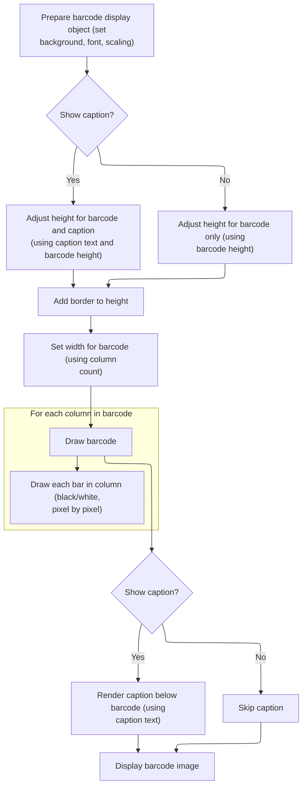

This document describes how users can generate and visually display a <SwmToken path="BARCODE/Code128.bas" pos="1:7:7" line-data="Attribute VB_Name = &quot;Code128&quot;">`Code128`</SwmToken> barcode from their input text. The flow prepares encoding tables, efficiently converts the text into barcode values, and renders the barcode image with an optional caption.

# Preparing Barcode Data and Encoding Tables

<SwmSnippet path="/BARCODE/Code128.bas" line="22">

---

In <SwmToken path="BARCODE/Code128.bas" pos="22:2:2" line-data="Sub Bar128(Obj As Object, BarH As Double, BarText As String, Optional ByVal HasCaption As Boolean = False, Optional Font As IFontDisp = Null)">`Bar128`</SwmToken>, we set up the drawing object, store the input text and caption state, and convert the barcode height from inches to pixels for drawing. Next, we call <SwmToken path="BARCODE/Code128.bas" pos="29:1:1" line-data="   Init_Table &#39;Initialize Encoding">`Init_Table`</SwmToken> to load the encoding patterns needed for barcode generation.

```visual basic
Sub Bar128(Obj As Object, BarH As Double, BarText As String, Optional ByVal HasCaption As Boolean = False, Optional Font As IFontDisp = Null)
   Set zObj = Obj
   
   zBarText = BarText
   zHasCaption = HasCaption
   zBarH = BarH * 72 'Inches to Pixel of barcode
   
   Init_Table 'Initialize Encoding
```

---

</SwmSnippet>

<SwmSnippet path="/BARCODE/Code128.bas" line="70">

---

<SwmToken path="BARCODE/Code128.bas" pos="70:4:4" line-data="Private Sub Init_Table()">`Init_Table`</SwmToken> sets up the list of all encodable characters and their corresponding barcode patterns, so later steps can map input text to barcode lines.

```visual basic
Private Sub Init_Table()
    CharSet = " !""#$%&'()*+,-./0123456789:;<=>?@ABCDEFGHIJKLMNOPQRSTUVWXYZ[\]^_`abcdefghijklmnopqrstuvwxyz{|}~"
    arrEncoding = Array( _
             "11011001100", "11001101100", "11001100110", "10010011000", "10010001100", "10001001100", _
             "10011001000", "10011000100", "10001100100", "11001001000", "11001000100", "11000100100", _
             "10110011100", "10011011100", "10011001110", "10111001100", "10011101100", "10011100110", _
             "11001110010", "11001011100", "11001001110", "11011100100", "11001110100", "11101101110", _
             "11101001100", "11100101100", "11100100110", "11101100100", "11100110100", "11100110010", _
             "11011011000", "11011000110", "11000110110", "10100011000", "10001011000", "10001000110", _
             "10110001000", "10001101000", "10001100010", "11010001000", "11000101000", "11000100010", _
             "10110111000", "10110001110", "10001101110", "10111011000", "10111000110", "10001110110", _
             "11101110110", "11010001110", "11000101110", "11011101000", "11011100010", "11011101110", _
             "11101011000", "11101000110", "11100010110", "11101101000", "11101100010", "11100011010", _
             "11101111010", "11001000010", "11110001010", "10100110000", "10100001100", "10010110000", _
             "10010000110", "10000101100", "10000100110", "10110010000", "10110000100", "10011010000", _
             "10011000010", "10000110100", "10000110010", "11000010010", "11001010000", "11110111010", _
             "11000010100", "10001111010", "10100111100", "10010111100", "10010011110", "10111100100", _
             "10011110100", "10011110010", "11110100100", "11110010100", "11110010010", "11011011110", _
             "11011110110", "11110110110", "10101111000", "10100011110", "10001011110", "10111101000", _
             "10111100010", "11110101000", "11110100010", "10111011110", "10111101110", "11101011110", _
             "11110101110", "11010000100", "11010010000", "11010011100", "11000111010", "11" _
             )
End Sub
```

---

</SwmSnippet>

<SwmSnippet path="/BARCODE/Code128.bas" line="30">

---

Back in <SwmToken path="BARCODE/Code128.bas" pos="22:2:2" line-data="Sub Bar128(Obj As Object, BarH As Double, BarText As String, Optional ByVal HasCaption As Boolean = False, Optional Font As IFontDisp = Null)">`Bar128`</SwmToken>, after setting up the encoding tables, we call <SwmToken path="BARCODE/Code128.bas" pos="30:1:1" line-data="   Eval_String BarText">`Eval_String`</SwmToken> to process the input text and turn it into a sequence of barcode values ready for drawing.

```visual basic
   Eval_String BarText
```

---

</SwmSnippet>

## Encoding Input Text into Barcode Values

```mermaid
%%{init: {"flowchart": {"defaultRenderer": "elk"}} }%%
flowchart TD
    node1["Start barcode string evaluation"]
    click node1 openCode "BARCODE/Code128.bas:94:105"
    subgraph loop1["For each character in input string"]
      node1 --> node2{"Is character a digit?"}
      click node2 openCode "BARCODE/Code128.bas:105:113"
      node2 -->|"Yes"| node3{"Is there a numeric pair?"}
      click node3 openCode "BARCODE/Code128.bas:109:111"
      node3 -->|"Yes"| node4["Add numeric segment to barcode sequence"]
      click node4 openCode "BARCODE/Code128.bas:110:111"
      node3 -->|"No"| node5["Accumulate digit"]
      click node5 openCode "BARCODE/Code128.bas:107:108"
      node2 -->|"No"| node6{"Is there a single digit waiting?"}
      click node6 openCode "BARCODE/Code128.bas:114:115"
      node6 -->|"Yes"| node7["Add single digit as character segment"]
      click node7 openCode "BARCODE/Code128.bas:115:116"
      node6 -->|"No"| node8["Add character segment to barcode
sequence"]
      click node8 openCode "BARCODE/Code128.bas:120:121"
    end
    node4 --> node9{"Any remaining digits or pairs?"}
    node5 --> node9
    node7 --> node9
    node8 --> node9
    click node9 openCode "BARCODE/Code128.bas:124:128"
    node9 -->|"Single digit"| node10["Add single digit as character segment"]
    click node10 openCode "BARCODE/Code128.bas:125:126"
    node9 -->|"Numeric pair"| node11["Add numeric segment to barcode sequence"]
    click node11 openCode "BARCODE/Code128.bas:127:128"
    node9 -->|"None"| node12["Proceed to checksum"]
    click node12 openCode "BARCODE/Code128.bas:129:130"
    subgraph loop2["For each encoded value"]
      node12 --> node13["Sum weighted values for checksum"]
      click node13 openCode "BARCODE/Code128.bas:131:137"
    end
    node13 --> node14{"Is checksum non-zero?"}
    click node14 openCode "BARCODE/Code128.bas:139:139"
    node14 -->|"Yes"| node15["Add checksum as numeric segment"]
    click node15 openCode "BARCODE/Code128.bas:139:140"
    node14 -->|"No"| node16["Skip adding checksum"]
    click node16 openCode "BARCODE/Code128.bas:139:140"
    node15 --> node17["Add stop and end codes"]
    click node17 openCode "BARCODE/Code128.bas:140:142"
    node16 --> node17
    node17 --> node18["Barcode sequence ready"]
    click node18 openCode "BARCODE/Code128.bas:142:142"

classDef HeadingStyle fill:#777777,stroke:#333,stroke-width:2px;

%% Swimm:
%% %%{init: {"flowchart": {"defaultRenderer": "elk"}} }%%
%% flowchart TD
%%     node1["Start barcode string evaluation"]
%%     click node1 openCode "<SwmPath>[BARCODE/Code128.bas](BARCODE/Code128.bas)</SwmPath>:94:105"
%%     subgraph loop1["For each character in input string"]
%%       node1 --> node2{"Is character a digit?"}
%%       click node2 openCode "<SwmPath>[BARCODE/Code128.bas](BARCODE/Code128.bas)</SwmPath>:105:113"
%%       node2 -->|"Yes"| node3{"Is there a numeric pair?"}
%%       click node3 openCode "<SwmPath>[BARCODE/Code128.bas](BARCODE/Code128.bas)</SwmPath>:109:111"
%%       node3 -->|"Yes"| node4["Add numeric segment to barcode sequence"]
%%       click node4 openCode "<SwmPath>[BARCODE/Code128.bas](BARCODE/Code128.bas)</SwmPath>:110:111"
%%       node3 -->|"No"| node5["Accumulate digit"]
%%       click node5 openCode "<SwmPath>[BARCODE/Code128.bas](BARCODE/Code128.bas)</SwmPath>:107:108"
%%       node2 -->|"No"| node6{"Is there a single digit waiting?"}
%%       click node6 openCode "<SwmPath>[BARCODE/Code128.bas](BARCODE/Code128.bas)</SwmPath>:114:115"
%%       node6 -->|"Yes"| node7["Add single digit as character segment"]
%%       click node7 openCode "<SwmPath>[BARCODE/Code128.bas](BARCODE/Code128.bas)</SwmPath>:115:116"
%%       node6 -->|"No"| node8["Add character segment to barcode
%% sequence"]
%%       click node8 openCode "<SwmPath>[BARCODE/Code128.bas](BARCODE/Code128.bas)</SwmPath>:120:121"
%%     end
%%     node4 --> node9{"Any remaining digits or pairs?"}
%%     node5 --> node9
%%     node7 --> node9
%%     node8 --> node9
%%     click node9 openCode "<SwmPath>[BARCODE/Code128.bas](BARCODE/Code128.bas)</SwmPath>:124:128"
%%     node9 -->|"Single digit"| node10["Add single digit as character segment"]
%%     click node10 openCode "<SwmPath>[BARCODE/Code128.bas](BARCODE/Code128.bas)</SwmPath>:125:126"
%%     node9 -->|"Numeric pair"| node11["Add numeric segment to barcode sequence"]
%%     click node11 openCode "<SwmPath>[BARCODE/Code128.bas](BARCODE/Code128.bas)</SwmPath>:127:128"
%%     node9 -->|"None"| node12["Proceed to checksum"]
%%     click node12 openCode "<SwmPath>[BARCODE/Code128.bas](BARCODE/Code128.bas)</SwmPath>:129:130"
%%     subgraph loop2["For each encoded value"]
%%       node12 --> node13["Sum weighted values for checksum"]
%%       click node13 openCode "<SwmPath>[BARCODE/Code128.bas](BARCODE/Code128.bas)</SwmPath>:131:137"
%%     end
%%     node13 --> node14{"Is checksum non-zero?"}
%%     click node14 openCode "<SwmPath>[BARCODE/Code128.bas](BARCODE/Code128.bas)</SwmPath>:139:139"
%%     node14 -->|"Yes"| node15["Add checksum as numeric segment"]
%%     click node15 openCode "<SwmPath>[BARCODE/Code128.bas](BARCODE/Code128.bas)</SwmPath>:139:140"
%%     node14 -->|"No"| node16["Skip adding checksum"]
%%     click node16 openCode "<SwmPath>[BARCODE/Code128.bas](BARCODE/Code128.bas)</SwmPath>:139:140"
%%     node15 --> node17["Add stop and end codes"]
%%     click node17 openCode "<SwmPath>[BARCODE/Code128.bas](BARCODE/Code128.bas)</SwmPath>:140:142"
%%     node16 --> node17
%%     node17 --> node18["Barcode sequence ready"]
%%     click node18 openCode "<SwmPath>[BARCODE/Code128.bas](BARCODE/Code128.bas)</SwmPath>:142:142"
%% 
%% classDef HeadingStyle fill:#777777,stroke:#333,stroke-width:2px;
```



<SwmSnippet path="/BARCODE/Code128.bas" line="94">

---

In <SwmToken path="BARCODE/Code128.bas" pos="94:4:4" line-data="Private Sub Eval_String(xstr As String)">`Eval_String`</SwmToken>, we loop through the input, grouping numeric characters in pairs and sending them to <SwmToken path="BARCODE/Code128.bas" pos="110:1:1" line-data="              Add_Num tmpbuffer">`Add_Num`</SwmToken> for efficient encoding. This is where we start building the barcode value sequence.

```visual basic
Private Sub Eval_String(xstr As String)
    'Check the string for alpha-numeric
    '
    Dim i As Integer, num As Integer
    Dim tmpbuffer As String, StartCode As Integer
    
    
    Set myCols = New Collection
    num = 0: StartCode = 0
    tmpbuffer = ""

    For i = 1 To Len(xstr)
        If InStr("0123456789", Mid(xstr, i, 1)) > 0 Then
           num = num + 1
           tmpbuffer = tmpbuffer & Mid(xstr, i, 1)
           If num = 2 Then
              Add_Num tmpbuffer
```

---

</SwmSnippet>

<SwmSnippet path="/BARCODE/Code128.bas" line="154">

---

<SwmToken path="BARCODE/Code128.bas" pos="154:4:4" line-data="Private Sub Add_Num(xstr As String)">`Add_Num`</SwmToken> makes sure we're in the right code set for numbers, adds the start code if needed, and then adds the numeric value to the barcode sequence.

```visual basic
Private Sub Add_Num(xstr As String)
        If xStart <> StartC And xStart <> CodeC Then
           If xStart = 0 Then
              xStart = StartC
            Else
              xStart = CodeC
            End If
            myCols.Add xStart
        End If
        myCols.Add CInt(xstr)
End Sub
```

---

</SwmSnippet>

<SwmSnippet path="/BARCODE/Code128.bas" line="111">

---

Back in <SwmToken path="BARCODE/Code128.bas" pos="30:1:1" line-data="   Eval_String BarText">`Eval_String`</SwmToken>, after handling a pair of digits with <SwmToken path="BARCODE/Code128.bas" pos="110:1:1" line-data="              Add_Num tmpbuffer">`Add_Num`</SwmToken>, if there's a single digit left, we call <SwmToken path="BARCODE/Code128.bas" pos="115:1:1" line-data="               Add_Char tmpbuffer">`Add_Char`</SwmToken> to encode it as an individual character.

```visual basic
              num = 0: tmpbuffer = ""
           End If
        Else
            If num = 1 Then
               Add_Char tmpbuffer
```

---

</SwmSnippet>

<SwmSnippet path="/BARCODE/Code128.bas" line="143">

---

<SwmToken path="BARCODE/Code128.bas" pos="143:4:4" line-data="Private Sub Add_Char(xstr As String)">`Add_Char`</SwmToken> switches to the right code set for general characters if needed, adds the start code, and then adds the character's index from the charset to the barcode sequence.

```visual basic
Private Sub Add_Char(xstr As String)
        If xStart <> StartB And xStart <> CodeB Then
           If xStart = 0 Then
              xStart = StartB
            Else
              xStart = CodeB
            End If
            myCols.Add xStart
        End If
        myCols.Add InStr(CharSet, xstr) - 1
End Sub
```

---

</SwmSnippet>

<SwmSnippet path="/BARCODE/Code128.bas" line="116">

---

Back in <SwmToken path="BARCODE/Code128.bas" pos="30:1:1" line-data="   Eval_String BarText">`Eval_String`</SwmToken>, if we hit two digits after a non-numeric character, we call <SwmToken path="BARCODE/Code128.bas" pos="117:1:1" line-data="               Add_Num tmpbuffer">`Add_Num`</SwmToken> to encode them as a numeric pair.

```visual basic
            ElseIf num = 2 Then
               Add_Num tmpbuffer
```

---

</SwmSnippet>

<SwmSnippet path="/BARCODE/Code128.bas" line="118">

---

Back in <SwmToken path="BARCODE/Code128.bas" pos="30:1:1" line-data="   Eval_String BarText">`Eval_String`</SwmToken>, after encoding a numeric pair, if the next character isn't numeric, we call <SwmToken path="BARCODE/Code128.bas" pos="120:1:1" line-data="            Add_Char Mid(xstr, i, 1)">`Add_Char`</SwmToken> to handle it as a single character.

```visual basic
            End If
            
            Add_Char Mid(xstr, i, 1)
            num = 0: tmpbuffer = ""
        End If
    Next
    If num = 1 Then
       Add_Char tmpbuffer
```

---

</SwmSnippet>

<SwmSnippet path="/BARCODE/Code128.bas" line="126">

---

Back in <SwmToken path="BARCODE/Code128.bas" pos="30:1:1" line-data="   Eval_String BarText">`Eval_String`</SwmToken>, after handling the last character, we check if there's a leftover digit pair to encode with <SwmToken path="BARCODE/Code128.bas" pos="127:1:1" line-data="       Add_Num tmpbuffer">`Add_Num`</SwmToken>, then move on to checksum and finalizing the barcode sequence.

```visual basic
    ElseIf num = 2 Then
       Add_Num tmpbuffer
    End If
    ' Add the Checksum
    Dim Calc As Long, chkSum As Long
    For i = 0 To myCols.Count - 1
        If i = 0 Then
           Calc = myCols(i + 1)
        Else
           Calc = Calc + (myCols(i + 1) * i)
        End If
    Next
    chkSum = Calc Mod 103
    If chkSum <> 0 Then Add_Num CStr(chkSum)
    Add_Num StopChar
    Add_Num EndChar
```

---

</SwmSnippet>

<SwmSnippet path="/BARCODE/Code128.bas" line="142">

---

After adding the checksum with <SwmToken path="BARCODE/Code128.bas" pos="110:1:1" line-data="              Add_Num tmpbuffer">`Add_Num`</SwmToken>, we append stop and end codes to finish the barcode sequence in <SwmToken path="BARCODE/Code128.bas" pos="30:1:1" line-data="   Eval_String BarText">`Eval_String`</SwmToken>.

```visual basic
End Sub
```

---

</SwmSnippet>

## Drawing and Rendering the Barcode



<SwmSnippet path="/BARCODE/Code128.bas" line="31">

---

Back in <SwmToken path="BARCODE/Code128.bas" pos="22:2:2" line-data="Sub Bar128(Obj As Object, BarH As Double, BarText As String, Optional ByVal HasCaption As Boolean = False, Optional Font As IFontDisp = Null)">`Bar128`</SwmToken>, after preparing the drawing object and sizing it based on the barcode and caption, we call <SwmToken path="BARCODE/Code128.bas" pos="49:1:1" line-data="   Draw_Barcode">`Draw_Barcode`</SwmToken> to actually render the barcode lines and caption.

```visual basic
   
   
   zObj.Picture = Nothing
   zObj.BackColor = vbWhite
   zObj.AutoRedraw = True
   zObj.ScaleMode = 3 'Pixel
   
   If Not Font Is Nothing Then zObj.Font = Font
   
   If zHasCaption Then
      zObj.Height = (zObj.TextHeight(zBarText) + zBarH + 5) * Screen.TwipsPerPixelY
   Else
      zObj.Height = zBarH * Screen.TwipsPerPixelY
   End If
   zObj.Height = zObj.Height + 10 ' Border
   
   zObj.Width = ((myCols.Count * 11) + 8) * Screen.TwipsPerPixelX
  
   Draw_Barcode
```

---

</SwmSnippet>

<SwmSnippet path="/BARCODE/Code128.bas" line="52">

---

<SwmToken path="BARCODE/Code128.bas" pos="52:4:4" line-data="Private Sub Draw_Barcode()">`Draw_Barcode`</SwmToken> loops through the encoded values, draws the barcode lines pixel by pixel, and centers the caption text below if needed.

```visual basic
Private Sub Draw_Barcode()
    Dim encoding As String, i As Integer, j As Integer, xPos As Integer
    xPos = 5 'zBorder / 2
    For i = 1 To myCols.Count
        encoding = arrEncoding(myCols(i))
        For j = 1 To Len(encoding)
            xPos = xPos + 1
            zObj.Line (xPos, 5)-(xPos, zBarH), IIf(Mid(encoding, j, 1), vbBlack, vbWhite)
        Next
    Next
    
    If zHasCaption Then
        zObj.CurrentX = ((myCols.Count * 11) - zObj.TextWidth(zBarText)) / 2   '(zObj.Width - zObj.TextWidth(zBarText) / 2)    ' Horizontal position.
        zObj.CurrentY = zObj.CurrentY + 5    ' Vertical position.
        zObj.Print zBarText   ' Print message.
    End If
End Sub
```

---

</SwmSnippet>

<SwmSnippet path="/BARCODE/Code128.bas" line="50">

---

Back in <SwmToken path="BARCODE/Code128.bas" pos="22:2:2" line-data="Sub Bar128(Obj As Object, BarH As Double, BarText As String, Optional ByVal HasCaption As Boolean = False, Optional Font As IFontDisp = Null)">`Bar128`</SwmToken>, after drawing the barcode, we set the object's Picture property so the barcode is actually shown on screen or in print.

```visual basic
   zObj.Picture = zObj.Image
End Sub
```

---

</SwmSnippet>

&nbsp;

*This is an auto-generated document by Swimm 🌊 and has not yet been verified by a human*

<SwmMeta version="3.0.0" repo-id="Z2l0aHViJTNBJTNBY3RzLVZCNi1Qcm9qZWN0cyUzQSUzQVN3aW1tLURlbW8=" repo-name="cts-VB6-Projects"><sup>Powered by [Swimm](https://app.swimm.io/)</sup></SwmMeta>
