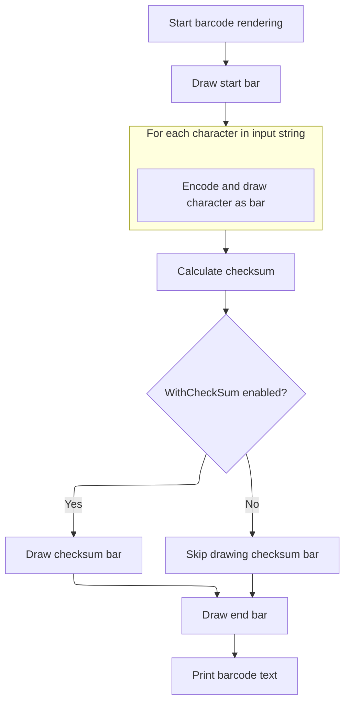

This document describes the process of generating and displaying a <SwmToken path="BARCODE/Bar39.cls" pos="25:2:2" line-data="Function Code39(zObj As Object, zBarH As Integer, BarText As String, Optional zWithCheckSum As Boolean = False)">`Code39`</SwmToken> barcode. The flow receives a string and drawing object, sets up encoding tables, validates the input, and renders the barcode graphics with optional checksum and human-readable text. This allows users to visually encode information for scanning and identification.

# Setting Up Barcode Encoding and Validation

<SwmSnippet path="/BARCODE/Bar39.cls" line="25">

---

In <SwmToken path="BARCODE/Bar39.cls" pos="25:2:2" line-data="Function Code39(zObj As Object, zBarH As Integer, BarText As String, Optional zWithCheckSum As Boolean = False)">`Code39`</SwmToken>, we start by setting up the drawing object and checksum flag, then immediately call <SwmToken path="BARCODE/Bar39.cls" pos="28:1:1" line-data="   Init_Table">`Init_Table`</SwmToken> to load the character set and barcode patterns. This is needed before any validation or drawing, since everything else depends on knowing how to encode each character.

```apex
Function Code39(zObj As Object, zBarH As Integer, BarText As String, Optional zWithCheckSum As Boolean = False)
   Set xObj = zObj
   WithCheckSum = zWithCheckSum
   Init_Table
```

---

</SwmSnippet>

<SwmSnippet path="/BARCODE/Bar39.cls" line="94">

---

<SwmToken path="BARCODE/Bar39.cls" pos="94:4:4" line-data="Private Sub Init_Table()">`Init_Table`</SwmToken> loads the valid characters for Code 39 into <SwmToken path="BARCODE/Bar39.cls" pos="95:1:1" line-data="    Code_A = &quot;01234567890ABCD2FGHIJKLMNOPQRSTUVWXYZ-. $/+%&quot;">`Code_A`</SwmToken> and their barcode patterns into <SwmToken path="BARCODE/Bar39.cls" pos="96:1:1" line-data="    Code_B = Array( _">`Code_B`</SwmToken>. Each character's pattern is at the same index in both, so encoding is just a lookup.

```apex
Private Sub Init_Table()
    Code_A = "01234567890ABCD2FGHIJKLMNOPQRSTUVWXYZ-. $/+%"
    Code_B = Array( _
             "101001101101", "110100101011", "101100101011", "110110010101", "101001101011", "110100110101", _
             "101100110101", "101001011011", "110100101101", "101100101101", "110101001011", "101101001011", _
             "110110100101", "101011001011", "110101100101", "101101100101", "101010011011", "110101001101", _
             "101101001101", "101011001101", "110101010011", "101101010011", "110110101001", "101011010011", _
             "110101101001", "101101101001", "101010110011", "110101011001", "101101011001", "101011011001", _
             "110010101011", "100110101011", "110011010101", "100101101011", "110010110101", "100110110101", _
             "100101011011", "110010101101", "100110101101", "100100100101", "100100101001", "100101001001", _
             "101001001001", "100101101101" _
             )
End Sub
```

---

</SwmSnippet>

<SwmSnippet path="/BARCODE/Bar39.cls" line="29">

---

Back in <SwmToken path="BARCODE/Bar39.cls" pos="25:2:2" line-data="Function Code39(zObj As Object, zBarH As Integer, BarText As String, Optional zWithCheckSum As Boolean = False)">`Code39`</SwmToken>, after returning from <SwmToken path="BARCODE/Bar39.cls" pos="28:1:1" line-data="   Init_Table">`Init_Table`</SwmToken>, we validate the input with <SwmToken path="BARCODE/Bar39.cls" pos="32:5:5" line-data="   If Not CheckCode Then Exit Sub">`CheckCode`</SwmToken>, set up the drawing surface (size, colors, scaling), and then call <SwmToken path="BARCODE/Bar39.cls" pos="44:1:1" line-data="   Paint_Bar zBarText">`Paint_Bar`</SwmToken> to actually render the barcode using the prepared settings and tables.

```apex
   zBarText = BarText
   xObj.Cls
   
   If Not CheckCode Then Exit Sub
   
   BarH = zBarH * 10
   xtop = 10
   
   xObj.BackColor = vbWhite
   xObj.AutoRedraw = True
   xObj.ScaleMode = 3
   
   xObj.Height = (xObj.TextHeight(zBarText) + BarH + 25) * Screen.TwipsPerPixelY
   xObj.Width = ((Len(zBarText) * 11)) * 20  'Screen.TwipsPerPixelX
   
   Paint_Bar zBarText
```

---

</SwmSnippet>

## Rendering the Barcode Graphics



<SwmSnippet path="/BARCODE/Bar39.cls" line="61">

---

In <SwmToken path="BARCODE/Bar39.cls" pos="61:4:4" line-data="Private Sub Paint_Bar(xstr As String)">`Paint_Bar`</SwmToken>, we reset the drawing position and checksum accumulator, draw the start bar, then loop through each character, calculate its position, update the checksum, and call <SwmToken path="BARCODE/Bar39.cls" pos="67:1:1" line-data="    Draw_Bar CStr(Code_B(ChkChar))">`Draw_Bar`</SwmToken> to render each character's pattern. After the loop, we handle the checksum bar (if needed) and draw the stop bar.

```apex
Private Sub Paint_Bar(xstr As String)
    Dim ii As Long, jj As Integer, ctr As Integer
    xTotal = 0
    xPos = 1
    posCtr = 0
    
    Draw_Bar CStr(Code_B(ChkChar))
    
    For ii = 1 To Len(xstr)
        posCtr = InStr(xstr, Mid(xstr, ii, 1))
        
        xTotal = xTotal + posCtr
        
        Draw_Bar CStr(Code_B(posCtr))
        
    Next
    chkSum = xTotal Mod 43
    
    If WithCheckSum Then Draw_Bar CStr(Code_B(chkSum))
    
    Draw_Bar CStr(Code_B(ChkChar))
```

---

</SwmSnippet>

<SwmSnippet path="/BARCODE/Bar39.cls" line="87">

---

<SwmToken path="BARCODE/Bar39.cls" pos="87:4:4" line-data="Private Sub Draw_Bar(Encoding As String)">`Draw_Bar`</SwmToken> loops through the encoding string, moving the x position and drawing a vertical line for each bit—black for '1', white for '0'—to build up the barcode pattern visually.

```apex
Private Sub Draw_Bar(Encoding As String)
    Dim ii As Integer
    For ii = 1 To Len(Encoding)
        xPos = xPos + 1
        xObj.Line (xPos + 10, xtop)-(xPos + 10, xtop + BarH), IIf(Mid(Encoding, ii, 1), vbBlack, vbWhite)
    Next
End Sub
```

---

</SwmSnippet>

<SwmSnippet path="/BARCODE/Bar39.cls" line="82">

---

After all the calls to <SwmToken path="BARCODE/Bar39.cls" pos="67:1:1" line-data="    Draw_Bar CStr(Code_B(ChkChar))">`Draw_Bar`</SwmToken> in <SwmToken path="BARCODE/Bar39.cls" pos="44:1:1" line-data="   Paint_Bar zBarText">`Paint_Bar`</SwmToken>, we set the print position and output the input string below the barcode so it's human-readable and centered under the bars.

```apex
    
    xObj.CurrentX = ((xPos + 20) / 2) - xObj.TextWidth(xstr) / 2   ' Horizontal position.
    xObj.CurrentY = 15 + BarH    ' Vertical position.
    xObj.Print xstr   ' Print message.
End Sub
```

---

</SwmSnippet>

## Finalizing the Barcode Output

<SwmSnippet path="/BARCODE/Bar39.cls" line="45">

---

Back in <SwmToken path="BARCODE/Bar39.cls" pos="25:2:2" line-data="Function Code39(zObj As Object, zBarH As Integer, BarText As String, Optional zWithCheckSum As Boolean = False)">`Code39`</SwmToken>, after returning from <SwmToken path="BARCODE/Bar39.cls" pos="44:1:1" line-data="   Paint_Bar zBarText">`Paint_Bar`</SwmToken>, there's nothing else to do—the barcode is already rendered on the drawing object. The commented-out line suggests copying the image, but it's not active.

```apex
   'xPic.Picture = me.Picture
End Function
```

---

</SwmSnippet>

&nbsp;

*This is an auto-generated document by Swimm 🌊 and has not yet been verified by a human*

<SwmMeta version="3.0.0" repo-id="Z2l0aHViJTNBJTNBY3RzLVZCNi1Qcm9qZWN0cyUzQSUzQVN3aW1tLURlbW8=" repo-name="cts-VB6-Projects"><sup>Powered by [Swimm](https://app.swimm.io/)</sup></SwmMeta>
