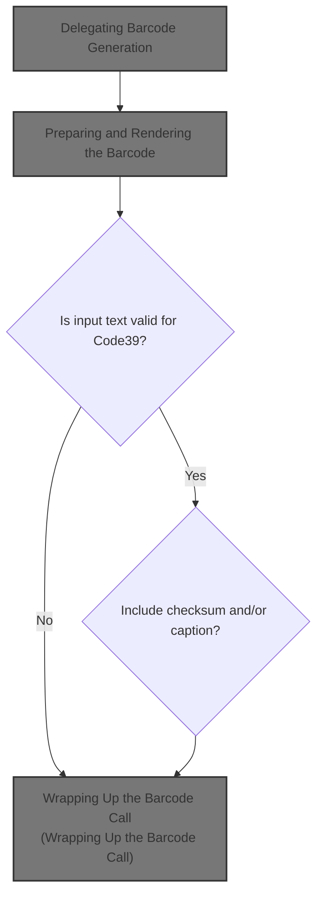
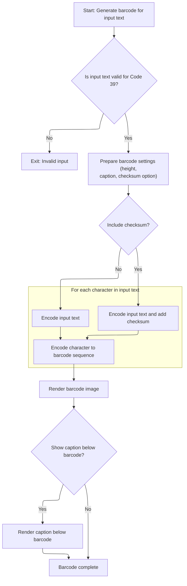

This document describes how users can generate and visualize a <SwmToken path="BARCODE/arisBarcode.cls" pos="18:2:2" line-data="Function Code39(zObj As Object, zBarH As Double, BarText As String, Optional zWithCheckSum As Boolean = False, Optional ByVal HasCaption As Boolean = False)">`Code39`</SwmToken> barcode by providing text and options such as height, checksum, and caption. The system prepares the barcode settings, validates the input, encodes the text, and renders the barcode image for display.



# Delegating Barcode Generation

<SwmSnippet path="/BARCODE/arisBarcode.cls" line="18">

---

In <SwmToken path="BARCODE/arisBarcode.cls" pos="18:2:2" line-data="Function Code39(zObj As Object, zBarH As Double, BarText As String, Optional zWithCheckSum As Boolean = False, Optional ByVal HasCaption As Boolean = False)">`Code39`</SwmToken>, all parameters are passed straight to <SwmToken path="BARCODE/arisBarcode.cls" pos="19:1:1" line-data="    Bar39 zObj, zBarH, BarText, zWithCheckSum, HasCaption">`Bar39`</SwmToken> without changes. This just hands off the work, making <SwmToken path="BARCODE/arisBarcode.cls" pos="18:2:2" line-data="Function Code39(zObj As Object, zBarH As Double, BarText As String, Optional zWithCheckSum As Boolean = False, Optional ByVal HasCaption As Boolean = False)">`Code39`</SwmToken> a simple alias for the actual barcode logic in <SwmToken path="BARCODE/arisBarcode.cls" pos="19:1:1" line-data="    Bar39 zObj, zBarH, BarText, zWithCheckSum, HasCaption">`Bar39`</SwmToken>. Calling <SwmPath>[BARCODE/Code39.bas](BARCODE/Code39.bas)</SwmPath> next is necessary because that's where the barcode is actually generated and drawn.

```apex
Function Code39(zObj As Object, zBarH As Double, BarText As String, Optional zWithCheckSum As Boolean = False, Optional ByVal HasCaption As Boolean = False)
    Bar39 zObj, zBarH, BarText, zWithCheckSum, HasCaption
```

---

</SwmSnippet>

## Preparing and Rendering the Barcode



<SwmSnippet path="/BARCODE/Code39.bas" line="15">

---

In <SwmToken path="BARCODE/Code39.bas" pos="15:2:2" line-data="Sub Bar39(Obj As Object, BarH As Double, BarText As String, Optional WithCheckSum As Boolean = False, Optional ByVal HasCaption As Boolean = False)">`Bar39`</SwmToken>, the barcode height is converted to pixels for drawing, and setup functions like <SwmToken path="BARCODE/Code39.bas" pos="22:1:1" line-data="   Init_Table">`Init_Table`</SwmToken> are called to prep encoding tables. Input validation happens right after, so if the string isn't valid for <SwmToken path="BARCODE/arisBarcode.cls" pos="18:2:2" line-data="Function Code39(zObj As Object, zBarH As Double, BarText As String, Optional zWithCheckSum As Boolean = False, Optional ByVal HasCaption As Boolean = False)">`Code39`</SwmToken>, nothing is drawn.

```visual basic
Sub Bar39(Obj As Object, BarH As Double, BarText As String, Optional WithCheckSum As Boolean = False, Optional ByVal HasCaption As Boolean = False)
   Set zObj = Obj
   zWithCheckSum = WithCheckSum
   zBarText = BarText
   zHasCaption = HasCaption
   zBarH = BarH * 72 'Inches to Pixel of barcode
   
   Init_Table
```

---

</SwmSnippet>

<SwmSnippet path="/BARCODE/Code39.bas" line="97">

---

<SwmToken path="BARCODE/Code39.bas" pos="97:4:4" line-data="Private Sub Init_Table()">`Init_Table`</SwmToken> sets up the valid character set and the encoding patterns for each character. These arrays are used later to translate input text into barcode lines.

```visual basic
Private Sub Init_Table()
    CharSet = "0123456789ABCDEFGHIJKLMNOPQRSTUVWXYZ-. $/+%*"
    arrEncoding = Array( _
             "101001101101", "110100101011", "101100101011", "110110010101", "101001101011", "110100110101", _
             "101100110101", "101001011011", "110100101101", "101100101101", "110101001011", "101101001011", _
             "110110100101", "101011001011", "110101100101", "101101100101", "101010011011", "110101001101", _
             "101101001101", "101011001101", "110101010011", "101101010011", "110110101001", "101011010011", _
             "110101101001", "101101101001", "101010110011", "110101011001", "101101011001", "101011011001", _
             "110010101011", "100110101011", "110011010101", "100101101011", "110010110101", "100110110101", _
             "100101011011", "110010101101", "100110101101", "100100100101", "100100101001", "100101001001", _
             "101001001001", "100101101101" _
             )
End Sub
```

---

</SwmSnippet>

<SwmSnippet path="/BARCODE/Code39.bas" line="23">

---

Back in <SwmToken path="BARCODE/arisBarcode.cls" pos="19:1:1" line-data="    Bar39 zObj, zBarH, BarText, zWithCheckSum, HasCaption">`Bar39`</SwmToken>, after setting up tables and validating input, <SwmToken path="BARCODE/Code39.bas" pos="26:1:1" line-data="   Eval_String">`Eval_String`</SwmToken> is called to turn the input text into a sequence of barcode character positions. This is needed before any drawing can happen.

```visual basic
   
   If Not CheckCode Then Exit Sub 'Check the String if Valid in Code 39
   
   Eval_String
```

---

</SwmSnippet>

<SwmSnippet path="/BARCODE/Code39.bas" line="61">

---

<SwmToken path="BARCODE/Code39.bas" pos="61:4:4" line-data="Private Sub Eval_String()">`Eval_String`</SwmToken> builds the sequence of barcode character positions, adds start/end markers, and optionally appends a checksum. This collection is what gets rendered as the barcode.

```visual basic
Private Sub Eval_String()
    Dim i As Long, chkSum As Integer, xTotal As Integer, posCtr As Integer
    Set myCols = New Collection
 
    xTotal = 0
    posCtr = 0
    
    myCols.Add ChkChar 'Start of Barcode
    
    For i = 1 To Len(zBarText)
        posCtr = InStr(CharSet, Mid(zBarText, i, 1)) - 1
        xTotal = xTotal + posCtr
        myCols.Add posCtr
    Next
    
    chkSum = xTotal Mod 43
    If zWithCheckSum Then myCols.Add chkSum 'Check sum
    myCols.Add ChkChar 'End of Barcode
End Sub
```

---

</SwmSnippet>

<SwmSnippet path="/BARCODE/Code39.bas" line="27">

---

Back in <SwmToken path="BARCODE/arisBarcode.cls" pos="19:1:1" line-data="    Bar39 zObj, zBarH, BarText, zWithCheckSum, HasCaption">`Bar39`</SwmToken>, the drawing surface is reset, object dimensions are set based on barcode and caption, and then <SwmToken path="BARCODE/Code39.bas" pos="42:1:1" line-data="   Draw_Barcode">`Draw_Barcode`</SwmToken> is called to actually render the barcode.

```visual basic
   
   zObj.Picture = Nothing
   zObj.BackColor = vbWhite
   zObj.AutoRedraw = True
   zObj.ScaleMode = 3
   
   If zHasCaption Then
      zObj.Height = (zObj.TextHeight(zBarText) + zBarH + 5) * Screen.TwipsPerPixelY
   Else
      zObj.Height = zBarH * Screen.TwipsPerPixelY
   End If
   
   zObj.Height = zObj.Height + 10 ' Border
   zObj.Width = ((myCols.Count + 1) * 12) * Screen.TwipsPerPixelX
   
   Draw_Barcode
```

---

</SwmSnippet>

<SwmSnippet path="/BARCODE/Code39.bas" line="80">

---

<SwmToken path="BARCODE/Code39.bas" pos="80:4:4" line-data="Private Sub Draw_Barcode()">`Draw_Barcode`</SwmToken> loops through each barcode character, uses its encoding to draw the black/white lines, and centers the caption below if needed.

```visual basic
Private Sub Draw_Barcode()
    Dim encoding As String, i As Integer, j As Integer, xPos As Integer
    xPos = 5 'zBorder / 2
    For i = 1 To myCols.Count
        encoding = arrEncoding(myCols(i))
        For j = 1 To Len(encoding)
            xPos = xPos + 1
            zObj.Line (xPos, 5)-(xPos, zBarH), IIf(Mid(encoding, j, 1), vbBlack, vbWhite)
        Next
    Next
    
    If zHasCaption Then
        zObj.CurrentX = ((myCols.Count * 12) - zObj.TextWidth(zBarText)) / 2   '(zObj.Width - zObj.TextWidth(zBarText) / 2)    ' Horizontal position.
        zObj.CurrentY = zObj.CurrentY + 5    ' Vertical position.
        zObj.Print zBarText   ' Print message.
    End If
End Sub
```

---

</SwmSnippet>

<SwmSnippet path="/BARCODE/Code39.bas" line="43">

---

Finally, after <SwmToken path="BARCODE/Code39.bas" pos="42:1:1" line-data="   Draw_Barcode">`Draw_Barcode`</SwmToken> runs, the rendered image is assigned to the control's Picture property so the barcode shows up.

```visual basic
   zObj.Picture = zObj.Image
End Sub
```

---

</SwmSnippet>

## Wrapping Up the Barcode Call

<SwmSnippet path="/BARCODE/arisBarcode.cls" line="20">

---

Back in <SwmToken path="BARCODE/arisBarcode.cls" pos="18:2:2" line-data="Function Code39(zObj As Object, zBarH As Double, BarText As String, Optional zWithCheckSum As Boolean = False, Optional ByVal HasCaption As Boolean = False)">`Code39`</SwmToken>, nothing else happens after <SwmToken path="BARCODE/arisBarcode.cls" pos="19:1:1" line-data="    Bar39 zObj, zBarH, BarText, zWithCheckSum, HasCaption">`Bar39`</SwmToken> returns. The function just ends, since all work is delegated.

```apex
End Function
```

---

</SwmSnippet>

&nbsp;

*This is an auto-generated document by Swimm 🌊 and has not yet been verified by a human*

<SwmMeta version="3.0.0" repo-id="Z2l0aHViJTNBJTNBY3RzLVZCNi1Qcm9qZWN0cyUzQSUzQVN3aW1tLURlbW8=" repo-name="cts-VB6-Projects"><sup>Powered by [Swimm](https://app.swimm.io/)</sup></SwmMeta>
