This document outlines the guest check-out process in the hotel management system. When a check-out is requested, the system verifies the guest's balance, confirms the action, updates records, and generates a final folio report. The process ensures all financial and operational steps are completed before the guest is checked out.

# Processing Guest Checkout and Handling Errors

```mermaid
%%{init: {"flowchart": {"defaultRenderer": "elk"}} }%%
flowchart TD
    node1["Start check-out process"] --> node2{"Is guest balance zero?"}
    click node1 openCode "HotelManagementSystem/Forms/frmCheckOut.frm:576:579"
    node2 -->|"Balance not zero"| node3["Show warning: Remaining balance"]
    click node2 openCode "HotelManagementSystem/Forms/frmCheckOut.frm:579:583"
    click node3 openCode "HotelManagementSystem/Forms/frmCheckOut.frm:580:582"
    node2 -->|"Balance zero"| node4{"User confirms check-out?"}
    click node4 openCode "HotelManagementSystem/Forms/frmCheckOut.frm:585:585"
    node4 -->|"No"| node5["Exit check-out process"]
    click node5 openCode "HotelManagementSystem/Forms/frmCheckOut.frm:585:585"
    node4 -->|"Yes"| node6["Begin transaction"]
    click node6 openCode "HotelManagementSystem/Forms/frmCheckOut.frm:587:587"
    node6 --> node7["Save payment and other charges"]
    click node7 openCode "HotelManagementSystem/Forms/frmCheckOut.frm:591:592"
    node7 --> node8["Update room status to 'Checked Out'
(RoomStatusID = 3)"]
    click node8 openCode "HotelManagementSystem/Forms/frmCheckOut.frm:589:589"
    node8 --> node9["Delete guest inventory record"]
    click node9 openCode "HotelManagementSystem/Forms/frmCheckOut.frm:594:599"
    node9 --> node10["Update guest record to 'Check Out'
(Status = 'Check Out')"]
    click node10 openCode "HotelManagementSystem/Forms/frmCheckOut.frm:600:608"
    node10 --> node11["Commit transaction"]
    click node11 openCode "HotelManagementSystem/Forms/frmCheckOut.frm:611:611"
    node11 --> node12["Generate folio report"]
    click node12 openCode "HotelManagementSystem/Forms/frmCheckOut.frm:613:613"
    node12 --> node13["Close guest record and unload form"]
    click node13 openCode "HotelManagementSystem/Forms/frmCheckOut.frm:615:618"

classDef HeadingStyle fill:#777777,stroke:#333,stroke-width:2px;

%% Swimm:
%% %%{init: {"flowchart": {"defaultRenderer": "elk"}} }%%
%% flowchart TD
%%     node1["Start check-out process"] --> node2{"Is guest balance zero?"}
%%     click node1 openCode "<SwmPath>[HotelManagementSystem/Forms/frmCheckOut.frm](HotelManagementSystem/Forms/frmCheckOut.frm)</SwmPath>:576:579"
%%     node2 -->|"Balance not zero"| node3["Show warning: Remaining balance"]
%%     click node2 openCode "<SwmPath>[HotelManagementSystem/Forms/frmCheckOut.frm](HotelManagementSystem/Forms/frmCheckOut.frm)</SwmPath>:579:583"
%%     click node3 openCode "<SwmPath>[HotelManagementSystem/Forms/frmCheckOut.frm](HotelManagementSystem/Forms/frmCheckOut.frm)</SwmPath>:580:582"
%%     node2 -->|"Balance zero"| node4{"User confirms check-out?"}
%%     click node4 openCode "<SwmPath>[HotelManagementSystem/Forms/frmCheckOut.frm](HotelManagementSystem/Forms/frmCheckOut.frm)</SwmPath>:585:585"
%%     node4 -->|"No"| node5["Exit check-out process"]
%%     click node5 openCode "<SwmPath>[HotelManagementSystem/Forms/frmCheckOut.frm](HotelManagementSystem/Forms/frmCheckOut.frm)</SwmPath>:585:585"
%%     node4 -->|"Yes"| node6["Begin transaction"]
%%     click node6 openCode "<SwmPath>[HotelManagementSystem/Forms/frmCheckOut.frm](HotelManagementSystem/Forms/frmCheckOut.frm)</SwmPath>:587:587"
%%     node6 --> node7["Save payment and other charges"]
%%     click node7 openCode "<SwmPath>[HotelManagementSystem/Forms/frmCheckOut.frm](HotelManagementSystem/Forms/frmCheckOut.frm)</SwmPath>:591:592"
%%     node7 --> node8["Update room status to 'Checked Out'
%% (<SwmToken path="HotelManagementSystem/Forms/frmCheckOut.frm" pos="589:12:12" line-data="    ChangeValue CN, &quot;Rooms&quot;, &quot;RoomStatusID&quot;, 3, True, &quot;WHERE RoomNumber = &quot; &amp; txtRoomNumber.Text">`RoomStatusID`</SwmToken> = 3)"]
%%     click node8 openCode "<SwmPath>[HotelManagementSystem/Forms/frmCheckOut.frm](HotelManagementSystem/Forms/frmCheckOut.frm)</SwmPath>:589:589"
%%     node8 --> node9["Delete guest inventory record"]
%%     click node9 openCode "<SwmPath>[HotelManagementSystem/Forms/frmCheckOut.frm](HotelManagementSystem/Forms/frmCheckOut.frm)</SwmPath>:594:599"
%%     node9 --> node10["Update guest record to 'Check Out'
%% (Status = 'Check Out')"]
%%     click node10 openCode "<SwmPath>[HotelManagementSystem/Forms/frmCheckOut.frm](HotelManagementSystem/Forms/frmCheckOut.frm)</SwmPath>:600:608"
%%     node10 --> node11["Commit transaction"]
%%     click node11 openCode "<SwmPath>[HotelManagementSystem/Forms/frmCheckOut.frm](HotelManagementSystem/Forms/frmCheckOut.frm)</SwmPath>:611:611"
%%     node11 --> node12["Generate folio report"]
%%     click node12 openCode "<SwmPath>[HotelManagementSystem/Forms/frmCheckOut.frm](HotelManagementSystem/Forms/frmCheckOut.frm)</SwmPath>:613:613"
%%     node12 --> node13["Close guest record and unload form"]
%%     click node13 openCode "<SwmPath>[HotelManagementSystem/Forms/frmCheckOut.frm](HotelManagementSystem/Forms/frmCheckOut.frm)</SwmPath>:615:618"
%% 
%% classDef HeadingStyle fill:#777777,stroke:#333,stroke-width:2px;
```



<SwmSnippet path="/HotelManagementSystem/Forms/frmCheckOut.frm" line="576">

---

In <SwmToken path="HotelManagementSystem/Forms/frmCheckOut.frm" pos="576:4:4" line-data="Private Sub cmdCheckOut_Click()">`cmdCheckOut_Click`</SwmToken>, we block checkout if the guest still owes money, prompt the user for confirmation, start a DB transaction, and update the room status to available. We call <SwmToken path="HotelManagementSystem/Forms/frmCheckOut.frm" pos="589:1:1" line-data="    ChangeValue CN, &quot;Rooms&quot;, &quot;RoomStatusID&quot;, 3, True, &quot;WHERE RoomNumber = &quot; &amp; txtRoomNumber.Text">`ChangeValue`</SwmToken> next to handle the room status update in the database.

```visual basic
Private Sub cmdCheckOut_Click()
    On Error GoTo err
    
    If txtBalance.Text <> "0.00" Then
        MsgBox "There's still remaining balance for this guest.", vbExclamation
        
        Exit Sub
    End If
    
    If MsgBox("Are you sure you want to Check Out?", vbYesNo + vbInformation) = vbNo Then Exit Sub
    
    CN.BeginTrans
    
    ChangeValue CN, "Rooms", "RoomStatusID", 3, True, "WHERE RoomNumber = " & txtRoomNumber.Text
```

---

</SwmSnippet>

<SwmSnippet path="/HotelManagementSystem/Modules/modProcedure.bas" line="247">

---

<SwmToken path="HotelManagementSystem/Modules/modProcedure.bas" pos="247:4:4" line-data="Public Sub ChangeValue(ByRef srcCN As Connection, ByVal srcTable As String, ByVal srcField As String, ByVal srcValue As String, Optional isNumber As Boolean, Optional srcCondition As String)">`ChangeValue`</SwmToken> builds and executes an UPDATE SQL statement, handling numbers and strings correctly, and applies a WHERE clause if provided. This is used to update the room status in the DB during checkout.

```visual basic
Public Sub ChangeValue(ByRef srcCN As Connection, ByVal srcTable As String, ByVal srcField As String, ByVal srcValue As String, Optional isNumber As Boolean, Optional srcCondition As String)
    If srcCondition <> vbNullString Then srcCondition = " " & srcCondition
    If isNumber = True Then
        srcCN.Execute "UPDATE " & srcTable & " SET " & srcField & " =" & srcValue & " " & srcCondition
    Else
        srcCN.Execute "UPDATE " & srcTable & " SET " & srcField & " ='" & srcValue & "'" & srcCondition
    End If
End Sub
```

---

</SwmSnippet>

<SwmSnippet path="/HotelManagementSystem/Forms/frmCheckOut.frm" line="590">

---

Back in <SwmToken path="HotelManagementSystem/Forms/frmCheckOut.frm" pos="576:4:4" line-data="Private Sub cmdCheckOut_Click()">`cmdCheckOut_Click`</SwmToken>, after updating the room status, we save payment and other charges, clean up inventory records, update folio details, and commit the transaction. We call <SwmToken path="HotelManagementSystem/Forms/frmCheckOut.frm" pos="613:3:3" line-data="    Call PrintFolio">`PrintFolio`</SwmToken> next to generate the guest's final statement for checkout.

```visual basic

    Call frmPayment.cmdSave_Click
    Call frmOtherCharges.cmdSave_Click

    With RS
        'Delete record from Inventory
        CN.Execute "DELETE ID, Status " & _
                    "From [Inventory] " & _
                    "WHERE ID='" & .Fields("FolioNumber") & "' AND Status='Check In'"
        
        .Fields("DateOut") = dtpDateOut.Value
        .Fields("OtherCharges") = txtOtherCharges.Text
        .Fields("Discount") = txtDiscount.Text
        .Fields("AmountPaid") = txtAmountPaid.Text
        .Fields("Days") = txtDays.Text
        .Fields("Status") = "Check Out"
        .Fields("CheckOutBy") = CurrUser.USER_PK
        
        .Update
    End With
    
    CN.CommitTrans
    
    Call PrintFolio
```

---

</SwmSnippet>

<SwmSnippet path="/HotelManagementSystem/Forms/frmCheckOut.frm" line="628">

---

<SwmToken path="HotelManagementSystem/Forms/frmCheckOut.frm" pos="628:4:4" line-data="Private Sub PrintFolio()">`PrintFolio`</SwmToken> sets up and displays the folio report for the checked-out guest, filtering by folio number and status to show only the final, relevant record.

```visual basic
Private Sub PrintFolio()
    With frmReports
        .strReport = "Folio"
        
        .strWhere = "{qry_RPT_Customers.FolioNumber} = '" & txtGuestName.Tag & "' AND {qry_RPT_Customers.Status} = 'Check Out'"

        frmReports.Show vbModal
    End With
End Sub
```

---

</SwmSnippet>

<SwmSnippet path="/HotelManagementSystem/Forms/frmCheckOut.frm" line="614">

---

Back in <SwmToken path="HotelManagementSystem/Forms/frmCheckOut.frm" pos="624:10:10" line-data="    prompt_err err, Name, &quot;cmdCheckOut_Click&quot;">`cmdCheckOut_Click`</SwmToken>, after printing the folio, we close and release the recordset, then unload the form. If anything fails, we call <SwmToken path="HotelManagementSystem/Forms/frmCheckOut.frm" pos="624:1:1" line-data="    prompt_err err, Name, &quot;cmdCheckOut_Click&quot;">`prompt_err`</SwmToken> to handle and log the error.

```visual basic
    
    RS.Close
    Set RS = Nothing
    
    Unload Me
    
    Exit Sub

err:
    CN.RollbackTrans
    prompt_err err, Name, "cmdCheckOut_Click"
```

---

</SwmSnippet>

<SwmSnippet path="/HotelManagementSystem/Modules/modProcedure.bas" line="87">

---

<SwmToken path="HotelManagementSystem/Modules/modProcedure.bas" pos="87:4:4" line-data="Public Sub prompt_err(ByVal sError As ErrObject, ByVal ModuleName As String, ByVal OccurIn As String)">`prompt_err`</SwmToken> pops up an error message for the user and writes the error details to <SwmPath>[HotelManagementSystem/Error.log](HotelManagementSystem/Error.log)</SwmPath> for later troubleshooting.

```visual basic
Public Sub prompt_err(ByVal sError As ErrObject, ByVal ModuleName As String, ByVal OccurIn As String)
    MsgBox "Error From: " & ModuleName & vbNewLine & _
           "Occur In: " & OccurIn & vbNewLine & _
           "Error Number: " & sError.Number & vbNewLine & _
           "Description: " & sError.Description, vbCritical, "Application Error"
    'Save the error log (The save error log will be display later on in the program)
    Open App.Path & "\Error.log" For Append As #1
        Print #1, Format(Date, "MMM-dd-yyyy") & "~~~~~" & Time & "~~~~~" & sError.Number & "~~~~~" & sError.Description & "~~~~~" & ModuleName & "~~~~~" & OccurIn
    Close #1
End Sub
```

---

</SwmSnippet>

<SwmSnippet path="/HotelManagementSystem/Forms/frmCheckOut.frm" line="625">

---

Back in <SwmToken path="HotelManagementSystem/Forms/frmCheckOut.frm" pos="576:4:4" line-data="Private Sub cmdCheckOut_Click()">`cmdCheckOut_Click`</SwmToken>, after error handling, we reset the mouse pointer so the UI doesn't stay in a busy state.

```visual basic
    Screen.MousePointer = vbDefault
End Sub
```

---

</SwmSnippet>

&nbsp;

*This is an auto-generated document by Swimm 🌊 and has not yet been verified by a human*

<SwmMeta version="3.0.0" repo-id="Z2l0aHViJTNBJTNBY3RzLVZCNi1Qcm9qZWN0cyUzQSUzQVN3aW1tLURlbW8=" repo-name="cts-VB6-Projects"><sup>Powered by [Swimm](https://app.swimm.io/)</sup></SwmMeta>
