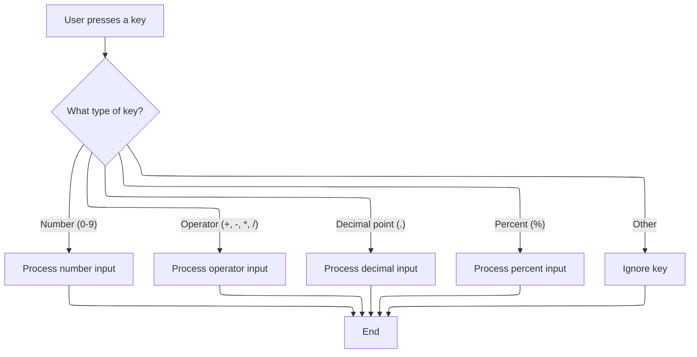

This document explains how the calculator form processes key events to update the display and perform calculations. Users can interact with the calculator using the keyboard, and the system responds by updating the display based on the type of key pressed.

# Handling Calculator Key Events



<SwmSnippet path="/warnet/Server/calculator.frm" line="904">

---

In <SwmToken path="warnet/Server/calculator.frm" pos="904:4:4" line-data="Private Sub Form_KeyPress(KeyAscii As Integer)">`Form_KeyPress`</SwmToken>, we check if the key pressed is a number (ASCII 48-57). If so, we call <SwmToken path="warnet/Server/calculator.frm" pos="907:3:3" line-data="        Call cmdNum_Click(Chr$(KeyAscii))">`cmdNum_Click`</SwmToken> with the corresponding character. This lets us reuse the same logic for both keyboard and button input, keeping things consistent.

```visual basic
Private Sub Form_KeyPress(KeyAscii As Integer)
Select Case KeyAscii
    Case 48 To 57 'Nums
        Call cmdNum_Click(Chr$(KeyAscii))
```

---

</SwmSnippet>

<SwmSnippet path="/warnet/Server/calculator.frm" line="683">

---

<SwmToken path="warnet/Server/calculator.frm" pos="683:4:4" line-data="Private Sub cmdNum_Click(Index As Integer)">`cmdNum_Click`</SwmToken> handles appending the pressed number to the display, resets calculation state if needed (like after pressing equal), and clears the display if an operator or memory button was just used. It also updates <SwmToken path="warnet/Server/calculator.frm" pos="697:1:1" line-data="            nLastNum = 0">`nLastNum`</SwmToken> for further calculations.

```visual basic
Private Sub cmdNum_Click(Index As Integer)

If bWasError Then
    Beep
    Exit Sub
End If

If bOp Or bMEM Then
    lblOutput.Caption = ""
    ElseIf lblOutput.Caption = "0" Then
        lblOutput.Caption = ""
End If

If bEqual Then
            nLastNum = 0
            nResult = 0
Else
    nLastNum = 0
End If


lblOutput.Caption = lblOutput.Caption & cmdNum(Index).Caption

nLastNum = CDbl(lblOutput.Caption)
bOp = False
bMEM = False
bEqual = False

btnFocusEqual.SetFocus

End Sub
```

---

</SwmSnippet>

<SwmSnippet path="/warnet/Server/calculator.frm" line="908">

---

Back in <SwmToken path="warnet/Server/calculator.frm" pos="904:4:4" line-data="Private Sub Form_KeyPress(KeyAscii As Integer)">`Form_KeyPress`</SwmToken>, after handling numbers, operator keys ('/', '\*', '-', '+') trigger <SwmToken path="warnet/Server/calculator.frm" pos="909:3:3" line-data="        Call cmdOP_Click(4)">`cmdOP_Click`</SwmToken> with a code for each operator. This routes operator handling to a single place, keeping the logic organized.

```visual basic
    Case 47
        Call cmdOP_Click(4)
    Case 42 '*
        Call cmdOP_Click(3)
    Case 45 '-
        Call cmdOP_Click(2)
    Case 43 '+
        Call cmdOP_Click(1)
```

---

</SwmSnippet>

<SwmSnippet path="/warnet/Server/calculator.frm" line="743">

---

<SwmToken path="warnet/Server/calculator.frm" pos="743:4:4" line-data="Private Sub cmdOP_Click(Index As Integer)">`cmdOP_Click`</SwmToken> manages operator presses, handles calculation logic, prevents double calculations after equal, and updates the display. It also checks for division by zero and error states.

```visual basic
Private Sub cmdOP_Click(Index As Integer)

On Error GoTo CheckIfOverFlowErr 'Check if we passed the Max Double Var Value's


If bWasError Then
    Beep
    Exit Sub
End If

If bOp = True And bEqual = False Then 'If the user has dbl clicked on an operator
 nOp = Index 'Remember the last operatore
 Exit Sub 'And..Exit sub
    ElseIf bEqual = True And bOp = True Then 'A MAJOR exeption! - If the user has pressed equal but Before it , pressed on an Operator (i.e - "3","+","=" ...)
        If nOp = 1 Or nOp = 2 Then 'So if the operator was "+ or - " ,
            nLastNum = 0 'Reset last num because we Don't Want to calculate Twice(First when OP was pressed and Second time when Equal was pressed)
                Else
                    nLastNum = 1 'If the last operator was "*" or "\" DO th Same(i.e - reset the last number) BUT ,don't put a Zero on it! because it will cause an Error when_
                    'the Next Calculation will take place(i.e - (38 * 0)+ 1=1 ->a wronge calculation   BUT  (38+0)+1=39 ->a correct calculation)
        End If
End If


If nOp = 0 Then
    nResult = CDbl(lblOutput.Caption)
End If

Select Case nOp

    Case 1 '+
        nResult = nResult + nLastNum
    Case 2 '-
        nResult = nResult - nLastNum
    Case 3 '*
        nResult = nResult * nLastNum
    Case 4 '/
        
        If nLastNum = 0 Then
            lblOutput.Caption = "Cannot divide by zero."
            bWasError = True
            Exit Sub
            Else
                nResult = nResult / nLastNum
        End If
        
End Select

nOp = Index
bOp = True
bEqual = False
lblOutput.Caption = nResult

If Left$(lblOutput.Caption, 1) = "." Then
    lblOutput.Caption = "0" & nResult
End If

btnFocusEqual.SetFocus

Exit Sub
CheckIfOverFlowErr:

If Err.Number = 6 Then
    lblOutput.Caption = "Value is over max calculation limit."
    bWasError = True
End If

End Sub
```

---

</SwmSnippet>

<SwmSnippet path="/warnet/Server/calculator.frm" line="916">

---

Back in <SwmToken path="warnet/Server/calculator.frm" pos="904:4:4" line-data="Private Sub Form_KeyPress(KeyAscii As Integer)">`Form_KeyPress`</SwmToken>, after operator handling, pressing the dot key calls <SwmToken path="warnet/Server/calculator.frm" pos="917:3:3" line-data="        Call cmdDot_Click">`cmdDot_Click`</SwmToken>. This ensures decimal input is processed correctly and only one dot is allowed in the display.

```visual basic
    Case 46 'Dot
        Call cmdDot_Click
```

---

</SwmSnippet>

<SwmSnippet path="/warnet/Server/calculator.frm" line="594">

---

<SwmToken path="warnet/Server/calculator.frm" pos="594:4:4" line-data="Private Sub cmdDot_Click()">`cmdDot_Click`</SwmToken> adds a decimal point to the display if allowed, handles cases where the display is empty or just after an operator, and blocks multiple dots.

```visual basic
Private Sub cmdDot_Click()
If bWasError Then
    Beep
    Exit Sub
End If
If bOp = True Then
    lblOutput.Caption = ""
    nLastNum = 0 '!'
End If
If InStr(lblOutput.Caption, ".") = 0 And lblOutput.Caption <> "" Then
    lblOutput.Caption = lblOutput.Caption & "."
    ElseIf lblOutput.Caption = "" Then
        lblOutput.Caption = "0." & lblOutput.Caption
        Else
        Beep
End If
bOp = False
End Sub
```

---

</SwmSnippet>

<SwmSnippet path="/warnet/Server/calculator.frm" line="918">

---

Back in <SwmToken path="warnet/Server/calculator.frm" pos="904:4:4" line-data="Private Sub Form_KeyPress(KeyAscii As Integer)">`Form_KeyPress`</SwmToken>, after handling the dot, pressing the percent key calls <SwmToken path="warnet/Server/calculator.frm" pos="919:3:3" line-data="        Call cmdPercent_Click">`cmdPercent_Click`</SwmToken>. This lets the user quickly calculate percentages based on the current result.

```visual basic
    Case 37 'Percent
        Call cmdPercent_Click
```

---

</SwmSnippet>

<SwmSnippet path="/warnet/Server/calculator.frm" line="811">

---

<SwmToken path="warnet/Server/calculator.frm" pos="811:4:4" line-data="Private Sub cmdPercent_Click()">`cmdPercent_Click`</SwmToken> computes the percentage of the current result using the display value and updates the display with the calculated percentage.

```visual basic
Private Sub cmdPercent_Click()

If bWasError Then
    Beep
    Exit Sub
End If

nLastNum = nResult * (CDbl(lblOutput.Caption) / 100)
lblOutput.Caption = nLastNum

End Sub
```

---

</SwmSnippet>

<SwmSnippet path="/warnet/Server/calculator.frm" line="920">

---

Finally, back in <SwmToken path="warnet/Server/calculator.frm" pos="904:4:4" line-data="Private Sub Form_KeyPress(KeyAscii As Integer)">`Form_KeyPress`</SwmToken>, after handling percent and all other supported keys, the function ends. Any unsupported key presses are ignored.

```visual basic
    End Select
End Sub
```

---

</SwmSnippet>

&nbsp;

*This is an auto-generated document by Swimm 🌊 and has not yet been verified by a human*

<SwmMeta version="3.0.0" repo-id="Z2l0aHViJTNBJTNBY3RzLVZCNi1Qcm9qZWN0cyUzQSUzQVN3aW1tLURlbW8=" repo-name="cts-VB6-Projects"><sup>Powered by [Swimm](https://app.swimm.io/)</sup></SwmMeta>
