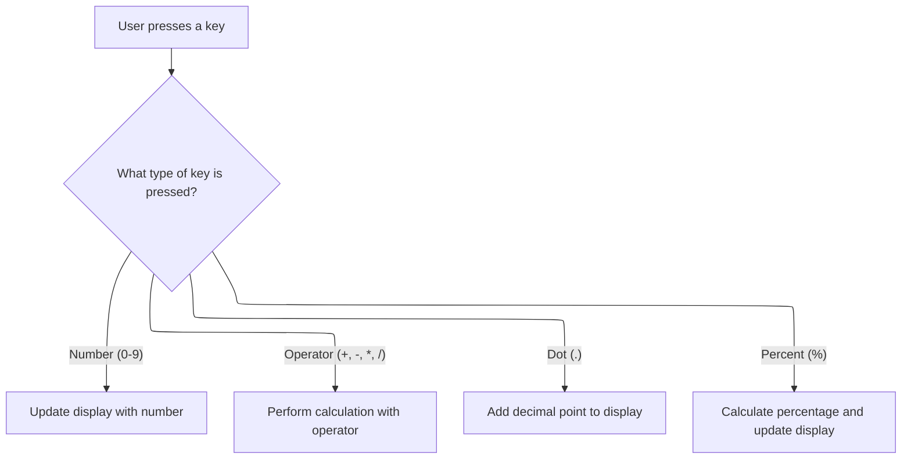

This document describes how keyboard input is handled for calculator operations. Users can operate the calculator by pressing keys, with each key mapped to the same logic as button clicks. The system updates the display and calculation state based on the key pressed.

# Handling Keyboard Input for Calculator Operations



<SwmSnippet path="/warnet/Server/timeronline.frm" line="895">

---

In <SwmToken path="warnet/Server/timeronline.frm" pos="895:4:4" line-data="Private Sub Form_KeyPress(KeyAscii As Integer)">`Form_KeyPress`</SwmToken>, keyboard input is routed to the same handlers as button clicks. For numeric keys, it calls <SwmToken path="warnet/Server/timeronline.frm" pos="898:3:3" line-data="        Call cmdNum_Click(Chr$(KeyAscii))">`cmdNum_Click`</SwmToken> with the corresponding character

```visual basic
Private Sub Form_KeyPress(KeyAscii As Integer)
Select Case KeyAscii
    Case 48 To 57 'Nums
        Call cmdNum_Click(Chr$(KeyAscii))
```

---

</SwmSnippet>

<SwmSnippet path="/warnet/Server/timeronline.frm" line="674">

---

<SwmToken path="warnet/Server/timeronline.frm" pos="674:4:4" line-data="Private Sub cmdNum_Click(Index As Integer)">`cmdNum_Click`</SwmToken> updates the display and state for number input. It clears the output if needed, resets calculation state after equals, appends the digit, updates <SwmToken path="warnet/Server/timeronline.frm" pos="688:1:1" line-data="            nLastNum = 0">`nLastNum`</SwmToken>, and ensures the calculator is ready for further input by resetting flags and focusing the equal button.

```visual basic
Private Sub cmdNum_Click(Index As Integer)

If bWasError Then
    Beep
    Exit Sub
End If

If bOp Or bMEM Then
    lblOutput.Caption = ""
    ElseIf lblOutput.Caption = "0" Then
        lblOutput.Caption = ""
End If

If bEqual Then
            nLastNum = 0
            nResult = 0
Else
    nLastNum = 0
End If


lblOutput.Caption = lblOutput.Caption & cmdNum(Index).Caption

nLastNum = CDbl(lblOutput.Caption)
bOp = False
bMEM = False
bEqual = False

btnFocusEqual.SetFocus

End Sub
```

---

</SwmSnippet>

<SwmSnippet path="/warnet/Server/timeronline.frm" line="899">

---

Back in <SwmToken path="warnet/Server/timeronline.frm" pos="895:4:4" line-data="Private Sub Form_KeyPress(KeyAscii As Integer)">`Form_KeyPress`</SwmToken>, after handling numbers, operator key presses (/, \*, -, +) are routed to <SwmToken path="warnet/Server/timeronline.frm" pos="900:3:3" line-data="        Call cmdOP_Click(4)">`cmdOP_Click`</SwmToken> with an index. This triggers the calculation logic for the selected operator, keeping keyboard and button input consistent.

```visual basic
    Case 47
        Call cmdOP_Click(4)
    Case 42 '*
        Call cmdOP_Click(3)
    Case 45 '-
        Call cmdOP_Click(2)
    Case 43 '+
        Call cmdOP_Click(1)
```

---

</SwmSnippet>

<SwmSnippet path="/warnet/Server/timeronline.frm" line="734">

---

<SwmToken path="warnet/Server/timeronline.frm" pos="734:4:4" line-data="Private Sub cmdOP_Click(Index As Integer)">`cmdOP_Click`</SwmToken> processes operator input, manages calculation state, handles edge cases like repeated operator presses and post-equal operations, performs arithmetic, and updates the display. It also handles errors like division by zero and overflow by updating the output and error state.

```visual basic
Private Sub cmdOP_Click(Index As Integer)

On Error GoTo CheckIfOverFlowErr 'Check if we passed the Max Double Var Value's


If bWasError Then
    Beep
    Exit Sub
End If

If bOp = True And bEqual = False Then 'If the user has dbl clicked on an operator
 nOp = Index 'Remember the last operatore
 Exit Sub 'And..Exit sub
    ElseIf bEqual = True And bOp = True Then 'A MAJOR exeption! - If the user has pressed equal but Before it , pressed on an Operator (i.e - "3","+","=" ...)
        If nOp = 1 Or nOp = 2 Then 'So if the operator was "+ or - " ,
            nLastNum = 0 'Reset last num because we Don't Want to calculate Twice(First when OP was pressed and Second time when Equal was pressed)
                Else
                    nLastNum = 1 'If the last operator was "*" or "\" DO th Same(i.e - reset the last number) BUT ,don't put a Zero on it! because it will cause an Error when_
                    'the Next Calculation will take place(i.e - (38 * 0)+ 1=1 ->a wronge calculation   BUT  (38+0)+1=39 ->a correct calculation)
        End If
End If


If nOp = 0 Then
    nResult = CDbl(lblOutput.Caption)
End If

Select Case nOp

    Case 1 '+
        nResult = nResult + nLastNum
    Case 2 '-
        nResult = nResult - nLastNum
    Case 3 '*
        nResult = nResult * nLastNum
    Case 4 '/
        
        If nLastNum = 0 Then
            lblOutput.Caption = "Cannot divide by zero."
            bWasError = True
            Exit Sub
            Else
                nResult = nResult / nLastNum
        End If
        
End Select

nOp = Index
bOp = True
bEqual = False
lblOutput.Caption = nResult

If Left$(lblOutput.Caption, 1) = "." Then
    lblOutput.Caption = "0" & nResult
End If

btnFocusEqual.SetFocus

Exit Sub
CheckIfOverFlowErr:

If Err.Number = 6 Then
    lblOutput.Caption = "Value is over max calculation limit."
    bWasError = True
End If

End Sub
```

---

</SwmSnippet>

<SwmSnippet path="/warnet/Server/timeronline.frm" line="907">

---

Back in <SwmToken path="warnet/Server/timeronline.frm" pos="895:4:4" line-data="Private Sub Form_KeyPress(KeyAscii As Integer)">`Form_KeyPress`</SwmToken>, after operator handling, pressing the dot key calls <SwmToken path="warnet/Server/timeronline.frm" pos="908:3:3" line-data="        Call cmdDot_Click">`cmdDot_Click`</SwmToken>. This ensures decimal input is processed correctly, only allowing a single decimal point in the current number.

```visual basic
    Case 46 'Dot
        Call cmdDot_Click
```

---

</SwmSnippet>

<SwmSnippet path="/warnet/Server/timeronline.frm" line="585">

---

<SwmToken path="warnet/Server/timeronline.frm" pos="585:4:4" line-data="Private Sub cmdDot_Click()">`cmdDot_Click`</SwmToken> manages decimal input. It clears the output if needed, checks for existing decimals, appends a dot if valid, or sets the output to '0.' if empty. Multiple dots are blocked with a beep.

```visual basic
Private Sub cmdDot_Click()
If bWasError Then
    Beep
    Exit Sub
End If
If bOp = True Then
    lblOutput.Caption = ""
    nLastNum = 0 '!'
End If
If InStr(lblOutput.Caption, ".") = 0 And lblOutput.Caption <> "" Then
    lblOutput.Caption = lblOutput.Caption & "."
    ElseIf lblOutput.Caption = "" Then
        lblOutput.Caption = "0." & lblOutput.Caption
        Else
        Beep
End If
bOp = False
End Sub
```

---

</SwmSnippet>

<SwmSnippet path="/warnet/Server/timeronline.frm" line="909">

---

Back in <SwmToken path="warnet/Server/timeronline.frm" pos="895:4:4" line-data="Private Sub Form_KeyPress(KeyAscii As Integer)">`Form_KeyPress`</SwmToken>, after handling decimal input, pressing the percent key calls <SwmToken path="warnet/Server/timeronline.frm" pos="910:3:3" line-data="        Call cmdPercent_Click">`cmdPercent_Click`</SwmToken>. This applies a percentage calculation based on the current result and the displayed value.

```visual basic
    Case 37 'Percent
        Call cmdPercent_Click
```

---

</SwmSnippet>

<SwmSnippet path="/warnet/Server/timeronline.frm" line="802">

---

<SwmToken path="warnet/Server/timeronline.frm" pos="802:4:4" line-data="Private Sub cmdPercent_Click()">`cmdPercent_Click`</SwmToken> computes the percentage by multiplying the current result by the displayed value divided by 100, updating both the state and the output label.

```visual basic
Private Sub cmdPercent_Click()

If bWasError Then
    Beep
    Exit Sub
End If

nLastNum = nResult * (CDbl(lblOutput.Caption) / 100)
lblOutput.Caption = nLastNum

End Sub
```

---

</SwmSnippet>

<SwmSnippet path="/warnet/Server/timeronline.frm" line="911">

---

Finally, after returning from <SwmToken path="warnet/Server/timeronline.frm" pos="802:4:4" line-data="Private Sub cmdPercent_Click()">`cmdPercent_Click`</SwmToken>, <SwmToken path="warnet/Server/timeronline.frm" pos="895:4:4" line-data="Private Sub Form_KeyPress(KeyAscii As Integer)">`Form_KeyPress`</SwmToken> completes the Select Case and exits, ready for the next key press. Each key press is routed to the appropriate handler, keeping keyboard and button input in sync.

```visual basic
    End Select
End Sub
```

---

</SwmSnippet>

&nbsp;

*This is an auto-generated document by Swimm 🌊 and has not yet been verified by a human*

<SwmMeta version="3.0.0" repo-id="Z2l0aHViJTNBJTNBY3RzLVZCNi1Qcm9qZWN0cyUzQSUzQVN3aW1tLURlbW8=" repo-name="cts-VB6-Projects"><sup>Powered by [Swimm](https://app.swimm.io/)</sup></SwmMeta>
