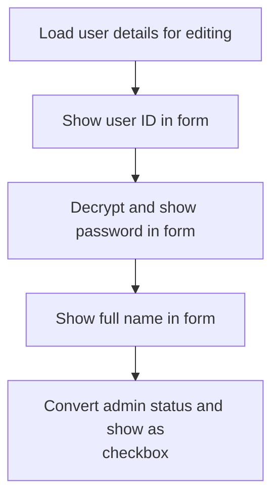

This document describes the initialization process for the user management form, supporting both adding new users and editing existing users. The form checks the mode and prepares the interface: for new users, it sets up a blank entry; for editing, it loads and converts user data for display. This enables administrators to efficiently manage user records.

# Loading User Data and Handling Add/Edit Modes

<SwmSnippet path="/HotelManagementSystem/Forms/frmUsers.frm" line="228">

---

In <SwmToken path="HotelManagementSystem/Forms/frmUsers.frm" pos="228:4:4" line-data="Private Sub Form_Load()">`Form_Load`</SwmToken>, we open the Users table for the current PK and check if we're adding or editing a user. If adding, we set up the form for a new entry, disable history, and fetch a new PK by calling <SwmToken path="HotelManagementSystem/Forms/frmUsers.frm" pos="235:5:5" line-data="        PK = getIndex(&quot;Users&quot;)">`getIndex`</SwmToken>. If editing, we prep the form for editing and will load user data next.

```visual basic
Private Sub Form_Load()
    RS.CursorLocation = adUseClient
    RS.Open "SELECT * FROM Users WHERE PK = " & PK, CN, adOpenStatic, adLockOptimistic
    'Check the form state
    If State = adStateAddMode Then
        Caption = "Create New Entry"
        cmdUsrHistory.Enabled = False
        PK = getIndex("Users")
```

---

</SwmSnippet>

<SwmSnippet path="/HotelManagementSystem/Modules/modADO.bas" line="35">

---

GetIndex grabs the next available index for a table from the key generator, increments it in a transaction, and returns the original value. This ensures unique PKs for new records.

```visual basic
Public Function getIndex(ByVal srcTable As String) As Long
    On Error GoTo err
    Dim RS As New Recordset
    Dim RI As Long
    
    RS.CursorLocation = adUseClient
    RS.Open "SELECT * FROM [KEY GENERATOR] WHERE TableName = '" & srcTable & "'", CN, adOpenStatic, adLockOptimistic
    
    RI = RS.Fields("NextNo")
    CN.BeginTrans
    RS.Fields("NextNo") = RI + 1
    RS.Update
    CN.CommitTrans
    getIndex = RI
    
    srcTable = ""
    RI = 0
    Set RS = Nothing
    Exit Function
err:
        ''Error when incounter a null value
        If err.Number = 94 Then
            getIndex = 1
            Resume Next
        Else
            MsgBox err.Description
        End If
        CN.RollbackTrans
End Function
```

---

</SwmSnippet>

<SwmSnippet path="/HotelManagementSystem/Forms/frmUsers.frm" line="236">

---

Back in <SwmToken path="HotelManagementSystem/Forms/frmUsers.frm" pos="228:4:4" line-data="Private Sub Form_Load()">`Form_Load`</SwmToken>, after handling add mode, if we're editing, we call <SwmToken path="HotelManagementSystem/Forms/frmUsers.frm" pos="238:1:1" line-data="        DisplayForEditing">`DisplayForEditing`</SwmToken> to fill the form with the current user's data so it can be updated.

```visual basic
    Else
        Caption = "Edit Entry"
        DisplayForEditing
```

---

</SwmSnippet>

## Populating the Edit Form and Handling Field Conversion



<SwmSnippet path="/HotelManagementSystem/Forms/frmUsers.frm" line="136">

---

In <SwmToken path="HotelManagementSystem/Forms/frmUsers.frm" pos="136:4:4" line-data="Private Sub DisplayForEditing()">`DisplayForEditing`</SwmToken>, we fill the form fields with user data, decrypt the password for display, and convert the Admin field from 'Y'/'N' to a checkbox value using <SwmToken path="HotelManagementSystem/Forms/frmUsers.frm" pos="144:7:7" line-data="        Check1.Value = changeYNValue(.Fields(&quot;Admin&quot;))">`changeYNValue`</SwmToken>. This makes the data usable in the UI.

```visual basic
Private Sub DisplayForEditing()
    On Error GoTo err
    
    With RS
        txtEntry(0).Text = .Fields("UserID")
        txtEntry(1).Text = Enc.DecryptString(.Fields("Password"))
        
        txtEntry(2).Text = .Fields("CompleteName")
        Check1.Value = changeYNValue(.Fields("Admin"))
```

---

</SwmSnippet>

<SwmSnippet path="/HotelManagementSystem/Modules/modFunction.bas" line="138">

---

ChangeYNValue maps 'Y'/'N' to '1'/'0' and vice versa, so the UI and database can talk to each other without confusion.

```visual basic
Public Function changeYNValue(ByVal srcStr As String) As String
    Select Case srcStr
        Case "Y": changeYNValue = "1"
        Case "N": changeYNValue = "0"
        Case "1": changeYNValue = "Y"
        Case "0": changeYNValue = "N"
    End Select
End Function
```

---

</SwmSnippet>

<SwmSnippet path="/HotelManagementSystem/Forms/frmUsers.frm" line="145">

---

Back in <SwmToken path="HotelManagementSystem/Forms/frmUsers.frm" pos="136:4:4" line-data="Private Sub DisplayForEditing()">`DisplayForEditing`</SwmToken>, after converting the Admin field, we finish populating the form. If there's a null error, we skip it and keep the form usable.

```visual basic
    End With
    
    Exit Sub
err:
        If err.Number = 94 Then Resume Next
End Sub
```

---

</SwmSnippet>

## Completing Form Initialization

<SwmSnippet path="/HotelManagementSystem/Forms/frmUsers.frm" line="239">

---

Back in <SwmToken path="HotelManagementSystem/Forms/frmUsers.frm" pos="228:4:4" line-data="Private Sub Form_Load()">`Form_Load`</SwmToken>, after <SwmToken path="HotelManagementSystem/Forms/frmUsers.frm" pos="136:4:4" line-data="Private Sub DisplayForEditing()">`DisplayForEditing`</SwmToken>, the form is fully set up for either adding or editing a user, and control returns to the user.

```visual basic
    End If
    
End Sub
```

---

</SwmSnippet>

&nbsp;

*This is an auto-generated document by Swimm 🌊 and has not yet been verified by a human*

<SwmMeta version="3.0.0" repo-id="Z2l0aHViJTNBJTNBY3RzLVZCNi1Qcm9qZWN0cyUzQSUzQVN3aW1tLURlbW8=" repo-name="cts-VB6-Projects"><sup>Powered by [Swimm](https://app.swimm.io/)</sup></SwmMeta>
