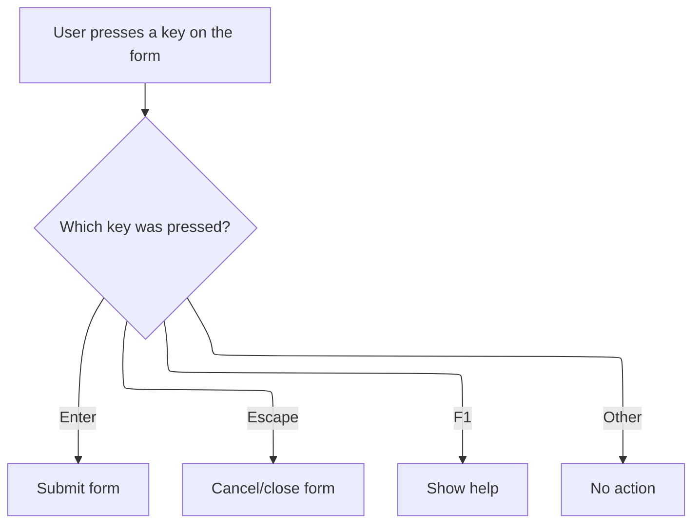

This document describes how keyboard shortcuts allow users to manage calculator actions. Pressing Backspace deletes the last digit, Escape resets the calculator, and Delete clears the current entry. The flow ensures efficient and accessible calculator operation.

# Handling Keyboard Shortcuts for Calculator Actions

<SwmSnippet path="/warnet/Server/calculator.frm" line="894">

---

In <SwmToken path="warnet/Server/calculator.frm" pos="894:4:4" line-data="Private Sub Form_KeyDown(KeyCode As Integer, Shift As Integer)">`Form_KeyDown`</SwmToken>, we check which key was pressed and route Backspace to <SwmToken path="warnet/Server/calculator.frm" pos="897:3:3" line-data="        Call CmdBS_Click">`CmdBS_Click`</SwmToken>. This lets users remove the last digit using the keyboard, mirroring the calculator's backspace button.

```visual basic
Private Sub Form_KeyDown(KeyCode As Integer, Shift As Integer)
Select Case KeyCode
    Case 8 'Backspace
        Call CmdBS_Click
```

---

</SwmSnippet>

<SwmSnippet path="/warnet/Server/calculator.frm" line="854">

---

<SwmToken path="warnet/Server/calculator.frm" pos="854:4:4" line-data="Private Sub CmdBS_Click()">`CmdBS_Click`</SwmToken> handles deleting the last digit from the display, but only if we're not in an error, just after equals, in memory mode, or right after an operator. It updates the display or resets to zero if nothing can be deleted, and keeps the internal number in sync.

```visual basic
Private Sub CmdBS_Click()

If bWasError Then
    Beep
    Exit Sub
End If

If bEqual Or bMEM Or bOp Then
    Beep
    Exit Sub
End If

Static nBSCount As Integer
If (Len(lblOutput.Caption) > 1 And CDbl(lblOutput.Caption) > 0) Or (CDbl(lblOutput.Caption) < 0 And Len(lblOutput.Caption) > 2) Then
    lblOutput.Caption = Left$(lblOutput.Caption, Len(lblOutput.Caption) - 1)
    nBSCount = nBSCount + 1
    Else
    Beep
    lblOutput.Caption = 0
End If
nLastNum = CDbl(lblOutput.Caption)
End Sub
```

---

</SwmSnippet>

<SwmSnippet path="/warnet/Server/calculator.frm" line="898">

---

Back in <SwmToken path="warnet/Server/calculator.frm" pos="894:4:4" line-data="Private Sub Form_KeyDown(KeyCode As Integer, Shift As Integer)">`Form_KeyDown`</SwmToken>, after handling Backspace, we check for Escape and call <SwmToken path="warnet/Server/calculator.frm" pos="899:3:3" line-data="        Call cmdC_Click">`cmdC_Click`</SwmToken>. This lets users clear the calculator state with a single key press.

```visual basic
    Case 27 'Escape
        Call cmdC_Click
```

---

</SwmSnippet>

<SwmSnippet path="/warnet/Server/calculator.frm" line="576">

---

<SwmToken path="warnet/Server/calculator.frm" pos="576:4:4" line-data="Private Sub cmdC_Click()">`cmdC_Click`</SwmToken> resets all calculator state—error, last number, result, operator flags, and the display—so everything is cleared for a fresh start.

```visual basic
Private Sub cmdC_Click()
bWasError = False
nLastNum = 0
nResult = 0
bOp = False
nOp = 0
bEqual = False
lblOutput.Caption = "0"

End Sub
```

---

</SwmSnippet>

<SwmSnippet path="/warnet/Server/calculator.frm" line="900">

---

Back in <SwmToken path="warnet/Server/calculator.frm" pos="894:4:4" line-data="Private Sub Form_KeyDown(KeyCode As Integer, Shift As Integer)">`Form_KeyDown`</SwmToken>, after Escape, we check for Delete and call <SwmToken path="warnet/Server/calculator.frm" pos="901:3:3" line-data="        Call cmdCE_Click">`cmdCE_Click`</SwmToken>. This clears just the current entry, not the whole calculator state.

```visual basic
    Case 46 'Del
        Call cmdCE_Click
```

---

</SwmSnippet>

## Clearing the Current Calculator Entry

<SwmSnippet path="/warnet/Server/calculator.frm" line="586">

---

In <SwmToken path="warnet/Server/calculator.frm" pos="586:4:4" line-data="Private Sub cmdCE_Click()">`cmdCE_Click`</SwmToken>, if we're in an error state, we call <SwmToken path="warnet/Server/calculator.frm" pos="588:3:3" line-data="    Call cmdC_Click">`cmdC_Click`</SwmToken> to fully reset everything before clearing the current entry. This avoids leaving the calculator in a weird state.

```visual basic
Private Sub cmdCE_Click()
If bWasError Then
    Call cmdC_Click
```

---

</SwmSnippet>

<SwmSnippet path="/warnet/Server/calculator.frm" line="589">

---

After returning from <SwmToken path="warnet/Server/calculator.frm" pos="576:4:4" line-data="Private Sub cmdC_Click()">`cmdC_Click`</SwmToken> (if there was an error), <SwmToken path="warnet/Server/calculator.frm" pos="586:4:4" line-data="Private Sub cmdCE_Click()">`cmdCE_Click`</SwmToken> always sets the display and last number to zero, making sure the calculator is ready for a new entry.

```visual basic
End If
bWasError = False
lblOutput.Caption = 0
nLastNum = 0
End Sub
```

---

</SwmSnippet>

## Wrapping Up Key Event Handling



<SwmSnippet path="/warnet/Server/calculator.frm" line="902">

---

After returning from <SwmToken path="warnet/Server/calculator.frm" pos="586:4:4" line-data="Private Sub cmdCE_Click()">`cmdCE_Click`</SwmToken> (or any of the handlers), <SwmToken path="warnet/Server/calculator.frm" pos="894:4:4" line-data="Private Sub Form_KeyDown(KeyCode As Integer, Shift As Integer)">`Form_KeyDown`</SwmToken> just ends, so the calculator is ready for whatever the user does next.

```visual basic
End Select
End Sub
```

---

</SwmSnippet>

&nbsp;

*This is an auto-generated document by Swimm 🌊 and has not yet been verified by a human*

<SwmMeta version="3.0.0" repo-id="Z2l0aHViJTNBJTNBY3RzLVZCNi1Qcm9qZWN0cyUzQSUzQVN3aW1tLURlbW8=" repo-name="cts-VB6-Projects"><sup>Powered by [Swimm](https://app.swimm.io/)</sup></SwmMeta>
