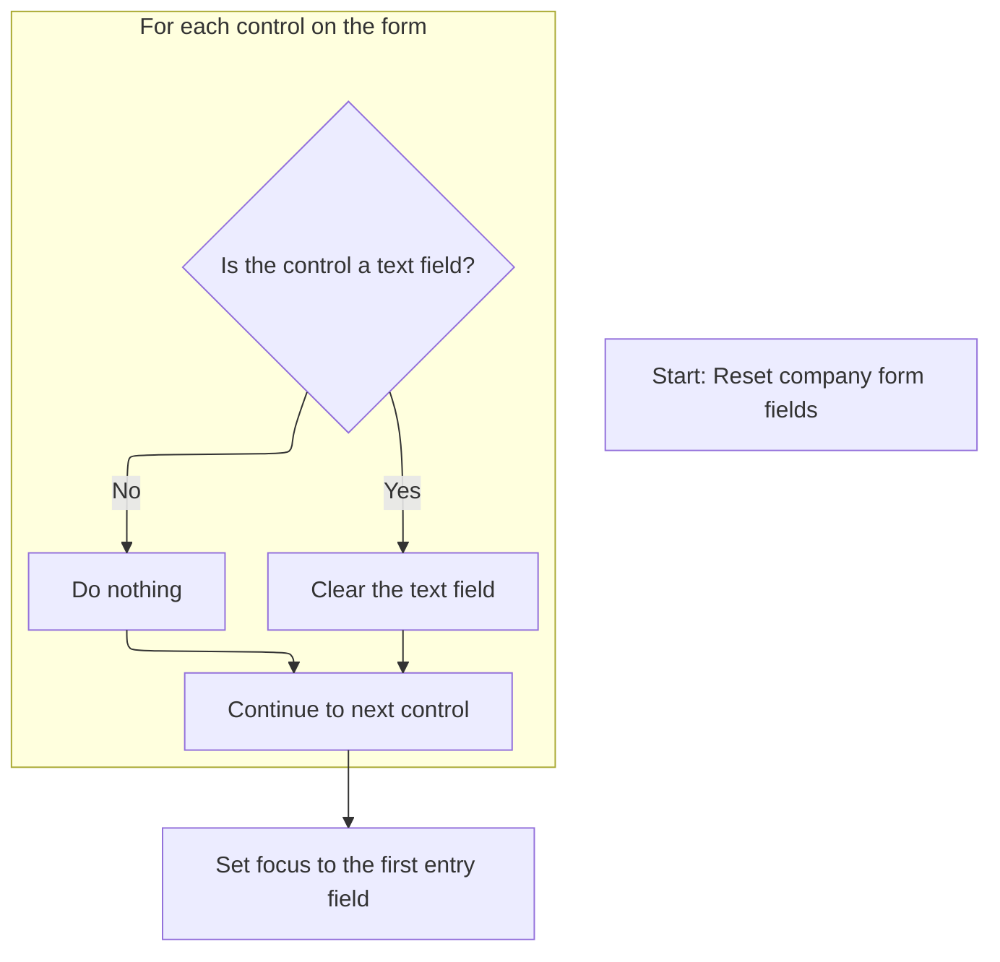
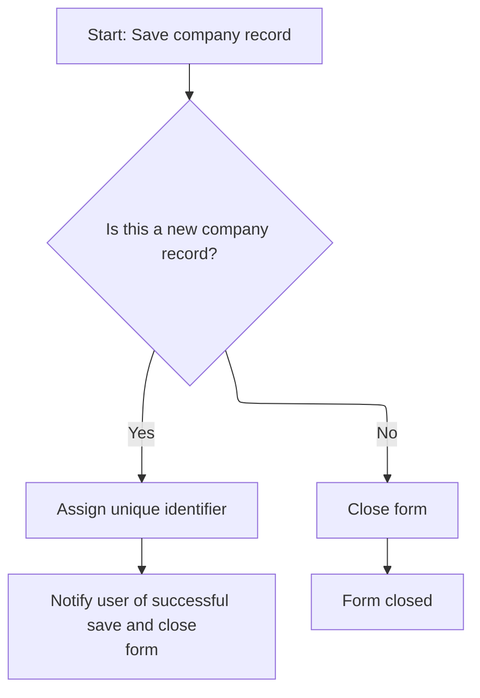

This document describes the flow for managing company records. Users enter company information into the form, and the system validates required fields before saving the data. The workflow supports both adding new records and updating existing ones. After saving, users can choose to add another company, in which case the form is reset for the next entry.

# Validating and Saving Company Data

<SwmSnippet path="/HotelManagementSystem/Forms/frmCompany.frm" line="251">

---

In <SwmToken path="HotelManagementSystem/Forms/frmCompany.frm" pos="251:4:4" line-data="Private Sub cmdSave_Click()">`cmdSave_Click`</SwmToken>, we immediately check if the main company name field (<SwmToken path="HotelManagementSystem/Forms/frmCompany.frm" pos="252:5:5" line-data="    If is_empty(txtEntry(0), True) = True Then Exit Sub">`txtEntry`</SwmToken>(0)) is empty. If it is, we bail out early. This prevents any further processing or database changes when the required field isn't filled. Next, we call the validation logic in <SwmPath>[HotelManagementSystem/Modules/modFunction.bas](HotelManagementSystem/Modules/modFunction.bas)</SwmPath> to handle the actual check and user notification.

```visual basic
Private Sub cmdSave_Click()
    If is_empty(txtEntry(0), True) = True Then Exit Sub
```

---

</SwmSnippet>

<SwmSnippet path="/HotelManagementSystem/Modules/modFunction.bas" line="122">

---

<SwmToken path="HotelManagementSystem/Modules/modFunction.bas" pos="122:4:4" line-data="Public Function is_empty(ByRef sText As Variant, Optional UseTagValue As Boolean) As Boolean">`is_empty`</SwmToken> checks if the given control's text is blank. If so, it pops up a message (using the control's Tag for context if requested), sets focus back to the field, and returns True. Otherwise, it just returns False. This is the gatekeeper for required fields.

```visual basic
Public Function is_empty(ByRef sText As Variant, Optional UseTagValue As Boolean) As Boolean
    On Error Resume Next
    If sText.Text = "" Then
        is_empty = True
        If UseTagValue = True Then
            MsgBox "The field '" & sText.Tag & "' is required.Please check it!", vbExclamation
        Else
            MsgBox "The field is required.Please check it!", vbExclamation
        End If
        sText.SetFocus
    Else
        is_empty = False
    End If
End Function
```

---

</SwmSnippet>

<SwmSnippet path="/HotelManagementSystem/Forms/frmCompany.frm" line="253">

---

Back in <SwmToken path="HotelManagementSystem/Forms/frmCompany.frm" pos="251:4:4" line-data="Private Sub cmdSave_Click()">`cmdSave_Click`</SwmToken>, after validation, we either add a new company or update an existing one, filling all the fields from the form. After saving, we prompt the user to add another record. If they say yes, we call <SwmToken path="HotelManagementSystem/Forms/frmCompany.frm" pos="282:1:1" line-data="            ResetFields">`ResetFields`</SwmToken> to clear the form for the next entry.

```visual basic
    
    If State = adStateAddMode Then
        RS.AddNew
        RS.Fields("CompanyID") = PK
        RS.Fields("DateAdded") = Now
        RS.Fields("AddedByFK") = CurrUser.USER_PK
    Else
        RS.Fields("DateModified") = Now
        RS.Fields("LastUserFK") = CurrUser.USER_PK
    End If
    'Phill 2:12
    With RS
        .Fields("Company") = txtEntry(0).Text
        .Fields("LastName") = txtEntry(1).Text
        .Fields("FirstName") = txtEntry(2).Text
        .Fields("Address") = txtEntry(3).Text
        .Fields("EmailAddress") = txtEntry(4).Text
        .Fields("TelNo") = txtEntry(5).Text
        .Fields("MobileNo") = txtEntry(6).Text
        .Fields("FaxNo") = txtEntry(7).Text
        
        .Update
    End With
    
    HaveAction = True
    
    If State = adStateAddMode Then
        MsgBox "New record has been successfully saved.", vbInformation
        If MsgBox("Do you want to add another new record?", vbQuestion + vbYesNo) = vbYes Then
            ResetFields
```

---

</SwmSnippet>

## Clearing Form Inputs



<SwmSnippet path="/HotelManagementSystem/Forms/frmCompany.frm" line="245">

---

In <SwmToken path="HotelManagementSystem/Forms/frmCompany.frm" pos="245:4:4" line-data="Private Sub ResetFields()">`ResetFields`</SwmToken>, we call <SwmToken path="HotelManagementSystem/Forms/frmCompany.frm" pos="246:1:1" line-data="    clearText Me">`clearText`</SwmToken> with the current form. This wipes all text boxes, prepping the form for the next entry. The actual clearing logic is handled in <SwmPath>[HotelManagementSystem/Modules/modProcedure.bas](HotelManagementSystem/Modules/modProcedure.bas)</SwmPath>.

```visual basic
Private Sub ResetFields()
    clearText Me
```

---

</SwmSnippet>

<SwmSnippet path="/HotelManagementSystem/Modules/modProcedure.bas" line="228">

---

<SwmToken path="HotelManagementSystem/Modules/modProcedure.bas" pos="228:4:4" line-data="Public Sub clearText(ByRef sForm As Form)">`clearText`</SwmToken> loops through all controls on the form and blanks out any <SwmToken path="HotelManagementSystem/Modules/modProcedure.bas" pos="231:10:10" line-data="        If (TypeOf Control Is TextBox) Then Control = vbNullString">`TextBox`</SwmToken> it finds. Other controls are ignored. This is a quick way to reset form inputs.

```visual basic
Public Sub clearText(ByRef sForm As Form)
    Dim Control As Control
    For Each Control In sForm.Controls
        If (TypeOf Control Is TextBox) Then Control = vbNullString
    Next Control
    Set Control = Nothing
End Sub
```

---

</SwmSnippet>

<SwmSnippet path="/HotelManagementSystem/Forms/frmCompany.frm" line="247">

---

After <SwmToken path="HotelManagementSystem/Forms/frmCompany.frm" pos="246:1:1" line-data="    clearText Me">`clearText`</SwmToken> finishes, <SwmToken path="HotelManagementSystem/Forms/frmCompany.frm" pos="245:4:4" line-data="Private Sub ResetFields()">`ResetFields`</SwmToken> puts the cursor back in the first input field so the user can start typing right away. No wasted clicks.

```visual basic
    
    txtEntry(0).SetFocus
End Sub
```

---

</SwmSnippet>

## Preparing for Next Entry



<SwmSnippet path="/HotelManagementSystem/Forms/frmCompany.frm" line="283">

---

After <SwmToken path="HotelManagementSystem/Forms/frmCompany.frm" pos="245:4:4" line-data="Private Sub ResetFields()">`ResetFields`</SwmToken>, <SwmToken path="HotelManagementSystem/Forms/frmCompany.frm" pos="251:4:4" line-data="Private Sub cmdSave_Click()">`cmdSave_Click`</SwmToken> grabs a new primary key for the next company entry by calling <SwmToken path="HotelManagementSystem/Forms/frmCompany.frm" pos="283:5:5" line-data="            PK = getIndex(&quot;Company&quot;)">`getIndex`</SwmToken>. This ensures the next record gets a unique ID.

```visual basic
            PK = getIndex("Company")
```

---

</SwmSnippet>

<SwmSnippet path="/HotelManagementSystem/Modules/modADO.bas" line="35">

---

<SwmToken path="HotelManagementSystem/Modules/modADO.bas" pos="35:4:4" line-data="Public Function getIndex(ByVal srcTable As String) As Long">`getIndex`</SwmToken> looks up the next available key for the given table, bumps it by one, and returns the old value. If the value is missing, it defaults to 1. This keeps primary keys unique and sequential.

```visual basic
Public Function getIndex(ByVal srcTable As String) As Long
    On Error GoTo err
    Dim RS As New Recordset
    Dim RI As Long
    
    RS.CursorLocation = adUseClient
    RS.Open "SELECT * FROM [KEY GENERATOR] WHERE TableName = '" & srcTable & "'", CN, adOpenStatic, adLockOptimistic
    
    RI = RS.Fields("NextNo")
    CN.BeginTrans
    RS.Fields("NextNo") = RI + 1
    RS.Update
    CN.CommitTrans
    getIndex = RI
    
    srcTable = ""
    RI = 0
    Set RS = Nothing
    Exit Function
err:
        ''Error when incounter a null value
        If err.Number = 94 Then
            getIndex = 1
            Resume Next
        Else
            MsgBox err.Description
        End If
        CN.RollbackTrans
End Function
```

---

</SwmSnippet>

<SwmSnippet path="/HotelManagementSystem/Forms/frmCompany.frm" line="284">

---

After getting the new key, <SwmToken path="HotelManagementSystem/Forms/frmCompany.frm" pos="251:4:4" line-data="Private Sub cmdSave_Click()">`cmdSave_Click`</SwmToken> either resets for another entry or closes the form, depending on the user's choice. Updates just show a confirmation and close the form.

```visual basic
         Else
            Unload Me
        End If
    Else
        MsgBox "Changes in  record has been successfully saved.", vbInformation
        Unload Me
    End If
End Sub
```

---

</SwmSnippet>

&nbsp;

*This is an auto-generated document by Swimm 🌊 and has not yet been verified by a human*

<SwmMeta version="3.0.0" repo-id="Z2l0aHViJTNBJTNBY3RzLVZCNi1Qcm9qZWN0cyUzQSUzQVN3aW1tLURlbW8=" repo-name="cts-VB6-Projects"><sup>Powered by [Swimm](https://app.swimm.io/)</sup></SwmMeta>
