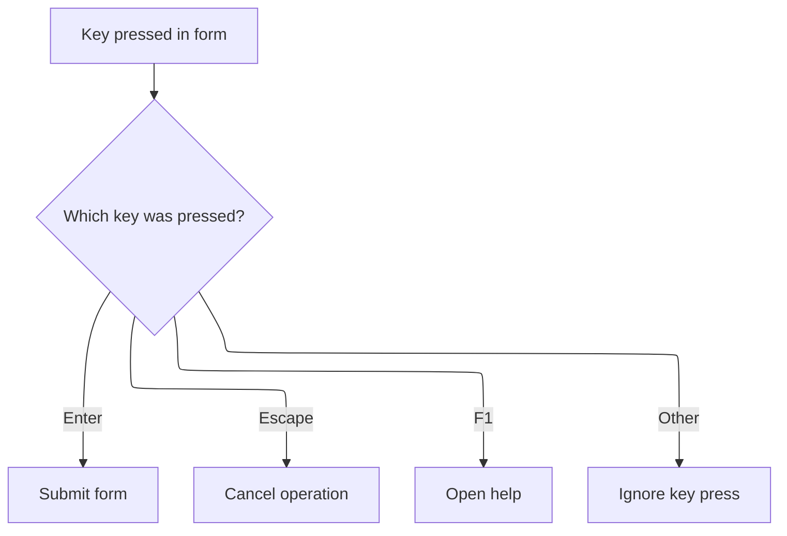

This document describes how the form interface responds to key events, enabling users to edit, clear, or reset their input efficiently. When a user presses Backspace, Escape, or Delete, the form updates its display or input state to help users correct mistakes or start over.

# Handling Key Events and Triggering Actions

<SwmSnippet path="/warnet/Server/timeronline.frm" line="885">

---

In <SwmToken path="warnet/Server/timeronline.frm" pos="885:4:4" line-data="Private Sub Form_KeyDown(KeyCode As Integer, Shift As Integer)">`Form_KeyDown`</SwmToken>, key presses are checked for Backspace, Escape, and Delete. When Backspace is detected, <SwmToken path="warnet/Server/timeronline.frm" pos="888:3:3" line-data="        Call CmdBS_Click">`CmdBS_Click`</SwmToken> is called to handle the removal logic

```visual basic
Private Sub Form_KeyDown(KeyCode As Integer, Shift As Integer)
Select Case KeyCode
    Case 8 'Backspace
        Call CmdBS_Click
```

---

</SwmSnippet>

<SwmSnippet path="/warnet/Server/timeronline.frm" line="845">

---

<SwmToken path="warnet/Server/timeronline.frm" pos="845:4:4" line-data="Private Sub CmdBS_Click()">`CmdBS_Click`</SwmToken> checks for error or operation states and exits if any are active. Otherwise, it removes the last character from the display if possible, tracks backspace usage, or resets the display if not. It keeps the UI state predictable.

```visual basic
Private Sub CmdBS_Click()

If bWasError Then
    Beep
    Exit Sub
End If

If bEqual Or bMEM Or bOp Then
    Beep
    Exit Sub
End If

Static nBSCount As Integer
If (Len(lblOutput.Caption) > 1 And CDbl(lblOutput.Caption) > 0) Or (CDbl(lblOutput.Caption) < 0 And Len(lblOutput.Caption) > 2) Then
    lblOutput.Caption = Left$(lblOutput.Caption, Len(lblOutput.Caption) - 1)
    nBSCount = nBSCount + 1
    Else
    Beep
    lblOutput.Caption = 0
End If
nLastNum = CDbl(lblOutput.Caption)
End Sub
```

---

</SwmSnippet>

<SwmSnippet path="/warnet/Server/timeronline.frm" line="889">

---

Back in <SwmToken path="warnet/Server/timeronline.frm" pos="885:4:4" line-data="Private Sub Form_KeyDown(KeyCode As Integer, Shift As Integer)">`Form_KeyDown`</SwmToken>, after handling Backspace, Escape triggers <SwmToken path="warnet/Server/timeronline.frm" pos="890:3:3" line-data="        Call cmdC_Click">`cmdC_Click`</SwmToken> to clear the current state and reset the display, giving users a fast way to start over.

```visual basic
    Case 27 'Escape
        Call cmdC_Click
```

---

</SwmSnippet>

<SwmSnippet path="/warnet/Server/timeronline.frm" line="567">

---

CmdC_Click resets all calculation state, error flags, and the display

```visual basic
Private Sub cmdC_Click()
bWasError = False
nLastNum = 0
nResult = 0
bOp = False
nOp = 0
bEqual = False
lblOutput.Caption = "0"

End Sub
```

---

</SwmSnippet>

<SwmSnippet path="/warnet/Server/timeronline.frm" line="891">

---

Back in <SwmToken path="warnet/Server/timeronline.frm" pos="885:4:4" line-data="Private Sub Form_KeyDown(KeyCode As Integer, Shift As Integer)">`Form_KeyDown`</SwmToken>, after Escape, pressing Delete triggers <SwmToken path="warnet/Server/timeronline.frm" pos="892:3:3" line-data="        Call cmdCE_Click">`cmdCE_Click`</SwmToken>, which handles clearing the current entry or error state without resetting everything.

```visual basic
    Case 46 'Del
        Call cmdCE_Click
```

---

</SwmSnippet>

## Clearing Current Entry and Error State

<SwmSnippet path="/warnet/Server/timeronline.frm" line="577">

---

In <SwmToken path="warnet/Server/timeronline.frm" pos="577:4:4" line-data="Private Sub cmdCE_Click()">`cmdCE_Click`</SwmToken>, if an error is flagged, it calls <SwmToken path="warnet/Server/timeronline.frm" pos="579:3:3" line-data="    Call cmdC_Click">`cmdC_Click`</SwmToken> to reset all state, making sure error recovery is handled the same way everywhere.

```visual basic
Private Sub cmdCE_Click()
If bWasError Then
    Call cmdC_Click
```

---

</SwmSnippet>

<SwmSnippet path="/warnet/Server/timeronline.frm" line="580">

---

After returning from <SwmToken path="warnet/Server/timeronline.frm" pos="567:4:4" line-data="Private Sub cmdC_Click()">`cmdC_Click`</SwmToken>, <SwmToken path="warnet/Server/timeronline.frm" pos="577:4:4" line-data="Private Sub cmdCE_Click()">`cmdCE_Click`</SwmToken> explicitly clears the error flag, display, and last number, guaranteeing the entry is reset regardless of prior state.

```visual basic
End If
bWasError = False
lblOutput.Caption = 0
nLastNum = 0
End Sub
```

---

</SwmSnippet>

## Wrapping Up Key Event Handling



<SwmSnippet path="/warnet/Server/timeronline.frm" line="893">

---

After returning from <SwmToken path="warnet/Server/timeronline.frm" pos="577:4:4" line-data="Private Sub cmdCE_Click()">`cmdCE_Click`</SwmToken>, <SwmToken path="warnet/Server/timeronline.frm" pos="885:4:4" line-data="Private Sub Form_KeyDown(KeyCode As Integer, Shift As Integer)">`Form_KeyDown`</SwmToken> completes without extra logic, relying on the button handlers to manage all state changes.

```visual basic
End Select
End Sub
```

---

</SwmSnippet>

&nbsp;

*This is an auto-generated document by Swimm 🌊 and has not yet been verified by a human*

<SwmMeta version="3.0.0" repo-id="Z2l0aHViJTNBJTNBY3RzLVZCNi1Qcm9qZWN0cyUzQSUzQVN3aW1tLURlbW8=" repo-name="cts-VB6-Projects"><sup>Powered by [Swimm](https://app.swimm.io/)</sup></SwmMeta>
