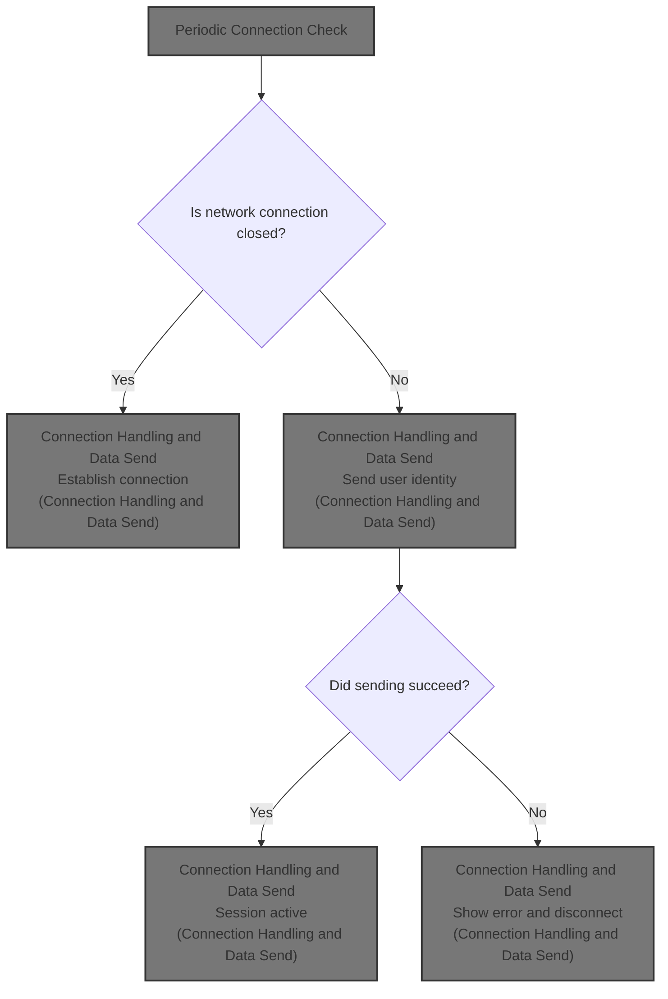
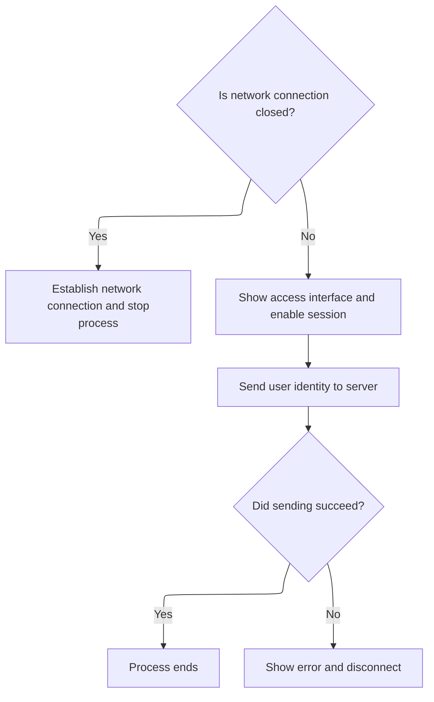

This document describes the automated flow for maintaining a network connection and sending user identity to the server. The timer triggers periodic checks, ensuring the application stays connected and user session information is kept up to date.



# Periodic Connection Check

<SwmSnippet path="/warnet/Client/clnonline.frm" line="848">

---

In <SwmToken path="warnet/Client/clnonline.frm" pos="848:4:4" line-data="Private Sub Timer1_Timer()">`Timer1_Timer`</SwmToken>, the timer event triggers <SwmToken path="warnet/Client/clnonline.frm" pos="849:0:0" line-data="CmAccess_Click">`CmAccess_Click`</SwmToken> every interval. This keeps the connection logic running on a schedule, so the app can automatically handle connection checks or actions without waiting for user input.

```visual basic
Private Sub Timer1_Timer()
CmAccess_Click
```

---

</SwmSnippet>

## Connection Handling and Data Send



<SwmSnippet path="/warnet/Client/clnonline.frm" line="616">

---

In <SwmToken path="warnet/Client/clnonline.frm" pos="616:4:4" line-data="Private Sub CmAccess_Click()">`CmAccess_Click`</SwmToken>, we check if the socket is closed. If it is, we call <SwmToken path="warnet/Client/clnonline.frm" pos="618:1:1" line-data="    CmConnect_Click">`CmConnect_Click`</SwmToken> to start a new connection and exit, so we don't try to send data or update the UI until the connection is actually up.

```visual basic
Private Sub CmAccess_Click()
If sock1.State = sckClosed Then
    CmConnect_Click
```

---

</SwmSnippet>

<SwmSnippet path="/warnet/Client/clnonline.frm" line="650">

---

<SwmToken path="warnet/Client/clnonline.frm" pos="650:4:4" line-data="Private Sub CmConnect_Click()">`CmConnect_Click`</SwmToken> shuts down any existing socket, sets up the remote host and port, and kicks off a new connection attempt. This keeps the connection logic clean and avoids socket state issues.

```visual basic
Private Sub CmConnect_Click()
sock1.Close
sock1.RemoteHost = IPVALUE
sock1.RemotePort = PORTVALUE
sock1.Connect
End Sub
```

---

</SwmSnippet>

<SwmSnippet path="/warnet/Client/clnonline.frm" line="619">

---

Back in <SwmToken path="warnet/Client/clnonline.frm" pos="616:4:4" line-data="Private Sub CmAccess_Click()">`CmAccess_Click`</SwmToken> after returning from <SwmToken path="warnet/Client/clnonline.frm" pos="618:1:1" line-data="    CmConnect_Click">`CmConnect_Click`</SwmToken>, if the connection is open, we update the UI and timers to reflect the active state, then try to send user data. If sending fails, we show the error and call <SwmToken path="warnet/Client/clnonline.frm" pos="632:0:0" line-data="sock1_Close">`sock1_Close`</SwmToken> to reset the connection.

```visual basic
    Exit Sub
    End If
Picture2.Visible = True
Timer1.Enabled = True
Form4.Width = 4800
Form4.Height = 370
Timer3.Enabled = False: Txidle.Text = 7200
'-----
On Error GoTo t
sock1.SendData USERVALUE
Exit Sub
t:
TXsays.Caption = "Error : " & Err.Description
sock1_Close
```

---

</SwmSnippet>

<SwmSnippet path="/warnet/Client/clnonline.frm" line="792">

---

<SwmToken path="warnet/Client/clnonline.frm" pos="792:4:4" line-data="Private Sub sock1_Close()">`sock1_Close`</SwmToken> shuts down the socket and updates the UI to show the user they're disconnected.

```visual basic
Private Sub sock1_Close()
sock1.Close
TXsays.Caption = "Disconnected from server" & vbCrLf
TxStatus.Caption = "Disconnected"
End Sub
```

---

</SwmSnippet>

<SwmSnippet path="/warnet/Client/clnonline.frm" line="633">

---

After <SwmToken path="warnet/Client/clnonline.frm" pos="632:0:0" line-data="sock1_Close">`sock1_Close`</SwmToken>, <SwmToken path="warnet/Client/clnonline.frm" pos="616:4:4" line-data="Private Sub CmAccess_Click()">`CmAccess_Click`</SwmToken> just ends. Any further connection attempts or actions will wait for the next timer tick or user event.

```visual basic
End Sub
```

---

</SwmSnippet>

## Timer Cycle End

<SwmSnippet path="/warnet/Client/clnonline.frm" line="850">

---

After <SwmToken path="warnet/Client/clnonline.frm" pos="616:4:4" line-data="Private Sub CmAccess_Click()">`CmAccess_Click`</SwmToken> returns, <SwmToken path="warnet/Client/clnonline.frm" pos="848:4:4" line-data="Private Sub Timer1_Timer()">`Timer1_Timer`</SwmToken> just ends. The timer will keep firing, so the connection check and data send logic will repeat on the next tick.

```visual basic
End Sub
```

---

</SwmSnippet>

&nbsp;

*This is an auto-generated document by Swimm 🌊 and has not yet been verified by a human*

<SwmMeta version="3.0.0" repo-id="Z2l0aHViJTNBJTNBY3RzLVZCNi1Qcm9qZWN0cyUzQSUzQVN3aW1tLURlbW8=" repo-name="cts-VB6-Projects"><sup>Powered by [Swimm](https://app.swimm.io/)</sup></SwmMeta>
