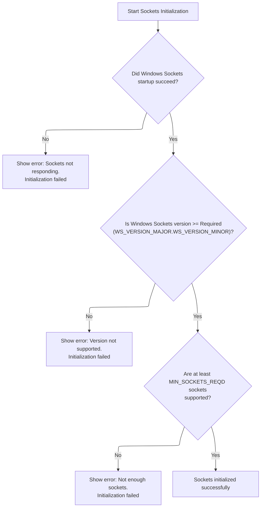
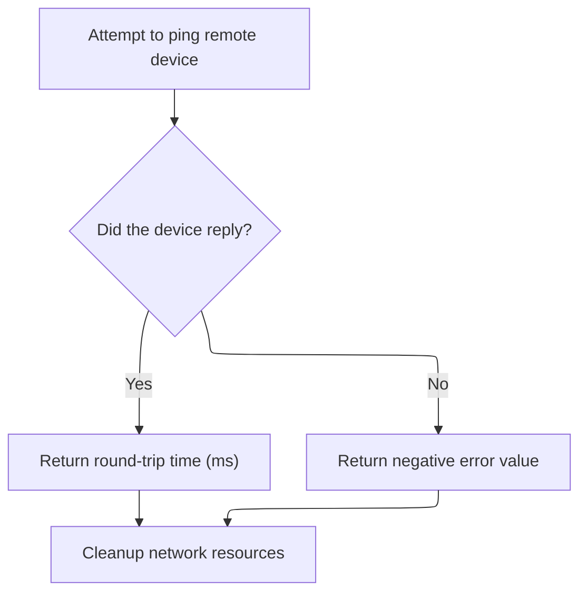

This document describes the flow for testing connectivity to a remote device by sending a ping request and measuring the response time. The flow receives an IP address as input, prepares it for network operations, verifies that the network stack is ready, and sends an echo request. The output is either the round-trip time in milliseconds or a negative error value if the device does not reply.

# Preparing and Parsing the Target Address

<SwmSnippet path="/warnet/Server/Module2.bas" line="171">

---

In <SwmToken path="warnet/Server/Module2.bas" pos="171:4:4" line-data="Public Function Ping(szAddress As String, ECHO As ICMP_ECHO_REPLY) As Long">`Ping`</SwmToken>, we set up the data to send and immediately convert the IP address string to a long integer using <SwmToken path="warnet/Server/Module2.bas" pos="179:5:5" line-data="   dwAddress = AddressStringToLong(szAddress)">`AddressStringToLong`</SwmToken>. This conversion is needed because the Windows ICMP API only works with numeric addresses, not strings.

```visual basic
Public Function Ping(szAddress As String, ECHO As ICMP_ECHO_REPLY) As Long

   Dim hPort As Long
   Dim dwAddress As Long
   Dim sDataToSend As String
   Dim iOpt As Long
   
   sDataToSend = "Echo This"
   dwAddress = AddressStringToLong(szAddress)
```

---

</SwmSnippet>

<SwmSnippet path="/warnet/Server/Module2.bas" line="210">

---

<SwmToken path="warnet/Server/Module2.bas" pos="210:2:2" line-data="Function AddressStringToLong(ByVal tmp As String) As Long">`AddressStringToLong`</SwmToken> splits the dotted IP string into four parts, checks for exactly four, then builds a long integer by converting each part to hex and concatenating them in reverse order. This matches the byte order expected by the Windows API.

```visual basic
Function AddressStringToLong(ByVal tmp As String) As Long

   Dim i As Integer
   Dim parts(1 To 4) As String
   
   i = 0
   
  'we have to extract each part of the
  '123.456.789.123 string, delimited by
  'a period
   While InStr(tmp, ".") > 0
      i = i + 1
      parts(i) = Mid(tmp, 1, InStr(tmp, ".") - 1)
      tmp = Mid(tmp, InStr(tmp, ".") + 1)
   Wend
   
   i = i + 1
   parts(i) = tmp
   
   If i <> 4 Then
      AddressStringToLong = 0
      Exit Function
   End If
   
  'build the long value out of the
  'hex of the extracted strings
   AddressStringToLong = Val("&H" & Right("00" & Hex(parts(4)), 2) & _
                         Right("00" & Hex(parts(3)), 2) & _
                         Right("00" & Hex(parts(2)), 2) & _
                         Right("00" & Hex(parts(1)), 2))
   
End Function
```

---

</SwmSnippet>

<SwmSnippet path="/warnet/Server/Module2.bas" line="180">

---

Back in <SwmToken path="warnet/Server/Module2.bas" pos="171:4:4" line-data="Public Function Ping(szAddress As String, ECHO As ICMP_ECHO_REPLY) As Long">`Ping`</SwmToken>, after converting the address, we call <SwmToken path="warnet/Server/Module2.bas" pos="181:3:3" line-data="   Call SocketsInitialize">`SocketsInitialize`</SwmToken> to make sure the Windows Sockets API is ready for network operations. Without this, none of the following network calls would work.

```visual basic
   
   Call SocketsInitialize
```

---

</SwmSnippet>

## Checking Windows Sockets Version and Capabilities



<SwmSnippet path="/warnet/Server/Module2.bas" line="261">

---

In <SwmToken path="warnet/Server/Module2.bas" pos="261:4:4" line-data="Public Function SocketsInitialize() As Boolean">`SocketsInitialize`</SwmToken>, after starting up the Windows Sockets API, we check the version returned. We call <SwmToken path="warnet/Server/Module2.bas" pos="276:3:3" line-data="    If LoByte(WSAD.wVersion) &lt; WS_VERSION_MAJOR Or _">`LoByte`</SwmToken> to extract the major version from the packed version value so we can compare it to what we require.

```visual basic
Public Function SocketsInitialize() As Boolean

    Dim WSAD As WSADATA
    Dim X As Integer
    Dim szLoByte As String, szHiByte As String, szBuf As String
    
    X = WSAStartup(WS_VERSION_REQD, WSAD)
    
    If X <> 0 Then
        MsgBox "Windows Sockets for 32 bit Windows " & _
               "environments is not successfully responding."
        SocketsInitialize = False
        Exit Function
    End If
    
    If LoByte(WSAD.wVersion) < WS_VERSION_MAJOR Or _
       (LoByte(WSAD.wVersion) = WS_VERSION_MAJOR And _
```

---

</SwmSnippet>

<SwmSnippet path="/warnet/Server/Module2.bas" line="164">

---

<SwmToken path="warnet/Server/Module2.bas" pos="164:4:4" line-data="Public Function LoByte(ByVal wParam As Integer)">`LoByte`</SwmToken> just masks out everything but the lowest 8 bits of the input, giving us the major version from the packed version number.

```visual basic
Public Function LoByte(ByVal wParam As Integer)

    LoByte = wParam And &HFF&

End Function
```

---

</SwmSnippet>

<SwmSnippet path="/warnet/Server/Module2.bas" line="278">

---

Back in <SwmToken path="warnet/Server/Module2.bas" pos="181:3:3" line-data="   Call SocketsInitialize">`SocketsInitialize`</SwmToken>, after checking the major version with <SwmToken path="warnet/Server/Module2.bas" pos="164:4:4" line-data="Public Function LoByte(ByVal wParam As Integer)">`LoByte`</SwmToken>, we call <SwmToken path="warnet/Server/Module2.bas" pos="278:1:1" line-data="        HiByte(WSAD.wVersion) &lt; WS_VERSION_MINOR) Then">`HiByte`</SwmToken> to get the minor version and finish the version compatibility check.

```visual basic
        HiByte(WSAD.wVersion) < WS_VERSION_MINOR) Then
        
        szHiByte = Trim$(Str$(HiByte(WSAD.wVersion)))
```

---

</SwmSnippet>

<SwmSnippet path="/warnet/Server/Module2.bas" line="157">

---

<SwmToken path="warnet/Server/Module2.bas" pos="157:4:4" line-data="Public Function HiByte(ByVal wParam As Integer)">`HiByte`</SwmToken> shifts the input right by 8 bits and masks the result, giving us the minor version from the packed version number.

```visual basic
Public Function HiByte(ByVal wParam As Integer)

    HiByte = wParam \ &H100 And &HFF&

End Function
```

---

</SwmSnippet>

<SwmSnippet path="/warnet/Server/Module2.bas" line="281">

---

Back in <SwmToken path="warnet/Server/Module2.bas" pos="181:3:3" line-data="   Call SocketsInitialize">`SocketsInitialize`</SwmToken>, after getting the minor version with <SwmToken path="warnet/Server/Module2.bas" pos="157:4:4" line-data="Public Function HiByte(ByVal wParam As Integer)">`HiByte`</SwmToken>, we call <SwmToken path="warnet/Server/Module2.bas" pos="281:11:11" line-data="        szLoByte = Trim$(Str$(LoByte(WSAD.wVersion)))">`LoByte`</SwmToken> again to get the major version for the error message.

```visual basic
        szLoByte = Trim$(Str$(LoByte(WSAD.wVersion)))
```

---

</SwmSnippet>

<SwmSnippet path="/warnet/Server/Module2.bas" line="282">

---

Back in <SwmToken path="warnet/Server/Module2.bas" pos="286:1:1" line-data="        SocketsInitialize = False">`SocketsInitialize`</SwmToken>, after extracting both version numbers, we build an error message if the version is unsupported, or if there aren't enough sockets. If all checks pass, we return True to signal that sockets are ready.

```visual basic
        szBuf = "Windows Sockets Version " & szLoByte & "." & szHiByte
        szBuf = szBuf & " is not supported by Windows " & _
                          "Sockets for 32 bit Windows environments."
        MsgBox szBuf, vbExclamation
        SocketsInitialize = False
        Exit Function
        
    End If
    
    If WSAD.wMaxSockets < MIN_SOCKETS_REQD Then
        szBuf = "This application requires a minimum of " & _
                 Trim$(Str$(MIN_SOCKETS_REQD)) & " supported sockets."
        MsgBox szBuf, vbExclamation
        SocketsInitialize = False
        Exit Function
    End If
    
    SocketsInitialize = True
        
End Function
```

---

</SwmSnippet>

## Sending the Echo Request and Cleaning Up



<SwmSnippet path="/warnet/Server/Module2.bas" line="182">

---

Back in <SwmToken path="warnet/Server/Module2.bas" pos="200:1:1" line-data="         Ping = ECHO.RoundTripTime">`Ping`</SwmToken>, after sending the ICMP echo and closing the handle, we call <SwmToken path="warnet/Server/Module2.bas" pos="205:3:3" line-data="   Call SocketsCleanup">`SocketsCleanup`</SwmToken> to release all resources used by the Windows Sockets API.

```visual basic
   hPort = IcmpCreateFile()
   
   If IcmpSendEcho(hPort, _
                   dwAddress, _
                   sDataToSend, _
                   Len(sDataToSend), _
                   0, _
                   ECHO, _
                   Len(ECHO), _
                   PING_TIMEOUT) Then
   
        'the ping succeeded,
        '.Status will be 0
        '.RoundTripTime is the time in ms for
        '               the ping to complete,
        '.Data is the data returned (NULL terminated)
        '.Address is the Ip address that actually replied
        '.DataSize is the size of the string in .Data
         Ping = ECHO.RoundTripTime
   Else: Ping = ECHO.status * -1
   End If
                       
   Call IcmpCloseHandle(hPort)
   Call SocketsCleanup
```

---

</SwmSnippet>

<SwmSnippet path="/warnet/Server/Module2.bas" line="244">

---

<SwmToken path="warnet/Server/Module2.bas" pos="244:4:4" line-data="Public Function SocketsCleanup() As Boolean">`SocketsCleanup`</SwmToken> calls <SwmToken path="warnet/Server/Module2.bas" pos="248:5:5" line-data="    X = WSACleanup()">`WSACleanup`</SwmToken> to shut down the Windows Sockets API. If it fails, we show the error code; otherwise, we just return True.

```visual basic
Public Function SocketsCleanup() As Boolean

    Dim X As Long
    
    X = WSACleanup()
    
    If X <> 0 Then
        MsgBox "Windows Sockets error " & Trim$(Str$(X)) & _
               " occurred in Cleanup.", vbExclamation
        SocketsCleanup = False
    Else
        SocketsCleanup = True
    End If
    
End Function
```

---

</SwmSnippet>

<SwmSnippet path="/warnet/Server/Module2.bas" line="206">

---

Finally, in <SwmToken path="warnet/Server/Module2.bas" pos="171:4:4" line-data="Public Function Ping(szAddress As String, ECHO As ICMP_ECHO_REPLY) As Long">`Ping`</SwmToken>, after cleaning up, we return either the round-trip time or a negative error code, depending on whether the ICMP echo succeeded.

```visual basic
   
End Function
```

---

</SwmSnippet>

&nbsp;

*This is an auto-generated document by Swimm 🌊 and has not yet been verified by a human*

<SwmMeta version="3.0.0" repo-id="Z2l0aHViJTNBJTNBY3RzLVZCNi1Qcm9qZWN0cyUzQSUzQVN3aW1tLURlbW8=" repo-name="cts-VB6-Projects"><sup>Powered by [Swimm](https://app.swimm.io/)</sup></SwmMeta>
