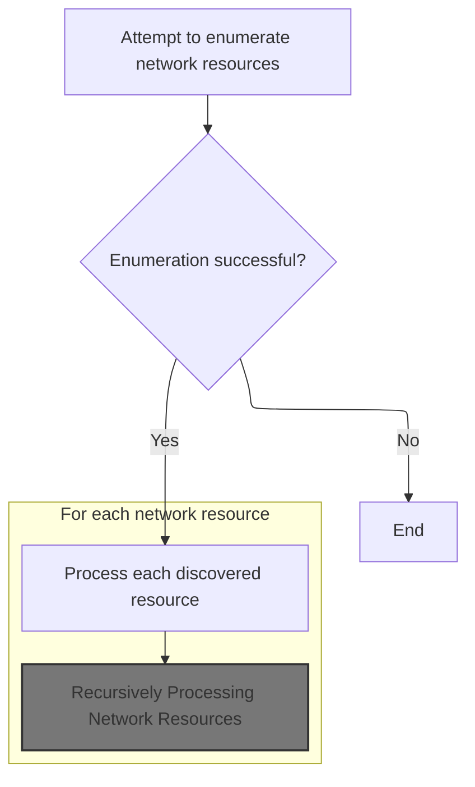
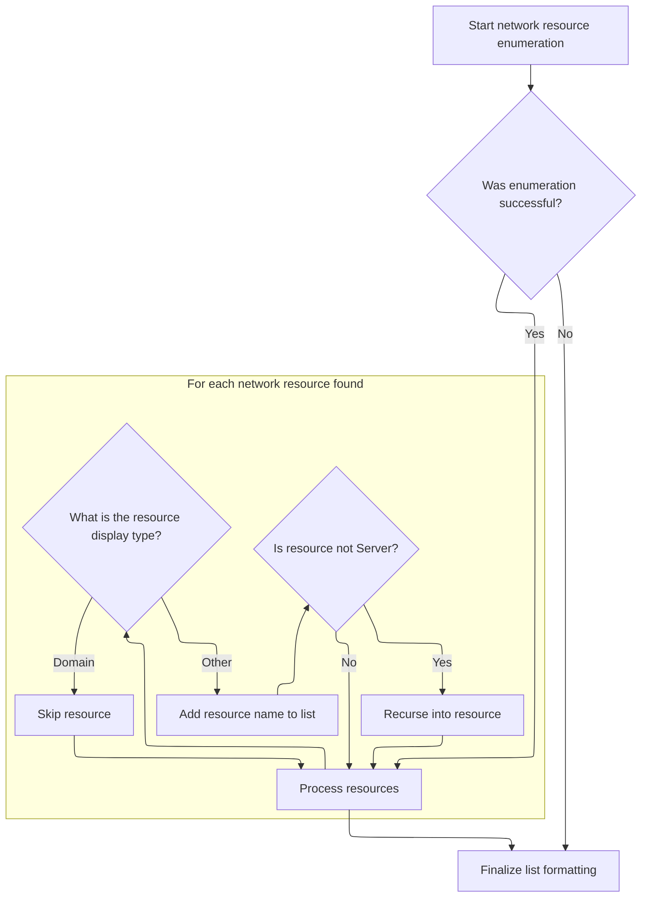
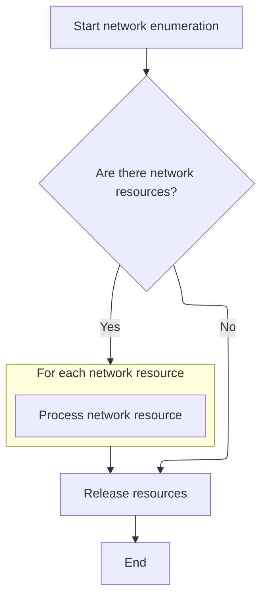

When the class is created, it immediately gathers and prepares a list of available network resources. This ensures that any features depending on network discovery have access to a current list as soon as the class is used.

# Triggering Network Enumeration on Class Creation

<SwmSnippet path="/warnet/Server/LAN.cls" line="177">

---

In <SwmToken path="warnet/Server/LAN.cls" pos="177:4:4" line-data="Private Sub Class_Initialize()">`Class_Initialize`</SwmToken>, the only thing happening is a call to <SwmToken path="warnet/Server/LAN.cls" pos="178:0:0" line-data="DoNetEnum">`DoNetEnum`</SwmToken>. This means as soon as the class is instantiated, it kicks off the network enumeration process right away, so the class always starts with a fresh list of network resources.

```apex
Private Sub Class_Initialize()
DoNetEnum
```

---

</SwmSnippet>

## Enumerating Top-Level Network Resources



<SwmSnippet path="/warnet/Server/LAN.cls" line="69">

---

In <SwmToken path="warnet/Server/LAN.cls" pos="69:4:4" line-data="Private Function DoNetEnum()">`DoNetEnum`</SwmToken>, we start a global enumeration of network resources, grab them into a buffer, and for each resource found, we call <SwmToken path="warnet/Server/LAN.cls" pos="97:1:1" line-data="         DoNetEnum2 NR">`DoNetEnum2`</SwmToken> to process or enumerate further. This is how we dig deeper into the network structure beyond just the top-level entries.

```apex
Private Function DoNetEnum()
Dim hEnum As Long, lpBuff As Long, NR As NETRESOURCE
Dim cbBuff As Long, cCount As Long
Dim P As Long, res As Long, i As Long

On Error Resume Next
If Err.Number > 0 Then Exit Function

On Error GoTo ErrorHandler

NR.lpRemoteName = 0

cbBuff = 1024 * 31
cCount = &HFFFFFFFF

res = WNetOpenEnum(RESOURCE_GLOBALNET, _
  RESOURCETYPE_ANY, 0, NR, hEnum)

If res = 0 Then

   lpBuff = GlobalAlloc(GPTR, cbBuff)

   res = WNetEnumResource(hEnum, cCount, lpBuff, cbBuff)
   If res = 0 Then
      P = lpBuff
      For i = 1 To cCount
         CopyMemory NR, ByVal P, LenB(NR)
         'list.AddItem PointerToString(NR.lpRemoteName)
         DoNetEnum2 NR
```

---

</SwmSnippet>

### Recursively Processing Network Resources



<SwmSnippet path="/warnet/Server/LAN.cls" line="121">

---

In <SwmToken path="warnet/Server/LAN.cls" pos="121:4:4" line-data="Private Sub DoNetEnum2(NR As NETRESOURCE)">`DoNetEnum2`</SwmToken>, we enumerate sub-resources for a given network resource. For each entry, we convert the remote name pointer to a string using <SwmToken path="warnet/Server/LAN.cls" pos="156:17:17" line-data="            PCLIST = PCLIST &amp; &quot;||&quot; &amp; Replace(PointerToString(NR.lpRemoteName), &quot;\&quot;, &quot;&quot;) &#39;&amp; &quot; is  a : &quot; &amp; st">`PointerToString`</SwmToken> so we can append readable names to PCLIST. This is how we build up the list of network resources, skipping domains and recursing into non-server resources.

```apex
Private Sub DoNetEnum2(NR As NETRESOURCE)

   Dim hEnum As Long, lpBuff As Long
   Dim cbBuff As Long, cCount As Long
   Dim P As Long, res As Long, i As Long

   cbBuff = 1024 * 31
   cCount = &HFFFFFFFF

   res = WNetOpenEnum(RESOURCE_GLOBALNET, _
     RESOURCETYPE_ANY, 0, NR, hEnum)
   If res = 0 Then

      lpBuff = GlobalAlloc(GPTR, cbBuff)
      res = WNetEnumResource(hEnum, cCount, lpBuff, cbBuff)
      If res = 0 Then
         P = lpBuff
         For i = 1 To cCount
            CopyMemory NR, ByVal P, LenB(NR)
            Dim st As String
            Select Case NR.dwDisplayType
                Case &H1
                    st = "Domain"
                Case &H2
                    st = "Server"
                Case &H3
                    st = "Share"
                Case &H4
                    st = "File"
                Case &H5
                    st = "Groups"
                Case &H6
                    st = "Protocol Categories"
            End Select
            If LCase(st) <> "domain" Then
            PCLIST = PCLIST & "||" & Replace(PointerToString(NR.lpRemoteName), "\", "") '& " is  a : " & st
```

---

</SwmSnippet>

<SwmSnippet path="/warnet/Server/LAN.cls" line="112">

---

<SwmToken path="warnet/Server/LAN.cls" pos="112:4:4" line-data="Private Function PointerToString(P As Long) As String">`PointerToString`</SwmToken> takes a pointer from the network API, copies up to 65535 characters into a string, and returns everything up to the first null character. This is how we turn those raw pointers into usable VB strings.

```apex
Private Function PointerToString(P As Long) As String

   Dim s As String
   s = String(65535, Chr$(0))
   CopyPointer2String s, P
   PointerToString = Left(s, InStr(s, Chr$(0)) - 1)

End Function
```

---

</SwmSnippet>

<SwmSnippet path="/warnet/Server/LAN.cls" line="157">

---

Back in <SwmToken path="warnet/Server/LAN.cls" pos="159:15:15" line-data="            If Not NR.dwDisplayType = 2 Then DoNetEnum2 NR">`DoNetEnum2`</SwmToken>, after converting the remote name pointer to a string and updating PCLIST, we call <SwmToken path="warnet/Server/LAN.cls" pos="168:4:4" line-data="PCLIST = stripDelimiter(PCLIST)">`stripDelimiter`</SwmToken> to clean up the leading '||' from the list. This keeps the final list format consistent for whatever uses it next.

```apex
            End If
            DoEvents
            If Not NR.dwDisplayType = 2 Then DoNetEnum2 NR
            P = P + LenB(NR)
         Next i
      End If

      If lpBuff <> 0 Then GlobalFree (lpBuff)
      WNetCloseEnum (hEnum)

   End If
PCLIST = stripDelimiter(PCLIST)
```

---

</SwmSnippet>

<SwmSnippet path="/warnet/Server/LAN.cls" line="173">

---

<SwmToken path="warnet/Server/LAN.cls" pos="173:4:4" line-data="Private Function stripDelimiter(ByVal s As String) As String">`stripDelimiter`</SwmToken> just checks if the string starts with '||' and chops it off if it does. That's all—keeps the list clean for output.

```apex
Private Function stripDelimiter(ByVal s As String) As String
If Left(s, 2) = "||" Then s = Right(s, Len(s) - 2)
stripDelimiter = s
End Function
```

---

</SwmSnippet>

<SwmSnippet path="/warnet/Server/LAN.cls" line="169">

---

After returning from <SwmToken path="warnet/Server/LAN.cls" pos="168:4:4" line-data="PCLIST = stripDelimiter(PCLIST)">`stripDelimiter`</SwmToken>, <SwmToken path="warnet/Server/LAN.cls" pos="97:1:1" line-data="         DoNetEnum2 NR">`DoNetEnum2`</SwmToken> is done. The cleaned-up PCLIST is ready for whatever needs it next, and all resources are freed.

```apex
End Sub
```

---

</SwmSnippet>

### Cleaning Up After Enumeration



<SwmSnippet path="/warnet/Server/LAN.cls" line="98">

---

After returning from <SwmToken path="warnet/Server/LAN.cls" pos="97:1:1" line-data="         DoNetEnum2 NR">`DoNetEnum2`</SwmToken>, <SwmToken path="warnet/Server/LAN.cls" pos="69:4:4" line-data="Private Function DoNetEnum()">`DoNetEnum`</SwmToken> just frees up the buffer and closes the enumeration handle, even if something went wrong. No leaks left behind.

```apex
         P = P + LenB(NR)
      Next i
      End If


ErrorHandler:
On Error Resume Next
   If lpBuff <> 0 Then GlobalFree (lpBuff)
   WNetCloseEnum (hEnum)

End If

End Function
```

---

</SwmSnippet>

## Finishing Initialization

<SwmSnippet path="/warnet/Server/LAN.cls" line="179">

---

After returning from <SwmToken path="warnet/Server/LAN.cls" pos="69:4:4" line-data="Private Function DoNetEnum()">`DoNetEnum`</SwmToken>, <SwmToken path="warnet/Server/LAN.cls" pos="177:4:4" line-data="Private Sub Class_Initialize()">`Class_Initialize`</SwmToken> is done. The class is now set up with the network resource list and ready for action.

```apex
End Sub
```

---

</SwmSnippet>

&nbsp;

*This is an auto-generated document by Swimm 🌊 and has not yet been verified by a human*

<SwmMeta version="3.0.0" repo-id="Z2l0aHViJTNBJTNBY3RzLVZCNi1Qcm9qZWN0cyUzQSUzQVN3aW1tLURlbW8=" repo-name="cts-VB6-Projects"><sup>Powered by [Swimm](https://app.swimm.io/)</sup></SwmMeta>
