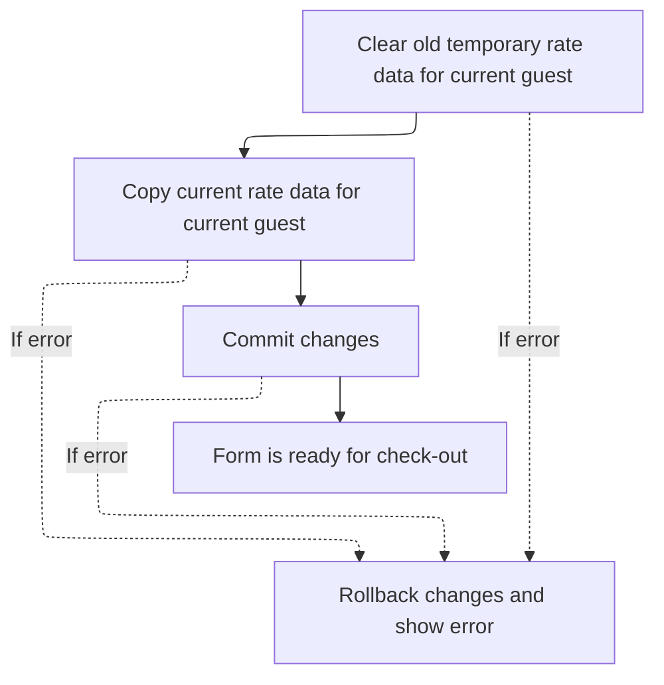

This document outlines how the check-out form is populated with guest and transaction data, calculates all charges and rates, and formats totals for display. The process ensures the user can review an accurate summary of the guest's stay and charges before proceeding with check-out.

# Loading and Binding Transaction Data

```mermaid
%%{init: {"flowchart": {"defaultRenderer": "elk"}} }%%
flowchart TD
    node1["Load guest stay details for RoomNumber"] --> node2{"Is AutoCheckOut enabled?"}
    click node1 openCode "HotelManagementSystem/Forms/frmCheckOut.frm:658:691"
    node2 -->|"Yes"| node3{"Is guest's DateOut >= today?"}
    click node2 openCode "HotelManagementSystem/Forms/frmCheckOut.frm:674:680"
    node3 -->|"Yes"| node4["Set checkout date to guest's DateOut"]
    click node3 openCode "HotelManagementSystem/Forms/frmCheckOut.frm:675:677"
    node3 -->|"No"| node4["Set checkout date to today"]
    click node4 openCode "HotelManagementSystem/Forms/frmCheckOut.frm:678:679"
    node2 -->|"No"| node4["Set checkout date to guest's DateOut"]
    node4 --> node5["Finalizing and Formatting Totals"]
    
    
    

classDef HeadingStyle fill:#777777,stroke:#333,stroke-width:2px;
click node5 goToHeading "Calculating Additional Room Rates"
node5:::HeadingStyle
click node5 goToHeading "Finalizing and Formatting Totals"
node5:::HeadingStyle

%% Swimm:
%% %%{init: {"flowchart": {"defaultRenderer": "elk"}} }%%
%% flowchart TD
%%     node1["Load guest stay details for <SwmToken path="HotelManagementSystem/Forms/frmCheckOut.frm" pos="664:16:16" line-data="    RS.Open &quot;SELECT * FROM Transactions WHERE RoomNumber = &quot; &amp; RoomNumber &amp; &quot; AND Status = &#39;Check In&#39;&quot;, CN, adOpenStatic, adLockOptimistic">`RoomNumber`</SwmToken>"] --> node2{"Is <SwmToken path="HotelManagementSystem/Forms/frmCheckOut.frm" pos="674:3:3" line-data="        If AutoCheckOut = True Then">`AutoCheckOut`</SwmToken> enabled?"}
%%     click node1 openCode "<SwmPath>[HotelManagementSystem/Forms/frmCheckOut.frm](HotelManagementSystem/Forms/frmCheckOut.frm)</SwmPath>:658:691"
%%     node2 -->|"Yes"| node3{"Is guest's <SwmToken path="HotelManagementSystem/Forms/frmCheckOut.frm" pos="675:7:7" line-data="            If .Fields(&quot;DateOut&quot;) &gt;= Date Then">`DateOut`</SwmToken> >= today?"}
%%     click node2 openCode "<SwmPath>[HotelManagementSystem/Forms/frmCheckOut.frm](HotelManagementSystem/Forms/frmCheckOut.frm)</SwmPath>:674:680"
%%     node3 -->|"Yes"| node4["Set checkout date to guest's <SwmToken path="HotelManagementSystem/Forms/frmCheckOut.frm" pos="675:7:7" line-data="            If .Fields(&quot;DateOut&quot;) &gt;= Date Then">`DateOut`</SwmToken>"]
%%     click node3 openCode "<SwmPath>[HotelManagementSystem/Forms/frmCheckOut.frm](HotelManagementSystem/Forms/frmCheckOut.frm)</SwmPath>:675:677"
%%     node3 -->|"No"| node4["Set checkout date to today"]
%%     click node4 openCode "<SwmPath>[HotelManagementSystem/Forms/frmCheckOut.frm](HotelManagementSystem/Forms/frmCheckOut.frm)</SwmPath>:678:679"
%%     node2 -->|"No"| node4["Set checkout date to guest's <SwmToken path="HotelManagementSystem/Forms/frmCheckOut.frm" pos="675:7:7" line-data="            If .Fields(&quot;DateOut&quot;) &gt;= Date Then">`DateOut`</SwmToken>"]
%%     node4 --> node5["Finalizing and Formatting Totals"]
%%     
%%     
%%     
%% 
%% classDef HeadingStyle fill:#777777,stroke:#333,stroke-width:2px;
%% click node5 goToHeading "Calculating Additional Room Rates"
%% node5:::HeadingStyle
%% click node5 goToHeading "Finalizing and Formatting Totals"
%% node5:::HeadingStyle
```



<SwmSnippet path="/HotelManagementSystem/Forms/frmCheckOut.frm" line="658">

---

In <SwmToken path="HotelManagementSystem/Forms/frmCheckOut.frm" pos="658:4:4" line-data="Private Sub Form_Load()">`Form_Load`</SwmToken> we're starting the flow by opening a transaction, loading the transaction record for the current room (status 'Check In'), and prepping the rate type dropdown. We need to call into <SwmPath>[HotelManagementSystem/Modules/modProcedure.bas](HotelManagementSystem/Modules/modProcedure.bas)</SwmPath> next to actually bind the dropdown to its data, so the UI can show the available rate types before we fill in the rest of the fields.

```visual basic
Private Sub Form_Load()
On Error GoTo err

    CN.BeginTrans

    RS.CursorLocation = adUseClient
    RS.Open "SELECT * FROM Transactions WHERE RoomNumber = " & RoomNumber & " AND Status = 'Check In'", CN, adOpenStatic, adLockOptimistic

    bind_dc "SELECT * FROM [Rate Type]", "RateType", dcRateType, "RateTypeID", True
```

---

</SwmSnippet>

<SwmSnippet path="/HotelManagementSystem/Modules/modProcedure.bas" line="180">

---

<SwmToken path="HotelManagementSystem/Modules/modProcedure.bas" pos="180:4:4" line-data="Public Sub bind_dc(ByVal srcSQL As String, ByVal srcBindField As String, ByRef srcDC As DataCombo, Optional srcColBound As String, Optional ShowFirstRec As Boolean)">`bind_dc`</SwmToken> is where we wire up the <SwmToken path="HotelManagementSystem/Modules/modProcedure.bas" pos="180:30:30" line-data="Public Sub bind_dc(ByVal srcSQL As String, ByVal srcBindField As String, ByRef srcDC As DataCombo, Optional srcColBound As String, Optional ShowFirstRec As Boolean)">`DataCombo`</SwmToken> to its data source, set which fields to display and bind, and optionally pre-select the first record. It also stashes the record count and current value in the Tag property for later use.

```visual basic
Public Sub bind_dc(ByVal srcSQL As String, ByVal srcBindField As String, ByRef srcDC As DataCombo, Optional srcColBound As String, Optional ShowFirstRec As Boolean)
    Dim RS As New Recordset
    
    RS.CursorLocation = adUseClient
    RS.Open srcSQL, CN, adOpenStatic, adLockOptimistic
    
    With srcDC
        .ListField = srcBindField
        .BoundColumn = srcColBound
        Set .RowSource = RS
        'Display the first record
        If ShowFirstRec = True Then
            If Not RS.RecordCount < 1 Then
                .BoundText = RS.Fields(srcColBound)
                .Tag = RS.RecordCount & "*~~~~~*" & RS.Fields(srcColBound)
            Else
                .Tag = "0*~~~~~*0"
            End If
        End If
    End With
    Set RS = Nothing
End Sub
```

---

</SwmSnippet>

<SwmSnippet path="/HotelManagementSystem/Forms/frmCheckOut.frm" line="667">

---

Back in <SwmToken path="HotelManagementSystem/Forms/frmCheckOut.frm" pos="658:4:4" line-data="Private Sub Form_Load()">`Form_Load`</SwmToken>, after binding the dropdown, we set up the room number and start populating guest info. We need to call into <SwmPath>[HotelManagementSystem/Modules/modFunction.bas](HotelManagementSystem/Modules/modFunction.bas)</SwmPath> next to fetch the guest name from another table (<SwmToken path="HotelManagementSystem/Forms/frmCheckOut.frm" pos="672:18:18" line-data="        txtGuestName.Text = getValueAt(&quot;SELECT [Name] FROM qry_CheckIn WHERE FolioNumber = &#39;&quot; &amp; .Fields(&quot;FolioNumber&quot;) &amp; &quot; &#39;&quot;, &quot;Name&quot;)">`qry_CheckIn`</SwmToken>) using the <SwmToken path="HotelManagementSystem/Forms/frmCheckOut.frm" pos="671:11:11" line-data="        txtGuestName.Tag = .Fields(&quot;FolioNumber&quot;)">`FolioNumber`</SwmToken>, since it's not directly in the Transactions record.

```visual basic

    txtRoomNumber.Text = RoomNumber
    
    With RS
        txtGuestName.Tag = .Fields("FolioNumber")
        txtGuestName.Text = getValueAt("SELECT [Name] FROM qry_CheckIn WHERE FolioNumber = '" & .Fields("FolioNumber") & " '", "Name")
```

---

</SwmSnippet>

<SwmSnippet path="/HotelManagementSystem/Modules/modFunction.bas" line="168">

---

<SwmToken path="HotelManagementSystem/Modules/modFunction.bas" pos="168:4:4" line-data="Public Function getValueAt(ByVal srcSQL As String, ByVal whichField As String) As String">`getValueAt`</SwmToken> just runs a query and pulls out the value of a single field from the first record. It's used here to quickly grab the guest name for display.

```visual basic
Public Function getValueAt(ByVal srcSQL As String, ByVal whichField As String) As String
    Dim RS As New Recordset
    
    RS.CursorLocation = adUseClient
    RS.Open srcSQL, CN, adOpenStatic, adLockReadOnly
    If RS.RecordCount > 0 Then getValueAt = RS.Fields(whichField)
    
    Set RS = Nothing
End Function
```

---

</SwmSnippet>

<SwmSnippet path="/HotelManagementSystem/Forms/frmCheckOut.frm" line="673">

---

Just returned from <SwmToken path="HotelManagementSystem/Forms/frmCheckOut.frm" pos="672:7:7" line-data="        txtGuestName.Text = getValueAt(&quot;SELECT [Name] FROM qry_CheckIn WHERE FolioNumber = &#39;&quot; &amp; .Fields(&quot;FolioNumber&quot;) &amp; &quot; &#39;&quot;, &quot;Name&quot;)">`getValueAt`</SwmToken>, we now fill in the rest of the fields in <SwmToken path="HotelManagementSystem/Forms/frmCheckOut.frm" pos="658:4:4" line-data="Private Sub Form_Load()">`Form_Load`</SwmToken>, including check-in/out dates, rate type, and all the monetary fields. We need to call into <SwmPath>[HotelManagementSystem/Modules/modFunction.bas](HotelManagementSystem/Modules/modFunction.bas)</SwmPath> again to format these numbers for display (<SwmToken path="HotelManagementSystem/Forms/frmCheckOut.frm" pos="687:7:7" line-data="        txtRate.Text = toMoney(.Fields(&quot;Rate&quot;))">`toMoney`</SwmToken>), so the UI doesn't show raw values.

```visual basic
        txtDateIn.Text = .Fields("DateIn")
        If AutoCheckOut = True Then
            If .Fields("DateOut") >= Date Then
                dtpDateOut.Value = .Fields("DateOut")
            Else
                dtpDateOut.Value = Date
            End If
        Else
            dtpDateOut.Value = .Fields("DateOut")
        End If
        dcRateType.BoundText = .Fields("RateType")
        txtDays.Text = dtpDateOut.Value - CDate(txtDateIn.Text)
        txtAdults.Text = .Fields("Adults")
        txtChildrens.Text = .Fields("Childrens")
        txtRate.Text = toMoney(.Fields("Rate"))
        txtOtherCharges.Text = toMoney(.Fields("OtherCharges"))
        txtDiscount.Text = toMoney(.Fields("Discount"))
        txtAmountPaid.Text = toMoney(.Fields("AmountPaid"))
```

---

</SwmSnippet>

<SwmSnippet path="/HotelManagementSystem/Modules/modFunction.bas" line="216">

---

<SwmToken path="HotelManagementSystem/Modules/modFunction.bas" pos="216:4:4" line-data="Public Function toMoney(ByVal srcCurr As String) As String">`toMoney`</SwmToken> just takes any string (even empty), treats it as a number, and formats it for display as currency. Used here to make sure all amounts look consistent in the UI.

```visual basic
Public Function toMoney(ByVal srcCurr As String) As String
   toMoney = Format$(IIf(Trim(srcCurr) = "", 0, srcCurr), "#,##0.00")
End Function
```

---

</SwmSnippet>

<SwmSnippet path="/HotelManagementSystem/Forms/frmCheckOut.frm" line="691">

---

Just returned from <SwmToken path="HotelManagementSystem/Forms/frmCheckOut.frm" pos="687:7:7" line-data="        txtRate.Text = toMoney(.Fields(&quot;Rate&quot;))">`toMoney`</SwmToken>, we finish up the initial field setup in <SwmToken path="HotelManagementSystem/Forms/frmCheckOut.frm" pos="658:4:4" line-data="Private Sub Form_Load()">`Form_Load`</SwmToken>, lock the rate type dropdown, and call <SwmToken path="HotelManagementSystem/Forms/frmCheckOut.frm" pos="695:3:3" line-data="    Call ComputeAddRate">`ComputeAddRate`</SwmToken> to recalculate the rates based on the latest data.

```visual basic
    End With
    
    dcRateType.Enabled = False
    
    Call ComputeAddRate
```

---

</SwmSnippet>

## Calculating Additional Room Rates

<SwmSnippet path="/HotelManagementSystem/Forms/frmCheckOut.frm" line="726">

---

In <SwmToken path="HotelManagementSystem/Forms/frmCheckOut.frm" pos="726:4:4" line-data="Private Sub ComputeAddRate()">`ComputeAddRate`</SwmToken> we look up the room rate and extra charges for the current room and rate type, then call into <SwmPath>[HotelManagementSystem/Modules/modFunction.bas](HotelManagementSystem/Modules/modFunction.bas)</SwmPath> to format the rate for display.

```visual basic
Private Sub ComputeAddRate()
    Dim rsRoomRates As New ADODB.Recordset
    
    With rsRoomRates
        .Open "SELECT * FROM [Room Rates] WHERE RoomNumber = " & RoomNumber & " AND RateTypeID = " & dcRateType.BoundText, CN, adOpenStatic, adLockOptimistic
    
        If .RecordCount > 0 Then
            txtRate.Text = toMoney(!RoomRate)
```

---

</SwmSnippet>

<SwmSnippet path="/HotelManagementSystem/Forms/frmCheckOut.frm" line="734">

---

Just returned from <SwmToken path="HotelManagementSystem/Forms/frmCheckOut.frm" pos="687:7:7" line-data="        txtRate.Text = toMoney(.Fields(&quot;Rate&quot;))">`toMoney`</SwmToken>, we stash the extra adult and child rates in the Tag properties of the relevant controls at the end of <SwmToken path="HotelManagementSystem/Forms/frmCheckOut.frm" pos="695:3:3" line-data="    Call ComputeAddRate">`ComputeAddRate`</SwmToken>, so they're available for later calculations.

```visual basic
            txtAdults.Tag = !ExtraAdultRate
            txtChildrens.Tag = !ExtraChildRate
        End If
    End With
    
    rsRoomRates.Close
End Sub
```

---

</SwmSnippet>

## Calculating Total Charges

<SwmSnippet path="/HotelManagementSystem/Forms/frmCheckOut.frm" line="696">

---

Just returned from <SwmToken path="HotelManagementSystem/Forms/frmCheckOut.frm" pos="695:3:3" line-data="    Call ComputeAddRate">`ComputeAddRate`</SwmToken>, we immediately call <SwmToken path="HotelManagementSystem/Forms/frmCheckOut.frm" pos="696:3:3" line-data="    Call ComputeRate">`ComputeRate`</SwmToken> in <SwmToken path="HotelManagementSystem/Forms/frmCheckOut.frm" pos="658:4:4" line-data="Private Sub Form_Load()">`Form_Load`</SwmToken> to update all the totals based on the latest rates and charges.

```visual basic
    Call ComputeRate
```

---

</SwmSnippet>

## Finalizing and Formatting Totals

<SwmSnippet path="/HotelManagementSystem/Forms/frmCheckOut.frm" line="718">

---

In <SwmToken path="HotelManagementSystem/Forms/frmCheckOut.frm" pos="718:4:4" line-data="Private Sub ComputeRate()">`ComputeRate`</SwmToken> we calculate all the totals, subtotal, discount, and balance for the checkout, and call into <SwmPath>[HotelManagementSystem/Modules/modFunction.bas](HotelManagementSystem/Modules/modFunction.bas)</SwmPath> to convert all the textbox values to numbers before doing the math.

```visual basic
Private Sub ComputeRate()
    txtTotalCharges.Text = toMoney(ComputeRatePerPeriod)
    txtSubTotal.Text = toMoney(toNumber(txtTotalCharges.Text) + toNumber(txtOtherCharges.Text))
```

---

</SwmSnippet>

<SwmSnippet path="/HotelManagementSystem/Forms/frmCheckOut.frm" line="720">

---

Just returned from <SwmToken path="HotelManagementSystem/Forms/frmCheckOut.frm" pos="720:9:9" line-data="    txtSubTotal.Text = toMoney(toNumber(txtTotalCharges.Text) + toNumber(txtOtherCharges.Text))">`toNumber`</SwmToken>, we add up the charges and other charges in <SwmToken path="HotelManagementSystem/Forms/frmCheckOut.frm" pos="696:3:3" line-data="    Call ComputeRate">`ComputeRate`</SwmToken>, then format the subtotal for display.

```visual basic
    txtSubTotal.Text = toMoney(toNumber(txtTotalCharges.Text) + toNumber(txtOtherCharges.Text))
```

---

</SwmSnippet>

<SwmSnippet path="/HotelManagementSystem/Modules/modFunction.bas" line="182">

---

<SwmToken path="HotelManagementSystem/Modules/modFunction.bas" pos="182:4:4" line-data="Public Function toNumber(ByVal srcCurrency As String, Optional RetZeroIfNegative As Boolean) As Double">`toNumber`</SwmToken> strips out commas and converts the string to a number, with an option to force zero if the value is negative or zero. Used here to make sure all math in <SwmToken path="HotelManagementSystem/Forms/frmCheckOut.frm" pos="696:3:3" line-data="    Call ComputeRate">`ComputeRate`</SwmToken> works on real numbers.

```visual basic
Public Function toNumber(ByVal srcCurrency As String, Optional RetZeroIfNegative As Boolean) As Double
    If srcCurrency = "" Then
        toNumber = 0
    Else
        Dim retValue As Double
        If InStr(1, srcCurrency, ",") > 0 Then
            retValue = Val(Replace(srcCurrency, ",", "", , , vbTextCompare))
        Else
            retValue = Val(srcCurrency)
        End If
        If RetZeroIfNegative = True Then
            If retValue < 1 Then retValue = 0
        End If
        toNumber = retValue
        retValue = 0
    End If
End Function
```

---

</SwmSnippet>

<SwmSnippet path="/HotelManagementSystem/Forms/frmCheckOut.frm" line="721">

---

Just returned from <SwmToken path="HotelManagementSystem/Forms/frmCheckOut.frm" pos="721:9:9" line-data="    txtTotal.Text = toMoney(toNumber(txtSubTotal.Text) - (toNumber(txtSubTotal.Text) * toNumber(txtDiscount.Text) / 100))">`toNumber`</SwmToken>, we apply the discount as a percentage in <SwmToken path="HotelManagementSystem/Forms/frmCheckOut.frm" pos="696:3:3" line-data="    Call ComputeRate">`ComputeRate`</SwmToken>, then format the total for display.

```visual basic
    txtTotal.Text = toMoney(toNumber(txtSubTotal.Text) - (toNumber(txtSubTotal.Text) * toNumber(txtDiscount.Text) / 100))
```

---

</SwmSnippet>

<SwmSnippet path="/HotelManagementSystem/Forms/frmCheckOut.frm" line="721">

---

Just returned from <SwmToken path="HotelManagementSystem/Forms/frmCheckOut.frm" pos="721:7:7" line-data="    txtTotal.Text = toMoney(toNumber(txtSubTotal.Text) - (toNumber(txtSubTotal.Text) * toNumber(txtDiscount.Text) / 100))">`toMoney`</SwmToken>, we keep formatting all calculated values in <SwmToken path="HotelManagementSystem/Forms/frmCheckOut.frm" pos="696:3:3" line-data="    Call ComputeRate">`ComputeRate`</SwmToken> so the UI always shows currency in the same way.

```visual basic
    txtTotal.Text = toMoney(toNumber(txtSubTotal.Text) - (toNumber(txtSubTotal.Text) * toNumber(txtDiscount.Text) / 100))
```

---

</SwmSnippet>

<SwmSnippet path="/HotelManagementSystem/Forms/frmCheckOut.frm" line="722">

---

Just returned from <SwmToken path="HotelManagementSystem/Forms/frmCheckOut.frm" pos="722:9:9" line-data="    txtBalance.Text = toMoney(toNumber(txtTotal.Text) - toNumber(txtAmountPaid.Text))">`toNumber`</SwmToken>, we subtract the amount paid from the total in <SwmToken path="HotelManagementSystem/Forms/frmCheckOut.frm" pos="696:3:3" line-data="    Call ComputeRate">`ComputeRate`</SwmToken> to get the balance, then format it for display.

```visual basic
    txtBalance.Text = toMoney(toNumber(txtTotal.Text) - toNumber(txtAmountPaid.Text))
```

---

</SwmSnippet>

<SwmSnippet path="/HotelManagementSystem/Forms/frmCheckOut.frm" line="722">

---

Just returned from <SwmToken path="HotelManagementSystem/Forms/frmCheckOut.frm" pos="722:7:7" line-data="    txtBalance.Text = toMoney(toNumber(txtTotal.Text) - toNumber(txtAmountPaid.Text))">`toMoney`</SwmToken>, we keep converting between numbers and formatted strings in <SwmToken path="HotelManagementSystem/Forms/frmCheckOut.frm" pos="696:3:3" line-data="    Call ComputeRate">`ComputeRate`</SwmToken> to keep calculations and display consistent.

```visual basic
    txtBalance.Text = toMoney(toNumber(txtTotal.Text) - toNumber(txtAmountPaid.Text))
```

---

</SwmSnippet>

<SwmSnippet path="/HotelManagementSystem/Forms/frmCheckOut.frm" line="723">

---

At the end of <SwmToken path="HotelManagementSystem/Forms/frmCheckOut.frm" pos="696:3:3" line-data="    Call ComputeRate">`ComputeRate`</SwmToken>, all the totals and balances are recalculated and formatted, so the UI is ready for the user.

```visual basic
End Sub
```

---

</SwmSnippet>

## Refreshing Temporary Rate Data and Error Handling



<SwmSnippet path="/HotelManagementSystem/Forms/frmCheckOut.frm" line="697">

---

Just returned from <SwmToken path="HotelManagementSystem/Forms/frmCheckOut.frm" pos="696:3:3" line-data="    Call ComputeRate">`ComputeRate`</SwmToken>, we clear out and reload the temp rate per period table for the current folio in <SwmToken path="HotelManagementSystem/Forms/frmCheckOut.frm" pos="658:4:4" line-data="Private Sub Form_Load()">`Form_Load`</SwmToken>, so all calculations use the latest data. If anything fails, we call into <SwmPath>[HotelManagementSystem/Modules/modProcedure.bas](HotelManagementSystem/Modules/modProcedure.bas)</SwmPath> for error handling.

```visual basic

    
    CN.Execute "DELETE FolioNumber " & _
                "From [Rate Per Period Temp] " & _
                "WHERE FolioNumber='" & txtGuestName.Tag & "'"

    CN.Execute "INSERT INTO [Rate Per Period Temp] " & _
                "SELECT [Rate Per Period].* " & _
                "From [Rate Per Period] " & _
                "WHERE FolioNumber='" & txtGuestName.Tag & "'"
                
    CN.CommitTrans
    
    Exit Sub

err:
    CN.RollbackTrans
    prompt_err err, Name, "txtDays_Change"
```

---

</SwmSnippet>

<SwmSnippet path="/HotelManagementSystem/Modules/modProcedure.bas" line="87">

---

<SwmToken path="HotelManagementSystem/Modules/modProcedure.bas" pos="87:4:4" line-data="Public Sub prompt_err(ByVal sError As ErrObject, ByVal ModuleName As String, ByVal OccurIn As String)">`prompt_err`</SwmToken> pops up an error message for the user and logs all the details to a file for later debugging.

```visual basic
Public Sub prompt_err(ByVal sError As ErrObject, ByVal ModuleName As String, ByVal OccurIn As String)
    MsgBox "Error From: " & ModuleName & vbNewLine & _
           "Occur In: " & OccurIn & vbNewLine & _
           "Error Number: " & sError.Number & vbNewLine & _
           "Description: " & sError.Description, vbCritical, "Application Error"
    'Save the error log (The save error log will be display later on in the program)
    Open App.Path & "\Error.log" For Append As #1
        Print #1, Format(Date, "MMM-dd-yyyy") & "~~~~~" & Time & "~~~~~" & sError.Number & "~~~~~" & sError.Description & "~~~~~" & ModuleName & "~~~~~" & OccurIn
    Close #1
End Sub
```

---

</SwmSnippet>

<SwmSnippet path="/HotelManagementSystem/Forms/frmCheckOut.frm" line="715">

---

At the end of <SwmToken path="HotelManagementSystem/Forms/frmCheckOut.frm" pos="658:4:4" line-data="Private Sub Form_Load()">`Form_Load`</SwmToken>, we just reset the mouse pointer so the UI is back to normal for the user.

```visual basic
    Screen.MousePointer = vbDefault
End Sub
```

---

</SwmSnippet>

&nbsp;

*This is an auto-generated document by Swimm 🌊 and has not yet been verified by a human*

<SwmMeta version="3.0.0" repo-id="Z2l0aHViJTNBJTNBY3RzLVZCNi1Qcm9qZWN0cyUzQSUzQVN3aW1tLURlbW8=" repo-name="cts-VB6-Projects"><sup>Powered by [Swimm](https://app.swimm.io/)</sup></SwmMeta>
