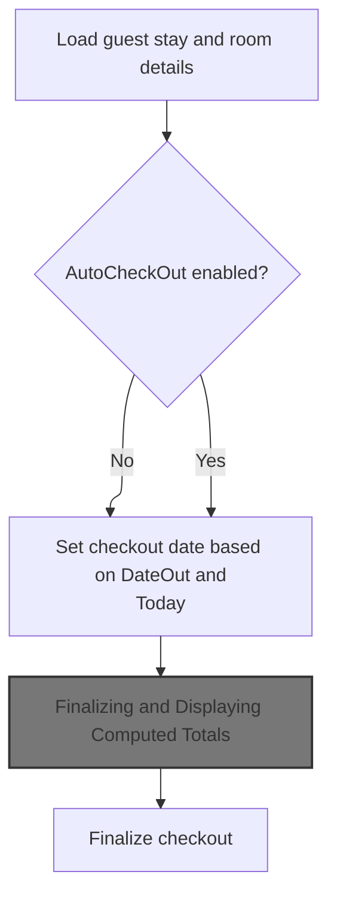

This document outlines how the checkout form is prepared for a guest's departure. The system gathers all necessary guest and room details, calculates rates and totals, and updates the form so the user can review or complete the checkout.

# Loading Checkout Data and Preparing the Form



<SwmSnippet path="/HotelManagementSystem/Forms/frmCheckOut.frm" line="658">

---

In <SwmToken path="HotelManagementSystem/Forms/frmCheckOut.frm" pos="658:4:4" line-data="Private Sub Form_Load()">`Form_Load`</SwmToken>, we start a DB transaction and open a recordset for the current room's active transaction. Then, we bind the rate type dropdown to the Rate Type table so the user can see/select available rate types. Next, we need to call <SwmToken path="HotelManagementSystem/Forms/frmCheckOut.frm" pos="666:1:1" line-data="    bind_dc &quot;SELECT * FROM [Rate Type]&quot;, &quot;RateType&quot;, dcRateType, &quot;RateTypeID&quot;, True">`bind_dc`</SwmToken> (in <SwmPath>[HotelManagementSystem/Modules/modProcedure.bas](HotelManagementSystem/Modules/modProcedure.bas)</SwmPath>) to actually perform the binding and handle the dropdown's state.

```visual basic
Private Sub Form_Load()
On Error GoTo err

    CN.BeginTrans

    RS.CursorLocation = adUseClient
    RS.Open "SELECT * FROM Transactions WHERE RoomNumber = " & RoomNumber & " AND Status = 'Check In'", CN, adOpenStatic, adLockOptimistic

    bind_dc "SELECT * FROM [Rate Type]", "RateType", dcRateType, "RateTypeID", True
```

---

</SwmSnippet>

<SwmSnippet path="/HotelManagementSystem/Modules/modProcedure.bas" line="180">

---

<SwmToken path="HotelManagementSystem/Modules/modProcedure.bas" pos="180:4:4" line-data="Public Sub bind_dc(ByVal srcSQL As String, ByVal srcBindField As String, ByRef srcDC As DataCombo, Optional srcColBound As String, Optional ShowFirstRec As Boolean)">`bind_dc`</SwmToken> binds the <SwmToken path="HotelManagementSystem/Modules/modProcedure.bas" pos="180:30:30" line-data="Public Sub bind_dc(ByVal srcSQL As String, ByVal srcBindField As String, ByRef srcDC As DataCombo, Optional srcColBound As String, Optional ShowFirstRec As Boolean)">`DataCombo`</SwmToken> to the result of the given SQL, sets up display and value fields, and (if requested) caches the record count and first value in the Tag property for quick access later.

```visual basic
Public Sub bind_dc(ByVal srcSQL As String, ByVal srcBindField As String, ByRef srcDC As DataCombo, Optional srcColBound As String, Optional ShowFirstRec As Boolean)
    Dim RS As New Recordset
    
    RS.CursorLocation = adUseClient
    RS.Open srcSQL, CN, adOpenStatic, adLockOptimistic
    
    With srcDC
        .ListField = srcBindField
        .BoundColumn = srcColBound
        Set .RowSource = RS
        'Display the first record
        If ShowFirstRec = True Then
            If Not RS.RecordCount < 1 Then
                .BoundText = RS.Fields(srcColBound)
                .Tag = RS.RecordCount & "*~~~~~*" & RS.Fields(srcColBound)
            Else
                .Tag = "0*~~~~~*0"
            End If
        End If
    End With
    Set RS = Nothing
End Sub
```

---

</SwmSnippet>

<SwmSnippet path="/HotelManagementSystem/Forms/frmCheckOut.frm" line="667">

---

Back in <SwmToken path="HotelManagementSystem/Forms/frmCheckOut.frm" pos="658:4:4" line-data="Private Sub Form_Load()">`Form_Load`</SwmToken>, after binding the dropdown, we start filling in the form fields. For the guest name, we call <SwmToken path="HotelManagementSystem/Forms/frmCheckOut.frm" pos="672:7:7" line-data="        txtGuestName.Text = getValueAt(&quot;SELECT [Name] FROM qry_CheckIn WHERE FolioNumber = &#39;&quot; &amp; .Fields(&quot;FolioNumber&quot;) &amp; &quot; &#39;&quot;, &quot;Name&quot;)">`getValueAt`</SwmToken> (<SwmPath>[HotelManagementSystem/Modules/modFunction.bas](HotelManagementSystem/Modules/modFunction.bas)</SwmPath>) to fetch it from a related query, since it's not in the main transaction recordset.

```visual basic

    txtRoomNumber.Text = RoomNumber
    
    With RS
        txtGuestName.Tag = .Fields("FolioNumber")
        txtGuestName.Text = getValueAt("SELECT [Name] FROM qry_CheckIn WHERE FolioNumber = '" & .Fields("FolioNumber") & " '", "Name")
```

---

</SwmSnippet>

<SwmSnippet path="/HotelManagementSystem/Modules/modFunction.bas" line="168">

---

<SwmToken path="HotelManagementSystem/Modules/modFunction.bas" pos="168:4:4" line-data="Public Function getValueAt(ByVal srcSQL As String, ByVal whichField As String) As String">`getValueAt`</SwmToken> runs the given SQL and returns the specified field from the first record, or an empty string if nothing is found. Used for quick lookups like guest name.

```visual basic
Public Function getValueAt(ByVal srcSQL As String, ByVal whichField As String) As String
    Dim RS As New Recordset
    
    RS.CursorLocation = adUseClient
    RS.Open srcSQL, CN, adOpenStatic, adLockReadOnly
    If RS.RecordCount > 0 Then getValueAt = RS.Fields(whichField)
    
    Set RS = Nothing
End Function
```

---

</SwmSnippet>

<SwmSnippet path="/HotelManagementSystem/Forms/frmCheckOut.frm" line="673">

---

Back in <SwmToken path="HotelManagementSystem/Forms/frmCheckOut.frm" pos="658:4:4" line-data="Private Sub Form_Load()">`Form_Load`</SwmToken>, after fetching the guest name, we fill in the rest of the fields: dates, rate type, days, adults, children, and all monetary fields. For currency formatting, we call <SwmToken path="HotelManagementSystem/Forms/frmCheckOut.frm" pos="687:7:7" line-data="        txtRate.Text = toMoney(.Fields(&quot;Rate&quot;))">`toMoney`</SwmToken> (<SwmPath>[HotelManagementSystem/Modules/modFunction.bas](HotelManagementSystem/Modules/modFunction.bas)</SwmPath>) to standardize the display.

```visual basic
        txtDateIn.Text = .Fields("DateIn")
        If AutoCheckOut = True Then
            If .Fields("DateOut") >= Date Then
                dtpDateOut.Value = .Fields("DateOut")
            Else
                dtpDateOut.Value = Date
            End If
        Else
            dtpDateOut.Value = .Fields("DateOut")
        End If
        dcRateType.BoundText = .Fields("RateType")
        txtDays.Text = dtpDateOut.Value - CDate(txtDateIn.Text)
        txtAdults.Text = .Fields("Adults")
        txtChildrens.Text = .Fields("Childrens")
        txtRate.Text = toMoney(.Fields("Rate"))
        txtOtherCharges.Text = toMoney(.Fields("OtherCharges"))
        txtDiscount.Text = toMoney(.Fields("Discount"))
        txtAmountPaid.Text = toMoney(.Fields("AmountPaid"))
```

---

</SwmSnippet>

<SwmSnippet path="/HotelManagementSystem/Modules/modFunction.bas" line="216">

---

<SwmToken path="HotelManagementSystem/Modules/modFunction.bas" pos="216:4:4" line-data="Public Function toMoney(ByVal srcCurr As String) As String">`toMoney`</SwmToken> formats a string as currency with two decimals and thousands separators, treating blanks as zero. Used for all displayed monetary values.

```visual basic
Public Function toMoney(ByVal srcCurr As String) As String
   toMoney = Format$(IIf(Trim(srcCurr) = "", 0, srcCurr), "#,##0.00")
End Function
```

---

</SwmSnippet>

<SwmSnippet path="/HotelManagementSystem/Forms/frmCheckOut.frm" line="691">

---

Back in <SwmToken path="HotelManagementSystem/Forms/frmCheckOut.frm" pos="658:4:4" line-data="Private Sub Form_Load()">`Form_Load`</SwmToken>, after setting up all fields and formatting, we disable the rate type dropdown to lock the selection, then call <SwmToken path="HotelManagementSystem/Forms/frmCheckOut.frm" pos="695:3:3" line-data="    Call ComputeAddRate">`ComputeAddRate`</SwmToken> to fetch and apply any extra rates based on the current selection.

```visual basic
    End With
    
    dcRateType.Enabled = False
    
    Call ComputeAddRate
```

---

</SwmSnippet>

## Calculating Additional Room Rates

<SwmSnippet path="/HotelManagementSystem/Forms/frmCheckOut.frm" line="726">

---

In <SwmToken path="HotelManagementSystem/Forms/frmCheckOut.frm" pos="726:4:4" line-data="Private Sub ComputeAddRate()">`ComputeAddRate`</SwmToken>, we query the Room Rates table for the current room and rate type. If found, we update the rate field and cache extra adult/child rates in the Tag properties. We call <SwmToken path="HotelManagementSystem/Forms/frmCheckOut.frm" pos="733:7:7" line-data="            txtRate.Text = toMoney(!RoomRate)">`toMoney`</SwmToken> next to format the rate for display.

```visual basic
Private Sub ComputeAddRate()
    Dim rsRoomRates As New ADODB.Recordset
    
    With rsRoomRates
        .Open "SELECT * FROM [Room Rates] WHERE RoomNumber = " & RoomNumber & " AND RateTypeID = " & dcRateType.BoundText, CN, adOpenStatic, adLockOptimistic
    
        If .RecordCount > 0 Then
            txtRate.Text = toMoney(!RoomRate)
```

---

</SwmSnippet>

<SwmSnippet path="/HotelManagementSystem/Forms/frmCheckOut.frm" line="734">

---

Back in <SwmToken path="HotelManagementSystem/Forms/frmCheckOut.frm" pos="695:3:3" line-data="    Call ComputeAddRate">`ComputeAddRate`</SwmToken>, after formatting and updating the UI with the rates, we close the recordset to clean up resources.

```visual basic
            txtAdults.Tag = !ExtraAdultRate
            txtChildrens.Tag = !ExtraChildRate
        End If
    End With
    
    rsRoomRates.Close
End Sub
```

---

</SwmSnippet>

## Calculating Total Charges

<SwmSnippet path="/HotelManagementSystem/Forms/frmCheckOut.frm" line="696">

---

Back in <SwmToken path="HotelManagementSystem/Forms/frmCheckOut.frm" pos="658:4:4" line-data="Private Sub Form_Load()">`Form_Load`</SwmToken>, after updating extra rates, we call <SwmToken path="HotelManagementSystem/Forms/frmCheckOut.frm" pos="696:3:3" line-data="    Call ComputeRate">`ComputeRate`</SwmToken> to recalculate all totals and balances based on the latest data.

```visual basic
    Call ComputeRate
```

---

</SwmSnippet>

## Finalizing and Displaying Computed Totals

<SwmSnippet path="/HotelManagementSystem/Forms/frmCheckOut.frm" line="718">

---

In <SwmToken path="HotelManagementSystem/Forms/frmCheckOut.frm" pos="718:4:4" line-data="Private Sub ComputeRate()">`ComputeRate`</SwmToken>, we calculate the total charges (using <SwmToken path="HotelManagementSystem/Forms/frmCheckOut.frm" pos="719:9:9" line-data="    txtTotalCharges.Text = toMoney(ComputeRatePerPeriod)">`ComputeRatePerPeriod`</SwmToken>), then add other charges for the subtotal. We call <SwmToken path="HotelManagementSystem/Forms/frmCheckOut.frm" pos="719:7:7" line-data="    txtTotalCharges.Text = toMoney(ComputeRatePerPeriod)">`toMoney`</SwmToken> and <SwmToken path="HotelManagementSystem/Forms/frmCheckOut.frm" pos="720:9:9" line-data="    txtSubTotal.Text = toMoney(toNumber(txtTotalCharges.Text) + toNumber(txtOtherCharges.Text))">`toNumber`</SwmToken> (<SwmPath>[HotelManagementSystem/Modules/modFunction.bas](HotelManagementSystem/Modules/modFunction.bas)</SwmPath>) to handle formatting and conversion for these calculations.

```visual basic
Private Sub ComputeRate()
    txtTotalCharges.Text = toMoney(ComputeRatePerPeriod)
    txtSubTotal.Text = toMoney(toNumber(txtTotalCharges.Text) + toNumber(txtOtherCharges.Text))
```

---

</SwmSnippet>

<SwmSnippet path="/HotelManagementSystem/Forms/frmCheckOut.frm" line="720">

---

Back in <SwmToken path="HotelManagementSystem/Forms/frmCheckOut.frm" pos="696:3:3" line-data="    Call ComputeRate">`ComputeRate`</SwmToken>, after getting the total charges, we sum with other charges for the subtotal, converting everything to numbers with <SwmToken path="HotelManagementSystem/Forms/frmCheckOut.frm" pos="720:9:9" line-data="    txtSubTotal.Text = toMoney(toNumber(txtTotalCharges.Text) + toNumber(txtOtherCharges.Text))">`toNumber`</SwmToken> to avoid calculation errors.

```visual basic
    txtSubTotal.Text = toMoney(toNumber(txtTotalCharges.Text) + toNumber(txtOtherCharges.Text))
```

---

</SwmSnippet>

<SwmSnippet path="/HotelManagementSystem/Modules/modFunction.bas" line="182">

---

<SwmToken path="HotelManagementSystem/Modules/modFunction.bas" pos="182:4:4" line-data="Public Function toNumber(ByVal srcCurrency As String, Optional RetZeroIfNegative As Boolean) As Double">`toNumber`</SwmToken> converts a currency string (with or without commas) to a double, with an option to force zero if the result is negative or too small. Used for all math on currency fields.

```visual basic
Public Function toNumber(ByVal srcCurrency As String, Optional RetZeroIfNegative As Boolean) As Double
    If srcCurrency = "" Then
        toNumber = 0
    Else
        Dim retValue As Double
        If InStr(1, srcCurrency, ",") > 0 Then
            retValue = Val(Replace(srcCurrency, ",", "", , , vbTextCompare))
        Else
            retValue = Val(srcCurrency)
        End If
        If RetZeroIfNegative = True Then
            If retValue < 1 Then retValue = 0
        End If
        toNumber = retValue
        retValue = 0
    End If
End Function
```

---

</SwmSnippet>

<SwmSnippet path="/HotelManagementSystem/Forms/frmCheckOut.frm" line="721">

---

Back in <SwmToken path="HotelManagementSystem/Forms/frmCheckOut.frm" pos="696:3:3" line-data="    Call ComputeRate">`ComputeRate`</SwmToken>, after getting the subtotal, we apply the discount (as a percent) and format the result for display using <SwmToken path="HotelManagementSystem/Forms/frmCheckOut.frm" pos="721:7:7" line-data="    txtTotal.Text = toMoney(toNumber(txtSubTotal.Text) - (toNumber(txtSubTotal.Text) * toNumber(txtDiscount.Text) / 100))">`toMoney`</SwmToken> and <SwmToken path="HotelManagementSystem/Forms/frmCheckOut.frm" pos="721:9:9" line-data="    txtTotal.Text = toMoney(toNumber(txtSubTotal.Text) - (toNumber(txtSubTotal.Text) * toNumber(txtDiscount.Text) / 100))">`toNumber`</SwmToken>.

```visual basic
    txtTotal.Text = toMoney(toNumber(txtSubTotal.Text) - (toNumber(txtSubTotal.Text) * toNumber(txtDiscount.Text) / 100))
```

---

</SwmSnippet>

<SwmSnippet path="/HotelManagementSystem/Forms/frmCheckOut.frm" line="721">

---

Back in <SwmToken path="HotelManagementSystem/Forms/frmCheckOut.frm" pos="696:3:3" line-data="    Call ComputeRate">`ComputeRate`</SwmToken>, we subtract the amount paid from the total to get the balance, again converting and formatting with <SwmToken path="HotelManagementSystem/Forms/frmCheckOut.frm" pos="721:9:9" line-data="    txtTotal.Text = toMoney(toNumber(txtSubTotal.Text) - (toNumber(txtSubTotal.Text) * toNumber(txtDiscount.Text) / 100))">`toNumber`</SwmToken> and <SwmToken path="HotelManagementSystem/Forms/frmCheckOut.frm" pos="721:7:7" line-data="    txtTotal.Text = toMoney(toNumber(txtSubTotal.Text) - (toNumber(txtSubTotal.Text) * toNumber(txtDiscount.Text) / 100))">`toMoney`</SwmToken>.

```visual basic
    txtTotal.Text = toMoney(toNumber(txtSubTotal.Text) - (toNumber(txtSubTotal.Text) * toNumber(txtDiscount.Text) / 100))
```

---

</SwmSnippet>

<SwmSnippet path="/HotelManagementSystem/Forms/frmCheckOut.frm" line="722">

---

Back in <SwmToken path="HotelManagementSystem/Forms/frmCheckOut.frm" pos="696:3:3" line-data="    Call ComputeRate">`ComputeRate`</SwmToken>, we format the final balance for display, keeping the UI consistent and readable.

```visual basic
    txtBalance.Text = toMoney(toNumber(txtTotal.Text) - toNumber(txtAmountPaid.Text))
```

---

</SwmSnippet>

<SwmSnippet path="/HotelManagementSystem/Forms/frmCheckOut.frm" line="722">

---

Back in <SwmToken path="HotelManagementSystem/Forms/frmCheckOut.frm" pos="696:3:3" line-data="    Call ComputeRate">`ComputeRate`</SwmToken>, every calculated field is formatted before display, so the user always sees proper currency formatting.

```visual basic
    txtBalance.Text = toMoney(toNumber(txtTotal.Text) - toNumber(txtAmountPaid.Text))
```

---

</SwmSnippet>

<SwmSnippet path="/HotelManagementSystem/Forms/frmCheckOut.frm" line="723">

---

Finally, in <SwmToken path="HotelManagementSystem/Forms/frmCheckOut.frm" pos="696:3:3" line-data="    Call ComputeRate">`ComputeRate`</SwmToken>, all totals and balances are calculated and displayed, so the function ends here.

```visual basic
End Sub
```

---

</SwmSnippet>

## Committing Data and Handling Errors

<SwmSnippet path="/HotelManagementSystem/Forms/frmCheckOut.frm" line="697">

---

Back in <SwmToken path="HotelManagementSystem/Forms/frmCheckOut.frm" pos="658:4:4" line-data="Private Sub Form_Load()">`Form_Load`</SwmToken>, after all calculations, we refresh the temp rate per period table for the current folio, then commit the transaction. If anything fails, we roll back and call <SwmToken path="HotelManagementSystem/Forms/frmCheckOut.frm" pos="714:1:1" line-data="    prompt_err err, Name, &quot;txtDays_Change&quot;">`prompt_err`</SwmToken> (<SwmPath>[HotelManagementSystem/Modules/modProcedure.bas](HotelManagementSystem/Modules/modProcedure.bas)</SwmPath>) to show/log the error.

```visual basic

    
    CN.Execute "DELETE FolioNumber " & _
                "From [Rate Per Period Temp] " & _
                "WHERE FolioNumber='" & txtGuestName.Tag & "'"

    CN.Execute "INSERT INTO [Rate Per Period Temp] " & _
                "SELECT [Rate Per Period].* " & _
                "From [Rate Per Period] " & _
                "WHERE FolioNumber='" & txtGuestName.Tag & "'"
                
    CN.CommitTrans
    
    Exit Sub

err:
    CN.RollbackTrans
    prompt_err err, Name, "txtDays_Change"
```

---

</SwmSnippet>

<SwmSnippet path="/HotelManagementSystem/Modules/modProcedure.bas" line="87">

---

<SwmToken path="HotelManagementSystem/Modules/modProcedure.bas" pos="87:4:4" line-data="Public Sub prompt_err(ByVal sError As ErrObject, ByVal ModuleName As String, ByVal OccurIn As String)">`prompt_err`</SwmToken> shows a message box with error details and logs the error to <SwmPath>[HotelManagementSystem/Error.log](HotelManagementSystem/Error.log)</SwmPath> for later review.

```visual basic
Public Sub prompt_err(ByVal sError As ErrObject, ByVal ModuleName As String, ByVal OccurIn As String)
    MsgBox "Error From: " & ModuleName & vbNewLine & _
           "Occur In: " & OccurIn & vbNewLine & _
           "Error Number: " & sError.Number & vbNewLine & _
           "Description: " & sError.Description, vbCritical, "Application Error"
    'Save the error log (The save error log will be display later on in the program)
    Open App.Path & "\Error.log" For Append As #1
        Print #1, Format(Date, "MMM-dd-yyyy") & "~~~~~" & Time & "~~~~~" & sError.Number & "~~~~~" & sError.Description & "~~~~~" & ModuleName & "~~~~~" & OccurIn
    Close #1
End Sub
```

---

</SwmSnippet>

<SwmSnippet path="/HotelManagementSystem/Forms/frmCheckOut.frm" line="715">

---

Finally, back in <SwmToken path="HotelManagementSystem/Forms/frmCheckOut.frm" pos="658:4:4" line-data="Private Sub Form_Load()">`Form_Load`</SwmToken>, we reset the mouse pointer to default, signaling that all processing is done.

```visual basic
    Screen.MousePointer = vbDefault
End Sub
```

---

</SwmSnippet>

&nbsp;

*This is an auto-generated document by Swimm 🌊 and has not yet been verified by a human*

<SwmMeta version="3.0.0" repo-id="Z2l0aHViJTNBJTNBY3RzLVZCNi1Qcm9qZWN0cyUzQSUzQVN3aW1tLURlbW8=" repo-name="cts-VB6-Projects"><sup>Powered by [Swimm](https://app.swimm.io/)</sup></SwmMeta>
