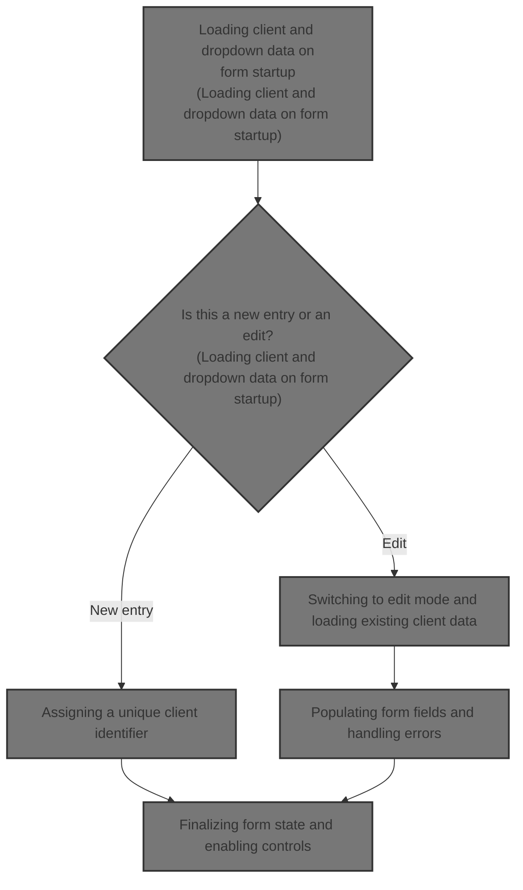
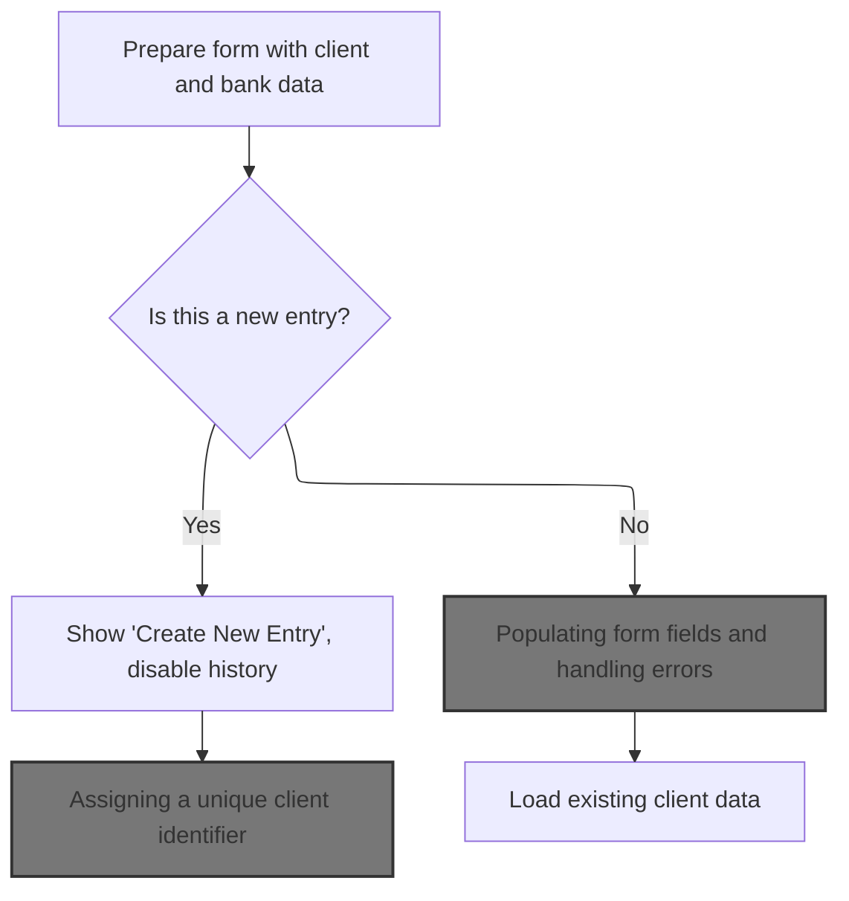
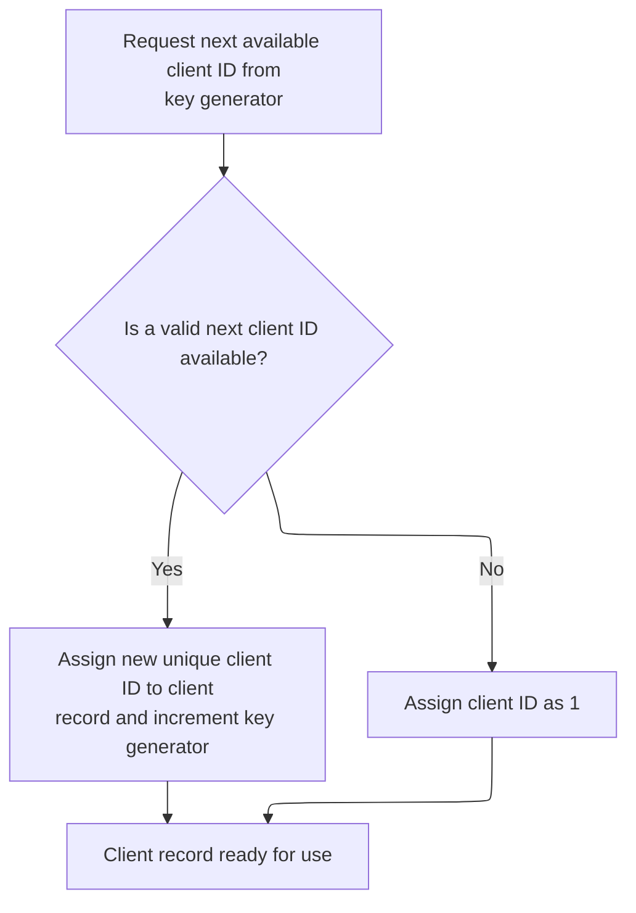

This document describes how the client account form is prepared for user interaction in the client management system. When the form is opened, it loads client and bank data, populates dropdowns, and decides whether to create a new client or edit an existing one. The form is then finalized and ready for user input.



# Loading client and dropdown data on form startup



<SwmSnippet path="/HotelManagementSystem/Forms/frmAccounts.frm" line="406">

---

In <SwmToken path="HotelManagementSystem/Forms/frmAccounts.frm" pos="406:4:4" line-data="Private Sub Form_Load()">`Form_Load`</SwmToken>, we open recordsets for client and bank data filtered by PK, then call <SwmToken path="HotelManagementSystem/Forms/frmAccounts.frm" pos="413:1:1" line-data="    bind_dc &quot;SELECT * FROM Clients_Category&quot;, &quot;Category&quot;, dcCategory, &quot;CategoryID&quot;, True">`bind_dc`</SwmToken> to fill the category and city dropdowns from the database. Next, we need <SwmPath>[HotelManagementSystem/Modules/modProcedure.bas](HotelManagementSystem/Modules/modProcedure.bas)</SwmPath> because <SwmToken path="HotelManagementSystem/Forms/frmAccounts.frm" pos="413:1:1" line-data="    bind_dc &quot;SELECT * FROM Clients_Category&quot;, &quot;Category&quot;, dcCategory, &quot;CategoryID&quot;, True">`bind_dc`</SwmToken> handles the actual binding logic for those dropdowns.

```visual basic
Private Sub Form_Load()
    RS.CursorLocation = adUseClient
    RS.Open "SELECT * FROM Clients WHERE ClientID = " & PK, CN, adOpenStatic, adLockOptimistic
        
    rsClientBank.CursorLocation = adUseClient
    rsClientBank.Open "SELECT * FROM qry_Clients_Bank WHERE ClientID = " & PK, CN, adOpenStatic, adLockOptimistic
    
    bind_dc "SELECT * FROM Clients_Category", "Category", dcCategory, "CategoryID", True
    bind_dc "SELECT * FROM Cities", "City", dcCity, "CityID", True
```

---

</SwmSnippet>

<SwmSnippet path="/HotelManagementSystem/Modules/modProcedure.bas" line="180">

---

<SwmToken path="HotelManagementSystem/Modules/modProcedure.bas" pos="180:4:4" line-data="Public Sub bind_dc(ByVal srcSQL As String, ByVal srcBindField As String, ByRef srcDC As DataCombo, Optional srcColBound As String, Optional ShowFirstRec As Boolean)">`bind_dc`</SwmToken> binds a <SwmToken path="HotelManagementSystem/Modules/modProcedure.bas" pos="180:30:30" line-data="Public Sub bind_dc(ByVal srcSQL As String, ByVal srcBindField As String, ByRef srcDC As DataCombo, Optional srcColBound As String, Optional ShowFirstRec As Boolean)">`DataCombo`</SwmToken> to a recordset from an SQL query, sets up the fields, and optionally sets the <SwmToken path="HotelManagementSystem/Modules/modProcedure.bas" pos="193:2:2" line-data="                .BoundText = RS.Fields(srcColBound)">`BoundText`</SwmToken> and Tag for quick access to the first record and metadata.

```visual basic
Public Sub bind_dc(ByVal srcSQL As String, ByVal srcBindField As String, ByRef srcDC As DataCombo, Optional srcColBound As String, Optional ShowFirstRec As Boolean)
    Dim RS As New Recordset
    
    RS.CursorLocation = adUseClient
    RS.Open srcSQL, CN, adOpenStatic, adLockOptimistic
    
    With srcDC
        .ListField = srcBindField
        .BoundColumn = srcColBound
        Set .RowSource = RS
        'Display the first record
        If ShowFirstRec = True Then
            If Not RS.RecordCount < 1 Then
                .BoundText = RS.Fields(srcColBound)
                .Tag = RS.RecordCount & "*~~~~~*" & RS.Fields(srcColBound)
            Else
                .Tag = "0*~~~~~*0"
            End If
        End If
    End With
    Set RS = Nothing
End Sub
```

---

</SwmSnippet>

<SwmSnippet path="/HotelManagementSystem/Forms/frmAccounts.frm" line="415">

---

Back in <SwmToken path="HotelManagementSystem/Forms/frmAccounts.frm" pos="406:4:4" line-data="Private Sub Form_Load()">`Form_Load`</SwmToken> after binding dropdowns, we check if we're in add or popup mode. If so, we set up the UI for a new entry and call <SwmToken path="HotelManagementSystem/Forms/frmAccounts.frm" pos="421:1:1" line-data="        GeneratePK">`GeneratePK`</SwmToken> to get a new client identifier.

```visual basic
   
    'Check the form state
    If State = adStateAddMode Or State = adStatePopupMode Then
        Caption = "Create New Entry"
        cmdUsrHistory.Enabled = False
        
        GeneratePK
```

---

</SwmSnippet>

## Assigning a unique client identifier



<SwmSnippet path="/HotelManagementSystem/Forms/frmAccounts.frm" line="431">

---

In <SwmToken path="HotelManagementSystem/Forms/frmAccounts.frm" pos="431:4:4" line-data="Private Sub GeneratePK()">`GeneratePK`</SwmToken>, we assign PK by calling <SwmToken path="HotelManagementSystem/Forms/frmAccounts.frm" pos="432:5:5" line-data="    PK = getIndex(&quot;Clients&quot;)">`getIndex`</SwmToken> with "Clients". Next, we need <SwmPath>[HotelManagementSystem/Modules/modADO.bas](HotelManagementSystem/Modules/modADO.bas)</SwmPath> because <SwmToken path="HotelManagementSystem/Forms/frmAccounts.frm" pos="432:5:5" line-data="    PK = getIndex(&quot;Clients&quot;)">`getIndex`</SwmToken> handles the logic for generating or retrieving the next available client key.

```visual basic
Private Sub GeneratePK()
    PK = getIndex("Clients")
```

---

</SwmSnippet>

<SwmSnippet path="/HotelManagementSystem/Modules/modADO.bas" line="35">

---

<SwmToken path="HotelManagementSystem/Modules/modADO.bas" pos="35:4:4" line-data="Public Function getIndex(ByVal srcTable As String) As Long">`getIndex`</SwmToken> grabs the next key from the generator table, increments it in a transaction, and returns the original value. If the value is missing, it defaults to 1.

```visual basic
Public Function getIndex(ByVal srcTable As String) As Long
    On Error GoTo err
    Dim RS As New Recordset
    Dim RI As Long
    
    RS.CursorLocation = adUseClient
    RS.Open "SELECT * FROM [KEY GENERATOR] WHERE TableName = '" & srcTable & "'", CN, adOpenStatic, adLockOptimistic
    
    RI = RS.Fields("NextNo")
    CN.BeginTrans
    RS.Fields("NextNo") = RI + 1
    RS.Update
    CN.CommitTrans
    getIndex = RI
    
    srcTable = ""
    RI = 0
    Set RS = Nothing
    Exit Function
err:
        ''Error when incounter a null value
        If err.Number = 94 Then
            getIndex = 1
            Resume Next
        Else
            MsgBox err.Description
        End If
        CN.RollbackTrans
End Function
```

---

</SwmSnippet>

<SwmSnippet path="/HotelManagementSystem/Forms/frmAccounts.frm" line="433">

---

After returning from <SwmPath>[HotelManagementSystem/Modules/modADO.bas](HotelManagementSystem/Modules/modADO.bas)</SwmPath>, <SwmToken path="HotelManagementSystem/Forms/frmAccounts.frm" pos="421:1:1" line-data="        GeneratePK">`GeneratePK`</SwmToken> finishes with PK assigned, so the form can now reference this new client identifier.

```visual basic
End Sub
```

---

</SwmSnippet>

## Switching to edit mode and loading existing client data

<SwmSnippet path="/HotelManagementSystem/Forms/frmAccounts.frm" line="422">

---

After <SwmToken path="HotelManagementSystem/Forms/frmAccounts.frm" pos="421:1:1" line-data="        GeneratePK">`GeneratePK`</SwmToken>, <SwmToken path="HotelManagementSystem/Forms/frmAccounts.frm" pos="406:4:4" line-data="Private Sub Form_Load()">`Form_Load`</SwmToken> checks if we're not in add mode. If so, it switches to edit mode and calls <SwmToken path="HotelManagementSystem/Forms/frmAccounts.frm" pos="424:1:1" line-data="        DisplayForEditing">`DisplayForEditing`</SwmToken> to load the existing client data into the form.

```visual basic
    Else
        Caption = "Edit Entry"
        DisplayForEditing
```

---

</SwmSnippet>

## Populating form fields and handling errors

```mermaid
%%{init: {"flowchart": {"defaultRenderer": "elk"}} }%%
flowchart TD
    node1["Display client details in form fields"]
    click node1 openCode "HotelManagementSystem/Forms/frmAccounts.frm:188:203"
    node1 --> node2{"Are there any bank records for the
client?"}
    click node2 openCode "HotelManagementSystem/Forms/frmAccounts.frm:213:214"
    node2 -->|"No"| node7["Form ready for editing"]
    node2 -->|"Yes"| node3["Process bank records"]
    
    subgraph loop1["For each bank record of the client"]
        node3 --> node4{"Is grid in initial state?"}
        click node4 openCode "HotelManagementSystem/Forms/frmAccounts.frm:218:218"
        node4 -->|"Yes"| node5["Display bank details in first row"]
        click node5 openCode "HotelManagementSystem/Forms/frmAccounts.frm:219:223"
        node4 -->|"No"| node6["Add new row and display bank details"]
        click node6 openCode "HotelManagementSystem/Forms/frmAccounts.frm:225:230"
        node5 --> node8{"More bank records?"}
        node6 --> node8
        node8 -->|"Yes"| node4
        node8 -->|"No"| node9{"Is form in edit mode?"}
    end
    click node9 openCode "HotelManagementSystem/Forms/frmAccounts.frm:238:241"
    node9 -->|"Yes"| node10["Set grid to edit mode"]
    click node10 openCode "HotelManagementSystem/Forms/frmAccounts.frm:239:240"
    node9 -->|"No"| node7
    node10 --> node7["Form ready for editing"]
    click node7 openCode "HotelManagementSystem/Forms/frmAccounts.frm:249:249"
classDef HeadingStyle fill:#777777,stroke:#333,stroke-width:2px;

%% Swimm:
%% %%{init: {"flowchart": {"defaultRenderer": "elk"}} }%%
%% flowchart TD
%%     node1["Display client details in form fields"]
%%     click node1 openCode "<SwmPath>[HotelManagementSystem/Forms/frmAccounts.frm](HotelManagementSystem/Forms/frmAccounts.frm)</SwmPath>:188:203"
%%     node1 --> node2{"Are there any bank records for the
%% client?"}
%%     click node2 openCode "<SwmPath>[HotelManagementSystem/Forms/frmAccounts.frm](HotelManagementSystem/Forms/frmAccounts.frm)</SwmPath>:213:214"
%%     node2 -->|"No"| node7["Form ready for editing"]
%%     node2 -->|"Yes"| node3["Process bank records"]
%%     
%%     subgraph loop1["For each bank record of the client"]
%%         node3 --> node4{"Is grid in initial state?"}
%%         click node4 openCode "<SwmPath>[HotelManagementSystem/Forms/frmAccounts.frm](HotelManagementSystem/Forms/frmAccounts.frm)</SwmPath>:218:218"
%%         node4 -->|"Yes"| node5["Display bank details in first row"]
%%         click node5 openCode "<SwmPath>[HotelManagementSystem/Forms/frmAccounts.frm](HotelManagementSystem/Forms/frmAccounts.frm)</SwmPath>:219:223"
%%         node4 -->|"No"| node6["Add new row and display bank details"]
%%         click node6 openCode "<SwmPath>[HotelManagementSystem/Forms/frmAccounts.frm](HotelManagementSystem/Forms/frmAccounts.frm)</SwmPath>:225:230"
%%         node5 --> node8{"More bank records?"}
%%         node6 --> node8
%%         node8 -->|"Yes"| node4
%%         node8 -->|"No"| node9{"Is form in edit mode?"}
%%     end
%%     click node9 openCode "<SwmPath>[HotelManagementSystem/Forms/frmAccounts.frm](HotelManagementSystem/Forms/frmAccounts.frm)</SwmPath>:238:241"
%%     node9 -->|"Yes"| node10["Set grid to edit mode"]
%%     click node10 openCode "<SwmPath>[HotelManagementSystem/Forms/frmAccounts.frm](HotelManagementSystem/Forms/frmAccounts.frm)</SwmPath>:239:240"
%%     node9 -->|"No"| node7
%%     node10 --> node7["Form ready for editing"]
%%     click node7 openCode "<SwmPath>[HotelManagementSystem/Forms/frmAccounts.frm](HotelManagementSystem/Forms/frmAccounts.frm)</SwmPath>:249:249"
%% classDef HeadingStyle fill:#777777,stroke:#333,stroke-width:2px;
```



<SwmSnippet path="/HotelManagementSystem/Forms/frmAccounts.frm" line="181">

---

In <SwmToken path="HotelManagementSystem/Forms/frmAccounts.frm" pos="181:4:4" line-data="Private Sub DisplayForEditing()">`DisplayForEditing`</SwmToken>, we load client fields and bank details into the form and grid. Next, we need <SwmPath>[HotelManagementSystem/Modules/modProcedure.bas](HotelManagementSystem/Modules/modProcedure.bas)</SwmPath> because <SwmToken path="HotelManagementSystem/Forms/frmAccounts.frm" pos="253:1:1" line-data="    prompt_err err, Name, &quot;DisplayForEditing&quot;">`prompt_err`</SwmToken> handles any errors that pop up during this process.

```visual basic
Private Sub DisplayForEditing()
    On Error GoTo err
    Dim rsClients As New Recordset
    
    rsClients.CursorLocation = adUseClient
    rsClients.Open "SELECT * FROM qry_Clients WHERE ClientID = " & PK, CN, adOpenStatic, adLockOptimistic
    
    With rsClients
        txtEntry(1).Text = .Fields("Company")
        dcCategory.BoundText = .Fields![CategoryID]
        txtEntry(2).Text = .Fields("Tin")
        txtEntry(3).Text = .Fields("OwnersName")
        txtEntry(4).Text = .Fields("Address")
        dcCity.BoundText = .Fields![CityID]
        txtEntry(6).Text = .Fields("PurchaserName")
        txtEntry(7).Text = .Fields("Mobile")
        txtEntry(8).Text = .Fields("Landline")
        txtEntry(9).Text = .Fields("Fax")
        txtEntry(14).Text = .Fields("CreditTerm")
        txtEntry(15).Text = .Fields("CreditLimit")
        chkBlackListed.Value = IIf(.Fields("BlackListed") = True, 1, 0)
        txtEntry(16).Text = .Fields("Remarks")
    End With
    
    'Display the details
    Dim rsClientBank As New Recordset

    cIRowCount = 0
    
    rsClientBank.CursorLocation = adUseClient
    rsClientBank.Open "SELECT * FROM qry_Clients_Bank WHERE ClientID=" & PK, CN, adOpenStatic, adLockOptimistic
    
    If rsClientBank.RecordCount > 0 Then
        rsClientBank.MoveFirst
        While Not rsClientBank.EOF
          cIRowCount = cIRowCount + 1     'increment
            With Grid
                If .Rows = 2 And .TextMatrix(1, 5) = "" Then
                    .TextMatrix(1, 1) = rsClientBank![Bank]
                    .TextMatrix(1, 2) = rsClientBank![Branch]
                    .TextMatrix(1, 3) = rsClientBank![AccountNo]
                    .TextMatrix(1, 4) = rsClientBank![AccountName]
                    .TextMatrix(1, 5) = rsClientBank![BankID]
                Else
                    .Rows = .Rows + 1
                    .TextMatrix(.Rows - 1, 1) = rsClientBank![Bank]
                    .TextMatrix(.Rows - 1, 2) = rsClientBank![Branch]
                    .TextMatrix(.Rows - 1, 3) = rsClientBank![AccountNo]
                    .TextMatrix(.Rows - 1, 4) = rsClientBank![AccountName]
                    .TextMatrix(.Rows - 1, 5) = rsClientBank![BankID]
                End If
            End With
            rsClientBank.MoveNext
        Wend
        Grid.Row = 1
        Grid.ColSel = 5
        'Set fixed cols
        If State = adStateEditMode Then
            Grid.FixedRows = Grid.Row: 'Grid.SelectionMode = flexSelectionFree
            Grid.FixedCols = 1
        End If
    End If

    rsClientBank.Close
    'Clear variables
    Set rsClientBank = Nothing
        
    'txtEntry(1).SetFocus
    Exit Sub
err:
    If err.Number = 94 Then Resume Next
    
    prompt_err err, Name, "DisplayForEditing"
```

---

</SwmSnippet>

<SwmSnippet path="/HotelManagementSystem/Modules/modProcedure.bas" line="87">

---

<SwmToken path="HotelManagementSystem/Modules/modProcedure.bas" pos="87:4:4" line-data="Public Sub prompt_err(ByVal sError As ErrObject, ByVal ModuleName As String, ByVal OccurIn As String)">`prompt_err`</SwmToken> shows a detailed error message and logs it to <SwmPath>[HotelManagementSystem/Error.log](HotelManagementSystem/Error.log)</SwmPath> for later review.

```visual basic
Public Sub prompt_err(ByVal sError As ErrObject, ByVal ModuleName As String, ByVal OccurIn As String)
    MsgBox "Error From: " & ModuleName & vbNewLine & _
           "Occur In: " & OccurIn & vbNewLine & _
           "Error Number: " & sError.Number & vbNewLine & _
           "Description: " & sError.Description, vbCritical, "Application Error"
    'Save the error log (The save error log will be display later on in the program)
    Open App.Path & "\Error.log" For Append As #1
        Print #1, Format(Date, "MMM-dd-yyyy") & "~~~~~" & Time & "~~~~~" & sError.Number & "~~~~~" & sError.Description & "~~~~~" & ModuleName & "~~~~~" & OccurIn
    Close #1
End Sub
```

---

</SwmSnippet>

<SwmSnippet path="/HotelManagementSystem/Forms/frmAccounts.frm" line="254">

---

After returning from <SwmPath>[HotelManagementSystem/Modules/modProcedure.bas](HotelManagementSystem/Modules/modProcedure.bas)</SwmPath>, <SwmToken path="HotelManagementSystem/Forms/frmAccounts.frm" pos="181:4:4" line-data="Private Sub DisplayForEditing()">`DisplayForEditing`</SwmToken> wraps up by resetting the mouse pointer, so the form is ready for user input.

```visual basic
    Screen.MousePointer = vbDefault
End Sub
```

---

</SwmSnippet>

## Finalizing form state and enabling controls

<SwmSnippet path="/HotelManagementSystem/Forms/frmAccounts.frm" line="425">

---

After <SwmToken path="HotelManagementSystem/Forms/frmAccounts.frm" pos="181:4:4" line-data="Private Sub DisplayForEditing()">`DisplayForEditing`</SwmToken>, <SwmToken path="HotelManagementSystem/Forms/frmAccounts.frm" pos="406:4:4" line-data="Private Sub Form_Load()">`Form_Load`</SwmToken> finishes by enabling <SwmToken path="HotelManagementSystem/Forms/frmAccounts.frm" pos="425:1:1" line-data="        cmdPH.Enabled = True">`cmdPH`</SwmToken> for edit mode, wrapping up the form setup for user interaction.

```visual basic
        cmdPH.Enabled = True
    End If

End Sub
```

---

</SwmSnippet>

&nbsp;

*This is an auto-generated document by Swimm 🌊 and has not yet been verified by a human*

<SwmMeta version="3.0.0" repo-id="Z2l0aHViJTNBJTNBY3RzLVZCNi1Qcm9qZWN0cyUzQSUzQVN3aW1tLURlbW8=" repo-name="cts-VB6-Projects"><sup>Powered by [Swimm](https://app.swimm.io/)</sup></SwmMeta>
