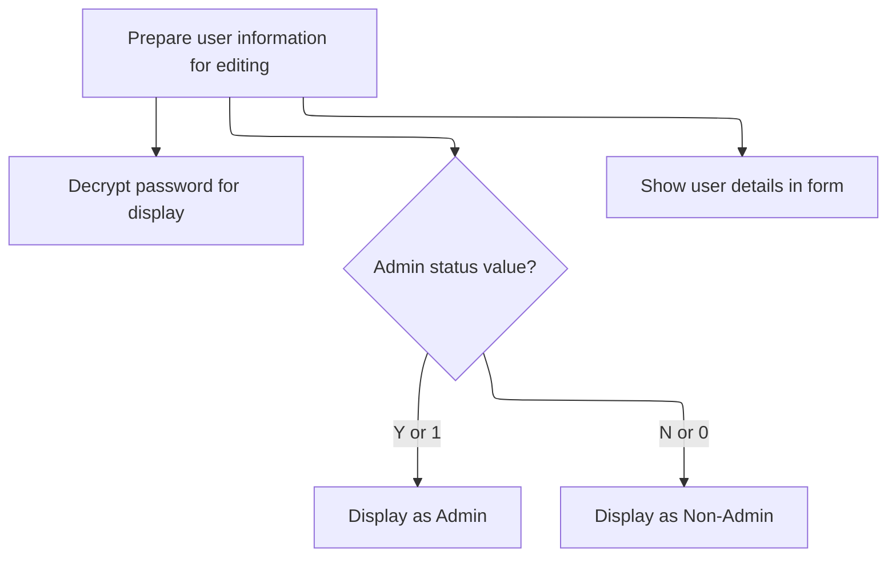

This document explains how the user form is set up for adding or editing a user. When opened, the form determines the mode, prepares the fields accordingly, and ensures the form is ready for user interaction as part of user management.

# Loading User Data and Handling Add/Edit State

<SwmSnippet path="/HotelManagementSystem/Forms/frmUsers.frm" line="228">

---

In <SwmToken path="HotelManagementSystem/Forms/frmUsers.frm" pos="228:4:4" line-data="Private Sub Form_Load()">`Form_Load`</SwmToken>, we start by opening the Users table for the current PK, so we have the right record loaded. Then, we check if we're adding or editing: if adding, we prep the form for a new entry, disable history (since there's no history yet), and grab a new PK by calling <SwmToken path="HotelManagementSystem/Forms/frmUsers.frm" pos="235:5:5" line-data="        PK = getIndex(&quot;Users&quot;)">`getIndex`</SwmToken>. If editing, we set up for editing and will load the existing data next. We need to call <SwmPath>[HotelManagementSystem/Modules/modADO.bas](HotelManagementSystem/Modules/modADO.bas)</SwmPath> next to actually generate that new PK for the add case.

```visual basic
Private Sub Form_Load()
    RS.CursorLocation = adUseClient
    RS.Open "SELECT * FROM Users WHERE PK = " & PK, CN, adOpenStatic, adLockOptimistic
    'Check the form state
    If State = adStateAddMode Then
        Caption = "Create New Entry"
        cmdUsrHistory.Enabled = False
        PK = getIndex("Users")
```

---

</SwmSnippet>

<SwmSnippet path="/HotelManagementSystem/Modules/modADO.bas" line="35">

---

GetIndex handles generating a new PK by reading and incrementing the counter in the 'KEY GENERATOR' table inside a transaction. If the counter is missing, it starts at 1. This keeps PKs unique and avoids race conditions.

```visual basic
Public Function getIndex(ByVal srcTable As String) As Long
    On Error GoTo err
    Dim RS As New Recordset
    Dim RI As Long
    
    RS.CursorLocation = adUseClient
    RS.Open "SELECT * FROM [KEY GENERATOR] WHERE TableName = '" & srcTable & "'", CN, adOpenStatic, adLockOptimistic
    
    RI = RS.Fields("NextNo")
    CN.BeginTrans
    RS.Fields("NextNo") = RI + 1
    RS.Update
    CN.CommitTrans
    getIndex = RI
    
    srcTable = ""
    RI = 0
    Set RS = Nothing
    Exit Function
err:
        ''Error when incounter a null value
        If err.Number = 94 Then
            getIndex = 1
            Resume Next
        Else
            MsgBox err.Description
        End If
        CN.RollbackTrans
End Function
```

---

</SwmSnippet>

<SwmSnippet path="/HotelManagementSystem/Forms/frmUsers.frm" line="236">

---

Back in <SwmToken path="HotelManagementSystem/Forms/frmUsers.frm" pos="228:4:4" line-data="Private Sub Form_Load()">`Form_Load`</SwmToken>, after handling add mode, if we're editing, we set the caption and call <SwmToken path="HotelManagementSystem/Forms/frmUsers.frm" pos="238:1:1" line-data="        DisplayForEditing">`DisplayForEditing`</SwmToken> to load the current user's data into the form fields. This is only needed for editing, not for new entries.

```visual basic
    Else
        Caption = "Edit Entry"
        DisplayForEditing
```

---

</SwmSnippet>

## Populating the Edit Form with User Data



<SwmSnippet path="/HotelManagementSystem/Forms/frmUsers.frm" line="136">

---

In <SwmToken path="HotelManagementSystem/Forms/frmUsers.frm" pos="136:4:4" line-data="Private Sub DisplayForEditing()">`DisplayForEditing`</SwmToken>, we fill the form fields with the user's data from the recordset. The password is decrypted before display, and the Admin field is converted for the checkbox using <SwmToken path="HotelManagementSystem/Forms/frmUsers.frm" pos="144:7:7" line-data="        Check1.Value = changeYNValue(.Fields(&quot;Admin&quot;))">`changeYNValue`</SwmToken>. We need <SwmPath>[HotelManagementSystem/Modules/modFunction.bas](HotelManagementSystem/Modules/modFunction.bas)</SwmPath> next to handle that conversion cleanly.

```visual basic
Private Sub DisplayForEditing()
    On Error GoTo err
    
    With RS
        txtEntry(0).Text = .Fields("UserID")
        txtEntry(1).Text = Enc.DecryptString(.Fields("Password"))
        
        txtEntry(2).Text = .Fields("CompleteName")
        Check1.Value = changeYNValue(.Fields("Admin"))
```

---

</SwmSnippet>

<SwmSnippet path="/HotelManagementSystem/Modules/modFunction.bas" line="138">

---

ChangeYNValue just maps 'Y'/'N' to '1'/'0' and vice versa, so we can sync the checkbox state with the database value. It handles both directions for flexibility.

```visual basic
Public Function changeYNValue(ByVal srcStr As String) As String
    Select Case srcStr
        Case "Y": changeYNValue = "1"
        Case "N": changeYNValue = "0"
        Case "1": changeYNValue = "Y"
        Case "0": changeYNValue = "N"
    End Select
End Function
```

---

</SwmSnippet>

<SwmSnippet path="/HotelManagementSystem/Forms/frmUsers.frm" line="145">

---

After converting the Admin field with <SwmToken path="HotelManagementSystem/Forms/frmUsers.frm" pos="144:7:7" line-data="        Check1.Value = changeYNValue(.Fields(&quot;Admin&quot;))">`changeYNValue`</SwmToken>, <SwmToken path="HotelManagementSystem/Forms/frmUsers.frm" pos="136:4:4" line-data="Private Sub DisplayForEditing()">`DisplayForEditing`</SwmToken> finishes setting up the form fields. If any field is missing (null), it just skips over it and keeps going.

```visual basic
    End With
    
    Exit Sub
err:
        If err.Number = 94 Then Resume Next
End Sub
```

---

</SwmSnippet>

## Completing Form Initialization

<SwmSnippet path="/HotelManagementSystem/Forms/frmUsers.frm" line="239">

---

After coming back from <SwmToken path="HotelManagementSystem/Forms/frmUsers.frm" pos="136:4:4" line-data="Private Sub DisplayForEditing()">`DisplayForEditing`</SwmToken>, <SwmToken path="HotelManagementSystem/Forms/frmUsers.frm" pos="228:4:4" line-data="Private Sub Form_Load()">`Form_Load`</SwmToken> just wraps up. At this point, the form is ready—either set up for a new user or loaded with existing data for editing, depending on the mode.

```visual basic
    End If
    
End Sub
```

---

</SwmSnippet>

&nbsp;

*This is an auto-generated document by Swimm 🌊 and has not yet been verified by a human*

<SwmMeta version="3.0.0" repo-id="Z2l0aHViJTNBJTNBY3RzLVZCNi1Qcm9qZWN0cyUzQSUzQVN3aW1tLURlbW8=" repo-name="cts-VB6-Projects"><sup>Powered by [Swimm](https://app.swimm.io/)</sup></SwmMeta>
