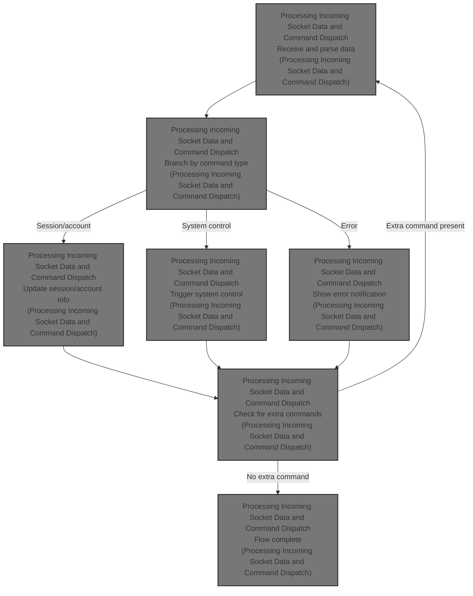

This document describes how incoming data from the server is processed to update the user interface and system state. The flow receives socket data, parses commands, and updates session information, account details, and system controls based on the command type. This ensures real-time session management and keeps the client application synchronized with server instructions.



# Processing Incoming Socket Data and Command Dispatch

```mermaid
%%{init: {"flowchart": {"defaultRenderer": "elk"}} }%%
flowchart TD
    node1["Receive data from server"] --> node2{"Command type?"}
    click node1 openCode "Internet Cafe Internet Cafe System/cLiEnTe/frmMain.frm:412:415"
    node2 -->|"OP"| node3["Open account: show popup, set session
state (Name, ServiceType, Rate,
LoginTime)"]
    click node2 openCode "Internet Cafe Internet Cafe System/cLiEnTe/frmMain.frm:429:445"
    click node3 openCode "Internet Cafe Internet Cafe System/cLiEnTe/frmMain.frm:429:445"
    node2 -->|"LT"| node4["Limited account: show popup, set session
state (Name, ServiceType, Amount, Rate,
LoginTime)"]
    click node4 openCode "Internet Cafe Internet Cafe System/cLiEnTe/frmMain.frm:445:459"
    node2 -->|"ET"| node5{"Session control: Elapse, Lock, Unlock"}
    click node5 openCode "Internet Cafe Internet Cafe System/cLiEnTe/frmMain.frm:462:481"
    node5 -->|"Elapse (Len(#quot;X#quot;)=3)"| node6["Show main window, enable timer"]
    click node6 openCode "Internet Cafe Internet Cafe System/cLiEnTe/frmMain.frm:463:469"
    node5 -->|"Lock (X=#quot;ET1@#quot;)"| node7["Lock session, show main window"]
    click node7 openCode "Internet Cafe Internet Cafe System/cLiEnTe/frmMain.frm:470:476"
    node5 -->|"Unlock (other)"| node8["Unlock session, hide main window"]
    click node8 openCode "Internet Cafe Internet Cafe System/cLiEnTe/frmMain.frm:477:481"
    node2 -->|T1| node9["Update open account time/amount display
(Duration, Amount)"]
    click node9 openCode "Internet Cafe Internet Cafe System/cLiEnTe/frmMain.frm:482:486"
    node2 -->|T2| node10["Update limited account time/amount
display (Duration, Amount)"]
    click node10 openCode "Internet Cafe Internet Cafe System/cLiEnTe/frmMain.frm:488:491"
    node2 -->|"SD"| node11["Shutdown system"]
    click node11 openCode "Internet Cafe Internet Cafe System/cLiEnTe/frmMain.frm:492:494"
    node2 -->|"SZ"| node12["Synchronize flashplayer"]
    click node12 openCode "Internet Cafe Internet Cafe System/cLiEnTe/frmMain.frm:495:496"
    node2 -->|"MT"| node13["Mute/Unmute volume"]
    click node13 openCode "Internet Cafe Internet Cafe System/cLiEnTe/frmMain.frm:497:502"
    node2 -->|"VL"| node14["Set volume"]
    click node14 openCode "Internet Cafe Internet Cafe System/cLiEnTe/frmMain.frm:503:504"
    node2 -->|"ER"| node15{"Error type?"}
    click node15 openCode "Internet Cafe Internet Cafe System/cLiEnTe/frmMain.frm:505:522"
    node15 -->|"ID used (ER1@)"| node16["Show ID used error"]
    click node16 openCode "Internet Cafe Internet Cafe System/cLiEnTe/frmMain.frm:506:511"
    node15 -->|"Server full (ER2@)"| node17["Show server full error"]
    click node17 openCode "Internet Cafe Internet Cafe System/cLiEnTe/frmMain.frm:512:515"
    node15 -->|"ID out of range (ER3)"| node18["Show ID out of range error"]
    click node18 openCode "Internet Cafe Internet Cafe System/cLiEnTe/frmMain.frm:516:521"
    
    subgraph loop1["Process extra command if present"]
      node19{"Is ExtraCommand present?"}
      click node19 openCode "Internet Cafe Internet Cafe System/cLiEnTe/frmMain.frm:525:529"
      node19 -->|"Yes"| node1
      node19 -->|"No"| node20["Finish"]
      click node20 openCode "Internet Cafe Internet Cafe System/cLiEnTe/frmMain.frm:530:530"
    end
classDef HeadingStyle fill:#777777,stroke:#333,stroke-width:2px;

%% Swimm:
%% %%{init: {"flowchart": {"defaultRenderer": "elk"}} }%%
%% flowchart TD
%%     node1["Receive data from server"] --> node2{"Command type?"}
%%     click node1 openCode "Internet Cafe <SwmPath>[Internet Cafe System/cLiEnTe/frmMain.frm](Internet%20Cafe%20System/cLiEnTe/frmMain.frm)</SwmPath>:412:415"
%%     node2 -->|"OP"| node3["Open account: show popup, set session
%% state (Name, <SwmToken path="Internet Cafe System/cLiEnTe/frmMain.frm" pos="432:15:15" line-data="    &#39;OP + (Name-30Chr) + (ServiceType-8Chr) + (Rate-2Chr) + (LoginTime)">`ServiceType`</SwmToken>, Rate,
%% <SwmToken path="Internet Cafe System/cLiEnTe/frmMain.frm" pos="432:31:31" line-data="    &#39;OP + (Name-30Chr) + (ServiceType-8Chr) + (Rate-2Chr) + (LoginTime)">`LoginTime`</SwmToken>)"]
%%     click node2 openCode "Internet Cafe <SwmPath>[Internet Cafe System/cLiEnTe/frmMain.frm](Internet%20Cafe%20System/cLiEnTe/frmMain.frm)</SwmPath>:429:445"
%%     click node3 openCode "Internet Cafe <SwmPath>[Internet Cafe System/cLiEnTe/frmMain.frm](Internet%20Cafe%20System/cLiEnTe/frmMain.frm)</SwmPath>:429:445"
%%     node2 -->|"LT"| node4["Limited account: show popup, set session
%% state (Name, <SwmToken path="Internet Cafe System/cLiEnTe/frmMain.frm" pos="432:15:15" line-data="    &#39;OP + (Name-30Chr) + (ServiceType-8Chr) + (Rate-2Chr) + (LoginTime)">`ServiceType`</SwmToken>, Amount, Rate,
%% <SwmToken path="Internet Cafe System/cLiEnTe/frmMain.frm" pos="432:31:31" line-data="    &#39;OP + (Name-30Chr) + (ServiceType-8Chr) + (Rate-2Chr) + (LoginTime)">`LoginTime`</SwmToken>)"]
%%     click node4 openCode "Internet Cafe <SwmPath>[Internet Cafe System/cLiEnTe/frmMain.frm](Internet%20Cafe%20System/cLiEnTe/frmMain.frm)</SwmPath>:445:459"
%%     node2 -->|"ET"| node5{"Session control: Elapse, Lock, Unlock"}
%%     click node5 openCode "Internet Cafe <SwmPath>[Internet Cafe System/cLiEnTe/frmMain.frm](Internet%20Cafe%20System/cLiEnTe/frmMain.frm)</SwmPath>:462:481"
%%     node5 -->|"Elapse (Len(#quot;X#quot;)=3)"| node6["Show main window, enable timer"]
%%     click node6 openCode "Internet Cafe <SwmPath>[Internet Cafe System/cLiEnTe/frmMain.frm](Internet%20Cafe%20System/cLiEnTe/frmMain.frm)</SwmPath>:463:469"
%%     node5 -->|"Lock (X=#quot;<SwmToken path="Internet Cafe System/cLiEnTe/frmMain.frm" pos="420:6:6" line-data="  &#39;ET -  ET1-Lock/ ET2-UnlockComp/ ET-Elapse Time">`ET1`</SwmToken>@#quot;)"| node7["Lock session, show main window"]
%%     click node7 openCode "Internet Cafe <SwmPath>[Internet Cafe System/cLiEnTe/frmMain.frm](Internet%20Cafe%20System/cLiEnTe/frmMain.frm)</SwmPath>:470:476"
%%     node5 -->|"Unlock (other)"| node8["Unlock session, hide main window"]
%%     click node8 openCode "Internet Cafe <SwmPath>[Internet Cafe System/cLiEnTe/frmMain.frm](Internet%20Cafe%20System/cLiEnTe/frmMain.frm)</SwmPath>:477:481"
%%     node2 -->|<SwmToken path="Internet Cafe System/cLiEnTe/frmMain.frm" pos="421:2:2" line-data="  &#39;T1 - open account data">`T1`</SwmToken>| node9["Update open account time/amount display
%% (Duration, Amount)"]
%%     click node9 openCode "Internet Cafe <SwmPath>[Internet Cafe System/cLiEnTe/frmMain.frm](Internet%20Cafe%20System/cLiEnTe/frmMain.frm)</SwmPath>:482:486"
%%     node2 -->|<SwmToken path="Internet Cafe System/cLiEnTe/frmMain.frm" pos="422:2:2" line-data="  &#39;T2 - limited account data">`T2`</SwmToken>| node10["Update limited account time/amount
%% display (Duration, Amount)"]
%%     click node10 openCode "Internet Cafe <SwmPath>[Internet Cafe System/cLiEnTe/frmMain.frm](Internet%20Cafe%20System/cLiEnTe/frmMain.frm)</SwmPath>:488:491"
%%     node2 -->|"SD"| node11["Shutdown system"]
%%     click node11 openCode "Internet Cafe <SwmPath>[Internet Cafe System/cLiEnTe/frmMain.frm](Internet%20Cafe%20System/cLiEnTe/frmMain.frm)</SwmPath>:492:494"
%%     node2 -->|"SZ"| node12["Synchronize flashplayer"]
%%     click node12 openCode "Internet Cafe <SwmPath>[Internet Cafe System/cLiEnTe/frmMain.frm](Internet%20Cafe%20System/cLiEnTe/frmMain.frm)</SwmPath>:495:496"
%%     node2 -->|"MT"| node13["Mute/Unmute volume"]
%%     click node13 openCode "Internet Cafe <SwmPath>[Internet Cafe System/cLiEnTe/frmMain.frm](Internet%20Cafe%20System/cLiEnTe/frmMain.frm)</SwmPath>:497:502"
%%     node2 -->|"VL"| node14["Set volume"]
%%     click node14 openCode "Internet Cafe <SwmPath>[Internet Cafe System/cLiEnTe/frmMain.frm](Internet%20Cafe%20System/cLiEnTe/frmMain.frm)</SwmPath>:503:504"
%%     node2 -->|"ER"| node15{"Error type?"}
%%     click node15 openCode "Internet Cafe <SwmPath>[Internet Cafe System/cLiEnTe/frmMain.frm](Internet%20Cafe%20System/cLiEnTe/frmMain.frm)</SwmPath>:505:522"
%%     node15 -->|"ID used (<SwmToken path="Internet Cafe System/cLiEnTe/frmMain.frm" pos="427:10:10" line-data="  &#39;ER - (Error) ER1-ID# isalready used/ ER2-Server is full">`ER1`</SwmToken>@)"| node16["Show ID used error"]
%%     click node16 openCode "Internet Cafe <SwmPath>[Internet Cafe System/cLiEnTe/frmMain.frm](Internet%20Cafe%20System/cLiEnTe/frmMain.frm)</SwmPath>:506:511"
%%     node15 -->|"Server full (<SwmToken path="Internet Cafe System/cLiEnTe/frmMain.frm" pos="427:20:20" line-data="  &#39;ER - (Error) ER1-ID# isalready used/ ER2-Server is full">`ER2`</SwmToken>@)"| node17["Show server full error"]
%%     click node17 openCode "Internet Cafe <SwmPath>[Internet Cafe System/cLiEnTe/frmMain.frm](Internet%20Cafe%20System/cLiEnTe/frmMain.frm)</SwmPath>:512:515"
%%     node15 -->|"ID out of range (<SwmToken path="Internet Cafe System/cLiEnTe/frmMain.frm" pos="516:4:4" line-data="    Else &#39;ER3 - ID# is out of range!">`ER3`</SwmToken>)"| node18["Show ID out of range error"]
%%     click node18 openCode "Internet Cafe <SwmPath>[Internet Cafe System/cLiEnTe/frmMain.frm](Internet%20Cafe%20System/cLiEnTe/frmMain.frm)</SwmPath>:516:521"
%%     
%%     subgraph loop1["Process extra command if present"]
%%       node19{"Is <SwmToken path="Internet Cafe System/cLiEnTe/frmMain.frm" pos="525:3:3" line-data="  If ExtraCommand &lt;&gt; &quot;&quot; Then">`ExtraCommand`</SwmToken> present?"}
%%       click node19 openCode "Internet Cafe <SwmPath>[Internet Cafe System/cLiEnTe/frmMain.frm](Internet%20Cafe%20System/cLiEnTe/frmMain.frm)</SwmPath>:525:529"
%%       node19 -->|"Yes"| node1
%%       node19 -->|"No"| node20["Finish"]
%%       click node20 openCode "Internet Cafe <SwmPath>[Internet Cafe System/cLiEnTe/frmMain.frm](Internet%20Cafe%20System/cLiEnTe/frmMain.frm)</SwmPath>:530:530"
%%     end
%% classDef HeadingStyle fill:#777777,stroke:#333,stroke-width:2px;
```



<SwmSnippet path="/Internet Cafe System/cLiEnTe/frmMain.frm" line="412">

---

In <SwmToken path="Internet Cafe System/cLiEnTe/frmMain.frm" pos="412:4:4" line-data="Private Sub Sucket_DataArrival(ByVal bytesTotal As Long)">`Sucket_DataArrival`</SwmToken>, we grab the incoming data from the socket and immediately run it through <SwmToken path="Internet Cafe System/cLiEnTe/frmMain.frm" pos="415:5:5" line-data="  X = Check_Data(X)">`Check_Data`</SwmToken>. This ensures that if multiple commands are chained together, only the first one is processed now, and any extra is queued for later. This avoids bugs from handling multiple commands at once.

```visual basic
Private Sub Sucket_DataArrival(ByVal bytesTotal As Long)
Dim X As String
  Sucket.GetData X
  X = Check_Data(X)
```

---

</SwmSnippet>

<SwmSnippet path="/Internet Cafe System/cLiEnTe/Module1.bas" line="66">

---

<SwmToken path="Internet Cafe System/cLiEnTe/Module1.bas" pos="66:4:4" line-data="Public Function Check_Data(abc As String) As String">`Check_Data`</SwmToken> inspects the incoming string for extra commands chained with '@' after the command prefix. If it finds more than one '@', it splits the string, queues the extra part in <SwmToken path="Internet Cafe System/cLiEnTe/Module1.bas" pos="83:1:1" line-data="    ExtraCommand = Mid(abc, loc + 1, Len(abc) - loc)">`ExtraCommand`</SwmToken>, and returns just the first command for immediate processing.

```visual basic
Public Function Check_Data(abc As String) As String
Dim i As Byte
Dim tmp As Byte
Dim loc As Byte
  
  tmp = 0
  loc = 0
  For i = 3 To Len(abc)
    If Mid(abc, i, 1) = "@" Then
      tmp = tmp + 1
      If loc = 0 Then loc = i
    End If
  Next i

  If tmp = 1 Then
    Check_Data = abc
  Else
    ExtraCommand = Mid(abc, loc + 1, Len(abc) - loc)
    Check_Data = Mid(abc, 1, loc)
  End If
End Function
```

---

</SwmSnippet>

<SwmSnippet path="/Internet Cafe System/cLiEnTe/frmMain.frm" line="416">

---

Back in <SwmToken path="Internet Cafe System/cLiEnTe/frmMain.frm" pos="412:4:4" line-data="Private Sub Sucket_DataArrival(ByVal bytesTotal As Long)">`Sucket_DataArrival`</SwmToken>, after parsing the command, we branch based on the command prefix (like 'OP' or 'LT'). For account-related commands, we update the popup UI with user/session info and lock down the system by disabling Ctrl+Alt+Del. This keeps the session controlled and the UI in sync with the server state.

```visual basic
  
  'Language Headers
  'OP - UnlockComp w/Open acnt: addt'l data (start time)
  'LT - UnlockComp w/Ltd acnt:  addt'l data (3 chars of amt, start time)
  'ET -  ET1-Lock/ ET2-UnlockComp/ ET-Elapse Time
  'T1 - open account data
  'T2 - limited account data
  'SD - shutdown
  'SZ - Synchronize the flashplayer
  'MT - MT1-Mute Volume/ MT2-Unmute Volume
  'VL - Set Volume
  'ER - (Error) ER1-ID# isalready used/ ER2-Server is full
Alex:
  Select Case Left(X, 2)
  Case "OP" ' set open account
    'DATA FORMAT
    'OP + (Name-30Chr) + (ServiceType-8Chr) + (Rate-2Chr) + (LoginTime)
    BlockCtrl_Alt_Del False
    TypeTrans = True
    Mark = 1
    frmMain.Hide
    frmPopUp.Show
    Unload frmConfig
    frmPopUp.lblName.Caption = Trim(Mid(X, 3, 30))
    frmPopUp.lblType.Caption = Mid(X, 33, 8)
    frmPopUp.lblRate.Caption = "P " & FormatNumber(Trim(Mid(X, 41, 2)), 2) & " / hour"
    frmPopUp.lblLogIn.Caption = Mid(X, 43, Len(X) - 43)
    frmPopUp.cmdLogout.Enabled = True
    frmTrayMenu.mnuLogOut.Enabled = True
  Case "LT" 'set limited account
    'DATA FORMAT
    'LT + (Name-30Chr) + (ServiceType-8Chr) + (Amt-3Chr) + (Rate-2Chr) + (LogInTime)
    BlockCtrl_Alt_Del False
```

---

</SwmSnippet>

<SwmSnippet path="/Internet Cafe System/cLiEnTe/Module1.bas" line="88">

---

<SwmToken path="Internet Cafe System/cLiEnTe/Module1.bas" pos="88:2:2" line-data="Sub BlockCtrl_Alt_Del(bDisabled As Boolean)">`BlockCtrl_Alt_Del`</SwmToken> toggles the system's Ctrl+Alt+Del handling by calling <SwmToken path="Internet Cafe System/cLiEnTe/Module1.bas" pos="90:5:5" line-data="  X = SystemParametersInfo(97, bDisabled, CStr(1), 0)">`SystemParametersInfo`</SwmToken> with a nonstandard parameter combo. It's a hack to prevent users from breaking out of the session, but it's not guaranteed to work everywhere.

```visual basic
Sub BlockCtrl_Alt_Del(bDisabled As Boolean)
  Dim X As Long
  X = SystemParametersInfo(97, bDisabled, CStr(1), 0)

End Sub
```

---

</SwmSnippet>

<SwmSnippet path="/Internet Cafe System/cLiEnTe/frmMain.frm" line="449">

---

Back in <SwmToken path="Internet Cafe System/cLiEnTe/frmMain.frm" pos="412:4:4" line-data="Private Sub Sucket_DataArrival(ByVal bytesTotal As Long)">`Sucket_DataArrival`</SwmToken>, after updating the UI with account info, we call Formatter to convert the calculated session duration into a readable hours/minutes string for the popup. This makes the session details clear to the user.

```visual basic
    TypeTrans = False
    Mark = 1
    frmMain.Hide
    frmPopUp.Show
    Unload frmConfig
    frmPopUp.lblName2.Caption = Trim(Mid(X, 3, 30))
    frmPopUp.lblType2.Caption = Mid(X, 33, 8)
    frmPopUp.lblAmt2.Caption = FormatNumber(Val(Mid(X, 41, 3)), 2)
    frmPopUp.lblRate2.Caption = "P " & FormatNumber(Val(Mid(X, 44, 2)), 2) & " / hour"
    frmPopUp.lblLogIn2.Caption = Mid(X, 46, Len(X) - 46)
    frmPopUp.lblService.Caption = Formatter(Val(frmPopUp.lblAmt2.Caption) * (60 / Val(Mid(X, 44, 2))))
```

---

</SwmSnippet>

<SwmSnippet path="/Internet Cafe System/cLiEnTe/frmMain.frm" line="537">

---

<SwmToken path="Internet Cafe System/cLiEnTe/frmMain.frm" pos="537:4:4" line-data="Private Function Formatter(b As Integer) As String">`Formatter`</SwmToken> takes a minute count and outputs a string like '2 hrs 15 mins'. If the leftover minutes are 30 or more, it rounds the hour down by one, probably to avoid misleading the user about their remaining time.

```visual basic
Private Function Formatter(b As Integer) As String
  If (b Mod 60) < 30 Then
    Formatter = Str(FormatNumber(b / 60, 0)) & " hrs " & (b Mod 60) & " mins"
  Else
    Formatter = Str(FormatNumber(b / 60, 0) - 1) & " hrs " & (b Mod 60) & " mins"
  End If
End Function
```

---

</SwmSnippet>

<SwmSnippet path="/Internet Cafe System/cLiEnTe/frmMain.frm" line="460">

---

Back in <SwmToken path="Internet Cafe System/cLiEnTe/frmMain.frm" pos="412:4:4" line-data="Private Sub Sucket_DataArrival(ByVal bytesTotal As Long)">`Sucket_DataArrival`</SwmToken>, after formatting the session duration, we handle elapsed time and lock/unlock commands. For 'ET', we update the system state (lock, unlock, minimize, etc.) and call <SwmToken path="Internet Cafe System/cLiEnTe/frmMain.frm" pos="464:1:1" line-data="      BlockCtrl_Alt_Del True">`BlockCtrl_Alt_Del`</SwmToken> again to match the new session state.

```visual basic
    frmPopUp.cmdLogout.Enabled = True
    frmTrayMenu.mnuLogOut.Enabled = True
  Case "ET"
    If Len(X) = 3 Then 'Elapse Time
      BlockCtrl_Alt_Del True
      Shells.MinimizeAll
      Unload frmPopUp
      frmMain.WindowState = vbMaximized
      frmMain.Show
      tmrDelayer.Enabled = True
    ElseIf X = "ET1@" Then 'Lock
      Locked = True
      BlockCtrl_Alt_Del True
      Unload frmPopUp
      Unload frmConfig
      frmMain.Show
    Else 'Unlock
      Locked = False
      BlockCtrl_Alt_Del False
```

---

</SwmSnippet>

<SwmSnippet path="/Internet Cafe System/cLiEnTe/frmMain.frm" line="479">

---

Back in <SwmToken path="Internet Cafe System/cLiEnTe/frmMain.frm" pos="412:4:4" line-data="Private Sub Sucket_DataArrival(ByVal bytesTotal As Long)">`Sucket_DataArrival`</SwmToken>, after updating the lock state, we call Formatter again to show the current session duration in the popup. This keeps the user updated on their time usage.

```visual basic
      Unload frmConfig
      frmMain.Hide
    End If
  Case "T1" ' time data for open acnt
    frmPopUp.lblDuration.Caption = Formatter(Val(Trim(Mid(X, 3, 4))))
    frmPopUp.lblAmt.Caption = Mid(X, 7, Len(X) - 7) & ".00"
    frmPopUp.Caption = frmPopUp.lblDuration.Caption
    frmPopUp.Tray.ToolTip = frmPopUp.Caption & "(P" & Trim(Mid(X, 7, Len(X) - 7)) & ")"
    
  Case "T2" ' time data for limited acnt
    frmPopUp.lblDuration2.Caption = Formatter(Val(Trim(Mid(X, 3, 4))))
```

---

</SwmSnippet>

<SwmSnippet path="/Internet Cafe System/cLiEnTe/frmMain.frm" line="490">

---

Finally, in <SwmToken path="Internet Cafe System/cLiEnTe/frmMain.frm" pos="412:4:4" line-data="Private Sub Sucket_DataArrival(ByVal bytesTotal As Long)">`Sucket_DataArrival`</SwmToken>, after updating the UI and handling system commands, we check if <SwmToken path="Internet Cafe System/cLiEnTe/frmMain.frm" pos="525:3:3" line-data="  If ExtraCommand &lt;&gt; &quot;&quot; Then">`ExtraCommand`</SwmToken> is set. If so, we loop back and process the next command in sequence. This ensures all commands in a single packet are handled, and errors trigger immediate user feedback or session termination as needed.

```visual basic
    frmPopUp.Caption = frmPopUp.lblDuration2.Caption
    frmPopUp.Tray.ToolTip = frmPopUp.Caption & "(P" & Trim(Mid(X, 7, 3)) & ")"
  Case "SD" 'Shutdown
    ExitWindowsEx 1, 0
    End
  Case "SZ" 'Synchronize
    Shock.Rewind
  Case "MT" 'Mute
    If X = "MT1@" Then
      'VolumeMaster.Mute = True 'Mute
    Else
      'VolumeMaster.Mute = False 'Unmute
    End If
  Case "VL" 'Volume
    'VolumeMaster.Volume = Val(Mid(X, 3, Len(X) - 3))
  Case "ER" 'Error
    If X = "ER1@" Then 'ER1 - ID# is already used
      tmrConnector.Enabled = False
      Sucket.Close
      Light.BackColor = vbRed
      MsgBox "ID# " & DbRst!CompID & " is currently used!" & vbCrLf & "Please choose another ID#", vbExclamation
      frmConfig.Show 1
    ElseIf X = "ER2@" Then 'ER2 - server is full- cant connect
      MsgBox "Server is full can't connect!" & vbCrLf & "Terminating Program...", vbExclamation
      Sucket.Close
      End
    Else 'ER3 - ID# is out of range!
      tmrConnector.Enabled = False
      Sucket.Close
      Light.BackColor = vbRed
      MsgBox "ID# is out of range!" & vbCrLf & "Server only allows ID # 1 to " & Mid(X, 4, Len(X) - 4), vbExclamation
      frmConfig.Show 1
    End If
  End Select
  
  If ExtraCommand <> "" Then
    X = ExtraCommand
    ExtraCommand = ""
    GoTo Alex
  End If
End Sub
```

---

</SwmSnippet>

&nbsp;

*This is an auto-generated document by Swimm 🌊 and has not yet been verified by a human*

<SwmMeta version="3.0.0" repo-id="Z2l0aHViJTNBJTNBY3RzLVZCNi1Qcm9qZWN0cyUzQSUzQVN3aW1tLURlbW8=" repo-name="cts-VB6-Projects"><sup>Powered by [Swimm](https://app.swimm.io/)</sup></SwmMeta>
