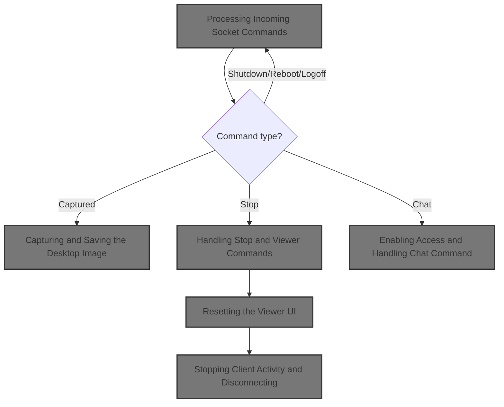
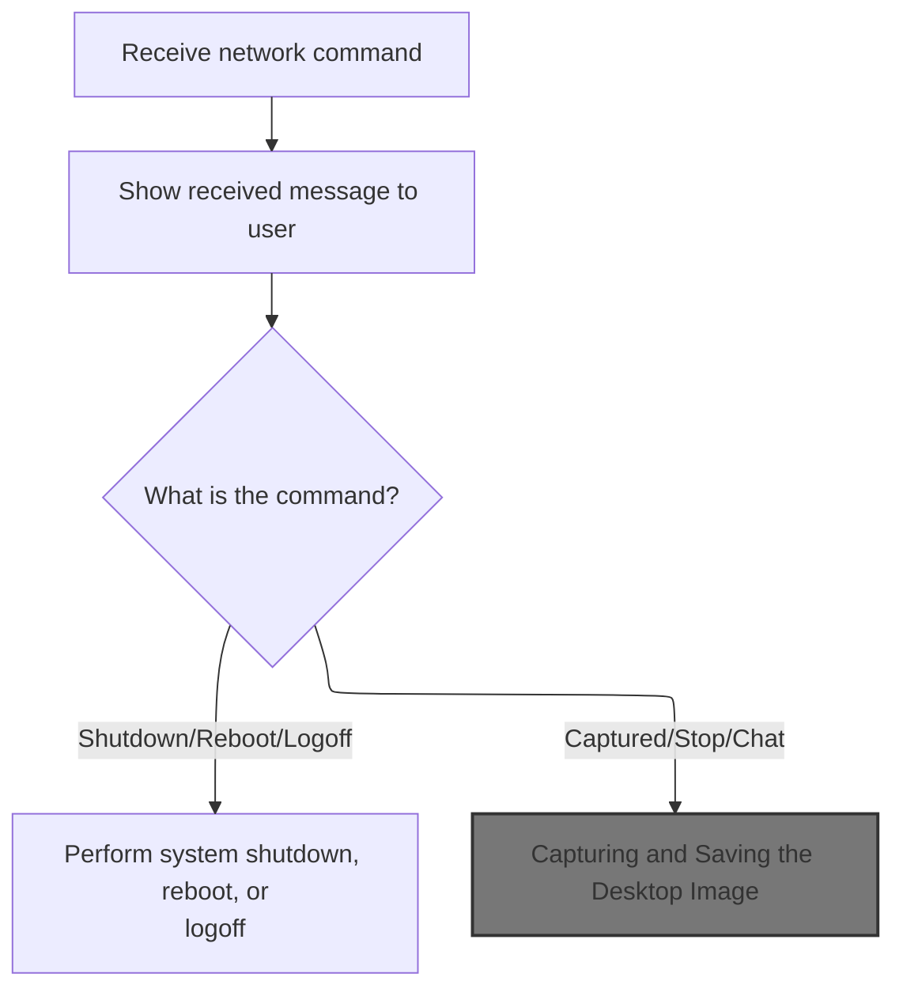
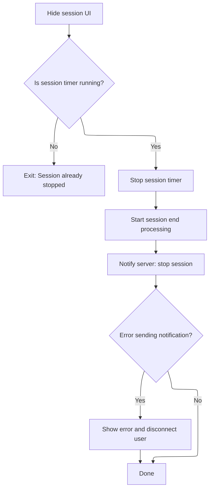

This document describes how remote commands received via the network are handled to control the client application. The flow covers actions such as system management, desktop capture, session cleanup, and chat initiation. When a command is received, the client responds by executing the requested operation and updating the interface for the user.



# Processing Incoming Socket Commands



<SwmSnippet path="/warnet/Client/clnonline.frm" line="805">

---

In <SwmToken path="warnet/Client/clnonline.frm" pos="805:4:4" line-data="Private Sub sock1_DataArrival(ByVal bytesTotal As Long)">`sock1_DataArrival`</SwmToken>, we check the incoming string command and trigger actions based on its value. If the command is 'CAPTURED', we call <SwmToken path="warnet/Client/clnonline.frm" pos="819:1:1" line-data="    CmCaptured_Click">`CmCaptured_Click`</SwmToken> to start the desktop capture process. This lets the remote side request a screenshot at any time.

```visual basic
Private Sub sock1_DataArrival(ByVal bytesTotal As Long)
Dim dat As String
sock1.GetData dat, vbString
TXPayment.Caption = dat
If dat = "SHUTDOWN" Then
    cExitWindows.ExitWindows WE_SHUTDOWN
    End If
If dat = "REBOOT" Then
    cExitWindows.ExitWindows WE_REBOOT
    End If
If dat = "LOGOFF" Then
    cExitWindows.ExitWindows WE_LOGOFF
    End If
If dat = "CAPTURED" Then
    CmCaptured_Click
```

---

</SwmSnippet>

## Capturing and Saving the Desktop Image

<SwmSnippet path="/warnet/Client/clnonline.frm" line="635">

---

In <SwmToken path="warnet/Client/clnonline.frm" pos="635:4:4" line-data="Private Sub CmCaptured_Click()">`CmCaptured_Click`</SwmToken>, we build two file paths for the screenshot (one BMP, one JPG), then call <SwmToken path="warnet/Client/clnonline.frm" pos="639:0:0" line-data="Capture_Desktop Fileku1">`Capture_Desktop`</SwmToken> to actually grab the screen and save it as a BMP. This sets up the files for whatever process needs them next.

```visual basic
Private Sub CmCaptured_Click()
On Error GoTo t
Fileku1 = App.Path + "\" & USERVALUE & "desktop.bmp"
Fileku2 = Picpath + USERVALUE & "desktop.jpg"
Capture_Desktop Fileku1
```

---

</SwmSnippet>

<SwmSnippet path="/warnet/Client/clnonline.frm" line="603">

---

<SwmToken path="warnet/Client/clnonline.frm" pos="603:4:4" line-data="Public Function Capture_Desktop(ByVal Destination$) As Boolean">`Capture_Desktop`</SwmToken> fakes a Print Screen key press, grabs the bitmap from the clipboard, and writes it to the file path we gave it. No image conversion, just a straight dump from clipboard to file.

```visual basic
Public Function Capture_Desktop(ByVal Destination$) As Boolean
On Error GoTo errl
DoEvents
Call keybd_event(vbKeySnapshot, 1, 0, 0)
DoEvents
SavePicture Clipboard.GetData(vbCFBitmap), Destination$
Capture_Desktop = True
Exit Function
errl:
MsgBox "Error number: " & Err.Number & ". " & Err.Description
Capture_Desktop = False
End Function
```

---

</SwmSnippet>

<SwmSnippet path="/warnet/Client/clnonline.frm" line="640">

---

Back in <SwmToken path="warnet/Client/clnonline.frm" pos="635:4:4" line-data="Private Sub CmCaptured_Click()">`CmCaptured_Click`</SwmToken>, after <SwmToken path="warnet/Client/clnonline.frm" pos="603:4:4" line-data="Public Function Capture_Desktop(ByVal Destination$) As Boolean">`Capture_Desktop`</SwmToken> returns, we just copy the BMP file to the JPG path. No format conversion, just a straight file copy. If anything fails, we show an error in <SwmToken path="warnet/Client/clnonline.frm" pos="643:0:0" line-data="Label2.Caption = &quot;Error:&quot; &amp; Error">`Label2`</SwmToken>.

```visual basic
FileCopy Fileku1, Fileku2
Exit Sub
t:
Label2.Caption = "Error:" & Error
End Sub
```

---

</SwmSnippet>

## Handling Stop and Viewer Commands

<SwmSnippet path="/warnet/Client/clnonline.frm" line="820">

---

Back in <SwmToken path="warnet/Client/clnonline.frm" pos="805:4:4" line-data="Private Sub sock1_DataArrival(ByVal bytesTotal As Long)">`sock1_DataArrival`</SwmToken>, after handling 'CAPTURED', if the command is 'STOP', we call <SwmToken path="warnet/Client/clnonline.frm" pos="822:1:1" line-data="    CmViewer_Click">`CmViewer_Click`</SwmToken>. This triggers the UI update and whatever cleanup is needed after stopping the viewer.

```visual basic
    End If
If dat = "STOP" Then
    CmViewer_Click
```

---

</SwmSnippet>

## Resetting the Viewer UI

<SwmSnippet path="/warnet/Client/clnonline.frm" line="705">

---

In <SwmToken path="warnet/Client/clnonline.frm" pos="705:4:4" line-data="Private Sub CmViewer_Click()">`CmViewer_Click`</SwmToken>, we call LAYAR to resize and reposition the main form and picture controls. This puts the UI back to its default layout.

```visual basic
Private Sub CmViewer_Click()
LAYAR
```

---

</SwmSnippet>

<SwmSnippet path="/warnet/Client/clnonline.frm" line="743">

---

<SwmToken path="warnet/Client/clnonline.frm" pos="743:4:4" line-data="Private Sub LAYAR()">`LAYAR`</SwmToken> sets the form to full screen, centers <SwmToken path="warnet/Client/clnonline.frm" pos="750:2:2" line-data="With Picture1">`Picture1`</SwmToken>, and puts <SwmToken path="warnet/Client/clnonline.frm" pos="753:2:2" line-data="With Picture3">`Picture3`</SwmToken> at the bottom left. Keeps the UI layout consistent.

```visual basic
Private Sub LAYAR()
With Me
    .Width = Screen.Width
    .Height = Screen.Height
    .Top = 0
    .Left = 0
    End With
With Picture1
    .Move (Screen.Width - .Width) \ 2, (Screen.Height - .Height) \ 2
    End With
With Picture3
    .Move (0), (Screen.Height - .Height)
    End With
End Sub
```

---

</SwmSnippet>

<SwmSnippet path="/warnet/Client/clnonline.frm" line="707">

---

Back in <SwmToken path="warnet/Client/clnonline.frm" pos="705:4:4" line-data="Private Sub CmViewer_Click()">`CmViewer_Click`</SwmToken>, after LAYAR, we call BERHENTI to handle cleanup: stopping timers, hiding <SwmToken path="warnet/Client/clnonline.frm" pos="677:0:0" line-data="Picture2.Visible = False">`Picture2`</SwmToken>, and sending a stop message to the server.

```visual basic
BERHENTI
```

---

</SwmSnippet>

### Stopping Client Activity and Disconnecting



<SwmSnippet path="/warnet/Client/clnonline.frm" line="676">

---

In <SwmToken path="warnet/Client/clnonline.frm" pos="676:4:4" line-data="Private Sub BERHENTI()">`BERHENTI`</SwmToken>, we hide <SwmToken path="warnet/Client/clnonline.frm" pos="677:0:0" line-data="Picture2.Visible = False">`Picture2`</SwmToken>, stop <SwmToken path="warnet/Client/clnonline.frm" pos="678:2:2" line-data="If Timer1.Enabled = False Then Exit Sub">`Timer1`</SwmToken>, start <SwmToken path="warnet/Client/clnonline.frm" pos="680:0:0" line-data="Timer3.Enabled = True">`Timer3`</SwmToken>, and send a stop message to the server. If sending fails, we show an error and close the socket to clean up.

```visual basic
Private Sub BERHENTI()
Picture2.Visible = False
If Timer1.Enabled = False Then Exit Sub
Timer1.Enabled = False
Timer3.Enabled = True
On Error GoTo t
sock1.SendData USERVALUE & "-STOP"
Exit Sub
t:
TXsays.Caption = "Error : " & Err.Description
sock1_Close
```

---

</SwmSnippet>

<SwmSnippet path="/warnet/Client/clnonline.frm" line="792">

---

<SwmToken path="warnet/Client/clnonline.frm" pos="792:4:4" line-data="Private Sub sock1_Close()">`sock1_Close`</SwmToken> shuts down the socket and updates the UI to show we're disconnected from the server.

```visual basic
Private Sub sock1_Close()
sock1.Close
TXsays.Caption = "Disconnected from server" & vbCrLf
TxStatus.Caption = "Disconnected"
End Sub
```

---

</SwmSnippet>

<SwmSnippet path="/warnet/Client/clnonline.frm" line="687">

---

Back in <SwmToken path="warnet/Client/clnonline.frm" pos="676:4:4" line-data="Private Sub BERHENTI()">`BERHENTI`</SwmToken>, after <SwmToken path="warnet/Client/clnonline.frm" pos="686:0:0" line-data="sock1_Close">`sock1_Close`</SwmToken>, everything is cleaned up and the client is fully stopped and disconnected.

```visual basic
End Sub
```

---

</SwmSnippet>

### Completing Viewer Cleanup

<SwmSnippet path="/warnet/Client/clnonline.frm" line="708">

---

Back in <SwmToken path="warnet/Client/clnonline.frm" pos="705:4:4" line-data="Private Sub CmViewer_Click()">`CmViewer_Click`</SwmToken>, after BERHENTI, we're done—no more logic, just exit the sub.

```visual basic
End Sub
```

---

</SwmSnippet>

## Enabling Access and Handling Chat Command

<SwmSnippet path="/warnet/Client/clnonline.frm" line="823">

---

Back in <SwmToken path="warnet/Client/clnonline.frm" pos="805:4:4" line-data="Private Sub sock1_DataArrival(ByVal bytesTotal As Long)">`sock1_DataArrival`</SwmToken>, after <SwmToken path="warnet/Client/clnonline.frm" pos="705:4:4" line-data="Private Sub CmViewer_Click()">`CmViewer_Click`</SwmToken>, we enable <SwmToken path="warnet/Client/clnonline.frm" pos="823:1:1" line-data="    CmAccess.Enabled = True">`CmAccess`</SwmToken> so the user can interact again, and if the command is 'CHAT', we call <SwmToken path="warnet/Client/clnonline.frm" pos="826:1:1" line-data="    CmChat_Click">`CmChat_Click`</SwmToken> to open the chat window.

```visual basic
    CmAccess.Enabled = True
    End If
If dat = "CHAT" Then
    CmChat_Click
```

---

</SwmSnippet>

<SwmSnippet path="/warnet/Client/clnonline.frm" line="646">

---

<SwmToken path="warnet/Client/clnonline.frm" pos="646:4:4" line-data="Private Sub CmChat_Click()">`CmChat_Click`</SwmToken> just shows <SwmToken path="warnet/Client/clnonline.frm" pos="647:0:0" line-data="Form1.Show">`Form1`</SwmToken>, so the chat UI pops up for the user.

```visual basic
Private Sub CmChat_Click()
Form1.Show
End Sub
```

---

</SwmSnippet>

<SwmSnippet path="/warnet/Client/clnonline.frm" line="827">

---

Back in <SwmToken path="warnet/Client/clnonline.frm" pos="805:4:4" line-data="Private Sub sock1_DataArrival(ByVal bytesTotal As Long)">`sock1_DataArrival`</SwmToken>, after <SwmToken path="warnet/Client/clnonline.frm" pos="646:4:4" line-data="Private Sub CmChat_Click()">`CmChat_Click`</SwmToken>, we're done handling the incoming command. Each command just triggers its action and exits.

```visual basic
    End If
End Sub
```

---

</SwmSnippet>

&nbsp;

*This is an auto-generated document by Swimm 🌊 and has not yet been verified by a human*

<SwmMeta version="3.0.0" repo-id="Z2l0aHViJTNBJTNBY3RzLVZCNi1Qcm9qZWN0cyUzQSUzQVN3aW1tLURlbW8=" repo-name="cts-VB6-Projects"><sup>Powered by [Swimm](https://app.swimm.io/)</sup></SwmMeta>
