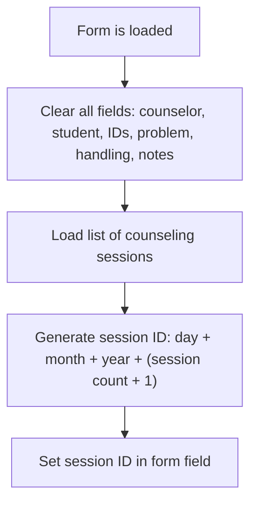

Clicking the reset button on the counseling session form clears all fields, refreshes the session list, and generates a new session ID. This prepares the form for entering a new counseling session.

# Triggering Form Reset

<SwmSnippet path="/BK App/Form/frmkonseling.frm" line="357">

---

In <SwmToken path="BK App/Form/frmkonseling.frm" pos="357:4:4" line-data="Private Sub Command2_Click()">`Command2_Click`</SwmToken>, the flow starts by calling <SwmToken path="BK App/Form/frmkonseling.frm" pos="358:1:1" line-data="    Form_Load">`Form_Load`</SwmToken> directly. This is a shortcut to reset the form and re-run all the setup logic, instead of duplicating that code here.

```visual basic
Private Sub Command2_Click()
    Form_Load
```

---

</SwmSnippet>

## Preparing Form State and Data



<SwmSnippet path="/BK App/Form/frmkonseling.frm" line="395">

---

In <SwmToken path="BK App/Form/frmkonseling.frm" pos="395:4:4" line-data="Private Sub Form_Load()">`Form_Load`</SwmToken>, new instances for the main data handlers are created, then <SwmToken path="BK App/Form/frmkonseling.frm" pos="399:1:1" line-data="    New_data">`New_data`</SwmToken> is called to clear out all the form fields so everything starts fresh.

```visual basic
Private Sub Form_Load()
    Set oBim = New DLLBK.cBK
    Set oSis = New DLLBK.Csiswa
    Set oGuru = New DLLBK.cGuru
    New_data
```

---

</SwmSnippet>

<SwmSnippet path="/BK App/Form/frmkonseling.frm" line="407">

---

<SwmToken path="BK App/Form/frmkonseling.frm" pos="407:4:4" line-data="Private Sub New_data()">`New_data`</SwmToken> just wipes all the text fields so the form is blank and ready for new input.

```visual basic
Private Sub New_data()
    txtid.text = ""
    txtnamaguru.text = ""
    txtnamasiswa.text = ""
    txtnip.text = ""
    txtnis.text = ""
    txtmasalah.text = ""
    txtpenangan.text = ""
    txtket.text = ""
End Sub
```

---

</SwmSnippet>

<SwmSnippet path="/BK App/Form/frmkonseling.frm" line="400">

---

After coming back from <SwmToken path="BK App/Form/frmkonseling.frm" pos="399:1:1" line-data="    New_data">`New_data`</SwmToken>, <SwmToken path="BK App/Form/frmkonseling.frm" pos="358:1:1" line-data="    Form_Load">`Form_Load`</SwmToken> refreshes the main data list and generates a new id for the entry using today's date and the next sequence number, then puts it in the id field.

```visual basic
    oBim.List (True)
    id = Format(Now, "DD")
    id = id & Format(Now, "MM")
    id = id & Format(Now, "YYYY")
    txtid.text = id & oBim.Jumlah + 1
End Sub
```

---

</SwmSnippet>

## Completing the Reset Action

<SwmSnippet path="/BK App/Form/frmkonseling.frm" line="359">

---

Back in <SwmToken path="BK App/Form/frmkonseling.frm" pos="357:4:4" line-data="Private Sub Command2_Click()">`Command2_Click`</SwmToken>, after <SwmToken path="BK App/Form/frmkonseling.frm" pos="358:1:1" line-data="    Form_Load">`Form_Load`</SwmToken> finishes, nothing else happens—so the button just resets the form and that's it.

```visual basic
End Sub
```

---

</SwmSnippet>

&nbsp;

*This is an auto-generated document by Swimm 🌊 and has not yet been verified by a human*

<SwmMeta version="3.0.0" repo-id="Z2l0aHViJTNBJTNBY3RzLVZCNi1Qcm9qZWN0cyUzQSUzQVN3aW1tLURlbW8=" repo-name="cts-VB6-Projects"><sup>Powered by [Swimm](https://app.swimm.io/)</sup></SwmMeta>
