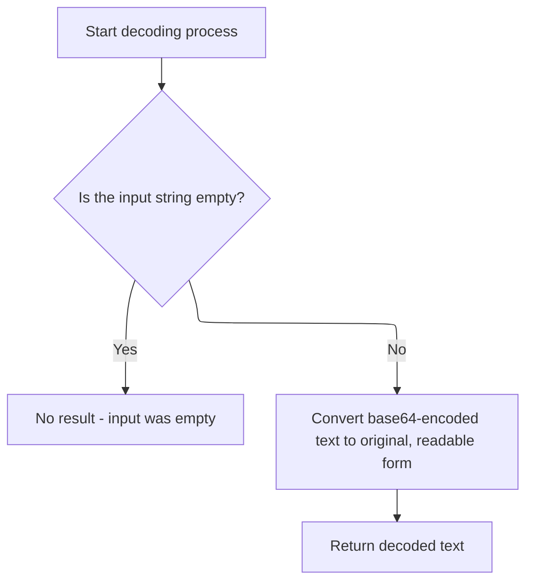
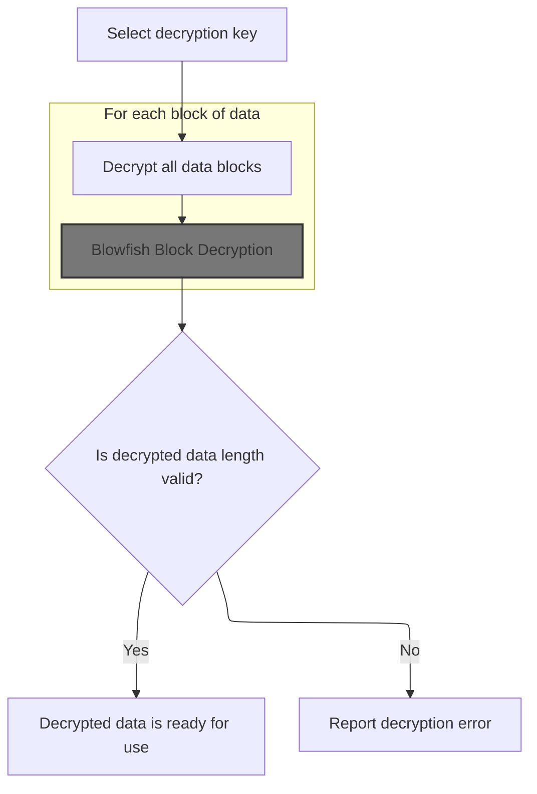
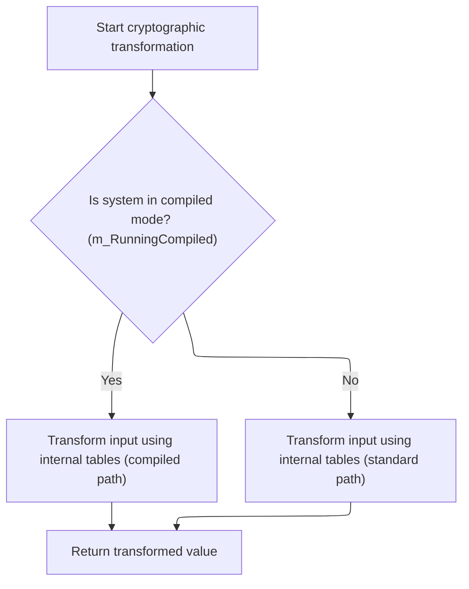

```mermaid
%%{init: {"flowchart": {"defaultRenderer": "elk"}} }%%
flowchart TD
    node1["Start decoding process"]
    click node1 openCode "HotelManagementSystem/Modules/clsBlowfish.cls:192:232"
    node2{"Is character mapping ready?"}
    click node2 openCode "HotelManagementSystem/Modules/clsBlowfish.cls:193:193"
    node3["Initialize character mapping"]
    click node3 openCode "HotelManagementSystem/Modules/clsBlowfish.cls:56:185"
    node4["Convert encoded characters to values"]
    click node4 openCode "HotelManagementSystem/Modules/clsBlowfish.cls:200:205"
    subgraph loop1["For each character in input"]
      node4
    end
    node5["Decode blocks of values to binary data"]
    click node5 openCode "HotelManagementSystem/Modules/clsBlowfish.cls:207:212"
    subgraph loop2["For each block of input"]
      node5
    end
    node6{"Partial block at end?"}
    click node6 openCode "HotelManagementSystem/Modules/clsBlowfish.cls:214:226"
    node7["Decode partial block"]
    click node7 openCode "HotelManagementSystem/Modules/clsBlowfish.cls:215:226"
    node8["Return decoded binary data"]
    click node8 openCode "HotelManagementSystem/Modules/clsBlowfish.cls:228:232"
    node1 --> node2
    node2 -- Yes --> node4
    node2 -- No --> node3
    node3 --> node4
    node4 --> node5
    node5 --> node6
    node6 -- Yes --> node7
    node6 -- No --> node8
    node7 --> node8
classDef HeadingStyle fill:#777777,stroke:#333,stroke-width:2px;

%% Swimm:
%% %%{init: {"flowchart": {"defaultRenderer": "elk"}} }%%
%% flowchart TD
%%     node1["Start decoding process"]
%%     click node1 openCode "<SwmPath>[HotelManagementSystem/Modules/clsBlowfish.cls](HotelManagementSystem/Modules/clsBlowfish.cls)</SwmPath>:192:232"
%%     node2{"Is character mapping ready?"}
%%     click node2 openCode "<SwmPath>[HotelManagementSystem/Modules/clsBlowfish.cls](HotelManagementSystem/Modules/clsBlowfish.cls)</SwmPath>:193:193"
%%     node3["Initialize character mapping"]
%%     click node3 openCode "<SwmPath>[HotelManagementSystem/Modules/clsBlowfish.cls](HotelManagementSystem/Modules/clsBlowfish.cls)</SwmPath>:56:185"
%%     node4["Convert encoded characters to values"]
%%     click node4 openCode "<SwmPath>[HotelManagementSystem/Modules/clsBlowfish.cls](HotelManagementSystem/Modules/clsBlowfish.cls)</SwmPath>:200:205"
%%     subgraph loop1["For each character in input"]
%%       node4
%%     end
%%     node5["Decode blocks of values to binary data"]
%%     click node5 openCode "<SwmPath>[HotelManagementSystem/Modules/clsBlowfish.cls](HotelManagementSystem/Modules/clsBlowfish.cls)</SwmPath>:207:212"
%%     subgraph loop2["For each block of input"]
%%       node5
%%     end
%%     node6{"Partial block at end?"}
%%     click node6 openCode "<SwmPath>[HotelManagementSystem/Modules/clsBlowfish.cls](HotelManagementSystem/Modules/clsBlowfish.cls)</SwmPath>:214:226"
%%     node7["Decode partial block"]
%%     click node7 openCode "<SwmPath>[HotelManagementSystem/Modules/clsBlowfish.cls](HotelManagementSystem/Modules/clsBlowfish.cls)</SwmPath>:215:226"
%%     node8["Return decoded binary data"]
%%     click node8 openCode "<SwmPath>[HotelManagementSystem/Modules/clsBlowfish.cls](HotelManagementSystem/Modules/clsBlowfish.cls)</SwmPath>:228:232"
%%     node1 --> node2
%%     node2 -- Yes --> node4
%%     node2 -- No --> node3
%%     node3 --> node4
%%     node4 --> node5
%%     node5 --> node6
%%     node6 -- Yes --> node7
%%     node6 -- No --> node8
%%     node7 --> node8
%% classDef HeadingStyle fill:#777777,stroke:#333,stroke-width:2px;
```

This document describes how encrypted and encoded data is restored to its original, readable form. By decoding and decrypting the input, the flow ensures that sensitive information can be securely stored and later retrieved when needed.

```mermaid
flowchart TD
  node1["Starting the Decryption Process"]:::HeadingStyle
  click node1 goToHeading "Starting the Decryption Process"
  node1 --> node2{"Is input Base64 encoded?"}
  node2 -->|"Yes"| node3["Decoding the Encoded Input"]:::HeadingStyle
  click node3 goToHeading "Decoding the Encoded Input"
  node2 -->|"No"| node3
  node3 --> node4["Block Decryption Loop"]:::HeadingStyle
  click node4 goToHeading "Block Decryption Loop"
  node4 --> node5{"Is decrypted data length valid?"}
  node5 -->|"Yes"| node6["Writing Decrypted Data Back"]:::HeadingStyle
  click node6 goToHeading "Writing Decrypted Data Back"
  node5 -->|"No"| node7["Raise error: Data size mismatch"]
classDef HeadingStyle fill:#777777,stroke:#333,stroke-width:2px;

%% Swimm:
%% flowchart TD
%%   node1["Starting the Decryption Process"]:::HeadingStyle
%%   click node1 goToHeading "Starting the Decryption Process"
%%   node1 --> node2{"Is input <SwmToken path="HotelManagementSystem/Modules/clsBlowfish.cls" pos="20:15:15" line-data="&#39; Standard Blowfish implementation with file support, Base64 conversion,">`Base64`</SwmToken> encoded?"}
%%   node2 -->|"Yes"| node3["Decoding the Encoded Input"]:::HeadingStyle
%%   click node3 goToHeading "Decoding the Encoded Input"
%%   node2 -->|"No"| node3
%%   node3 --> node4["Block Decryption Loop"]:::HeadingStyle
%%   click node4 goToHeading "Block Decryption Loop"
%%   node4 --> node5{"Is decrypted data length valid?"}
%%   node5 -->|"Yes"| node6["Writing Decrypted Data Back"]:::HeadingStyle
%%   click node6 goToHeading "Writing Decrypted Data Back"
%%   node5 -->|"No"| node7["Raise error: Data size mismatch"]
%% classDef HeadingStyle fill:#777777,stroke:#333,stroke-width:2px;
```



# Starting the Decryption Process

<SwmSnippet path="/HotelManagementSystem/Modules/clsBlowfish.cls" line="386">

---

In <SwmToken path="HotelManagementSystem/Modules/clsBlowfish.cls" pos="386:4:4" line-data="Public Function DecryptString(Text As String, Optional Key As String, Optional IsTextIn64 As Boolean) As String">`DecryptString`</SwmToken>, we kick things off by checking if the input is <SwmToken path="HotelManagementSystem/Modules/clsBlowfish.cls" pos="20:15:15" line-data="&#39; Standard Blowfish implementation with file support, Base64 conversion,">`Base64`</SwmToken> encoded (<SwmToken path="HotelManagementSystem/Modules/clsBlowfish.cls" pos="386:24:24" line-data="Public Function DecryptString(Text As String, Optional Key As String, Optional IsTextIn64 As Boolean) As String">`IsTextIn64`</SwmToken>). If it is, we call <SwmToken path="HotelManagementSystem/Modules/clsBlowfish.cls" pos="388:15:15" line-data="    If IsTextIn64 = True Then Text = Decode64(Text)">`Decode64`</SwmToken> to turn it into a plain string before doing anything else. This is necessary because decryption expects raw bytes, not encoded text. After decoding, we convert the string to a byte array for the actual decryption step.

```apex
Public Function DecryptString(Text As String, Optional Key As String, Optional IsTextIn64 As Boolean) As String
    Dim byteArray() As Byte
    If IsTextIn64 = True Then Text = Decode64(Text)
    byteArray() = StrConv(Text, vbFromUnicode)
```

---

</SwmSnippet>

## Decoding the Encoded Input



<SwmSnippet path="/HotelManagementSystem/Modules/clsBlowfish.cls" line="187">

---

<SwmToken path="HotelManagementSystem/Modules/clsBlowfish.cls" pos="187:4:4" line-data="Public Function Decode64(sInput As String) As String">`Decode64`</SwmToken> just checks for empty input, then delegates the actual <SwmToken path="HotelManagementSystem/Modules/clsBlowfish.cls" pos="20:15:15" line-data="&#39; Standard Blowfish implementation with file support, Base64 conversion,">`Base64`</SwmToken> decoding to <SwmToken path="HotelManagementSystem/Modules/clsBlowfish.cls" pos="189:7:7" line-data="    Decode64 = StrConv(DecodeArray64(sInput), vbUnicode)">`DecodeArray64`</SwmToken> and converts the result to a string.

```apex
Public Function Decode64(sInput As String) As String
    If sInput = "" Then Exit Function
    Decode64 = StrConv(DecodeArray64(sInput), vbUnicode)
End Function
```

---

</SwmSnippet>

## <SwmToken path="HotelManagementSystem/Modules/clsBlowfish.cls" pos="20:15:15" line-data="&#39; Standard Blowfish implementation with file support, Base64 conversion,">`Base64`</SwmToken> Byte Decoding Setup



<SwmSnippet path="/HotelManagementSystem/Modules/clsBlowfish.cls" line="192">

---

<SwmToken path="HotelManagementSystem/Modules/clsBlowfish.cls" pos="192:4:4" line-data="Public Function DecodeArray64(sInput As String) As Byte()">`DecodeArray64`</SwmToken> first makes sure the reverse index mapping for <SwmToken path="HotelManagementSystem/Modules/clsBlowfish.cls" pos="20:15:15" line-data="&#39; Standard Blowfish implementation with file support, Base64 conversion,">`Base64`</SwmToken> is set up by calling <SwmToken path="HotelManagementSystem/Modules/clsBlowfish.cls" pos="193:14:14" line-data="    If m_bytReverseIndex(47) &lt;&gt; 63 Then Initialize64">`Initialize64`</SwmToken> if needed. It strips out line breaks and padding from the input, then translates each character to its 6-bit value. The function then reconstructs the original bytes from these values, handling leftovers at the end, and finally copies the decoded bytes to the result array.

```apex
Public Function DecodeArray64(sInput As String) As Byte()
    If m_bytReverseIndex(47) <> 63 Then Initialize64
    Dim bytInput() As Byte
    Dim bytWorkspace() As Byte
    Dim bytResult() As Byte
    Dim lInputCounter As Long
    Dim lWorkspaceCounter As Long
    
    bytInput = Replace(Replace(sInput, vbCrLf, ""), "=", "")
    ReDim bytWorkspace(LBound(bytInput) To (UBound(bytInput) * 2)) As Byte
    lWorkspaceCounter = LBound(bytWorkspace)
    For lInputCounter = LBound(bytInput) To UBound(bytInput)
        bytInput(lInputCounter) = m_bytReverseIndex(bytInput(lInputCounter))
    Next lInputCounter
    
    For lInputCounter = LBound(bytInput) To (UBound(bytInput) - ((UBound(bytInput) Mod 8) + 8)) Step 8
        bytWorkspace(lWorkspaceCounter) = (bytInput(lInputCounter) * k_bytShift2) + (bytInput(lInputCounter + 2) \ k_bytShift4)
        bytWorkspace(lWorkspaceCounter + 1) = ((bytInput(lInputCounter + 2) And k_bytMask2) * k_bytShift4) + (bytInput(lInputCounter + 4) \ k_bytShift2)
        bytWorkspace(lWorkspaceCounter + 2) = ((bytInput(lInputCounter + 4) And k_bytMask1) * k_bytShift6) + bytInput(lInputCounter + 6)
        lWorkspaceCounter = lWorkspaceCounter + 3
    Next lInputCounter
    
    Select Case (UBound(bytInput) Mod 8):
        Case 3:
            bytWorkspace(lWorkspaceCounter) = (bytInput(lInputCounter) * k_bytShift2) + (bytInput(lInputCounter + 2) \ k_bytShift4)
        Case 5:
            bytWorkspace(lWorkspaceCounter) = (bytInput(lInputCounter) * k_bytShift2) + (bytInput(lInputCounter + 2) \ k_bytShift4)
            bytWorkspace(lWorkspaceCounter + 1) = ((bytInput(lInputCounter + 2) And k_bytMask2) * k_bytShift4) + (bytInput(lInputCounter + 4) \ k_bytShift2)
            lWorkspaceCounter = lWorkspaceCounter + 1
        Case 7:
            bytWorkspace(lWorkspaceCounter) = (bytInput(lInputCounter) * k_bytShift2) + (bytInput(lInputCounter + 2) \ k_bytShift4)
            bytWorkspace(lWorkspaceCounter + 1) = ((bytInput(lInputCounter + 2) And k_bytMask2) * k_bytShift4) + (bytInput(lInputCounter + 4) \ k_bytShift2)
            bytWorkspace(lWorkspaceCounter + 2) = ((bytInput(lInputCounter + 4) And k_bytMask1) * k_bytShift6) + bytInput(lInputCounter + 6)
            lWorkspaceCounter = lWorkspaceCounter + 2
    End Select
    
    ReDim bytResult(LBound(bytWorkspace) To lWorkspaceCounter) As Byte
    If LBound(bytWorkspace) = 0 Then lWorkspaceCounter = lWorkspaceCounter + 1
    CopyMemory VarPtr(bytResult(LBound(bytResult))), VarPtr(bytWorkspace(LBound(bytWorkspace))), lWorkspaceCounter
    DecodeArray64 = bytResult
End Function
```

---

</SwmSnippet>

<SwmSnippet path="/HotelManagementSystem/Modules/clsBlowfish.cls" line="56">

---

<SwmToken path="HotelManagementSystem/Modules/clsBlowfish.cls" pos="56:4:4" line-data="Private Sub Initialize64()">`Initialize64`</SwmToken> sets up two arrays: one mapping indices to <SwmToken path="HotelManagementSystem/Modules/clsBlowfish.cls" pos="20:15:15" line-data="&#39; Standard Blowfish implementation with file support, Base64 conversion,">`Base64`</SwmToken> characters, and another mapping ASCII values back to indices. This is the standard <SwmToken path="HotelManagementSystem/Modules/clsBlowfish.cls" pos="20:15:15" line-data="&#39; Standard Blowfish implementation with file support, Base64 conversion,">`Base64`</SwmToken> character set, so encoding and decoding work as expected.

```apex
Private Sub Initialize64()
    m_bytIndex(0) = 65 'Asc("A")
    m_bytIndex(1) = 66 'Asc("B")
    m_bytIndex(2) = 67 'Asc("C")
    m_bytIndex(3) = 68 'Asc("D")
    m_bytIndex(4) = 69 'Asc("E")
    m_bytIndex(5) = 70 'Asc("F")
    m_bytIndex(6) = 71 'Asc("G")
    m_bytIndex(7) = 72 'Asc("H")
    m_bytIndex(8) = 73 'Asc("I")
    m_bytIndex(9) = 74 'Asc("J")
    m_bytIndex(10) = 75 'Asc("K")
    m_bytIndex(11) = 76 'Asc("L")
    m_bytIndex(12) = 77 'Asc("M")
    m_bytIndex(13) = 78 'Asc("N")
    m_bytIndex(14) = 79 'Asc("O")
    m_bytIndex(15) = 80 'Asc("P")
    m_bytIndex(16) = 81 'Asc("Q")
    m_bytIndex(17) = 82 'Asc("R")
    m_bytIndex(18) = 83 'Asc("S")
    m_bytIndex(19) = 84 'Asc("T")
    m_bytIndex(20) = 85 'Asc("U")
    m_bytIndex(21) = 86 'Asc("V")
    m_bytIndex(22) = 87 'Asc("W")
    m_bytIndex(23) = 88 'Asc("X")
    m_bytIndex(24) = 89 'Asc("Y")
    m_bytIndex(25) = 90 'Asc("Z")
    m_bytIndex(26) = 97 'Asc("a")
    m_bytIndex(27) = 98 'Asc("b")
    m_bytIndex(28) = 99 'Asc("c")
    m_bytIndex(29) = 100 'Asc("d")
    m_bytIndex(30) = 101 'Asc("e")
    m_bytIndex(31) = 102 'Asc("f")
    m_bytIndex(32) = 103 'Asc("g")
    m_bytIndex(33) = 104 'Asc("h")
    m_bytIndex(34) = 105 'Asc("i")
    m_bytIndex(35) = 106 'Asc("j")
    m_bytIndex(36) = 107 'Asc("k")
    m_bytIndex(37) = 108 'Asc("l")
    m_bytIndex(38) = 109 'Asc("m")
    m_bytIndex(39) = 110 'Asc("n")
    m_bytIndex(40) = 111 'Asc("o")
    m_bytIndex(41) = 112 'Asc("p")
    m_bytIndex(42) = 113 'Asc("q")
    m_bytIndex(43) = 114 'Asc("r")
    m_bytIndex(44) = 115 'Asc("s")
    m_bytIndex(45) = 116 'Asc("t")
    m_bytIndex(46) = 117 'Asc("u")
    m_bytIndex(47) = 118 'Asc("v")
    m_bytIndex(48) = 119 'Asc("w")
    m_bytIndex(49) = 120 'Asc("x")
    m_bytIndex(50) = 121 'Asc("y")
    m_bytIndex(51) = 122 'Asc("z")
    m_bytIndex(52) = 48 'Asc("0")
    m_bytIndex(53) = 49 'Asc("1")
    m_bytIndex(54) = 50 'Asc("2")
    m_bytIndex(55) = 51 'Asc("3")
    m_bytIndex(56) = 52 'Asc("4")
    m_bytIndex(57) = 53 'Asc("5")
    m_bytIndex(58) = 54 'Asc("6")
    m_bytIndex(59) = 55 'Asc("7")
    m_bytIndex(60) = 56 'Asc("8")
    m_bytIndex(61) = 57 'Asc("9")
    m_bytIndex(62) = 43 'Asc("+")
    m_bytIndex(63) = 47 'Asc("/")
    m_bytReverseIndex(65) = 0 'Asc("A")
    m_bytReverseIndex(66) = 1 'Asc("B")
    m_bytReverseIndex(67) = 2 'Asc("C")
    m_bytReverseIndex(68) = 3 'Asc("D")
    m_bytReverseIndex(69) = 4 'Asc("E")
    m_bytReverseIndex(70) = 5 'Asc("F")
    m_bytReverseIndex(71) = 6 'Asc("G")
    m_bytReverseIndex(72) = 7 'Asc("H")
    m_bytReverseIndex(73) = 8 'Asc("I")
    m_bytReverseIndex(74) = 9 'Asc("J")
    m_bytReverseIndex(75) = 10 'Asc("K")
    m_bytReverseIndex(76) = 11 'Asc("L")
    m_bytReverseIndex(77) = 12 'Asc("M")
    m_bytReverseIndex(78) = 13 'Asc("N")
    m_bytReverseIndex(79) = 14 'Asc("O")
    m_bytReverseIndex(80) = 15 'Asc("P")
    m_bytReverseIndex(81) = 16 'Asc("Q")
    m_bytReverseIndex(82) = 17 'Asc("R")
    m_bytReverseIndex(83) = 18 'Asc("S")
    m_bytReverseIndex(84) = 19 'Asc("T")
    m_bytReverseIndex(85) = 20 'Asc("U")
    m_bytReverseIndex(86) = 21 'Asc("V")
    m_bytReverseIndex(87) = 22 'Asc("W")
    m_bytReverseIndex(88) = 23 'Asc("X")
    m_bytReverseIndex(89) = 24 'Asc("Y")
    m_bytReverseIndex(90) = 25 'Asc("Z")
    m_bytReverseIndex(97) = 26 'Asc("a")
    m_bytReverseIndex(98) = 27 'Asc("b")
    m_bytReverseIndex(99) = 28 'Asc("c")
    m_bytReverseIndex(100) = 29 'Asc("d")
    m_bytReverseIndex(101) = 30 'Asc("e")
    m_bytReverseIndex(102) = 31 'Asc("f")
    m_bytReverseIndex(103) = 32 'Asc("g")
    m_bytReverseIndex(104) = 33 'Asc("h")
    m_bytReverseIndex(105) = 34 'Asc("i")
    m_bytReverseIndex(106) = 35 'Asc("j")
    m_bytReverseIndex(107) = 36 'Asc("k")
    m_bytReverseIndex(108) = 37 'Asc("l")
    m_bytReverseIndex(109) = 38 'Asc("m")
    m_bytReverseIndex(110) = 39 'Asc("n")
    m_bytReverseIndex(111) = 40 'Asc("o")
    m_bytReverseIndex(112) = 41 'Asc("p")
    m_bytReverseIndex(113) = 42 'Asc("q")
    m_bytReverseIndex(114) = 43 'Asc("r")
    m_bytReverseIndex(115) = 44 'Asc("s")
    m_bytReverseIndex(116) = 45 'Asc("t")
    m_bytReverseIndex(117) = 46 'Asc("u")
    m_bytReverseIndex(118) = 47 'Asc("v")
    m_bytReverseIndex(119) = 48 'Asc("w")
    m_bytReverseIndex(120) = 49 'Asc("x")
    m_bytReverseIndex(121) = 50 'Asc("y")
    m_bytReverseIndex(122) = 51 'Asc("z")
    m_bytReverseIndex(48) = 52 'Asc("0")
    m_bytReverseIndex(49) = 53 'Asc("1")
    m_bytReverseIndex(50) = 54 'Asc("2")
    m_bytReverseIndex(51) = 55 'Asc("3")
    m_bytReverseIndex(52) = 56 'Asc("4")
    m_bytReverseIndex(53) = 57 'Asc("5")
    m_bytReverseIndex(54) = 58 'Asc("6")
    m_bytReverseIndex(55) = 59 'Asc("7")
    m_bytReverseIndex(56) = 60 'Asc("8")
    m_bytReverseIndex(57) = 61 'Asc("9")
    m_bytReverseIndex(43) = 62 'Asc("+")
    m_bytReverseIndex(47) = 63 'Asc("/")
End Sub
```

---

</SwmSnippet>

## Decrypting the Byte Array

<SwmSnippet path="/HotelManagementSystem/Modules/clsBlowfish.cls" line="390">

---

Back in <SwmToken path="HotelManagementSystem/Modules/clsBlowfish.cls" pos="391:1:1" line-data="    DecryptString = StrConv(byteArray(), vbUnicode)">`DecryptString`</SwmToken>, after <SwmToken path="HotelManagementSystem/Modules/clsBlowfish.cls" pos="187:4:4" line-data="Public Function Decode64(sInput As String) As String">`Decode64`</SwmToken> returns, we convert the string to a byte array and call <SwmToken path="HotelManagementSystem/Modules/clsBlowfish.cls" pos="390:3:3" line-data="    Call DecryptByte(byteArray(), Key)">`DecryptByte`</SwmToken> to actually decrypt the data using the key. Once decrypted, we turn the bytes back into a Unicode string and clean up.

```apex
    Call DecryptByte(byteArray(), Key)
    DecryptString = StrConv(byteArray(), vbUnicode)
    Erase byteArray(): Key = "": Text = ""
End Function
```

---

</SwmSnippet>

# Block Decryption Loop



<SwmSnippet path="/HotelManagementSystem/Modules/clsBlowfish.cls" line="394">

---

In <SwmToken path="HotelManagementSystem/Modules/clsBlowfish.cls" pos="394:4:4" line-data="Public Sub DecryptByte(byteArray() As Byte, Optional Key As String)">`DecryptByte`</SwmToken>, we loop through the byte array in 8-byte chunks. For each chunk, we pull out two 4-byte words using <SwmToken path="HotelManagementSystem/Modules/clsBlowfish.cls" pos="400:3:3" line-data="        Call GetWord(LeftWord, byteArray(), Offset)">`GetWord`</SwmToken>, which is needed because the decryption algorithm works on these word pairs.

```apex
Public Sub DecryptByte(byteArray() As Byte, Optional Key As String)
    On Error GoTo ErrorHandler
    Dim Offset As Long, OrigLen As Long, LeftWord As Long, RightWord As Long, CipherLen As Long, CipherLeft As Long, CipherRight As Long, CurrPercent As Long, NextPercent As Long
    If (Len(Key) > 0) Then Me.Key = Key
    CipherLen = UBound(byteArray) + 1
    For Offset = 0 To (CipherLen - 1) Step 8
        Call GetWord(LeftWord, byteArray(), Offset)
        Call GetWord(RightWord, byteArray(), Offset + 4)
```

---

</SwmSnippet>

<SwmSnippet path="/HotelManagementSystem/Modules/clsBlowfish.cls" line="428">

---

<SwmToken path="HotelManagementSystem/Modules/clsBlowfish.cls" pos="428:6:6" line-data="Private Static Sub GetWord(LongValue As Long, CryptBuffer() As Byte, Offset As Long)">`GetWord`</SwmToken> grabs 4 bytes from the byte array at the given offset, reverses their order, and copies them into a Long. This handles the endianness difference between the data format and VB6's Long type.

```apex
Private Static Sub GetWord(LongValue As Long, CryptBuffer() As Byte, Offset As Long)
    Dim bb(0 To 3) As Byte
    bb(3) = CryptBuffer(Offset)
    bb(2) = CryptBuffer(Offset + 1)
    bb(1) = CryptBuffer(Offset + 2)
    bb(0) = CryptBuffer(Offset + 3)
    Call CopyMem(LongValue, bb(0), 4)
End Sub
```

---

</SwmSnippet>

<SwmSnippet path="/HotelManagementSystem/Modules/clsBlowfish.cls" line="402">

---

Back in <SwmToken path="HotelManagementSystem/Modules/clsBlowfish.cls" pos="390:3:3" line-data="    Call DecryptByte(byteArray(), Key)">`DecryptByte`</SwmToken>, after pulling out the two words, we call <SwmToken path="HotelManagementSystem/Modules/clsBlowfish.cls" pos="402:3:3" line-data="        Call DecryptBlock(LeftWord, RightWord)">`DecryptBlock`</SwmToken> to actually run the Blowfish decryption on them. This is the core cryptographic step.

```apex
        Call DecryptBlock(LeftWord, RightWord)
        LeftWord = LeftWord Xor CipherLeft
        RightWord = RightWord Xor CipherRight
        Call GetWord(CipherLeft, byteArray(), Offset)
```

---

</SwmSnippet>

## Blowfish Block Decryption

<SwmSnippet path="/HotelManagementSystem/Modules/clsBlowfish.cls" line="320">

---

<SwmToken path="HotelManagementSystem/Modules/clsBlowfish.cls" pos="320:6:6" line-data="Private Static Sub DecryptBlock(Xl As Long, Xr As Long)">`DecryptBlock`</SwmToken> runs the Blowfish decryption rounds on the two halves of the block. Each round uses the f function to mix things up, alternating between Xl and Xr, and applying subkeys from <SwmToken path="HotelManagementSystem/Modules/clsBlowfish.cls" pos="323:9:9" line-data="    Xr = Xl Xor m_pBox(Rounds + 1)">`m_pBox`</SwmToken>.

```apex
Private Static Sub DecryptBlock(Xl As Long, Xr As Long)
    Dim I As Long, j As Long, K As Long
    K = Xr
    Xr = Xl Xor m_pBox(Rounds + 1)
    Xl = K Xor m_pBox(Rounds)
    j = Rounds - 2
    For I = 0 To (Rounds \ 2 - 1)
        Xl = Xl Xor f(Xr)
        Xr = Xr Xor m_pBox(j + 1)
        Xr = Xr Xor f(Xl)
        Xl = Xl Xor m_pBox(j)
        j = j - 2
    Next
End Sub
```

---

</SwmSnippet>

## Non-linear Transformation



<SwmSnippet path="/HotelManagementSystem/Modules/clsBlowfish.cls" line="423">

---

<SwmToken path="HotelManagementSystem/Modules/clsBlowfish.cls" pos="423:6:6" line-data="Private Static Function f(ByVal X As Long) As Long">`f`</SwmToken> splits the input into four bytes, looks up values in the s-boxes, and combines them with addition and XOR. If we're not running compiled, it uses <SwmToken path="HotelManagementSystem/Modules/clsBlowfish.cls" pos="426:75:75" line-data="    If (m_RunningCompiled) Then f = (((m_sBox(0, xb(3)) + m_sBox(1, xb(2))) Xor m_sBox(2, xb(1))) + m_sBox(3, xb(0))) Else f = UnsignedAdd((UnsignedAdd(m_sBox(0, xb(3)), m_sBox(1, xb(2))) Xor m_sBox(2, xb(1))), m_sBox(3, xb(0)))">`UnsignedAdd`</SwmToken> to avoid signed overflow issues in VB6.

```apex
Private Static Function f(ByVal X As Long) As Long
    Dim xb(0 To 3) As Byte
    Call CopyMem(xb(0), X, 4)
    If (m_RunningCompiled) Then f = (((m_sBox(0, xb(3)) + m_sBox(1, xb(2))) Xor m_sBox(2, xb(1))) + m_sBox(3, xb(0))) Else f = UnsignedAdd((UnsignedAdd(m_sBox(0, xb(3)), m_sBox(1, xb(2))) Xor m_sBox(2, xb(1))), m_sBox(3, xb(0)))
End Function
```

---

</SwmSnippet>

<SwmSnippet path="/HotelManagementSystem/Modules/clsBlowfish.cls" line="444">

---

<SwmToken path="HotelManagementSystem/Modules/clsBlowfish.cls" pos="444:6:6" line-data="Private Static Function UnsignedAdd(ByVal Data1 As Long, Data2 As Long) As Long">`UnsignedAdd`</SwmToken> adds two 32-bit numbers byte by byte, carrying overflows as needed, to simulate unsigned addition since VB6 only has signed Longs.

```apex
Private Static Function UnsignedAdd(ByVal Data1 As Long, Data2 As Long) As Long
    Dim x1(0 To 3) As Byte, x2(0 To 3) As Byte, xx(0 To 3) As Byte, Rest As Long, Value As Long, a As Long
    Call CopyMem(x1(0), Data1, 4)
    Call CopyMem(x2(0), Data2, 4)
    Rest = 0
    For a = 0 To 3
        Value = CLng(x1(a)) + CLng(x2(a)) + Rest
        xx(a) = Value And 255
        Rest = Value \ 256
    Next
    Call CopyMem(UnsignedAdd, xx(0), 4)
End Function
```

---

</SwmSnippet>

## Writing Decrypted Data Back

```mermaid
%%{init: {"flowchart": {"defaultRenderer": "elk"}} }%%
flowchart TD
    node1["Begin decryption of encrypted data"]
    click node1 openCode "HotelManagementSystem/Modules/clsBlowfish.cls:406:406"
    
    subgraph loop1["For each block of encrypted data"]
        node1 --> node2["Decrypt block and write to output"]
        click node2 openCode "HotelManagementSystem/Modules/clsBlowfish.cls:406:408"
        node2 --> node3{"Reached next progress threshold?"}
        click node3 openCode "HotelManagementSystem/Modules/clsBlowfish.cls:409:413"
        node3 -->|"Yes"| node4["Update progress percentage"]
        click node4 openCode "HotelManagementSystem/Modules/clsBlowfish.cls:412:412"
        node4 --> node2
        node3 -->|"No"| node2
    end
    node2 --> node5["Restore original data from decrypted output"]
    click node5 openCode "HotelManagementSystem/Modules/clsBlowfish.cls:415:418"
    node5 --> node6{"Is the restored data size within expected range?"}
    click node6 openCode "HotelManagementSystem/Modules/clsBlowfish.cls:416:416"
    node6 -->|"Yes"| node7["Return decrypted data"]
    click node7 openCode "HotelManagementSystem/Modules/clsBlowfish.cls:417:418"
    node6 -->|"No"| node8["Raise error: Data size mismatch"]
    click node8 openCode "HotelManagementSystem/Modules/clsBlowfish.cls:416:416"
    node7 --> node9{"Is progress at 100%?"}
    click node9 openCode "HotelManagementSystem/Modules/clsBlowfish.cls:419:419"
    node9 -->|"No"| node10["Update progress to 100%"]
    click node10 openCode "HotelManagementSystem/Modules/clsBlowfish.cls:419:419"
    node10 --> node11["Decryption complete"]
    node9 -->|"Yes"| node11["Decryption complete"]
    click node11 openCode "HotelManagementSystem/Modules/clsBlowfish.cls:420:420"

classDef HeadingStyle fill:#777777,stroke:#333,stroke-width:2px;

%% Swimm:
%% %%{init: {"flowchart": {"defaultRenderer": "elk"}} }%%
%% flowchart TD
%%     node1["Begin decryption of encrypted data"]
%%     click node1 openCode "<SwmPath>[HotelManagementSystem/Modules/clsBlowfish.cls](HotelManagementSystem/Modules/clsBlowfish.cls)</SwmPath>:406:406"
%%     
%%     subgraph loop1["For each block of encrypted data"]
%%         node1 --> node2["Decrypt block and write to output"]
%%         click node2 openCode "<SwmPath>[HotelManagementSystem/Modules/clsBlowfish.cls](HotelManagementSystem/Modules/clsBlowfish.cls)</SwmPath>:406:408"
%%         node2 --> node3{"Reached next progress threshold?"}
%%         click node3 openCode "<SwmPath>[HotelManagementSystem/Modules/clsBlowfish.cls](HotelManagementSystem/Modules/clsBlowfish.cls)</SwmPath>:409:413"
%%         node3 -->|"Yes"| node4["Update progress percentage"]
%%         click node4 openCode "<SwmPath>[HotelManagementSystem/Modules/clsBlowfish.cls](HotelManagementSystem/Modules/clsBlowfish.cls)</SwmPath>:412:412"
%%         node4 --> node2
%%         node3 -->|"No"| node2
%%     end
%%     node2 --> node5["Restore original data from decrypted output"]
%%     click node5 openCode "<SwmPath>[HotelManagementSystem/Modules/clsBlowfish.cls](HotelManagementSystem/Modules/clsBlowfish.cls)</SwmPath>:415:418"
%%     node5 --> node6{"Is the restored data size within expected range?"}
%%     click node6 openCode "<SwmPath>[HotelManagementSystem/Modules/clsBlowfish.cls](HotelManagementSystem/Modules/clsBlowfish.cls)</SwmPath>:416:416"
%%     node6 -->|"Yes"| node7["Return decrypted data"]
%%     click node7 openCode "<SwmPath>[HotelManagementSystem/Modules/clsBlowfish.cls](HotelManagementSystem/Modules/clsBlowfish.cls)</SwmPath>:417:418"
%%     node6 -->|"No"| node8["Raise error: Data size mismatch"]
%%     click node8 openCode "<SwmPath>[HotelManagementSystem/Modules/clsBlowfish.cls](HotelManagementSystem/Modules/clsBlowfish.cls)</SwmPath>:416:416"
%%     node7 --> node9{"Is progress at 100%?"}
%%     click node9 openCode "<SwmPath>[HotelManagementSystem/Modules/clsBlowfish.cls](HotelManagementSystem/Modules/clsBlowfish.cls)</SwmPath>:419:419"
%%     node9 -->|"No"| node10["Update progress to 100%"]
%%     click node10 openCode "<SwmPath>[HotelManagementSystem/Modules/clsBlowfish.cls](HotelManagementSystem/Modules/clsBlowfish.cls)</SwmPath>:419:419"
%%     node10 --> node11["Decryption complete"]
%%     node9 -->|"Yes"| node11["Decryption complete"]
%%     click node11 openCode "<SwmPath>[HotelManagementSystem/Modules/clsBlowfish.cls](HotelManagementSystem/Modules/clsBlowfish.cls)</SwmPath>:420:420"
%% 
%% classDef HeadingStyle fill:#777777,stroke:#333,stroke-width:2px;
```



<SwmSnippet path="/HotelManagementSystem/Modules/clsBlowfish.cls" line="406">

---

Back in <SwmToken path="HotelManagementSystem/Modules/clsBlowfish.cls" pos="390:3:3" line-data="    Call DecryptByte(byteArray(), Key)">`DecryptByte`</SwmToken>, after <SwmToken path="HotelManagementSystem/Modules/clsBlowfish.cls" pos="320:6:6" line-data="Private Static Sub DecryptBlock(Xl As Long, Xr As Long)">`DecryptBlock`</SwmToken>, we call <SwmToken path="HotelManagementSystem/Modules/clsBlowfish.cls" pos="406:3:3" line-data="        Call GetWord(CipherRight, byteArray(), Offset + 4)">`GetWord`</SwmToken> again to update <SwmToken path="HotelManagementSystem/Modules/clsBlowfish.cls" pos="406:5:5" line-data="        Call GetWord(CipherRight, byteArray(), Offset + 4)">`CipherRight`</SwmToken> with the original value from the byte array. This keeps the chaining for the next block correct.

```apex
        Call GetWord(CipherRight, byteArray(), Offset + 4)
        Call PutWord(LeftWord, byteArray(), Offset)
```

---

</SwmSnippet>

<SwmSnippet path="/HotelManagementSystem/Modules/clsBlowfish.cls" line="408">

---

Back in <SwmToken path="HotelManagementSystem/Modules/clsBlowfish.cls" pos="390:3:3" line-data="    Call DecryptByte(byteArray(), Key)">`DecryptByte`</SwmToken>, we write the decrypted words back, raise progress events, check data length, and trim the array.

```apex
        Call PutWord(RightWord, byteArray(), Offset + 4)
        If Offset >= NextPercent Then
            CurrPercent = Int((Offset / CipherLen) * 100)
            NextPercent = (CipherLen * ((CurrPercent + 1) / 100)) + 1
            RaiseEvent Progress(CurrPercent)
        End If
    Next
    Call CopyMem(OrigLen, byteArray(8), 4)
    If (CipherLen - OrigLen > 19) Or (CipherLen - OrigLen < 12) Then Call err.Raise(vbObjectError, , "Incorrect size descriptor in Blowfish decryption")
    Call CopyMem(byteArray(0), byteArray(12), OrigLen)
    ReDim Preserve byteArray(OrigLen - 1)
    If CurrPercent <> 100 Then RaiseEvent Progress(100)

ErrorHandler:
End Sub
```

---

</SwmSnippet>

<SwmSnippet path="/HotelManagementSystem/Modules/clsBlowfish.cls" line="436">

---

<SwmToken path="HotelManagementSystem/Modules/clsBlowfish.cls" pos="436:6:6" line-data="Private Static Sub PutWord(LongValue As Long, CryptBuffer() As Byte, Offset As Long)">`PutWord`</SwmToken> writes a 4-byte integer to the array in big-endian order.

```apex
Private Static Sub PutWord(LongValue As Long, CryptBuffer() As Byte, Offset As Long)
    Dim bb(0 To 3) As Byte
    Call CopyMem(bb(0), LongValue, 4)
    CryptBuffer(Offset) = bb(3)
    CryptBuffer(Offset + 1) = bb(2)
    CryptBuffer(Offset + 2) = bb(1)
    CryptBuffer(Offset + 3) = bb(0)
End Sub
```

---

</SwmSnippet>

&nbsp;

*This is an auto-generated document by Swimm 🌊 and has not yet been verified by a human*

<SwmMeta version="3.0.0" repo-id="Z2l0aHViJTNBJTNBY3RzLVZCNi1Qcm9qZWN0cyUzQSUzQVN3aW1tLURlbW8=" repo-name="cts-VB6-Projects"><sup>Powered by [Swimm](https://app.swimm.io/)</sup></SwmMeta>
