This document describes how users update system settings using the options form. When new options are saved, the application validates the input, updates its configuration, refreshes the main UI, and ensures all computers' statuses reflect the new settings. The user is then returned to the main interface.

# Saving Options and Triggering Application Refresh

<SwmSnippet path="/Internet Cafe System/sErVere/frmOptions.frm" line="234">

---

In <SwmToken path="Internet Cafe System/sErVere/frmOptions.frm" pos="234:4:4" line-data="Private Sub cmdSave_Click()">`cmdSave_Click`</SwmToken>, we validate the input fields, update the main configuration record, sync the <SwmToken path="Internet Cafe System/sErVere/frmOptions.frm" pos="243:1:1" line-data="  NumberComps = Val(cmbNumComps.Text)">`NumberComps`</SwmToken> global, refresh the main list view, and then call Main to reload the app state with the new settings. Calling Main next is necessary to make sure all changes are picked up everywhere, not just in the options form.

```visual basic
Private Sub cmdSave_Click()
Dim i As Integer
  If cmbIR.Text = "" Or cmbGRR.Text = "" Then Exit Sub
  Rst.MoveFirst
  Rst!Month = Val(cmbIR.Text)
  Rst!Day = Val(cmbGRR.Text)
  Rst!CompNum = Val(cmbNumComps.Text)
  Rst!Year = Val(cmbMinAmt.Text)
  Rst.Update
  NumberComps = Val(cmbNumComps.Text)
  frmMain.Fill_ListView
  Main
```

---

</SwmSnippet>

## Application Bootstrapping and Database Initialization

<SwmSnippet path="/Internet Cafe System/sErVere/Module1.bas" line="159">

---

In <SwmToken path="Internet Cafe System/sErVere/Module1.bas" pos="159:2:2" line-data="Sub Main()">`Main`</SwmToken>, we start by updating the splash screen and loading the web server form. The next step is to call the Load function in BK <SwmPath>[BK App/Clas/cTahun.cls](BK%20App/Clas/cTahun.cls)</SwmPath> to pull in the current academic year context, which is needed before we open the main database connection and continue initializing the app.

```visual basic
Sub Main()
  Dim i As Byte
  
  frmSplash.lblStatus.Caption = "Loading Personal Web Server..."
  Load frmWebServer
```

---

</SwmSnippet>

<SwmSnippet path="/BK App/Clas/cTahun.cls" line="44">

---

Load... Here, we query the <SwmToken path="BK App/Clas/cTahun.cls" pos="50:15:15" line-data="SQL = &quot;SELECT IDTahunAjaran,Tahunajaran,Aktif FROM TBTahunAjaran WHERE Tahunajaran=&#39;&quot; &amp; pTahunajaran &amp; &quot;&#39;&quot;">`TBTahunAjaran`</SwmToken> table for a matching academic year. If found, we set the class properties for ID, year, and active status; otherwise, we bail out early. This ensures the rest of the app has the right context before moving on.

```apex
Public Function Load(pTahunajaran As String) As Integer
On Error GoTo HELL
Dim RS As New ADODB.Recordset

RS.CursorType = adOpenForwardOnly
RS.LockType = adLockReadOnly
SQL = "SELECT IDTahunAjaran,Tahunajaran,Aktif FROM TBTahunAjaran WHERE Tahunajaran='" & pTahunajaran & "'"
Set RS = DB_CONNECTION.Execute(SQL)
With RS
    If .EOF Then
        Load = 0
        Exit Function
    Else
        IDTahunAjaran = !IDTahunAjaran
        Tahunajaran = !Tahunajaran
        Aktif = !Aktif
    End If
    .Close
End With
Set RS = Nothing
Load = 1
Exit Function
HELL:
    Set RS = Nothing
    Err.Raise BASE_ERROR, SRC_ERROR, Err.Description
End Function
```

---

</SwmSnippet>

<SwmSnippet path="/Internet Cafe System/sErVere/Module1.bas" line="164">

---

Back in Main, after getting the academic year, we update the splash progress and call <SwmToken path="Internet Cafe System/sErVere/Module1.bas" pos="172:1:1" line-data="  Open_Connection">`Open_Connection`</SwmToken> to set up the main database link. Without this, none of the following data loads or UI updates would work.

```visual basic
  'filters to run only one app itself
  'If App.PrevInstance = True Then End

  frmSplash.Bar.Value = 20
  
  'set INI class
  'Set INI = New cINI
  
  Open_Connection
```

---

</SwmSnippet>

<SwmSnippet path="/Internet Cafe System/sErVere/Module1.bas" line="149">

---

<SwmToken path="Internet Cafe System/sErVere/Module1.bas" pos="149:4:4" line-data="Public Sub Open_Connection()">`Open_Connection`</SwmToken>... Here, we set up the ADODB connection with a password-protected Access DB, configure it for client-side cursors, and open it. This is the foundation for all subsequent database operations.

```visual basic
Public Sub Open_Connection()
  Set Conn = New ADODB.Connection
  With Conn
    .ConnectionString = "Provider=Microsoft.Jet.OLEDB.4.0;Data Source=" & App.Path & "\Caferitos.mdb;Jet OLEDB:Database Password=GallanosA;"
    .CommandTimeout = 0
    .CursorLocation = adUseClient
    .Open
  End With
End Sub
```

---

</SwmSnippet>

<SwmSnippet path="/Internet Cafe System/sErVere/Module1.bas" line="173">

---

Back in Main, after opening the connection, we load all the required databases (backup, logs, client status, KWH), update the splash progress, and set global variables from the logs. Then we call <SwmToken path="Internet Cafe System/sErVere/Module1.bas" pos="220:1:1" line-data="  Check_Stagnant">`Check_Stagnant`</SwmToken> to sync the UI with the latest data.

```visual basic
  'Backup Database
  Set SvrDbRst = New ADODB.Recordset
  SvrStrConn = "SELECT * FROM tblBackUp"
  frmSplash.lblStatus.Caption = "Loading Backup DBase..."
  DoEvents
  SvrDbRst.Open SvrStrConn, Conn, adOpenDynamic, adLockOptimistic
  
  frmSplash.imgScreen2.Picture = frmSplash.imgScreen.Picture
  frmSplash.Bar.Value = 50
  
  'Client Logs Database
  Set Rst = New ADODB.Recordset
  SvrStrConn = "SELECT * FROM tblLogs ORDER by ID"
  frmSplash.lblStatus.Caption = "Loading Main DBase..."
  DoEvents
  Rst.Open SvrStrConn, Conn, adOpenDynamic, adLockOptimistic
  
  frmSplash.imgScreen.Picture = LoadPicture("")
  frmSplash.Bar.Value = 75
  
  'Database of Lock/Unlock of the Clients
  Set Mon_Rst = New ADODB.Recordset
  SvrStrConn = "SELECT * FROM tblClientMon"
  frmSplash.lblStatus.Caption = "Loading Lock/Unlock DBase..."
  DoEvents
  Mon_Rst.Open SvrStrConn, Conn, adOpenDynamic, adLockOptimistic
  
  frmSplash.Bar.Value = 90
  
  'KWH Dbase
  Set KwhMon_Rst = New ADODB.Recordset
  SvrStrConn = "SELECT * FROM tblKWH"
  frmSplash.lblStatus.Caption = "Loading KWH DBase..."
  DoEvents
  KwhMon_Rst.Open SvrStrConn, Conn, adOpenDynamic, adLockOptimistic
  
  frmSplash.Bar.Value = 100
  
  Sleep 1000
  
  Rst.MoveFirst
  INTERNET_RATE = Rst!Month
  RENTAL_RATE = Rst!Day
  MIN_AMT = Rst!Year
  NumberComps = Rst!CompNum
  
'  frmMain.Show
  Check_Stagnant
```

---

</SwmSnippet>

### Refreshing Computer Status and Formatting Time

```mermaid
%%{init: {"flowchart": {"defaultRenderer": "elk"}} }%%
flowchart TD
    node1["Start: Update all computers' status
display"]
    click node1 openCode "Internet Cafe Internet Cafe System/sErVere/Module1.bas:226:257"
    subgraph loop1["For each computer"]
      node2{"Is computer in use and not unlocked?"}
      click node2 openCode "Internet Cafe Internet Cafe System/sErVere/Module1.bas:234:244"
      node2 -->|"Yes"| node3["Update display: user name"]
      click node3 openCode "Internet Cafe Internet Cafe System/sErVere/Module1.bas:235:236"
      node3 --> node4{"Account type?"}
      click node4 openCode "Internet Cafe Internet Cafe System/sErVere/Module1.bas:237:243"
      node4 -->|"Open"| node5["Display 'OPEN', show current amount"]
      click node5 openCode "Internet Cafe Internet Cafe System/sErVere/Module1.bas:238:239"
      node4 -->|"Limited"| node6["Display 'LIMITED', show limited amount"]
      click node6 openCode "Internet Cafe Internet Cafe System/sErVere/Module1.bas:241:242"
      node5 --> node7["Update elapsed time"]
      click node7 openCode "Internet Cafe Internet Cafe System/sErVere/Module1.bas:245:245"
      node6 --> node7
      node7 --> node8["Update start log time"]
      click node8 openCode "Internet Cafe Internet Cafe System/sErVere/Module1.bas:247:247"
      node8 --> node9{"Service type?"}
      click node9 openCode "Internet Cafe Internet Cafe System/sErVere/Module1.bas:249:253"
      node9 -->|"Internet"| node10["Display 'Internet'"]
      click node10 openCode "Internet Cafe Internet Cafe System/sErVere/Module1.bas:250:250"
      node9 -->|Games/Rental| node11["Display Gms/Rntl"]
      click node11 openCode "Internet Cafe Internet Cafe System/sErVere/Module1.bas:252:252"
      node10 --> node12["Continue to next computer"]
      node11 --> node12
      node2 -->|"No"| node12["Skip update"]
      click node12 openCode "Internet Cafe Internet Cafe System/sErVere/Module1.bas:254:255"
    end
    node1 --> loop1
classDef HeadingStyle fill:#777777,stroke:#333,stroke-width:2px;

%% Swimm:
%% %%{init: {"flowchart": {"defaultRenderer": "elk"}} }%%
%% flowchart TD
%%     node1["Start: Update all computers' status
%% display"]
%%     click node1 openCode "Internet Cafe <SwmPath>[Internet Cafe System/sErVere/Module1.bas](Internet%20Cafe%20System/sErVere/Module1.bas)</SwmPath>:226:257"
%%     subgraph loop1["For each computer"]
%%       node2{"Is computer in use and not unlocked?"}
%%       click node2 openCode "Internet Cafe <SwmPath>[Internet Cafe System/sErVere/Module1.bas](Internet%20Cafe%20System/sErVere/Module1.bas)</SwmPath>:234:244"
%%       node2 -->|"Yes"| node3["Update display: user name"]
%%       click node3 openCode "Internet Cafe <SwmPath>[Internet Cafe System/sErVere/Module1.bas](Internet%20Cafe%20System/sErVere/Module1.bas)</SwmPath>:235:236"
%%       node3 --> node4{"Account type?"}
%%       click node4 openCode "Internet Cafe <SwmPath>[Internet Cafe System/sErVere/Module1.bas](Internet%20Cafe%20System/sErVere/Module1.bas)</SwmPath>:237:243"
%%       node4 -->|"Open"| node5["Display 'OPEN', show current amount"]
%%       click node5 openCode "Internet Cafe <SwmPath>[Internet Cafe System/sErVere/Module1.bas](Internet%20Cafe%20System/sErVere/Module1.bas)</SwmPath>:238:239"
%%       node4 -->|"Limited"| node6["Display 'LIMITED', show limited amount"]
%%       click node6 openCode "Internet Cafe <SwmPath>[Internet Cafe System/sErVere/Module1.bas](Internet%20Cafe%20System/sErVere/Module1.bas)</SwmPath>:241:242"
%%       node5 --> node7["Update elapsed time"]
%%       click node7 openCode "Internet Cafe <SwmPath>[Internet Cafe System/sErVere/Module1.bas](Internet%20Cafe%20System/sErVere/Module1.bas)</SwmPath>:245:245"
%%       node6 --> node7
%%       node7 --> node8["Update start log time"]
%%       click node8 openCode "Internet Cafe <SwmPath>[Internet Cafe System/sErVere/Module1.bas](Internet%20Cafe%20System/sErVere/Module1.bas)</SwmPath>:247:247"
%%       node8 --> node9{"Service type?"}
%%       click node9 openCode "Internet Cafe <SwmPath>[Internet Cafe System/sErVere/Module1.bas](Internet%20Cafe%20System/sErVere/Module1.bas)</SwmPath>:249:253"
%%       node9 -->|"Internet"| node10["Display 'Internet'"]
%%       click node10 openCode "Internet Cafe <SwmPath>[Internet Cafe System/sErVere/Module1.bas](Internet%20Cafe%20System/sErVere/Module1.bas)</SwmPath>:250:250"
%%       node9 -->|<SwmToken path="Internet Cafe System/sErVere/frmOptions.frm" pos="185:6:8" line-data="      Caption         =   &quot;Games/Rental Rate:&quot;">`Games/Rental`</SwmToken>| node11["Display <SwmToken path="Internet Cafe System/sErVere/Module1.bas" pos="252:24:26" line-data="          frmMain.lvMain.ListItems(Val(!ComNum)).ListSubItems(3).Text = &quot;Gms/Rntl&quot;">`Gms/Rntl`</SwmToken>"]
%%       click node11 openCode "Internet Cafe <SwmPath>[Internet Cafe System/sErVere/Module1.bas](Internet%20Cafe%20System/sErVere/Module1.bas)</SwmPath>:252:252"
%%       node10 --> node12["Continue to next computer"]
%%       node11 --> node12
%%       node2 -->|"No"| node12["Skip update"]
%%       click node12 openCode "Internet Cafe <SwmPath>[Internet Cafe System/sErVere/Module1.bas](Internet%20Cafe%20System/sErVere/Module1.bas)</SwmPath>:254:255"
%%     end
%%     node1 --> loop1
%% classDef HeadingStyle fill:#777777,stroke:#333,stroke-width:2px;
```



<SwmSnippet path="/Internet Cafe System/sErVere/Module1.bas" line="226">

---

In <SwmToken path="Internet Cafe System/sErVere/Module1.bas" pos="226:4:4" line-data="Public Sub Check_Stagnant()">`Check_Stagnant`</SwmToken>, we loop through each computer, check if it's active, and update the main list view with user info, account type, amount, and formatted elapsed time. Formatter is called next to handle the time display.

```visual basic
Public Sub Check_Stagnant()
On Error Resume Next
Dim i As Byte
  
  With SvrDbRst
    For i = 1 To NumberComps
      .MoveFirst
      .Find "ComNum LIKE " & i, 1, adSearchForward
      If !StartLog <> "" And !Unlock = False Then
        frmMain.lvMain.ListItems(Val(!ComNum)).ListSubItems(1).Text = !Name 'Name
        'Account Type
        If !Account = v_Open Then 'Open
          frmMain.lvMain.ListItems(Val(!ComNum)).ListSubItems(2).Text = "OPEN"
          frmMain.lvMain.ListItems(Val(!ComNum)).ListSubItems(7).Text = FormatNumber(!Amt, 2) 'Amount
        Else 'Limited
          frmMain.lvMain.ListItems(Val(!ComNum)).ListSubItems(2).Text = "LIMITED"
          frmMain.lvMain.ListItems(Val(!ComNum)).ListSubItems(7).Text = FormatNumber(!AmtLimited, 2) 'Amount
        End If
        
        frmMain.lvMain.ListItems(Val(!ComNum)).ListSubItems(6).Text = Formatter(!Elapse) 'Elapse
```

---

</SwmSnippet>

<SwmSnippet path="/Internet Cafe System/sErVere/Module1.bas" line="433">

---

Formatter... Here, we take the elapsed minutes and convert them into a string like 'X hrs Y mins', rounding the hour down if there are 30 or more minutes left. This keeps the display consistent with the app's time logic.

```visual basic
Public Function Formatter(B As Long) As String
  If (B Mod 60) < 30 Then
    Formatter = Str(FormatNumber(B / 60, 0)) & " hrs " & (B Mod 60) & " mins"
  Else
    Formatter = Str(FormatNumber(B / 60, 0) - 1) & " hrs " & (B Mod 60) & " mins"
  End If
End Function
```

---

</SwmSnippet>

<SwmSnippet path="/Internet Cafe System/sErVere/Module1.bas" line="246">

---

Back in <SwmToken path="Internet Cafe System/sErVere/Module1.bas" pos="220:1:1" line-data="  Check_Stagnant">`Check_Stagnant`</SwmToken>, after formatting elapsed time, we update the main list view with the session start time and service type for each active computer. This keeps the UI in sync with the latest session data.

```visual basic
        
        frmMain.lvMain.ListItems(Val(!ComNum)).ListSubItems(4).Text = FormatDateTime(!StartLog, vbLongTime) 'Start Log
        'Service Type
        If !Service = v_Internet Then
          frmMain.lvMain.ListItems(Val(!ComNum)).ListSubItems(3).Text = "Internet"
        Else
          frmMain.lvMain.ListItems(Val(!ComNum)).ListSubItems(3).Text = "Gms/Rntl"
        End If
      End If
    Next i
  End With
End Sub
```

---

</SwmSnippet>

### Finalizing Main Form and Splash Screen Transition

<SwmSnippet path="/Internet Cafe System/sErVere/Module1.bas" line="221">

---

Back in Main, after updating the UI with <SwmToken path="Internet Cafe System/sErVere/Module1.bas" pos="220:1:1" line-data="  Check_Stagnant">`Check_Stagnant`</SwmToken>, we enable the resume timer and unload the splash screen. This hands control to the user and signals that the app is fully loaded.

```visual basic
  frmMain.tmrResume.Enabled = True
  Unload frmSplash
  
End Sub
```

---

</SwmSnippet>

## Closing Options and Returning to Main UI

<SwmSnippet path="/Internet Cafe System/sErVere/frmOptions.frm" line="246">

---

Back in <SwmToken path="Internet Cafe System/sErVere/frmOptions.frm" pos="234:4:4" line-data="Private Sub cmdSave_Click()">`cmdSave_Click`</SwmToken>, after calling Main and refreshing the main UI, we close the options form. This wraps up the save operation and puts the user back in the main app.

```visual basic
  Unload Me
End Sub
```

---

</SwmSnippet>

&nbsp;

*This is an auto-generated document by Swimm 🌊 and has not yet been verified by a human*

<SwmMeta version="3.0.0" repo-id="Z2l0aHViJTNBJTNBY3RzLVZCNi1Qcm9qZWN0cyUzQSUzQVN3aW1tLURlbW8=" repo-name="cts-VB6-Projects"><sup>Powered by [Swimm](https://app.swimm.io/)</sup></SwmMeta>
