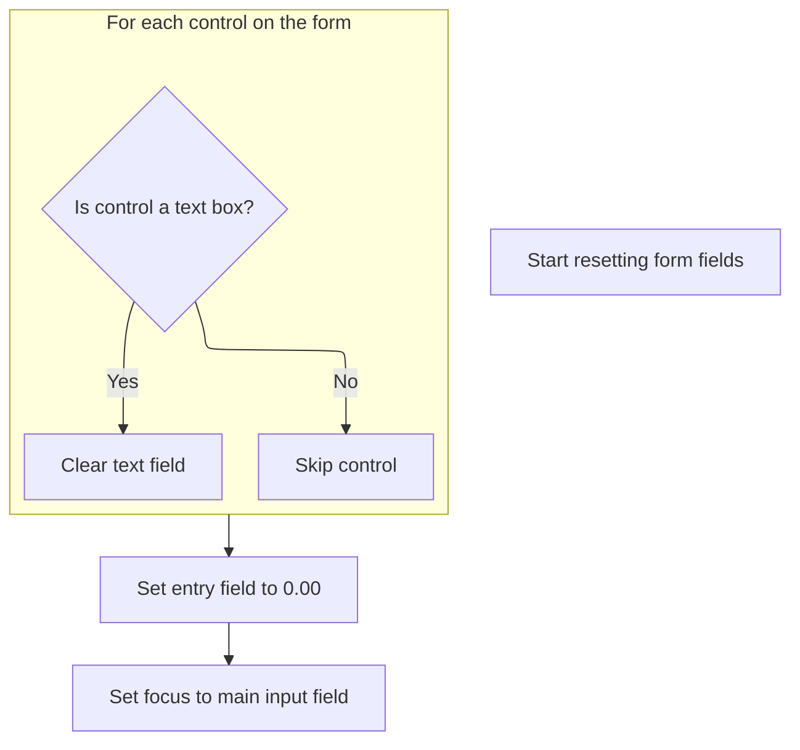

This document describes the flow for saving client and bank details within the client management feature. The process validates and stores information in the database, ensures data integrity, and provides a user-friendly workflow for bulk entry or editing. After saving, the user can add another record or finish, with the form reset or closed accordingly.

# Saving Client and Bank Details with Data Validation

<SwmSnippet path="/HotelManagementSystem/Forms/frmAccounts.frm" line="268">

---

In <SwmToken path="HotelManagementSystem/Forms/frmAccounts.frm" pos="268:4:4" line-data="Private Sub cmdSave_Click()">`cmdSave_Click`</SwmToken>, we check if we're adding or editing a client, set up the recordset accordingly, and push all the client details from the form into the database. We use <SwmToken path="HotelManagementSystem/Forms/frmAccounts.frm" pos="296:11:11" line-data="      .Fields(&quot;CreditTerm&quot;) = toNumber(txtEntry(14).Text)">`toNumber`</SwmToken> for fields like <SwmToken path="HotelManagementSystem/Forms/frmAccounts.frm" pos="296:5:5" line-data="      .Fields(&quot;CreditTerm&quot;) = toNumber(txtEntry(14).Text)">`CreditTerm`</SwmToken> and <SwmToken path="HotelManagementSystem/Forms/frmAccounts.frm" pos="297:5:5" line-data="      .Fields(&quot;CreditLimit&quot;) = toNumber(txtEntry(15).Text)">`CreditLimit`</SwmToken> to make sure user input is stored as numbers, not strings. After updating the main client record, we prep the bank details: clear out old ones, then loop through the grid to add or update each bank account. All of this is wrapped in a transaction so if anything fails, nothing gets saved. Next, we call <SwmToken path="HotelManagementSystem/Forms/frmAccounts.frm" pos="296:11:11" line-data="      .Fields(&quot;CreditTerm&quot;) = toNumber(txtEntry(14).Text)">`toNumber`</SwmToken> from <SwmPath>[HotelManagementSystem/Modules/modFunction.bas](HotelManagementSystem/Modules/modFunction.bas)</SwmPath> to sanitize numeric input before storing.

```visual basic
Private Sub cmdSave_Click()
    On Error GoTo err

    If Trim(txtEntry(1).Text) = "" Then Exit Sub
    
    CN.BeginTrans

    If State = adStateAddMode Or State = adStatePopupMode Then
        RS.AddNew
        
        RS.Fields("ClientID") = PK
        RS.Fields("AddedByFK") = CurrUser.USER_PK
    Else
        RS.Fields("DateModified") = Now
        RS.Fields("LastUserFK") = CurrUser.USER_PK
    End If
    
    With RS
      .Fields("Company") = txtEntry(1).Text
      .Fields("CategoryID") = dcCategory.BoundText
      .Fields("Tin") = txtEntry(2).Text
      .Fields("OwnersName") = txtEntry(3).Text
      .Fields("Address") = txtEntry(4).Text
      .Fields("CityID") = dcCity.BoundText
      .Fields("PurchaserName") = txtEntry(6).Text
      .Fields("Mobile") = txtEntry(7).Text
      .Fields("Landline") = txtEntry(8).Text
      .Fields("Fax") = txtEntry(9).Text
      .Fields("CreditTerm") = toNumber(txtEntry(14).Text)
      .Fields("CreditLimit") = toNumber(txtEntry(15).Text)
      .Fields("BlackListed") = IIf(chkBlackListed.Value = 1, True, False)
      .Fields("Remarks") = txtEntry(16).Text
       
      .Update
    End With

    Dim rsClientBank As New Recordset

    rsClientBank.CursorLocation = adUseClient
    rsClientBank.Open "SELECT * FROM Clients_Bank WHERE ClientID=" & PK, CN, adOpenStatic, adLockOptimistic
    
    DeleteItems
    
    Dim c As Integer
    
    With Grid
        'Save the details of the records
        For c = 1 To cIRowCount
            .Row = c
            If State = adStateAddMode Or State = adStatePopupMode Then
AddNew:
                'Add qty received in Local Purchase Details
                rsClientBank.AddNew

                rsClientBank![ClientID] = PK
                rsClientBank![BankID] = toNumber(.TextMatrix(c, 5))
                rsClientBank![AccountNo] = .TextMatrix(c, 3)
                rsClientBank![AccountName] = .TextMatrix(c, 4)

                rsClientBank.Update
            ElseIf State = adStateEditMode Then
                rsClientBank.Filter = "BankID = " & toNumber(.TextMatrix(c, 5))
            
                If rsClientBank.RecordCount = 0 Then GoTo AddNew

                rsClientBank![ClientID] = PK
                rsClientBank![BankID] = toNumber(.TextMatrix(c, 5))
```

---

</SwmSnippet>

<SwmSnippet path="/HotelManagementSystem/Modules/modFunction.bas" line="182">

---

<SwmToken path="HotelManagementSystem/Modules/modFunction.bas" pos="182:4:4" line-data="Public Function toNumber(ByVal srcCurrency As String, Optional RetZeroIfNegative As Boolean) As Double">`toNumber`</SwmToken> handles converting user-entered currency strings into numbers, cleaning up commas and optionally forcing values below 1 to zero. This keeps numeric fields in the database clean and avoids weird edge cases from user input.

```visual basic
Public Function toNumber(ByVal srcCurrency As String, Optional RetZeroIfNegative As Boolean) As Double
    If srcCurrency = "" Then
        toNumber = 0
    Else
        Dim retValue As Double
        If InStr(1, srcCurrency, ",") > 0 Then
            retValue = Val(Replace(srcCurrency, ",", "", , , vbTextCompare))
        Else
            retValue = Val(srcCurrency)
        End If
        If RetZeroIfNegative = True Then
            If retValue < 1 Then retValue = 0
        End If
        toNumber = retValue
        retValue = 0
    End If
End Function
```

---

</SwmSnippet>

<SwmSnippet path="/HotelManagementSystem/Forms/frmAccounts.frm" line="335">

---

Back in <SwmToken path="HotelManagementSystem/Forms/frmAccounts.frm" pos="268:4:4" line-data="Private Sub cmdSave_Click()">`cmdSave_Click`</SwmToken>, after converting and saving all the client and bank data, we commit the transaction. If we're adding a new client, we prompt the user to add another. If yes, we call <SwmToken path="HotelManagementSystem/Forms/frmAccounts.frm" pos="355:1:1" line-data="            ResetFields">`ResetFields`</SwmToken> to clear the form for the next entry, keeping the workflow fast for bulk input.

```visual basic
                rsClientBank![AccountNo] = .TextMatrix(c, 3)
                rsClientBank![AccountName] = .TextMatrix(c, 4)

                rsClientBank.Update
            End If

        Next c
    End With

    'Clear variables
    c = 0
    Set rsClientBank = Nothing
    
    CN.CommitTrans

    HaveAction = True
    
    If State = adStateAddMode Then
        MsgBox "New record has been successfully saved.", vbInformation
        If MsgBox("Do you want to add another new record?", vbQuestion + vbYesNo) = vbYes Then
            ResetFields
```

---

</SwmSnippet>

## Resetting Form Fields for New Entry



<SwmSnippet path="/HotelManagementSystem/Forms/frmAccounts.frm" line="261">

---

In <SwmToken path="HotelManagementSystem/Forms/frmAccounts.frm" pos="261:4:4" line-data="Private Sub ResetFields()">`ResetFields`</SwmToken>, we call <SwmToken path="HotelManagementSystem/Forms/frmAccounts.frm" pos="262:1:1" line-data="  clearText Me">`clearText`</SwmToken> to wipe all textboxes on the form. This preps the UI for the next client entry, so the user doesn't have to manually clear old data. Next, we jump to <SwmToken path="HotelManagementSystem/Forms/frmAccounts.frm" pos="262:1:1" line-data="  clearText Me">`clearText`</SwmToken> in <SwmPath>[HotelManagementSystem/Modules/modProcedure.bas](HotelManagementSystem/Modules/modProcedure.bas)</SwmPath> to do the actual clearing.

```visual basic
Private Sub ResetFields()
  clearText Me
```

---

</SwmSnippet>

<SwmSnippet path="/HotelManagementSystem/Modules/modProcedure.bas" line="228">

---

<SwmToken path="HotelManagementSystem/Modules/modProcedure.bas" pos="228:4:4" line-data="Public Sub clearText(ByRef sForm As Form)">`clearText`</SwmToken> loops through all controls on the form and tries to clear textboxes, but it's buggy—it doesn't actually clear the text because it sets the control object, not the Text property. Needs a fix if you want it to work.

```visual basic
Public Sub clearText(ByRef sForm As Form)
    Dim Control As Control
    For Each Control In sForm.Controls
        If (TypeOf Control Is TextBox) Then Control = vbNullString
    Next Control
    Set Control = Nothing
End Sub
```

---

</SwmSnippet>

<SwmSnippet path="/HotelManagementSystem/Forms/frmAccounts.frm" line="263">

---

Back in <SwmToken path="HotelManagementSystem/Forms/frmAccounts.frm" pos="261:4:4" line-data="Private Sub ResetFields()">`ResetFields`</SwmToken>, after (attempting to) clear all textboxes, we explicitly set <SwmToken path="HotelManagementSystem/Forms/frmAccounts.frm" pos="264:1:1" line-data="  txtEntry(15).Text = &quot;0.00&quot;">`txtEntry`</SwmToken>(15) to <SwmToken path="HotelManagementSystem/Forms/frmAccounts.frm" pos="264:11:13" line-data="  txtEntry(15).Text = &quot;0.00&quot;">`0.00`</SwmToken> to make sure the credit limit field isn't empty, and put the cursor in <SwmToken path="HotelManagementSystem/Forms/frmAccounts.frm" pos="264:1:1" line-data="  txtEntry(15).Text = &quot;0.00&quot;">`txtEntry`</SwmToken>(1) so the user can start typing right away.

```visual basic
  
  txtEntry(15).Text = "0.00"
  txtEntry(1).SetFocus
End Sub
```

---

</SwmSnippet>

## Post-Save User Interaction and Error Handling

<SwmSnippet path="/HotelManagementSystem/Forms/frmAccounts.frm" line="356">

---

Back in <SwmToken path="HotelManagementSystem/Forms/frmAccounts.frm" pos="371:10:10" line-data="    prompt_err err, Name, &quot;cmdSave_Click&quot;">`cmdSave_Click`</SwmToken>, after <SwmToken path="HotelManagementSystem/Forms/frmAccounts.frm" pos="261:4:4" line-data="Private Sub ResetFields()">`ResetFields`</SwmToken>, we handle user prompts and close the form if needed. If anything goes wrong, we jump to error handling, which is handled in <SwmPath>[HotelManagementSystem/Modules/modProcedure.bas](HotelManagementSystem/Modules/modProcedure.bas)</SwmPath> next.

```visual basic
         Else
            Unload Me
        End If
    ElseIf State = adStatePopupMode Then
        MsgBox "New record has been successfully saved.", vbInformation
        Unload Me
    Else
        MsgBox "Changes in  record has been successfully saved.", vbInformation
        Unload Me
    End If

    Exit Sub

err:
    CN.RollbackTrans
    prompt_err err, Name, "cmdSave_Click"
```

---

</SwmSnippet>

<SwmSnippet path="/HotelManagementSystem/Modules/modProcedure.bas" line="87">

---

<SwmToken path="HotelManagementSystem/Modules/modProcedure.bas" pos="87:4:4" line-data="Public Sub prompt_err(ByVal sError As ErrObject, ByVal ModuleName As String, ByVal OccurIn As String)">`prompt_err`</SwmToken> pops up a message box with error details and writes the error to <SwmPath>[HotelManagementSystem/Error.log](HotelManagementSystem/Error.log)</SwmPath> in the app folder. This helps with debugging and gives the user a clear error message.

```visual basic
Public Sub prompt_err(ByVal sError As ErrObject, ByVal ModuleName As String, ByVal OccurIn As String)
    MsgBox "Error From: " & ModuleName & vbNewLine & _
           "Occur In: " & OccurIn & vbNewLine & _
           "Error Number: " & sError.Number & vbNewLine & _
           "Description: " & sError.Description, vbCritical, "Application Error"
    'Save the error log (The save error log will be display later on in the program)
    Open App.Path & "\Error.log" For Append As #1
        Print #1, Format(Date, "MMM-dd-yyyy") & "~~~~~" & Time & "~~~~~" & sError.Number & "~~~~~" & sError.Description & "~~~~~" & ModuleName & "~~~~~" & OccurIn
    Close #1
End Sub
```

---

</SwmSnippet>

<SwmSnippet path="/HotelManagementSystem/Forms/frmAccounts.frm" line="372">

---

Finally, in <SwmToken path="HotelManagementSystem/Forms/frmAccounts.frm" pos="268:4:4" line-data="Private Sub cmdSave_Click()">`cmdSave_Click`</SwmToken>, we reset the mouse pointer to default so the UI doesn't get stuck in a busy state after saving or error handling.

```visual basic
    Screen.MousePointer = vbDefault
End Sub
```

---

</SwmSnippet>

&nbsp;

*This is an auto-generated document by Swimm 🌊 and has not yet been verified by a human*

<SwmMeta version="3.0.0" repo-id="Z2l0aHViJTNBJTNBY3RzLVZCNi1Qcm9qZWN0cyUzQSUzQVN3aW1tLURlbW8=" repo-name="cts-VB6-Projects"><sup>Powered by [Swimm](https://app.swimm.io/)</sup></SwmMeta>
