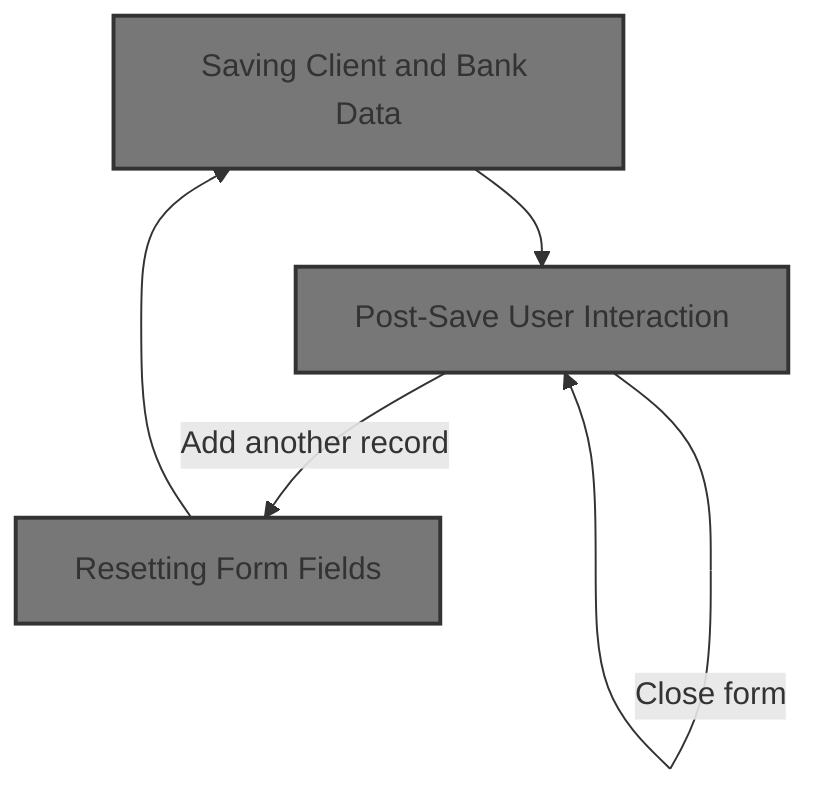
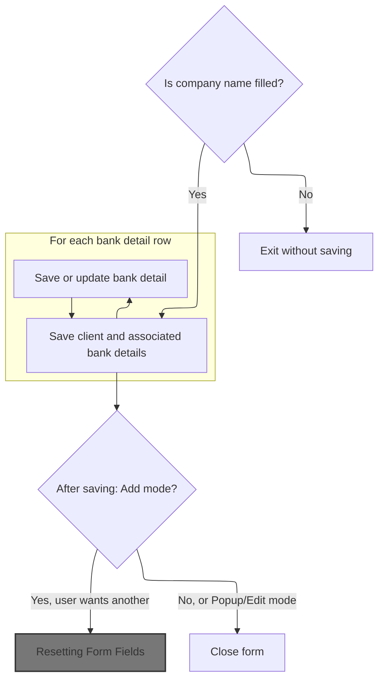
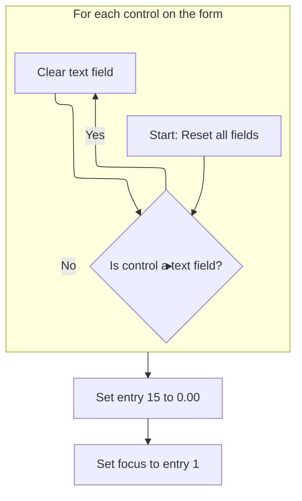
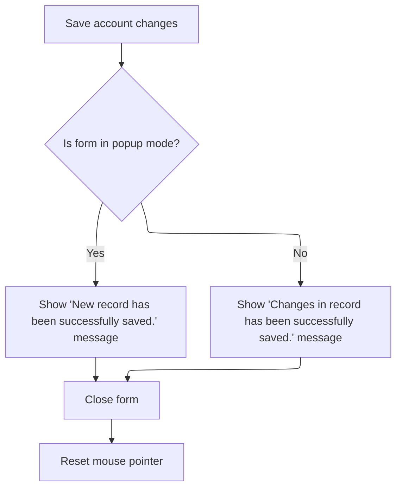

This document describes the flow for saving or updating client and bank information. Users fill out a form with client and bank details, and the system saves the data. After saving, the user can choose to add another record, in which case the form is reset for new input, or close the form.



# Saving Client and Bank Data



<SwmSnippet path="/HotelManagementSystem/Forms/frmAccounts.frm" line="268">

---

In <SwmToken path="HotelManagementSystem/Forms/frmAccounts.frm" pos="268:4:4" line-data="Private Sub cmdSave_Click()">`cmdSave_Click`</SwmToken>, we start by handling three states: adding, popup, and editing. Depending on the state, we either add a new record or update fields for an existing one. Main client details are written to the RS recordset, and we use <SwmToken path="HotelManagementSystem/Forms/frmAccounts.frm" pos="296:11:11" line-data="      .Fields(&quot;CreditTerm&quot;) = toNumber(txtEntry(14).Text)">`toNumber`</SwmToken> to sanitize numeric fields like <SwmToken path="HotelManagementSystem/Forms/frmAccounts.frm" pos="296:5:5" line-data="      .Fields(&quot;CreditTerm&quot;) = toNumber(txtEntry(14).Text)">`CreditTerm`</SwmToken> and <SwmToken path="HotelManagementSystem/Forms/frmAccounts.frm" pos="297:5:5" line-data="      .Fields(&quot;CreditLimit&quot;) = toNumber(txtEntry(15).Text)">`CreditLimit`</SwmToken> before saving. After updating the main record, we open the client's bank details, clear existing entries, and sync them with the grid data. This sets up the data for the next step, where we need to convert user input to numbers reliably, which is why we call the function in <SwmPath>[HotelManagementSystem/Modules/modFunction.bas](HotelManagementSystem/Modules/modFunction.bas)</SwmPath> next.

```visual basic
Private Sub cmdSave_Click()
    On Error GoTo err

    If Trim(txtEntry(1).Text) = "" Then Exit Sub
    
    CN.BeginTrans

    If State = adStateAddMode Or State = adStatePopupMode Then
        RS.AddNew
        
        RS.Fields("ClientID") = PK
        RS.Fields("AddedByFK") = CurrUser.USER_PK
    Else
        RS.Fields("DateModified") = Now
        RS.Fields("LastUserFK") = CurrUser.USER_PK
    End If
    
    With RS
      .Fields("Company") = txtEntry(1).Text
      .Fields("CategoryID") = dcCategory.BoundText
      .Fields("Tin") = txtEntry(2).Text
      .Fields("OwnersName") = txtEntry(3).Text
      .Fields("Address") = txtEntry(4).Text
      .Fields("CityID") = dcCity.BoundText
      .Fields("PurchaserName") = txtEntry(6).Text
      .Fields("Mobile") = txtEntry(7).Text
      .Fields("Landline") = txtEntry(8).Text
      .Fields("Fax") = txtEntry(9).Text
      .Fields("CreditTerm") = toNumber(txtEntry(14).Text)
      .Fields("CreditLimit") = toNumber(txtEntry(15).Text)
      .Fields("BlackListed") = IIf(chkBlackListed.Value = 1, True, False)
      .Fields("Remarks") = txtEntry(16).Text
       
      .Update
    End With

    Dim rsClientBank As New Recordset

    rsClientBank.CursorLocation = adUseClient
    rsClientBank.Open "SELECT * FROM Clients_Bank WHERE ClientID=" & PK, CN, adOpenStatic, adLockOptimistic
    
    DeleteItems
    
    Dim c As Integer
    
    With Grid
        'Save the details of the records
        For c = 1 To cIRowCount
            .Row = c
            If State = adStateAddMode Or State = adStatePopupMode Then
AddNew:
                'Add qty received in Local Purchase Details
                rsClientBank.AddNew

                rsClientBank![ClientID] = PK
                rsClientBank![BankID] = toNumber(.TextMatrix(c, 5))
                rsClientBank![AccountNo] = .TextMatrix(c, 3)
                rsClientBank![AccountName] = .TextMatrix(c, 4)

                rsClientBank.Update
            ElseIf State = adStateEditMode Then
                rsClientBank.Filter = "BankID = " & toNumber(.TextMatrix(c, 5))
            
                If rsClientBank.RecordCount = 0 Then GoTo AddNew

                rsClientBank![ClientID] = PK
                rsClientBank![BankID] = toNumber(.TextMatrix(c, 5))
```

---

</SwmSnippet>

<SwmSnippet path="/HotelManagementSystem/Modules/modFunction.bas" line="182">

---

<SwmToken path="HotelManagementSystem/Modules/modFunction.bas" pos="182:4:4" line-data="Public Function toNumber(ByVal srcCurrency As String, Optional RetZeroIfNegative As Boolean) As Double">`toNumber`</SwmToken> handles converting user-entered currency strings to numbers, stripping out commas if present. If <SwmToken path="HotelManagementSystem/Modules/modFunction.bas" pos="182:17:17" line-data="Public Function toNumber(ByVal srcCurrency As String, Optional RetZeroIfNegative As Boolean) As Double">`RetZeroIfNegative`</SwmToken> is set, it forces any result below 1 to zero. This keeps numeric fields clean and prevents invalid or negative values from being saved.

```visual basic
Public Function toNumber(ByVal srcCurrency As String, Optional RetZeroIfNegative As Boolean) As Double
    If srcCurrency = "" Then
        toNumber = 0
    Else
        Dim retValue As Double
        If InStr(1, srcCurrency, ",") > 0 Then
            retValue = Val(Replace(srcCurrency, ",", "", , , vbTextCompare))
        Else
            retValue = Val(srcCurrency)
        End If
        If RetZeroIfNegative = True Then
            If retValue < 1 Then retValue = 0
        End If
        toNumber = retValue
        retValue = 0
    End If
End Function
```

---

</SwmSnippet>

<SwmSnippet path="/HotelManagementSystem/Forms/frmAccounts.frm" line="335">

---

Back in <SwmToken path="HotelManagementSystem/Forms/frmAccounts.frm" pos="268:4:4" line-data="Private Sub cmdSave_Click()">`cmdSave_Click`</SwmToken>, after updating the main client and bank details, we commit the transaction and prompt the user. If they're adding a new record and choose to continue, we call <SwmToken path="HotelManagementSystem/Forms/frmAccounts.frm" pos="355:1:1" line-data="            ResetFields">`ResetFields`</SwmToken> to clear the form for the next entry. This keeps the workflow fast for entering multiple clients.

```visual basic
                rsClientBank![AccountNo] = .TextMatrix(c, 3)
                rsClientBank![AccountName] = .TextMatrix(c, 4)

                rsClientBank.Update
            End If

        Next c
    End With

    'Clear variables
    c = 0
    Set rsClientBank = Nothing
    
    CN.CommitTrans

    HaveAction = True
    
    If State = adStateAddMode Then
        MsgBox "New record has been successfully saved.", vbInformation
        If MsgBox("Do you want to add another new record?", vbQuestion + vbYesNo) = vbYes Then
            ResetFields
```

---

</SwmSnippet>

## Resetting Form Fields



<SwmSnippet path="/HotelManagementSystem/Forms/frmAccounts.frm" line="261">

---

In <SwmToken path="HotelManagementSystem/Forms/frmAccounts.frm" pos="261:4:4" line-data="Private Sub ResetFields()">`ResetFields`</SwmToken>, we call <SwmToken path="HotelManagementSystem/Forms/frmAccounts.frm" pos="262:1:1" line-data="  clearText Me">`clearText`</SwmToken> with the form as the argument. This wipes all textboxes, prepping the UI for the next client entry. The details of how it clears are handled in <SwmPath>[HotelManagementSystem/Modules/modProcedure.bas](HotelManagementSystem/Modules/modProcedure.bas)</SwmPath>.

```visual basic
Private Sub ResetFields()
  clearText Me
```

---

</SwmSnippet>

<SwmSnippet path="/HotelManagementSystem/Modules/modProcedure.bas" line="228">

---

<SwmToken path="HotelManagementSystem/Modules/modProcedure.bas" pos="228:4:4" line-data="Public Sub clearText(ByRef sForm As Form)">`clearText`</SwmToken> loops through every control on the form and blanks out any <SwmToken path="HotelManagementSystem/Modules/modProcedure.bas" pos="231:10:10" line-data="        If (TypeOf Control Is TextBox) Then Control = vbNullString">`TextBox`</SwmToken>. It's a brute-force way to make sure all text fields are empty, ready for new input.

```visual basic
Public Sub clearText(ByRef sForm As Form)
    Dim Control As Control
    For Each Control In sForm.Controls
        If (TypeOf Control Is TextBox) Then Control = vbNullString
    Next Control
    Set Control = Nothing
End Sub
```

---

</SwmSnippet>

<SwmSnippet path="/HotelManagementSystem/Forms/frmAccounts.frm" line="263">

---

After <SwmToken path="HotelManagementSystem/Forms/frmAccounts.frm" pos="262:1:1" line-data="  clearText Me">`clearText`</SwmToken> runs in <SwmToken path="HotelManagementSystem/Forms/frmAccounts.frm" pos="261:4:4" line-data="Private Sub ResetFields()">`ResetFields`</SwmToken>, we explicitly set <SwmToken path="HotelManagementSystem/Forms/frmAccounts.frm" pos="264:1:1" line-data="  txtEntry(15).Text = &quot;0.00&quot;">`txtEntry`</SwmToken>(15) to <SwmToken path="HotelManagementSystem/Forms/frmAccounts.frm" pos="264:11:13" line-data="  txtEntry(15).Text = &quot;0.00&quot;">`0.00`</SwmToken> (probably a default for <SwmToken path="HotelManagementSystem/Forms/frmAccounts.frm" pos="297:5:5" line-data="      .Fields(&quot;CreditLimit&quot;) = toNumber(txtEntry(15).Text)">`CreditLimit`</SwmToken> or similar), and put the cursor in <SwmToken path="HotelManagementSystem/Forms/frmAccounts.frm" pos="264:1:1" line-data="  txtEntry(15).Text = &quot;0.00&quot;">`txtEntry`</SwmToken>(1) so the user can start entering data right away.

```visual basic
  
  txtEntry(15).Text = "0.00"
  txtEntry(1).SetFocus
End Sub
```

---

</SwmSnippet>

## Post-Save User Interaction



<SwmSnippet path="/HotelManagementSystem/Forms/frmAccounts.frm" line="356">

---

After <SwmToken path="HotelManagementSystem/Forms/frmAccounts.frm" pos="261:4:4" line-data="Private Sub ResetFields()">`ResetFields`</SwmToken> in <SwmToken path="HotelManagementSystem/Forms/frmAccounts.frm" pos="371:10:10" line-data="    prompt_err err, Name, &quot;cmdSave_Click&quot;">`cmdSave_Click`</SwmToken>, we handle user prompts: if not adding another record, or in popup/edit mode, we unload the form. If something goes wrong, we jump to the error handler, which is why we need to call <SwmToken path="HotelManagementSystem/Forms/frmAccounts.frm" pos="371:1:1" line-data="    prompt_err err, Name, &quot;cmdSave_Click&quot;">`prompt_err`</SwmToken> in <SwmPath>[HotelManagementSystem/Modules/modProcedure.bas](HotelManagementSystem/Modules/modProcedure.bas)</SwmPath> next.

```visual basic
         Else
            Unload Me
        End If
    ElseIf State = adStatePopupMode Then
        MsgBox "New record has been successfully saved.", vbInformation
        Unload Me
    Else
        MsgBox "Changes in  record has been successfully saved.", vbInformation
        Unload Me
    End If

    Exit Sub

err:
    CN.RollbackTrans
    prompt_err err, Name, "cmdSave_Click"
```

---

</SwmSnippet>

<SwmSnippet path="/HotelManagementSystem/Modules/modProcedure.bas" line="87">

---

<SwmToken path="HotelManagementSystem/Modules/modProcedure.bas" pos="87:4:4" line-data="Public Sub prompt_err(ByVal sError As ErrObject, ByVal ModuleName As String, ByVal OccurIn As String)">`prompt_err`</SwmToken> pops up a message box with error details and writes a log entry to <SwmPath>[HotelManagementSystem/Error.log](HotelManagementSystem/Error.log)</SwmPath> in the app folder. This way, both the user and support/devs get the info they need if something blows up.

```visual basic
Public Sub prompt_err(ByVal sError As ErrObject, ByVal ModuleName As String, ByVal OccurIn As String)
    MsgBox "Error From: " & ModuleName & vbNewLine & _
           "Occur In: " & OccurIn & vbNewLine & _
           "Error Number: " & sError.Number & vbNewLine & _
           "Description: " & sError.Description, vbCritical, "Application Error"
    'Save the error log (The save error log will be display later on in the program)
    Open App.Path & "\Error.log" For Append As #1
        Print #1, Format(Date, "MMM-dd-yyyy") & "~~~~~" & Time & "~~~~~" & sError.Number & "~~~~~" & sError.Description & "~~~~~" & ModuleName & "~~~~~" & OccurIn
    Close #1
End Sub
```

---

</SwmSnippet>

<SwmSnippet path="/HotelManagementSystem/Forms/frmAccounts.frm" line="372">

---

After handling errors in <SwmToken path="HotelManagementSystem/Forms/frmAccounts.frm" pos="268:4:4" line-data="Private Sub cmdSave_Click()">`cmdSave_Click`</SwmToken>, we reset the mouse pointer to default so the UI doesn't stay in a busy state, even if something failed.

```visual basic
    Screen.MousePointer = vbDefault
End Sub
```

---

</SwmSnippet>

&nbsp;

*This is an auto-generated document by Swimm 🌊 and has not yet been verified by a human*

<SwmMeta version="3.0.0" repo-id="Z2l0aHViJTNBJTNBY3RzLVZCNi1Qcm9qZWN0cyUzQSUzQVN3aW1tLURlbW8=" repo-name="cts-VB6-Projects"><sup>Powered by [Swimm](https://app.swimm.io/)</sup></SwmMeta>
