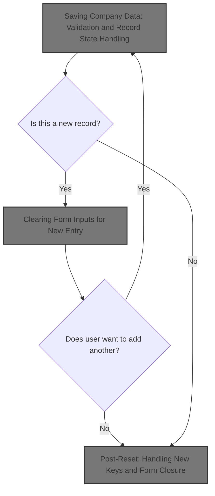
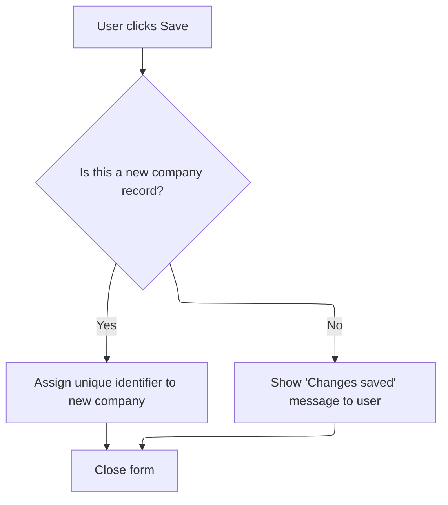

This document explains how company data is saved through the form interface. The flow validates user input, decides whether to add or update a record, saves the data, and guides the user to either add another entry or close the form.



# Saving Company Data: Validation and Record State Handling

<SwmSnippet path="/HotelManagementSystem/Forms/frmCompany.frm" line="251">

---

In <SwmToken path="HotelManagementSystem/Forms/frmCompany.frm" pos="251:4:4" line-data="Private Sub cmdSave_Click()">`cmdSave_Click`</SwmToken>, we start by validating the main company field to make sure it's not empty. If it's empty, we bail out immediately. Then, we check if we're adding a new record or updating an existing one. For new records, we set up the primary key and audit fields like who added it and when. For updates, we just update the modification audit fields. Next, we call the validation logic in <SwmPath>[HotelManagementSystem/Modules/modFunction.bas](HotelManagementSystem/Modules/modFunction.bas)</SwmPath> to enforce required fields before touching the database.

```visual basic
Private Sub cmdSave_Click()
    If is_empty(txtEntry(0), True) = True Then Exit Sub
    
    If State = adStateAddMode Then
        RS.AddNew
        RS.Fields("CompanyID") = PK
        RS.Fields("DateAdded") = Now
        RS.Fields("AddedByFK") = CurrUser.USER_PK
    Else
        RS.Fields("DateModified") = Now
        RS.Fields("LastUserFK") = CurrUser.USER_PK
    End If
```

---

</SwmSnippet>

<SwmSnippet path="/HotelManagementSystem/Modules/modFunction.bas" line="122">

---

<SwmToken path="HotelManagementSystem/Modules/modFunction.bas" pos="122:4:4" line-data="Public Function is_empty(ByRef sText As Variant, Optional UseTagValue As Boolean) As Boolean">`is_empty`</SwmToken> checks if a text field is blank. If it is, it pops up a warning (using the field's Tag for context if requested), and puts the cursor back in the empty field so the user can fix it. If the field isn't empty, it just returns False and we keep going.

```visual basic
Public Function is_empty(ByRef sText As Variant, Optional UseTagValue As Boolean) As Boolean
    On Error Resume Next
    If sText.Text = "" Then
        is_empty = True
        If UseTagValue = True Then
            MsgBox "The field '" & sText.Tag & "' is required.Please check it!", vbExclamation
        Else
            MsgBox "The field is required.Please check it!", vbExclamation
        End If
        sText.SetFocus
    Else
        is_empty = False
    End If
End Function
```

---

</SwmSnippet>

<SwmSnippet path="/HotelManagementSystem/Forms/frmCompany.frm" line="263">

---

We just got back from validating the input. Now, in <SwmToken path="HotelManagementSystem/Forms/frmCompany.frm" pos="251:4:4" line-data="Private Sub cmdSave_Click()">`cmdSave_Click`</SwmToken>, we copy all the form fields into the database record, update it, and set a flag to indicate something changed. If we're adding, we confirm the save and ask if the user wants to add another. If yes, we call <SwmToken path="HotelManagementSystem/Forms/frmCompany.frm" pos="282:1:1" line-data="            ResetFields">`ResetFields`</SwmToken> to clear the form for the next entry.

```visual basic
    'Phill 2:12
    With RS
        .Fields("Company") = txtEntry(0).Text
        .Fields("LastName") = txtEntry(1).Text
        .Fields("FirstName") = txtEntry(2).Text
        .Fields("Address") = txtEntry(3).Text
        .Fields("EmailAddress") = txtEntry(4).Text
        .Fields("TelNo") = txtEntry(5).Text
        .Fields("MobileNo") = txtEntry(6).Text
        .Fields("FaxNo") = txtEntry(7).Text
        
        .Update
    End With
    
    HaveAction = True
    
    If State = adStateAddMode Then
        MsgBox "New record has been successfully saved.", vbInformation
        If MsgBox("Do you want to add another new record?", vbQuestion + vbYesNo) = vbYes Then
            ResetFields
```

---

</SwmSnippet>

## Clearing Form Inputs for New Entry

<SwmSnippet path="/HotelManagementSystem/Forms/frmCompany.frm" line="245">

---

<SwmToken path="HotelManagementSystem/Forms/frmCompany.frm" pos="245:4:4" line-data="Private Sub ResetFields()">`ResetFields`</SwmToken> calls <SwmToken path="HotelManagementSystem/Forms/frmCompany.frm" pos="246:1:1" line-data="    clearText Me">`clearText`</SwmToken> to wipe all textboxes on the form, then puts the cursor in the first input so the user can start entering data immediately. Next, we call the logic in <SwmPath>[HotelManagementSystem/Modules/modProcedure.bas](HotelManagementSystem/Modules/modProcedure.bas)</SwmPath> to actually clear the fields.

```visual basic
Private Sub ResetFields()
    clearText Me
    
    txtEntry(0).SetFocus
End Sub
```

---

</SwmSnippet>

<SwmSnippet path="/HotelManagementSystem/Modules/modProcedure.bas" line="228">

---

<SwmToken path="HotelManagementSystem/Modules/modProcedure.bas" pos="228:4:4" line-data="Public Sub clearText(ByRef sForm As Form)">`clearText`</SwmToken> loops through all controls on the form and blanks out any textboxes it finds. Other controls aren't touched. This keeps the form ready for new input without messing with anything else.

```visual basic
Public Sub clearText(ByRef sForm As Form)
    Dim Control As Control
    For Each Control In sForm.Controls
        If (TypeOf Control Is TextBox) Then Control = vbNullString
    Next Control
    Set Control = Nothing
End Sub
```

---

</SwmSnippet>

## Post-Reset: Handling New Keys and Form Closure



<SwmSnippet path="/HotelManagementSystem/Forms/frmCompany.frm" line="283">

---

We just finished clearing the form with <SwmToken path="HotelManagementSystem/Forms/frmCompany.frm" pos="245:4:4" line-data="Private Sub ResetFields()">`ResetFields`</SwmToken>. Back in <SwmToken path="HotelManagementSystem/Forms/frmCompany.frm" pos="251:4:4" line-data="Private Sub cmdSave_Click()">`cmdSave_Click`</SwmToken>, if the user wants to add another record, we grab a new primary key from the database so the next entry is unique. If not, or if we're just updating, we close the form. Next, we call the logic in <SwmPath>[HotelManagementSystem/Modules/modADO.bas](HotelManagementSystem/Modules/modADO.bas)</SwmPath> to get the new key.

```visual basic
            PK = getIndex("Company")
         Else
            Unload Me
        End If
    Else
        MsgBox "Changes in  record has been successfully saved.", vbInformation
        Unload Me
    End If
End Sub
```

---

</SwmSnippet>

<SwmSnippet path="/HotelManagementSystem/Modules/modADO.bas" line="35">

---

<SwmToken path="HotelManagementSystem/Modules/modADO.bas" pos="35:4:4" line-data="Public Function getIndex(ByVal srcTable As String) As Long">`getIndex`</SwmToken> grabs the next available key for a table from the KEY GENERATOR table, bumps it up by one, and returns the old value. If the field is missing, it just starts at 1. This keeps keys unique and sequential for new records.

```visual basic
Public Function getIndex(ByVal srcTable As String) As Long
    On Error GoTo err
    Dim RS As New Recordset
    Dim RI As Long
    
    RS.CursorLocation = adUseClient
    RS.Open "SELECT * FROM [KEY GENERATOR] WHERE TableName = '" & srcTable & "'", CN, adOpenStatic, adLockOptimistic
    
    RI = RS.Fields("NextNo")
    CN.BeginTrans
    RS.Fields("NextNo") = RI + 1
    RS.Update
    CN.CommitTrans
    getIndex = RI
    
    srcTable = ""
    RI = 0
    Set RS = Nothing
    Exit Function
err:
        ''Error when incounter a null value
        If err.Number = 94 Then
            getIndex = 1
            Resume Next
        Else
            MsgBox err.Description
        End If
        CN.RollbackTrans
End Function
```

---

</SwmSnippet>

&nbsp;

*This is an auto-generated document by Swimm 🌊 and has not yet been verified by a human*

<SwmMeta version="3.0.0" repo-id="Z2l0aHViJTNBJTNBY3RzLVZCNi1Qcm9qZWN0cyUzQSUzQVN3aW1tLURlbW8=" repo-name="cts-VB6-Projects"><sup>Powered by [Swimm](https://app.swimm.io/)</sup></SwmMeta>
