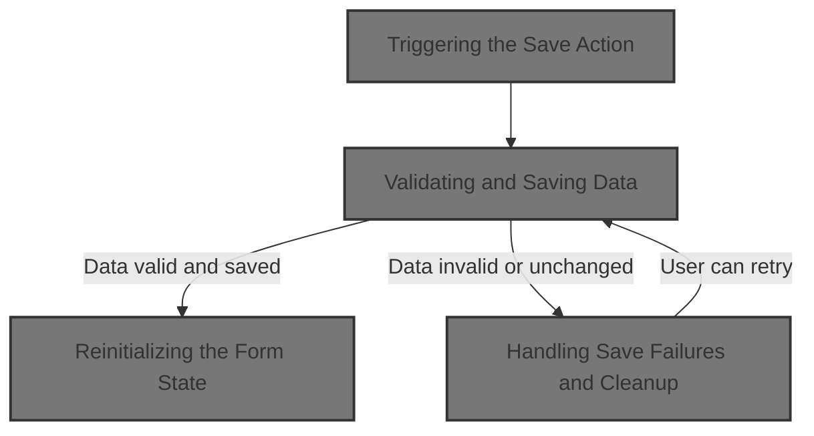

This document explains how users save counseling session data. When the Save button is clicked, the system validates the form, saves the data if appropriate, and resets the form for new input. This ensures only meaningful updates are stored and the form is always ready for new entries.



# Triggering the Save Action

<SwmSnippet path="/BK App/Form/frmkonseling.frm" line="361">

---

In <SwmToken path="BK App/Form/frmkonseling.frm" pos="361:4:4" line-data="Private Sub Command3_Click()">`Command3_Click`</SwmToken>, we just delegate the button click to <SwmToken path="BK App/Form/frmkonseling.frm" pos="362:3:3" line-data="    Call mnuSave">`mnuSave`</SwmToken>. No logic here—just a handoff so all the save-related checks and actions are handled in one place.

```visual basic
Private Sub Command3_Click()
    Call mnuSave
```

---

</SwmSnippet>

## Validating and Saving Data

<SwmSnippet path="/BK App/Form/frmkonseling.frm" line="364">

---

In <SwmToken path="BK App/Form/frmkonseling.frm" pos="364:4:4" line-data="Private Sub mnuSave()">`mnuSave`</SwmToken>, we check if the form is empty or unchanged using <SwmToken path="BK App/Form/frmkonseling.frm" pos="366:2:2" line-data="If DataMode = EN_NEW Then">`DataMode`</SwmToken>. If it's not ready to save, we bail out with a message. Otherwise, we call <SwmToken path="BK App/Form/frmkonseling.frm" pos="373:2:2" line-data="If SaveData(&quot;&quot; &amp; txtid.text, Now, &quot;&quot; &amp; txtnis.text, &quot;&quot; &amp; txtnip.text, &quot;&quot; &amp; txtmasalah.text, &quot;&quot; &amp; txtpenangan.text, &quot;&quot; &amp; txtket.text) &gt; 0 Then">`SaveData`</SwmToken> to actually write the data.

```visual basic
Private Sub mnuSave()
On Error GoTo Hell
If DataMode = EN_NEW Then
    MsgBox "Data harus diisi dulu" & vbCrLf & "Simpan data dibatalkan", vbExclamation, "Simpan Data"
    Exit Sub
ElseIf DataMode = EN_SAVED Then
    MsgBox "Tidak ada data yang berubah" & vbCrLf & "Simpan data dibatalkan", vbExclamation, "Simpan Data"
    Exit Sub
End If
If SaveData("" & txtid.text, Now, "" & txtnis.text, "" & txtnip.text, "" & txtmasalah.text, "" & txtpenangan.text, "" & txtket.text) > 0 Then
```

---

</SwmSnippet>

<SwmSnippet path="/BK App/Form/frmkonseling.frm" line="385">

---

<SwmToken path="BK App/Form/frmkonseling.frm" pos="385:4:4" line-data="Private Function SaveData(IDKonseling As Long, tgl As Date, NIS As Integer, NIP As String, _">`SaveData`</SwmToken> decides if we're adding or editing based on <SwmToken path="BK App/Form/frmkonseling.frm" pos="387:2:2" line-data="If DataMode = EN_NEW_CHANGED Then">`DataMode`</SwmToken>. It calls the right method on <SwmToken path="BK App/Form/frmkonseling.frm" pos="388:1:1" line-data="    oBim.Add IDKonseling, tgl, NIS, NIP, Permasalahan, Penanganan, Keterangan">`oBim`</SwmToken>, marks the data as saved, and returns 1 for success.

```visual basic
Private Function SaveData(IDKonseling As Long, tgl As Date, NIS As Integer, NIP As String, _
Permasalahan As String, Penanganan As String, Keterangan As String) As Integer
If DataMode = EN_NEW_CHANGED Then
    oBim.Add IDKonseling, tgl, NIS, NIP, Permasalahan, Penanganan, Keterangan
ElseIf DataMode = EN_LOAD_CHANGED Then
    oBim.Edit IDKonseling, tgl, NIS, NIP, Permasalahan, Penanganan, Keterangan
End If
DataMode = EN_SAVED
SaveData = 1
End Function
```

---

</SwmSnippet>

<SwmSnippet path="/BK App/Form/frmkonseling.frm" line="374">

---

Back in <SwmToken path="BK App/Form/frmkonseling.frm" pos="362:3:3" line-data="    Call mnuSave">`mnuSave`</SwmToken>, after a successful save, we show a success message and call <SwmToken path="BK App/Form/frmkonseling.frm" pos="375:3:3" line-data="    Call New_data">`New_data`</SwmToken> to clear out the form for the next input.

```visual basic
    MsgBox "Data BERHASIL disimpan", vbInformation, "Simpan Data"
    Call New_data
```

---

</SwmSnippet>

<SwmSnippet path="/BK App/Form/frmkonseling.frm" line="407">

---

<SwmToken path="BK App/Form/frmkonseling.frm" pos="407:4:4" line-data="Private Sub New_data()">`New_data`</SwmToken> just wipes all the text fields—IDs, names, problem descriptions—so the form is blank and ready for new input.

```visual basic
Private Sub New_data()
    txtid.text = ""
    txtnamaguru.text = ""
    txtnamasiswa.text = ""
    txtnip.text = ""
    txtnis.text = ""
    txtmasalah.text = ""
    txtpenangan.text = ""
    txtket.text = ""
End Sub
```

---

</SwmSnippet>

<SwmSnippet path="/BK App/Form/frmkonseling.frm" line="376">

---

Back in <SwmToken path="BK App/Form/frmkonseling.frm" pos="362:3:3" line-data="    Call mnuSave">`mnuSave`</SwmToken>, after clearing the form, we call <SwmToken path="BK App/Form/frmkonseling.frm" pos="376:1:1" line-data="    Form_Load">`Form_Load`</SwmToken> to reinitialize everything—objects, lists, and generate a new ID.

```visual basic
    Form_Load
```

---

</SwmSnippet>

### Reinitializing the Form State

<SwmSnippet path="/BK App/Form/frmkonseling.frm" line="395">

---

In <SwmToken path="BK App/Form/frmkonseling.frm" pos="395:4:4" line-data="Private Sub Form_Load()">`Form_Load`</SwmToken>, we spin up new objects for handling counseling, students, and teachers, then clear the form fields again with <SwmToken path="BK App/Form/frmkonseling.frm" pos="399:1:1" line-data="    New_data">`New_data`</SwmToken> to make sure everything starts clean.

```visual basic
Private Sub Form_Load()
    Set oBim = New DLLBK.cBK
    Set oSis = New DLLBK.Csiswa
    Set oGuru = New DLLBK.cGuru
    New_data
```

---

</SwmSnippet>

<SwmSnippet path="/BK App/Form/frmkonseling.frm" line="400">

---

After clearing the form in <SwmToken path="BK App/Form/frmkonseling.frm" pos="376:1:1" line-data="    Form_Load">`Form_Load`</SwmToken>, we refresh the list of records and generate a new ID by combining today's date with the next available number, then set it in the ID field.

```visual basic
    oBim.List (True)
    id = Format(Now, "DD")
    id = id & Format(Now, "MM")
    id = id & Format(Now, "YYYY")
    txtid.text = id & oBim.Jumlah + 1
End Sub
```

---

</SwmSnippet>

### Handling Save Failures and Cleanup

<SwmSnippet path="/BK App/Form/frmkonseling.frm" line="377">

---

Back in <SwmToken path="BK App/Form/frmkonseling.frm" pos="362:3:3" line-data="    Call mnuSave">`mnuSave`</SwmToken>, if saving fails, we just show an error message and exit—no reset or reload, so the user can fix the issue and try again.

```visual basic
Else
    MsgBox "Data GAGAL disimpan", vbCritical, "Simpan Data"
End If
Exit Sub
Hell:
    MsgBox Err.Description, vbCritical, "Internal"
    'Resume Next
End Sub
```

---

</SwmSnippet>

## Completing the Save Trigger

<SwmSnippet path="/BK App/Form/frmkonseling.frm" line="363">

---

Back in <SwmToken path="BK App/Form/frmkonseling.frm" pos="361:4:4" line-data="Private Sub Command3_Click()">`Command3_Click`</SwmToken>, after calling <SwmToken path="BK App/Form/frmkonseling.frm" pos="362:3:3" line-data="    Call mnuSave">`mnuSave`</SwmToken>, we're done—no extra logic here.

```visual basic
End Sub
```

---

</SwmSnippet>

&nbsp;

*This is an auto-generated document by Swimm 🌊 and has not yet been verified by a human*

<SwmMeta version="3.0.0" repo-id="Z2l0aHViJTNBJTNBY3RzLVZCNi1Qcm9qZWN0cyUzQSUzQVN3aW1tLURlbW8=" repo-name="cts-VB6-Projects"><sup>Powered by [Swimm](https://app.swimm.io/)</sup></SwmMeta>
