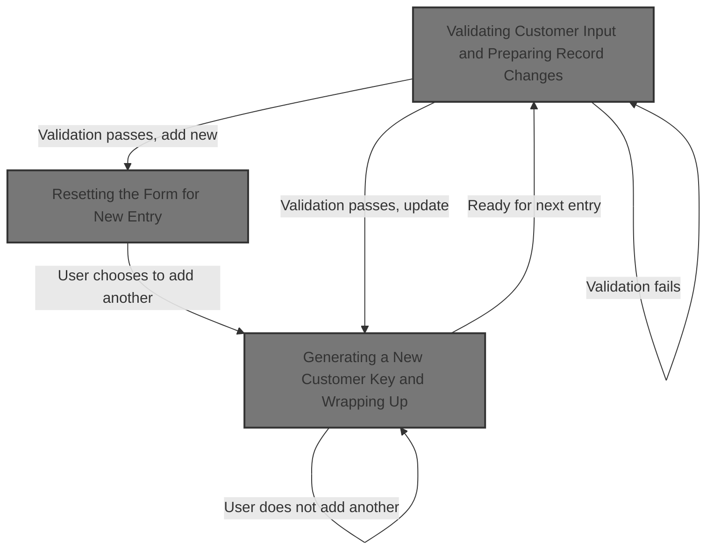

This document explains how customer information is saved in the Hotel Management System. The process involves validating user input, saving a new or updated record, and optionally preparing the form for additional entries.



# Validating Customer Input and Preparing Record Changes

<SwmSnippet path="/HotelManagementSystem/Forms/frmCustomers.frm" line="232">

---

In <SwmToken path="HotelManagementSystem/Forms/frmCustomers.frm" pos="232:4:4" line-data="Private Sub cmdSave_Click()">`cmdSave_Click`</SwmToken>, we check if the main customer fields are filled. If not, we bail out early. Next, we call the validation logic in <SwmPath>[HotelManagementSystem/Modules/modFunction.bas](HotelManagementSystem/Modules/modFunction.bas)</SwmPath> to handle the actual check and user notification.

```visual basic
Private Sub cmdSave_Click()
    If is_empty(txtEntry(0), True) = True Then Exit Sub
    If is_empty(txtEntry(1), True) = True Then Exit Sub
```

---

</SwmSnippet>

<SwmSnippet path="/HotelManagementSystem/Modules/modFunction.bas" line="122">

---

<SwmToken path="HotelManagementSystem/Modules/modFunction.bas" pos="122:4:4" line-data="Public Function is_empty(ByRef sText As Variant, Optional UseTagValue As Boolean) As Boolean">`is_empty`</SwmToken> checks if a text field is blank. If so, it pops up a warning (customized with the field's Tag if requested), and puts the cursor back in the empty field so the user can fix it.

```visual basic
Public Function is_empty(ByRef sText As Variant, Optional UseTagValue As Boolean) As Boolean
    On Error Resume Next
    If sText.Text = "" Then
        is_empty = True
        If UseTagValue = True Then
            MsgBox "The field '" & sText.Tag & "' is required.Please check it!", vbExclamation
        Else
            MsgBox "The field is required.Please check it!", vbExclamation
        End If
        sText.SetFocus
    Else
        is_empty = False
    End If
End Function
```

---

</SwmSnippet>

<SwmSnippet path="/HotelManagementSystem/Forms/frmCustomers.frm" line="235">

---

Back in <SwmToken path="HotelManagementSystem/Forms/frmCustomers.frm" pos="232:4:4" line-data="Private Sub cmdSave_Click()">`cmdSave_Click`</SwmToken>, after validation, we either add or update the customer record, fill in all the fields, and save. If we're adding, we prompt the user about adding another. If yes, we call <SwmToken path="HotelManagementSystem/Forms/frmCustomers.frm" pos="263:1:1" line-data="            ResetFields">`ResetFields`</SwmToken> to clear the form for the next entry.

```visual basic
    
    If State = adStateAddMode Then
        RS.AddNew
        RS.Fields("CustomerID") = PK
        RS.Fields("DateAdded") = Now
        RS.Fields("AddedByFK") = CurrUser.USER_PK
    Else
        RS.Fields("DateModified") = Now
        RS.Fields("LastUserFK") = CurrUser.USER_PK
    End If
    'Phill 2:12
    With RS
        .Fields("LastName") = txtEntry(0).Text
        .Fields("FirstName") = txtEntry(1).Text
        .Fields("Address") = txtEntry(2).Text
        .Fields("EmailAddress") = txtEntry(3).Text
        .Fields("TelNo") = txtEntry(4).Text
        .Fields("MobileNo") = txtEntry(5).Text
        .Fields("FaxNo") = txtEntry(6).Text
        
        .Update
    End With
    
    HaveAction = True
    
    If State = adStateAddMode Then
        MsgBox "New record has been successfully saved.", vbInformation
        If MsgBox("Do you want to add another new record?", vbQuestion + vbYesNo) = vbYes Then
            ResetFields
```

---

</SwmSnippet>

## Resetting the Form for New Entry

<SwmSnippet path="/HotelManagementSystem/Forms/frmCustomers.frm" line="226">

---

In <SwmToken path="HotelManagementSystem/Forms/frmCustomers.frm" pos="226:4:4" line-data="Private Sub ResetFields()">`ResetFields`</SwmToken>, we clear all text fields on the form by calling <SwmToken path="HotelManagementSystem/Forms/frmCustomers.frm" pos="227:1:1" line-data="    clearText Me">`clearText`</SwmToken> in <SwmPath>[HotelManagementSystem/Modules/modProcedure.bas](HotelManagementSystem/Modules/modProcedure.bas)</SwmPath>. This wipes out any previous input so the form is ready for the next customer.

```visual basic
Private Sub ResetFields()
    clearText Me
```

---

</SwmSnippet>

<SwmSnippet path="/HotelManagementSystem/Modules/modProcedure.bas" line="228">

---

<SwmToken path="HotelManagementSystem/Modules/modProcedure.bas" pos="228:4:4" line-data="Public Sub clearText(ByRef sForm As Form)">`clearText`</SwmToken> loops through all controls on the form and blanks out any <SwmToken path="HotelManagementSystem/Modules/modProcedure.bas" pos="231:10:10" line-data="        If (TypeOf Control Is TextBox) Then Control = vbNullString">`TextBox`</SwmToken>. Only standard <SwmToken path="HotelManagementSystem/Modules/modProcedure.bas" pos="231:10:10" line-data="        If (TypeOf Control Is TextBox) Then Control = vbNullString">`TextBox`</SwmToken> controls get cleared—custom or nested controls are ignored.

```visual basic
Public Sub clearText(ByRef sForm As Form)
    Dim Control As Control
    For Each Control In sForm.Controls
        If (TypeOf Control Is TextBox) Then Control = vbNullString
    Next Control
    Set Control = Nothing
End Sub
```

---

</SwmSnippet>

<SwmSnippet path="/HotelManagementSystem/Forms/frmCustomers.frm" line="228">

---

Back in <SwmToken path="HotelManagementSystem/Forms/frmCustomers.frm" pos="226:4:4" line-data="Private Sub ResetFields()">`ResetFields`</SwmToken>, after clearing, we put the cursor in the first field so the user can immediately start entering the next customer.

```visual basic
    
    txtEntry(0).SetFocus
End Sub
```

---

</SwmSnippet>

## Generating a New Customer Key and Wrapping Up

<SwmSnippet path="/HotelManagementSystem/Forms/frmCustomers.frm" line="264">

---

Back in <SwmToken path="HotelManagementSystem/Forms/frmCustomers.frm" pos="232:4:4" line-data="Private Sub cmdSave_Click()">`cmdSave_Click`</SwmToken>, after resetting the form, we fetch a new unique customer key by calling <SwmToken path="HotelManagementSystem/Forms/frmCustomers.frm" pos="264:5:5" line-data="            PK = getIndex(&quot;Customers&quot;)">`getIndex`</SwmToken> in <SwmPath>[HotelManagementSystem/Modules/modADO.bas](HotelManagementSystem/Modules/modADO.bas)</SwmPath>. This preps the form for the next entry.

```visual basic
            PK = getIndex("Customers")
```

---

</SwmSnippet>

<SwmSnippet path="/HotelManagementSystem/Modules/modADO.bas" line="35">

---

<SwmToken path="HotelManagementSystem/Modules/modADO.bas" pos="35:4:4" line-data="Public Function getIndex(ByVal srcTable As String) As Long">`getIndex`</SwmToken> grabs the next available key for the Customers table, bumps it up by one, and returns the old value. This guarantees a unique ID for each new customer.

```visual basic
Public Function getIndex(ByVal srcTable As String) As Long
    On Error GoTo err
    Dim RS As New Recordset
    Dim RI As Long
    
    RS.CursorLocation = adUseClient
    RS.Open "SELECT * FROM [KEY GENERATOR] WHERE TableName = '" & srcTable & "'", CN, adOpenStatic, adLockOptimistic
    
    RI = RS.Fields("NextNo")
    CN.BeginTrans
    RS.Fields("NextNo") = RI + 1
    RS.Update
    CN.CommitTrans
    getIndex = RI
    
    srcTable = ""
    RI = 0
    Set RS = Nothing
    Exit Function
err:
        ''Error when incounter a null value
        If err.Number = 94 Then
            getIndex = 1
            Resume Next
        Else
            MsgBox err.Description
        End If
        CN.RollbackTrans
End Function
```

---

</SwmSnippet>

<SwmSnippet path="/HotelManagementSystem/Forms/frmCustomers.frm" line="265">

---

Finally, back in <SwmToken path="HotelManagementSystem/Forms/frmCustomers.frm" pos="232:4:4" line-data="Private Sub cmdSave_Click()">`cmdSave_Click`</SwmToken>, if the user doesn't want to add another record, or if we're just updating, we close the form. Otherwise, the flow loops for the next entry.

```visual basic
         Else
            Unload Me
        End If
    Else
        MsgBox "Changes in  record has been successfully saved.", vbInformation
        Unload Me
    End If
End Sub
```

---

</SwmSnippet>

&nbsp;

*This is an auto-generated document by Swimm 🌊 and has not yet been verified by a human*

<SwmMeta version="3.0.0" repo-id="Z2l0aHViJTNBJTNBY3RzLVZCNi1Qcm9qZWN0cyUzQSUzQVN3aW1tLURlbW8=" repo-name="cts-VB6-Projects"><sup>Powered by [Swimm](https://app.swimm.io/)</sup></SwmMeta>
