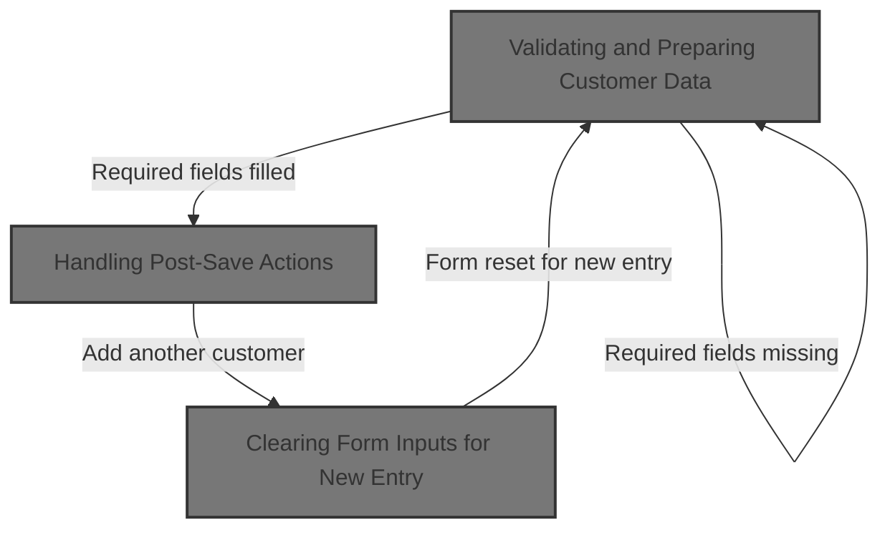

This document outlines the process for saving customer information in the hotel management system. Users enter customer details, which are validated and then saved as new or updated records. After saving, users can choose to add another customer or finish, with the form resetting for new entries as needed.



# Validating and Preparing Customer Data

<SwmSnippet path="/HotelManagementSystem/Forms/frmCustomers.frm" line="232">

---

In <SwmToken path="HotelManagementSystem/Forms/frmCustomers.frm" pos="232:4:4" line-data="Private Sub cmdSave_Click()">`cmdSave_Click`</SwmToken>, we start by validating the required fields using <SwmToken path="HotelManagementSystem/Forms/frmCustomers.frm" pos="233:3:3" line-data="    If is_empty(txtEntry(0), True) = True Then Exit Sub">`is_empty`</SwmToken>. If any required field is empty, we bail out early. After validation, the code checks if we're adding a new record or updating an existing one. For new records, it sets up the primary key, date, and user info; for updates, it just updates the modification date and user. We need to call <SwmToken path="HotelManagementSystem/Forms/frmCustomers.frm" pos="233:3:3" line-data="    If is_empty(txtEntry(0), True) = True Then Exit Sub">`is_empty`</SwmToken> from <SwmPath>[HotelManagementSystem/Modules/modFunction.bas](HotelManagementSystem/Modules/modFunction.bas)</SwmPath> next to enforce the required field checks before doing anything else.

```visual basic
Private Sub cmdSave_Click()
    If is_empty(txtEntry(0), True) = True Then Exit Sub
    If is_empty(txtEntry(1), True) = True Then Exit Sub
    
    If State = adStateAddMode Then
        RS.AddNew
        RS.Fields("CustomerID") = PK
        RS.Fields("DateAdded") = Now
        RS.Fields("AddedByFK") = CurrUser.USER_PK
    Else
        RS.Fields("DateModified") = Now
        RS.Fields("LastUserFK") = CurrUser.USER_PK
    End If
```

---

</SwmSnippet>

<SwmSnippet path="/HotelManagementSystem/Modules/modFunction.bas" line="122">

---

<SwmToken path="HotelManagementSystem/Modules/modFunction.bas" pos="122:4:4" line-data="Public Function is_empty(ByRef sText As Variant, Optional UseTagValue As Boolean) As Boolean">`is_empty`</SwmToken> checks if a text field is empty. If it is, it pops up a warning (optionally naming the field using Tag), sets focus back to the field, and returns True. If not, it just returns False. This stops the flow in <SwmToken path="HotelManagementSystem/Forms/frmCustomers.frm" pos="232:4:4" line-data="Private Sub cmdSave_Click()">`cmdSave_Click`</SwmToken> if required fields are missing.

```visual basic
Public Function is_empty(ByRef sText As Variant, Optional UseTagValue As Boolean) As Boolean
    On Error Resume Next
    If sText.Text = "" Then
        is_empty = True
        If UseTagValue = True Then
            MsgBox "The field '" & sText.Tag & "' is required.Please check it!", vbExclamation
        Else
            MsgBox "The field is required.Please check it!", vbExclamation
        End If
        sText.SetFocus
    Else
        is_empty = False
    End If
End Function
```

---

</SwmSnippet>

<SwmSnippet path="/HotelManagementSystem/Forms/frmCustomers.frm" line="245">

---

Back in <SwmToken path="HotelManagementSystem/Forms/frmCustomers.frm" pos="232:4:4" line-data="Private Sub cmdSave_Click()">`cmdSave_Click`</SwmToken>, after validating fields, we fill the recordset with the form data and update it. If a new record was added, we prompt the user to add another. If yes, we call <SwmToken path="HotelManagementSystem/Forms/frmCustomers.frm" pos="263:1:1" line-data="            ResetFields">`ResetFields`</SwmToken> to clear the form for the next entry. If not, or if it was just an update, we close the form.

```visual basic
    'Phill 2:12
    With RS
        .Fields("LastName") = txtEntry(0).Text
        .Fields("FirstName") = txtEntry(1).Text
        .Fields("Address") = txtEntry(2).Text
        .Fields("EmailAddress") = txtEntry(3).Text
        .Fields("TelNo") = txtEntry(4).Text
        .Fields("MobileNo") = txtEntry(5).Text
        .Fields("FaxNo") = txtEntry(6).Text
        
        .Update
    End With
    
    HaveAction = True
    
    If State = adStateAddMode Then
        MsgBox "New record has been successfully saved.", vbInformation
        If MsgBox("Do you want to add another new record?", vbQuestion + vbYesNo) = vbYes Then
            ResetFields
```

---

</SwmSnippet>

## Clearing Form Inputs for New Entry

<SwmSnippet path="/HotelManagementSystem/Forms/frmCustomers.frm" line="226">

---

<SwmToken path="HotelManagementSystem/Forms/frmCustomers.frm" pos="226:4:4" line-data="Private Sub ResetFields()">`ResetFields`</SwmToken> calls <SwmToken path="HotelManagementSystem/Forms/frmCustomers.frm" pos="227:1:1" line-data="    clearText Me">`clearText`</SwmToken> to wipe all text fields on the form, then puts the cursor in the first field so the user can start entering data right away. We call <SwmToken path="HotelManagementSystem/Forms/frmCustomers.frm" pos="227:1:1" line-data="    clearText Me">`clearText`</SwmToken> next to handle the actual clearing.

```visual basic
Private Sub ResetFields()
    clearText Me
    
    txtEntry(0).SetFocus
End Sub
```

---

</SwmSnippet>

<SwmSnippet path="/HotelManagementSystem/Modules/modProcedure.bas" line="228">

---

<SwmToken path="HotelManagementSystem/Modules/modProcedure.bas" pos="228:4:4" line-data="Public Sub clearText(ByRef sForm As Form)">`clearText`</SwmToken> loops through all controls on the form and tries to clear TextBoxes by setting the control to <SwmToken path="HotelManagementSystem/Modules/modProcedure.bas" pos="231:19:19" line-data="        If (TypeOf Control Is TextBox) Then Control = vbNullString">`vbNullString`</SwmToken>. But in VB6, this doesn't actually clear the text—should be setting the Text property instead. So, fields might not actually get cleared here.

```visual basic
Public Sub clearText(ByRef sForm As Form)
    Dim Control As Control
    For Each Control In sForm.Controls
        If (TypeOf Control Is TextBox) Then Control = vbNullString
    Next Control
    Set Control = Nothing
End Sub
```

---

</SwmSnippet>

## Handling Post-Save Actions

<SwmSnippet path="/HotelManagementSystem/Forms/frmCustomers.frm" line="264">

---

We just got back from <SwmToken path="HotelManagementSystem/Forms/frmCustomers.frm" pos="226:4:4" line-data="Private Sub ResetFields()">`ResetFields`</SwmToken> in <SwmToken path="HotelManagementSystem/Forms/frmCustomers.frm" pos="232:4:4" line-data="Private Sub cmdSave_Click()">`cmdSave_Click`</SwmToken>. If the user wants to add another record, we call <SwmToken path="HotelManagementSystem/Forms/frmCustomers.frm" pos="264:5:5" line-data="            PK = getIndex(&quot;Customers&quot;)">`getIndex`</SwmToken> to get a new primary key for the next entry. If not, or if we just updated, we close the form. This keeps the flow ready for either another entry or wraps up cleanly.

```visual basic
            PK = getIndex("Customers")
         Else
            Unload Me
        End If
    Else
        MsgBox "Changes in  record has been successfully saved.", vbInformation
        Unload Me
    End If
End Sub
```

---

</SwmSnippet>

<SwmSnippet path="/HotelManagementSystem/Modules/modADO.bas" line="35">

---

<SwmToken path="HotelManagementSystem/Modules/modADO.bas" pos="35:4:4" line-data="Public Function getIndex(ByVal srcTable As String) As Long">`getIndex`</SwmToken> grabs the next available key for a table from the KEY GENERATOR table, bumps it up by one, and returns the old value as the new primary key. It uses a transaction so the increment is safe even if multiple users are adding records at the same time. If the value is missing, it starts at 1.

```visual basic
Public Function getIndex(ByVal srcTable As String) As Long
    On Error GoTo err
    Dim RS As New Recordset
    Dim RI As Long
    
    RS.CursorLocation = adUseClient
    RS.Open "SELECT * FROM [KEY GENERATOR] WHERE TableName = '" & srcTable & "'", CN, adOpenStatic, adLockOptimistic
    
    RI = RS.Fields("NextNo")
    CN.BeginTrans
    RS.Fields("NextNo") = RI + 1
    RS.Update
    CN.CommitTrans
    getIndex = RI
    
    srcTable = ""
    RI = 0
    Set RS = Nothing
    Exit Function
err:
        ''Error when incounter a null value
        If err.Number = 94 Then
            getIndex = 1
            Resume Next
        Else
            MsgBox err.Description
        End If
        CN.RollbackTrans
End Function
```

---

</SwmSnippet>

&nbsp;

*This is an auto-generated document by Swimm 🌊 and has not yet been verified by a human*

<SwmMeta version="3.0.0" repo-id="Z2l0aHViJTNBJTNBY3RzLVZCNi1Qcm9qZWN0cyUzQSUzQVN3aW1tLURlbW8=" repo-name="cts-VB6-Projects"><sup>Powered by [Swimm](https://app.swimm.io/)</sup></SwmMeta>
